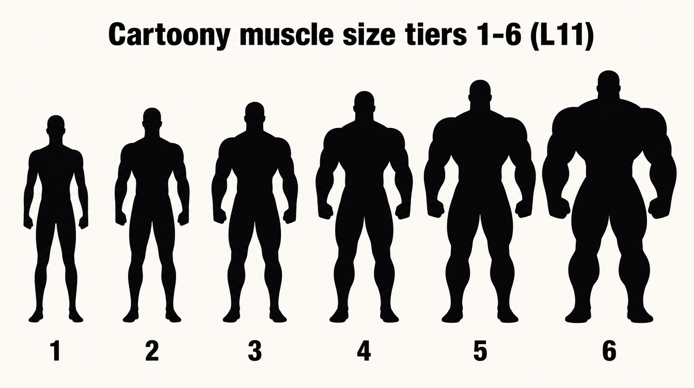
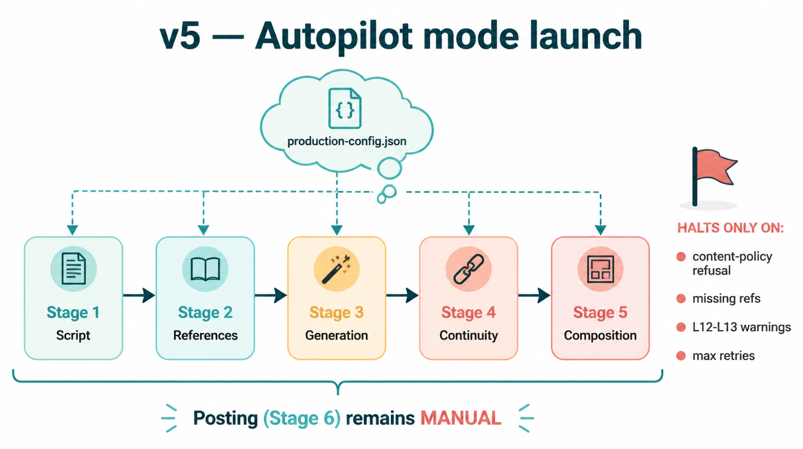
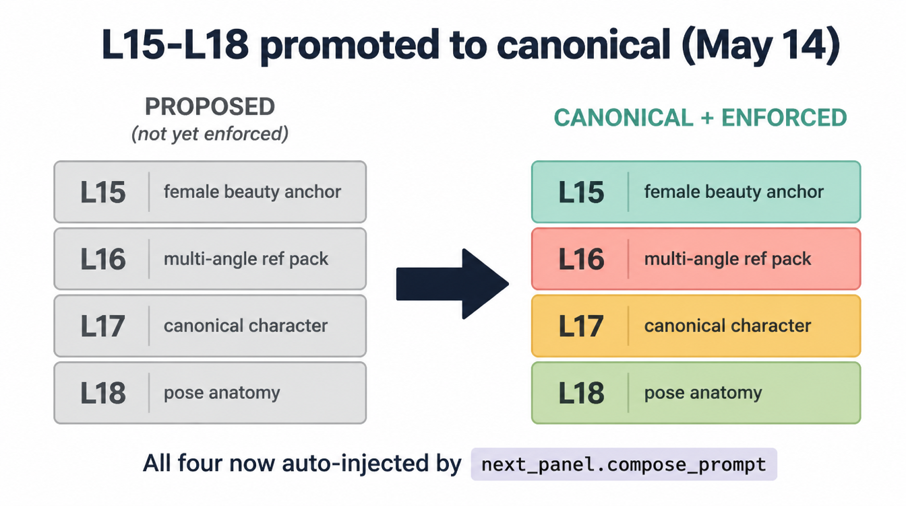
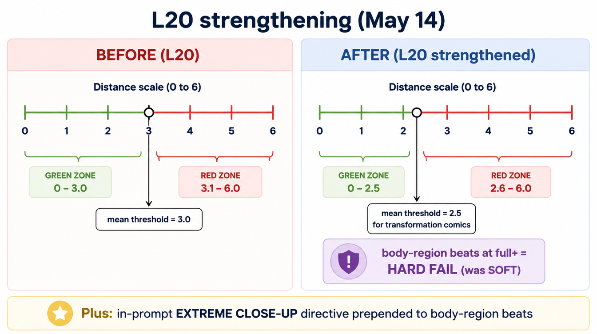
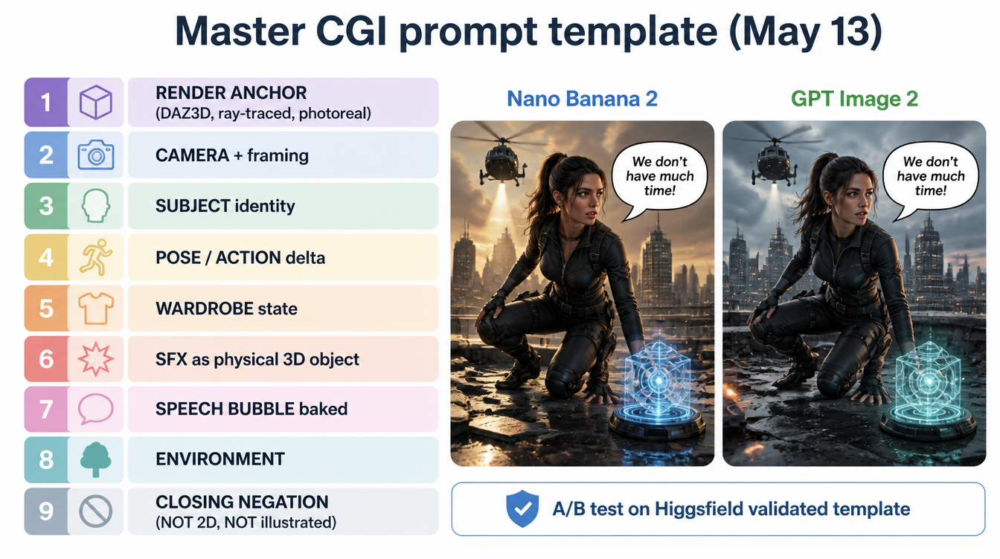
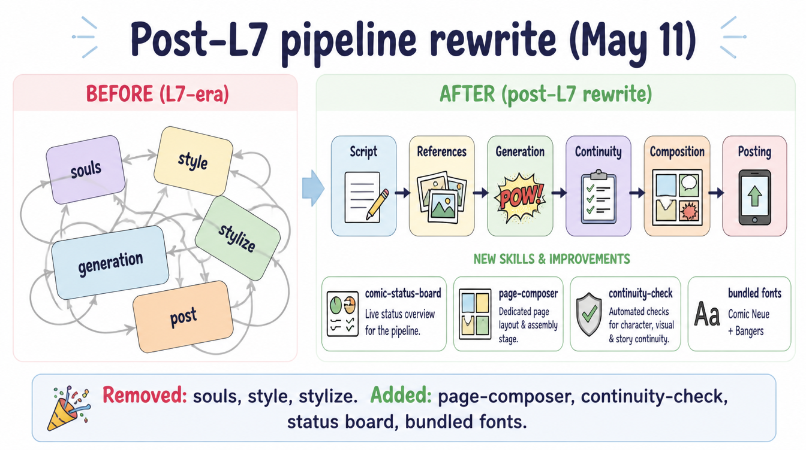
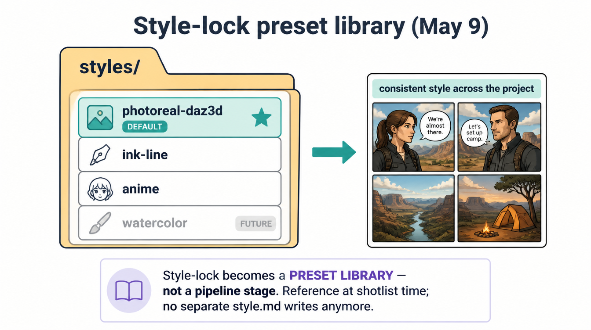

# Changelog


All notable changes to the `claude-comic-pipeline` are tracked here.

This file is the **canonical source for what changed and why**. Any session (human or agent) editing this repo must append an entry here when it lands a meaningful change. Trivial cleanups can be skipped; anything that touches behavior, prompt architecture, the build-comic workflow, or a published reference doc must be logged.

Format: each entry is dated (YYYY-MM-DD), grouped in reverse-chronological order. Entries cite the relevant commit hash(es) and explain the *why* — what failure mode prompted the change, what the new behavior is, where readers can dig deeper.

Categories used per dated section: **Added** / **Changed** / **Fixed** / **Removed** / **Deprecated**. Skip categories with no entries.

---

## 2026-05-23 (MAJOR REFACTOR — rules emit action only, refs carry appearance)

The biggest architectural change to the rule system since the original
checks-and-balances phases. L10 ("references are the truth, prompts
are deltas") was a doc principle but not enforced in code. The rule
registry's `directive()` methods emitted walls of appearance prose —
telling the model in 1,000+ words per panel what the character looks
like instead of pointing at the attached reference images and saying
"match these."

User's words at the kickoff: *"our prompts need to be guiding the
comic by indicating what the character is supposed to be doing, not
what they look like... ever. What they look like is determined by the
reference."*

The Yuna astronaut comic (`projects/sample-01-yuna-cosmic-ascension/`)
was the proof: 5 panels shipped overnight with visible character
drift, AND the project shipped without any `prompt.txt` /
`attached_refs.json` files because the persistence pathway never
wrote them — so the drift couldn't be diagnosed after the fact. Both
problems are fixed in this refactor.

Branch: `refactor/refs-are-truth-prompts-are-action`. PR not opened —
the user reviews the validation A/B in `docs/refactor/validation/`
before merging.

### Why

Pre-refactor evidence (`docs/refactor/yuna-prompt-exhibit.md`): the
chun-li-test `p06-01` peak-conditions prompt was **11,509 chars /
1,770 words / 53 lines**. About **73% of the words (~1,283) described
the character's appearance** — tier-6 muscle volume, breast scale,
vogue-cover face quality, canonical Chun Li identity, hair style. All
of that is in the attached references (face card, body-tier lineup,
tier-6 reinforcement PNGs, prior panel). The prompt was redundantly
re-describing the refs to the model, every panel.

Post-refactor: same panel, same conditions, **5,114 chars / 787 words
/ 50 lines** — **55.6% reduction**. Every word that remains is either
describing what the character is DOING in this panel (action,
camera, lighting, state delta), pointing at an attached ref to MATCH,
describing what NOT to render (negation safety), or describing the
lettering overlay layer. That's L10 enforced in code.

### Changed

- **`skills/comic-production/rules/` restructured into four
  categories** — `attach/` (reference-attaching, no text emission),
  `action/` (action / camera / lighting / state-delta text), `match/`
  (one-line "match the attached <ref>" directives), `safety/`
  (negation / "do not render X"). Every Rule subclass now declares
  `category: str`. `_base.py` exposes `CATEGORY_ATTACH`,
  `CATEGORY_ACTION`, `CATEGORY_MATCH`, `CATEGORY_SAFETY` constants and
  the registry exposes `iter_rules_for_category()`.

- **Appearance-emitting rules gutted to one-line match directives.**
  L11 (cartoony FMG body anchor, was up to ~1900 chars per panel),
  L17 (canonical character anchor, was variable per-character canon
  prose), L10 (render directive, was a 300-char paragraph), and the
  tier reinforcement L29/L30/L31/L32 text directives (each ~800
  chars) all collapse into short directives in `match/match_body.py`
  and `match/match_face_card.py` pointing at the attached refs. Rule
  IDs preserved so audit ledgers remain interpretable.

- **Rules MOVED to new module paths** (behavior unchanged):
  - `l18_anatomy.py` → `safety/anatomy_coherence.py`
  - `l20_camera.py` → `action/camera_directive.py`
  - `l21_ref_safety.py` → `safety/ref_safety.py`
  - `l22_hair_state.py` → `action/hair_state.py` (reclassified —
    hair STATE is per-panel delta, action-class; hair STYLE is in
    the face card)
  - `l23_env_anchor.py` → `action/environment_directive.py`
  - `l24_accessory.py` → `safety/accessory_suppression.py`

- **Inline composer sections routed through the registry.** The
  `STATE ANCHOR — L1.5` inline emission becomes `L1` in
  `match/match_prior_panel.py` (slot `10_state_anchor`). The inline
  `ENVIRONMENT — ref anchor` becomes `MATCH_ENV` in
  `match/match_env.py` (slot `9_environment_match`, fires before L23
  fallback).

- **`MANDATORY ANCHORS` composer section gutted.** Stripped the
  appearance bits ("muscles natural healthy skin tone", "skin has
  subtle healthy sheen") — those come from the body-tier ref and the
  face card per L10. Kept "vivid expressive face" as a MOOD directive
  (action-class) and the size-monotonicity rule (state-continuity).

### Added

- **`skills/comic-production/rules/attach/`** — six new attach
  modules formalizing the reference-attachment contract that lived
  inline in `next_panel.build_plan()`:
  - `attach/face_card.py` — face card per named character.
  - `attach/body_tier.py` — body-tier lineup per
    `panel.muscle_size_tier` (picks low/high lineup).
  - `attach/tier_reinforcement.py` — consolidates L29-L32 attachment
    (one module covering all four tiers).
  - `attach/env_ref.py` — env ref per `panel.location`.
  - `attach/prior_panel.py` — **NEW.** Formalizes L1 chaining as a
    first-class attach rule. Picks the most recent accepted panel
    with a state-carrying camera as the continuity anchor.
  - `attach/internet_3d_base.py` — **NEW.** The internet→3D base ref
    attachment described in the user's canonical workflow. Auto-
    attaches `references/characters/<slug>/internet-3d-base.png`
    when present; soft-warns when missing and points at the new
    reference-acquisition skill.

- **`skills/reference-acquisition/SKILL.md`** — new skill documenting
  the internet-image → 3D base reference workflow. Used to bootstrap
  new characters: download an internet image of the character, feed
  it to Higgsfield Nano Banana 2 with a "render as photoreal 3D model,
  A-pose, plain background" prompt, save the output as
  `references/characters/<slug>/internet-3d-base.png`. From there the
  comic pipeline picks it up automatically.

- **`docs/refactor/rule-classification-before.md`** — audit table of
  every pre-refactor rule and its L10 verdict (DELETE / REWRITE /
  KEEP / MOVE / SPLIT).

- **`docs/refactor/migration-plan.md`** — per-rule migration with old
  path → new path, what changed in the directive, what didn't.

- **`docs/refactor/yuna-prompt-exhibit.md`** — why this doc uses
  chun-li-test (the Yuna project shipped without a shotlist, so it
  can't be re-prompted), the BEFORE prompt stats, the projected and
  realized AFTER stats, the section-by-section breakdown of where the
  words went.

- **`docs/refactor/validation/`** — the prompt-level A/B comparison:
  the actual BEFORE prompt (11,509 chars), the actual AFTER prompt
  (5,114 chars), and the same composer run at tier 2 and tier 7 for
  cross-tier consistency. The image-level A/B requires the user to
  burn Higgsfield credits and is deferred to a follow-up.

### Removed

- `skills/comic-production/rules/l10_render_directive.py` — replaced
  by `match/match_face_card.py` (the `L10` class).
- `skills/comic-production/rules/l11_muscular_build.py` — replaced
  by `match/match_body.py` (the `L11` class).
- `skills/comic-production/rules/l15_glamour.py` — **DELETED.**
  Beauty is in the face card. If a character renders as not-beautiful,
  regenerate the face card; do not paraphrase beauty into every panel
  prompt.
- `skills/comic-production/rules/l17_canonical.py` — replaced by
  `match/match_face_card.py` (the `L17` class).
- `skills/comic-production/rules/l18_anatomy.py` — moved to
  `safety/anatomy_coherence.py`.
- `skills/comic-production/rules/l20_camera.py` — moved to
  `action/camera_directive.py`.
- `skills/comic-production/rules/l21_ref_safety.py` — moved to
  `safety/ref_safety.py`.
- `skills/comic-production/rules/l22_hair_state.py` — moved to
  `action/hair_state.py`.
- `skills/comic-production/rules/l23_env_anchor.py` — moved to
  `action/environment_directive.py`.
- `skills/comic-production/rules/l24_accessory.py` — moved to
  `safety/accessory_suppression.py`.
- `skills/comic-production/rules/l29_tier6_reinforcement.py` — SPLIT.
  Attach part → `attach/tier_reinforcement.py`; match directive →
  `match/match_body.py` (`L29` class).
- `skills/comic-production/rules/l30_tier7_reinforcement.py` — SPLIT
  (same as L29).
- `skills/comic-production/rules/l31_tier8_reinforcement.py` — SPLIT
  (same as L29).
- `skills/comic-production/rules/l32_tier9_reinforcement.py` — SPLIT
  (same as L29).
- `skills/comic-production/rules/female_anatomy.py` — **DELETED.**
  Face-card + body-tier reinforcement refs carry female-ness now; the
  prose anchor was a band-aid replaced by stronger refs.

### Fixed

- **`prompt.txt` / `attached_refs.json` / `panel-plan.json`
  persistence** ([runners/runner_core.py:516](runners/runner_core.py)).
  `_commit_accepted()` now writes three diagnostic files per accepted
  panel: the exact composed prompt that was used, the list of
  reference images attached (kind / path / reason), and the full plan
  dict (composed prompt, refs, rule trace, variant pick metadata).
  Without these files, future drift was undiagnosable — exactly the
  Yuna project failure mode. Both `_commit_accepted` call sites in
  the runner loop updated to pass `plan` + `pick` through.

### Validation

- chun-li-test p06-01 prompt re-rendered with new composer:
  **11,509 → 5,114 chars (55.6% reduction)**,
  **1,770 → 787 words (55.5% reduction)**.
- chun-li-test p07-01 (tier 7): **5,015 chars / 772 words**.
- chun-li-test p01-01 (tier 2): **4,640 chars / 709 words**.
- AFTER prompt size is roughly constant across tiers (~5K chars)
  because appearance-bloat scaling with tier is gone — every tier
  just says "match the attached body-tier reference" and the
  proportion truth lives in the attached PNG.
- Existing test suite (`tests/test_flow_runner_mock.py`,
  `tests/test_runner_loop.py`, `tests/test_variant_picker.py`)
  passes unchanged.
- The IMAGE-level A/B (re-rendering the panel via Higgsfield with old
  vs new prompts to compare visual output) is deferred — Higgsfield
  MCP wasn't connected for the refactor session. Per
  `feedback_validate_with_credits` the user should burn 4-8
  generations on each prompt before merging.

### Backward compatibility

- **Accepted panels stay as-is.** Already-rendered PNGs are not
  retouched.
- **Existing project configs parse unchanged.** No shotlist field is
  renamed; no production-config key is moved.
- **Re-running `next_panel.py` against any existing project produces
  a DIFFERENT prompt.** This is the point of the refactor. If a
  project is mid-flight and depends on getting the same prompt
  structure on re-render, finish that project before merging this
  refactor.
- **Rule IDs unchanged.** `L21`, `L18`, etc. continue to identify the
  same logical rule even though the module path moved. Audit ledgers
  and `checks.json` files written by the old code remain
  interpretable.

### Open work deferred

- The image-level Higgsfield A/B (user-driven, credits).
- `safety/clothing_coverage.py` (L33 always-clothed) currently lives
  per-project in `production-config.json` `mandatory_rules.extra_lines`;
  promoting to a rule module is a separate refactor.
- The L19 LETTERING block remains the largest single section in the
  AFTER prompt (~300 words). It describes bubble/SFX structure (which
  is action-class, not appearance), but could be slimmed in a future
  pass that's out of scope for this branch.

### Publishing

- **Blog post**: [`docs/posts/2026-05-23-refs-are-truth.md`](docs/posts/2026-05-23-refs-are-truth.md) — narrative
  walk-through of the refactor for the project's posts series: the
  evidence (1,770 → 787 words), the principle, the four-category
  restructure, the persistence-gap fix, the validation, the
  backward-compat statement, and the architectural shift from
  prompt-bloat to ref-fix.
- **NotebookLM notebook**: [Refs Are Truth: Enforcing L10 in AI Prompt Architectures](https://notebooklm.google.com/notebook/2e9449e5-27d3-4491-a3eb-ea389d97a7ff)
  — 7 sources uploaded (the blog post + the four refactor docs + the
  BEFORE/AFTER prompts). Audio Overview and Infographic both triggered
  in the Studio panel; both generate asynchronously over a few minutes.
  Notebook is on the growcomics Google account; surface via Share
  button inside the notebook for external distribution.

---

## 2026-05-22 (Mac Mini branch recovery + composition-layer bug sweep + validator + vision-audit dispatcher)

A diagnostic session that started from "why are generations bad / is the rule system too strict or lacking?" and traced every failure to one root cause: **pipeline layers using different names/formats for the same data, with nothing validating the contract between them.** Not a rule-design problem. Five distinct plumbing bugs + a stale checkout, all fixed; two new tools added (shotlist validator, vision-audit dispatcher).

### Fixed

- **Mac Mini was running months-old code on the wrong branch.** The working checkout sat on `feat/audit-vision-gap-l25`, which branched off before the entire checks-and-balances refactor (phases 1–7, the silhouette purge, L11 breast-scale, L19 rewrite, L29–L32). `next_panel.py` was the 1199-line pre-refactor monolith with no `rules/` package and none of the ledger scripts on disk. Result: anyone reasoning from this CHANGELOG (which describes `main`) was diagnosing a system that wasn't deployed. Recovered by pushing the unique L25 commits to the remote for safekeeping, then fast-forwarding to `origin/main` (`123edd6..c158dbc`, 30 commits). The machine now runs the current pipeline.
- **`_l19_lettering_block` crashed on string-shaped captions/sfx** ([next_panel.py](skills/comic-production/scripts/next_panel.py), commit `a1b7e07`). The block called `.get("text")` on every caption/sfx entry, assuming dicts; real shotlists carry some entries as bare strings, so `compose_prompt` (and therefore `build_plan` and `write_ledger.py`) raised `AttributeError: 'str' object has no attribute 'get'` on any such panel. Fixed with an `_as_obj()` coerce at the top of the captions and sfx loops — a bare string becomes `{"text": <string>}`. Tolerant of old and new shotlist shapes; no data rewrite.
- **L1.5 view-aware chaining failed on every panel due to a camera-vocabulary mismatch** ([next_panel.py](skills/comic-production/scripts/next_panel.py), folded into commit `961f9b5`). `pick_chain_anchor` keyed `VIEW_COMPATIBILITY` (`front-full`, `3q-full`, `splash`, …) with the first comma-token of the shotlist's `camera` field (`full-body`, `three-quarter`, `wide splash`, …) — two different vocabularies, so the lookup matched almost nothing and fell back to canonical-ref + verbal carry-forward every time (7/7 defects on chun-li-test). Added `_VIEW_ALIASES` + `_canon_view()` which normalizes a compound camera string to a single `VIEW_COMPATIBILITY` key (tries each comma-token longest-first, strips parentheticals), applied at both the `target_view` build site and the prior-read site. chun-li-test L1.5 defects 7→1 (remaining one is the `ecu-region` by-design empty-set fallback, not a bug).
- **Speech-bubble attribution was blank on every dialogue panel** ([next_panel.py](skills/comic-production/scripts/next_panel.py), commit `961f9b5`). The L4 lettering block (line ~836) and the L12/L13 detection checks (lines ~272/~323) read `dialogue[].speaker`, but shotlists populate the field as `dialogue[].character`. Every bubble rendered `positioned over ''s side of the frame` with no speaker. Fixed all three sites to read `d.get("speaker") or d.get("character")`. Verified: p11-01 now composes `positioned over `bison`'s side`. Fixes attribution across all dialogue panels at once.

### Added

- **View aliases for compound framing names** ([next_panel.py](skills/comic-production/scripts/next_panel.py), commit `961f9b5`). `wide splash`/`full-body splash` → `splash`, `medium two-shot` → `medium`, `close-up on her face` → `mcu`, `medium-wide hero pose` → `medium-wide`, plus `medium-wide`/`mcu`/`medium`/`full body`/`wide establishing`/`extreme close-up` mappings folded into `_VIEW_ALIASES`. Clears the legitimate-but-unrecognized view tokens; deliberately does NOT alias prose-in-camera (those are malformed data, fixed at the source).
- **Shotlist schema-validator** ([skills/script-breakdown/scripts/validate_shotlist.py](skills/script-breakdown/scripts/validate_shotlist.py), commit `961f9b5`). Enforces the contract the pipeline silently assumed: `camera` head-token must be a known view (flags prose belonging in `action` vs unknown tokens), `tier` must be int when present, on-screen dialogue must carry a speaker (`speaker` or `character`), warns on empty `characters`/missing `location`. Exit 1 rejects a bad shotlist. Intended as a write-time gate in `script-breakdown` and a warn-only preflight in `build_plan`. On first run it correctly flagged 4 prose-in-camera panels in chun-li-iron-discipline + the legitimate compound-token panels.
- **Vision-audit dispatcher** ([skills/comic-production/scripts/audit_panels.py](skills/comic-production/scripts/audit_panels.py), uncommitted as of this entry). The missing post-render orchestration the design doc left "orchestrator-side": for each accepted panel it loads the rendered image + `checks.json`, runs each applicable rule's `vision_rubric` against the image + canonical refs via an isolated `_vision_judge()` backend, and writes the verdict to `rules[RULE].post_render.{status,reason}`; post-render fails roll into `defects.jsonl`. Report-only by default — never regenerates. Degrades to `--dry-run` automatically when `anthropic`/`ANTHROPIC_API_KEY` are absent. Phase 8 auto-regen intentionally NOT wired (spends credits unattended). Dry-run confirmed wired end-to-end on chun-li-test (10 panels).

### Changed

- **Stopped tracking generated project output** (commit `2150b6c`). `.gitignore` now excludes `projects/*/pages/`, `projects/*/final/`, `projects/*/defects.jsonl`, `projects/*/*.pdf`; the chun-li-test rendered panels/PDF/ledgers that were accidentally committed were untracked. Generated comics are output, not source.

### Notes

- **Root-cause framing for the boss-level question.** "Too strict / lacking / give up" was the wrong axis. 14 of 15 rules pass clean on real panels; the failures were all vocabulary/convention drift between layers (branch vs branch, caption shape, camera dialect, `character` vs `speaker`, prose-in-camera). The durable fix is the validator-as-write-gate + one shared schema, not rule count changes.
- **Still pre-render only.** Everything fixed and verified this session is composition-layer (text). No rendered image has been verified yet — that requires running `audit_panels.py` live (after a small applicability-skip tightening so it doesn't fire every rule on every panel) with a human spot-checking the first verdicts.
- **Open follow-ups:** tighten `audit_panels.py` to skip rules whose `pre_render` was skipped/n-a; run the audit live (one panel first); fix the 4 prose-in-camera panels + 1 too-wide L12 dialogue panel; wire `validate_shotlist.py` into `script-breakdown` as a hard gate; decide on auto-regen (phase 8).

---

## 2026-05-17 (compose_prompt section-formatting — labeled `[SECTION]` headers instead of one unbroken paragraph)

### Changed

- **`compose_prompt()` output is now human-scannable** ([skills/comic-production/scripts/next_panel.py](./skills/comic-production/scripts/next_panel.py)). Previously every directive — render anchor, camera, subjects, L11/L15/L17/L18/L20/L21/L22/L23/L24/female-anatomy/L29-32/L10, action delta, env line, state anchor, mandatory rules, L19 lettering, closing anchor — was concatenated into one space-joined paragraph. When a generation went wrong it was impossible to scan the prompt and tell which directive misfired. The new output emits each directive as a labeled section:

  ```
  [CHARACTER — L17 canonical anchor]
  L17 canonical anchor: render the canonical published versions...

  [POSE & ANATOMY — L18]
  L18 anatomy coherence: torso, hips, abdomen, and feet all face...
  ```

  Sections are separated by blank lines and joined with `"\n\n".join(...)`. Same semantic content; image models tokenize whitespace fine, so this is a presentation refactor only. Flow runner already flattens newlines to spaces in `_set_prompt()` (Flow's text area treats `\n` as submit), so Flow submissions still receive the single-line concatenation; the Higgsfield API accepts multi-line strings directly.

### Added

- **`section_label` attribute on the `Rule` base class** ([rules/_base.py](./skills/comic-production/rules/_base.py)) — a short bracketable phrase like `"CHARACTER — L17 canonical anchor"` that drives the section header. Multi-slot rules (currently only L11) declare a dict keyed by slot name; single-slot rules use a string. A `section_label_for(slot)` resolver method handles both shapes, with a fallback to `rule.id` when unset.
- **`section_label` set on every rule module**: L10, L11 (per-slot), L15, L17, L18, L20, L21, L22, L23, L24, L29, L30, L31, L32, FemaleAnatomy.
- **`_format_section(label, body)` helper** in `next_panel.py` — wraps a prompt fragment in `[LABEL]\n<body>`. Defensively skips empty/whitespace-only bodies so optional sections (LIGHTING STATE, ACTION DELTA, STATE ANCHOR — L1.5, etc.) don't emit empty headers.
- **A/B test artifacts** at [skills/comic-production/references/prompt-format-ab-test/](./skills/comic-production/references/prompt-format-ab-test/) — `old.prompt.txt`, `new.prompt.txt`, `old.png`, `new.png`, `metadata.json`, and a README. Validated end-to-end on Higgsfield (`nano_banana_flash`, 1k, 4:3, count=1, 3 refs attached: lenny + carl face-cards + mundy-lab-a env source). OLD job `ee112f57-8b57-4a59-9972-64455d7e3a4a`, NEW job `1cabc083-511e-4c5b-867e-4b2e83576496`. Both renders are visually equivalent (same characters, same lab, same cowboy framing, same speech-bubble text); the differences fall within nano_banana_flash's normal sample-to-sample variance. Confirms the format change is presentation-only with no observable effect on model behavior.

### Notes

- The `_trace` ledger still records the unwrapped directive in `compose_contribution` so the ledger schema is unchanged.
- The composer's rule iteration order is unchanged — section headers do not reorder anything.
- Existing `panels.json` payloads in the wild from old runs are untouched — only newly-generated prompts use the new format.

---

## 2026-05-16 (Mira panel-render validation — L30/L31/L32 confirmed end-to-end + 3 canonical-cast promotions)

### Added

- **Mira panel-render validation log** at [`docs/posts/2026-05-16-mira-panel-validation.md`](./docs/posts/2026-05-16-mira-panel-validation.md) — 24 Higgsfield gens (8 per tier) of a synthetic Mira panel through the full L30/L31/L32 ref stack. All 23 successful candidates archived at [`docs/posts/2026-05-16-mira-panel-validation/{tier-7,tier-8,tier-9}/`](./docs/posts/2026-05-16-mira-panel-validation/). First **panel-render** validation of the per-tier rules (previous L30/L31/L32 work only validated the reinforcement *sheets*, not the panel-render path).
- **Canonical-cast Mira tier-7/8/9 promotions**: [`canonical-cast/mira/body-tier{7,8,9}.png`](./skills/comic-production/references/canonical-cast/mira/) ingested + documented in [canonical-cast README](./skills/comic-production/references/canonical-cast/README.md). Same images mirrored to [`growcomics-references/series/characters/mira/`](/Users/mattmenashe/Documents/growcomics-references/series/characters/mira/) with `_provenance.md`. Mira tier-7/8/9 form a coherent growth sequence (same identity + costume + pose across all three) — chain off as a sequential tier ladder.
- **4 picks validate end-to-end**: tier 7 = `6959196c`, tier 8 = `d5fa091e`, tier 9 = `2e735ea5` (user-confirmed across all three matching my recommendations).

### Findings

- **L30/L31/L32 produce tier-N panel output reliably**: 23/23 successful candidates land at their declared tier with the L11 surgical-scoping intact. Zero leakage from reinforcement sheets' clothing/hair/face/background into the rendered panels.
- **NSFW upload filter is non-deterministic**: same shape of content (anatomical detail sheets with breast-volume zoom) was blocked at upload during the L29 run but cleared cleanly for tier-7/8/9 this run. Don't treat NSFW upload blocks as permanent — retry on a later session.
- **4-ref stack works at all peak tiers**: face + lineup + 2 reinforcement = 4 attached refs. Higgsfield nano_banana_flash handled this consistently across 24 gens. The "3-ref ceiling" in L23 is per-model and may be softer than originally documented — worth re-examining.

### Validation milestone

- **Peak-tier reinforcement series (L29/L30/L31/L32) is now end-to-end validated**: not just the sheets, not just the prompt-assembly, but the actual rendered panel output. The architecture is ready for production use on FMG comics escalating to tier 6/7/8/9.

### Credit cost

- ~72 credits for the 24-gen batch + a few credits for the 7 ref uploads (which don't burn generation credits).

---

## 2026-05-16 (L32 — tier-9 reinforcement refs ingested + rule wired, completes the peak-tier series)

### Added

- **L32 rule module** at [`skills/comic-production/rules/l32_tier9_reinforcement.py`](./skills/comic-production/rules/l32_tier9_reinforcement.py) — sibling of L29/L30/L31, fires at `panel.muscle_size_tier == 9`. Caps the peak-tier reinforcement series.
- **Tier-9 anatomical reference sheets** at [`skills/comic-production/references/peak-body-scale/tier-9/`](./skills/comic-production/references/peak-body-scale/tier-9/) — both file slots point to the same image: a user-directed Grok image-edit of my A-02 candidate (`bc2bac33`) with the prompt "Make the breasts bigger, change nothing else." The resulting composite (`4b290bcc`) already contains both full-body views and detail-zoom insets, so using one image for both slots is intentional and matches the L32 doc. 16 candidates generated (8 A + 8 B, all 16 successful — clean run with 0 NSFW and 0 platform-failures), all 16 archived at [`docs/posts/2026-05-16-tier-9-candidates/`](./docs/posts/2026-05-16-tier-9-candidates/). Credit cost: ~50 + a few Grok credits for the bust edit.
- **Helpers + wiring**: `find_tier9_reinforcement_refs()`, `should_attach_tier9_reinforcement()`, ctx flag `tier9_refs_attached`, slot dispatch after L29/L30/L31. `_has_tier9_reinforcement_refs()` audit helper + per-panel HARD gate.
- **Docs**: tier-9 section in [`peak-body-scale.md`](./skills/comic-production/references/peak-body-scale.md) noting the peak-tier series is now complete; L32 lesson in [`lessons-learned.md`](./skills/comic-production/references/lessons-learned.md) including a new "operator-in-the-loop lesson" naming the user-directed-Grok-edit pattern as legitimate output when 16 generated candidates don't have the exact attribute the user wants.

### Validation

- End-to-end smoke test against a synthetic tier-9 Mira panel: both PNGs attached, L32 directive renders, trace shows `L32.pre_render.status="pass"`.

### Milestone

---


- **Peak-tier reinforcement series is complete**: L29 (tier 6) + L30 (tier 7) + L31 (tier 8) + L32 (tier 9) all ship dedicated reinforcement sheets. Multi-figure lineup interpolation failure mode blocked at every peak tier.

---

## 2026-05-16 (L31 — tier-8 reinforcement refs ingested + rule wired)

### Added

- **L31 rule module** at [`skills/comic-production/rules/l31_tier8_reinforcement.py`](./skills/comic-production/rules/l31_tier8_reinforcement.py) — sibling of L29/L30, fires at `panel.muscle_size_tier == 8`. Same slot (`8b_tier_reinforcement`), same surgical-scoping pattern, same all-or-nothing attachment.
- **Tier-8 anatomical reference sheets** at [`skills/comic-production/references/peak-body-scale/tier-8/`](./skills/comic-production/references/peak-body-scale/tier-8/) — Sheet A pick `7c0d52dd` (most explicit labels: DELTOIDS Massive 3x, MAXIMAL Quad Volume, Bicep Profile, Waist Narrowness, Leg Musculature) and Sheet B pick `6072b6d6` (best dimensional callouts: VANISHINGLY NARROW WAIST, Tier 8 breast detail — larger fuller more projected). Generated 2026-05-16 evening using Mira as source character + tier-6-full-body.png as STYLE anchor; prompt instructs "render TWO TIERS bigger than reference #2 (tier-6 baseline)." 16 gens, 14 successful (1 NSFW filtered, 1 platform-failed). 12 unsuccessful + non-picked candidates archived at [`docs/posts/2026-05-16-tier-8-candidates/`](./docs/posts/2026-05-16-tier-8-candidates/). Credit cost: ~50.
- **Helpers + wiring**: `find_tier8_reinforcement_refs()` and `should_attach_tier8_reinforcement()` (uses the shared `_find_peak_reinforcement_refs(root, 8)` helper that's now factored across L29/L30/L31), ctx flag `tier8_refs_attached`, slot dispatch at `8b_tier_reinforcement` after L29/L30. `_has_tier8_reinforcement_refs()` audit helper + per-panel HARD gate in `rules_audit.py`.
- **Docs**: tier-8 section in [`peak-body-scale.md`](./skills/comic-production/references/peak-body-scale.md); L31 lesson in [`lessons-learned.md`](./skills/comic-production/references/lessons-learned.md).

### Validation

- End-to-end smoke test against a synthetic tier-8 Mira panel: both PNGs attached, L31 directive renders into the composed prompt, trace shows `L31.pre_render.status="pass"`.

### Fixed (post-commit)

- CHANGELOG entry for L31 was missed during the `fe098d0` commit due to a linter-induced file-modification race; added in a follow-up doc commit.

---

## 2026-05-16 (L30 — tier-7 reinforcement refs ingested + rule wired)

### Added

- **L30 rule module** at [`skills/comic-production/rules/l30_tier7_reinforcement.py`](./skills/comic-production/rules/l30_tier7_reinforcement.py) — sibling of L29, fires at `panel.muscle_size_tier == 7`. Same slot (`8b_tier_reinforcement`), same surgical-scoping pattern (PROPORTION REFERENCE ONLY do-NOT-borrow list), same over-spec compensation, same all-or-nothing attachment. Multiple rules can share a slot in registry order; L29 and L30 are mutually exclusive on tier conditions so only one fires per panel.

- **Tier-7 anatomical reference sheets** at [`skills/comic-production/references/peak-body-scale/tier-7/`](./skills/comic-production/references/peak-body-scale/tier-7/) — `tier-7-full-body.png` (Sheet A pick `fb14428d`, front + rear with proportion stat callouts + 4 detail insets) and `tier-7-anatomical-detail.png` (Sheet B pick `3beb5bbd`, 4-panel close-up sheet with dimensional callouts on waist narrowness). Generated 2026-05-16 evening using Mira as source character and the prompt recipe in the tier-7/8/9 plan doc; user manually picked 1 of 8 candidates per sheet (per the locked-in decision favoring manual review on canonical-asset picks). 16 gens submitted, 11 successful, 2 NSFW filtered at gen time, 3 platform-failed. Credit cost: ~50. All 11 candidates archived at [`docs/posts/2026-05-16-tier-7-candidates/`](./docs/posts/2026-05-16-tier-7-candidates/).

- **L30 helpers + ref-attachment block** in `next_panel.py`: `find_tier7_reinforcement_refs()` (parameterized internally via the new `_find_peak_reinforcement_refs(root, tier)` helper that's shared between L29 and L30), `should_attach_tier7_reinforcement()`, ctx flag `tier7_refs_attached`, slot dispatch at `8b_tier_reinforcement` right after L29. The ref-ceiling counter now also includes `tier7_reinforcement` entries.

- **HARD audit gates for tier 7** in `rules_audit.py`: `_has_tier7_reinforcement_refs()` (parameterized internally via the new `_has_peak_reinforcement_refs(project, tier)` helper), per-panel check that HARD-fails when a tier-7 panel exists but the reinforcement PNGs aren't findable. Same shape as the tier-6 gate.

- **Docs**: new tier-7 reinforcement section in [`references/peak-body-scale.md`](./skills/comic-production/references/peak-body-scale.md); new **L30** lesson in [`references/lessons-learned.md`](./skills/comic-production/references/lessons-learned.md) capturing the failure mode (multi-figure lineup-4-9 chart interpolates tier-7 toward middle) and the fix (same shape as L29).

### Validation

- End-to-end smoke test against a synthetic tier-7 Mira panel: both PNGs attached, L30 directive renders into the composed prompt, trace shows `L30.pre_render.status="pass"`. Tier-7 build verification on real renders not yet done (the user-pick batch confirmed the SHEETS render at tier-7 proportions in 11/11 successful gens; panel-render validation comes in the next iteration).

---

## 2026-05-16 (L29 validation — 8 Higgsfield credit-burns confirm tier-6 lands at parity)

### Added

- **Validation log + 8 generation assets** at [`docs/posts/2026-05-16-l29-validation.md`](./docs/posts/2026-05-16-l29-validation.md) and [`docs/posts/2026-05-16-l29-validation-assets/`](./docs/posts/2026-05-16-l29-validation-assets/). 8 nano_banana_flash 1k 3:4 generations of a synthetic tier-6 Chun Li panel with the L29 reference stack attached (face + lineup + tier-6-full-body). All 8 land at tier-6 proportions (deltoid mass dwarfing head, biceps approaching waist width, sculpted abs, broad lats, large forward-projected bust). Zero reference leakage — costume / hair / face / background all stayed on-prompt; no inset photos or annotated-overlay watermarks rendered. Credit cost: 27.

- **Tier-7/8/9 reinforcement-ref generation plan** at [`docs/posts/2026-05-16-tier-7-8-9-reinforcement-plan.md`](./docs/posts/2026-05-16-tier-7-8-9-reinforcement-plan.md). Codifies the user-specified prompt recipe (sheet + biceps zoom + breast zoom + waist zoom + rear view) × 8 generations per prompt × 3 tiers = 120 candidates, picks composited into two PNGs per tier mirroring the tier-6 file shape, wired through sibling L30/L31/L32 modules. 5 open decisions for the user to answer before generation can start.

### Finding

- **Higgsfield NSFW upload filter blocks `tier-6-anatomical-detail.png`** at `media_confirm` (close-up biceps + breast volume + waist + posterior detail). The full-body reinforcement sheet uploaded cleanly. Local pipeline and Flow are unaffected — the file is fine; only Higgsfield's API rejected the upload. Mitigation options (re-export, crop, platform-flag) documented in the validation log under Finding 1. Validation proceeded with single-ref reinforcement (face + lineup + tier-6-full-body); the 4-ref full-L29 stack remains untested on Higgsfield but the 3-ref result is already strongly positive.

### Changed

- **Memory rule added**: `feedback_validate_with_credits` — any rendering-path pipeline change needs real Higgsfield gens (4-8 minimum) before "done"; results land in git, not just chat. User-directed today after asking whether one-off validation was worth the credits ("always worth many credit burns to check, remember that, and store the results in github").

---

## 2026-05-16 (L11 breast-scale anchoring — Alignment Diff #3, user-directed)


### Changed

- **L11 vocabulary expanded with parallel breast-scale anchoring.** Triggered by user observation 2026-05-16 afternoon: *"There is a problem with the generations in that it seldom matches the breast size of the reference attached. I did a prompt where I asked it to match the breast size of the sixth person in the muscle comparison chart and the rendered output still landed with smaller breasts than the lineup figure shows."* Tested on Higgsfield with `nano_banana_flash` at 1k with explicit user prompt asking to match figure 6 — muscle came through correctly at tier 6 (the morning's silhouette purge was holding) but breasts rendered at tier 2-3 size. Diagnosis: the lineup conveys TWO load-bearing proportion attributes (muscle scale AND breast scale), but the post-silhouette-purge vocabulary called out only muscle with caps-lock framing and "do not regress" guards. Breasts were mentioned as a passing list item ("(b) the size, fullness, and shape of the breasts") buried inside a three-part list with no CAPS-LOCK framing, no anti-regression guard, no style-anchor mention, and no costume-accommodates anchor. Same shape as the silhouette purge: load-bearing vocabulary at the rule-content level was missing the words that pointed at the attribute. The model's average-breast-scale prior dominated.

- **Fix design + v1→v2 iteration.** Promoted breast scale to a first-class anchor using the same surgical-scoping pattern that fixed muscle in the morning's purge. v1 vocabulary (parallel **CRITICAL — BREASTS** block, anti-regression guards, style-anchor mention, stage-change verbal-fallback mention, vision-rubric verification) landed close on a Chun Li tier 6 validation render but breasts still under-rendered at ~tier 4-5 (qipao costume read as "modest" and flattened the breast contour despite the explicit anchor). v2 added four pipeline-generic escalations that fully resolved it: (1) **over-spec compensation** — explicit instruction to render slightly larger than the lineup figure shows so the model's downward-bias normalization lands at parity (per `feedback_chest_oversize_compensate` memory); (2) **costume-accommodates anchor** — the costume must accommodate the breast scale (pushed forward, stretched, fitted around the volume), not the breasts shrunk to fit the costume's profile; (3) **anti-flattening negation** — NO modest profile, NO conservative coverage, NO costume drape that hides the breast volume; (4) **dramatic-enhancement framing** — "at tier N the breast scale should read as a DRAMATIC enhancement over figure 1's baseline." All four folded back into `l11_muscular_build.py` before commit so the pipeline emits the working vocabulary by default.

- **6 files swept** (split across two commits — `a57f03c` L29 commit bundled the first wave of doc edits, this commit lands the remaining work):
  - **Rule module**: [`skills/comic-production/rules/l11_muscular_build.py`](./skills/comic-production/rules/l11_muscular_build.py) — `L11_STYLE_ANCHOR` rewritten with tier-scaled breast proportions + costume-accommodates anchor. Lineup-attached block (slot `8_tier_build`) rewritten with parallel **CRITICAL — MUSCLE** / **CRITICAL — BREASTS** structure, over-spec compensation, costume-accommodates, anti-flattening, dramatic-enhancement framing, anti-regression guards. Stage-change verbal-fallback path updated with breast-scale mention + over-spec note. `vision_rubric` rewritten to verify BOTH attributes independently (MUSCLE section + BREASTS section + common-regression-pattern callout). `retry_strategy` strengthening updated with over-spec compensation language. Two `Alignment Diff #3` comments above `_BUILD_BY_TIER` documenting the v1 design + v1→v2 iteration learnings.
  - **Docs (committed in `a57f03c`)**: [`references/lessons-learned.md`](./skills/comic-production/references/lessons-learned.md) L11 section — important framing updated to "TWO proportion attributes" + root-cause list extended from 3 to 4 (breast scale failure added) + "what the lineup conveys / does NOT convey" enumeration. [`references/peak-body-scale.md`](./skills/comic-production/references/peak-body-scale.md) — "What the lineup actually is" rewritten as two-attribute body chart; "How to anchor" example rewritten with parallel CRITICAL blocks; vocabulary lists split by attribute; failure modes expanded from 4 to 6; new "History — the breast-scale anchoring" section. [`references/the-rules-explained.md`](./skills/comic-production/references/the-rules-explained.md) — L11 article body rewritten to describe two proportion attributes; new "Important: the breast-scale anchoring (2026-05-16 afternoon)" subsection. [`reference-gathering/SKILL.md`](./skills/reference-gathering/SKILL.md) — Step 2 body-tier ref instructions updated; lineup-instruction string rewritten with parallel CRITICAL blocks.
  - **Docs (this commit)**: `references/lessons-learned.md` Fix list extended from 5 to 9 items (items 6-9 capture the v2 escalations) + vocabulary-that-works list expanded with v2 phrases. [`commands/build-comic.md`](./commands/build-comic.md) — L11 bullet expanded with two-proportion-attribute note + pointer to the lessons-learned section + warning that muscle-only anchoring leaves breasts to regress.

### Validated

- **v1 render** (`nano_banana_flash`, 1k, 3:4, lineup attached): Chun Li tier 6 with v1 vocabulary baked into the prompt. Muscle scale landed at tier 6 cleanly (the silhouette purge holds). Breast scale landed at ~tier 4-5 — visible improvement over the pre-fix baseline (which was tier 2-3) but still undershoot vs. figure 6 of the lineup. User assessment: *"Close but iterate."*
- **v2 render** (same conditions, v2 vocabulary): Breast scale landed at tier 6+ (over-spec compensation intentional). Qipao stretched and pushed forward as the new costume-accommodates anchor directed. Muscle scale held at tier 6. No L21 regression. User assessment: *"Fold all 4 in, then commit."*
- Module smoke-test: `L11.compose_contribution({'muscle_size_tier': 6}, {'lineup_attached': True}, '8_tier_build')` emits ~3.6k chars containing all four v2 additions verbatim. Registry walks all 12 active rules (L21, L18, L10, L20, L22, L23, L24, L15, L17, female_anatomy, L11, L29) in slot order.

### Why

The morning's silhouette purge was an architectural takeaway: load-bearing vocabulary at the rule-content level can override any amount of gating and retry-strategy work above it. The afternoon's breast-scale anchoring is the same takeaway applied to a parallel attribute — the lineup conveys TWO proportion attributes, the morning purge fixed one of them, the afternoon fix completes the pattern for the other. Both required surgical-scoping vocabulary with CAPS-LOCK framing + anti-regression guards + over-spec compensation. The v1→v2 iteration also surfaced a new insight (the costume-accommodates anchor) that generalizes beyond breast scale: any feature where the model has a "this garment / context = modest / restrained profile" prior needs the prompt to explicitly invert that prior. The vocabulary lands in `l11_muscular_build.py` as a pipeline-generic anchor and propagates to every full-body / stage-change panel at tier ≥ 2 across all FMG projects.

### Related

- The `a57f03c` L29 commit bundled the first wave of L11 doc edits because the work overlapped chronologically; the doc edits are described in this entry rather than in L29's entry. L29 itself is a separate fix (tier-6 reinforcement refs) that uses the same `feedback_chest_oversize_compensate` insight but addresses a different failure mode (multi-figure-lineup interpolation rather than vocabulary-anchoring).

---

## 2026-05-16 (L29 — tier-6 reinforcement refs auto-attach + tier-6 anatomical detail sheets ingested)

### Added

- **L29 rule module** at [`skills/comic-production/rules/l29_tier6_reinforcement.py`](./skills/comic-production/rules/l29_tier6_reinforcement.py) — every panel at `muscle_size_tier == 6` now auto-attaches two dedicated tier-6 reinforcement reference PNGs alongside the muscle-size lineup. The lineup interpolates the peak figure downward against the other five figures on the chart (rendered tier-6 bodies land at tier 4-5 proportions); the reinforcement sheets isolate tier-6 proportions as their own dedicated anchor. Slot `8b_tier_reinforcement`, immediately after L11's `8_tier_build`. FMG-only. Severity HARD. Inherits the L11 surgical-scoping pattern verbatim (PROPORTION REFERENCE ONLY — do NOT borrow clothing / hair / face / pose / lighting / background from the reinforcement refs) and explicitly tells the model to **over-render** the proportions (target SAME or LARGER scale than the refs show, per `feedback_chest_oversize_compensate` — the model normalizes off-distribution features toward average, so prompting for parity tends to land below parity).

- **Tier-6 anatomical reference sheets** at [`skills/comic-production/references/peak-body-scale/tier-6/`](./skills/comic-production/references/peak-body-scale/tier-6/) — `tier-6-full-body.png` (front + rear refs with annotated proportion stats, biceps profile, chest / thoracic detail, waist narrowness, leg musculature) and `tier-6-anatomical-detail.png` (close-up sheet for biceps anatomy, breast volume / shape, waistline metrics, full rear view + posterior musculature). Repo-bundled — NOT character-specific generated assets. `reference-gathering` does NOT generate them; the panel-level renderer attaches them at submit time via the new `find_tier6_reinforcement_refs()` resolver.

- **`find_tier6_reinforcement_refs(root)` and `should_attach_tier6_reinforcement(panel)`** helpers in `next_panel.py`. Resolver search order mirrors `find_lineup`: project-local override at `references/style/` → repo-bundled `peak-body-scale/tier-6/` → user-installed skill → plugin-installed skill. All-or-nothing semantics (both PNGs must resolve, or the resolver returns `[]` — partial refs would mis-anchor).

- **`build_plan` ref-attachment block** in `next_panel.py` attaches both reinforcement PNGs after the L11 lineup-attach block when `panel.muscle_size_tier == 6`. Emits `MISSING_tier6_reinforcement` ref entries when the PNGs aren't findable on disk. The ref-ceiling counter (`total_refs`) now includes the tier-6 PNGs so the existing env-drop logic still resolves correctly.

- **L29 ctx flag (`tier6_refs_attached`)** wired through `compose_prompt` so the L29 rule's verbal directive only emits when the refs actually attached at generation time. Verbal-only fallback at tier 6 is significantly weaker than lineup-only — that's the exact failure mode the rule exists to fix — so the pre_render verification surfaces missing refs as a HARD fail, not a silent fallback.

- **Manifest schema extension** in [`skills/script-breakdown/SKILL.md`](./skills/script-breakdown/SKILL.md) and [`skills/reference-gathering/SKILL.md`](./skills/reference-gathering/SKILL.md): `body_tiers[].tier6_reinforcement_required` flag, present and `true` when the entry is at tier 6. The reference-gathering walker recognizes that these refs are repo-bundled and skips the generation flow — it just attaches them at panel-render time.

- **HARD audit gates** in [`skills/continuity-check/scripts/rules_audit.py`](./skills/continuity-check/scripts/rules_audit.py): (1) `check_reference_completeness` walks the new manifest field and HARD-fails when a tier-6 body-tier entry requires reinforcement refs that aren't findable on disk; (2) `check_pages` HARD-fails per-panel when any panel has `muscle_size_tier == 6` and the reinforcement PNGs aren't findable via the canonical search order. Both block the render plan, not just warn. The `_has_tier6_reinforcement_refs(project)` helper mirrors the same search order the runtime resolver uses.

- **Docs**: new section in [`references/peak-body-scale.md`](./skills/comic-production/references/peak-body-scale.md) explaining the tier-6 reinforcement workflow, the surgical-scoping language, and the audit gate; new **L29** lesson in [`references/lessons-learned.md`](./skills/comic-production/references/lessons-learned.md) capturing the failure mode (multi-figure lineup interpolates tier-6 downward), the fix (lineup + isolated tier-6 anatomical sheets), and the hard rules (strict tier-6 trigger, both refs together, reinforcement-not-replacement, repo-bundled, HARD audit gate); plain-English summary in [`references/the-rules-explained.md`](./skills/comic-production/references/the-rules-explained.md).

### Fixed

- **`compose_prompt` NameError on the L19 lettering block** in `next_panel.py` — pre-existing regression from the earlier 2026-05-16 L19 rewrite (commit `6c3d101`) referenced `next_panel` inside `compose_prompt` where the local parameter is `panel`. The compose path errored on every panel regardless of dialogue content. Fixed inline so the L29 wiring could be validated end-to-end.

### Validation

- End-to-end validation against a synthetic tier-6 panel: prompt assembly attaches both reinforcement PNGs (`tier-6-full-body.png` + `tier-6-anatomical-detail.png`), keeps the muscle-size lineup attached alongside (not replaced), emits the L29 directive ("TIER-6 PROPORTION REINFORCEMENT…") into the composed prompt at slot `8b_tier_reinforcement`, and records `L29.pre_render.status="pass"` in the trace.
- Audit-gate validation: with both PNGs on disk → 0 L29 findings (gate passes); with one PNG moved aside → 1 HARD L29 finding per tier-6 panel (gate blocks). Negative-path also verified.
- No visual validation run — would burn Higgsfield credits without strong signal at this stage. Per user instruction, surface the prompt-assembly proof and let the user decide whether to spend on a render.

---

## 2026-05-16 (L19 rewrite — flat 2D comic-style lettering with scope-bounded overlay)

### Changed

- **L19 lettering vocabulary rewritten** from "physical 3D scene objects" (chrome-extruded SFX, semi-translucent photoreal floating speech panels — the 2026-05-13 prescription) to **flat 2D comic-book overlay graphics** — clean white rounded ovals with bold 3-4 pixel solid black outlines, comic display font ALL CAPS text (Bangers-style), short triangular black-outlined tails to speakers; yellow rounded-rectangle captions with black outlines; flat 2D comic-style ALL CAPS SFX text with solid black outline. **The 2D scope is explicitly bounded** to the bubble / caption / SFX graphics only — the bodies, costumes, skin, hair, and environment stay photoreal CGI. The bounded scope is the key insight that defuses **L7 Case B**'s failure mode: L7 Case B's diagnosis (comic-coded vocab in CGI prompts pulls the whole panel toward 2D illustration) was correct, but the original avoidance fix ("never bake lettering") produced sticker-on-top look, and the 2026-05-13 L19 fix ("bake as 3D scene objects") produced literal-3D bubbles that don't match classic comic-book lettering. The May 16 rewrite names the scope of the 2D style explicitly so the comic style stays restricted to lettering only. **Why this works**: L7 Case B failed because comic-coded vocab was *ambient* (no scope, model applied it everywhere); the May 16 fix names the scope and reaffirms photoreal CGI for the bodies/scene by name. The closing negation is also scope-bounded: *"Photographic CGI render on the bodies, costumes, skin, hair, environment, and lighting; NOT a 2D illustration on the bodies, NOT cartoon-shaded skin. Only the bubble / caption / SFX graphics are flat 2D comic-book overlay."*

- **L19 promoted from opt-in to default-on.** The pre-rewrite L19 was gated behind `mandatory_rules.allow_baked_lettering` (default `false`) because the failure mode on weaker models was silent 2D drift. With the May 16 vocabulary explicitly bounding the 2D scope, that failure mode is defused; L19 is now unconditional whenever a panel has `dialogue[]` / `captions[]` / `sfx[]` content. New opt-out flag: `mandatory_rules.skip_baked_lettering=true` (for projects that prefer vector lettering in post for editability — routes through `page-composer` instead).

### Added

- **`_l19_lettering_block(panel)` in `next_panel.py`** auto-emits the scope-bounded lettering block from `panel.dialogue[]` / `panel.captions[]` / `panel.sfx[]`. Bubble shape is selected per `dialogue[].type` per **L4**: `balloon` = rounded oval; `thought` = cloud with trail of three dots; `whisper` = rounded oval with DASHED outline; `shout` = JAGGED-edged starburst; `off-panel` = tail pointing off-frame. Tail attribution names the speaker explicitly (per L4). Caption boxes emit yellow rounded rectangles with black outlines. SFX emits flat 2D comic-style ALL CAPS lettering per `sfx[].scale` (small/medium/large → small/bold/huge). All bubble/caption/SFX fragments include explicit "NO 3D shading, NO bevel, NO chrome, NO drop shadow on the scene" negations so the 2D-flat register is unambiguous.

- **L4 is now implemented inside the L19 block.** The composer reads `dialogue[].type` per entry and emits the right bubble shape, names the speaker's side of the frame, points the tail at the named speaker, and quotes the exact text. L4 is no longer something to hand-author per panel — populate the shotlist and the bubble shape, position, and tail attribution emit automatically.

### Validation

- **Test render `607cf047-23d2-453e`** (2026-05-16, `nano_banana_flash`, 1k, count=1): two-character dialogue panel (Chun-Li + Bison in a sunlit dojo) with one balloon per speaker + one yellow caption box. **First-shot pass**: both bubbles rendered as clean white rounded ovals with bold black outlines and comic display font ALL CAPS text; caption rendered as yellow rectangle with black outline; bodies, costumes, and dojo environment held photoreal CGI register — no 2D drift on the non-lettering content. The critical L7 Case B test (does the body/scene drift to 2D under heavy lettering vocabulary?) passed without iteration on the very first prompt. URL: <https://d8j0ntlcm91z4.cloudfront.net/user_38dQE0shW4jVTzDWBhTkhQAKP4d/hf_20260517_002437_607cf047-23d2-453e-bc81-a59a139fcb75.png>

### Files changed

- `skills/comic-production/scripts/next_panel.py` — replaced the L7-compliant "no rendered lettering" mandatory block with the L19 scope-bounded lettering block (auto-emitted on panels with dialogue/captions/SFX). Added `_l19_lettering_block()` helper + `_BUBBLE_STYLE_BY_TYPE` table + `_BUBBLE_FONT` constant. Updated rules-registry entries for L19 (now "auto-injected by compose_prompt") and L4 ("applied inside L19 lettering block"). Updated closing negation to be scope-bounded ("Photographic CGI render on the bodies… ONLY the bubble/caption/SFX are flat 2D").
- `skills/comic-production/references/lessons-learned.md` — rewrote L19 in place with the May 16 vocabulary, three-prescription history, validation test, and worked example. Updated L4's status note to reference the auto-emission. Updated L7 Case B's "Fix" block and "After" worked example to show the new flat-2D-overlay phrasing instead of chrome-extruded letters.
- `skills/comic-production/references/prompt-templates.md` — rewrote the L19 header, the Action Lines / SFX section, and the Dialogue Formatting section. New per-dialogue-type bubble-shape table. Marked the legacy short-form shorthand as DO NOT USE for CGI panels (it doesn't bound the 2D scope).
- `skills/comic-production/references/the-rules-explained.md` — rewrote the L19 section with the three-iteration history and the bounded-scope explanation. Updated the L4 section to note that L4 is now implemented inside the L19 block. Updated the L7 section to summarize the three prescriptions.
- `commands/build-comic.md` — flipped the hard rule from "No baked-in lettering in the render" to "Bake 2D comic-style lettering with scope-bounded overlay (L19)" with the auto-emission + opt-out flag.
- `skills/comic-production/SKILL.md` — flipped the L19 opt-in block to the default-on phrasing. Updated the mandatory-rules-block step (Step 7) to reflect the default-on behavior. Replaced the per-dialogue-style description (physical 3D scene objects) with the new flat 2D overlay graphics description + the per-bubble-shape table.

---

## 2026-05-16 (pipeline-wide "silhouette" → "muscular build" PURGE, user-directed)



### Changed

- **Pipeline-wide vocabulary purge: "silhouette" → "muscular build" / "3D muscle volume" / "muscular figure".** Triggered by [user review #2 of the comic-test-log](docs/posts/2026-05-16-comic-test-log.md): *"there was a reference chart for sizes that has muscle that are 3d, of a certain shape, not a silhouette."* The single load-bearing noun pointing at the L11 muscle-size lineup was telling nano_banana_flash to *"match the outline shape"* — the exact opposite of what the lineup actually shows (a 3D body chart with rendered musculature). Every tier ≥ 4 panel rendered with the legacy vocabulary regressed toward fitness-model proportions with the right outline width but missing muscle MASS. Diagnosed across Test 1 + Test 2 of the comic-test-log thread; validated on p13/p14/p15 of Test 2 (same character, same lineup attached, same camera — only the prompt vocabulary changed and muscle mass landed visibly closer to the lineup figure).
- **22 files swept.** Every load-bearing pipeline doc + module purged. Files touched:
  - **Rule module renamed**: `rules/l11_silhouette.py` → `rules/l11_muscular_build.py` (git mv). Slot renamed `8_tier_silhouette` → `8_tier_build`. Per-tier descriptors rewritten with **muscle-mass and definition** language (delts, biceps, chest depth, striation, vascularity, abdominal definition). Style anchor reframed: *"the lineup attached is a 3D body chart with visible musculature; the storytelling element is the muscle MASS and DEFINITION, not the outline width."* Vision rubric rewritten to compare 3D muscle volume. Retry strategy escalates muscle-mass language, not silhouette language. Legacy `_silhouette_desc = _build_desc` alias preserved for backwards compat. Registry import + RULE_INSTANCES updated.
  - **Composer**: `scripts/next_panel.py` — 8 occurrences in slot comments + reason strings rewritten. Slot constant `8_tier_silhouette` → `8_tier_build`.
  - **Reference docs (canonical)**: `peak-body-scale.md` — full rewrite with the lineup PNG embedded inline at the top + per-tier muscular-build descriptors + "the wrong way / the right way" examples + history section documenting the purge. `lessons-learned.md` L11 section — lineup PNG embedded + three root causes (third = vocabulary diagnosis) + five-part vocabulary upgrade + "Important framing (purged 2026-05-16)" callout. Surgical edits to L1.5, L18, L22, L27, L28 ("hyper-muscular silhouettes" → "hyper-muscular builds"). `the-rules-explained.md` L11 section — lineup PNG embedded + "the silhouette purge" subsection.
  - **Skills**: `comic-production/SKILL.md` (6 edits), `production-briefing/SKILL.md` (4 edits), `reference-gathering/SKILL.md` (lineup instruction rewritten with *"3D BODY CHART...NOT a silhouette / outline reference"*).
  - **Other references**: `fmg-anatomy-guide.md` (5 edits incl. §6 header "Silhouette Rules" → "Proportion Rules"), `shotlist-driven-flow.md`, `qa-checklist.md`, `prompt-templates.md`, `posing-and-expressions.md`, `multi-character-variation.md`, `cinematic-framing.md`, `camera-distance-analysis/README.md`, `flow-workflow.md` (`replace_all` "no body silhouette" → "no body in frame", "no leg silhouette" → "no legs in frame").
  - **Runners + commands**: `runners/variant_picker.py`, `commands/build-comic.md`.
  - **Top-level**: `README.md`, `docs/VARIANT-PICKING.md`.
  - **Migration tracker**: `rules/README.md` updated with new filename + slot name + purge note.
- **Lineup PNG now embedded inline** in three load-bearing docs so the canonical reference is always visible alongside the rule that cites it: `peak-body-scale.md` (top of doc), `lessons-learned.md` (L11 section), `the-rules-explained.md` (L11 section). All three embeds use `../../assets/muscle-size-lineup.png` (already in the repo, used during chunli FMG runs).

### Preserved (intentional)

- **Legitimate cinematography term retained**: `cinematic-framing.md` keeps `silhouette` as a compositional modifier (backlit subject, features dark) — a real film vocabulary item, distinct from the body-reference miscue.
- **Legitimate art term retained**: `style-lock/styles/ink-line/preset.md` keeps *"Outer silhouette: heavy (2pt equivalent)"* — ink line weight terminology.
- **Vocabulary-to-avoid callouts retained**: `peak-body-scale.md` deliberately mentions the legacy word in its "wrong way" + history sections so readers know what NOT to use.
- **Historical changelog entries retained**: prior CHANGELOG entries that used "silhouette" stay verbatim. History is not rewritten.

### Why

The architecture caught the L11 failure mode reliably across two test runs — but couldn't fix it from inside L11 because the rule itself was built around the wrong noun. The pre-render gate fired the right warnings; the post-render checks flagged the right regressions; the retry strategy escalated correctly. What was broken was the actual word the model was reading. This is an architectural takeaway worth recording: **load-bearing vocabulary at the rule-content level can override any amount of gating and retry-strategy work above it.** When a check reliably fires but the fix doesn't land, look at the words pointing at the reference, not the gating logic.

### Verified

- Registry import path works post-rename (`from .l11_muscular_build import L11` resolves cleanly; `RULE_INSTANCES` walks all 11 rules in order).
- Final audit grep shows 17 silhouette occurrences remain — all categorized as cinematography (1 doc), ink-line art (1 doc), purge documentation (3 docs), or historical changelog. Zero remaining in pipeline-active rule modules, composer, skill instructions, prompt templates, QA checklists, or audit tools.

---

## 2026-05-16 (phases 5/6/7 of checks-and-balances — vision rubrics + retry + discovery)


### Added

- **Phase 5 (vision rubrics) landed.** Every rule module that has a meaningful post-render visual check now declares a `vision_rubric` class attribute — a short prompt designed to be sent to a fresh vision-capable subagent alongside the rendered panel image and the canonical refs. 10 rules ship rubrics: L10 (refs vs rendered identity), L11 (silhouette vs lineup figure), L15 (vogue-cover face quality), L17 (canonical character fidelity), L18 (anatomy coherence + limb count), L20 (region-fill 70%+ vs declared body-region beat), L21 (no ref-as-prop renderings), L22 (hair state matches declared), L23 (background renders the named location vs grey void), L24 (no anachronistic accessories), female_anatomy (body reads as female on hyper-muscular ECUs). L23 and L24 also get rubrics even though their primary verification is at compose time — the rubric covers the post-render confirmation. `Rule.vision_rubric` defaults to None in the base class for rules that don't need vision verification (e.g. L1.5, L12, L13, L28 — all deterministic at planning time).
- **Phase 6 (retry CLI) landed.** New `skills/comic-production/scripts/retry_panel.py <project> <panel_id>`. Reads the panel's `checks.json`, finds rules with pre_render or post_render status=fail, dispatches each to its module's `retry_strategy(panel, ctx, failure)` and prints the recommended action. Markdown by default, `--json` for machine consumption, `--rule LXX` to scope to one rule. Rules without a registry module (L1.5, L20_chapter — both still in build_plan) report `kind=rule_not_in_registry` cleanly. Does NOT auto-execute regenerations; that's the runner's job in phase 8+.
- **Phase 7 (defects discovery CLI) landed.** New `skills/comic-production/scripts/discover_defects.py <project>`. Reads `<project>/defects.jsonl` and emits a summary report. `--by rule` (default) groups failures by rule_id and lists the top 3 reason texts per top-3 rule. `--by panel` groups by panel. `--by ts` groups by day for "did a recent rule change correlate with more failures" timeline tracking. `--by rule_verification` splits pre_render vs post_render failures per rule. `--rule LXX` drills into one rule and lists every defect row for it. `--json` for machine output. Smoke-tested on `comic-april-mutagen-v2`: 21 total defect rows, L1.5 (18×) and L20_chapter (3×) lead the chapter; top L1.5 reason is "no view-compatible prior in accepted_history for target view 'ecu-region'" (7×).
- **Phase 7 (standalone verify-only CLI) landed.** New `skills/comic-production/scripts/verify_panel.py <project> <panel_id>`. Re-runs build_plan for the specific panel (using `target_panel_id`), writes the ledger via `write_checks_ledger`, appends defects, and prints the trace summary + the per-rule vision rubrics (with `--vision-rubrics`). Used for retroactive auditing when a rule's verification changes, or as the upstream feed to a vision-audit orchestrator (see phase 8: the orchestrator agent uses these rubrics to dispatch one fresh subagent per applicable vision-bearing rule, sending it the rendered image + canonical refs, and writes the result back into `post_render.status / .reason`).

### Notes

- **Phase 4 (rules_audit.py migration) deferred.** The current `rules_audit.py` already produces every gate finding the pipeline needs (camera variety, distance bias, transformation beats, reference completeness, costume damage non-regression). Phase 4 was the cosmetic refactor that turns it into a registry walker; the work is logged as a follow-up commit and doesn't block phase 5/6/7 or the first end-to-end comic test.
- **Vision audit dispatch is orchestrator-side, not script-side.** The design doc calls for "a fresh subagent per panel per rule with a single-purpose rubric." That model is best executed by an orchestrator agent (Claude Code, autopilot runner, or a future GUI). Phase 5 ships the rubrics and the verify_panel.py surface; the actual subagent dispatch happens during the comic run (see next entry).

---

## 2026-05-16 (phase 3b of checks-and-balances — all rules migrated)


### Added

- **Phase 3b — L11 migrated as the final per-rule module.** The only multi-slot rule in the pipeline (slots `5_style_anchor` + `8_tier_silhouette`). All 11 active rules now route through `rules._registry`. `compose_prompt` no longer inlines any rule contribution.
  - **`rules/l11_silhouette.py`** — multi-slot rule, `applicable_transformations=("fmg",)`. `compose_contribution` dispatches by slot: returns the cartoony-FMG style anchor at slot 5 when `tier >= 2`; returns one of three tier-silhouette blocks at slot 8 depending on `lineup_attached` / `stage_change` / unchanged-carry-forward. The `_SILHOUETTE_BY_TIER` dict (tiers 1-9 with explicit dimensional anchors) moves into the module. `verify_pre_render` reads `ctx["_active_slot"]` to branch per slot — returns PASS at slot 5 when tier≥2 (or SKIPPED at tier<2), and PASS / FAIL / SKIPPED at slot 8 depending on the path. `retry_strategy` returns one of three escalations: (a) reattach lineup when dropped at compose time, (b) recommend model swap at tier≥7 (Grok ceiling territory), (c) strengthen silhouette vocabulary otherwise.
- **`_apply_rule_at_slot` extended to inject `_active_slot` into ctx.** The helper builds `ctx_with_slot = {**ctx, "_active_slot": slot}` and passes that to `rule.compose_contribution` and `rule.verify_pre_render`. Single-slot rules ignore the extra key; multi-slot L11 reads it to dispatch.
- **`_registry.RULE_INSTANCES` now contains all 11 active rules** in slot order: L21, L18, L10, L20, L22, L23, L24, L15, L17, FemaleAnatomy, L11.
- **`rules/README.md` migration tracker updated** — every row shows the phase it landed in. No more TODO rows.
- **L11's two inline sites in `compose_prompt`** (the slot-5 style anchor block and the ~100-line slot-8 tier-silhouette block) replaced by two `_apply_rule_at_slot` calls. The legacy `_l11_style_anchor_applied` flag is gone — the rule module derives "was the style anchor emitted?" from `tier >= 2` directly without inter-slot state.

### Verified

- **Walk-test 41/41 byte-identical.** `composed_prompt` matches between phase 1 (HEAD at commit `7c4a342`) and phase 3b across every panel in `comic-april-mutagen-v2` (15 panels) and `moving-experience-v2` (26 panels), including tier-1 panels (where slot 5 skips and slot 8 emits the lineup-attached block at tier 1) and tier-6 panels (where slot 5 emits the style anchor and slot 8 emits the full lineup-attached block at the friction-zone silhouette).
- **`write_ledger.py` smoke-tested on tier-2 and tier-1 panels.** Tier-2 panel p07-01 ledger shows `L11.applied=true`, `slot=["5_style_anchor","8_tier_silhouette"]`, `pre_render.reason="tier=2, lineup attached at generation — slot 8_tier_silhouette (lineup-attached path)"`. Tier-1 panel p01-01 ledger shows `L11.applied=true`, `pre_render.reason="tier=1, lineup attached at generation — slot 8_tier_silhouette (lineup-attached path)"`. Both formats byte-identical to phase 1's legacy inline-recorded entries.

### Notes

- **`compose_prompt` is now a registry walker.** Every rule contribution flows through `_apply_rule_at_slot`. The remaining inline logic in `compose_prompt` is composer text (render anchor, camera fragment, subjects line, action delta, lighting, env-chaining or first-env line when env_ref is attached, state-anchor line, mandatory rules block, closing CGI anchor) — none of it is rule contribution.
- **Legacy helpers in `next_panel.py` are dead code** (`L21_REF_EXCLUSION`, `FEMALE_ANATOMY_ANCHOR`, `_body_region_camera_directive`, `_canonical_character_directive`, `_female_beauty_anchor_line`, `_hair_state_line`, `_l24_accessory_line`, `_female_anatomy_anchor_needed`, `_env_dense_anchor`, `_pose_anatomy_anchor`, `_female_focal_in_panel`, plus inline tier silhouette dict). They remain in place for backwards compat. A follow-up cleanup commit will prune them once we confirm nothing external imports them — keeping them now de-risks phase 3b's "phase 3 is complete" claim.
- **Phase 4** (migrate `rules_audit.py` checks into rule modules — `L20_chapter`, `L13`, `L12`, `L28`, `check_camera_variety`, `check_transformation_beats`) is the next deliverable. With phase 3 done, every active L-rule has a home; phase 4 fills in the pre-render verifications that don't currently live in the modules.
- **No comic API spend in phase 3b.** Walk-test on existing data confirmed byte-identical prompt output without any new generation.

---

## 2026-05-16 (phase 3a of checks-and-balances)


### Added

- **Phase 3a — 9 more rules migrated to per-rule modules.** Joining L21 (phase 2), the registry now contains 10 rule instances:
  - **`rules/l18_anatomy.py`** — L18. Slot `13_anatomy_guardrail`. Always-emit universal soft guardrail.
  - **`rules/l10_render_directive.py`** — L10. Slot `11_render_directive`. The load-bearing RENDER DIRECTIVE sentence. Always emit.
  - **`rules/l20_camera.py`** — L20 (in-prompt directive only). Slot `2_camera_strengthening`. Body-region camera directive fires on `panel.transformation_beat in BODY_REGION_BEATS`. Chapter-aggregate L20 check still lives in build_plan as `L20_chapter`; phase 4 will migrate the rules_audit.py-style checks.
  - **`rules/l22_hair_state.py`** — L22. Slot `4_subject_state`. Reads `panel.hair_state`; does NOT auto-derive from tier + beat per memory `feedback_dont_invent_state_changes`.
  - **`rules/l23_env_anchor.py`** — L23. Slot `9_environment`. Fires when env_ref is None AND env_dropped AND location_slug is set. Returns `Verification(status="fail")` when the location has no description in shotlist.
  - **`rules/l24_accessory.py`** — L24. Slot `4_subject_state`. Reads `cast[].accessories.canonical` + `.negation` list. The enumerated negation is the load-bearing part.
  - **`rules/l15_glamour.py`** — L15. Slot `3_subject_identity`. `applicable_transformations=("fmg",)`. Detection heuristic on cast entries (sex, pronoun) with FMG-default-true.
  - **`rules/l17_canonical.py`** — L17. Slot `3_subject_identity`. Reads `cast[].canonical=true` + `canonical_anchor` text.
  - **`rules/female_anatomy.py`** — Female anatomy anchor (May-14 finding from chun-li-grok-validation p5). Slot `4_subject_state`. `applicable_transformations=("fmg",)`. Fires on camera=ecu-region + tier>=2 + female arc character.
- **`_apply_rule_at_slot(rule_id, slot, panel, ctx, parts, trace, transformation_type)` helper** in `next_panel.py`. The shared dispatch: look up rule, check `applies_to_transformation`, call `compose_contribution(panel, ctx, slot)` and `verify_pre_render(panel, ctx)`, append to `parts` and record to trace via `_record_applied` / `_record_failed` / `_record_skipped` (dispatched on `verif.status`). Returns the contribution or None.
- **Shared `ctx` dict built once at the top of `compose_prompt`** containing env_ref / anchor / env_anchor_from / lineup_attached / env_dropped / stage_change / shotlist / cast_lookup / camera / location_slug / transformation_type. Every rule reads what it needs; extra keys are ignored.
- **9 inline rule sites in `compose_prompt` replaced** by `_apply_rule_at_slot` calls. The L21 site (migrated in phase 2 with its own ctx) was also refactored to use the shared ctx. The legacy helper functions (`_body_region_camera_directive`, `_canonical_character_directive`, `_female_beauty_anchor_line`, `_hair_state_line`, `_l24_accessory_line`, `_female_anatomy_anchor_needed`, `_env_dense_anchor`, `_pose_anatomy_anchor`, `_female_focal_in_panel`, plus `L21_REF_EXCLUSION` / `FEMALE_ANATOMY_ANCHOR` constants) remain in `next_panel.py` for backwards compatibility — external scripts may still import them. Phase 3 cleanup will prune them in a follow-up once nothing external depends on them.

### Verified

- **Walk-test passed across 41 panels.** Iterated every panel in `comic-april-mutagen-v2` (15 panels) and `moving-experience-v2` (26 panels) via `build_plan(root, target_panel_id=pid)`, comparing `composed_prompt` between the phase 1 build (HEAD before phase 3a) and the phase 3a build. All 41 panels byte-identical.
- **Smoke-tested `write_ledger.py`** on `comic-april-mutagen-v2` panel p07-01: trace shows all 10 migrated rules with sensible applied/skipped statuses and reason text matching the legacy format exactly. L20 fires on the chest beat with "transformation_beat=chest — body-region directive injected". L21 fires with "at least one ref attached (env=True, anchor=False, lineup=True)". female_anatomy fires with "camera=ecu-region tier>=2 female cast (tier=2)".

### Notes

- **Composer logic stays inline.** The env-chaining / first-env-appearance language (when env_ref is attached) is composer text, not part of any L-rule, so it stays in compose_prompt unchanged. L23's rule module handles only the dense-verbal-anchor (env_dropped) case and the trace recording for all three branches.
- **L1.5 stays in compose_prompt + build_plan** for now. The state-anchor line emission is composer logic; the L1.5 trace recording lives in both compose_prompt (when anchor is found) and build_plan (no-anchor cases). Phase 3 cleanup or phase 4 may extract this into a Rule module if useful.
- **Phase 3b** (L11 — only multi-slot rule, two slots, FMG-only, biggest) is the next deliverable. After it lands, `compose_prompt` becomes purely a registry walker for the rule-specific contributions; the legacy helpers are eligible for removal.
- **No comic API spend.** Phase 3a is structural; the walk-test on existing data confirmed byte-identical prompt output without any new generation.

---

## 2026-05-16 (even later — phase 2 of checks-and-balances)


### Added

- **Phase 2 of the checks-and-balances refactor landed — `rules/` package + L21 extracted as the first per-rule module.** The infrastructure that phase 3+ will lean on. Three new files under `skills/comic-production/rules/`:
  - **`_base.py`** — `Rule` base class with class attributes `id`, `title`, `slot`, `severity`, `applicable_transformations` and methods `should_apply`, `compose_contribution`, `verify_pre_render`, `verify_post_render`, `retry_strategy`. Also `Verification` dataclass with strict `status` enum (`pass | fail | pending | skipped | blocked | n/a | refused`) and validation in `__post_init__`. Helper `Rule.applies_to_transformation(t)` for genre dispatch; `Rule.slots()` normalizes single-slot vs multi-slot rules to a tuple.
  - **`_registry.py`** — `RULES: dict[str, Rule]` keyed by rule id; `get_rule(id)`, `iter_rules()`, `iter_rules_for_slot(slot)`. Phase 2 ships only `L21()`; phase 3 grows this list one rule at a time.
  - **`l21_ref_safety.py`** — first migrated rule. `slot="12_ref_safety"`, `applicable_transformations=("*",)`. Implements `should_apply` (returns True iff any of env_ref / anchor / lineup_attached is truthy), `compose_contribution` (returns the L21 exclusion clause when applicable), `verify_pre_render` (returns a `Verification` with the same reason text format the legacy inline path used), and `retry_strategy` (returns `auto_resubmit_with_stronger_contribution` keyed to the substitute the model rendered — phase 5 vision verification will populate `failure.evidence.substitute_rendered`).
  - **`README.md`** — explains the per-rule module convention, the registry, the genre-extensibility hook, and the per-rule migration tracker (L21 ✓ phase 2; L18/L20/L15/L17/L22/L23/L24/L11/L10/female_anatomy TODO in phase 3).
- **`next_panel.compose_prompt` now routes L21 through the registry.** Inline L21 site at the old line ~1238 replaced with a registry-driven call: look up `get_rule("L21")`, check `applies_to_transformation(transformation_type)`, build a minimal `ctx` dict (env_ref / anchor / lineup_attached), call `compose_contribution(panel, ctx, "12_ref_safety")` and `verify_pre_render(panel, ctx)`, append to `parts` if non-None, write to the trace via the existing `_record_applied` / `_record_skipped` helpers using the Verification's status + reason. `compose_prompt` gains a `transformation_type: str = "fmg"` parameter (defaults to "fmg" so legacy callers continue to work); `build_plan` passes `transformation_type=transformation_type` explicitly.
- **The `L21_REF_EXCLUSION` constant remains defined in `next_panel.py` for backwards compatibility** (any external script that imports it continues to work); the canonical copy now lives in `rules/l21_ref_safety.py`. Phase 3+ cleanup may remove the legacy constant once we confirm nothing external depends on it.
- **Genre extensibility is now operational.** `Rule.applies_to_transformation(transformation_type)` is the single dispatch point: rules with `applicable_transformations=("*",)` apply to every project, rules with `("fmg",)` skip on non-FMG projects. Phase 3 rules can ship as `("fmg",)`-only modules; future BE/glute/MMG variants land as parallel modules (e.g. `l11_mmg_silhouette.py`) without modifying the FMG modules.

### Verified

- **Golden-output test still passes.** `composed_prompt` is byte-identical against `comic-april-mutagen-v2` and `moving-experience-v2` between the phase 1 build (HEAD before phase 2) and the phase 2 build. The diff target was `_trace.L21` specifically — its compose_contribution + slot + applicable_transformations + pre_render + post_render entries are byte-identical between the inline path and the registry path.
- **`write_ledger.py` smoke-tested on the april project.** `panel-p07-01/checks.json` shows `L21.pre_render.reason = "at least one ref attached (env=True, anchor=False, lineup=True)"` matching the phase 1 format exactly. Slot recorded as `"12_ref_safety"`. Applicable_transformations recorded as `["*"]`.
- **L21 unit-tested standalone** (no panel data needed): `should_apply` returns False for empty ctx and True for a ctx with any ref; `compose_contribution` returns None when not applicable and the L21_REF_EXCLUSION string when applicable; `verify_pre_render` returns `Verification(status="pass", reason=...)` or `Verification(status="skipped", reason=...)` matching the legacy reason text. `applies_to_transformation("fmg") == applies_to_transformation("mmg") == True` (rule is universal).

### Notes

- **Phase 3** (migrate L18 next — always-emit, smallest after L21 — then L20, L15, L17, L22, L23, L24, L11, L10, female_anatomy) is the next deliverable. Each rule lands as one commit with a golden-output test against the historical corpus.
- **No comic API spend in phase 2.** Phase 2 is structural; the golden-output test on existing data confirmed byte-identical prompt output without any new generation.

---

## 2026-05-16 (later — phase 1 of checks-and-balances)


### Added

- **Phase 1 of the checks-and-balances refactor landed — ledger emit-only.** Design at [`docs/checks-and-balances-design.md`](docs/checks-and-balances-design.md). Three changes ship together:
  - **`compose_prompt` is now trace-aware.** New optional `_trace: dict | None = None` parameter (default None → fully backwards compatible). When supplied, every helper call site (`_body_region_camera_directive` for L20, `_canonical_character_directive` for L17, `_female_beauty_anchor_line` for L15, `_hair_state_line` for L22, `_l24_accessory_line` for L24, `_female_anatomy_anchor_needed` / `FEMALE_ANATOMY_ANCHOR`, the cartoony FMG style anchor for L11 slot 5, the tier-silhouette block for L11 slot 8, the env handling for L10/L23, the state anchor for L1.5, the RENDER DIRECTIVE for L10, the L21_REF_EXCLUSION clause, the `_pose_anatomy_anchor` for L18) records its per-rule application into the trace dict with `compose_contribution` + `pre_render` + `post_render` fields. **Prompt output is byte-identical** to the legacy path — golden-output tests pass against `comic-april-mutagen-v2` and `moving-experience-v2`.
  - **`build_plan` writes the build-plan-level findings into the trace** for L1.5 (anchor pick), L12 (dialogue/camera conflict), L13 (multi-speaker crowding), L20_chapter (per-beat overshoot), L28 (lineup-required ref present or MISSING). Adds `target_panel_id` parameter so `write_ledger.py` can plan retroactively for any accepted panel using only the history that existed before it.
  - **New `PHASE_1_RULE_REGISTRY`** (inline in `next_panel.py`) holds 31 entries: 16 actively tracked rules (L10, L11, L15, L17, L18, L20, L21, L22, L23, L24, female_anatomy, L1.5, L12, L13, L20_chapter, L28) plus 8 deferred (L1, L9, L14, L16, L19, L25, L26, L27 — each with a `phase1_reason` explaining what phase will activate them) plus 7 historical / infrastructure (L2-L8 except L4, with reasons). Each rule declares `applicable_transformations` (e.g. `["fmg"]` for L11/L15/female_anatomy, `["*"]` for L10/L18/L20/L21). The registry is consulted by `_init_trace(transformation_type)` which reads `production-config.json -> transformation_type` (defaults to `"fmg"` for legacy projects). Phase 2 moves each entry to its own per-rule module under `skills/comic-production/rules/`.
- **`skills/comic-production/scripts/checks_ledger.py` (new file).** Library exposing `write_checks_ledger(project_root, plan, accepted_variant_label, composed_at)` which serializes the trace to `pages/panels/panel-<id>/checks.json` per the schema in the design doc (`schema_version=1`, `panel_id`, `page_number`, `transformation_type`, `shotlist_snapshot_sha`, `composed_at`, `composed_prompt`, `accepted_variant_label`, `rules` dict), and `append_defects(project_root, plan, ts)` which appends one JSONL row per `pre_render.status="fail"` or `post_render.status="fail"` entry to `<project>/defects.jsonl`. Also exports `write_ledger_and_defects()` as a combined convenience.
- **`skills/comic-production/scripts/write_ledger.py` (new file).** CLI that walks every accepted panel in a project and emits a ledger for each by calling `build_plan(root, target_panel_id=pid)` with the accepted history reconstructed for that panel's compose-time. Supports `--dry-run` (print summary without writing), `--verbose` (one line per panel), and `--panel-id` (target a single panel). Detects the accepted-variant label from `_accepted.txt` or `v*_accepted.png` suffix. Used for retroactive auditing of comics that shipped before the ledger existed, and for bootstrapping `defects.jsonl` from historical data.
- **Smoke-tested against two historical comics.** `comic-april-mutagen-v2` (14 panels): wrote 14 ledgers, appended 15 defect rows, applied counts 6-9 of 31 rules per panel. `moving-experience-v2` (26 panels): wrote 26 ledgers, applied counts 5-9 of 31 rules per panel. Defects log captures real findings — L1.5 view-aware-chaining failures where no compatible prior exists, L20_chapter overshoot on `comic-april-mutagen-v2` p04-01 ("decide" beat shot at `full`, ceiling is 4, score 5). These are pre-existing shotlist quality signals that the legacy `rules_audit.py` already caught at shotlist time; phase 1 makes them visible per-panel in the ledger and queryable across the defects log.

### Notes

- **No behavior change at generation time.** `compose_prompt` returns the same string with or without `_trace` supplied; the runner pipeline is unchanged. Phase 1 is observability-only.
- **Phase 2** (extract L21 as the first standalone rule module + build the registry abstraction) is the next deliverable. Pending sign-off.
- **Proposed comic-test gate at end of phase 1:** none — phase 1 is observability-only and the golden test already confirmed byte-identical prompt output. Test gates start at phase 3 (end of rule-module migration) per the design doc's migration plan.

---

## 2026-05-16


### Added

- **Checks-and-balances rule architecture design doc landed.** Full design at [`docs/checks-and-balances-design.md`](docs/checks-and-balances-design.md). Companion blog article with 7 infographics at [`docs/posts/2026-05-16-checks-and-balances.md`](docs/posts/2026-05-16-checks-and-balances.md). Diagnosis: every L-rule's enforcement lives inside `compose_prompt()` in `next_panel.py` (290+ lines, no per-rule attribution after composition) and `rules_audit.py` (flat findings list, never sees rendered pixels). No per-panel per-rule ledger anywhere. No retry-per-rule. Result: individual rules silently get ignored, the agent driving generation can't reliably know which rules fired, the user can't see per-panel pass/fail markers, and there's no clean retry mechanism. Proposed architecture: (1) rule-as-module refactor — each L-rule becomes a discrete module with `id` / `title` / `slot` / `applicable_transformations` / `should_apply` / `compose_contribution` / `verify_pre_render` / `verify_post_render` / `retry_strategy`; a registry walks 16 named composition slots and concatenates per-slot contributions. (2) Per-panel `checks.json` ledger written alongside `v*.png` variants — tracks every rule (applied, skipped, n/a, refused) including `compose_contribution` text and both verification statuses. Tracks only the accepted variant. (3) Three verification classes: pre-render deterministic (today's `rules_audit.py`), post-render deterministic (state-file inspection — L1 prior-ref attached, L9 job_id captured), post-render vision-based (fresh subagent per rule, single-purpose rubric — L11, L17, L20, L18, L21, L22, L25). (4) Per-rule `retry_strategy()` with six kinds: auto_resubmit_with_stronger_contribution / auto_resubmit_with_corrected_refs / auto_resubmit_with_different_face_card / shotlist_edit_required / ref_generation_required / accept_and_log. (5) Project-level `defects.jsonl` append-only log for pattern mining across runs ("which rules fail most this chapter," "which rules fail across multiple chapters," "did a recent rule change correlate with more failures"). (6) `verify_panel.py` CLI for retroactive re-verification of accepted panels without regeneration. Genre/niche extensibility: every rule declares `applicable_transformations`, defaults to FMG; adding BE / glute / MMG / mixed later = new modules, not surgery on existing ones. Ratified answers to 6 open questions captured in the design doc § 6. Migration plan: 8 phases, golden-output tests every phase, comic-test gates at end of phases 1, 3, 5. v1 = phases 1+2 (ledger emit-only + L21 extracted as the first rule module). GUI deferred — the per-panel ledger schema is the design contract.
- **7 new graphics** under `docs/posts/assets/2026-05-16-checks-and-balances/` (gpt_image_2 low quality, 1k): `00-cover.png` (balance scale title card), `01-monolith-vs-modules.png` (before/after architecture), `02-ledger-schema.png` (checks.json visualization), `03-verification-classes.png` (three columns: pre-render deterministic / post-render deterministic / vision-based), `04-retry-strategies.png` (6-branch decision tree), `05-migration-phases.png` (8-phase timeline with test points), `06-defects-discovery.png` (jsonl → discovery layer).

### Notes

- No code shipped this entry — design + docs only. Implementation begins with phase 1 (`write_checks_ledger` as a side output of the current `compose_prompt`) pending sign-off.

---

## v5 — 2026-05-14 (evening sync)

This release lands the autopilot mode, the production-briefing skill, the runner infrastructure, and a Windows-compat fix. Backward compatible: existing modes (`status`, `auto`, named stage) work exactly as before. FMG-only behavior is preserved when no `production-config.json` exists.



Rollback tag: `v4` (= commit `533ec3d`). To revert: `git reset --hard v4 && git push --force-with-lease origin main` (or use GitHub's "Revert" UI on each commit). Local backup also lives at `Desktop\Claude\comic pipeline.local-original\` on the original author's machine.

### Added

- **Autopilot mode** (`/build-comic autopilot`) — runs stages 1–5 end-to-end without per-stage human gates, driven by `production-config.json` at project root. Halts only on approved hard conditions: content-policy refusal, missing required references, L12/L13 warnings, max-retries exceeded, configurable `on_all_bad` / `on_size_regression` policies. Posting (stage 6) remains manual. Sentinel files (`.autopilot-active`, `.autopilot-stage`, `.autopilot-halt-reason`) coordinate with the optional Stop hook. Commit `5359035`.

- **`production-briefing` skill** — one-shot pre-flight interview that collects every decision the rest of the pipeline would otherwise interrupt for (transformation type, style preset, location strategy, mandatory-rule modifications, lineup files, generation policies, continuity policies) and writes `production-config.json` v3. Auto-invokes when `/build-comic autopilot` finds no config. Also triggers on natural-language phrases like "start a new BE comic" / "configure autopilot". Lives at `skills/production-briefing/`. Commit `5359035`.

- **`autopilot/` directory at repo root** — centralizes the autopilot infrastructure for discoverability:
  - `autopilot/configs/production-config.schema.json` — v3 schema.
  - `autopilot/configs/example-{fmg,be,glute,mmg,mixed}.json` — per-transformation-type starter configs.
  - `autopilot/hooks/stop-autopilot.py` + `pre-tool-autopilot.py` + `INSTALL.md` + `settings-snippet.json` — opt-in Claude Code hooks for fully silent runs.
  - `autopilot/patches/` — per-file patch documentation (informational; patches are already applied in this release).

- **Runner infrastructure under `runners/`** — Python orchestrator + Flow / Higgsfield backends + variant picker that build-comic's generation stage drives:
  - `runner_core.py` — shared orchestrator loop with halt-detection, per-panel retry budget, state.json persistence, resume support.
  - `flow_runner.py` + `flow_selectors.py` — Chrome MCP-driven Flow backend.
  - `higgsfield_runner.py` — direct HTTP backend via `token_relay.js`.
  - `variant_picker.py` — heuristic + Anthropic-API strategies for picking the best variant per panel.
  - `requirements.txt` + `README.md`.
  - Commit `d1fec10`.

- **Test infrastructure under `tests/`** — three runnable test scripts (no `pytest` dependency):
  - `test_runner_loop.py` — end-to-end resume + halt + retry with a mock backend.
  - `test_flow_runner_mock.py` — Flow backend instantiation, CDP-unreachable cleanup, locator fallback, ref-attach error handling.
  - `test_variant_picker.py` — heuristic + claude_api strategies, JSON extraction, API-key-missing fallback.
  - Commit `d1fec10`.

- **Integration docs under `docs/`** — `ARCHITECTURE.md`, `FLOW-SELECTORS.md`, `HIGGSFIELD-INTEGRATION.md`, `VARIANT-PICKING.md`, plus a refreshed `INSTALL-V4.md` at repo root covering the v5 setup. Commit `d1fec10`.

- **Per-transformation-type rule defaults** in `skills/comic-production/SKILL.md` — five-row table mapping `transformation_type` (FMG / BE / Glute / MMG / Mixed) to its default `mandatory_rules.active` set, with rationale per rule. `production-briefing` writes the right defaults into the config; comic-production reads them. Commit `5359035`.

- **`L19 baked-lettering opt-in`** documented in `skills/comic-production/SKILL.md` — when `mandatory_rules.allow_baked_lettering` is true, prompts open with the L19 render-engine anchor, render lettering as physical 3D scene objects, and close with the negation block. Default is false (clean panels to page-composer for vector lettering). Commit `5359035`.

- **Per-project lineup file resolution** in `skills/comic-production/scripts/next_panel.py` — `_read_production_config()` helper + `find_lineup()` now resolves `lineup_files.tier_low / tier_high / active_range` from `production-config.json` so BE / glute / MMG projects can ship their own size-anchor PNGs under `<project>/references/style/`. Falls back to the FMG defaults (`muscle-size-lineup.png` / `muscle-size-lineup-4-9.png`) when the config block is missing. Commit `5359035`.

### Changed

- **`skills/comic-production/references/shotlist-driven-flow.md` per-panel break conditions are now policy-keyed** via `production-config.json`. Default `generation.on_all_bad: retry-with-cgi-anchor-boost`, `generation.on_size_regression: retry-with-aggressive-anchor`, `generation.on_anatomy_failures: pick-best-and-flag`. Without config, falls back to the legacy "ask the user" behavior. Commit `5359035`.

- **`skills/continuity-check/SKILL.md` § 2.6 hand-back is now policy-driven** via `policies.regeneration` — four options (`never` / `batch-end` / `auto-on-hard` / `halt-on-hard`). Default `batch-end`: log report, complete composition, halt at end with report path so the user picks what to regenerate. Without config, falls back to the legacy "ask which to fix" interrupt. Commit `5359035`.

- **`commands/build-comic.md`** rewritten to support three operating modes (`status`, `auto`, `autopilot`) and to document the autopilot halt conditions, sentinel files, and briefing auto-invocation flow. The interactive and `auto` modes are unchanged in behavior. Commit `5359035`.

### Fixed

- **`skills/continuity-check/tests/run_tests.py` Windows compat.** The fixture test runner subprocess-invoked `python3`, which doesn't exist on PATH on Windows (the Microsoft Store shim intercepts and prompts to install Python). Now uses `sys.executable`. After the fix all 9 fixtures pass on Windows. Commit `e4e15e3`.

### Notes

- The patches and the new files in this release have been smoke-tested against two real comic projects (Aria Stellaris FMG + Mike Reeves MMG, 6 panels each, 1:1 photoreal CGI on nano_banana_2) and all 12 panels composed successfully with the lettered pages exported as PDF. The runner test suite (9 + 3 = 12 scripts) passes clean on Windows 11.
- The `~/.claude/hooks/` Stop and PreToolUse hooks are opt-in: install them only if you want autopilot runs to suppress mid-pipeline halts. Without the hooks, autopilot still works; you just see the natural Claude `Stop` events in chat. See `autopilot/hooks/INSTALL.md`.

---

## 2026-05-14

The biggest single day of pipeline work. Three batches in chronological order: morning Grok validation + L21–L24 auto-injection landed; evening L28 reference completeness manifest; late-evening L15–L18 promoted to canonical + L20 strengthened. Plus the v5 autopilot release.





### Added (late evening — L15-L18 promotion + L20 strengthening)
- **L15, L16, L17, L18 promoted from proposed to canonical.** All four lessons (female beauty anchor, multi-angle ref pack, canonical character anchor, pose anatomy coherence) were in the article's "proposed but not yet enforced" section. They're now full lessons in `lessons-learned.md` with diagnosis + enforcement, plus auto-injection in `next_panel.py` `compose_prompt`. Load-bearing index updated.
- **L15 — Female characters must read as beautiful** (canonical). `_female_beauty_anchor_line()` auto-injects the vogue-cover glamour anchor on every panel where any female cast member is present. Detection heuristic: `cast[].sex in {"f","female"}` or `cast[].pronoun in {"she","her","her/hers","she/her"}`; default-assumes female when unset. Suppressible per character via `cast[].glamour_anchor: false`.
- **L16 — Multi-angle character reference packs** (canonical). The L28 manifest schema extends: every arc character (has `body_tiers`) gets a `views[]` block with 5 entries at the baseline tier: `3q-full`, `profile`, `back-full`, `low-angle-front`, `ecu-region`. `script-breakdown` Step 7 emits the views; `reference-gathering` walks them; `rules_audit.check_reference_completeness` HARD-fails for missing view refs.
- **L17 — Known/canonical characters can't drift** (canonical). `_canonical_character_directive()` reads `cast[].canonical: true` + `cast[].canonical_anchor` text and prepends a canonical-anchor line to every prompt with the IP character in frame. `reference-gathering` prefers canon-sourced search queries for face cards when characters are flagged canonical.
- **L18 — Pose anatomy coherence** (canonical). `_pose_anatomy_anchor()` auto-injects the anatomy-coherence line on every panel prompt unconditionally. Cheap soft guardrail.
- **L20 strengthened.** Three changes driven by user observation that L20 was getting ignored even when shotlist gates passed:
  - **Tighter mean threshold for transformation comics**: 2.5 (was 3.0), matching hand-made April benchmark of 2.4.
  - **Body-region beats at full+ are HARD findings** (promoted from SOFT). `chest` / `hips` / `rear` / `arms` / `abs` / `legs` / `suit_fail` beats CANNOT be shot full-body — the failure shape this rule exists to prevent.
  - **Aggressive in-prompt camera directive** via new `_body_region_camera_directive()` in `next_panel.py`. Prepends "EXTREME CLOSE-UP filling 70%+ of frame, macro 100mm, region DOMINATES the panel, head and feet cropped OUT, NOT a full-body shot" to body-region beat panels. The "DOMINATES" + "cropped OUT" language is load-bearing — without it the model defaults to wider framings.
- **the-rules-explained.md updated**: L15-L18 sections now canonical (graphics inlined), L20 section documents the strengthening, "proposed" section replaced with an anti-hallucination bonus callout, index expanded to 30 entries.
- **5 new graphics** at gpt_image_2 low quality: `15-L15-female-beauty.png`, `16-L16-multi-angle-ref-pack.png`, `17-L17-canonical-character.png`, `18-L18-pose-anatomy.png`, plus an updated `00-toc.png` poster covering all 30 lessons.
- **`build-comic.md` hard rules** expanded with entries for L15, L16, L17, L18, and L20-strengthening alongside the existing L28.

### Added (evening — L28 reference completeness landing)
- **L28 — Reference completeness is mandatory, not optional.** New canonical lesson + the architectural enforcement to back it. Diagnosed observation across multiple production runs: comics ship with the minimum-viable ref set (face card + body baseline at tier 1, one `_source.jpg` per location). Per-panel prompts then carry detail that should be in refs (peak-tier body proportions, reverse-angle establishing shots, specific expressions, lighting state variants). Every L10 failure mode compounds because there aren't enough refs to anchor the work.
- **`references_required.json` manifest** — emitted by `script-breakdown` Step 7. Lists every required ref derived from the shotlist: per character, a `face_card` plus one `body_tiers[]` entry per distinct `muscle_size_tier` value in the shotlist; per location, an `establishing` plus a `views[]` entry for `reverse` when shot-reverse-shot is detected in adjacent panels.
- **`reference-gathering` SKILL.md rewrite** — adds a "Manifest-driven mode" section (preferred when `references_required.json` exists at project root). Walks every missing item deterministically. **Hard rule: body-tier refs at tier ≥ 2 MUST attach the muscle-size lineup PNG as a reference image at generation time.** The lineup is a PROPORTION reference ONLY (per L11 surgical scoping) — use it to fix muscle mass and frame width during the tier-N body ref generation; identity (face / hair / costume) comes from the character's wardrobe text + face card. Without lineup-at-ref-generation, the model produces "this character, somewhat muscular" instead of cartoony hyper-FMG, and every panel that chains off that body-tier ref inherits realistic-fitness drift. The freeform mode still exists for mood-boards and non-comic projects.
- **`rules_audit.py check_reference_completeness()`** — reads `references_required.json` at project root, HARD-fails for every declared file that isn't on disk. Smoke-tested against `comic-april-mutagen-v2` (which has no manifest yet): correctly flags the missing-manifest case. Wired into the main runner alongside the other checks.
- **`build-comic.md` Stage 2 gate updated** — the references stage now closes only when `check_reference_completeness()` returns no HARD findings. Old gate ("ref folders exist and contain at least one image") was the loophole the AI used to economize ref generation. New gate: every named ref present.
- **Load-bearing index** in `lessons-learned.md` updated to include L28.
- **`the-rules-explained.md`** article updated: new L28 section with its dedicated graphic, anchor link added to the index, and the TOC poster graphic regenerated to include L28 in the card grid.
- **2 new graphics** in `references/the-rules-explained-graphics/`: `28-L28-reference-completeness.png` (manifest → folder gate diagram), and an updated `00-toc.png` covering all 26 lessons. Both at gpt_image_2 low quality (per the May 14 afternoon quality A/B that established low is acceptable for infographic style).

### Open (logged for v2)
- Manifest schema extension: per-character expression refs, pose refs; per-location lighting-state refs; per-prop state refs. Raises ref count per comic from ~12 (v1) to ~30 (v2). Defer until v1 ships a real run and surfaces what's still missing.
- Auto-derivation of expression/pose/lighting slugs from shotlist `action` prose (currently authoring-time only).
- Per-file `_provenance.md` line noting whether the lineup was attached at generation time (so a later audit can verify body-tier refs were generated correctly).

### Added
- **L21 — Suppress in-scene rendering of reference images.** New lesson. nano_banana_flash occasionally renders an attached face-card or lineup ref as a literal physical scene object — a tiny photo stuck to fabric, a badge, a poster. Caught on chun-li-ascension v2 p05 (arms beat ECU): the face card rendered as a small photo tucked into the torn sleeve seam. Fix: every panel prompt that attaches an `image`-role ref must include the exclusion clause *"DO NOT render any reference image as a physical photo, badge, poster, or scene object."* Enforcement layer (auto-injection in `compose_prompt()`) logged as a follow-up.
- **L22 — Hair state must be explicit in every face-visible panel.** New lesson. Hair accessories (twin buns + red ribbons) drift across panels when relying on state-anchor inheritance alone. Caught on chun-li-ascension v2: p04 rendered a single decorative updo, p06 rendered a single back-of-head bun, p03 ribbons drifted from red to grey — all panels described hair only implicitly via the state anchor. Fix: every panel where the head is in frame must include an explicit hair line derived from tier + transformation_beat (`pre-suit-fail` → twin buns + ribbons; `suit_fail` → shaking loose; `post-suit-fail` → fully loose). `compose_prompt()` needs a `hair_state` derivation step; logged as a follow-up.
- **L23 — When env ref is dropped, add a dense verbal env anchor.** New lesson. Stage-change full-body panels need lineup ref attached (L11), which combined with face card + state anchor hits the 3-ref ceiling and forces the env ref to be dropped. Without explicit verbal env anchoring, the background collapses to a grey/blurry studio void. Caught on chun-li-ascension v2 p06: hyper-FMG Chun Li rendered against a neutral grey void instead of the dojo every other panel shows cleanly. Fix: when `compose_prompt()` drops the env ref, it must inject 5+ named location elements with concrete adjectives into the prompt body. Auto-injection of `locations[].description` logged as a follow-up.
- **L24 — Suppress anachronistic accessories explicitly.** New lesson. Models hallucinate modern accessories — wristwatches, bracelets, rings, earrings, necklaces — on characters even when the canonical character has none. Wrists, neck, ears, and ring fingers are hot spots. Caught on chun-li-ascension v2 p02: Chun Li rendered with a dark wristwatch on her right wrist alongside the canonical white spiked wristband. Fix: when those body parts may be in frame, include both a canonical-inventory line AND an explicit negation list — the negation list is the load-bearing part. Per-character accessory inventory derivation in `compose_prompt()` logged as a follow-up.
- **Load-bearing index** in `lessons-learned.md` updated to include L21–L24.

### Changed
- **Continuity audit must walk a structured rubric, not free-form.** Documented in the root-cause sections of L21–L24. The chun-li-ascension v2 audit ran inline at the end of generation and free-form ("does this panel look right?"), passed all 14 panels, and was wrong: user spotted 6 distinct issues across 4 panels (identity drift at p12, hair drift at p03/p04/p06, env void at p06, ref artifact at p05, wristwatch at p02). All would have been caught by a structured per-panel rubric pass with the canonical refs open. Going forward the audit pass should be delegated to a fresh subagent with the rubric as its prompt and a markdown-table return format, NOT run inline by the agent that produced the generations.

### Added (later in the same day — Grok validation + L21-L24 auto-injection landed)
- **`compose_prompt()` auto-injection for L21–L24 landed in `next_panel.py`.** Was logged as a follow-up at the top of this 2026-05-14 entry; now done. New helpers `L21_REF_EXCLUSION`, `_hair_state_line`, `_env_dense_anchor`, `_l24_accessory_line`, `_female_anatomy_anchor_needed` + `FEMALE_ANATOMY_ANCHOR`. `compose_prompt()` calls them in the appropriate slots: L21 after the render-directive sentence when any ref is attached; L22 in subjects/style section when `panel.hair_state` is explicitly set (NOT auto-derived — see "Don't invent transformation state changes" below); L23 in the env slot when env_ref is None but location_slug is set and env_dropped=True; L24 in subjects section when camera might show wrists/neck/etc and the character has an `accessories` block in cast[]. Female-anatomy anchor injected on body-region ECUs (camera=`ecu-region`) at tier ≥ 2 for female arc characters (heuristic: `cast[].sex == "f"` or `pronoun in {"she", "her"}`, default true). All five injections smoke-tested via synthetic shotlist; L21–L24 + female-anatomy all fire correctly.
- **3-ref ceiling enforcement in `build_plan()`.** When face_card(s) + state_anchor + lineup + env would exceed 3 refs (per `chun-li-ascension v2 p06`-style stage-change full-body panels), `build_plan` now drops the env_ref and passes `env_dropped=True` to `compose_prompt()` so the dense verbal anchor (L23) fires automatically. The env entry in `refs_to_attach` is relabeled `env_*_dropped_for_ceiling` with a reason so the production driver knows the prompt is carrying the verbal fallback.
- **`MODEL_MUSCULARITY_CEILING` table + WARNING in `build_plan`.** Per-model cap on female muscularity that the model actually delivers in practice. Currently `{ "grok_image": 3 }` — Grok refuses tier 4+ female silhouettes regardless of prompt or lineup attachment. When `panel.muscle_size_tier > ceiling`, `build_plan` emits a `WARNING_MODEL_MUSCULARITY_CEILING` entry with a routing recommendation (use `nano_banana_flash` or `nano_banana_2` for that panel). Empirical basis: the chun-li-grok-validation run on 2026-05-14 (see `chun-li-grok-validation/comparison-report.md`).
- **3-way model comparison report.** `chun-li-grok-validation/comparison-report.md`. Same 6-panel shotlist on Grok, Nano Banana 2 Flash, GPT Image 2 (medium quality) using the new face-card-beauty.png. Findings: (a) NB2 wins on pipeline obedience (tier scale, ECU framing, pose deltas all on-spec); (b) GPT2 wins on raw face/aesthetic quality but its safety filter hard-blocks FMG body-region ECUs even on reframed prompts (matches memory `feedback_gpt_image_2_nsfw_strict`); (c) Grok's tier-4+ female-muscularity ceiling confirmed across multiple panels and tries. Recommendation matrix: tier-1 dialogue/intro panels → GPT2 or NB2; body-region ECUs at tier ≥ 2 → NB2 only; stage-change full-body at tier ≥ 4 → NB2 primary, GPT2 alternate for more aggressive scale; skip Grok on anything beyond tier 2-3.
- **New face card `face-card-beauty.png` regenerated.** Higgsfield job `485d3e78-3541-4964-917f-005e90143ee0`. The v1 face card had a white cloth wrap around the twin buns that propagated as drift into every panel of chun-li-ascension v2 and the chun-li-grok-validation run. The regen has clean dark buns + two visible bright red ribbons. Old face card archived alongside as `face-card-beauty-v1-archived-20260514.png`. Provenance updated. Memory `project_chun_li_beauty.md` notes the regen so future sessions know.
- **New feedback memory: "Don't invent transformation state changes."** `~/.claude/projects/-Users-mattmenashe-Documents/memory/feedback_dont_invent_state_changes.md`. "Stage change at tier N" = tier bump only; do NOT auto-add `suit_fail` beat / hair-down state / costume-destruction language unless the user explicitly named them. Caught during the Grok validation when I autonomously escalated the user's "tier 4 stage change" to `suit_fail` + hair shaking loose, then the audit graded Grok's intact-buns rendering as L22 HARD-FAIL — but the buns staying up was actually CORRECT given the actual brief.

### Open (logged for future work)
- `rules_audit.py` / `continuity-check` skill: add a vision-audit subroutine that takes canonical refs + generated panels and returns a pass/fail rubric per panel. Today `continuity-check` enforces script-time structural rules only; the per-panel vision audit is still a manual step run by the agent.
- Add GPT Image 2 to `MODEL_MUSCULARITY_CEILING` (or a separate "MODEL_BODY_REGION_NSFW_BLOCK" table) once we have a confirmed threshold. Currently we know GPT2 hard-blocks tier-5 body-region ECU on FMG; we don't yet know the lower bound.
- Multi-view location refs (L14) extension of `pick_location_anchor()` still pending — not addressed in this round.

---

## 2026-05-13



The big day — CHANGELOG itself launches, L20 camera distance lands with the April benchmark data, L12/L13/L14 cluster (dialogue close-framing / multi-speaker split / multi-view env refs), L19 reverses L7's "never bake lettering" rule, master CGI prompt template + 3-way model comparison blog post.

### Added
- **`CHANGELOG.md`** (this file) at repo root. From now on, every session that lands a meaningful change must append an entry here. See the header for the convention.
- **L20 — Camera distance bias for transformation comics.** New lesson with empirical basis: hand-made April mean camera distance **2.4** (between MCU and medium); AI-generated April **4.1** (between cowboy and full body), bimodal with zero panels in the middle distances {MCU, medium, cowboy}. The transformation event never *happens* on the AI version because the camera is too far to show body-region beats — chest growth at full-body framing reads as "before/after" not "the change happening now." Fix: default body-region beats to MCU / ecu-region; reserve `full` for the `reveal` beat; aim for chapter mean ≤ 3.0 and ≥ 30% of panels in middle distances. See `skills/comic-production/references/camera-distance-analysis/README.md` for the source data and full per-page scoring.
- **L20 enforcement layer.** `rules_audit.py` `check_camera_distance_bias`: HARD if chapter mean distance > 3.0; HARD if middle-distance fraction < 30%; SOFT per-beat finding when a non-`reveal` transformation beat is shot at a distance wider than the per-beat ceiling in `script-breakdown/SKILL.md` § Step 4.5. `next_panel.py` emits `WARNING_CAMERA_TOO_FAR_FOR_BEAT` at planning time. `build-comic.md` hard rule cites L20 with the gates as HALT conditions. Smoke-tested: AI-failure shape produces 2 HARD + 7 SOFT; hand-made shape is clean.
- **Top-of-file load-bearing index** in `lessons-learned.md`. Eleven lessons (L1, L1.5, L9, L10, L10 refinement, L11–L14, L19, L20) listed with one-line summaries at the top of the file. L-numbers remain chronological (no renumbering); importance is signaled via the index + build-comic.md hard-rule citations.
- **`skills/comic-production/references/camera-distance-analysis/`** directory with `README.md` (the empirical write-up) plus two infographic JPEGs. Source for L20.
- **L12 — Dialogue panels need close framing.** Hard rule: on-screen dialogue (bubble types `balloon` / `thought` / `whisper` / `shout`) must be paired with a close camera (`ecu-face` / `mcu` / `medium` / `cowboy`). Wide + on-screen dialogue produces panels where the reader can't tell who's talking (reviewer note from Supergirl issue #1: *"It doesn't zoom in when the person's talking to a tight shot"*). Caption and off-panel are exempt. `next_panel.py` now emits `WARNING_DIALOGUE_CAMERA_CONFLICT` when it detects the conflict; build-comic hard rule says HALT same as `MISSING_*`.
- **L13 — Multi-speaker beats split into per-speaker panels.** Hard rule: any single panel with ≥3 dialogue lines from ≥2 distinct on-screen speakers must be split into one panel per beat. The cramped one-panel rendering is broken-by-design (reviewer note: *"if we feed in a comic that has four different dialogue lines on one image, instead of that it shows several different people individually with their dialog line"*). `next_panel.py` emits `WARNING_MULTI_SPEAKER_CROWDING`; fix the shotlist before generating.
- **L14 — Multi-view location references for shot-reverse-shot.** Single env anchors break when the camera reverses direction in a dialogue scene (the L10 env-chaining picks one canonical view; reversing the camera produces a scene the anchor doesn't depict). Hero locations that host facing-character dialogue should carry multiple env refs (`_source.jpg`, `_source-reverse.jpg`). Authoring guidance landed; multi-view extension of `pick_location_anchor()` is logged as a follow-up. Reviewer note: *"when two people are talking, the camera can face both directions of the people."*
- **L10 refinement — Identity-vs-pose distinction.** L10 says "delegate constants to refs" but does NOT say "describe nothing." Cleaner line: refs carry identity / costume design / location architecture / lighting baseline; the prompt carries camera / pose / gesture / facial expression / action / momentary lighting state / momentary costume state change. Validated on a Higgsfield She-Hulk splash where the user marked *"wardrobe: red top remnants..."* as L10 violation (constant in ref) but *"pose: full hero roaring stance..."* as load-bearing prompt content (delta, refs can't carry per-panel beats). The render directive in `compose_prompt()` now states the inverse explicitly: *"References override prompt text on visual identity; prompt overrides references on pose and action."*
- **Step 0 questionnaire for script-breakdown** (the other guy's work, landing now). The `script-breakdown` skill must poll the user on three high-stakes decisions before parsing the script: style preset (2D vs 3D — the April v2 run defaulted to 2D when 3D was wanted because nothing forced a choice), location strategy, and transformation flavor + baseline tiers if applicable. Required output: `style`, `location_strategy`, and (when `transformation_scenes` is present) `transformation_metadata` as top-level fields in `shotlist.json`. See `skills/script-breakdown/SKILL.md` § Workflow Step 0.
- **Transformation-scenes structure + rules_audit gate** (the other guy's work, landing now). Multi-page transformations (FMG, growth arc, mutation, dress-up, charge-up, expansion) must be declared as a `transformation_scenes[]` entry in `shotlist.json` and decomposed into per-body-region beats: setup beats (`consider` / `decide` / `trigger` / `first_sensation`), body-region beats (`chest` / `hips` / `rear` / `arms` / `abs` / `legs` / `back` / `shoulders` / `suit_fail` / `whole_body`), resolution beats (`reveal` / `aftermath`). `rules_audit.py` flags HARD findings when a transformation scene lacks ≥1 setup beat, ≥3 distinct body-region beats, or ≥1 reveal beat. This is the gate whose absence produced the April-claudemade failure (9 alley pose shots, zero body-region beats) — the check now blocks that shape at script-breakdown time, before any generation cost is paid.
- **Camera-variety enforcement in `rules_audit.py`** (the other guy's work, landing now). HARD finding when a single `(distance, angle)` combo appears in >3 panels (the Chun-Li + April-claudemade failure mode of 6–7 panels at the same shot signature). SOFT findings for distance-variety floor (≥5 distance categories per 10-panel sequence), angle-variety floor (≥4 angle categories), missing ECU across a ≥6-panel sequence, missing wide-establish/splash across the same. Intimate scenes legitimately violate the floors — those are SOFT for that reason. Sustained-intensity scenes can suppress the angle warning.
- **`continuity-check/tests/`** directory (the other guy's work, landing now). Unit tests for the rules audit.
- **L19 — Bake lettering into the CGI render (reverses L7 Case B's "never bake" rule).** New active lesson. L7 Case B previously deferred all lettering — speech bubbles, captions, SFX — to `page-composer` vector overlays, producing a "CGI panel + sticker overlay" look rather than a single cohesive rendered comic page. L7 Case B's diagnosis (comic-coded vocab pulls CGI prompts toward illustration training data) was correct; its prescription was over-corrected. L19 bakes lettering directly into the prompt AND counters the illustration pull via aggressive anchoring: open with concrete render-engine vocabulary (*"Hyperrealistic DAZ3D Studio 3D CGI render, ray-traced subsurface scattering, physically-based rendering, 8K texture detail"*), render lettering as physical scene objects (3D-extruded chrome SFX letters with real ray-traced shadows, semi-translucent 3D speech panels floating in space with tails pointing at speakers, in-scene caption plaques), and close with explicit negation (*"NOT a comic, NOT an illustration, NOT anime, NOT 2D drawn art. Photographic CGI render."*). Opening anchors the photoreal target; closing tells the model what to avoid; both are needed. Open question logged inside L19: whether `page-composer` survives as an optional vector-lettering fallback or gets retired entirely.
- **Master CGI prompt template + A/B run on Nano Banana 2 vs GPT Image 2.** Synthesized the prompt-level lessons (L4, L7, L10, L10-refinement, L11, L12, L13, L19) into a single canonical CGI panel prompt skeleton so future agents have a reference shape to compose against. Skeleton order: opening render-engine anchor → camera (close per L12 when dialogue is present) → subject identity + cartoony-FMG silhouette anchor (L11) → pose / action / expression delta (L10 refinement) → wardrobe state delta (L10) → baked SFX as physical scene object (L19) → baked speech bubble with positioning (L4 + L19) → environment delta (L10) → closing negation block (L7 / L19). Full template + rule-to-section mapping below.

  A/B test on Higgsfield (identical prompt, 1k, 3:2, count=1 each):
  - **Nano Banana 2** (`nano_banana_flash`) → job `785d664e-95f7-42ec-9ae5-9d3cfa68b383` → `skills/comic-production/references/master-prompt-template/nano-banana-2.png`
  - **GPT Image 2** (`gpt_image_2`, quality=medium) → job `538997bf-801d-40d1-a04f-62098e91d515` → `skills/comic-production/references/master-prompt-template/gpt-image-2.png`

  **Verdict: GPT Image 2 followed the prompt more faithfully on this run.** It nailed the cartoony hyper-FMG silhouette (clearly tier-4-ish proportions, shoulders wide, biceps massive), rendered the qipao-strain wardrobe delta (visible chest tension), and held the pose closer to spec (hand against her own enlarged body, shocked expression). Nano Banana 2 went photoreal CGI on the body but pulled the silhouette back toward realistic-fitness modelling (the L11 prior fights harder on this model), rendered the qipao basically intact (ignored the strain delta), and defaulted to a classic Chun-Li victory flex instead of the introspective "registering enlarged bicep" pose. **Both models held the CGI register — no 2D illustration drift**, which validates the L19 strategy (bake lettering AND anchor aggressively with opening render-engine vocabulary + closing negation block). Both models partially failed on the L19 "photoreal 3D speech bubble" instruction — both fell back to flat 2D comic-style bubbles despite the explicit physical-object framing. SFX "KRRRK" landed sculpturally on GPT Image 2 and flat-2D on Nano Banana 2.

  **Open finding**: even with explicit "photoreal semi-translucent 3D panel" framing, both models default to flat 2D comic-style bubbles. Either the concept isn't in either model's training, or the prompt language doesn't survive the trained association between speech bubbles and comic illustration. Worth trying alternate vocabulary on the next iteration: "floating glass plaque", "translucent acrylic dialogue panel", "engraved stone tablet". Logged as a follow-up.

  Template (canonical CGI panel prompt skeleton — fill the bracketed slots):

  ```text
  [opening — render-engine anchor, L7 / L19]
  Hyperrealistic DAZ3D Studio 3D CGI render, ray-traced subsurface scattering on skin, physically-based rendering, 8K texture detail, shallow depth of field with photographic bokeh. Shot in a virtual studio with three-point lighting: warm key light at 5500K from camera-left, fill at 4500K, cool rim light at 6500K from camera-right. Photographic CGI.

  [camera — close framing when dialogue is present, L12]
  Camera: [distance] ([abbreviation]), [angle], [lens]. [framing note].

  [subject — identity comes from refs in production; tier silhouette per L11]
  Subject: [identity description]. Cartoony hyper-FMG comic-book proportions, NOT realistic fitness modelling. Tier [N] silhouette: [explicit dimensional anchors — see peak-body-scale.md]. Comic-book exaggerated musculature where the silhouette is the storytelling element.

  [action delta — pose / expression / gesture per L10 refinement]
  Action and expression: [pose and angle to camera]. Expression [feeling] — [eyes] [mouth]. [arm and hand placement]. [body energy].

  [wardrobe state delta — only what changed, L10]
  Wardrobe state: [base costume from ref]. [explicit damage / strain delta].

  [baked SFX — physical scene object, L19]
  In-scene SFX: the word "[SFX]" rendered as a 3D-extruded [material] letter sculpture, positioned [location in frame]. Real ray-traced shadows cast on [surface]. Catches the same [lighting] as the rest of the scene. A real sculptural object sitting in the scene, NOT a 2D overlay, NOT a sticker.

  [baked speech bubble — physical 3D panel per L19, positioning per L4]
  In-scene speech bubble: a photoreal semi-translucent white 3D panel with rounded edges and an extruded tail, floating in [location] of the frame. Slightly glossy surface with subtle subsurface scattering. The tail extends [direction], pointing to [speaker]. Black extruded sans-serif text on the surface reads exactly: [DIALOGUE]. A physical object in 3D space, casting a real shadow on [background surface].

  [environment delta — beyond the env ref, L10]
  Environment: [scene description with lighting motivation and depth].

  [closing — negation block, L7 / L19]
  NOT a comic, NOT an illustration, NOT anime, NOT cartoon, NOT 2D drawn art. Photographic CGI render.
  ```

  Rule-to-section mapping:
  - **L7 / L19** — opening render-engine anchor + closing negation block. Bake lettering, but counter the illustration pull at both ends of the prompt.
  - **L11** — "Cartoony hyper-FMG ... NOT realistic fitness modelling" anchor + tier-N silhouette descriptor with explicit dimensional anchors. Resists the model's realistic-fitness prior at tier ≥ 2.
  - **L10 / L10 refinement** — identity, costume design, location architecture come from refs (not the prompt); pose, action, expression, momentary lighting state, momentary costume change live in the prompt delta.
  - **L4** — speech bubble: position in frame + tail direction + exact text in quotes + per-speaker attribution.
  - **L12** — close framing baked into the camera line whenever dialogue is present (`mcu` / `medium` / `cowboy` / `ecu-face`).
  - **L13** — one speaker per panel (single dialogue line in the template).
  - **L19** — SFX as 3D-extruded sculpture, speech bubble as photoreal 3D panel — both rendered as physical scene objects, not 2D overlays.
- **Second A/B run: L-lesson index table rendering (text-heavy artifact).** Generated an image of the L-Lesson Index reference table itself (17 rows × 4 columns: #, Title, Summary, Status — pulled straight from `lessons-learned.md`) on both models, 1k / 2:3 / count=1 each. Artifacts stored at `skills/comic-production/references/master-prompt-template/l-lesson-index-nano-banana-2.png` and `l-lesson-index-gpt-image-2.png`.
  - Nano Banana 2 (`nano_banana_flash`) → job `bb817a0e-5897-4d35-b0a4-b1ea16c9fc37`
  - GPT Image 2 (`gpt_image_2`, quality=medium) → job `8b3f9d74-0366-4a71-8ef8-b49b8cc8aae6`

  **Verdict (surprising): Nano Banana 2 won this round.** Crisper text rendering at 1k, correct status pill color coding (green for `active`, amber for `superseded by L11` on L5). GPT Image 2 rendered the same table at slightly softer / fuzzier resolution and appears to have rendered all status pills green — missed the amber pill for L5. Both models nailed the overall layout: 18-row table, four-column structure, header row, title row. GPT Image 2 is tagged for text-rendering in its model description and almost certainly wins at `quality=high` + `resolution=2k`, but at the matched 1k / medium settings Nano Banana 2 delivered the better artifact.

  **Implication for the pipeline**: for text-heavy reference graphics (status boards, lesson indexes, shotlist tables, panel cheat-sheets), don't reflexively reach for GPT Image 2 at default settings. At 1k / quality=medium Nano Banana 2 is competitive and faster. Reserve GPT Image 2 for jobs where you'd actually pay for `quality=high` + `resolution=2k`, or where the typography is the primary deliverable (e.g. a hero infographic, not an internal reference).

### Changed
- **Stage 1 (script breakdown) gate**: `build-comic.md` state table now requires `rules_audit.py` to return no HARD findings on the shotlist before stage 2 is unlocked. Surface SOFT findings but don't block. Encodes the lesson that re-planning a shotlist costs nothing while regenerating panels wastes the API budget.
- **`next_panel.py` build_plan output**: now includes `WARNING_DIALOGUE_CAMERA_CONFLICT` and `WARNING_MULTI_SPEAKER_CROWDING` entries in `refs_to_attach` when the relevant detectors fire. Same HALT semantics as `MISSING_*`.
- **`build-comic.md` hard rules**: added new `Script-breakdown-stage rules` section (Step 0 questionnaire, rules audit at end of script-breakdown, transformation decomposition); added L10 identity-vs-pose refinement, L12 dialogue-camera, L13 multi-speaker split, L14 multi-view location refs to `Generation-stage rules`.
- **L4 un-deprecated.** L4 (speech bubble positioning, tail direction, attribution) was marked DEPRECATED because L7 Case B deferred all bubbles to `page-composer`. With L19 reversing that prescription, L4 is back to active — bubble positioning, tail direction, and per-speaker attribution all matter again because bubbles are now in the render.
- **L7 Case B rule flipped from "never bake lettering" to "bake lettering + anchor aggressively."** Worked example rewritten to show baked SFX + speech bubble with full DAZ3D anchoring and `NOT a comic, NOT an illustration` negation rather than stripped-out lettering deferred to `page-composer`. "Where this rule does NOT apply" updated to drop the page-composer-deferral bullet that contradicted the new rule. Historical note retained inline so the reversal reads cleanly to future agents skimming the file.
- **`prompt-templates.md` reconciled with L19.** Three deprecation notices in `skills/comic-production/references/prompt-templates.md` still pointed at L7 Case B's old "never bake lettering" rule (file header `STATUS: PARTIALLY DEPRECATED`, the Mandatory Rules Block `⚠️ PARTIALLY DEPRECATED` notice, and two `(⚠️ deprecated per L7 Case B)` bullets in the "Why each rule exists" list). All three now reflect L19: lettering IS baked into the CGI render, paired with the opening render-engine anchor and closing `NOT a comic, NOT an illustration` negation block. The **Action Lines and SFX** section's prompt block was rewritten from comic-burst phrasing ("RRRRIP! as red/yellow burst text", "action lines radiating outward") to L19's physical-scene-object phrasing (3D-extruded chrome letter sculptures with real ray-traced shadows, motion told through sweat/fiber/dust/blur instead of 2D overlays). The **Dialogue Formatting** section was promoted from "obsolete" to "active — applies whenever you bake a bubble," with a new long-form CGI/L19 bubble template alongside the legacy shorthand and a reference to L4's positioning rules.

---

## 2026-05-12


### Added
- **L11 — Cartoony FMG proportions need explicit anchoring or the model regresses to realistic fitness** (`78815c5`, `7905431`). New lesson + supporting reference doc at `skills/comic-production/references/peak-body-scale.md`. Diagnosed from the April-claudemade and Supergirl runs: generated tier-4+ panels were visibly *smaller* than declared because (1) the lineup ref was attached on too few panels, and (2) prompt vocabulary like "match the muscle proportions of figure N" was too gentle, letting the model regress to its realistic-fitness prior. Two-part fix:
  - **Attachment rule broadened (replaces L5)**: `should_attach_lineup()` in `next_panel.py` now returns True on **stage-change OR full-body camera** (`front-full`, `3q-full`, `side-full`, `back-full`, `low-angle-front`, `low-angle-back`, `splash`). ECU and mcu skip. On Flow refs are free; the silhouette consistency gain outweighs slight composition risk.
  - **Vocabulary upgrade**: for any tier ≥ 2 panel, `compose_prompt()` emits a "cartoony hyper-FMG comic-book proportions, NOT realistic fitness modelling" anchor before the action delta, a tier-specific silhouette descriptor with dimensional anchors (e.g. tier 4: "shoulders 2x normal width with clear deltoid mass, large defined biceps and triceps, full powerful chest, ridged abdominal definition, strong sculpted quads"), a "Render the silhouette TO MATCH the lineup figure — do not approximate to a smaller realistic build" directive, and an explicit "NOT realistic fitness, NOT athletic" negation.
- **`peak-body-scale.md` reference doc** (`78815c5`): tier-by-tier silhouette catalog (1–9), working vocabulary, vocabulary to avoid ("athletic" / "toned" pulls toward realistic fitness), failure modes. Tier 4 explicitly called out as "the friction zone" — the threshold between realistic and cartoony where the model fights the cartoony commit hardest.

### Changed
- **L11 surgical scoping** (`7905431`): the original L11 prompt told the model to "match the EXACT silhouette" of the lineup figure, which the model interpreted holistically — copying hair, face, costume, pose from the lineup figure (a brunette in white tank + gray shorts). Validated on a real Higgsfield generation of `comic-april-mutagen-v2` panel `p15-01` (tier-6 splash). The new prompt declares the lineup a "PROPORTION reference ONLY" with an explicit do-NOT-borrow list: face, hair, skin tone, clothing, costume, pose, facial expression, lighting, setting, background. Resubmit produced cartoony-big proportions WITHOUT the lineup figure's hair/clothing bleeding through. Validation: see chat session record from 2026-05-12 around 23:00 PT.
- **`panel_status()` in `next_panel.py` now recognizes both folder-naming conventions** (`7905431`):
  - `pages/panels/<panel_id>/` (older form)
  - `pages/panels/panel-<panel_id>/` (newer form used by April + Supergirl projects)
- **`panel_status()` now recognizes both accepted-image conventions** (`7905431`):
  - `_accepted.txt` (one line naming the variant, e.g. `v1`) + `v1.png`
  - `v*_accepted.png` filename suffix (used by `rules_audit` + `compose_page`)
  
  Without these fixes `next_panel.py` was silently inoperable on projects using the panel- prefix + v*_accepted.png shape — which is what the rest of the pipeline emits. The lineup-bug debugging session surfaced both.

### Fixed
- **`find_lineup()` path resolution** (`0b963c6`). Supergirl panel 13 (tier-4-tears) rendered without the muscle-size lineup attached because `find_lineup()` only looked at `~/.claude/skills/comic-production/assets/`, which doesn't exist on dev machines. The repo-bundled lineup at `skills/comic-production/assets/muscle-size-lineup.png` was invisible. Worse: the prompt composer still wrote *"match figure N in the attached muscle-size lineup reference"*, invoking a ref that was never attached — model fell back to text interpretation and produced an undersized build. Now `find_lineup()` tries, in order: project-local override (`<root>/references/style/<filename>`), repo-bundled (script-relative), user-installed (`~/.claude/...`), plugin-installed (`~/Library/.../Claude/...` glob).
- **No-phantom-refs guardrail** (`0b963c6`). `compose_prompt()` takes a `lineup_attached: bool` and only references the lineup in the prompt when it's actually attached; otherwise falls back to verbal-only growth instructions. `build_plan()` emits a loud `MISSING_lineup` entry in `refs_to_attach` when `find_lineup()` returns None on a panel that needs one; `build-comic.md` hard rule says HALT on any `MISSING_*` entry — never invoke a ref that isn't on disk.

---

## 2026-05-11



### Added
- **L10 — References are the truth, prompts are deltas** (`1202441`). Major prompt-architecture change. Diagnosed from Supergirl panels 02 vs 05 (same `lex-lab-redsun` location, env ref attached, but rendered as visibly different chambers). Root cause: per-panel prompts re-described constants (character features, location architecture, costume design) that were already encoded in attached references. Model treated text and refs as competing signals and interpolated.
  
  Fix: delta-only prompt skeleton. Prompt body describes ONLY camera, action, expression, lighting state change, costume state change. Constants delegated entirely to attached references. Every prompt ends with the load-bearing render directive: *"render the attached references exactly as shown. Do not reinterpret character appearance, costume design, or location architecture from the prompt text. References override prompt text on all visual identity."*
  
- **Env chaining (corollary of L10)** (`1202441`). First panel in a hero location attaches `_source.jpg` (the DAZ stand-in render). Once accepted, that panel becomes the location's canonical anchor — every subsequent panel in the location attaches the *accepted* establishing shot's PNG as env ref, NOT `_source.jpg`. The DAZ render did its job on the first panel; the accepted shot is more specific and prevents the model from re-interpolating architecture each panel. `next_panel.py`'s `pick_location_anchor()` walks `accepted_history` for prior panels in the same location.
- **`page-composer` script + bundled Pillow renderer** (`ccddfb9`). `skills/page-composer/scripts/compose_page.py` lettering pass. Auto-detects single-image-per-page vs multi-panel mode from shotlist. Renders balloons, thought ellipses, jagged shouts, dashed whispers, yellow caption boxes, stroked SFX. Defaults to short stub tails when `speaker_position` isn't given; optional `--pdf` via `img2pdf` (lossless). SKILL.md rewritten for single-image-per-page primary mode; multi-panel as fallback. Upgrade path logged (HTML/CSS via headless Chrome, face-aware bubble placement, smarter grids, bundled fonts, per-character styling).
- **`continuity-check` two-mode workflow** (`ccddfb9`). `skills/continuity-check/scripts/rules_audit.py` for the deterministic first pass (asset presence, monotonic muscle_size_tier, coarse 3-level costume damage non-regression with carryover phrasing recognition, stage-change lineup ref presence, field hygiene). Vision audit is agent-driven (workflow encoded in SKILL.md) — Claude Reads each panel image and diffs against shotlist intent + prior panel. Rules-first because it's fast and free; vision pass focuses on pixel-level drift the rules can't see.
- **Bundled fonts** (`e4b6bd1`). `skills/page-composer/fonts/`: Comic Neue Bold (dialogue/captions) + Bangers (SFX), both SIL OFL 1.1. Verified via Pillow. Output is now deterministic across machines. Resolution order: env var → bundled → macOS system → Pillow default.
- **Act-boundary continuity gate** (`e4b6bd1`). `/build-comic auto` now runs the rules audit at every act boundary inside Stage 3 (resolved from optional `shotlist.acts` field, or fallback every 8 pages). HARD findings pause for sign-off; clean passes continue. Stage 4 reframed as the full-issue vision audit. Hard rule added: never skip the per-act rules audit — it's free and fast.
- **`next_panel.py` helper** (`6a1d2a5`). Reads shotlist + walks `pages/panels/` for accepted-version history, applies view-aware chaining (L1.5) to pick a state anchor, identifies refs to attach (face card, env ref, muscle lineup if stage-change), maps camera category to Flow aspect ratio, composes a starter prompt. Output intended for Claude during the per-panel Flow UI loop documented in `references/shotlist-driven-flow.md`.
- **`comic-status-board` skill** (`533423a`). Surfaces project status in chat at stage boundaries via `generate_status.py` (markdown) and `generate_composite.py` (Pillow grid renderer with 3 modes: references / generation / composition). STATUS artifacts written at project root (not buried in subfolders) per user feedback, and surfaced inline via Read so the user sees them in chat.

### Changed
- **Post-L7 pipeline rewrite** (`acfb319`). Integrated `comic-production` skill; dropped `souls` stage (Higgsfield Souls training, no longer used — identity is anchored via face card + body ref chaining), dropped `style` stage (replaced by style-lock as a *preset library*, not a pipeline stage), dropped `stylize` stage (current CGI render path produces the right look directly). Added `posting` stage stub (manual today). Added hard rules: no baked-in lettering (L7 Case B), job_id capture (L9), view-aware chaining (L1.5), camera variety check, env reference for hero locations, multi-character POSE VARIATION block, single-line Flow prompts.

---

## 2026-05-09



### Added
- **`style-lock` as preset library** (`d2497c0`). `photoreal-DAZ3D` as the default preset; extensible `styles/` folder. Style-lock survives the post-L7 rewrite as a reference library for shotlist authoring, not a pipeline stage that produces `style.md`.

---

## Earlier history

Earlier commits (`311d322`, `80cea83`) predate this changelog. Initial repo bootstrap, first stylization skill draft, AI-bootstrap warning, Higgsfield-first principle. See `git log` for details.

---

## Convention for future entries

When you land a change:

1. Append under today's date heading (`## YYYY-MM-DD`). Create one if it's a new day. Reverse-chronological — newest dates at top.
2. Use **Added** / **Changed** / **Fixed** / **Removed** / **Deprecated** categories. Skip empty ones.
3. Cite the commit hash(es) in parentheses. Use the short hash form (7 chars).
4. Explain the **why** — what failure mode the change fixes or what capability it adds. Future readers (humans and agents) should be able to understand the rationale without `git log -p`.
5. Cross-reference reference docs (`peak-body-scale.md`, `lessons-learned.md` L-numbers) where relevant.
6. Keep entries scannable but complete. Multi-paragraph entries are fine when the change has real depth (like L10 / L11); one-liners are fine for narrow fixes.
7. Append the entry **before** committing, so the commit message and changelog land together.

---

## 2026-05-14

### Added
- **L25 — Body-region reveals are sticky.** New lesson. Once a body region is exposed in any panel (e.g., Susan's abs in p3-04 ecu-region with blouse riding up), every subsequent post-reveal panel whose camera includes that region must include explicit costume directives that PRESERVE the exposure. Drifted in moving-experience-v2 p4-01 first take (long full blouse covered the abs that were canonical from p3-04). Fix: costume_state in post-reveal panels must specify "knotted blouse CROPPED above the abs at the ribcage, full hyper-muscular abdomen visible between the knot and the skirt waistband" rather than vague "tied at chest" phrasing.
- **L26 — Costume identity must be canonical across panels.** New lesson. Vague costume description ("white top tied at chest") lets the model interchange garment FAMILIES across panels — p4-01 first take rendered as strapless bandeau wrap, p4-02 rendered as collared sleeveless button-up blouse, both technically "tied at chest." Fix: name the garment family explicitly — "knotted button-up collared sleeveless blouse with the original collar visible at the neck and the original blouse buttons visible on the cropped fabric." For remnant costumes: name the intact garment + the destruction state.
- **L27 — Skin sheen / texture continuity across panels.** New lesson. Hyper-muscular silhouettes amplify skin specular drift — p4-02 rendered with oiled-bodybuilder competition shine while p4-01 (immediately preceding) was matte natural. Fix: name skin sheen explicitly with consistent vocabulary on every prompt — "natural healthy MATTE skin (subtle subsurface scattering only, NOT oiled, NOT wet, NOT bodybuilder competition shine)." Allowable per-panel variation: lighting + exertion sweat; not allowable: bodybuilder-grease that tracks muscle topography.
- **moving-experience-v2 chapter** at `/Users/mattmenashe/Documents/moving-experience-v2/` — 26-panel v2 retry of Gribble's "A Moving Experience" script. Surfaced L25/L26/L27 during the audit pass; p4-01 regenerated to verify the canonical "knotted button-up collared blouse cropped at ribcage + matte skin" prescription holds.
- **`the-rules-explained.md`** — plain-English explainer article in `skills/comic-production/references/` that walks every active L-lesson (L1 through L27 plus L1.5 and L10-refinement) for a general audience. Grouped by theme: chaining & state / refs vs prompts / bodies & proportions / cameras & framing / dialogue & lettering / environments / anti-hallucination / cumulative state. Includes a "lessons proposed but not yet enforced" callout for L15–L18 (still in the running feedback list) and short notes on superseded/historical lessons (L2–L8). Paired with 8 infographic graphics generated via GPT Image 2 on Higgsfield, saved under `references/the-rules-explained-graphics/`: pipeline flow, refs vs prompts split, silhouette ladder (L11), dialogue framing comparison (L12), camera distance scale with the April benchmark (L20), baked-vs-overlay lettering (L19), anti-hallucination collage (L21-L24), multi-speaker split (L13).

### Open (logged for future work)
- `compose_prompt()` enforcement layer for L25/L26/L27: derive per-character canonical post-transformation costume from cast[] entry + transformation_metadata + auto-inject in post-reveal panels; auto-inject skin sheen vocabulary on every prompt of any character with `muscle_size_tier` >= 2.
# Changelog


All notable changes to the `claude-comic-pipeline` are tracked here.

This file is the **canonical source for what changed and why**. Any session (human or agent) editing this repo must append an entry here when it lands a meaningful change. Trivial cleanups can be skipped; anything that touches behavior, prompt architecture, the build-comic workflow, or a published reference doc must be logged.

Format: each entry is dated (YYYY-MM-DD), grouped in reverse-chronological order. Entries cite the relevant commit hash(es) and explain the *why* — what failure mode prompted the change, what the new behavior is, where readers can dig deeper.

Categories used per dated section: **Added** / **Changed** / **Fixed** / **Removed** / **Deprecated**. Skip categories with no entries.

---

## 2026-05-17 (compose_prompt section-formatting — labeled `[SECTION]` headers instead of one unbroken paragraph)

### Changed

- **`compose_prompt()` output is now human-scannable** ([skills/comic-production/scripts/next_panel.py](./skills/comic-production/scripts/next_panel.py)). Previously every directive — render anchor, camera, subjects, L11/L15/L17/L18/L20/L21/L22/L23/L24/female-anatomy/L29-32/L10, action delta, env line, state anchor, mandatory rules, L19 lettering, closing anchor — was concatenated into one space-joined paragraph. When a generation went wrong it was impossible to scan the prompt and tell which directive misfired. The new output emits each directive as a labeled section:

  ```
  [CHARACTER — L17 canonical anchor]
  L17 canonical anchor: render the canonical published versions...

  [POSE & ANATOMY — L18]
  L18 anatomy coherence: torso, hips, abdomen, and feet all face...
  ```

  Sections are separated by blank lines and joined with `"\n\n".join(...)`. Same semantic content; image models tokenize whitespace fine, so this is a presentation refactor only. Flow runner already flattens newlines to spaces in `_set_prompt()` (Flow's text area treats `\n` as submit), so Flow submissions still receive the single-line concatenation; the Higgsfield API accepts multi-line strings directly.

### Added

- **`section_label` attribute on the `Rule` base class** ([rules/_base.py](./skills/comic-production/rules/_base.py)) — a short bracketable phrase like `"CHARACTER — L17 canonical anchor"` that drives the section header. Multi-slot rules (currently only L11) declare a dict keyed by slot name; single-slot rules use a string. A `section_label_for(slot)` resolver method handles both shapes, with a fallback to `rule.id` when unset.
- **`section_label` set on every rule module**: L10, L11 (per-slot), L15, L17, L18, L20, L21, L22, L23, L24, L29, L30, L31, L32, FemaleAnatomy.
- **`_format_section(label, body)` helper** in `next_panel.py` — wraps a prompt fragment in `[LABEL]\n<body>`. Defensively skips empty/whitespace-only bodies so optional sections (LIGHTING STATE, ACTION DELTA, STATE ANCHOR — L1.5, etc.) don't emit empty headers.
- **A/B test artifacts** at [skills/comic-production/references/prompt-format-ab-test/](./skills/comic-production/references/prompt-format-ab-test/) — `old.prompt.txt`, `new.prompt.txt`, `old.png`, `new.png`, `metadata.json`, and a README. Validated end-to-end on Higgsfield (`nano_banana_flash`, 1k, 4:3, count=1, 3 refs attached: lenny + carl face-cards + mundy-lab-a env source). OLD job `ee112f57-8b57-4a59-9972-64455d7e3a4a`, NEW job `1cabc083-511e-4c5b-867e-4b2e83576496`. Both renders are visually equivalent (same characters, same lab, same cowboy framing, same speech-bubble text); the differences fall within nano_banana_flash's normal sample-to-sample variance. Confirms the format change is presentation-only with no observable effect on model behavior.

### Notes

- The `_trace` ledger still records the unwrapped directive in `compose_contribution` so the ledger schema is unchanged.
- The composer's rule iteration order is unchanged — section headers do not reorder anything.
- Existing `panels.json` payloads in the wild from old runs are untouched — only newly-generated prompts use the new format.

---

## 2026-05-16 (Mira panel-render validation — L30/L31/L32 confirmed end-to-end + 3 canonical-cast promotions)

### Added

- **Mira panel-render validation log** at [`docs/posts/2026-05-16-mira-panel-validation.md`](./docs/posts/2026-05-16-mira-panel-validation.md) — 24 Higgsfield gens (8 per tier) of a synthetic Mira panel through the full L30/L31/L32 ref stack. All 23 successful candidates archived at [`docs/posts/2026-05-16-mira-panel-validation/{tier-7,tier-8,tier-9}/`](./docs/posts/2026-05-16-mira-panel-validation/). First **panel-render** validation of the per-tier rules (previous L30/L31/L32 work only validated the reinforcement *sheets*, not the panel-render path).
- **Canonical-cast Mira tier-7/8/9 promotions**: [`canonical-cast/mira/body-tier{7,8,9}.png`](./skills/comic-production/references/canonical-cast/mira/) ingested + documented in [canonical-cast README](./skills/comic-production/references/canonical-cast/README.md). Same images mirrored to [`growcomics-references/series/characters/mira/`](/Users/mattmenashe/Documents/growcomics-references/series/characters/mira/) with `_provenance.md`. Mira tier-7/8/9 form a coherent growth sequence (same identity + costume + pose across all three) — chain off as a sequential tier ladder.
- **4 picks validate end-to-end**: tier 7 = `6959196c`, tier 8 = `d5fa091e`, tier 9 = `2e735ea5` (user-confirmed across all three matching my recommendations).

### Findings

- **L30/L31/L32 produce tier-N panel output reliably**: 23/23 successful candidates land at their declared tier with the L11 surgical-scoping intact. Zero leakage from reinforcement sheets' clothing/hair/face/background into the rendered panels.
- **NSFW upload filter is non-deterministic**: same shape of content (anatomical detail sheets with breast-volume zoom) was blocked at upload during the L29 run but cleared cleanly for tier-7/8/9 this run. Don't treat NSFW upload blocks as permanent — retry on a later session.
- **4-ref stack works at all peak tiers**: face + lineup + 2 reinforcement = 4 attached refs. Higgsfield nano_banana_flash handled this consistently across 24 gens. The "3-ref ceiling" in L23 is per-model and may be softer than originally documented — worth re-examining.

### Validation milestone

- **Peak-tier reinforcement series (L29/L30/L31/L32) is now end-to-end validated**: not just the sheets, not just the prompt-assembly, but the actual rendered panel output. The architecture is ready for production use on FMG comics escalating to tier 6/7/8/9.

### Credit cost

- ~72 credits for the 24-gen batch + a few credits for the 7 ref uploads (which don't burn generation credits).

---

## 2026-05-16 (L32 — tier-9 reinforcement refs ingested + rule wired, completes the peak-tier series)

### Added

- **L32 rule module** at [`skills/comic-production/rules/l32_tier9_reinforcement.py`](./skills/comic-production/rules/l32_tier9_reinforcement.py) — sibling of L29/L30/L31, fires at `panel.muscle_size_tier == 9`. Caps the peak-tier reinforcement series.
- **Tier-9 anatomical reference sheets** at [`skills/comic-production/references/peak-body-scale/tier-9/`](./skills/comic-production/references/peak-body-scale/tier-9/) — both file slots point to the same image: a user-directed Grok image-edit of my A-02 candidate (`bc2bac33`) with the prompt "Make the breasts bigger, change nothing else." The resulting composite (`4b290bcc`) already contains both full-body views and detail-zoom insets, so using one image for both slots is intentional and matches the L32 doc. 16 candidates generated (8 A + 8 B, all 16 successful — clean run with 0 NSFW and 0 platform-failures), all 16 archived at [`docs/posts/2026-05-16-tier-9-candidates/`](./docs/posts/2026-05-16-tier-9-candidates/). Credit cost: ~50 + a few Grok credits for the bust edit.
- **Helpers + wiring**: `find_tier9_reinforcement_refs()`, `should_attach_tier9_reinforcement()`, ctx flag `tier9_refs_attached`, slot dispatch after L29/L30/L31. `_has_tier9_reinforcement_refs()` audit helper + per-panel HARD gate.
- **Docs**: tier-9 section in [`peak-body-scale.md`](./skills/comic-production/references/peak-body-scale.md) noting the peak-tier series is now complete; L32 lesson in [`lessons-learned.md`](./skills/comic-production/references/lessons-learned.md) including a new "operator-in-the-loop lesson" naming the user-directed-Grok-edit pattern as legitimate output when 16 generated candidates don't have the exact attribute the user wants.

### Validation

- End-to-end smoke test against a synthetic tier-9 Mira panel: both PNGs attached, L32 directive renders, trace shows `L32.pre_render.status="pass"`.

### Milestone

- **Peak-tier reinforcement series is complete**: L29 (tier 6) + L30 (tier 7) + L31 (tier 8) + L32 (tier 9) all ship dedicated reinforcement sheets. Multi-figure lineup interpolation failure mode blocked at every peak tier.

---

## 2026-05-16 (L31 — tier-8 reinforcement refs ingested + rule wired)

### Added

- **L31 rule module** at [`skills/comic-production/rules/l31_tier8_reinforcement.py`](./skills/comic-production/rules/l31_tier8_reinforcement.py) — sibling of L29/L30, fires at `panel.muscle_size_tier == 8`. Same slot (`8b_tier_reinforcement`), same surgical-scoping pattern, same all-or-nothing attachment.
- **Tier-8 anatomical reference sheets** at [`skills/comic-production/references/peak-body-scale/tier-8/`](./skills/comic-production/references/peak-body-scale/tier-8/) — Sheet A pick `7c0d52dd` (most explicit labels: DELTOIDS Massive 3x, MAXIMAL Quad Volume, Bicep Profile, Waist Narrowness, Leg Musculature) and Sheet B pick `6072b6d6` (best dimensional callouts: VANISHINGLY NARROW WAIST, Tier 8 breast detail — larger fuller more projected). Generated 2026-05-16 evening using Mira as source character + tier-6-full-body.png as STYLE anchor; prompt instructs "render TWO TIERS bigger than reference #2 (tier-6 baseline)." 16 gens, 14 successful (1 NSFW filtered, 1 platform-failed). 12 unsuccessful + non-picked candidates archived at [`docs/posts/2026-05-16-tier-8-candidates/`](./docs/posts/2026-05-16-tier-8-candidates/). Credit cost: ~50.
- **Helpers + wiring**: `find_tier8_reinforcement_refs()` and `should_attach_tier8_reinforcement()` (uses the shared `_find_peak_reinforcement_refs(root, 8)` helper that's now factored across L29/L30/L31), ctx flag `tier8_refs_attached`, slot dispatch at `8b_tier_reinforcement` after L29/L30. `_has_tier8_reinforcement_refs()` audit helper + per-panel HARD gate in `rules_audit.py`.
- **Docs**: tier-8 section in [`peak-body-scale.md`](./skills/comic-production/references/peak-body-scale.md); L31 lesson in [`lessons-learned.md`](./skills/comic-production/references/lessons-learned.md).

### Validation

- End-to-end smoke test against a synthetic tier-8 Mira panel: both PNGs attached, L31 directive renders into the composed prompt, trace shows `L31.pre_render.status="pass"`.

### Fixed (post-commit)

- CHANGELOG entry for L31 was missed during the `fe098d0` commit due to a linter-induced file-modification race; added in a follow-up doc commit.

---

## 2026-05-16 (L30 — tier-7 reinforcement refs ingested + rule wired)

### Added

- **L30 rule module** at [`skills/comic-production/rules/l30_tier7_reinforcement.py`](./skills/comic-production/rules/l30_tier7_reinforcement.py) — sibling of L29, fires at `panel.muscle_size_tier == 7`. Same slot (`8b_tier_reinforcement`), same surgical-scoping pattern (PROPORTION REFERENCE ONLY do-NOT-borrow list), same over-spec compensation, same all-or-nothing attachment. Multiple rules can share a slot in registry order; L29 and L30 are mutually exclusive on tier conditions so only one fires per panel.

- **Tier-7 anatomical reference sheets** at [`skills/comic-production/references/peak-body-scale/tier-7/`](./skills/comic-production/references/peak-body-scale/tier-7/) — `tier-7-full-body.png` (Sheet A pick `fb14428d`, front + rear with proportion stat callouts + 4 detail insets) and `tier-7-anatomical-detail.png` (Sheet B pick `3beb5bbd`, 4-panel close-up sheet with dimensional callouts on waist narrowness). Generated 2026-05-16 evening using Mira as source character and the prompt recipe in the tier-7/8/9 plan doc; user manually picked 1 of 8 candidates per sheet (per the locked-in decision favoring manual review on canonical-asset picks). 16 gens submitted, 11 successful, 2 NSFW filtered at gen time, 3 platform-failed. Credit cost: ~50. All 11 candidates archived at [`docs/posts/2026-05-16-tier-7-candidates/`](./docs/posts/2026-05-16-tier-7-candidates/).

- **L30 helpers + ref-attachment block** in `next_panel.py`: `find_tier7_reinforcement_refs()` (parameterized internally via the new `_find_peak_reinforcement_refs(root, tier)` helper that's shared between L29 and L30), `should_attach_tier7_reinforcement()`, ctx flag `tier7_refs_attached`, slot dispatch at `8b_tier_reinforcement` right after L29. The ref-ceiling counter now also includes `tier7_reinforcement` entries.

- **HARD audit gates for tier 7** in `rules_audit.py`: `_has_tier7_reinforcement_refs()` (parameterized internally via the new `_has_peak_reinforcement_refs(project, tier)` helper), per-panel check that HARD-fails when a tier-7 panel exists but the reinforcement PNGs aren't findable. Same shape as the tier-6 gate.

- **Docs**: new tier-7 reinforcement section in [`references/peak-body-scale.md`](./skills/comic-production/references/peak-body-scale.md); new **L30** lesson in [`references/lessons-learned.md`](./skills/comic-production/references/lessons-learned.md) capturing the failure mode (multi-figure lineup-4-9 chart interpolates tier-7 toward middle) and the fix (same shape as L29).

### Validation

- End-to-end smoke test against a synthetic tier-7 Mira panel: both PNGs attached, L30 directive renders into the composed prompt, trace shows `L30.pre_render.status="pass"`. Tier-7 build verification on real renders not yet done (the user-pick batch confirmed the SHEETS render at tier-7 proportions in 11/11 successful gens; panel-render validation comes in the next iteration).

---

## 2026-05-16 (L29 validation — 8 Higgsfield credit-burns confirm tier-6 lands at parity)

### Added

- **Validation log + 8 generation assets** at [`docs/posts/2026-05-16-l29-validation.md`](./docs/posts/2026-05-16-l29-validation.md) and [`docs/posts/2026-05-16-l29-validation-assets/`](./docs/posts/2026-05-16-l29-validation-assets/). 8 nano_banana_flash 1k 3:4 generations of a synthetic tier-6 Chun Li panel with the L29 reference stack attached (face + lineup + tier-6-full-body). All 8 land at tier-6 proportions (deltoid mass dwarfing head, biceps approaching waist width, sculpted abs, broad lats, large forward-projected bust). Zero reference leakage — costume / hair / face / background all stayed on-prompt; no inset photos or annotated-overlay watermarks rendered. Credit cost: 27.

- **Tier-7/8/9 reinforcement-ref generation plan** at [`docs/posts/2026-05-16-tier-7-8-9-reinforcement-plan.md`](./docs/posts/2026-05-16-tier-7-8-9-reinforcement-plan.md). Codifies the user-specified prompt recipe (sheet + biceps zoom + breast zoom + waist zoom + rear view) × 8 generations per prompt × 3 tiers = 120 candidates, picks composited into two PNGs per tier mirroring the tier-6 file shape, wired through sibling L30/L31/L32 modules. 5 open decisions for the user to answer before generation can start.

### Finding

- **Higgsfield NSFW upload filter blocks `tier-6-anatomical-detail.png`** at `media_confirm` (close-up biceps + breast volume + waist + posterior detail). The full-body reinforcement sheet uploaded cleanly. Local pipeline and Flow are unaffected — the file is fine; only Higgsfield's API rejected the upload. Mitigation options (re-export, crop, platform-flag) documented in the validation log under Finding 1. Validation proceeded with single-ref reinforcement (face + lineup + tier-6-full-body); the 4-ref full-L29 stack remains untested on Higgsfield but the 3-ref result is already strongly positive.

### Changed

- **Memory rule added**: `feedback_validate_with_credits` — any rendering-path pipeline change needs real Higgsfield gens (4-8 minimum) before "done"; results land in git, not just chat. User-directed today after asking whether one-off validation was worth the credits ("always worth many credit burns to check, remember that, and store the results in github").

---

## 2026-05-16 (L11 breast-scale anchoring — Alignment Diff #3, user-directed)


### Changed

- **L11 vocabulary expanded with parallel breast-scale anchoring.** Triggered by user observation 2026-05-16 afternoon: *"There is a problem with the generations in that it seldom matches the breast size of the reference attached. I did a prompt where I asked it to match the breast size of the sixth person in the muscle comparison chart and the rendered output still landed with smaller breasts than the lineup figure shows."* Tested on Higgsfield with `nano_banana_flash` at 1k with explicit user prompt asking to match figure 6 — muscle came through correctly at tier 6 (the morning's silhouette purge was holding) but breasts rendered at tier 2-3 size. Diagnosis: the lineup conveys TWO load-bearing proportion attributes (muscle scale AND breast scale), but the post-silhouette-purge vocabulary called out only muscle with caps-lock framing and "do not regress" guards. Breasts were mentioned as a passing list item ("(b) the size, fullness, and shape of the breasts") buried inside a three-part list with no CAPS-LOCK framing, no anti-regression guard, no style-anchor mention, and no costume-accommodates anchor. Same shape as the silhouette purge: load-bearing vocabulary at the rule-content level was missing the words that pointed at the attribute. The model's average-breast-scale prior dominated.

- **Fix design + v1→v2 iteration.** Promoted breast scale to a first-class anchor using the same surgical-scoping pattern that fixed muscle in the morning's purge. v1 vocabulary (parallel **CRITICAL — BREASTS** block, anti-regression guards, style-anchor mention, stage-change verbal-fallback mention, vision-rubric verification) landed close on a Chun Li tier 6 validation render but breasts still under-rendered at ~tier 4-5 (qipao costume read as "modest" and flattened the breast contour despite the explicit anchor). v2 added four pipeline-generic escalations that fully resolved it: (1) **over-spec compensation** — explicit instruction to render slightly larger than the lineup figure shows so the model's downward-bias normalization lands at parity (per `feedback_chest_oversize_compensate` memory); (2) **costume-accommodates anchor** — the costume must accommodate the breast scale (pushed forward, stretched, fitted around the volume), not the breasts shrunk to fit the costume's profile; (3) **anti-flattening negation** — NO modest profile, NO conservative coverage, NO costume drape that hides the breast volume; (4) **dramatic-enhancement framing** — "at tier N the breast scale should read as a DRAMATIC enhancement over figure 1's baseline." All four folded back into `l11_muscular_build.py` before commit so the pipeline emits the working vocabulary by default.

- **6 files swept** (split across two commits — `a57f03c` L29 commit bundled the first wave of doc edits, this commit lands the remaining work):
  - **Rule module**: [`skills/comic-production/rules/l11_muscular_build.py`](./skills/comic-production/rules/l11_muscular_build.py) — `L11_STYLE_ANCHOR` rewritten with tier-scaled breast proportions + costume-accommodates anchor. Lineup-attached block (slot `8_tier_build`) rewritten with parallel **CRITICAL — MUSCLE** / **CRITICAL — BREASTS** structure, over-spec compensation, costume-accommodates, anti-flattening, dramatic-enhancement framing, anti-regression guards. Stage-change verbal-fallback path updated with breast-scale mention + over-spec note. `vision_rubric` rewritten to verify BOTH attributes independently (MUSCLE section + BREASTS section + common-regression-pattern callout). `retry_strategy` strengthening updated with over-spec compensation language. Two `Alignment Diff #3` comments above `_BUILD_BY_TIER` documenting the v1 design + v1→v2 iteration learnings.
  - **Docs (committed in `a57f03c`)**: [`references/lessons-learned.md`](./skills/comic-production/references/lessons-learned.md) L11 section — important framing updated to "TWO proportion attributes" + root-cause list extended from 3 to 4 (breast scale failure added) + "what the lineup conveys / does NOT convey" enumeration. [`references/peak-body-scale.md`](./skills/comic-production/references/peak-body-scale.md) — "What the lineup actually is" rewritten as two-attribute body chart; "How to anchor" example rewritten with parallel CRITICAL blocks; vocabulary lists split by attribute; failure modes expanded from 4 to 6; new "History — the breast-scale anchoring" section. [`references/the-rules-explained.md`](./skills/comic-production/references/the-rules-explained.md) — L11 article body rewritten to describe two proportion attributes; new "Important: the breast-scale anchoring (2026-05-16 afternoon)" subsection. [`reference-gathering/SKILL.md`](./skills/reference-gathering/SKILL.md) — Step 2 body-tier ref instructions updated; lineup-instruction string rewritten with parallel CRITICAL blocks.
  - **Docs (this commit)**: `references/lessons-learned.md` Fix list extended from 5 to 9 items (items 6-9 capture the v2 escalations) + vocabulary-that-works list expanded with v2 phrases. [`commands/build-comic.md`](./commands/build-comic.md) — L11 bullet expanded with two-proportion-attribute note + pointer to the lessons-learned section + warning that muscle-only anchoring leaves breasts to regress.

### Validated

- **v1 render** (`nano_banana_flash`, 1k, 3:4, lineup attached): Chun Li tier 6 with v1 vocabulary baked into the prompt. Muscle scale landed at tier 6 cleanly (the silhouette purge holds). Breast scale landed at ~tier 4-5 — visible improvement over the pre-fix baseline (which was tier 2-3) but still undershoot vs. figure 6 of the lineup. User assessment: *"Close but iterate."*
- **v2 render** (same conditions, v2 vocabulary): Breast scale landed at tier 6+ (over-spec compensation intentional). Qipao stretched and pushed forward as the new costume-accommodates anchor directed. Muscle scale held at tier 6. No L21 regression. User assessment: *"Fold all 4 in, then commit."*
- Module smoke-test: `L11.compose_contribution({'muscle_size_tier': 6}, {'lineup_attached': True}, '8_tier_build')` emits ~3.6k chars containing all four v2 additions verbatim. Registry walks all 12 active rules (L21, L18, L10, L20, L22, L23, L24, L15, L17, female_anatomy, L11, L29) in slot order.

### Why

The morning's silhouette purge was an architectural takeaway: load-bearing vocabulary at the rule-content level can override any amount of gating and retry-strategy work above it. The afternoon's breast-scale anchoring is the same takeaway applied to a parallel attribute — the lineup conveys TWO proportion attributes, the morning purge fixed one of them, the afternoon fix completes the pattern for the other. Both required surgical-scoping vocabulary with CAPS-LOCK framing + anti-regression guards + over-spec compensation. The v1→v2 iteration also surfaced a new insight (the costume-accommodates anchor) that generalizes beyond breast scale: any feature where the model has a "this garment / context = modest / restrained profile" prior needs the prompt to explicitly invert that prior. The vocabulary lands in `l11_muscular_build.py` as a pipeline-generic anchor and propagates to every full-body / stage-change panel at tier ≥ 2 across all FMG projects.

### Related

- The `a57f03c` L29 commit bundled the first wave of L11 doc edits because the work overlapped chronologically; the doc edits are described in this entry rather than in L29's entry. L29 itself is a separate fix (tier-6 reinforcement refs) that uses the same `feedback_chest_oversize_compensate` insight but addresses a different failure mode (multi-figure-lineup interpolation rather than vocabulary-anchoring).

---

## 2026-05-16 (L29 — tier-6 reinforcement refs auto-attach + tier-6 anatomical detail sheets ingested)

### Added

- **L29 rule module** at [`skills/comic-production/rules/l29_tier6_reinforcement.py`](./skills/comic-production/rules/l29_tier6_reinforcement.py) — every panel at `muscle_size_tier == 6` now auto-attaches two dedicated tier-6 reinforcement reference PNGs alongside the muscle-size lineup. The lineup interpolates the peak figure downward against the other five figures on the chart (rendered tier-6 bodies land at tier 4-5 proportions); the reinforcement sheets isolate tier-6 proportions as their own dedicated anchor. Slot `8b_tier_reinforcement`, immediately after L11's `8_tier_build`. FMG-only. Severity HARD. Inherits the L11 surgical-scoping pattern verbatim (PROPORTION REFERENCE ONLY — do NOT borrow clothing / hair / face / pose / lighting / background from the reinforcement refs) and explicitly tells the model to **over-render** the proportions (target SAME or LARGER scale than the refs show, per `feedback_chest_oversize_compensate` — the model normalizes off-distribution features toward average, so prompting for parity tends to land below parity).

- **Tier-6 anatomical reference sheets** at [`skills/comic-production/references/peak-body-scale/tier-6/`](./skills/comic-production/references/peak-body-scale/tier-6/) — `tier-6-full-body.png` (front + rear refs with annotated proportion stats, biceps profile, chest / thoracic detail, waist narrowness, leg musculature) and `tier-6-anatomical-detail.png` (close-up sheet for biceps anatomy, breast volume / shape, waistline metrics, full rear view + posterior musculature). Repo-bundled — NOT character-specific generated assets. `reference-gathering` does NOT generate them; the panel-level renderer attaches them at submit time via the new `find_tier6_reinforcement_refs()` resolver.

- **`find_tier6_reinforcement_refs(root)` and `should_attach_tier6_reinforcement(panel)`** helpers in `next_panel.py`. Resolver search order mirrors `find_lineup`: project-local override at `references/style/` → repo-bundled `peak-body-scale/tier-6/` → user-installed skill → plugin-installed skill. All-or-nothing semantics (both PNGs must resolve, or the resolver returns `[]` — partial refs would mis-anchor).

- **`build_plan` ref-attachment block** in `next_panel.py` attaches both reinforcement PNGs after the L11 lineup-attach block when `panel.muscle_size_tier == 6`. Emits `MISSING_tier6_reinforcement` ref entries when the PNGs aren't findable on disk. The ref-ceiling counter (`total_refs`) now includes the tier-6 PNGs so the existing env-drop logic still resolves correctly.

- **L29 ctx flag (`tier6_refs_attached`)** wired through `compose_prompt` so the L29 rule's verbal directive only emits when the refs actually attached at generation time. Verbal-only fallback at tier 6 is significantly weaker than lineup-only — that's the exact failure mode the rule exists to fix — so the pre_render verification surfaces missing refs as a HARD fail, not a silent fallback.

- **Manifest schema extension** in [`skills/script-breakdown/SKILL.md`](./skills/script-breakdown/SKILL.md) and [`skills/reference-gathering/SKILL.md`](./skills/reference-gathering/SKILL.md): `body_tiers[].tier6_reinforcement_required` flag, present and `true` when the entry is at tier 6. The reference-gathering walker recognizes that these refs are repo-bundled and skips the generation flow — it just attaches them at panel-render time.

- **HARD audit gates** in [`skills/continuity-check/scripts/rules_audit.py`](./skills/continuity-check/scripts/rules_audit.py): (1) `check_reference_completeness` walks the new manifest field and HARD-fails when a tier-6 body-tier entry requires reinforcement refs that aren't findable on disk; (2) `check_pages` HARD-fails per-panel when any panel has `muscle_size_tier == 6` and the reinforcement PNGs aren't findable via the canonical search order. Both block the render plan, not just warn. The `_has_tier6_reinforcement_refs(project)` helper mirrors the same search order the runtime resolver uses.

- **Docs**: new section in [`references/peak-body-scale.md`](./skills/comic-production/references/peak-body-scale.md) explaining the tier-6 reinforcement workflow, the surgical-scoping language, and the audit gate; new **L29** lesson in [`references/lessons-learned.md`](./skills/comic-production/references/lessons-learned.md) capturing the failure mode (multi-figure lineup interpolates tier-6 downward), the fix (lineup + isolated tier-6 anatomical sheets), and the hard rules (strict tier-6 trigger, both refs together, reinforcement-not-replacement, repo-bundled, HARD audit gate); plain-English summary in [`references/the-rules-explained.md`](./skills/comic-production/references/the-rules-explained.md).

### Fixed

- **`compose_prompt` NameError on the L19 lettering block** in `next_panel.py` — pre-existing regression from the earlier 2026-05-16 L19 rewrite (commit `6c3d101`) referenced `next_panel` inside `compose_prompt` where the local parameter is `panel`. The compose path errored on every panel regardless of dialogue content. Fixed inline so the L29 wiring could be validated end-to-end.

### Validation

- End-to-end validation against a synthetic tier-6 panel: prompt assembly attaches both reinforcement PNGs (`tier-6-full-body.png` + `tier-6-anatomical-detail.png`), keeps the muscle-size lineup attached alongside (not replaced), emits the L29 directive ("TIER-6 PROPORTION REINFORCEMENT…") into the composed prompt at slot `8b_tier_reinforcement`, and records `L29.pre_render.status="pass"` in the trace.
- Audit-gate validation: with both PNGs on disk → 0 L29 findings (gate passes); with one PNG moved aside → 1 HARD L29 finding per tier-6 panel (gate blocks). Negative-path also verified.
- No visual validation run — would burn Higgsfield credits without strong signal at this stage. Per user instruction, surface the prompt-assembly proof and let the user decide whether to spend on a render.

---

## 2026-05-16 (L19 rewrite — flat 2D comic-style lettering with scope-bounded overlay)

### Changed

- **L19 lettering vocabulary rewritten** from "physical 3D scene objects" (chrome-extruded SFX, semi-translucent photoreal floating speech panels — the 2026-05-13 prescription) to **flat 2D comic-book overlay graphics** — clean white rounded ovals with bold 3-4 pixel solid black outlines, comic display font ALL CAPS text (Bangers-style), short triangular black-outlined tails to speakers; yellow rounded-rectangle captions with black outlines; flat 2D comic-style ALL CAPS SFX text with solid black outline. **The 2D scope is explicitly bounded** to the bubble / caption / SFX graphics only — the bodies, costumes, skin, hair, and environment stay photoreal CGI. The bounded scope is the key insight that defuses **L7 Case B**'s failure mode: L7 Case B's diagnosis (comic-coded vocab in CGI prompts pulls the whole panel toward 2D illustration) was correct, but the original avoidance fix ("never bake lettering") produced sticker-on-top look, and the 2026-05-13 L19 fix ("bake as 3D scene objects") produced literal-3D bubbles that don't match classic comic-book lettering. The May 16 rewrite names the scope of the 2D style explicitly so the comic style stays restricted to lettering only. **Why this works**: L7 Case B failed because comic-coded vocab was *ambient* (no scope, model applied it everywhere); the May 16 fix names the scope and reaffirms photoreal CGI for the bodies/scene by name. The closing negation is also scope-bounded: *"Photographic CGI render on the bodies, costumes, skin, hair, environment, and lighting; NOT a 2D illustration on the bodies, NOT cartoon-shaded skin. Only the bubble / caption / SFX graphics are flat 2D comic-book overlay."*

- **L19 promoted from opt-in to default-on.** The pre-rewrite L19 was gated behind `mandatory_rules.allow_baked_lettering` (default `false`) because the failure mode on weaker models was silent 2D drift. With the May 16 vocabulary explicitly bounding the 2D scope, that failure mode is defused; L19 is now unconditional whenever a panel has `dialogue[]` / `captions[]` / `sfx[]` content. New opt-out flag: `mandatory_rules.skip_baked_lettering=true` (for projects that prefer vector lettering in post for editability — routes through `page-composer` instead).

### Added

- **`_l19_lettering_block(panel)` in `next_panel.py`** auto-emits the scope-bounded lettering block from `panel.dialogue[]` / `panel.captions[]` / `panel.sfx[]`. Bubble shape is selected per `dialogue[].type` per **L4**: `balloon` = rounded oval; `thought` = cloud with trail of three dots; `whisper` = rounded oval with DASHED outline; `shout` = JAGGED-edged starburst; `off-panel` = tail pointing off-frame. Tail attribution names the speaker explicitly (per L4). Caption boxes emit yellow rounded rectangles with black outlines. SFX emits flat 2D comic-style ALL CAPS lettering per `sfx[].scale` (small/medium/large → small/bold/huge). All bubble/caption/SFX fragments include explicit "NO 3D shading, NO bevel, NO chrome, NO drop shadow on the scene" negations so the 2D-flat register is unambiguous.

- **L4 is now implemented inside the L19 block.** The composer reads `dialogue[].type` per entry and emits the right bubble shape, names the speaker's side of the frame, points the tail at the named speaker, and quotes the exact text. L4 is no longer something to hand-author per panel — populate the shotlist and the bubble shape, position, and tail attribution emit automatically.

### Validation

- **Test render `607cf047-23d2-453e`** (2026-05-16, `nano_banana_flash`, 1k, count=1): two-character dialogue panel (Chun-Li + Bison in a sunlit dojo) with one balloon per speaker + one yellow caption box. **First-shot pass**: both bubbles rendered as clean white rounded ovals with bold black outlines and comic display font ALL CAPS text; caption rendered as yellow rectangle with black outline; bodies, costumes, and dojo environment held photoreal CGI register — no 2D drift on the non-lettering content. The critical L7 Case B test (does the body/scene drift to 2D under heavy lettering vocabulary?) passed without iteration on the very first prompt. URL: <https://d8j0ntlcm91z4.cloudfront.net/user_38dQE0shW4jVTzDWBhTkhQAKP4d/hf_20260517_002437_607cf047-23d2-453e-bc81-a59a139fcb75.png>

### Files changed

- `skills/comic-production/scripts/next_panel.py` — replaced the L7-compliant "no rendered lettering" mandatory block with the L19 scope-bounded lettering block (auto-emitted on panels with dialogue/captions/SFX). Added `_l19_lettering_block()` helper + `_BUBBLE_STYLE_BY_TYPE` table + `_BUBBLE_FONT` constant. Updated rules-registry entries for L19 (now "auto-injected by compose_prompt") and L4 ("applied inside L19 lettering block"). Updated closing negation to be scope-bounded ("Photographic CGI render on the bodies… ONLY the bubble/caption/SFX are flat 2D").
- `skills/comic-production/references/lessons-learned.md` — rewrote L19 in place with the May 16 vocabulary, three-prescription history, validation test, and worked example. Updated L4's status note to reference the auto-emission. Updated L7 Case B's "Fix" block and "After" worked example to show the new flat-2D-overlay phrasing instead of chrome-extruded letters.
- `skills/comic-production/references/prompt-templates.md` — rewrote the L19 header, the Action Lines / SFX section, and the Dialogue Formatting section. New per-dialogue-type bubble-shape table. Marked the legacy short-form shorthand as DO NOT USE for CGI panels (it doesn't bound the 2D scope).
- `skills/comic-production/references/the-rules-explained.md` — rewrote the L19 section with the three-iteration history and the bounded-scope explanation. Updated the L4 section to note that L4 is now implemented inside the L19 block. Updated the L7 section to summarize the three prescriptions.
- `commands/build-comic.md` — flipped the hard rule from "No baked-in lettering in the render" to "Bake 2D comic-style lettering with scope-bounded overlay (L19)" with the auto-emission + opt-out flag.
- `skills/comic-production/SKILL.md` — flipped the L19 opt-in block to the default-on phrasing. Updated the mandatory-rules-block step (Step 7) to reflect the default-on behavior. Replaced the per-dialogue-style description (physical 3D scene objects) with the new flat 2D overlay graphics description + the per-bubble-shape table.

---

## 2026-05-16 (pipeline-wide "silhouette" → "muscular build" PURGE, user-directed)


### Changed

- **Pipeline-wide vocabulary purge: "silhouette" → "muscular build" / "3D muscle volume" / "muscular figure".** Triggered by [user review #2 of the comic-test-log](docs/posts/2026-05-16-comic-test-log.md): *"there was a reference chart for sizes that has muscle that are 3d, of a certain shape, not a silhouette."* The single load-bearing noun pointing at the L11 muscle-size lineup was telling nano_banana_flash to *"match the outline shape"* — the exact opposite of what the lineup actually shows (a 3D body chart with rendered musculature). Every tier ≥ 4 panel rendered with the legacy vocabulary regressed toward fitness-model proportions with the right outline width but missing muscle MASS. Diagnosed across Test 1 + Test 2 of the comic-test-log thread; validated on p13/p14/p15 of Test 2 (same character, same lineup attached, same camera — only the prompt vocabulary changed and muscle mass landed visibly closer to the lineup figure).
- **22 files swept.** Every load-bearing pipeline doc + module purged. Files touched:
  - **Rule module renamed**: `rules/l11_silhouette.py` → `rules/l11_muscular_build.py` (git mv). Slot renamed `8_tier_silhouette` → `8_tier_build`. Per-tier descriptors rewritten with **muscle-mass and definition** language (delts, biceps, chest depth, striation, vascularity, abdominal definition). Style anchor reframed: *"the lineup attached is a 3D body chart with visible musculature; the storytelling element is the muscle MASS and DEFINITION, not the outline width."* Vision rubric rewritten to compare 3D muscle volume. Retry strategy escalates muscle-mass language, not silhouette language. Legacy `_silhouette_desc = _build_desc` alias preserved for backwards compat. Registry import + RULE_INSTANCES updated.
  - **Composer**: `scripts/next_panel.py` — 8 occurrences in slot comments + reason strings rewritten. Slot constant `8_tier_silhouette` → `8_tier_build`.
  - **Reference docs (canonical)**: `peak-body-scale.md` — full rewrite with the lineup PNG embedded inline at the top + per-tier muscular-build descriptors + "the wrong way / the right way" examples + history section documenting the purge. `lessons-learned.md` L11 section — lineup PNG embedded + three root causes (third = vocabulary diagnosis) + five-part vocabulary upgrade + "Important framing (purged 2026-05-16)" callout. Surgical edits to L1.5, L18, L22, L27, L28 ("hyper-muscular silhouettes" → "hyper-muscular builds"). `the-rules-explained.md` L11 section — lineup PNG embedded + "the silhouette purge" subsection.
  - **Skills**: `comic-production/SKILL.md` (6 edits), `production-briefing/SKILL.md` (4 edits), `reference-gathering/SKILL.md` (lineup instruction rewritten with *"3D BODY CHART...NOT a silhouette / outline reference"*).
  - **Other references**: `fmg-anatomy-guide.md` (5 edits incl. §6 header "Silhouette Rules" → "Proportion Rules"), `shotlist-driven-flow.md`, `qa-checklist.md`, `prompt-templates.md`, `posing-and-expressions.md`, `multi-character-variation.md`, `cinematic-framing.md`, `camera-distance-analysis/README.md`, `flow-workflow.md` (`replace_all` "no body silhouette" → "no body in frame", "no leg silhouette" → "no legs in frame").
  - **Runners + commands**: `runners/variant_picker.py`, `commands/build-comic.md`.
  - **Top-level**: `README.md`, `docs/VARIANT-PICKING.md`.
  - **Migration tracker**: `rules/README.md` updated with new filename + slot name + purge note.
- **Lineup PNG now embedded inline** in three load-bearing docs so the canonical reference is always visible alongside the rule that cites it: `peak-body-scale.md` (top of doc), `lessons-learned.md` (L11 section), `the-rules-explained.md` (L11 section). All three embeds use `../../assets/muscle-size-lineup.png` (already in the repo, used during chunli FMG runs).

### Preserved (intentional)

- **Legitimate cinematography term retained**: `cinematic-framing.md` keeps `silhouette` as a compositional modifier (backlit subject, features dark) — a real film vocabulary item, distinct from the body-reference miscue.
- **Legitimate art term retained**: `style-lock/styles/ink-line/preset.md` keeps *"Outer silhouette: heavy (2pt equivalent)"* — ink line weight terminology.
- **Vocabulary-to-avoid callouts retained**: `peak-body-scale.md` deliberately mentions the legacy word in its "wrong way" + history sections so readers know what NOT to use.
- **Historical changelog entries retained**: prior CHANGELOG entries that used "silhouette" stay verbatim. History is not rewritten.

### Why

The architecture caught the L11 failure mode reliably across two test runs — but couldn't fix it from inside L11 because the rule itself was built around the wrong noun. The pre-render gate fired the right warnings; the post-render checks flagged the right regressions; the retry strategy escalated correctly. What was broken was the actual word the model was reading. This is an architectural takeaway worth recording: **load-bearing vocabulary at the rule-content level can override any amount of gating and retry-strategy work above it.** When a check reliably fires but the fix doesn't land, look at the words pointing at the reference, not the gating logic.

### Verified

- Registry import path works post-rename (`from .l11_muscular_build import L11` resolves cleanly; `RULE_INSTANCES` walks all 11 rules in order).
- Final audit grep shows 17 silhouette occurrences remain — all categorized as cinematography (1 doc), ink-line art (1 doc), purge documentation (3 docs), or historical changelog. Zero remaining in pipeline-active rule modules, composer, skill instructions, prompt templates, QA checklists, or audit tools.

---

## 2026-05-16 (phases 5/6/7 of checks-and-balances — vision rubrics + retry + discovery)


### Added

- **Phase 5 (vision rubrics) landed.** Every rule module that has a meaningful post-render visual check now declares a `vision_rubric` class attribute — a short prompt designed to be sent to a fresh vision-capable subagent alongside the rendered panel image and the canonical refs. 10 rules ship rubrics: L10 (refs vs rendered identity), L11 (silhouette vs lineup figure), L15 (vogue-cover face quality), L17 (canonical character fidelity), L18 (anatomy coherence + limb count), L20 (region-fill 70%+ vs declared body-region beat), L21 (no ref-as-prop renderings), L22 (hair state matches declared), L23 (background renders the named location vs grey void), L24 (no anachronistic accessories), female_anatomy (body reads as female on hyper-muscular ECUs). L23 and L24 also get rubrics even though their primary verification is at compose time — the rubric covers the post-render confirmation. `Rule.vision_rubric` defaults to None in the base class for rules that don't need vision verification (e.g. L1.5, L12, L13, L28 — all deterministic at planning time).
- **Phase 6 (retry CLI) landed.** New `skills/comic-production/scripts/retry_panel.py <project> <panel_id>`. Reads the panel's `checks.json`, finds rules with pre_render or post_render status=fail, dispatches each to its module's `retry_strategy(panel, ctx, failure)` and prints the recommended action. Markdown by default, `--json` for machine consumption, `--rule LXX` to scope to one rule. Rules without a registry module (L1.5, L20_chapter — both still in build_plan) report `kind=rule_not_in_registry` cleanly. Does NOT auto-execute regenerations; that's the runner's job in phase 8+.
- **Phase 7 (defects discovery CLI) landed.** New `skills/comic-production/scripts/discover_defects.py <project>`. Reads `<project>/defects.jsonl` and emits a summary report. `--by rule` (default) groups failures by rule_id and lists the top 3 reason texts per top-3 rule. `--by panel` groups by panel. `--by ts` groups by day for "did a recent rule change correlate with more failures" timeline tracking. `--by rule_verification` splits pre_render vs post_render failures per rule. `--rule LXX` drills into one rule and lists every defect row for it. `--json` for machine output. Smoke-tested on `comic-april-mutagen-v2`: 21 total defect rows, L1.5 (18×) and L20_chapter (3×) lead the chapter; top L1.5 reason is "no view-compatible prior in accepted_history for target view 'ecu-region'" (7×).
- **Phase 7 (standalone verify-only CLI) landed.** New `skills/comic-production/scripts/verify_panel.py <project> <panel_id>`. Re-runs build_plan for the specific panel (using `target_panel_id`), writes the ledger via `write_checks_ledger`, appends defects, and prints the trace summary + the per-rule vision rubrics (with `--vision-rubrics`). Used for retroactive auditing when a rule's verification changes, or as the upstream feed to a vision-audit orchestrator (see phase 8: the orchestrator agent uses these rubrics to dispatch one fresh subagent per applicable vision-bearing rule, sending it the rendered image + canonical refs, and writes the result back into `post_render.status / .reason`).

### Notes

- **Phase 4 (rules_audit.py migration) deferred.** The current `rules_audit.py` already produces every gate finding the pipeline needs (camera variety, distance bias, transformation beats, reference completeness, costume damage non-regression). Phase 4 was the cosmetic refactor that turns it into a registry walker; the work is logged as a follow-up commit and doesn't block phase 5/6/7 or the first end-to-end comic test.
- **Vision audit dispatch is orchestrator-side, not script-side.** The design doc calls for "a fresh subagent per panel per rule with a single-purpose rubric." That model is best executed by an orchestrator agent (Claude Code, autopilot runner, or a future GUI). Phase 5 ships the rubrics and the verify_panel.py surface; the actual subagent dispatch happens during the comic run (see next entry).

---

## 2026-05-16 (phase 3b of checks-and-balances — all rules migrated)


### Added

- **Phase 3b — L11 migrated as the final per-rule module.** The only multi-slot rule in the pipeline (slots `5_style_anchor` + `8_tier_silhouette`). All 11 active rules now route through `rules._registry`. `compose_prompt` no longer inlines any rule contribution.
  - **`rules/l11_silhouette.py`** — multi-slot rule, `applicable_transformations=("fmg",)`. `compose_contribution` dispatches by slot: returns the cartoony-FMG style anchor at slot 5 when `tier >= 2`; returns one of three tier-silhouette blocks at slot 8 depending on `lineup_attached` / `stage_change` / unchanged-carry-forward. The `_SILHOUETTE_BY_TIER` dict (tiers 1-9 with explicit dimensional anchors) moves into the module. `verify_pre_render` reads `ctx["_active_slot"]` to branch per slot — returns PASS at slot 5 when tier≥2 (or SKIPPED at tier<2), and PASS / FAIL / SKIPPED at slot 8 depending on the path. `retry_strategy` returns one of three escalations: (a) reattach lineup when dropped at compose time, (b) recommend model swap at tier≥7 (Grok ceiling territory), (c) strengthen silhouette vocabulary otherwise.
- **`_apply_rule_at_slot` extended to inject `_active_slot` into ctx.** The helper builds `ctx_with_slot = {**ctx, "_active_slot": slot}` and passes that to `rule.compose_contribution` and `rule.verify_pre_render`. Single-slot rules ignore the extra key; multi-slot L11 reads it to dispatch.
- **`_registry.RULE_INSTANCES` now contains all 11 active rules** in slot order: L21, L18, L10, L20, L22, L23, L24, L15, L17, FemaleAnatomy, L11.
- **`rules/README.md` migration tracker updated** — every row shows the phase it landed in. No more TODO rows.
- **L11's two inline sites in `compose_prompt`** (the slot-5 style anchor block and the ~100-line slot-8 tier-silhouette block) replaced by two `_apply_rule_at_slot` calls. The legacy `_l11_style_anchor_applied` flag is gone — the rule module derives "was the style anchor emitted?" from `tier >= 2` directly without inter-slot state.

### Verified

- **Walk-test 41/41 byte-identical.** `composed_prompt` matches between phase 1 (HEAD at commit `7c4a342`) and phase 3b across every panel in `comic-april-mutagen-v2` (15 panels) and `moving-experience-v2` (26 panels), including tier-1 panels (where slot 5 skips and slot 8 emits the lineup-attached block at tier 1) and tier-6 panels (where slot 5 emits the style anchor and slot 8 emits the full lineup-attached block at the friction-zone silhouette).
- **`write_ledger.py` smoke-tested on tier-2 and tier-1 panels.** Tier-2 panel p07-01 ledger shows `L11.applied=true`, `slot=["5_style_anchor","8_tier_silhouette"]`, `pre_render.reason="tier=2, lineup attached at generation — slot 8_tier_silhouette (lineup-attached path)"`. Tier-1 panel p01-01 ledger shows `L11.applied=true`, `pre_render.reason="tier=1, lineup attached at generation — slot 8_tier_silhouette (lineup-attached path)"`. Both formats byte-identical to phase 1's legacy inline-recorded entries.

### Notes

- **`compose_prompt` is now a registry walker.** Every rule contribution flows through `_apply_rule_at_slot`. The remaining inline logic in `compose_prompt` is composer text (render anchor, camera fragment, subjects line, action delta, lighting, env-chaining or first-env line when env_ref is attached, state-anchor line, mandatory rules block, closing CGI anchor) — none of it is rule contribution.
- **Legacy helpers in `next_panel.py` are dead code** (`L21_REF_EXCLUSION`, `FEMALE_ANATOMY_ANCHOR`, `_body_region_camera_directive`, `_canonical_character_directive`, `_female_beauty_anchor_line`, `_hair_state_line`, `_l24_accessory_line`, `_female_anatomy_anchor_needed`, `_env_dense_anchor`, `_pose_anatomy_anchor`, `_female_focal_in_panel`, plus inline tier silhouette dict). They remain in place for backwards compat. A follow-up cleanup commit will prune them once we confirm nothing external imports them — keeping them now de-risks phase 3b's "phase 3 is complete" claim.
- **Phase 4** (migrate `rules_audit.py` checks into rule modules — `L20_chapter`, `L13`, `L12`, `L28`, `check_camera_variety`, `check_transformation_beats`) is the next deliverable. With phase 3 done, every active L-rule has a home; phase 4 fills in the pre-render verifications that don't currently live in the modules.
- **No comic API spend in phase 3b.** Walk-test on existing data confirmed byte-identical prompt output without any new generation.

---

## 2026-05-16 (phase 3a of checks-and-balances)


### Added

- **Phase 3a — 9 more rules migrated to per-rule modules.** Joining L21 (phase 2), the registry now contains 10 rule instances:
  - **`rules/l18_anatomy.py`** — L18. Slot `13_anatomy_guardrail`. Always-emit universal soft guardrail.
  - **`rules/l10_render_directive.py`** — L10. Slot `11_render_directive`. The load-bearing RENDER DIRECTIVE sentence. Always emit.
  - **`rules/l20_camera.py`** — L20 (in-prompt directive only). Slot `2_camera_strengthening`. Body-region camera directive fires on `panel.transformation_beat in BODY_REGION_BEATS`. Chapter-aggregate L20 check still lives in build_plan as `L20_chapter`; phase 4 will migrate the rules_audit.py-style checks.
  - **`rules/l22_hair_state.py`** — L22. Slot `4_subject_state`. Reads `panel.hair_state`; does NOT auto-derive from tier + beat per memory `feedback_dont_invent_state_changes`.
  - **`rules/l23_env_anchor.py`** — L23. Slot `9_environment`. Fires when env_ref is None AND env_dropped AND location_slug is set. Returns `Verification(status="fail")` when the location has no description in shotlist.
  - **`rules/l24_accessory.py`** — L24. Slot `4_subject_state`. Reads `cast[].accessories.canonical` + `.negation` list. The enumerated negation is the load-bearing part.
  - **`rules/l15_glamour.py`** — L15. Slot `3_subject_identity`. `applicable_transformations=("fmg",)`. Detection heuristic on cast entries (sex, pronoun) with FMG-default-true.
  - **`rules/l17_canonical.py`** — L17. Slot `3_subject_identity`. Reads `cast[].canonical=true` + `canonical_anchor` text.
  - **`rules/female_anatomy.py`** — Female anatomy anchor (May-14 finding from chun-li-grok-validation p5). Slot `4_subject_state`. `applicable_transformations=("fmg",)`. Fires on camera=ecu-region + tier>=2 + female arc character.
- **`_apply_rule_at_slot(rule_id, slot, panel, ctx, parts, trace, transformation_type)` helper** in `next_panel.py`. The shared dispatch: look up rule, check `applies_to_transformation`, call `compose_contribution(panel, ctx, slot)` and `verify_pre_render(panel, ctx)`, append to `parts` and record to trace via `_record_applied` / `_record_failed` / `_record_skipped` (dispatched on `verif.status`). Returns the contribution or None.
- **Shared `ctx` dict built once at the top of `compose_prompt`** containing env_ref / anchor / env_anchor_from / lineup_attached / env_dropped / stage_change / shotlist / cast_lookup / camera / location_slug / transformation_type. Every rule reads what it needs; extra keys are ignored.
- **9 inline rule sites in `compose_prompt` replaced** by `_apply_rule_at_slot` calls. The L21 site (migrated in phase 2 with its own ctx) was also refactored to use the shared ctx. The legacy helper functions (`_body_region_camera_directive`, `_canonical_character_directive`, `_female_beauty_anchor_line`, `_hair_state_line`, `_l24_accessory_line`, `_female_anatomy_anchor_needed`, `_env_dense_anchor`, `_pose_anatomy_anchor`, `_female_focal_in_panel`, plus `L21_REF_EXCLUSION` / `FEMALE_ANATOMY_ANCHOR` constants) remain in `next_panel.py` for backwards compatibility — external scripts may still import them. Phase 3 cleanup will prune them in a follow-up once nothing external depends on them.

### Verified

- **Walk-test passed across 41 panels.** Iterated every panel in `comic-april-mutagen-v2` (15 panels) and `moving-experience-v2` (26 panels) via `build_plan(root, target_panel_id=pid)`, comparing `composed_prompt` between the phase 1 build (HEAD before phase 3a) and the phase 3a build. All 41 panels byte-identical.
- **Smoke-tested `write_ledger.py`** on `comic-april-mutagen-v2` panel p07-01: trace shows all 10 migrated rules with sensible applied/skipped statuses and reason text matching the legacy format exactly. L20 fires on the chest beat with "transformation_beat=chest — body-region directive injected". L21 fires with "at least one ref attached (env=True, anchor=False, lineup=True)". female_anatomy fires with "camera=ecu-region tier>=2 female cast (tier=2)".

### Notes

- **Composer logic stays inline.** The env-chaining / first-env-appearance language (when env_ref is attached) is composer text, not part of any L-rule, so it stays in compose_prompt unchanged. L23's rule module handles only the dense-verbal-anchor (env_dropped) case and the trace recording for all three branches.
- **L1.5 stays in compose_prompt + build_plan** for now. The state-anchor line emission is composer logic; the L1.5 trace recording lives in both compose_prompt (when anchor is found) and build_plan (no-anchor cases). Phase 3 cleanup or phase 4 may extract this into a Rule module if useful.
- **Phase 3b** (L11 — only multi-slot rule, two slots, FMG-only, biggest) is the next deliverable. After it lands, `compose_prompt` becomes purely a registry walker for the rule-specific contributions; the legacy helpers are eligible for removal.
- **No comic API spend.** Phase 3a is structural; the walk-test on existing data confirmed byte-identical prompt output without any new generation.

---

## 2026-05-16 (even later — phase 2 of checks-and-balances)


### Added

- **Phase 2 of the checks-and-balances refactor landed — `rules/` package + L21 extracted as the first per-rule module.** The infrastructure that phase 3+ will lean on. Three new files under `skills/comic-production/rules/`:
  - **`_base.py`** — `Rule` base class with class attributes `id`, `title`, `slot`, `severity`, `applicable_transformations` and methods `should_apply`, `compose_contribution`, `verify_pre_render`, `verify_post_render`, `retry_strategy`. Also `Verification` dataclass with strict `status` enum (`pass | fail | pending | skipped | blocked | n/a | refused`) and validation in `__post_init__`. Helper `Rule.applies_to_transformation(t)` for genre dispatch; `Rule.slots()` normalizes single-slot vs multi-slot rules to a tuple.
  - **`_registry.py`** — `RULES: dict[str, Rule]` keyed by rule id; `get_rule(id)`, `iter_rules()`, `iter_rules_for_slot(slot)`. Phase 2 ships only `L21()`; phase 3 grows this list one rule at a time.
  - **`l21_ref_safety.py`** — first migrated rule. `slot="12_ref_safety"`, `applicable_transformations=("*",)`. Implements `should_apply` (returns True iff any of env_ref / anchor / lineup_attached is truthy), `compose_contribution` (returns the L21 exclusion clause when applicable), `verify_pre_render` (returns a `Verification` with the same reason text format the legacy inline path used), and `retry_strategy` (returns `auto_resubmit_with_stronger_contribution` keyed to the substitute the model rendered — phase 5 vision verification will populate `failure.evidence.substitute_rendered`).
  - **`README.md`** — explains the per-rule module convention, the registry, the genre-extensibility hook, and the per-rule migration tracker (L21 ✓ phase 2; L18/L20/L15/L17/L22/L23/L24/L11/L10/female_anatomy TODO in phase 3).
- **`next_panel.compose_prompt` now routes L21 through the registry.** Inline L21 site at the old line ~1238 replaced with a registry-driven call: look up `get_rule("L21")`, check `applies_to_transformation(transformation_type)`, build a minimal `ctx` dict (env_ref / anchor / lineup_attached), call `compose_contribution(panel, ctx, "12_ref_safety")` and `verify_pre_render(panel, ctx)`, append to `parts` if non-None, write to the trace via the existing `_record_applied` / `_record_skipped` helpers using the Verification's status + reason. `compose_prompt` gains a `transformation_type: str = "fmg"` parameter (defaults to "fmg" so legacy callers continue to work); `build_plan` passes `transformation_type=transformation_type` explicitly.
- **The `L21_REF_EXCLUSION` constant remains defined in `next_panel.py` for backwards compatibility** (any external script that imports it continues to work); the canonical copy now lives in `rules/l21_ref_safety.py`. Phase 3+ cleanup may remove the legacy constant once we confirm nothing external depends on it.
- **Genre extensibility is now operational.** `Rule.applies_to_transformation(transformation_type)` is the single dispatch point: rules with `applicable_transformations=("*",)` apply to every project, rules with `("fmg",)` skip on non-FMG projects. Phase 3 rules can ship as `("fmg",)`-only modules; future BE/glute/MMG variants land as parallel modules (e.g. `l11_mmg_silhouette.py`) without modifying the FMG modules.

### Verified

- **Golden-output test still passes.** `composed_prompt` is byte-identical against `comic-april-mutagen-v2` and `moving-experience-v2` between the phase 1 build (HEAD before phase 2) and the phase 2 build. The diff target was `_trace.L21` specifically — its compose_contribution + slot + applicable_transformations + pre_render + post_render entries are byte-identical between the inline path and the registry path.
- **`write_ledger.py` smoke-tested on the april project.** `panel-p07-01/checks.json` shows `L21.pre_render.reason = "at least one ref attached (env=True, anchor=False, lineup=True)"` matching the phase 1 format exactly. Slot recorded as `"12_ref_safety"`. Applicable_transformations recorded as `["*"]`.
- **L21 unit-tested standalone** (no panel data needed): `should_apply` returns False for empty ctx and True for a ctx with any ref; `compose_contribution` returns None when not applicable and the L21_REF_EXCLUSION string when applicable; `verify_pre_render` returns `Verification(status="pass", reason=...)` or `Verification(status="skipped", reason=...)` matching the legacy reason text. `applies_to_transformation("fmg") == applies_to_transformation("mmg") == True` (rule is universal).

### Notes

- **Phase 3** (migrate L18 next — always-emit, smallest after L21 — then L20, L15, L17, L22, L23, L24, L11, L10, female_anatomy) is the next deliverable. Each rule lands as one commit with a golden-output test against the historical corpus.
- **No comic API spend in phase 2.** Phase 2 is structural; the golden-output test on existing data confirmed byte-identical prompt output without any new generation.

---

## 2026-05-16 (later — phase 1 of checks-and-balances)


### Added

- **Phase 1 of the checks-and-balances refactor landed — ledger emit-only.** Design at [`docs/checks-and-balances-design.md`](docs/checks-and-balances-design.md). Three changes ship together:
  - **`compose_prompt` is now trace-aware.** New optional `_trace: dict | None = None` parameter (default None → fully backwards compatible). When supplied, every helper call site (`_body_region_camera_directive` for L20, `_canonical_character_directive` for L17, `_female_beauty_anchor_line` for L15, `_hair_state_line` for L22, `_l24_accessory_line` for L24, `_female_anatomy_anchor_needed` / `FEMALE_ANATOMY_ANCHOR`, the cartoony FMG style anchor for L11 slot 5, the tier-silhouette block for L11 slot 8, the env handling for L10/L23, the state anchor for L1.5, the RENDER DIRECTIVE for L10, the L21_REF_EXCLUSION clause, the `_pose_anatomy_anchor` for L18) records its per-rule application into the trace dict with `compose_contribution` + `pre_render` + `post_render` fields. **Prompt output is byte-identical** to the legacy path — golden-output tests pass against `comic-april-mutagen-v2` and `moving-experience-v2`.
  - **`build_plan` writes the build-plan-level findings into the trace** for L1.5 (anchor pick), L12 (dialogue/camera conflict), L13 (multi-speaker crowding), L20_chapter (per-beat overshoot), L28 (lineup-required ref present or MISSING). Adds `target_panel_id` parameter so `write_ledger.py` can plan retroactively for any accepted panel using only the history that existed before it.
  - **New `PHASE_1_RULE_REGISTRY`** (inline in `next_panel.py`) holds 31 entries: 16 actively tracked rules (L10, L11, L15, L17, L18, L20, L21, L22, L23, L24, female_anatomy, L1.5, L12, L13, L20_chapter, L28) plus 8 deferred (L1, L9, L14, L16, L19, L25, L26, L27 — each with a `phase1_reason` explaining what phase will activate them) plus 7 historical / infrastructure (L2-L8 except L4, with reasons). Each rule declares `applicable_transformations` (e.g. `["fmg"]` for L11/L15/female_anatomy, `["*"]` for L10/L18/L20/L21). The registry is consulted by `_init_trace(transformation_type)` which reads `production-config.json -> transformation_type` (defaults to `"fmg"` for legacy projects). Phase 2 moves each entry to its own per-rule module under `skills/comic-production/rules/`.
- **`skills/comic-production/scripts/checks_ledger.py` (new file).** Library exposing `write_checks_ledger(project_root, plan, accepted_variant_label, composed_at)` which serializes the trace to `pages/panels/panel-<id>/checks.json` per the schema in the design doc (`schema_version=1`, `panel_id`, `page_number`, `transformation_type`, `shotlist_snapshot_sha`, `composed_at`, `composed_prompt`, `accepted_variant_label`, `rules` dict), and `append_defects(project_root, plan, ts)` which appends one JSONL row per `pre_render.status="fail"` or `post_render.status="fail"` entry to `<project>/defects.jsonl`. Also exports `write_ledger_and_defects()` as a combined convenience.
- **`skills/comic-production/scripts/write_ledger.py` (new file).** CLI that walks every accepted panel in a project and emits a ledger for each by calling `build_plan(root, target_panel_id=pid)` with the accepted history reconstructed for that panel's compose-time. Supports `--dry-run` (print summary without writing), `--verbose` (one line per panel), and `--panel-id` (target a single panel). Detects the accepted-variant label from `_accepted.txt` or `v*_accepted.png` suffix. Used for retroactive auditing of comics that shipped before the ledger existed, and for bootstrapping `defects.jsonl` from historical data.
- **Smoke-tested against two historical comics.** `comic-april-mutagen-v2` (14 panels): wrote 14 ledgers, appended 15 defect rows, applied counts 6-9 of 31 rules per panel. `moving-experience-v2` (26 panels): wrote 26 ledgers, applied counts 5-9 of 31 rules per panel. Defects log captures real findings — L1.5 view-aware-chaining failures where no compatible prior exists, L20_chapter overshoot on `comic-april-mutagen-v2` p04-01 ("decide" beat shot at `full`, ceiling is 4, score 5). These are pre-existing shotlist quality signals that the legacy `rules_audit.py` already caught at shotlist time; phase 1 makes them visible per-panel in the ledger and queryable across the defects log.

### Notes

- **No behavior change at generation time.** `compose_prompt` returns the same string with or without `_trace` supplied; the runner pipeline is unchanged. Phase 1 is observability-only.
- **Phase 2** (extract L21 as the first standalone rule module + build the registry abstraction) is the next deliverable. Pending sign-off.
- **Proposed comic-test gate at end of phase 1:** none — phase 1 is observability-only and the golden test already confirmed byte-identical prompt output. Test gates start at phase 3 (end of rule-module migration) per the design doc's migration plan.

---

## 2026-05-16


### Added

- **Checks-and-balances rule architecture design doc landed.** Full design at [`docs/checks-and-balances-design.md`](docs/checks-and-balances-design.md). Companion blog article with 7 infographics at [`docs/posts/2026-05-16-checks-and-balances.md`](docs/posts/2026-05-16-checks-and-balances.md). Diagnosis: every L-rule's enforcement lives inside `compose_prompt()` in `next_panel.py` (290+ lines, no per-rule attribution after composition) and `rules_audit.py` (flat findings list, never sees rendered pixels). No per-panel per-rule ledger anywhere. No retry-per-rule. Result: individual rules silently get ignored, the agent driving generation can't reliably know which rules fired, the user can't see per-panel pass/fail markers, and there's no clean retry mechanism. Proposed architecture: (1) rule-as-module refactor — each L-rule becomes a discrete module with `id` / `title` / `slot` / `applicable_transformations` / `should_apply` / `compose_contribution` / `verify_pre_render` / `verify_post_render` / `retry_strategy`; a registry walks 16 named composition slots and concatenates per-slot contributions. (2) Per-panel `checks.json` ledger written alongside `v*.png` variants — tracks every rule (applied, skipped, n/a, refused) including `compose_contribution` text and both verification statuses. Tracks only the accepted variant. (3) Three verification classes: pre-render deterministic (today's `rules_audit.py`), post-render deterministic (state-file inspection — L1 prior-ref attached, L9 job_id captured), post-render vision-based (fresh subagent per rule, single-purpose rubric — L11, L17, L20, L18, L21, L22, L25). (4) Per-rule `retry_strategy()` with six kinds: auto_resubmit_with_stronger_contribution / auto_resubmit_with_corrected_refs / auto_resubmit_with_different_face_card / shotlist_edit_required / ref_generation_required / accept_and_log. (5) Project-level `defects.jsonl` append-only log for pattern mining across runs ("which rules fail most this chapter," "which rules fail across multiple chapters," "did a recent rule change correlate with more failures"). (6) `verify_panel.py` CLI for retroactive re-verification of accepted panels without regeneration. Genre/niche extensibility: every rule declares `applicable_transformations`, defaults to FMG; adding BE / glute / MMG / mixed later = new modules, not surgery on existing ones. Ratified answers to 6 open questions captured in the design doc § 6. Migration plan: 8 phases, golden-output tests every phase, comic-test gates at end of phases 1, 3, 5. v1 = phases 1+2 (ledger emit-only + L21 extracted as the first rule module). GUI deferred — the per-panel ledger schema is the design contract.
- **7 new graphics** under `docs/posts/assets/2026-05-16-checks-and-balances/` (gpt_image_2 low quality, 1k): `00-cover.png` (balance scale title card), `01-monolith-vs-modules.png` (before/after architecture), `02-ledger-schema.png` (checks.json visualization), `03-verification-classes.png` (three columns: pre-render deterministic / post-render deterministic / vision-based), `04-retry-strategies.png` (6-branch decision tree), `05-migration-phases.png` (8-phase timeline with test points), `06-defects-discovery.png` (jsonl → discovery layer).

### Notes

- No code shipped this entry — design + docs only. Implementation begins with phase 1 (`write_checks_ledger` as a side output of the current `compose_prompt`) pending sign-off.

---

## v5 — 2026-05-14 (evening sync)

This release lands the autopilot mode, the production-briefing skill, the runner infrastructure, and a Windows-compat fix. Backward compatible: existing modes (`status`, `auto`, named stage) work exactly as before. FMG-only behavior is preserved when no `production-config.json` exists.


Rollback tag: `v4` (= commit `533ec3d`). To revert: `git reset --hard v4 && git push --force-with-lease origin main` (or use GitHub's "Revert" UI on each commit). Local backup also lives at `Desktop\Claude\comic pipeline.local-original\` on the original author's machine.

### Added

- **Autopilot mode** (`/build-comic autopilot`) — runs stages 1–5 end-to-end without per-stage human gates, driven by `production-config.json` at project root. Halts only on approved hard conditions: content-policy refusal, missing required references, L12/L13 warnings, max-retries exceeded, configurable `on_all_bad` / `on_size_regression` policies. Posting (stage 6) remains manual. Sentinel files (`.autopilot-active`, `.autopilot-stage`, `.autopilot-halt-reason`) coordinate with the optional Stop hook. Commit `5359035`.

- **`production-briefing` skill** — one-shot pre-flight interview that collects every decision the rest of the pipeline would otherwise interrupt for (transformation type, style preset, location strategy, mandatory-rule modifications, lineup files, generation policies, continuity policies) and writes `production-config.json` v3. Auto-invokes when `/build-comic autopilot` finds no config. Also triggers on natural-language phrases like "start a new BE comic" / "configure autopilot". Lives at `skills/production-briefing/`. Commit `5359035`.

- **`autopilot/` directory at repo root** — centralizes the autopilot infrastructure for discoverability:
  - `autopilot/configs/production-config.schema.json` — v3 schema.
  - `autopilot/configs/example-{fmg,be,glute,mmg,mixed}.json` — per-transformation-type starter configs.
  - `autopilot/hooks/stop-autopilot.py` + `pre-tool-autopilot.py` + `INSTALL.md` + `settings-snippet.json` — opt-in Claude Code hooks for fully silent runs.
  - `autopilot/patches/` — per-file patch documentation (informational; patches are already applied in this release).

- **Runner infrastructure under `runners/`** — Python orchestrator + Flow / Higgsfield backends + variant picker that build-comic's generation stage drives:
  - `runner_core.py` — shared orchestrator loop with halt-detection, per-panel retry budget, state.json persistence, resume support.
  - `flow_runner.py` + `flow_selectors.py` — Chrome MCP-driven Flow backend.
  - `higgsfield_runner.py` — direct HTTP backend via `token_relay.js`.
  - `variant_picker.py` — heuristic + Anthropic-API strategies for picking the best variant per panel.
  - `requirements.txt` + `README.md`.
  - Commit `d1fec10`.

- **Test infrastructure under `tests/`** — three runnable test scripts (no `pytest` dependency):
  - `test_runner_loop.py` — end-to-end resume + halt + retry with a mock backend.
  - `test_flow_runner_mock.py` — Flow backend instantiation, CDP-unreachable cleanup, locator fallback, ref-attach error handling.
  - `test_variant_picker.py` — heuristic + claude_api strategies, JSON extraction, API-key-missing fallback.
  - Commit `d1fec10`.

- **Integration docs under `docs/`** — `ARCHITECTURE.md`, `FLOW-SELECTORS.md`, `HIGGSFIELD-INTEGRATION.md`, `VARIANT-PICKING.md`, plus a refreshed `INSTALL-V4.md` at repo root covering the v5 setup. Commit `d1fec10`.

- **Per-transformation-type rule defaults** in `skills/comic-production/SKILL.md` — five-row table mapping `transformation_type` (FMG / BE / Glute / MMG / Mixed) to its default `mandatory_rules.active` set, with rationale per rule. `production-briefing` writes the right defaults into the config; comic-production reads them. Commit `5359035`.

- **`L19 baked-lettering opt-in`** documented in `skills/comic-production/SKILL.md` — when `mandatory_rules.allow_baked_lettering` is true, prompts open with the L19 render-engine anchor, render lettering as physical 3D scene objects, and close with the negation block. Default is false (clean panels to page-composer for vector lettering). Commit `5359035`.

- **Per-project lineup file resolution** in `skills/comic-production/scripts/next_panel.py` — `_read_production_config()` helper + `find_lineup()` now resolves `lineup_files.tier_low / tier_high / active_range` from `production-config.json` so BE / glute / MMG projects can ship their own size-anchor PNGs under `<project>/references/style/`. Falls back to the FMG defaults (`muscle-size-lineup.png` / `muscle-size-lineup-4-9.png`) when the config block is missing. Commit `5359035`.

### Changed

- **`skills/comic-production/references/shotlist-driven-flow.md` per-panel break conditions are now policy-keyed** via `production-config.json`. Default `generation.on_all_bad: retry-with-cgi-anchor-boost`, `generation.on_size_regression: retry-with-aggressive-anchor`, `generation.on_anatomy_failures: pick-best-and-flag`. Without config, falls back to the legacy "ask the user" behavior. Commit `5359035`.

- **`skills/continuity-check/SKILL.md` § 2.6 hand-back is now policy-driven** via `policies.regeneration` — four options (`never` / `batch-end` / `auto-on-hard` / `halt-on-hard`). Default `batch-end`: log report, complete composition, halt at end with report path so the user picks what to regenerate. Without config, falls back to the legacy "ask which to fix" interrupt. Commit `5359035`.

- **`commands/build-comic.md`** rewritten to support three operating modes (`status`, `auto`, `autopilot`) and to document the autopilot halt conditions, sentinel files, and briefing auto-invocation flow. The interactive and `auto` modes are unchanged in behavior. Commit `5359035`.

### Fixed

- **`skills/continuity-check/tests/run_tests.py` Windows compat.** The fixture test runner subprocess-invoked `python3`, which doesn't exist on PATH on Windows (the Microsoft Store shim intercepts and prompts to install Python). Now uses `sys.executable`. After the fix all 9 fixtures pass on Windows. Commit `e4e15e3`.

### Notes

- The patches and the new files in this release have been smoke-tested against two real comic projects (Aria Stellaris FMG + Mike Reeves MMG, 6 panels each, 1:1 photoreal CGI on nano_banana_2) and all 12 panels composed successfully with the lettered pages exported as PDF. The runner test suite (9 + 3 = 12 scripts) passes clean on Windows 11.
- The `~/.claude/hooks/` Stop and PreToolUse hooks are opt-in: install them only if you want autopilot runs to suppress mid-pipeline halts. Without the hooks, autopilot still works; you just see the natural Claude `Stop` events in chat. See `autopilot/hooks/INSTALL.md`.

---

## 2026-05-14

The biggest single day of pipeline work. Three batches in chronological order: morning Grok validation + L21–L24 auto-injection landed; evening L28 reference completeness manifest; late-evening L15–L18 promoted to canonical + L20 strengthened. Plus the v5 autopilot release.


### Added (late evening — L15-L18 promotion + L20 strengthening)
- **L15, L16, L17, L18 promoted from proposed to canonical.** All four lessons (female beauty anchor, multi-angle ref pack, canonical character anchor, pose anatomy coherence) were in the article's "proposed but not yet enforced" section. They're now full lessons in `lessons-learned.md` with diagnosis + enforcement, plus auto-injection in `next_panel.py` `compose_prompt`. Load-bearing index updated.
- **L15 — Female characters must read as beautiful** (canonical). `_female_beauty_anchor_line()` auto-injects the vogue-cover glamour anchor on every panel where any female cast member is present. Detection heuristic: `cast[].sex in {"f","female"}` or `cast[].pronoun in {"she","her","her/hers","she/her"}`; default-assumes female when unset. Suppressible per character via `cast[].glamour_anchor: false`.
- **L16 — Multi-angle character reference packs** (canonical). The L28 manifest schema extends: every arc character (has `body_tiers`) gets a `views[]` block with 5 entries at the baseline tier: `3q-full`, `profile`, `back-full`, `low-angle-front`, `ecu-region`. `script-breakdown` Step 7 emits the views; `reference-gathering` walks them; `rules_audit.check_reference_completeness` HARD-fails for missing view refs.
- **L17 — Known/canonical characters can't drift** (canonical). `_canonical_character_directive()` reads `cast[].canonical: true` + `cast[].canonical_anchor` text and prepends a canonical-anchor line to every prompt with the IP character in frame. `reference-gathering` prefers canon-sourced search queries for face cards when characters are flagged canonical.
- **L18 — Pose anatomy coherence** (canonical). `_pose_anatomy_anchor()` auto-injects the anatomy-coherence line on every panel prompt unconditionally. Cheap soft guardrail.
- **L20 strengthened.** Three changes driven by user observation that L20 was getting ignored even when shotlist gates passed:
  - **Tighter mean threshold for transformation comics**: 2.5 (was 3.0), matching hand-made April benchmark of 2.4.
  - **Body-region beats at full+ are HARD findings** (promoted from SOFT). `chest` / `hips` / `rear` / `arms` / `abs` / `legs` / `suit_fail` beats CANNOT be shot full-body — the failure shape this rule exists to prevent.
  - **Aggressive in-prompt camera directive** via new `_body_region_camera_directive()` in `next_panel.py`. Prepends "EXTREME CLOSE-UP filling 70%+ of frame, macro 100mm, region DOMINATES the panel, head and feet cropped OUT, NOT a full-body shot" to body-region beat panels. The "DOMINATES" + "cropped OUT" language is load-bearing — without it the model defaults to wider framings.
- **the-rules-explained.md updated**: L15-L18 sections now canonical (graphics inlined), L20 section documents the strengthening, "proposed" section replaced with an anti-hallucination bonus callout, index expanded to 30 entries.
- **5 new graphics** at gpt_image_2 low quality: `15-L15-female-beauty.png`, `16-L16-multi-angle-ref-pack.png`, `17-L17-canonical-character.png`, `18-L18-pose-anatomy.png`, plus an updated `00-toc.png` poster covering all 30 lessons.
- **`build-comic.md` hard rules** expanded with entries for L15, L16, L17, L18, and L20-strengthening alongside the existing L28.

### Added (evening — L28 reference completeness landing)
- **L28 — Reference completeness is mandatory, not optional.** New canonical lesson + the architectural enforcement to back it. Diagnosed observation across multiple production runs: comics ship with the minimum-viable ref set (face card + body baseline at tier 1, one `_source.jpg` per location). Per-panel prompts then carry detail that should be in refs (peak-tier body proportions, reverse-angle establishing shots, specific expressions, lighting state variants). Every L10 failure mode compounds because there aren't enough refs to anchor the work.
- **`references_required.json` manifest** — emitted by `script-breakdown` Step 7. Lists every required ref derived from the shotlist: per character, a `face_card` plus one `body_tiers[]` entry per distinct `muscle_size_tier` value in the shotlist; per location, an `establishing` plus a `views[]` entry for `reverse` when shot-reverse-shot is detected in adjacent panels.
- **`reference-gathering` SKILL.md rewrite** — adds a "Manifest-driven mode" section (preferred when `references_required.json` exists at project root). Walks every missing item deterministically. **Hard rule: body-tier refs at tier ≥ 2 MUST attach the muscle-size lineup PNG as a reference image at generation time.** The lineup is a PROPORTION reference ONLY (per L11 surgical scoping) — use it to fix muscle mass and frame width during the tier-N body ref generation; identity (face / hair / costume) comes from the character's wardrobe text + face card. Without lineup-at-ref-generation, the model produces "this character, somewhat muscular" instead of cartoony hyper-FMG, and every panel that chains off that body-tier ref inherits realistic-fitness drift. The freeform mode still exists for mood-boards and non-comic projects.
- **`rules_audit.py check_reference_completeness()`** — reads `references_required.json` at project root, HARD-fails for every declared file that isn't on disk. Smoke-tested against `comic-april-mutagen-v2` (which has no manifest yet): correctly flags the missing-manifest case. Wired into the main runner alongside the other checks.
- **`build-comic.md` Stage 2 gate updated** — the references stage now closes only when `check_reference_completeness()` returns no HARD findings. Old gate ("ref folders exist and contain at least one image") was the loophole the AI used to economize ref generation. New gate: every named ref present.
- **Load-bearing index** in `lessons-learned.md` updated to include L28.
- **`the-rules-explained.md`** article updated: new L28 section with its dedicated graphic, anchor link added to the index, and the TOC poster graphic regenerated to include L28 in the card grid.
- **2 new graphics** in `references/the-rules-explained-graphics/`: `28-L28-reference-completeness.png` (manifest → folder gate diagram), and an updated `00-toc.png` covering all 26 lessons. Both at gpt_image_2 low quality (per the May 14 afternoon quality A/B that established low is acceptable for infographic style).

### Open (logged for v2)
- Manifest schema extension: per-character expression refs, pose refs; per-location lighting-state refs; per-prop state refs. Raises ref count per comic from ~12 (v1) to ~30 (v2). Defer until v1 ships a real run and surfaces what's still missing.
- Auto-derivation of expression/pose/lighting slugs from shotlist `action` prose (currently authoring-time only).
- Per-file `_provenance.md` line noting whether the lineup was attached at generation time (so a later audit can verify body-tier refs were generated correctly).

### Added
- **L21 — Suppress in-scene rendering of reference images.** New lesson. nano_banana_flash occasionally renders an attached face-card or lineup ref as a literal physical scene object — a tiny photo stuck to fabric, a badge, a poster. Caught on chun-li-ascension v2 p05 (arms beat ECU): the face card rendered as a small photo tucked into the torn sleeve seam. Fix: every panel prompt that attaches an `image`-role ref must include the exclusion clause *"DO NOT render any reference image as a physical photo, badge, poster, or scene object."* Enforcement layer (auto-injection in `compose_prompt()`) logged as a follow-up.
- **L22 — Hair state must be explicit in every face-visible panel.** New lesson. Hair accessories (twin buns + red ribbons) drift across panels when relying on state-anchor inheritance alone. Caught on chun-li-ascension v2: p04 rendered a single decorative updo, p06 rendered a single back-of-head bun, p03 ribbons drifted from red to grey — all panels described hair only implicitly via the state anchor. Fix: every panel where the head is in frame must include an explicit hair line derived from tier + transformation_beat (`pre-suit-fail` → twin buns + ribbons; `suit_fail` → shaking loose; `post-suit-fail` → fully loose). `compose_prompt()` needs a `hair_state` derivation step; logged as a follow-up.
- **L23 — When env ref is dropped, add a dense verbal env anchor.** New lesson. Stage-change full-body panels need lineup ref attached (L11), which combined with face card + state anchor hits the 3-ref ceiling and forces the env ref to be dropped. Without explicit verbal env anchoring, the background collapses to a grey/blurry studio void. Caught on chun-li-ascension v2 p06: hyper-FMG Chun Li rendered against a neutral grey void instead of the dojo every other panel shows cleanly. Fix: when `compose_prompt()` drops the env ref, it must inject 5+ named location elements with concrete adjectives into the prompt body. Auto-injection of `locations[].description` logged as a follow-up.
- **L24 — Suppress anachronistic accessories explicitly.** New lesson. Models hallucinate modern accessories — wristwatches, bracelets, rings, earrings, necklaces — on characters even when the canonical character has none. Wrists, neck, ears, and ring fingers are hot spots. Caught on chun-li-ascension v2 p02: Chun Li rendered with a dark wristwatch on her right wrist alongside the canonical white spiked wristband. Fix: when those body parts may be in frame, include both a canonical-inventory line AND an explicit negation list — the negation list is the load-bearing part. Per-character accessory inventory derivation in `compose_prompt()` logged as a follow-up.
- **Load-bearing index** in `lessons-learned.md` updated to include L21–L24.

### Changed
- **Continuity audit must walk a structured rubric, not free-form.** Documented in the root-cause sections of L21–L24. The chun-li-ascension v2 audit ran inline at the end of generation and free-form ("does this panel look right?"), passed all 14 panels, and was wrong: user spotted 6 distinct issues across 4 panels (identity drift at p12, hair drift at p03/p04/p06, env void at p06, ref artifact at p05, wristwatch at p02). All would have been caught by a structured per-panel rubric pass with the canonical refs open. Going forward the audit pass should be delegated to a fresh subagent with the rubric as its prompt and a markdown-table return format, NOT run inline by the agent that produced the generations.

### Added (later in the same day — Grok validation + L21-L24 auto-injection landed)
- **`compose_prompt()` auto-injection for L21–L24 landed in `next_panel.py`.** Was logged as a follow-up at the top of this 2026-05-14 entry; now done. New helpers `L21_REF_EXCLUSION`, `_hair_state_line`, `_env_dense_anchor`, `_l24_accessory_line`, `_female_anatomy_anchor_needed` + `FEMALE_ANATOMY_ANCHOR`. `compose_prompt()` calls them in the appropriate slots: L21 after the render-directive sentence when any ref is attached; L22 in subjects/style section when `panel.hair_state` is explicitly set (NOT auto-derived — see "Don't invent transformation state changes" below); L23 in the env slot when env_ref is None but location_slug is set and env_dropped=True; L24 in subjects section when camera might show wrists/neck/etc and the character has an `accessories` block in cast[]. Female-anatomy anchor injected on body-region ECUs (camera=`ecu-region`) at tier ≥ 2 for female arc characters (heuristic: `cast[].sex == "f"` or `pronoun in {"she", "her"}`, default true). All five injections smoke-tested via synthetic shotlist; L21–L24 + female-anatomy all fire correctly.
- **3-ref ceiling enforcement in `build_plan()`.** When face_card(s) + state_anchor + lineup + env would exceed 3 refs (per `chun-li-ascension v2 p06`-style stage-change full-body panels), `build_plan` now drops the env_ref and passes `env_dropped=True` to `compose_prompt()` so the dense verbal anchor (L23) fires automatically. The env entry in `refs_to_attach` is relabeled `env_*_dropped_for_ceiling` with a reason so the production driver knows the prompt is carrying the verbal fallback.
- **`MODEL_MUSCULARITY_CEILING` table + WARNING in `build_plan`.** Per-model cap on female muscularity that the model actually delivers in practice. Currently `{ "grok_image": 3 }` — Grok refuses tier 4+ female silhouettes regardless of prompt or lineup attachment. When `panel.muscle_size_tier > ceiling`, `build_plan` emits a `WARNING_MODEL_MUSCULARITY_CEILING` entry with a routing recommendation (use `nano_banana_flash` or `nano_banana_2` for that panel). Empirical basis: the chun-li-grok-validation run on 2026-05-14 (see `chun-li-grok-validation/comparison-report.md`).
- **3-way model comparison report.** `chun-li-grok-validation/comparison-report.md`. Same 6-panel shotlist on Grok, Nano Banana 2 Flash, GPT Image 2 (medium quality) using the new face-card-beauty.png. Findings: (a) NB2 wins on pipeline obedience (tier scale, ECU framing, pose deltas all on-spec); (b) GPT2 wins on raw face/aesthetic quality but its safety filter hard-blocks FMG body-region ECUs even on reframed prompts (matches memory `feedback_gpt_image_2_nsfw_strict`); (c) Grok's tier-4+ female-muscularity ceiling confirmed across multiple panels and tries. Recommendation matrix: tier-1 dialogue/intro panels → GPT2 or NB2; body-region ECUs at tier ≥ 2 → NB2 only; stage-change full-body at tier ≥ 4 → NB2 primary, GPT2 alternate for more aggressive scale; skip Grok on anything beyond tier 2-3.
- **New face card `face-card-beauty.png` regenerated.** Higgsfield job `485d3e78-3541-4964-917f-005e90143ee0`. The v1 face card had a white cloth wrap around the twin buns that propagated as drift into every panel of chun-li-ascension v2 and the chun-li-grok-validation run. The regen has clean dark buns + two visible bright red ribbons. Old face card archived alongside as `face-card-beauty-v1-archived-20260514.png`. Provenance updated. Memory `project_chun_li_beauty.md` notes the regen so future sessions know.
- **New feedback memory: "Don't invent transformation state changes."** `~/.claude/projects/-Users-mattmenashe-Documents/memory/feedback_dont_invent_state_changes.md`. "Stage change at tier N" = tier bump only; do NOT auto-add `suit_fail` beat / hair-down state / costume-destruction language unless the user explicitly named them. Caught during the Grok validation when I autonomously escalated the user's "tier 4 stage change" to `suit_fail` + hair shaking loose, then the audit graded Grok's intact-buns rendering as L22 HARD-FAIL — but the buns staying up was actually CORRECT given the actual brief.

### Open (logged for future work)
- `rules_audit.py` / `continuity-check` skill: add a vision-audit subroutine that takes canonical refs + generated panels and returns a pass/fail rubric per panel. Today `continuity-check` enforces script-time structural rules only; the per-panel vision audit is still a manual step run by the agent.
- Add GPT Image 2 to `MODEL_MUSCULARITY_CEILING` (or a separate "MODEL_BODY_REGION_NSFW_BLOCK" table) once we have a confirmed threshold. Currently we know GPT2 hard-blocks tier-5 body-region ECU on FMG; we don't yet know the lower bound.
- Multi-view location refs (L14) extension of `pick_location_anchor()` still pending — not addressed in this round.

---

## 2026-05-13


The big day — CHANGELOG itself launches, L20 camera distance lands with the April benchmark data, L12/L13/L14 cluster (dialogue close-framing / multi-speaker split / multi-view env refs), L19 reverses L7's "never bake lettering" rule, master CGI prompt template + 3-way model comparison blog post.

### Added
- **`CHANGELOG.md`** (this file) at repo root. From now on, every session that lands a meaningful change must append an entry here. See the header for the convention.
- **L20 — Camera distance bias for transformation comics.** New lesson with empirical basis: hand-made April mean camera distance **2.4** (between MCU and medium); AI-generated April **4.1** (between cowboy and full body), bimodal with zero panels in the middle distances {MCU, medium, cowboy}. The transformation event never *happens* on the AI version because the camera is too far to show body-region beats — chest growth at full-body framing reads as "before/after" not "the change happening now." Fix: default body-region beats to MCU / ecu-region; reserve `full` for the `reveal` beat; aim for chapter mean ≤ 3.0 and ≥ 30% of panels in middle distances. See `skills/comic-production/references/camera-distance-analysis/README.md` for the source data and full per-page scoring.
- **L20 enforcement layer.** `rules_audit.py` `check_camera_distance_bias`: HARD if chapter mean distance > 3.0; HARD if middle-distance fraction < 30%; SOFT per-beat finding when a non-`reveal` transformation beat is shot at a distance wider than the per-beat ceiling in `script-breakdown/SKILL.md` § Step 4.5. `next_panel.py` emits `WARNING_CAMERA_TOO_FAR_FOR_BEAT` at planning time. `build-comic.md` hard rule cites L20 with the gates as HALT conditions. Smoke-tested: AI-failure shape produces 2 HARD + 7 SOFT; hand-made shape is clean.
- **Top-of-file load-bearing index** in `lessons-learned.md`. Eleven lessons (L1, L1.5, L9, L10, L10 refinement, L11–L14, L19, L20) listed with one-line summaries at the top of the file. L-numbers remain chronological (no renumbering); importance is signaled via the index + build-comic.md hard-rule citations.
- **`skills/comic-production/references/camera-distance-analysis/`** directory with `README.md` (the empirical write-up) plus two infographic JPEGs. Source for L20.
- **L12 — Dialogue panels need close framing.** Hard rule: on-screen dialogue (bubble types `balloon` / `thought` / `whisper` / `shout`) must be paired with a close camera (`ecu-face` / `mcu` / `medium` / `cowboy`). Wide + on-screen dialogue produces panels where the reader can't tell who's talking (reviewer note from Supergirl issue #1: *"It doesn't zoom in when the person's talking to a tight shot"*). Caption and off-panel are exempt. `next_panel.py` now emits `WARNING_DIALOGUE_CAMERA_CONFLICT` when it detects the conflict; build-comic hard rule says HALT same as `MISSING_*`.
- **L13 — Multi-speaker beats split into per-speaker panels.** Hard rule: any single panel with ≥3 dialogue lines from ≥2 distinct on-screen speakers must be split into one panel per beat. The cramped one-panel rendering is broken-by-design (reviewer note: *"if we feed in a comic that has four different dialogue lines on one image, instead of that it shows several different people individually with their dialog line"*). `next_panel.py` emits `WARNING_MULTI_SPEAKER_CROWDING`; fix the shotlist before generating.
- **L14 — Multi-view location references for shot-reverse-shot.** Single env anchors break when the camera reverses direction in a dialogue scene (the L10 env-chaining picks one canonical view; reversing the camera produces a scene the anchor doesn't depict). Hero locations that host facing-character dialogue should carry multiple env refs (`_source.jpg`, `_source-reverse.jpg`). Authoring guidance landed; multi-view extension of `pick_location_anchor()` is logged as a follow-up. Reviewer note: *"when two people are talking, the camera can face both directions of the people."*
- **L10 refinement — Identity-vs-pose distinction.** L10 says "delegate constants to refs" but does NOT say "describe nothing." Cleaner line: refs carry identity / costume design / location architecture / lighting baseline; the prompt carries camera / pose / gesture / facial expression / action / momentary lighting state / momentary costume state change. Validated on a Higgsfield She-Hulk splash where the user marked *"wardrobe: red top remnants..."* as L10 violation (constant in ref) but *"pose: full hero roaring stance..."* as load-bearing prompt content (delta, refs can't carry per-panel beats). The render directive in `compose_prompt()` now states the inverse explicitly: *"References override prompt text on visual identity; prompt overrides references on pose and action."*
- **Step 0 questionnaire for script-breakdown** (the other guy's work, landing now). The `script-breakdown` skill must poll the user on three high-stakes decisions before parsing the script: style preset (2D vs 3D — the April v2 run defaulted to 2D when 3D was wanted because nothing forced a choice), location strategy, and transformation flavor + baseline tiers if applicable. Required output: `style`, `location_strategy`, and (when `transformation_scenes` is present) `transformation_metadata` as top-level fields in `shotlist.json`. See `skills/script-breakdown/SKILL.md` § Workflow Step 0.
- **Transformation-scenes structure + rules_audit gate** (the other guy's work, landing now). Multi-page transformations (FMG, growth arc, mutation, dress-up, charge-up, expansion) must be declared as a `transformation_scenes[]` entry in `shotlist.json` and decomposed into per-body-region beats: setup beats (`consider` / `decide` / `trigger` / `first_sensation`), body-region beats (`chest` / `hips` / `rear` / `arms` / `abs` / `legs` / `back` / `shoulders` / `suit_fail` / `whole_body`), resolution beats (`reveal` / `aftermath`). `rules_audit.py` flags HARD findings when a transformation scene lacks ≥1 setup beat, ≥3 distinct body-region beats, or ≥1 reveal beat. This is the gate whose absence produced the April-claudemade failure (9 alley pose shots, zero body-region beats) — the check now blocks that shape at script-breakdown time, before any generation cost is paid.
- **Camera-variety enforcement in `rules_audit.py`** (the other guy's work, landing now). HARD finding when a single `(distance, angle)` combo appears in >3 panels (the Chun-Li + April-claudemade failure mode of 6–7 panels at the same shot signature). SOFT findings for distance-variety floor (≥5 distance categories per 10-panel sequence), angle-variety floor (≥4 angle categories), missing ECU across a ≥6-panel sequence, missing wide-establish/splash across the same. Intimate scenes legitimately violate the floors — those are SOFT for that reason. Sustained-intensity scenes can suppress the angle warning.
- **`continuity-check/tests/`** directory (the other guy's work, landing now). Unit tests for the rules audit.
- **L19 — Bake lettering into the CGI render (reverses L7 Case B's "never bake" rule).** New active lesson. L7 Case B previously deferred all lettering — speech bubbles, captions, SFX — to `page-composer` vector overlays, producing a "CGI panel + sticker overlay" look rather than a single cohesive rendered comic page. L7 Case B's diagnosis (comic-coded vocab pulls CGI prompts toward illustration training data) was correct; its prescription was over-corrected. L19 bakes lettering directly into the prompt AND counters the illustration pull via aggressive anchoring: open with concrete render-engine vocabulary (*"Hyperrealistic DAZ3D Studio 3D CGI render, ray-traced subsurface scattering, physically-based rendering, 8K texture detail"*), render lettering as physical scene objects (3D-extruded chrome SFX letters with real ray-traced shadows, semi-translucent 3D speech panels floating in space with tails pointing at speakers, in-scene caption plaques), and close with explicit negation (*"NOT a comic, NOT an illustration, NOT anime, NOT 2D drawn art. Photographic CGI render."*). Opening anchors the photoreal target; closing tells the model what to avoid; both are needed. Open question logged inside L19: whether `page-composer` survives as an optional vector-lettering fallback or gets retired entirely.
- **Master CGI prompt template + A/B run on Nano Banana 2 vs GPT Image 2.** Synthesized the prompt-level lessons (L4, L7, L10, L10-refinement, L11, L12, L13, L19) into a single canonical CGI panel prompt skeleton so future agents have a reference shape to compose against. Skeleton order: opening render-engine anchor → camera (close per L12 when dialogue is present) → subject identity + cartoony-FMG silhouette anchor (L11) → pose / action / expression delta (L10 refinement) → wardrobe state delta (L10) → baked SFX as physical scene object (L19) → baked speech bubble with positioning (L4 + L19) → environment delta (L10) → closing negation block (L7 / L19). Full template + rule-to-section mapping below.

  A/B test on Higgsfield (identical prompt, 1k, 3:2, count=1 each):
  - **Nano Banana 2** (`nano_banana_flash`) → job `785d664e-95f7-42ec-9ae5-9d3cfa68b383` → `skills/comic-production/references/master-prompt-template/nano-banana-2.png`
  - **GPT Image 2** (`gpt_image_2`, quality=medium) → job `538997bf-801d-40d1-a04f-62098e91d515` → `skills/comic-production/references/master-prompt-template/gpt-image-2.png`

  **Verdict: GPT Image 2 followed the prompt more faithfully on this run.** It nailed the cartoony hyper-FMG silhouette (clearly tier-4-ish proportions, shoulders wide, biceps massive), rendered the qipao-strain wardrobe delta (visible chest tension), and held the pose closer to spec (hand against her own enlarged body, shocked expression). Nano Banana 2 went photoreal CGI on the body but pulled the silhouette back toward realistic-fitness modelling (the L11 prior fights harder on this model), rendered the qipao basically intact (ignored the strain delta), and defaulted to a classic Chun-Li victory flex instead of the introspective "registering enlarged bicep" pose. **Both models held the CGI register — no 2D illustration drift**, which validates the L19 strategy (bake lettering AND anchor aggressively with opening render-engine vocabulary + closing negation block). Both models partially failed on the L19 "photoreal 3D speech bubble" instruction — both fell back to flat 2D comic-style bubbles despite the explicit physical-object framing. SFX "KRRRK" landed sculpturally on GPT Image 2 and flat-2D on Nano Banana 2.

  **Open finding**: even with explicit "photoreal semi-translucent 3D panel" framing, both models default to flat 2D comic-style bubbles. Either the concept isn't in either model's training, or the prompt language doesn't survive the trained association between speech bubbles and comic illustration. Worth trying alternate vocabulary on the next iteration: "floating glass plaque", "translucent acrylic dialogue panel", "engraved stone tablet". Logged as a follow-up.

  Template (canonical CGI panel prompt skeleton — fill the bracketed slots):

  ```text
  [opening — render-engine anchor, L7 / L19]
  Hyperrealistic DAZ3D Studio 3D CGI render, ray-traced subsurface scattering on skin, physically-based rendering, 8K texture detail, shallow depth of field with photographic bokeh. Shot in a virtual studio with three-point lighting: warm key light at 5500K from camera-left, fill at 4500K, cool rim light at 6500K from camera-right. Photographic CGI.

  [camera — close framing when dialogue is present, L12]
  Camera: [distance] ([abbreviation]), [angle], [lens]. [framing note].

  [subject — identity comes from refs in production; tier silhouette per L11]
  Subject: [identity description]. Cartoony hyper-FMG comic-book proportions, NOT realistic fitness modelling. Tier [N] silhouette: [explicit dimensional anchors — see peak-body-scale.md]. Comic-book exaggerated musculature where the silhouette is the storytelling element.

  [action delta — pose / expression / gesture per L10 refinement]
  Action and expression: [pose and angle to camera]. Expression [feeling] — [eyes] [mouth]. [arm and hand placement]. [body energy].

  [wardrobe state delta — only what changed, L10]
  Wardrobe state: [base costume from ref]. [explicit damage / strain delta].

  [baked SFX — physical scene object, L19]
  In-scene SFX: the word "[SFX]" rendered as a 3D-extruded [material] letter sculpture, positioned [location in frame]. Real ray-traced shadows cast on [surface]. Catches the same [lighting] as the rest of the scene. A real sculptural object sitting in the scene, NOT a 2D overlay, NOT a sticker.

  [baked speech bubble — physical 3D panel per L19, positioning per L4]
  In-scene speech bubble: a photoreal semi-translucent white 3D panel with rounded edges and an extruded tail, floating in [location] of the frame. Slightly glossy surface with subtle subsurface scattering. The tail extends [direction], pointing to [speaker]. Black extruded sans-serif text on the surface reads exactly: [DIALOGUE]. A physical object in 3D space, casting a real shadow on [background surface].

  [environment delta — beyond the env ref, L10]
  Environment: [scene description with lighting motivation and depth].

  [closing — negation block, L7 / L19]
  NOT a comic, NOT an illustration, NOT anime, NOT cartoon, NOT 2D drawn art. Photographic CGI render.
  ```

  Rule-to-section mapping:
  - **L7 / L19** — opening render-engine anchor + closing negation block. Bake lettering, but counter the illustration pull at both ends of the prompt.
  - **L11** — "Cartoony hyper-FMG ... NOT realistic fitness modelling" anchor + tier-N silhouette descriptor with explicit dimensional anchors. Resists the model's realistic-fitness prior at tier ≥ 2.
  - **L10 / L10 refinement** — identity, costume design, location architecture come from refs (not the prompt); pose, action, expression, momentary lighting state, momentary costume change live in the prompt delta.
  - **L4** — speech bubble: position in frame + tail direction + exact text in quotes + per-speaker attribution.
  - **L12** — close framing baked into the camera line whenever dialogue is present (`mcu` / `medium` / `cowboy` / `ecu-face`).
  - **L13** — one speaker per panel (single dialogue line in the template).
  - **L19** — SFX as 3D-extruded sculpture, speech bubble as photoreal 3D panel — both rendered as physical scene objects, not 2D overlays.
- **Second A/B run: L-lesson index table rendering (text-heavy artifact).** Generated an image of the L-Lesson Index reference table itself (17 rows × 4 columns: #, Title, Summary, Status — pulled straight from `lessons-learned.md`) on both models, 1k / 2:3 / count=1 each. Artifacts stored at `skills/comic-production/references/master-prompt-template/l-lesson-index-nano-banana-2.png` and `l-lesson-index-gpt-image-2.png`.
  - Nano Banana 2 (`nano_banana_flash`) → job `bb817a0e-5897-4d35-b0a4-b1ea16c9fc37`
  - GPT Image 2 (`gpt_image_2`, quality=medium) → job `8b3f9d74-0366-4a71-8ef8-b49b8cc8aae6`

  **Verdict (surprising): Nano Banana 2 won this round.** Crisper text rendering at 1k, correct status pill color coding (green for `active`, amber for `superseded by L11` on L5). GPT Image 2 rendered the same table at slightly softer / fuzzier resolution and appears to have rendered all status pills green — missed the amber pill for L5. Both models nailed the overall layout: 18-row table, four-column structure, header row, title row. GPT Image 2 is tagged for text-rendering in its model description and almost certainly wins at `quality=high` + `resolution=2k`, but at the matched 1k / medium settings Nano Banana 2 delivered the better artifact.

  **Implication for the pipeline**: for text-heavy reference graphics (status boards, lesson indexes, shotlist tables, panel cheat-sheets), don't reflexively reach for GPT Image 2 at default settings. At 1k / quality=medium Nano Banana 2 is competitive and faster. Reserve GPT Image 2 for jobs where you'd actually pay for `quality=high` + `resolution=2k`, or where the typography is the primary deliverable (e.g. a hero infographic, not an internal reference).

### Changed
- **Stage 1 (script breakdown) gate**: `build-comic.md` state table now requires `rules_audit.py` to return no HARD findings on the shotlist before stage 2 is unlocked. Surface SOFT findings but don't block. Encodes the lesson that re-planning a shotlist costs nothing while regenerating panels wastes the API budget.
- **`next_panel.py` build_plan output**: now includes `WARNING_DIALOGUE_CAMERA_CONFLICT` and `WARNING_MULTI_SPEAKER_CROWDING` entries in `refs_to_attach` when the relevant detectors fire. Same HALT semantics as `MISSING_*`.
- **`build-comic.md` hard rules**: added new `Script-breakdown-stage rules` section (Step 0 questionnaire, rules audit at end of script-breakdown, transformation decomposition); added L10 identity-vs-pose refinement, L12 dialogue-camera, L13 multi-speaker split, L14 multi-view location refs to `Generation-stage rules`.
- **L4 un-deprecated.** L4 (speech bubble positioning, tail direction, attribution) was marked DEPRECATED because L7 Case B deferred all bubbles to `page-composer`. With L19 reversing that prescription, L4 is back to active — bubble positioning, tail direction, and per-speaker attribution all matter again because bubbles are now in the render.
- **L7 Case B rule flipped from "never bake lettering" to "bake lettering + anchor aggressively."** Worked example rewritten to show baked SFX + speech bubble with full DAZ3D anchoring and `NOT a comic, NOT an illustration` negation rather than stripped-out lettering deferred to `page-composer`. "Where this rule does NOT apply" updated to drop the page-composer-deferral bullet that contradicted the new rule. Historical note retained inline so the reversal reads cleanly to future agents skimming the file.
- **`prompt-templates.md` reconciled with L19.** Three deprecation notices in `skills/comic-production/references/prompt-templates.md` still pointed at L7 Case B's old "never bake lettering" rule (file header `STATUS: PARTIALLY DEPRECATED`, the Mandatory Rules Block `⚠️ PARTIALLY DEPRECATED` notice, and two `(⚠️ deprecated per L7 Case B)` bullets in the "Why each rule exists" list). All three now reflect L19: lettering IS baked into the CGI render, paired with the opening render-engine anchor and closing `NOT a comic, NOT an illustration` negation block. The **Action Lines and SFX** section's prompt block was rewritten from comic-burst phrasing ("RRRRIP! as red/yellow burst text", "action lines radiating outward") to L19's physical-scene-object phrasing (3D-extruded chrome letter sculptures with real ray-traced shadows, motion told through sweat/fiber/dust/blur instead of 2D overlays). The **Dialogue Formatting** section was promoted from "obsolete" to "active — applies whenever you bake a bubble," with a new long-form CGI/L19 bubble template alongside the legacy shorthand and a reference to L4's positioning rules.

---

## 2026-05-12


### Added
- **L11 — Cartoony FMG proportions need explicit anchoring or the model regresses to realistic fitness** (`78815c5`, `7905431`). New lesson + supporting reference doc at `skills/comic-production/references/peak-body-scale.md`. Diagnosed from the April-claudemade and Supergirl runs: generated tier-4+ panels were visibly *smaller* than declared because (1) the lineup ref was attached on too few panels, and (2) prompt vocabulary like "match the muscle proportions of figure N" was too gentle, letting the model regress to its realistic-fitness prior. Two-part fix:
  - **Attachment rule broadened (replaces L5)**: `should_attach_lineup()` in `next_panel.py` now returns True on **stage-change OR full-body camera** (`front-full`, `3q-full`, `side-full`, `back-full`, `low-angle-front`, `low-angle-back`, `splash`). ECU and mcu skip. On Flow refs are free; the silhouette consistency gain outweighs slight composition risk.
  - **Vocabulary upgrade**: for any tier ≥ 2 panel, `compose_prompt()` emits a "cartoony hyper-FMG comic-book proportions, NOT realistic fitness modelling" anchor before the action delta, a tier-specific silhouette descriptor with dimensional anchors (e.g. tier 4: "shoulders 2x normal width with clear deltoid mass, large defined biceps and triceps, full powerful chest, ridged abdominal definition, strong sculpted quads"), a "Render the silhouette TO MATCH the lineup figure — do not approximate to a smaller realistic build" directive, and an explicit "NOT realistic fitness, NOT athletic" negation.
- **`peak-body-scale.md` reference doc** (`78815c5`): tier-by-tier silhouette catalog (1–9), working vocabulary, vocabulary to avoid ("athletic" / "toned" pulls toward realistic fitness), failure modes. Tier 4 explicitly called out as "the friction zone" — the threshold between realistic and cartoony where the model fights the cartoony commit hardest.

### Changed
- **L11 surgical scoping** (`7905431`): the original L11 prompt told the model to "match the EXACT silhouette" of the lineup figure, which the model interpreted holistically — copying hair, face, costume, pose from the lineup figure (a brunette in white tank + gray shorts). Validated on a real Higgsfield generation of `comic-april-mutagen-v2` panel `p15-01` (tier-6 splash). The new prompt declares the lineup a "PROPORTION reference ONLY" with an explicit do-NOT-borrow list: face, hair, skin tone, clothing, costume, pose, facial expression, lighting, setting, background. Resubmit produced cartoony-big proportions WITHOUT the lineup figure's hair/clothing bleeding through. Validation: see chat session record from 2026-05-12 around 23:00 PT.
- **`panel_status()` in `next_panel.py` now recognizes both folder-naming conventions** (`7905431`):
  - `pages/panels/<panel_id>/` (older form)
  - `pages/panels/panel-<panel_id>/` (newer form used by April + Supergirl projects)
- **`panel_status()` now recognizes both accepted-image conventions** (`7905431`):
  - `_accepted.txt` (one line naming the variant, e.g. `v1`) + `v1.png`
  - `v*_accepted.png` filename suffix (used by `rules_audit` + `compose_page`)
  
  Without these fixes `next_panel.py` was silently inoperable on projects using the panel- prefix + v*_accepted.png shape — which is what the rest of the pipeline emits. The lineup-bug debugging session surfaced both.

### Fixed
- **`find_lineup()` path resolution** (`0b963c6`). Supergirl panel 13 (tier-4-tears) rendered without the muscle-size lineup attached because `find_lineup()` only looked at `~/.claude/skills/comic-production/assets/`, which doesn't exist on dev machines. The repo-bundled lineup at `skills/comic-production/assets/muscle-size-lineup.png` was invisible. Worse: the prompt composer still wrote *"match figure N in the attached muscle-size lineup reference"*, invoking a ref that was never attached — model fell back to text interpretation and produced an undersized build. Now `find_lineup()` tries, in order: project-local override (`<root>/references/style/<filename>`), repo-bundled (script-relative), user-installed (`~/.claude/...`), plugin-installed (`~/Library/.../Claude/...` glob).
- **No-phantom-refs guardrail** (`0b963c6`). `compose_prompt()` takes a `lineup_attached: bool` and only references the lineup in the prompt when it's actually attached; otherwise falls back to verbal-only growth instructions. `build_plan()` emits a loud `MISSING_lineup` entry in `refs_to_attach` when `find_lineup()` returns None on a panel that needs one; `build-comic.md` hard rule says HALT on any `MISSING_*` entry — never invoke a ref that isn't on disk.

---

## 2026-05-11


### Added
- **L10 — References are the truth, prompts are deltas** (`1202441`). Major prompt-architecture change. Diagnosed from Supergirl panels 02 vs 05 (same `lex-lab-redsun` location, env ref attached, but rendered as visibly different chambers). Root cause: per-panel prompts re-described constants (character features, location architecture, costume design) that were already encoded in attached references. Model treated text and refs as competing signals and interpolated.
  
  Fix: delta-only prompt skeleton. Prompt body describes ONLY camera, action, expression, lighting state change, costume state change. Constants delegated entirely to attached references. Every prompt ends with the load-bearing render directive: *"render the attached references exactly as shown. Do not reinterpret character appearance, costume design, or location architecture from the prompt text. References override prompt text on all visual identity."*
  
- **Env chaining (corollary of L10)** (`1202441`). First panel in a hero location attaches `_source.jpg` (the DAZ stand-in render). Once accepted, that panel becomes the location's canonical anchor — every subsequent panel in the location attaches the *accepted* establishing shot's PNG as env ref, NOT `_source.jpg`. The DAZ render did its job on the first panel; the accepted shot is more specific and prevents the model from re-interpolating architecture each panel. `next_panel.py`'s `pick_location_anchor()` walks `accepted_history` for prior panels in the same location.
- **`page-composer` script + bundled Pillow renderer** (`ccddfb9`). `skills/page-composer/scripts/compose_page.py` lettering pass. Auto-detects single-image-per-page vs multi-panel mode from shotlist. Renders balloons, thought ellipses, jagged shouts, dashed whispers, yellow caption boxes, stroked SFX. Defaults to short stub tails when `speaker_position` isn't given; optional `--pdf` via `img2pdf` (lossless). SKILL.md rewritten for single-image-per-page primary mode; multi-panel as fallback. Upgrade path logged (HTML/CSS via headless Chrome, face-aware bubble placement, smarter grids, bundled fonts, per-character styling).
- **`continuity-check` two-mode workflow** (`ccddfb9`). `skills/continuity-check/scripts/rules_audit.py` for the deterministic first pass (asset presence, monotonic muscle_size_tier, coarse 3-level costume damage non-regression with carryover phrasing recognition, stage-change lineup ref presence, field hygiene). Vision audit is agent-driven (workflow encoded in SKILL.md) — Claude Reads each panel image and diffs against shotlist intent + prior panel. Rules-first because it's fast and free; vision pass focuses on pixel-level drift the rules can't see.
- **Bundled fonts** (`e4b6bd1`). `skills/page-composer/fonts/`: Comic Neue Bold (dialogue/captions) + Bangers (SFX), both SIL OFL 1.1. Verified via Pillow. Output is now deterministic across machines. Resolution order: env var → bundled → macOS system → Pillow default.
- **Act-boundary continuity gate** (`e4b6bd1`). `/build-comic auto` now runs the rules audit at every act boundary inside Stage 3 (resolved from optional `shotlist.acts` field, or fallback every 8 pages). HARD findings pause for sign-off; clean passes continue. Stage 4 reframed as the full-issue vision audit. Hard rule added: never skip the per-act rules audit — it's free and fast.
- **`next_panel.py` helper** (`6a1d2a5`). Reads shotlist + walks `pages/panels/` for accepted-version history, applies view-aware chaining (L1.5) to pick a state anchor, identifies refs to attach (face card, env ref, muscle lineup if stage-change), maps camera category to Flow aspect ratio, composes a starter prompt. Output intended for Claude during the per-panel Flow UI loop documented in `references/shotlist-driven-flow.md`.
- **`comic-status-board` skill** (`533423a`). Surfaces project status in chat at stage boundaries via `generate_status.py` (markdown) and `generate_composite.py` (Pillow grid renderer with 3 modes: references / generation / composition). STATUS artifacts written at project root (not buried in subfolders) per user feedback, and surfaced inline via Read so the user sees them in chat.

### Changed
- **Post-L7 pipeline rewrite** (`acfb319`). Integrated `comic-production` skill; dropped `souls` stage (Higgsfield Souls training, no longer used — identity is anchored via face card + body ref chaining), dropped `style` stage (replaced by style-lock as a *preset library*, not a pipeline stage), dropped `stylize` stage (current CGI render path produces the right look directly). Added `posting` stage stub (manual today). Added hard rules: no baked-in lettering (L7 Case B), job_id capture (L9), view-aware chaining (L1.5), camera variety check, env reference for hero locations, multi-character POSE VARIATION block, single-line Flow prompts.

---

## 2026-05-09


### Added
- **`style-lock` as preset library** (`d2497c0`). `photoreal-DAZ3D` as the default preset; extensible `styles/` folder. Style-lock survives the post-L7 rewrite as a reference library for shotlist authoring, not a pipeline stage that produces `style.md`.

---

## Earlier history

Earlier commits (`311d322`, `80cea83`) predate this changelog. Initial repo bootstrap, first stylization skill draft, AI-bootstrap warning, Higgsfield-first principle. See `git log` for details.

---

## Convention for future entries

When you land a change:

1. Append under today's date heading (`## YYYY-MM-DD`). Create one if it's a new day. Reverse-chronological — newest dates at top.
2. Use **Added** / **Changed** / **Fixed** / **Removed** / **Deprecated** categories. Skip empty ones.
3. Cite the commit hash(es) in parentheses. Use the short hash form (7 chars).
4. Explain the **why** — what failure mode the change fixes or what capability it adds. Future readers (humans and agents) should be able to understand the rationale without `git log -p`.
5. Cross-reference reference docs (`peak-body-scale.md`, `lessons-learned.md` L-numbers) where relevant.
6. Keep entries scannable but complete. Multi-paragraph entries are fine when the change has real depth (like L10 / L11); one-liners are fine for narrow fixes.
7. Append the entry **before** committing, so the commit message and changelog land together.

---

## 2026-05-14

### Added
- **L25 — Body-region reveals are sticky.** New lesson. Once a body region is exposed in any panel (e.g., Susan's abs in p3-04 ecu-region with blouse riding up), every subsequent post-reveal panel whose camera includes that region must include explicit costume directives that PRESERVE the exposure. Drifted in moving-experience-v2 p4-01 first take (long full blouse covered the abs that were canonical from p3-04). Fix: costume_state in post-reveal panels must specify "knotted blouse CROPPED above the abs at the ribcage, full hyper-muscular abdomen visible between the knot and the skirt waistband" rather than vague "tied at chest" phrasing.
- **L26 — Costume identity must be canonical across panels.** New lesson. Vague costume description ("white top tied at chest") lets the model interchange garment FAMILIES across panels — p4-01 first take rendered as strapless bandeau wrap, p4-02 rendered as collared sleeveless button-up blouse, both technically "tied at chest." Fix: name the garment family explicitly — "knotted button-up collared sleeveless blouse with the original collar visible at the neck and the original blouse buttons visible on the cropped fabric." For remnant costumes: name the intact garment + the destruction state.
- **L27 — Skin sheen / texture continuity across panels.** New lesson. Hyper-muscular silhouettes amplify skin specular drift — p4-02 rendered with oiled-bodybuilder competition shine while p4-01 (immediately preceding) was matte natural. Fix: name skin sheen explicitly with consistent vocabulary on every prompt — "natural healthy MATTE skin (subtle subsurface scattering only, NOT oiled, NOT wet, NOT bodybuilder competition shine)." Allowable per-panel variation: lighting + exertion sweat; not allowable: bodybuilder-grease that tracks muscle topography.
- **moving-experience-v2 chapter** at `/Users/mattmenashe/Documents/moving-experience-v2/` — 26-panel v2 retry of Gribble's "A Moving Experience" script. Surfaced L25/L26/L27 during the audit pass; p4-01 regenerated to verify the canonical "knotted button-up collared blouse cropped at ribcage + matte skin" prescription holds.
- **`the-rules-explained.md`** — plain-English explainer article in `skills/comic-production/references/` that walks every active L-lesson (L1 through L27 plus L1.5 and L10-refinement) for a general audience. Grouped by theme: chaining & state / refs vs prompts / bodies & proportions / cameras & framing / dialogue & lettering / environments / anti-hallucination / cumulative state. Includes a "lessons proposed but not yet enforced" callout for L15–L18 (still in the running feedback list) and short notes on superseded/historical lessons (L2–L8). Paired with 8 infographic graphics generated via GPT Image 2 on Higgsfield, saved under `references/the-rules-explained-graphics/`: pipeline flow, refs vs prompts split, silhouette ladder (L11), dialogue framing comparison (L12), camera distance scale with the April benchmark (L20), baked-vs-overlay lettering (L19), anti-hallucination collage (L21-L24), multi-speaker split (L13).

### Open (logged for future work)
- `compose_prompt()` enforcement layer for L25/L26/L27: derive per-character canonical post-transformation costume from cast[] entry + transformation_metadata + auto-inject in post-reveal panels; auto-inject skin sheen vocabulary on every prompt of any character with `muscle_size_tier` >= 2.
