# Changelog

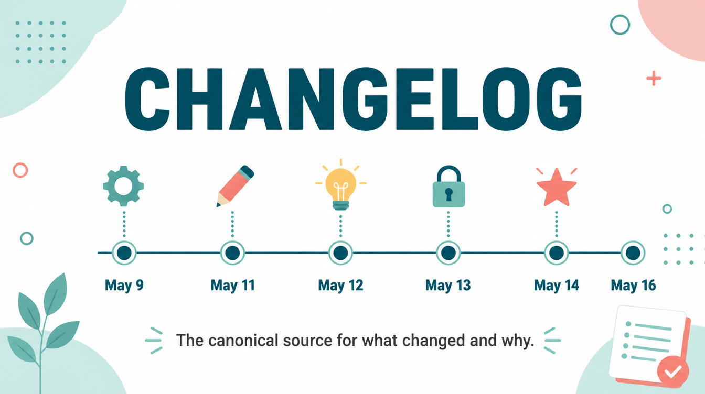

All notable changes to the `claude-comic-pipeline` are tracked here.

This file is the **canonical source for what changed and why**. Any session (human or agent) editing this repo must append an entry here when it lands a meaningful change. Trivial cleanups can be skipped; anything that touches behavior, prompt architecture, the build-comic workflow, or a published reference doc must be logged.

Format: each entry is dated (YYYY-MM-DD), grouped in reverse-chronological order. Entries cite the relevant commit hash(es) and explain the *why* — what failure mode prompted the change, what the new behavior is, where readers can dig deeper.

Categories used per dated section: **Added** / **Changed** / **Fixed** / **Removed** / **Deprecated**. Skip categories with no entries.

---

## 2026-08-11 — Ideator engine built + WP-API catalog feedstock (Stage 1 engine lands)

### Added

- **The ideator's tournament engine** (`skills/ideator/scripts/tournament.py`) — replaces the `BUILD ME (stronger model)` stub, built deliberately per the stub's own instruction. Architecture rule: **judgment in Claude, mechanics in Python.** The engine is a four-step checkpoint harness — `brief` (feedstock digest + graceful-degrade report + prior-slate dedup fingerprints) → Claude generates ≥2 concepts per angle → `ingest` (per-concept jsonschema conformance, angle quotas, token-Jaccard near-dupe detection vs ALL archived slates and intra-slate, F1 growth-ratio floors, cast consistency; exit 2 on failure) → Claude scores against `rubric.md` verbatim → `finalize` (recomputes `cast_size` + `weighted_total` itself — Claude's arithmetic is never trusted — ranks, enforces the **flat-slate guard** (weighted-total stdev < 4 or range < 8 = refusal), validates the assembled slate, auto-archives into `slates/`) → `select` (records the human pick; never auto-selects). Why this shape: the gate doctrine — Claude's promises are not load-bearing; only in-path mechanical gates are. Negative-path verified: dupe/flat/missing-score/bad-enum/bogus-select all refuse with exit 2.
- **`skills/ideator/roster.json`** — locked-character roster feedstock (Kelsey Brandt; Dana Lane, Supraman, Dee-Dee 'Destroya', Dex Doomer + 5 locked locations), built from the ref ledgers in `projects/`. The brief reads it automatically; keep it current as projects bank casts.
- **`skills/ideator/slates/`** — the slate archive = the tournament's cross-session dedup memory, with **two real validated example slates**: unseeded (top 3: `destroya-owns-the-street` 87.7, `ratio-d` 78.5, `the-word-no` 75.4) and seeded "gym rivalry" (top 3: `home-court` 86.2, `rep-thief` 86.2, `mirror-set` 73.8). Both produced end-to-end through the engine (16 concepts total, all 4 angles × 2, schema-validated, per-axis scores + rationale, spread enforced); slate 2's generation dodged slate 1's fingerprints live.
- **WP-API catalog ingest** (`research/comic-corpus/scripts/ingest_catalog.py` → `research/comic-corpus/catalog/`) — **supersedes the parked B2 browser-login path**: GrowGetterComics is the user's own WP site, so the catalog is ingested over the REST API via the `~/Documents/.credentials/bin/wp` Keychain wrapper (no secret ever enters context), paced at 1.2s/request. Ingested **1,091 posts / 27 pages / 9 categories / 59 tags / 702 approved comments** → committed text records (`posts.jsonl`, `pages.jsonl`, `series.json`, `INGEST.md`) with post-kind classification (655 gated serial pages / 184 fan-art / 105 comic chapters / 27 PDF bundles), Patreon-gating flags, series clustering, and image **URLs/ids only — no binaries in git** (raw API responses stay in gitignored `catalog/raw/`).
- **`research/comic-corpus/catalog/SYNTHESIS.md`** — catalog findings **C1–C6**, the corpus's first popularity/monetization signal (closes part of the "no popularity signal" gap): C1 the Heidi character-universe serial is the modern flagship (~800+ pages — favor concepts with serial legs); C2 engagement leaders are mundane-institution hooks (`influencers` 34 comments — and `not-exactly-as-planned` is BOTH a top engagement leader and one of Gribble's three highest-growth scripts: growth density and audience response line up); C3 the freemium funnel (52 free comics acquire, 655 gated dailies retain); C4 16–32pp chapter band confirmed; C5 Fan-Art Friday ritual; C6 the 2021→2026 production-capacity cliff the pipeline exists to fill.

### Changed

- `skills/ideator/SKILL.md` — SHELL status → **ENGINE BUILT**: documents the four-step harness, the roster/catalog feedstock, and the component map. `references/rubric.md` — engine-status footnote updated; **scoring semantics and weights unchanged from v1.0** (slates stay comparable).
- `research/comic-corpus/_queue.md` + `README.md` — B2 section marked SUPERSEDED by the WP-API path (what it does and doesn't cover); feedstock list updated.
- `.gitignore` — `research/comic-corpus/catalog/raw/` (raw WP responses are re-derivable; derived records stay in git).

## 2026-08-11 — Stale-branch triage: two experiments merged, five branches documented in docs/BRANCH-LEDGER.md

### Added

- **`docs/BRANCH-LEDGER.md`** — disposition record for the seven pre-reconciliation branches. Merged to main: `experiment/01-generalization-smoke-test` (`7445dca` — smoke-test results, schema-disagreement postmortem blog + graphics, read-only validator) and `experiment/04-schema-contracts` (`cf07a32` — six stage-boundary JSON Schemas under `schemas/`, read-only `schema_audit.py`, wiring proposal). Kept unmerged with reasons + content pointers: exp/02 vision-audit pilot (feeds vision-shadow work), exp/03 multipass (rating round never ran), exp/05 defects skill (superseded by the canonical DEFECT-REGISTRY; 42 binaries), yuna-rerun (records the refactor's failed pre-flight), refs-are-truth refactor (sole holder of `skills/reference-acquisition/` — still pointed at by CLAUDE.md; port needs fresh assessment). **No branch deleted.**

## 2026-08-10 (L39 situation-expression registers + proposed D15 gate)

From the user's posing-guide digestion: the four-woman showcase templates in `posing-and-expressions.md` fix uniformity but encode exactly ONE situation — reused on confrontations, defeats, or reveals, their poses/emotions leak and the panel reads varied-but-wrong-for-the-story. The rule: **anti-uniformity within a situation-appropriate register** — the shotlist beat declares the situation, the situation names the register, each character draws a DIFFERENT pose+emotion pair from it. (Dispatched as "L35"; L35–L38 were already assigned on main by the time this shipped — L38 story-spine landed mid-session — so the lesson lands as **L39**. The gate number D15 was free and stands.)

**Added**
- **L39** in `skills/comic-production/references/lessons-learned.md` (+ load-bearing index row) — *Situation-expression registers: anti-uniformity within a situation-appropriate register.* Companion to L34/`staging-and-composition.md`: L34 places the bodies in space, L39 governs what each body/face is doing there. Equal transformation tier among peers (variety via angle/reaction, never size hierarchy); mechanical expressions per `feedback_expression_intensity`; on active growth beats L35's peak-intensity directive owns the grower's face and the register governs the witnesses.
- `skills/comic-production/references/situation-expression-registers.md` — the 9 registers (`showcase` = the posing-guide templates unchanged, `celebratory`, `confrontation`, `mid-action`, `surprise-reveal`, `aftermath-victory`, `aftermath-defeat`, `dialogue-tense`, `intimate`), each with 4-pose ‖ 4-emotion menus; the non-showcase face-mechanics extension table (32 emotions in brow/eyes/mouth/jaw/head terms — extends the posing guide's celebratory-only table); per-register prompt fragments; the staging-stanza contract (`register_pose`/`register_emotion` exact labels alongside the L34 `staging_type`); 3 dry-run-validated worked stanzas.
- `docs/proposals/d15-expression-register-gate.diff` — **PROPOSED** D15 check for `qa/compose.py` (authored against main@cf07a32, NOT applied — Layer 8): HARD multi-char panel missing `panel_situation`; HARD register keys missing/outside the register; HARD two characters sharing a pose+emotion pair; SOFT >3 multi-char showcase/celebratory per chapter; body gains `dramatic_situation` (mirrors the L34 `staging` injection it sits next to). For the user to apply + re-bless at the next gate review.

**Changed**
- `skills/script-breakdown/SKILL.md` — emits `panel_situation` per beat (**required on panels with 2+ named characters**, encouraged solo): schema example, field rule, new §4.8 (how to pick the register; budget the celebration registers; seams with L34/L35), and a §5 validation bullet.

*Docs/skill/proposal only — no gate script, rule module, or `compose.py` edited; the .diff is a document. Validated 2026-08-10 by zero-credit dry-run: patched gate `py_compile` clean + `git apply --check` clean; 3 stanzas (confrontation / surprise-reveal / aftermath-defeat) compose with distinct poses AND emotions; out-of-register ("ecstatic-joy" on a face-off) and shared-pair negatives both refuse; all 72 register labels cross-checked verbatim between diff and reference doc.*

## 2026-08-11 (Stage 7 PUBLISHER — prep half built: skills/publisher/, never-post by construction)

The production line's exit stage, built to `PRODUCTION-SYSTEM-VISION.md` §2/§5 and the posting-ops research (2026-07-25). **The stage's hard rule: it never posts, uploads, or deploys — it prepares; the human publishes** (per `feedback_never_post_without_permission`; enforced structurally, not by promise: `prepare_post.py` is stdlib-only with no network-capable imports, and no code path fires outward).

**Added**
- `skills/publisher/SKILL.md` — Stage 7 skill. Triggers ("prepare the publish", "get this ready to post", build-comic's posting stage); workflow = run `prepare_post.py` → Claude fills the `[FILL-*]` caption slots from the shotlist → sanity pass → **STOP and hand the human `CHECKLIST.md`**. Explicit NEVER-POST rule at the top, including for future Walk/Run autonomy modes. Explicit NOT-triggers: "post it"/"publish it" are requests for the human act, answered with a bundle + checklist, never a post.
- `skills/publisher/scripts/prepare_post.py` — assembles `projects/<p>/posting/bundle/`: `CHECKLIST.md` (destination-ordered: **site → patreon → deviantart → twitter → instagram** — canonical home first, then money, then reach per the posting-ops research; keys match `studio/posting.php` chips exactly), `captions/<platform>.md` (auto-facts + prose slots), `crop-specs.json` (per-platform dimensions + page picks; **v1 renders nothing**), `site-apply-notes.md` (property-keyed: comic-platform runbook path for WP properties incl. pre-filled manifest JSON + flip-date reminder, admin-CMS path for 3dmc), `whats-new-draft.json` (updates.json entry draft per `reference_whats_new_feed`), `posted.template.json`, `MANIFEST.json` (page inventory with PNG dims read from IHDR, provenance). Also seeds `analytics/engagement-stub.json`. Guards: refuses to run if `posting/posted.json` exists (already posted), refuses to overwrite a bundle without `--force`, warns on shotlist/page-count mismatch. `--pages-dir`/`--aux-root` let binaries live outside the checkout (Drive, another clone).
- `skills/publisher/references/posted-schema.json` — the `posting/posted.json` contract (what got posted where/when, proof URLs, per-platform status/scope). **The template ships in the bundle; only the human who actually posted fills it and saves it up one level — the file existing is `build-comic.md`'s posting-stage sentinel, so creating it early would falsely mark the stage done.**
- `skills/publisher/references/engagement-stub-schema.json` + `analytics-capture.md` — the flywheel landing pad (Publisher → Ideator contract, VISION §4): append-only `captures[]` + `capture_plan` (+7d/+30d), source-by-source capture doc (GA4 property ids, Patreon campaign ids, wrappers-only credential rule per `project_credential_architecture`; DA/X/IG are Tier-2 live-session or manual reads). Wiring is Wave-2 — the shape is defined now.
- `skills/publisher/references/posting-board-alignment.md` — what `studio/posting.php` already does (lanes, chips, locked-and-loaded status; a thin live status surface) vs. what this skill adds (per-comic prep bundles), the end-to-end handoff, and division-of-labor rules so the two never grow overlapping features.
- **Validation bundle committed** (text only, per CLAUDE.md rule 5): `projects/not-so-supra-man/posting/bundle/` + `analytics/engagement-stub.json`, prepared against the real 46-page lettered set (`--pages-dir` at the main checkout; property growgetter, release 2026-07-30, `--already-on-staging` per the comic-platform runbook Appendix A). All caption slots filled; zero outward actions taken.

**Notes**
- `docs/PRODUCTION-SYSTEM-VISION.md` status flip applied in this batch (Stage 7 stub → prep-half-built, §3 heat map, §4 contract rows) — the doc reached main via the 2026-08-11 comic-corpus reconciliation merge mid-build.
- Live `admin/data/updates.json` What's-New entry deliberately NOT posted this session (zero-outward-actions validation mandate); the bundle's draft demonstrates the mechanism.

## 2026-08-11 — Reconciliation: origin/main merged into feat/comic-corpus (22 commits in, 3 conflicts resolved)

### Changed

- **Merged the 22 main-side commits** that had accumulated while this branch ran ahead 116: the complete cheer-ascension reference canon + banking receipts (17 commits), the L36 Flow-Omni / L37 orientation-variety lesson batch with cinematography/continuity refs, the `reference-sheets` skill, `tools/studio_worker.py`, and main's June v2-gate re-bless. Context: the 2026-05-22 mac-mini stale-branch incident — fleet machines pull `main`, so `main` must carry the real state.
- **Conflict resolutions** (per the reconciliation ground rules): `CHANGELOG.md` — both histories spliced newest-first by date, each side's internal order preserved, 19 main-side entries interleaved into the June–July window (a pre-existing 07-24-above-07-30 mis-ordering in the branch history was left as-is); `lessons-learned.md` — both sides kept, ordered L36 (Flow Omni, main) → L37 (orientation, main) → L38 (story spine, branch, renumbered from in-flight "L36"); `projects/not-so-supra-man/qa/MANIFEST.sha256` — took the branch side **verbatim** (the user's own 2026-08-11 re-bless): the merged gate scripts hash to exactly that manifest, `integrity.py` verifies **gates intact ✓ fingerprint 49197e3f6bf9b7aa**, no gate content was hand-edited.

## 2026-08-11 — Reconciliation prep: parked working-tree state committed (L38 story-spine gate, STYLE v3 / WARD-07, studio ownership layer)

### Added

- **L38 story-spine gate** — `check_story_spine` in `skills/continuity-check/scripts/rules_audit.py` enforces corpus Finding 5 at shotlist time: a stated `want`/`obstacle`/`cost` spine (stubs rejected, not just absences), `promise_page`→`payoff_page` pairing, endings that land or declare a real hook, no runs of interchangeable capstone panels, and pairwise-distinct `distinguishing_marks` for climax characters. Registered in `next_panel.py`'s phase-1 rule registry, authored at `script-breakdown` § 4.7, lesson written up in `lessons-learned.md`, tests at `tests/test_story_spine.py` (14/14 green: one per corpus failure mode plus the passing shapes). NOTE: this work was labeled "L36" while in flight; renumbered **L38** at reconciliation because `main` assigned L36 (Flow Omni editing) and L37 (orientation variety) first.
- **WARD-07 — skin-fabric gradient blend** defect class in `DEFECT-REGISTRY.md` (insta-kill: bare skin gradienting into fabric on the same limb) + **STYLE BLOCK v3** in `research/vitality-gap-2026-08-11.md` (aggressive explicit body over-spec per owner calibration, SLEEVES clause, per-beat injection rule 6, stage-A rubric line) with the owner-feedback addendum in `research/owner-defect-feedback-2026-08-10.md`.
- **Studio ops ownership layer** — `ownerType` (🤖 AI / ⚙ System / 🧑 Human) on ops tasks: constant in `inc/ops.php`, create/patch support in `ops-api.php`, filter + bulk-bar + drawer field + row chip in `ops.php`. Plus `studio/api.php` bulk image mutations (`action=bulk`: approve / unapprove / bad / keep / delete), `export.php` `?only=approved|good` filters (reference uploads now always excluded from zips), and the shared `/hub/nav.js` bar on nine studio pages.

### Changed

- Committed ~390 lines of parked, uncommitted working-tree state found on `feat/comic-corpus` during the 2026-08-11 main↔branch reconciliation, so the merged `main` carries the real pipeline state the fleet pulls.

## 2026-08-11 — Re-bless not-so-supra-man qa gates: L34 staging gate made load-bearing (user-approved in-session)

### Changed

- **Re-blessed `projects/not-so-supra-man/qa/MANIFEST.sha256`** (new fingerprint `49197e3f6bf9b7aa`) after the user reviewed the sole gate change since the prior bless (`91b774e`): commit `48fa3b2` added +50 lines to `qa/compose.py` that make the **L34 subject-staging gate load-bearing** — a multi-character page must now declare a plane-breaking `staging_type` (leading-diagonal / depth-staged / triangular / …), flat "lineup / level row / square to the lens" language is auto-rejected (`FLAT_LINEUP_RE`), and the matching `STAGING_DIRECTIVE` is injected into the composed prompt. This is the corpus camera-dynamism lesson turned into a hard mechanical gate. Re-blessing unlocks the mandatory compose→audit→bank chain for the 46-page build (banked refs: Dana T9 + T6-torn + T6-suit turnarounds; face/body for all four cast). Generation model for this run: Nano Banana 2 Lite. User approved in-session; manifest committed on its own per the Layer-8 protocol.

## 2026-08-10 (late) — b18/b23 escalation resolved: cast-list fix + money-shot re-rolls (20:36–20:55)

### Fixed

- **Scanner bug that killed b18/b23 in run `bo-autopilot-ab-20260810`**: the beat sheet had no per-beat cast list, so stage A flagged the SCRIPTED investor trio (+Kress) as unwanted extras (CAST-02 ×24 across the first three rounds) and the plan-vs-beat reconciliation in `bakeoff.py` never fired. `autopilot-ab-beats.manual-20260810.json` now carries `chars` for all 11 beats (b18 = MARGO + 3 investors, b23 = + KRESS), and the run state was patched the same way. Residual gap: `qascan`'s people-count still over-counts partially-cropped figures, so a fresh Sonnet cast-verifier pass (all figures matched to the ref sheets, exactly 4 humans in all six b18 r5 variants) was used to overturn the remaining CAST-02 false positives — worth folding a cast manifest into `ck_ai_qa` itself.

### Added

- **Round 4 (both beats) + round 5 (b18) money-shot re-rolls**, 6 variants/round on `nano_banana_2` (full, deliberately not lite — the API job record labels these `nano_banana_flash` even though that id 404s if requested directly; silent-substitution telemetry strikes again). Prompts re-authored against `research/owner-defect-feedback-2026-08-10.md`: b18 got a worm's-eye dutch diagonal, visibly bending bar, gritted-teeth strain, rim light + long shadows, and investors at three staggered depths incl. FG bokeh, plus a round-5 HEADCOUNT LOCK clause; b23 got a deliberate size overshoot (biceps rivaling her head, beyond the ref sheet's top stage) after the owner's "not busty/curvy/muscular enough" verdict, plus an explicit five-person cast count and a text ban (round-2 had garbled 'FINAGOAFIOUT' lettering). 19 submits, 18 delivered (1 NSFW block on a b18 roll, cleared on the modest-reframe retry), all byte-distinct, 27 credits (5712.06 → 5685.06). **Winners: b18 r5v6 `bef2a24879.png` (93/100), b23 r4v2 `73db27ad29.png` (80/100)** — both `accepted=true rating=good` + `bakeoff,judge-pick`, judge one-liners posted via `do=annotate`. Run yield rewritten: clearRate 1.0 (11/11), cleanVariantRate 0.526 over 78 rolls, 87 credits total. Stale `needs-human` tags from the exhausted round-3 attempts remain on `30b03499ab.png`/`ac9b890bed.png` (bridge tags are additive-only; superseded, owner can clear in Review). Composite refreshed at `/tmp/dr/autopilot-ab-composite.jpg` (winners green, rejects red, all 5 rounds).

---

## 2026-08-10 (evening) — autopilot-ab bakeoff run EXECUTED manually (20:05–20:26)

### Added

- **Run `bo-autopilot-ab-20260810`** (higgsfield-mcp backend, driven live from a laptop session at the owner's request instead of waiting for the mini's nightly driver). 11 beats × 4 variants + 2 beats × 2 retry rounds = **60 generations, 0 API failures, 0 NSFW blocks, 44/44 and 8+8 retry images all byte-distinct** (one `count:4` call per entry per the lane rule). Yield: **cleanVariantRate 0.55 vs the old lane's 0.192 baseline (2.9×)**; 9/11 beats cleared on roll 1 (clearRate 0.818); winners landed `accepted=true rating=good` + `bakeoff,judge-pick` on board `autopilot-ab`. Stage B ran as fresh Sonnet subagent judges (local `claude -p` had no auth — external-verdict path `stageb-verdicts.json`, same as the validation run), rubrics passed by path incl. `research/owner-defect-feedback-2026-08-10.md`. NEW: each winner's one-line judge reason is posted onto the winning panel via `do=annotate` (caption + notes, QA verdict/people preserved) so "why this won" is visible in Review. `b18-money-lift` and `b23-finale` exhausted 2 retries on persistent CAST-02 (scanner counts the scripted investor trio/cast as extras — the sheet has no `chars` cast list, so the plan-vs-beat reconciliation never fires) and sit FLAGGED `needs-human` on the board (30b03499ab.png, ac9b890bed.png). Lesson for the next sheet author: **populate `chars` per beat** so multi-cast money shots can pass stage A. Yield pushed to studio (`do=yield`); run artifacts in `runners/bakeoff/runs/bo-autopilot-ab-20260810/` (gitignored); composite at `/tmp/dr/autopilot-ab-composite.jpg`; manual-mode sheet committed as `runners/bakeoff/autopilot-ab-beats.manual-20260810.json`. Queue copy `git mv`'d to `queue/done/` with `autopilot-ab-beats.MANUAL-RUN.txt` so the mini does not double-run it tonight.

## 2026-08-10 (later)

### Added

- **queue/autopilot-ab-beats.json** — the A/B rerun: the 11 beats the owner critiqued on autopilot-test (research/owner-defect-feedback-2026-08-10.md), re-authored per the fixes — dialogue beats torso-up, no fourth-wall gaze, wardrobe/prop/bubble continuity pinned, B18 staged with depth + exertion, B23 physique to reference standard — targeting board `autopilot-ab` (refs copied from autopilot-test), backend flow-chrome (free). Old lane's 19% keep rate is the control.

## 2026-08-10

### Added

- **research/owner-defect-feedback-2026-08-10.md** — owner walked autopilot-test (120 panels) beat by beat and named defects in his own words; structured into registry-aligned classes with severity tiers (insta-kill: skin-torn-as-fabric, glitch props, wardrobe state flips; systemic: shot-scale monotony — dialogue beats must be torso-up per cinematic-framing.md, dead-face/flat staging, fourth-wall gaze from forward-facing refs; consistency: bubble color, prop layout, garment condition; taste: body scale must match the owner's ⭐ Flow picks, not generic-realistic). This is judge/ranker calibration ground truth for the over-generate→judge→retry lane.
- **review.php viewer: explicit full-size controls** — ⤢ 100% button + ⤓ Original (new tab) + hint chip in the lightbox (zoom existed but was undiscoverable; owner: "can't see it full size, almost impossible to judge"); Dense mode now marks winners unmissably (thick accent ring + larger check).

## 2026-08-09 (💳 Lighting credit-burn validation — Golden v2 loses the A/B, default reverts to v1)

### Fixed

- **`pbLight` default flipped `"golden"` (v2) → `"golden1"` (v1)** in `studio/extension/flow-studio-tools/content.js:342`. The credit burn owed since v2.7.0 (`INTEGRATION.md` §5 step 5, `feedback_validate_with_credits`) finally ran: 5 conditions × 4 seeds = 20 generations on Nano Banana Pro, one identical character ref (`74a9bb22`), identical beat/camera/wardrobe/aspect — the lighting block the only variable, control verified from the exported Review manifest rather than assumed. **Golden v2 did not beat v1.** It tied on usable-panel rate (3/4 vs 3/4) and terminator variation (2/4 vs 2/4), failed to render either of the two ambient-occlusion locations its rewrite exists to add (collarbone notch faint in 1/4, calf split in 0/4), showed the *worst* silhouette-hugging rim of either arm in `goldenV2-3` despite shipping a "stronger anti-glow guard", and introduced a failure mode v1 has never shown — `goldenV2-3` rendered cool blue-grey, a Golden Rake with no golden. The best single image across both arms was `goldenV1-4`. v1 keeps its 28/28 production evidence and the default; v2 stays selectable. Caveat recorded: two of v2's four draws occluded the very anatomy its new claims describe, so those claims are *unproven*, not disproven. **The flip only reaches a fresh install** — `pbLight` persists in `chrome.storage.local` and the stored value wins over the default (`content.js:478`), so any browser that has touched the `Light:` dropdown keeps its stored scheme until the operator picks *Legacy → Golden v1* once or runs `chrome.storage.local.remove("pbLight")`.

### Added

- **`docs/posts/2026-08-09-lighting-validation.md` + `docs/posts/assets/2026-08-09-lighting-validation/`** — the full write-up and all 20 images with an `index.json` seed/timestamp log, per `feedback_validate_with_credits` ("commit the validation results into the pipeline repo"). Judged by a fresh-context subagent against the canonical rubrics passed verbatim by path, per `feedback_audit_via_subagent`.
- **Venetian Slat half-lands.** The stripes genuinely deform over limbs — bars wrap the bicep cylinder, compress at the waist, and in `slat-3` the floor-plane stripe angle breaks cleanly from the body-plane stripes. But **across all four seeds the bars cross the chest/bra region as straight evenly-spaced lines**, which is exactly what the block's own wording calls "a mistake". Repeatable scheme-wide gap, logged as a defect and a candidate wording fix.
- **Overcast Soft is the most fragile scheme tested** — 1/4 clean (`overcast-2`, which does prove volume can come from falloff + contained occlusion alone), 1 severe rim-light violation (`overcast-3`, continuous glowing silhouette outline).
- **✏️ Drawn prefix validated: the painted-comic anchor holds in 4/4** — real ink contours, painted value blocking, no drift back to photoreal/CGI. Confirms the INTEGRATION.md §6.1 call to ship a separate prefix block rather than making `Render:` swap what 🎨 DAZ emits. The stripe *physics*, though, only fully transfer to the drawn medium in 1/4; the illustration variant appears to make deformation harder, not easier.

### Deprecated

- **The canonical-rubric path in `CLAUDE.md` is stale.** It (and `INTEGRATION.md`) cite `skills/continuity-check/qa-checklist.md` + `cinematic-framing.md`; neither file exists there. Both live at `skills/comic-production/references/`. The QA pass used the real path.

### Not done

- **🔎 Detail / ECU (v2.7.2) is still unvalidated on credits.** The browser was running **v2.7.1** — `flow-lighting.js` and all 20 `Light:` options were live, but the panel exposed no `detail` button, confirmed after a hard page reload. The unpacked extension must be reloaded at `chrome://extensions` before that lane can run. Still owed.

## 2026-08-09 (🔎 Detail / ECU block — the missing shot type, v2.7.2)

### Added

- **🔎 Detail button in 3DMC Studio Tools (v2.7.1 → v2.7.2).** From an owner prompt — *"Cinematic focus: f/1.8 shallow depth of field — background melts into soft bokeh, only her [muscle group] tack-sharp. Strong rim light from behind-left traces the muscle contour…"* Shipped as its own **shot type**, not as a lighting add-on, because that is what it actually is: every other framing block in the panel is mid-thigh-up hero staging, while `cinematic-framing.md`'s Variety check wants **at least one ECU per 10 panels** and Pattern 2 (the pull-out) opens on `ecu-region`. The panel had no button for it. It asks which region the shot is on when clicked, then fills the frame with it.
- Four edits to the owner's wording, each bought with a documented failure in `cinematic-framing.md` → *Lighting-pass fragments → Hard rules* (validated 2026-07-09, 7 batches / 28 images): **(1)** the region is asked for on click and interpolated, never left as a bare `[muscle group]` — an unfilled placeholder makes the model hunt for what to fill in — and the block ships a real no-answer variant ("pick the single muscle group that carries this beat") rather than a bracket; **(2)** macro **100–135mm** added per the lens table (100mm+ = ECU-region, isolation), since an f-stop states the aperture but not the magnification; **(3)** "strong rim light" → bright rim **plus** the anti-glow guard, because "strong, hot" rim renders a literal glowing outline (sticker/aura look) on ~half the variants; **(4)** the defocus is named as **optical depth of field, not a softening of the render**, reconciling it with the `no added blur` clause that closes all 19 lighting schemes *and* `PB_LIGHT_V1` — without it the two sentences fight inside one prompt.
- **The same words are right here and wrong in a lighting pass**, which is why this is a separate button rather than a change to Cine+Light: the Hard-rules table forbids "f/1.8, only her [X] tack-sharp" *in a lighting pass*, because there the shot already exists and that phrasing re-crops it into a macro ECU. That re-crop is exactly the point of a detail shot. So 🔎 Detail is for fresh generations (or an i2i reframe with the panel as ref and **no** composition lock), composes with 💡 Light across all 19 schemes, and must not be stacked with Cine+Light, whose framing half fights it. Written up in `cinematic-framing.md` under the `ecu-region` fragment.
- **Still unvalidated on credits.** The wording is assembled from validated pieces, but this exact block has never been generated with — it joins the v2.7.0 lighting burn already owed.

### Changed

- **`askName` generalized** so a block can supply its own question, its own pre-filled default, and opt out of upper-casing the answer (`askQuestion` / `askDefault` / `askUpper`). 🧍 Char sheet is unchanged — same question, still upper-cases the name plate — verified by regression in the headless harness, alongside the new block's named / blank / cancelled paths and a check that a `🔎 Detail + 💡 Light` prompt never carries `bokeh` and `no added blur` without the reconciling clause between them.

## 2026-08-09 (🔥 First live bakeoff run — two driver bugs found the hard way)

### Fixed

- **`nano_banana_flash` no longer exists in the Higgsfield catalog.** The very first live generation call errored `unknown model`. Both `CLAUDE.md` and the bakeoff README named it as the default, so **tonight's night-shift driver would have failed on its first entry**. Live image ids are `nano_banana_2`, `nano_banana_pro`, `nano_banana`, `nano_banana_2_lite`. Also observed: requesting `nano_banana_pro` returns a job tagged `nano_banana_2` — the API substitutes silently, so the returned `model` field must be checked rather than assumed.
- **Sequential `count:1` submissions produce duplicate variants.** These models expose no seed parameter, so identical back-to-back submissions collide: four sequential `count:1` calls for the cast-lineup beat returned **3 distinct images** (two byte-identical, same MD5, different job ids), while a single `count:4` call for the next beat returned **4 distinct**. That burns ~25% of spend and shrinks the variant pool the whole lane is built on. The general "count=1 per Higgsfield submit" house rule is now explicitly overridden **for the bakeoff lane**, where distinct variants are the entire point. Documented in `CLAUDE.md` and the README driver protocol.

### Changed

- `runners/bakeoff/seam-and-stone-refs.json` claimed out of `queue/` for a live laptop-driven run (queue is one-driver; the mini must not double-claim) and switched `flow-chrome` → `higgsfield-mcp`, because this laptop's Flow session is the **marrtrobinson** account, not the mini's growcomics. Cost measured at ~2 credits/image at 1k, so the full 12-beat sheet is ~96 credits of 5,848.
- Run `bo-20260809-205555`: cast lineup (3 distinct of 4) and Marla face card (4 distinct) generated. **Paused before the remaining 10 beats** — the cast lineup sets the house look for all 22 pages and that style call is the owner's, per the lineup-first doctrine.

## 2026-08-09 (🎬 Seam and Stone into production — shotlist + bakeoff refs queued)

### Added

- **`projects/seam-and-stone/`** — the patron commission (Olo's brief: overlooked redhead, a tear in reality, growth she keeps not noticing) taken from script to shot plan. `script.txt` is the revised 22-page script; `build_shotlist.py` parses it to `shotlist.json`.
- **Breakdown is a parse, not an AI call, for this format.** A Gribble-format script is already panel-level, so there is no prose to break down — `creator.php?do=breakdown` was skipped deliberately rather than for lack of access (it is session-only, and neither it nor `bridge.php` was worth editing for this). The parser reuses the corpus reader, so **a merged `Panels 1, 2, 3 and 4-` page resolves to ONE slot** — 22 pages become **70 drawn slots, 6 of them full-page merges**, every one landing on a growth or spectacle beat.
- `shotlist.json` carries per-slot camera, on-screen cast, dialogue, and **Marla's growth tier (1-6)** so the artist always knows what size she is. Camera mix: 41 medium / 18 establishing / 6 full-page / 5 ECU.
- **`runners/bakeoff/queue/seam-and-stone-refs.json`** — stage-one beat sheet queued for the night-shift driver: 12 reference beats × 4 variants = **48 generations on `flow-chrome` (free)**. Cast lineup first (style propagates from it), then face cards for Marla/Jess/Annie, growth-ladder sheets for both women, and env plates for quad/field/tear-effect/dorm/court/science building. Validated against `beatsheet.schema.json`.
- **Staged in two sheets on purpose.** `identityRefs` resolve against the project's LOCKED refs only (genspec doctrine), and this project had none — so panels cannot be queued until the reference sheets come back and are locked. The panel beat sheet gets generated from `shotlist.json` after that, with prior accepted panels available as anchors.

### Fixed

- Three defects caught by reading the first shotlist output rather than trusting it: characters named in *dialogue* were being listed as on-screen (a line about the Coach put him in a panel he is nowhere near — now on-screen cast comes from art direction only, with a separate `mentionedOnly` field); the `(Full page panel)- ` layout prefix was surviving into the action text; and the camera classifier was defaulting almost everything to `medium` (18 establishing shots were being missed).

## 2026-08-09 (✏️ gr_update — revise a saved script without regenerating it)

### Added

- **`gr_update` verb.** A patron gave line-level feedback on a generated script (*"I want Jess' fragment there at the end to stop glowing because the moment Marla slams her hand down we see the energy snake into her"*) and there was no way to act on it — the library could save, star, rename and trash, but not edit. Regenerating would have thrown away everything the reader already approved. `gr_update` replaces a saved script's text in place, keeps the id, re-scores the structure, re-reads the synopsis, and **stacks the previous text into `revisions[]` (last 10) so an edit can never lose an approved version.**
- First use: *Seam and Stone* (`05df6af7aa`) revised to the patron's note — the fragment in Jess's pocket flares on Marla's hand-slam, the energy snakes across the grass into her palm, and the stone ends grey and dead. Re-scored **clean** (22pp · growth 27.3% · merges 27.3% · dominance · apotheosis). Two knock-ons worth noting: Marla's "Relax. Nobody's getting hurt today." is gone, since it contradicted a ground-cracking slam in the same panel; and the closing `Note:` sequel hook is closed by design — the fragment no longer glows, which is exactly what was asked for.

## 2026-08-09 (🌙 Night-shift worker becomes the bakeoff lane's generation driver)

**Added**
- `runners/bakeoff/queue/` — agreed beat-sheet drop location for the bakeoff lane.
  Contract in its README: pending `*.json` sheets (validated against
  `beatsheet.schema.json`) are drained oldest-first by the mac-mini night-shift
  worker only; completion = `git mv` to `queue/done/` in the same commit as the
  CHANGELOG entry; unrecoverable halts land in `queue/failed/` with a
  `<sheet>.halt.txt` note; optional per-sheet `creditCap` (default 100 paid
  gens/night). Why: the lane shipped with a pluggable driver protocol but no
  handoff point — sheets had no place to wait for the driver.
- `HANDOFF-MACMINI.md` §6 — the nightly driver duty end-to-end: pull → plan →
  drive jobsheet per backend (higgsfield-mcp: mini's MCP session,
  nano_banana_flash · 1k · count=1 sequential, credits checked first;
  flow-chrome: mini's growcomics session, account + model verified per submit;
  flow-manual: skipped) → collect/judge/retry loop → select → stats. Includes
  the Stage B contingency: verify `claude -p --model sonnet` once per night;
  on CLI failure use the `<run>/stageb-verdicts.json` external-judge hatch via
  a fresh Sonnet subagent rather than the first-clean fallback — main-context
  ranking stays prohibited.
- `docs/CHARTER-ADDITION-bakeoff.md` — paste-ready draft of the duty for the
  mini's local CHARTER.md (which lives on the mini, not in this repo).


**Added**
- `runners/bakeoff/` — the automated generation lane rebuilt around the owner's proven manual
  method instead of specify→generate-once→hope. Diagnosis (agreed with owner 2026-08-05):
  ~30 simultaneous prompt constraints × ~90-95% per-clause compliance ≈ ~20% clean panels —
  single-shot can't converge, over-generation + selection (owner keep-rate ~8% on a 341-panel
  project) is what works. Five pillars:
  1. **Beat contract + fan-out** (`bakeoff.py plan`, `beatsheet.schema.json`) — a job = one
     beat: anchor images + locked identity refs (via `genspec`) + action/camera-only prompt
     (appearance prose linted per refs-are-truth) × N variants (default 4). Backend-pluggable
     driver protocol (`jobsheet.json`): higgsfield-mcp / flow-chrome / flow-manual; the
     night-shift worker drains this lane as a driver, not a rival runner.
  2. **Two-stage judge** (`judge`, `registry.py`, `judge.py`) — Stage A: the live server-side
     `ck_ai_qa` scan via `bridge.php do=qascan`, mapped to canonical DEFECT-REGISTRY IDs
     (`defect-registry.json` is read, never redefined; blockers block, ref-sheets exempt from
     lettering blocks per picks-profile B95). Stage B: fresh `claude -p` Sonnet ranker over
     survivors, rubrics passed by path and read verbatim, weights calibrated on the owner's
     REAL picks (`research/picks-profile-eva.md`: camera/composition first, expression
     tiebreaker only). The judge never grades its own generations.
  3. **Retry loop** (`retry`) — zero-clean beats re-roll with the specific registry findings
     injected as corrective clauses (`registry.RETRY_INJECTION`), max 2, then land FLAGGED
     (`do=flag` + `needs-human` tag) in the human-review queue — never silently shipped.
  4. **Selection** (`select`) — winner lands `accepted=true rating=good` + `judge-pick` tag via
     `do=write` (existing board semantics); losers stay unrated/recoverable; an owner-accepted
     panel in the same group is never overridden (flowfav invariant mirrored).
  5. **Yield metric** (`stats`) — clean-variant rate/roll, beats cleared after retry, human-queue
     count, defects-per-shipped-panel by registry ID → `data/bakeoff-yield.json` (repo) +
     `do=yield` push to the studio.
- **Live studio deploy** (fetch-live → edit → save → marker-verified, all prior features intact):
  `bridge.php` gained cross-project `do=yield` / `do=yieldstats` (s_with_lock upsert into
  `studio/data/bakeoff-yield.json`, cap 500 runs); `cc.php` gained the 🎯 Bakeoff Yield trend
  card (clean-variant % + ▲/▼ vs prior run, beats cleared, human queue, defects/shipped).
  What's New entry `upd-bakeoff-lane` posted.
**Fixed** (from the live validation run `bo-validation-20260809`, 26 real Flow generations
  re-judged in studio project `bakeoff-validation`)
- Ingest doesn't echo the stored filename → board files now resolved by unique `gen` id.
- Image magic bytes sniffed for the orig extension (JPEG-under-.png broke every qascan mime).
- Stage B pluggable via `<run>/stageb-verdicts.json` (external fresh-context judge) for hosts
  without `claude` CLI auth.
- Validation result: stage A emitted registry IDs on real defects (CAST-02 ×18, PROP-01 ×7,
  BODY-05, LET-02), defect-injected retry cleared one beat, one beat exhausted retries into
  the flagged human queue, 3 winners landed accepted+`judge-pick`, yield pushed live.
  Measured clean-variant rate 19.2% — matching the ~20% single-shot diagnosis.

- `research/rule-diet-report.md` — report-only classification of all 38 L-lessons:
  22 mechanical attach-requirements, 15 post-gen detectors (registry IDs mapped), 1 strict
  prompt-prose-only wish (L15 glamour anchor, top prune candidate). Pruning stays an owner
  decision; nothing deleted.

## 2026-08-09 (✍️ Attribution — generated scripts no longer carry Gribble's name)

### Fixed

- **Generated scripts were credited `by Gribble`.** The writer copied the corpus header verbatim, putting a real person's name on work he did not write. Owner call: *"none of these stories are by Gribble, so you should probably remove that — you could say an AI-generated Gribble-inspired story."* The credit line is now **`AI-generated · Gribble-inspired`**, and the system prompt states outright that the model is not Gribble and the script must never be credited to him.
- **Enforced in code, not just in the prompt.** `gr_fix_byline()` rewrites any `by|written by Gribble` header (with or without the corpus's trailing email), collapses repeats, and inserts the credit under the title if none exists. It runs on every `gr_lib_save()` and in `gr_create()`, so a model that reverts to copying the corpus header still cannot ship an attributed script.
- **Migrated the ten already-saved scripts** via a new idempotent `gr_fixbylines` verb; all ten verified to carry exactly one credit line and no `by Gribble`.
- **Caught in verification:** the first version double-stamped the credit, because `gr_fix_byline()` ran once in the migration and again inside `gr_lib_save()`, and its insert branch only checked the *title* line for an existing credit. Rewritten to dedupe; migration re-run and all ten re-verified.

## 2026-08-09 (🎭 Gribble STORY correction — the formula's story axis was wrong)

### Fixed

- **The story section of the Gribble formula was inherited, not derived — and it was wrong.** The owner read five generated scripts and said they don't sound like Gribble: *"usually Gribble stories have a twist, or there's an overpowering, or something a little more interesting than drinking a potion."* He was right. `FORMULA.md` §6 said "ordinary woman → countable growth engine → strength feats → payoff," which came from `growgetter.php`'s existing `GG_FORMULA`, not from any measurement of Gribble. The structural work (page grid, growth density) was sound; the story axis had never been checked.
- **`research/gribble-corpus/plot_scan.py` (NEW)** extracts the open / peak / ending of all 41 scripts plus device probes, so plot could be read rather than assumed. What it found:
  - villain turn **95%** · overpowering another character **88%** · giantess/cosmic scale **80%** · backfire 51% · power stolen or drained 44%
  - endings: **71% apotheosis** (godhood + a demand for worship), 12% deflation, **59% close on an ALL-CAPS proclamation** (`NOW TO RULE THE WORLD!`, `KNEEL! BOW DOWN AND WORSHIP ME!`)
  - **the twist is structural: the power changes hands and the protagonist frequently loses it.** *Superior* erases its protagonist mid-scene and the rival ends the universe; the Ultra-Gal origin is secretly Domina's villain origin (the mentor fakes amnesia and keeps the powers); *Social Order*'s overlooked girl ends as the goddess with the lead kneeling; *The Power Belt*'s lab assistant ends 200 feet tall.
  - the engine is a **contested object** (crown, cloak, belt, stone, idol, book, ray) that a second character can seize — not a supplement the lead consumes.
- **`GR_FORMULA` story section rewritten** around four mandatory rules (contested power / at least one hand-off / one-upmanship sized against the *other person* / dominance as the climax), with the measured frequencies inline. `GR_ENGINES` replaced with contested sources and a new `GR_TWISTS` seed axis added; the prompt now makes the model commit up front to *who* ends supreme and *which* ending it is landing.
- **Root cause of the blandness, in our own prompt:** `GR_SFW` told the model "Muscle growth is STRENGTH, SPORT, HEROISM and CONFIDENCE" — actively instructing away the 95% villain turn. It now reads: SFW removes nudity and sex, **never the menace**; a character can be cruel, contemptuous and drunk on power while fully clothed.

### Added

- **Two story gates in `gr_report()`** — `dominance` (somebody is physically overpowered) and `endType` (apotheosis | deflation | neither) — with repair-prompt copy explaining the corpus frequency, plus two new UI chips.
- **`research/gribble-corpus/validate_story_gates.py` (NEW)** — the calibration harness for the story-axis gates, and the file `gr_sim()`'s comment already claimed existed but which was never committed. Mirrors the splash-repetition, ending-closure, dominance and ending-type logic; fails the build if any gate false-rejects more than 20% of Gribble's own work. Current: **83% of his scripts pass; `ending-neither` bites 15%, `no-dominance` 5%.** The first draft of the apotheosis pattern failed 34% of his endings by omitting the contempt-for-mortals and cosmic-scale vocabulary (`PUNY MORTALS`, "a Universe to rule") — broadened after checking against the corpus. **Run this after any edit to `GR_DOMINANCE`/`GR_APOTHEOSIS`/`GR_DEFLATION`/`gr_sim`.**
- Validation that the new gates discriminate: of the five scripts generated before the fix, **four fail** (`Iron Reserves`, `Ironbearer`, `Overload`, `Iron Ward`) — the same ones the owner rejected by eye.

## 2026-08-09 (📚 Gribble script library — every generated script is kept)

### Added

- **`studio/gribble.php` — the script library.** Owner ask: *"store the comics that get generated so I can review them later."* Until now `gr_write` handed the script to the browser and forgot it — the only way to keep one was to click **Create studio project**, so closing the tab lost the work. `gr_write` now **saves before it returns**, so nothing the writer produces can be lost.
  - **Storage**: one JSON per script at `data/gribble/s-<id>.json` (full script + structure report + seeds + the idea it was written from), plus `data/gribble/index.json` holding only list-view metadata so the library renders without opening every script file. Verified `data/.htaccess` (`Require all denied`) inherits to the new subdirectory — `studio/data/gribble/index.json` returns **403** from the web.
  - **Library panel** in the left column: title, page count, growth %, merge %, age, a green/amber dot for whether the script hit every structure target, and a ✓ marker for scripts already turned into a studio project. Click any row to load it back into the reader.
  - **Verbs**: `gr_list` / `gr_get` / `gr_star` / `gr_rename` / `gr_trash` / `gr_restore` / `gr_note`. **Trash is a soft status flip — the file is never unlinked**, per the standing "trash to a subfolder, never `rm`" rule; a *show trash* toggle lists and restores.
  - `gr_create` now records the resulting project id back onto the saved script, and the reader swaps its **Create studio project** button for **Open studio project** once one exists, so a script can't be double-projected.

### Fixed

- **The repo copy of `gribble.php` was ~5.5 KB ahead of the live file** (the STORY DISCIPLINE prompt block and the extra structure chips were committed but never deployed). Confirmed by diffing live against `git HEAD` that live held nothing the repo lacked — in particular that live's `csrf()` fix was already in the repo, so redeploying could not reintroduce the browser fatal — then shipped the repo copy as a fast-forward along with the library work.

## 2026-08-09 (✍️ Gribble page fatal — csrf_token() → csrf(); writer returned no script)

### Fixed

- **`studio/gribble.php` gr_write always returned "The AI did not return a script"** (deployed 2026-08-09 ~09:45 PT, live-verified end-to-end). TWO stacked causes, both from `claude-sonnet-5` API behavior: (1) the response parser read only `content[0]['text']`, but newer models lead with a thinking block — now collects ALL text-type blocks; (2) **claude-sonnet-5 runs adaptive thinking BY DEFAULT and `max_tokens` caps thinking + answer together** — the entire ~5K script budget was consumed by (encrypted) thinking, returning zero text blocks. Fixed by sending `thinking: {type: "disabled"}` on the writer call (templated script gen doesn't need it; also accepted by the claude-sonnet-4-6 fallback). Also added a diagnostic — `gr_ai_last` (model/http/curl-err/body-head) is appended to the user-facing error so the next API failure is self-explaining. Verified live: 8-page script generated in ~2.3 min, structure gate passed after one repair pass, gr_create → breakdown (8pp/32 panels) → queue(backend=flow) all green.

- **`studio/gribble.php` HTTP 500 on every logged-in browser GET** (deployed 2026-08-09 ~09:10 PT). Root cause: line ~516 `$CSRF = csrf_token();` — `inc/boot.php` defines `csrf()`, not `csrf_token()`, so the page fataled on undefined function. The bug was invisible until now because (a) anonymous requests exit at `require_auth()`'s redirect before reaching the line, and (b) the JSON verbs (`gr_write`/`gr_check`/`gr_create`) all `gr_jout()`-exit before it — which is exactly how the page was originally validated (headless, bridge-key). First real browser visit → 500. Fix is one word (`csrf()`), applied per DEPLOY-NOTES protocol: fetched the LIVE file, patched that copy, deployed only it (live was otherwise behind the repo — the repo's unvalidated L36 story-gate work was NOT deployed). Verified: logged-in GET renders the writer UI; anonymous GET still 302s to login. Repo copy carries the same one-word fix. Found while wiring the Flow Autopilot extension's first test job (Gribble was the fastest path to a genspec plan).

### Added

- **`studio/post/index.php` — standalone 5-step posting wizard, LIVE at https://3dmusclecomics.com/studio/post/** (deployed 2026-08-09 ~08:45 PT). Owner-approved decision: Alternate (the posting/ops hire) found the full studio overwhelming because it mixes comic *generation* tooling with posting/ops. The wizard is a posting-only surface: Pick (resume an in-progress board item, or start new with property + lane + title) → Art & copy (upload art / paste links, caption, notes) → Platforms (tick Site/Patreon/DA/X/IG; unticked → n/a) → Schedule (date + lane-aware quick chips: next 4 Fridays for FAF, month-ends for comics) → Review & confirm (marks the item *ready* and arms ticked platforms as *scheduled* → 🔒 locked & loaded on the board). **Zero forked logic**: every write is a client-side call to `posting.php`'s existing add/update/upload/plat/del API against the same `data/posting.json`; the wizard's only server-side code is a read-only `?do=state` JSON endpoint. Publishing stays HUMAN-FIRED — the wizard queues and prepares; the final-step warning says so explicitly. Auth = shared studio session (cookie pinned to path `/studio` so an existing login carries into the subdirectory) or bridge key, same as posting.php. A "Full studio →" link (to cc.php) is the only path back to the rest of the studio.

### Changed

- **`studio/posting.php`** (fetch-live merge, 3 additive edits): the `add` action's JSON response now includes the new item `id` (so the wizard can keep working on the item it just created); topbar gained a `📤 Wizard` link to `post/`. Repo copy synced from live (live had drifted ahead with the uploads/posting art feature — live is truth per DEPLOY-NOTES).
- End-to-end verified headlessly via bridge key: full add→update→plat→schedule→ready flow produced a 🔒 locked & loaded card on the board, then the test item was deleted.

### Added

- **✏️ Drawn style button in 3DMC Studio Tools (v2.7.0 → v2.7.1).** Closes the open question the `Light:` selector shipped with (INTEGRATION.md §6.1 — owner picked "ship the separate prefix block" over making `Render:` swap what 🎨 DAZ emits, so one button keeps doing one thing and a screenshot of the panel still says which anchor went in). The 19 lighting schemes each carry a `Drawn` variant that argues volume in an illustrator's terms — lit shape → halftone → core shadow → reflected light, terminator drawn *as a shape*, cross-hatch occlusion, broken tapering rim strokes — and stacking the photoreal 🎨 DAZ prefix on top of them puts two opposed render anchors in one prompt, which yields plastic-looking linework (`LIGHT-BLOCKS.md`). ✏️ Drawn prepends the opposite anchor: *"Painted comic-book illustration — hand-drawn linework with brushed, painted value rendering, the media visibly present in the mark-making — NOT a photoreal render, NOT DAZ3D or any CGI, NOT physically-based rendering, NOT a photograph."* **One render anchor per prompt**; the two prefix buttons are mutually exclusive by construction, and both tooltips plus the README say so.
- Verified in the same headless harness: the prefix prepends ahead of the operator's own prompt without eating it, and a full `Drawn`-lane prompt (✏️ prefix + `Render: Drawn` lighting block) carries no photoreal vocabulary outside the prefix's own NOT-list. The 19 illustration variants were also checked to be clean of CGI vocabulary (0/19 mention DAZ / PBR / subsurface / specular), and the 19 CGI variants clean of drawn vocabulary.
- **Caveat, stated because it matters:** unlike the 🎨 DAZ wording — which is the exact tested string from `prompt-templates.md` — this prefix is **not yet credit-validated**. The house style is photoreal 3D (`feedback_comic_style_3d`), so the Drawn lane is the exception; treat the wording as a first draft until it is burned in alongside the `slat` / `overcast` / `golden` v1-vs-v2 set still owed from v2.7.0.

## 2026-08-06 (💡 Light selector — 19 lighting schemes in the extension, v2.7.0)

### Added

- **`Light:` / `Render:` selectors + a 💡 Light button in 3DMC Studio Tools (v2.6.0 → v2.7.0).** Implements the finished proposal at `~/Documents/flow-prompt-lab/lighting/INTEGRATION.md`. Until now `Cine+Light` was *parameterized framing* + a **fixed** golden-hour grade: `pbLightingText()` returned one hardcoded string, so every panel that used the button inherited the same dusk light regardless of location, time of day, or beat. Lighting is now the third axis of the pattern that already governs camera and cast — `Light:` (19 schemes in 5 `<optgroup>` families: natural/exterior, dramatic, portrait, practical, stylized) × `Render:` (`3D` photoreal-PBR / `Drawn` painted-comic), both persisted in `chrome.storage.local` beside `pbCam` / `pbCast`, both echoed in the insert status line (`… light: slat/cgi`) so a screenshot of the panel records what produced a batch. The reads are guarded: a stored scheme key that no longer exists in the library falls back to the default instead of emitting a prompt with no lighting section.
- **`flow-lighting.js` — the scheme library as a generated sibling content script.** 19 × 2 blocks ≈ 70 KB; `content.js` is 49 KB, so inlining would more than double it and bury the extension's logic. Instead it follows the existing `flow-core.js` / `flow-delete.js` / `flow-bakeoff.js` convention — one object on `self`, loaded before `content.js` (manifest `content_scripts.js`). Generated by `flow-prompt-lab/lighting/build_ext.py` from `lighting.json`; **do not hand-edit**. Each scheme carries `%RAKE%` / `%RIM%` placeholders interpolated at click time from the same `PB_CAST` wording the framing block uses, so the cast-neutral `Auto` setting keeps working — no scheme asserts a figure count.
- **💡 Light button — lighting only, no framing, no camera.** The one prompt block that legally rides with the i2i keep-composition lock (Director, Cine+Light and Framing all direct the camera and fight it): attach an accepted panel as the sole ref, prepend the composition-lock sentence, and the same shot comes back re-lit. That is the post-hoc lighting pass documented in `cinematic-framing.md` §Lighting-pass fragments, which had no button before now.

### Changed

- **The v2.6.0 golden-hour string is demoted, not deleted — `PB_LIGHT_V1`.** It has two jobs: the `Golden v1` dropdown entry, so the tightened *Golden Rake* v2 (terminator placement, two more AO locations, a stronger anti-glow guard) can be A/B'd against the block with 28/28 production evidence behind it; and the fallback when `flow-lighting.js` is absent, so a missing or broken library degrades to exactly today's behavior rather than to an unlit prompt. Verified byte-identical to the shipped v2.6.0 output for all three `Cast:` values.
- **📷 Cine+Light tooltip** now reads "Camera height, figure count, and lighting scheme follow the Cam/Cast/Light selectors below." README updated with the selectors, the generated-file rule, and the `Drawn` caveat.

### Notes

- **Smoke-tested headless, no credits** (§5 step 4): the real `flow-core.js` / `flow-lighting.js` / `content.js` were loaded into a jsdom page with a stubbed `chrome.storage`, and both buttons clicked for all 24 combinations — `auto`/`solo`/`duo` × `3D`/`Drawn` × `golden`/`slat`/`contre`/`golden1`. Every `%RAKE%` and `%RIM%` sentence reads as English (no doubled preposition after `rakes across …`, no unexpanded placeholder, no figure count asserted under `Cast: auto`), 💡 Light matches the lighting half of Cine+Light exactly, `Golden v1` is byte-identical to v2.6.0, the selection survives a reload, and a stale stored key falls back to `golden`. **Not yet validated on credits** — per `feedback_validate_with_credits` the 4–8 real generations (`slat`, `overcast`, and `golden` v1-vs-v2 on the same refs) are still owed before the v2 golden counts as an improvement rather than a considered rewrite.
- **`Drawn` has nothing to pair with yet.** The 🎨 DAZ button prepends a photoreal anchor; the illustration variants need the opposite, and the extension ships no drawn-style prefix. Until one exists, `Drawn` is only correct if the operator supplies their own prefix — flagged for the owner (INTEGRATION.md §6.1: ship a `✏️ Drawn style` block, or leave it bring-your-own).

## 2026-08-04 (📐 Staging block — the anti-flat guard, doc + extension v2.6.0)

### Added

- **"One-click staging block — the anti-flat guard (L34 distilled)" in `cinematic-framing.md`.** The owner supplied storyboarding first-principles frames (the ✓/✗ pairs artists teach) and asked for them in the extension; the block compresses the three L34 staging moves into one adaptive append-able fragment that rides with any action prompt and prescribes NO camera: tilted EYE-LINE diagonal for a 2-character face-off (level eye-line = static → forbidden), near/far DEPTH layers with readable receding space (same-plane = flat → forbidden), varied-scale PYRAMID with heads tracing a V for 3+ (same-height lineup → forbidden). The tilted eye-line is the piece the per-value L34 fragments under-specified — the doc now also names it as a QA check (trace the line connecting two characters' eyes; level ≈ flag). **Validated live** (NB2 Lite i2i restage of the flat golden-hour door two-shot, laptop account, x4): 4/4 variants broke the flat lineup — foreground/background scale contrast, doorway receding between figures, steeply tilted eye-lines, lighting + bubbles preserved (one variant duplicated a speech bubble — restages re-lay-out lettering, standard LET-class QA catch).
- **📐 Staging button in 3DMC Studio Tools (v2.5.0 → v2.6.0).** Sixth prompt-block button, placed between Framing and Char sheet. Static text block, APPENDS after the user's own action prompt; composes with everything except the i2i keep-composition lock (and is redundant next to Cine+Light/Framing, whose Cast staging text already covers their fixed-camera use). Comment map + README updated.

## 2026-08-04

### Added

- **L36 — Story spine: the corpus's weak axis becomes an enforced gate.** The `comic-corpus` study measured four axes and found story is the one the whole genre fails: **no book in the 9-comic corpus scores above 3; the median is 2** (`research/comic-corpus/synthesis/success-elements.md`, Finding 5). Growth density, camera and expression all became enforced rules (L35, L20/L34, L15); story stayed a note in a synthesis doc — which is how it stays median. Craft is table stakes in this niche; story coherence is the differentiation opportunity, and it was the only finding not wired into production.

  L36 enforces the four *mechanically checkable* failure modes at shotlist time, before any panel is paid for:

  | Corpus failure | Enforcement |
  |---|---|
  | Thin/absent spine (*The Curse* is a potion tit-for-tat that just stops) | `story_spine.{want,obstacle,cost}` required; stubs (`TBD`, one-word answers) rejected as well as absences |
  | Escalation-by-repetition padding the climax (*Ass Effect*'s three near-identical cosmic splashes) | ≥3 consecutive capstone panels sharing size + camera distance + beat + location = HARD; 2 = SOFT |
  | Momentum-only endings (*Breaker* stops mid-swing) | `ending` must be `landed` or `cliffhanger`; a cliffhanger needs a real `hook`; the final page needs a resolution beat or closing line |
  | Identity confusion (both *The Curse* leads end in matching armor) | `cast[].distinguishing_marks` required and pairwise-distinct for every character in a climax panel; non-wardrobe only |

  **Implemented as a chapter-level gate, not a panel rule.** Story is a property of the whole script, so L36 has no prompt slot and contributes nothing to any panel — it lives with the other chapter-scoped checks (`L20_chapter`, `L28`) in `skills/continuity-check/scripts/rules_audit.py::check_story_spine`, running as part of Gate B pre-generation. Applies to all transformation types (`["*"]`), unlike L35's FMG scope: story is not genre-specific.

  Touched: `rules_audit.py` (new `check_story_spine`, wired into `main`), `script-breakdown/SKILL.md` (schema fields `story_spine` + `cast[].distinguishing_marks`, new § 4.7, Gate B description), `comic-production/references/lessons-learned.md` (§ L36), `comic-production/scripts/next_panel.py` (rule catalog entry), `tests/test_story_spine.py` (new — 14 cases, one per failure mode plus the passing shapes; 14/14).

  **Migration cost, stated plainly:** `story_spine` is a HARD requirement, so every existing project shotlist now fails Gate B until a spine block is added. Verified against `projects/cheer-ascension` and `projects/reseda` — both fail with exactly the missing-spine finding and nothing spurious. This is the same pattern as the earlier `style` requirement: re-planning a shotlist is free, regenerating panels is not.

## 2026-08-03

### Added (later same day)

- **review.php ▦ Dense grid mode** — owner feedback: the grid's fixed 4:5 tile cells pillarbox portrait panels, and the black padding reads as huge wasted space between images. Dense mode packs tiles at each image's NATURAL aspect (justified rows, 4px gaps, row height scales with S/M/L); toggled beside ⛶ Fit, persisted in the URL hash like the other view state.

### Fixed

- **Flow ⭐ favorites now reach the Studio from the extension the owner actually uses.** Diagnosis: the fav-at-ingest feature (2026-07-24) was patched into the OLD `flow-studio-autosync` extension, but imports run through `studio/extension/flow-studio-tools` ("3DMC Studio Tools"), which had zero favorite handling — and the autosync's ⭐ back-fill never fired because its toggle is OFF. Fix: flow-core.js now reads `workflows[].metadata.favorited` (verified live against the real Flow project data) and carries `fav` per record; content.js/background.js forward it; bridge ingest `fav=1` lands those pre-approved. Retroactive: google-flow-5's 26 favorites back-filled via `do=flowfav` (26 tagged ⭐/good, 19 approved; 7 skipped by the one-winner-per-beat guard).

### Added

- **review.php F = focus mode** in the full-screen viewer: hides the 380px info sidebar + padding so the image truly fills the viewport (Flow-style), persisted in localStorage; toolbar hint rewritten to surface the viewer's existing keys (click tile → ←/→ · G/B/K · N · zoom). Owner feedback: grid tiles too small to judge picks.

## 2026-07-24

### Added

- **bridge.php ingest `fav=1` — Flow ⭐ favorites land pre-approved** (owner ask). The Flow→Studio Auto-Sync extension (v1.3.0: content.js consults the same `extractFavorites` set at send time, background.js forwards `fav`) now marks each imported image that was favorited in Google Flow; bridge ingest lands those `accepted=true · rating=good · tags=[flow-fav]`, so winners arrive already approved instead of needing to be re-found and checkbox-clicked in Review. Complements `do=flowfav` (which still back-fills favorites toggled *after* import). Verified end-to-end against a live scratch project (`fav-ingest-test`): fav ingest → approved+tagged, control ingest → unrated.

## 2026-08-02 (16:35 PDT)

### Added

- **`research/gribble-corpus/` — the Gribble script corpus, parsed and measured.** `profile.py` parses all 53 `.txt` files in `~/Documents/gribble stories/`, drops exact duplicates (Crown of Abuul ×3, Gamma Babes ×2, …) and profiles the remaining **41 scripts / 1,355 pages / 5,397 panels** into `gribble-profile.json` + `FORMULA.md`. Two findings drive everything downstream:
  - **Growth density** — 28.9% of his pages are transformation pages (median 26.8%), in ~5.4 separate runs per script, 22.7% of runs spanning 3+ consecutive pages, first growth landing at 11% in. Growth recurs across the whole book; it is not one act-two set-piece.
  - **The grid break** — 98.4% of pages are worth exactly four panels, but only 66.9% *draw* four frames. 30.8% collapse into one full-page image written `Panels 1, 2, 3 and 4- ...` or `(Full page panel)- ...`, and **70.3% of those merged pages depict growth vs 1.7% of ordinary panels — a 41× enrichment**. The grid break IS the transformation device. This was invisible until the parser was fixed: an early `^panel (\d+)` regex never matched the plural `Panels 1, 2, 3 and 4-` form, silently folding merged pages into the previous panel and reporting a bogus "92.5% of pages are exactly four panels".
- **`studio/gribble.php` — ✍️ Gribble Script Writer (NEW standalone page).** Generates a full comic script in Gribble's format *and* structure. `GR_FORMULA` compiles the measured profile into the system prompt with a per-run page budget (growth pages, merge count, first-growth deadline computed from the requested length). Crucially it does not prompt-and-hope: `gr_parse()`/`gr_report()` are a PHP port of the corpus parser, so the server **parses the draft, scores it against the corpus targets, and sends one repair pass naming the exact misses** — keeping the repair only if it reduces the miss count. UI shows the script beside a pass/fail chip row (growth %, run pattern, merge %, merge-growth alignment, first growth, silent panels, direction length). Verbs `gr_write` / `gr_check` / `gr_create`; bridge-key auth alongside session auth so headless sessions can drive it; `gr_create` lands a studio project tagged `gribble` that flows into the existing `do=breakdown` pipeline. Standalone file — no shared-file clobber surface.
- **`research/gribble-corpus/validate_targets.py` — gate calibration, and it earned its keep.** Runs the shipped gate over Gribble's own 37 full-length scripts. The first draft of the gate passed **22%** of them — it was rejecting *Social Order*, *Not Exactly as Planned* and *The Power of Chocolate*, his three highest-growth scripts, i.e. exactly the ones worth imitating. Recalibrated to **70%**. Rules that rejected his good work were measuring the wrong thing and were loosened (grid tolerance now proportional; growth ceiling 42→55%; merge ceiling 45→65%; alignment 55→45%; first-growth 22→30%; longest-run 3→2). Two floors — growth density ≥20% and merged pages ≥20% — are held **above** his median on purpose and knowingly reject his low-growth outliers (*The Hotter Sister*: 4.8% growth, 0% merged), per the standing growth-density mandate: the generator imitates his best scripts, not his average one. The aim/gate split is documented in `FORMULA.md` §7.

## 2026-07-30 (22:05 PDT)

### Added

- **studio/thanks.php — 🙏 Special Thanks manager (NEW standalone page; replaces the monthly Google Form → Sheet flow).** One "edition" per comic release: create it, copy the unguessable fan link (`https://3dmusclecomics.com/thanks/?e=<token>`) into the comic-tier Patreon post, and the handles fans want credited collect in `studio/data/thanks/` (`editions.json` + `entries-<id>.json`, web-denied, atomic writes). Page offers: open/close/reopen submissions, rename, copy-link button, name chips with per-name remove, add-by-hand for stragglers, paste-ready SPECIAL THANKS credits block, CSV export for Boogie, recoverable trash (status flip, files kept). Auth = standard studio login (`inc/boot.php` + CSRF); touches NO shared studio file, so no clobber surface. Fan-facing counterpart `thanks/index.php` lives in the 3dmusclecomics-site repo (see its CHANGELOG, same date). First edition "Boogie — August 2026" seeded live; submit/dedupe/403 smoke-tested end-to-end.

## 2026-07-30

### Added

- **projects/scientists — COMIC COMPLETE: all 16 pages / 82 panels generated, lettered at gen-1, full-chain banked (verify_chain: 114 entries clean).** Pages 5-16 produced this run on nano_banana_2_lite via self-checking runner subagents (compose/audit local, runner submits verbatim + transcribes lettering + 2-3 take cap, fresh verdicts, bank): p05 confrontation, p06 Jill growth, p07-08 home/Jim growth/walkout, p09 night-lab mind-control + assistant flees, p10-11 Dan+Donny dosed/grown/enslaved, p12 squad cooler dose + group growth, p13 sled rampage + Jill arrives, p14 Jill SUPER growth + standoff, p15 titan surge field->city, p16 goddess splash + TO-BE-CONTINUED coda. Mid-run owner instruction folded in: every panel now ALSO attaches its matching source-lineart crop as pose/composition/count anchor (media ids in references/harvest/media-ids.json; policy in PRODUCTION-RUNBOOK.md) — immediately fixed the six-cheerleader miscount and unlocked the p14-06 standoff after an identity-anchor staging line. Notable fixes routed through the gate: black-tank night wardrobe locks (p09/p10), reference-outfit leak killed by swapping mid-growth panels to baseline cards (p06-02), D11-clean rephrasings, p15-03 re-staged as a back shot after a frontal coverage fail + nsfw block. Field medium/close ladder rungs derived as deterministic crops of the banked wide (kitchen-med precedent).

## 2026-07-29

### Added

- **projects/scientists — pages 3-4 generated + banked (11 panels, all lettered at gen-1, nano_banana_2_lite).** Page 3 = the coffee dosing (through-the-shelving insert, two-shot handoff, sip CU, Jill-watching beat, empty-mug insert); page 4 = Rochelle's first growth on the source's 6-beat recipe (face CU -> torso strain -> RRIP bicep insert -> POP!POP! button insert -> euphoria CU -> ONE earned full-body double-biceps payoff). QA loop earned its keep: judges caught wrong-woman-drinking (prior-panel ref hijacked identity - fixed with a staging identity lock), a recurring maroon-cuff bleed, vanishing sleeves twice (fixed with a staging wardrobe lock), a BOM-for-BOOM SFX typo, and a garbled-glyph balloon. One documented orchestrator override: p04-06 runner-FAIL on show-through under opaque strained fabric reversed per house always-clothed canon (strain permitted, opacity = coverage), original verdict preserved inside the verdict file. Mechanical submit/poll/download loops now delegated to runner subagents.

- **projects/scientists — lettering now baked at first generation (owner instruction).** L19 scope-bounded lettering block (May-16 wording, verbatim from lessons-learned) folded into every panel's shotlist action with an explicit scope override of the gate's hard-coded no-text negative (gate scripts untouched; the override re-scopes the negative to stray environmental text only). All 9 page-1/2 panels re-generated with dialogue, captions and thought bubbles baked in; fresh-context judge transcribed every balloon — one text defect caught (p01-01 dropped SHOULDN'T, meaning-inverting; re-rolled) — 9/9 re-banked with exact-match lettering. Policy forward: every panel prompt carries its dialogue; no post-lettering pass.

- **projects/scientists — first pages generated: p01 (5 panels) + p02 (4 panels), all banked with full chain.** Pre-production per owner instruction: pulled the tested Cine+Light/Framing/vary-per-beat blocks out of `studio/extension/flow-studio-tools/content.js` and a 44-page camera-grammar analysis of the source comic into `references/CAMERA-GRAMMAR.md` (source is ~50% torso/full-body; remake caps consecutive fulls at 2, earns full-body payoffs, OTS + power-angle dialogue). Scene ladders wired (`scene_ladders` mirror of banked env chains; kitchen-medium is a deterministic crop of the banked wide after two failed gens). Panels shot on nano_banana_2_lite with per-scene adapted lighting blocks (kitchen raking morning sun / lab cool fluorescents + warm practical). QA: 2 re-rolls (p02-02 coat continuity, caught by fresh-context judge; prompt change routed back through compose/audit so the receipt hash stays honest), 9/9 banked.

- **projects/scientists — full asset build for the GrowGetter "Scientists" remake** (owner request, via platform backend `growgetter/scientists`). 44 source pages harvested from growgettercomics.com; 4-batch spotter scan + identity-resolver pass locked an 8-slot cast (Rochelle bob-antagonist / Jill rival / Jim / Donny / Dan / assistant / blonde one-off / 5-girl cheer squad), resolving the source's Jim-name reuse and hair-drift continuity errors (see `references/CANON-NOTES.md`). 21 sheets generated on Higgsfield **nano_banana_pro** 1k with original-panel lineart crops attached as i2i refs (NSFW panels re-clothed via prompt; 4 crops needed drawn-on coverage to clear upload screening; env-city needed figure-free crops to clear output screening). Full compose→audit→submit→fresh-subagent-verdict→bank chain on every sheet (qa/ scaffold copied intact from ultra-gal-origin, manifest fingerprint 768c204c16de92f3); All 21 banked in `references/ref-ledger.json` including the cast size-scale lineup (5 rolls; height-order + identity drift rejects logged in work/job-ids.json). Post-build owner overrides: jill-super replaced by owner-picked asset f1e7caa4 (owner-extended prompt, rear-coverage deviation approved); generation model switched to nano_banana_2_lite for all future gens (initial 21-sheet build was nano_banana_pro). 2 re-rolls (jim-grown size tier, cheer-squad hairstyle fidelity). Known deviations logged: compose VERIFY-PILL still prints the stale Flow "Nano Banana 2 x4" line (submits went Higgsfield pro x1 per owner instruction, verified against the credit ledger); cast-lineup rendered 21:9 vs receipt 16:9.

## 2026-07-28

### Changed

- **Flow extension prompt blocks: Cine+Light + Framing are now parameterized by Cam/Cast selectors** (`studio/extension/flow-studio-tools/content.js`). Failure modes: both blocks hardcoded "the camera sits slightly below chest height" (every generation rutted into a low hero angle) and "both women" (solo panels grew a phantom second figure). The shared framing text is now assembled per click from two persisted panel dropdowns — **Cam:** Vary per beat (default — the model picks the height that serves the beat, explicitly forbidden from defaulting low) / Low hero (old behavior) / Eye-level / High look-down; **Cast:** Auto (default — neutral "figure(s)" wording that never asserts a count) / Solo / Duo. Wording de-gendered ("figure", not "women") per refs-are-truth: appearance is carried by attached refs, prompts carry action/camera/lighting only. The golden-hour lighting wall is unchanged apart from cast-neutral subject phrasing; Director / Char sheet / DAZ prefix blocks untouched. Selections persist in `chrome.storage.local` (`pbCam`/`pbCast`).
- **Prompt blocks now separate with a blank line in every composer path** (`content.js`). Appended blocks (Director/Cine+Light/Framing/Char sheet) were glued to the existing prompt with a single space in the Slate and contenteditable paths, so it was unclear where the inserted block began; all paths now use `\n\n` on the joined edge, matching the textarea path.

### Added

- **Bake-off analyser — "🔬 Analyse models" on the compare board.** Answers the actual
  question ("what does Pro buy us over 2 / 2 Lite?") with measurements instead of
  impressions: Detail, Edge crisp, Noise, Contrast, Colour, Clipping, scored per model
  per prompt and pooled into a verdict table. Each cell is a model's median score as a
  % of the best model *on the same prompt*, so prompts of differing difficulty pool
  fairly, and all metrics run on decoded pixels at a fixed working width so a model
  earns nothing for merely returning a larger image.

  **The sharpness metric took three attempts, each caught by a ground-truth harness**
  (synthetic images with known relative sharpness/contrast/clipping):
  1. mean-|Laplacian| — the deliberately *softest, most-clipped* image won detail 3/3,
     because isolated clipped pixels are high-frequency and a mean can't tell noise
     from texture;
  2. 3×3 **box blur** + median gradient — still wrong, because blurring *smears* each
     impulse spike into dense mid-frequency texture that reads as detail;
  3. 3×3 **median filter** + median gradient — inverted the error: the sharpest image
     scored 0%, since in any detailed image most pixels sit in flat regions so the
     median gradient lands at zero.
  Shipped: median filter (discards impulse outliers) + **mean** gradient over the
  de-noised copy, with the original-vs-median residual exposed as its own **Noise**
  score. Only this combination ranks every axis correctly against the harness.

  Scope is stated in the UI: these are signal measurements — softness, texture, tonal
  punch — **not** anatomy, hands, wardrobe fidelity or lettering legibility.

## 2026-07-26 (2)

### Fixed

- **Bake-off never triggered — `button[type="submit"]` matches nothing in Flow's
  composer.** Those buttons carry no `type` *attribute*; `.type` only reports
  `"submit"` because that's the IDL default for `<button>`, which made the selector
  look verified when it was matching zero elements document-wide. `sendEl()`
  therefore always returned null, the click listener bailed at its first guard, and
  no badge ever appeared. Now matched on the `arrow_forward` icon text. This also
  retracts a "fact" recorded in the v2.5.0 notes — *"the submit button is removed
  from the DOM while the popover is open"* was an artifact of the same broken
  selector, not real behavior.

### Added

- **Bake-off now fires the other models by itself.** Flow ignores synthetic events on
  Create, but React keeps the button's real handler in `__reactProps$….onClick`, which
  is reachable from the MAIN world — so `flow-inject.js` gained an `fst-fire` handler
  that calls it directly, plus a `data-fst-gen-ticks` counter bumped on every outgoing
  `batchGenerateImages` request. `flow-bakeoff.js` uses that counter to **verify** each
  fire actually landed and falls back to the assisted badge flow if it didn't, so one
  Create click runs all ticked models where Flow allows it and the run still completes
  where it doesn't. Not verified end-to-end by the authoring session (the environment
  blocks programmatically triggering generations), which is exactly why the path
  self-checks rather than assuming success.

## 2026-07-26

### Added

- **🔬 Model bake-off in the Flow extension (3DMC Studio Tools v2.5.0)** — new `🔬`
  tab that runs the *same* prompt through several image models, so the quality
  question "is Nano Banana Pro actually worth it over 2 / 2 Lite for our panels?"
  gets answered on our own work instead of by guesswork. Tick the models, flip
  **Bake-off ON**, submit as usual: the composer is automatically re-armed on the
  next model with the prompt, attached refs, aspect ratio and xN count preserved,
  and a badge tells you which model you're on. **📊 Compare** opens a side-by-side
  board — one column per model, one row per prompt — and works retroactively on any
  project, since Flow records the model per generation. New files:
  `flow-bakeoff.js`, `compare.html`, `compare.js`; `background.js` gains
  `openCompare` + `bakeoffImage` handlers. Credit guard defaults to free-only (cap 0).

  **Why it's assisted rather than fully automatic:** verified live against Flow on
  2026-07-26 — switching the model programmatically works and is non-destructive,
  but Flow **ignores synthetic events on the Create button**; a full
  pointerdown/mousedown/pointerup/mouseup/click sequence produces no
  `batchGenerateImages` request at all, because generation is gated behind real user
  activation. So we automate the tedious part and leave the single click Google
  requires to be human. Doing otherwise would need `chrome.debugger` and its
  permanent "being debugged" banner — deliberately not taken.

  **UI facts discovered the hard way** (documented in `flow-bakeoff.js`'s header, and
  the reason this file is the one to fix if Flow redesigns the composer): the
  composer holds *two* `type="submit"` buttons — `arrow_forwardCreate` and
  `closeClear prompt` — so taking the last one silently clears the prompt and
  generates nothing; the submit button is *removed from the DOM* while the settings
  popover is open; **Escape clears the composer**, so the popover must be dismissed
  by re-clicking the chip; a bare `.click()` does nothing to Flow's React controls;
  and the chip text runs icon ligatures into the model name
  (`Nano Banana 2 Litecrop_squarex4`), so model names must be prefix-matched
  longest-first or `Nano Banana 2` swallows `Nano Banana 2 Lite`.

### Fixed

- **Compare board no longer fades prompts that fit.** The overflow check ran once,
  synchronously, at script end; a page laid out at zero width (background/offscreen
  tab) measured every prompt as overflowing and left them all permanently greyed
  behind a gradient. Now re-measured from a ResizeObserver plus rAF / `resize` /
  `fonts.ready` backstops, since an observer alone can be starved in some rendering
  contexts and would leave the board stuck on its first guess.

## 2026-07-25 (3)

- **GiantessGirl fully retired from our systems** (owner: property was given away).
  WP application password revoked via REST (verified 401 after) + local credential
  file deleted; posting.php monthly-comic lanes now growgetter/maxxmuscle/
  bloombeauty only; live cc-sites.json marks giantessgirl active:false and
  renames it "(transferred)". Its Patreon was never tokenized. Social links kept
  in config as reference only.

## 2026-07-25 (2)

- **🅿️ Patreon live-stats sync shipped**: new studio/patreon-sync.php pulls
  patron_count for all four Patreon accounts (growgetter/maxxmuscle/bloombeauty/
  3dmuscle) via API v2 creator tokens and caches data/patreon-stats.json; tokens
  live OUTSIDE the web root (<home>/private/patreon-tokens.json, verified 404
  from the web). posting.php gained a Patreon strip (per-property member counts,
  color dots, synced-X-ago, ↻ sync now). Daily cPanel cron (06:17 UTC) hits the
  sync with the bridge key so counts refresh with no device awake. First live
  sync verified: GG 3,511 / Maxx 1,422 / Bloom 511 / 3DMC 97.

## 2026-07-25

- **🗓 Posting board shipped — studio/posting.php (LIVE)**: cross-property content
  queue with per-platform locked-&-loaded tracking. Lanes: Fan Art Friday (next 4
  Fridays rendered as fill-me slots), Monthly comic (per-property slot grid for
  current + next month), Side content. Items carry title/slot/owner/caption
  (copy-button)/asset links/notes; platform chips (Site/Patreon/DeviantArt/X/IG)
  click-cycle todo→scheduled→posted→n/a; item goes 🔒 locked & loaded when ready +
  all platforms armed. Board never posts anywhere itself — a human fires.
  Auth: studio session OR bridge key (headless, same data/bridge.json key).
  State: studio/data/posting.json (live data, gitignored). cc.php's "soon" Posting
  calendar tile flipped to a live link via fetch-live protocol (marker
  CK-POSTING-TILE, one-line diff verified). Smoke-tested add/cycle/del headlessly.
  Grounded in the 2026-07-25 publishing-reality crawl (see posting-ops memory).

## 2026-07-25 (🧍 Character turnaround-sheet block — canonical template + extension v2.4.0)

### Added

- **"Character Turnaround Sheet" section in `prompt-templates.md`.** Codified the owner's oft-repeated ad-hoc sheet prompt into canonical tested wording: i2i with the character attached as sole ref → full-body FRONT + BACK (seen from directly behind) + SIDE PROFILE in the same neutral standing pose at identical scale, plus a large face CLOSE-UP PORTRAIT, on a clean light-grey studio background with no scenery. Two variants — a header name plate reading the character's name in capitals, or a "no text, no labels, no name plate anywhere" variant — because a `[NAME]`-style placeholder left unfilled is a documented failure mode. Notes cover its role as the base-ref generator for the L1 chaining stack and the L21 pairing when the sheet is later attached as a ref. **Validated live** (NB2 Lite i2i on a solo Chun-Li source, laptop account, x4): all variants returned proper model sheets — "CHUN-LI" name plate, consistent outfit/proportions/muscle tier across views, face portrait, clean studio ground; the model even added small per-view labels (FRONT / SIDE PROFILE / BACK / CLOSE-UP PORTRAIT) unprompted.
- **🧍 Char sheet button in 3DMC Studio Tools (v2.3.0 → v2.4.0).** Fifth prompt-block button in the Flow panel's Prompt row. On click it `window.prompt()`s for the character's name — blank inserts the no-text variant, a name inserts the name-plate variant with the name upper-cased — so no unfilled placeholder can ever reach the composer (`askName` flag + `textNamed`/`%NAME%` template in the block map). Rides the v2.2.2 Slate insert pipeline; README updated.

## 2026-07-23 (🎥 Director block — scene-adaptive camera reframe, doc + extension v2.3.0)

### Added

- **"Director's-choice reframe — scene-adaptive camera" section in `cinematic-framing.md`.** Why: the fixed hero-framing fragments always return the same setup (three-quarter, mid-thigh-up, mild low angle) — the owner flagged that everything was coming back "low down, looking up." The Director block inverts the contract: attached-source i2i where the MODEL is told to act as the cinematographer — study the beat and choose the camera move (dolly / orbit / height / zoom), with guards: an explicit "do NOT default to a low hero angle" list of alternatives, "meaningfully different distance AND angle from the source," no flat eye-level staging, scene/poses/lettering/lighting preserved ("do not re-light"). Rules of engagement documented: never pair with the composition-lock sentence (opposite jobs); it deliberately carries no lighting language (run it on graded panels or follow with a volume pass); per-submit convergence is possible — resubmit with a one-line nudge to steer; chapter-level Variety-check quotas still apply. **Validated live** (NB2 Lite edit-mode i2i on the golden-hour door two-shot, laptop account): submit 1 orbited to a rear three-quarter (backs/glutes dominant, depth-staged), submit 3 chose a face-to-face MCU profile close-up (emotional-beat framing) — distinct, scene-justified setups, zero scene/lettering/lighting drift. Also restored the "## Rhythm patterns" section header that a prior edit had eaten.
- **🎥 Director button in 3DMC Studio Tools (v2.2.2 → v2.3.0).** Fourth prompt-block button in the Flow panel's Prompt row, first position: appends the Director block (attach a source panel as ref first). Rides the v2.2.2 Slate-API insert pipeline unchanged; block-map comment + README updated with the fixed-vs-adaptive contrast and the no-composition-lock rule shared by all camera blocks.

## 2026-07-22

### Added

- **studio/port.php `?only=approved` mode** — Port can now ship just the approved winners into the 3DMC site catalog, using the same `accepted` filter as `export.php?only=approved`. Why: porting previously took *all* project images, forcing a purge of rejects before every port (e.g. Psycho Cammy: 341 panels, 26 approved). Now: All-images / ✓ Approved-only toggle pills with live counts on the Port page, mode carried through the POST + redirect, tailored empty/error copy, and `ported_to` is stamped **only on the images actually ported** (previously an approved-only port would have mis-stamped the rejects too). `review.php` gains a companion "→ Port approved" action next to "⤓ Export approved". Deployed live + verified (auth 302, all markers incl. prior sessions' `flowfav` intact).

## 2026-07-21 (cover-composer v2 — 9-iteration hardening loop, QA-verified ship set)

### Changed

- **`tools/cover-composer/compose_cover.py` v2** — owner-directed autonomous iteration loop (9 iterations, two independent fresh-context QA passes + per-iteration self-review). Added: per-rendition overrides (`cover_overrides`/`banner_overrides`), full-bleed **split layout** (`--split`, gradient-blend pre/post, `split_overrides` incl. per-rendition), auto-accent extracted from the tease art, Avenir-Next-Condensed heavy masthead with auto-fit, `post_topdim` band + banner `left_scrim` (quiet lockup zone per QA), source `pre_inset`/`post_inset` boxes (root fix for truncated baked bubbles), `formula_note` explicit-deviation field, `preferred_layout` per spec, `proof_sheet.py` review harness. QA reports: `tools/cover-composer/qa-i4.md` (mid-loop) + `qa-final.md` (ship checklist — 6/6 preferred outputs SHIP after the final Baywatch crop fix).
- Demo cover specs shipped for three projects: heather-and-mark (framed), k-pop-star (split — approved formula deviation: mirror-split source), baywatch-local (framed, insets kill baked bubbles). Rendered covers are binaries (gitignored); regenerate with `python3 tools/cover-composer/compose_cover.py projects/<p> [--split]`.

## 2026-07-21 (Cover/banner auto-composer v1 + Heather & Mark fix-pass scaffold)

### Added

- **`tools/cover-composer/compose_cover.py` — 3DMC cover/banner composer v1 (compositing-only, zero credits).** Owner's banner formula as code: non-muscular character sharp in a framed foreground panel, muscular state as a darkened glowing background tease, exact "3D MUSCLE COMICS PRESENTS" kicker + title composited in post (never model-baked). Reads `projects/<p>/references/cover/cover-spec.json` (pre/post image + focus/zoom/brightness knobs), outputs `cover-3x4.jpg` (900×1200, fits the site's cover-hero/grid/thumb slots) + `banner-16x9.jpg` (1920×1080, fits hero poster/plate + featured row). Demo shipped for heather-and-mark. Follow-up on the Ops Board: wire the renditions through studio port + site publish (`series[].cover` in data/comics.js is null today; assets/comics/<id>/banner.jpg is the existing convention).
- **`projects/heather-and-mark/` — full fix-pass scaffold (archive-rescue → gated production).** 69-panel canonical cut (ORDER-MANIFEST.json) approved by owner; qa-report.md (7 blockers / 26 systemic lettering / camera+tier verdicts); panel-transcriptions.md (verbatim baked lettering of all 38 defect panels); fix-jobs.json (35 gated jobs, owner canon: 062 → 28in per wall chart); qa-scaffold-PLAN.md; chain inputs (shotlist.json, pages-plan.json, references/ref-ledger.json, pages-log.json, 13 qa/staging/ files, judge-instructions.md); qa/ gate chain cloned from ultra-gal-origin (verified hash-clean at clone time) + the owner-approved `edit:<panel_id>` job kind applied to compose.py (proposed-compose-edit-kind.diff). **Gates intentionally LOCKED pending owner `integrity.py --rebless`** — manifest is stale by design until the owner reviews and blesses; no generation has run.

## 2026-07-20 (⭐ Flow-favorite pick loop: Flow favorites → Studio pick markers + eva taste profile)

### Added

- **⭐ Flow-favorite → Studio pick loop (LIVE).** The owner's ⭐ favorites in Google Flow now sync into the Studio as the pick marker. Flow side: `favorited:true` lives on `projectContents.workflows[].metadata` (workflow `name` = the bridge `gen` id; `primaryMediaId` = the picked output). Studio side: new key-gated **`bridge.php do=flowfav`** (items=`[{gen}|{file}]`) — additive + idempotent: adds tag `flow-fav`, `unrated→good`, and `accepted=true` ONLY when the beat has no owner-kept winner; an owner's manual rating always wins and un-favoriting never removes anything. `do=write` also gained an additive `addtags` field. UI: review.php ⭐ tile badge + **"⭐ Flow favs" toolbar filter** (hash `#flowfav=1`) + detail chip; creator.php ⭐ `.ck-favbadge` on board tiles. flow-studio-autosync **v1.2.0** posts the favorited gen ids every sync cycle (skips unchanged sets). Backfilled: **eva 7/7** favorites (Beat 18 conflict resolved owner-first: the in-Studio keep `65a129a178.jpg` stayed the winner; Flow fav `ae80ee28a5.jpg` got tag+approved only) and **muller 1** (Beat 95). Deploy followed the fetch-live protocol; all DEPLOY-NOTES feature markers verified post-deploy; new markers appended there.
- **`research/picks-profile-eva.md` — the "why these win" taste profile.** 8 favorites vs all 114 beat siblings, graded by 8 fresh-context subagents against the canonical corpus rubric + cinematic-framing + qa-checklist (blind rank first, then revealed comparison; raw verdicts in `research/picks-profile-eva-verdicts/`). Headlines: camera/scale-in-frame is the strongest pick driver (6/8, never worse); payload density, canon fidelity, and cleanliness follow; **expression intensity NEVER drove a pick (0/8, 3 fav_worse)** — a generation mandate but only a selection tiebreaker; Beat 18 exposes two owner value systems (Flow favoriting = rendering beauty; Studio review picking = storytelling). Includes prompt-able per-beat-type rules, 3 proposed lesson candidates (aerial-prose failure, golden-hour raking key default, one-SFX rule), and systemic defects to feed the genspec (wristwatch batch-wide, park extras, wardrobe roulette). 56 favorites sit in never-synced Flow projects (54 in the Jul-11 "Esmeralda" project) — flagged for a Whole-project send; the growcomics-account sweep is still open.

## 2026-07-19 (3DMC Studio Tools v2.2.2 — prompt-insert rewritten to Slate's own API; verified live)

### Fixed

- **Prompt buttons finally persist in Flow's composer (v2.2.1 → v2.2.2).** The v2.2.1 caret fix did NOT work — confirmed by driving the real Flow composer on the laptop account (2026-07-19). Root cause, proven by reading Slate's live model off the React fiber: this Flow build's Slate editor **ignores both `execCommand("insertText")` and `beforeinput` for its model** — they mutate only the DOM, so the text was there visually but the model stayed empty and Slate wiped it on the next re-render (blur/submit). The only insert that reaches the model is Slate's own `editor.insertText`, which lives in the page's JS world and is unreachable from an isolated content script. Fix: a new **`world:"MAIN"` content script `flow-inject.js`** runs in the page context; `content.js` (isolated) hands it `{text, where, index}` via a shared `#__fstBridge` DOM node + a `fst-insert` event (document is shared across worlds); it grabs the live editor off the fiber, calls `editor.insertText`, then `editor.onChange()` to force React's re-render. Verified end-to-end against the real composer: text enters the model, the view updates, the placeholder clears, it **survives blur**, and both the append (Cine+Light / Framing) and prepend (DAZ style) paths work. `manifest.json` gains the MAIN-world content-script entry (2.2.1 → 2.2.2); `content.js` Slate branch now dispatches to the bridge (a caret+execCommand path remains only for non-Slate contenteditable surfaces). Also grabbed a memory: Slate editor instances remount, so always re-grab the editor at insert time — never cache it.

## 2026-07-19 (Studio: project-card cover auto-select + ◳ use-as-cover on the cockpit board)

### Added

- **Auto-selected project covers on the Studio listings (deployed live).** Most project cards on `studio/index.php` (and creator.php's project picker) showed a two-letter initials placeholder because nothing ever set `$p['cover']` unless the owner happened to click ✓ Approve (api.php's `winner` fills an empty cover) or the ◳ button on the little-used project.php organizer. New `ck_pick_cover(array $imgs)` in `inc/boot.php` picks a default at render time when no explicit cover is set: best **non-reference** image wins — kept/approved beats rated-good beats unrated beats bad, ties go to the newest — and `isref` uploads (turnarounds, scene plates, refcache) are never eligible, because a character sheet is a bad cover. Explicit covers always win; projects with zero eligible images (empty ones, or all-refs like daughter-of-hercules) keep the initials placeholder. Render-time = no data migration, works for every future project, and costs no extra I/O since both listings already load `images_all()` per project for their counts. Verified on-server against real data via a temporary key-gated probe before deploy (all 17 projects: 10 initials-cards gained covers; on the two projects where the owner had hand-picked a cover and metadata was comparable, the heuristic chose the same file; probe deleted after).
- **◳ Use-as-cover button on the Comic Creator live-panels board (`creator.php`).** Each panel card's action bar (and its existing `api.php action=cover` endpoint, previously reachable only from project.php) now lets the owner override the auto-pick in one click; button flashes ✓ on success. The explicit cover persists on `projects.json` and survives the auto-pick (and is already cleared by delete/purge when its file goes away — existing behavior).

### Changed

- **`studio/creator.php` + `studio/inc/boot.php` repo copies synced from LIVE before the feature landed.** Live was ahead of the repo (a parallel session's QA-defect refactor: `ck_ai_cfg`/QA helpers moved into `inc/defects.php`, `require` added, plus the race-safe `images_update()` helper in boot.php). Per DEPLOY-NOTES.md the live server is source of truth — this commit folds that deployed state in rather than clobbering it; post-deploy marker greps confirmed every documented feature (QA scan, lineage/adjust, lettering, stage-refs, review link, polish, growgetter link) survived. Deploy protocol followed: fetch-live immediately before each edit, byte-diff recheck before each push, staged `-covertest` copies parse-checked via 302 first, staging files deleted after.

## 2026-07-18 (3DMC Studio Tools v2.2.1 — prompt-insert now persists in Flow's Slate editor)

### Fixed

- **Prompt-button text vanished from Flow's composer (v2.2.0 → v2.2.1).** Symptom (owner): click a 📷 / 🎬 / 🎨 button and the block appears in Flow's prompt box, but it "doesn't stay like text I type" — it disappears on blur/submit. Root cause: Flow's composer is a **Slate** editor and the old code collapsed the caret on the editor ROOT (`selectNodeContents(editor)`), a position Slate can't map to its document. Slate therefore ignored the `beforeinput` that `execCommand("insertText")` fires, and the browser fell back to a raw contentEditable insert — the text painted into the DOM but never entered Slate's model, so Slate discarded it on its next re-render (blur/submit). Fix: walk to the first/last **real text leaf** (skipping Slate's overlaid `data-slate-placeholder` span) and collapse the caret there before inserting; the `beforeinput` now maps to a valid Slate range, Slate applies it to its model, and the text persists exactly like typed input — survives blur and is included on submit. `content.js` Slate branch only; the textarea fallback is unchanged. Verification note: the laptop Chrome profile reachable for automated testing was not signed into Flow (it hit Google's account chooser), so this ships for owner confirmation rather than an automated live check — reload the extension, then type a word, click a prompt button, click outside the box, and confirm the text stays.

## 2026-07-18 (💡 Idea Vault installed into the Command Center)

### Added

- **`studio/ideas.php` — the Idea Vault (deployed live).** The July 2026 two-wave ideation sweep (213 ideas, two independent critic passes) is now held by the Command Center in two layers, per the owner's "however best fits" directive. This page is the **reference inventory**: all 213 ideas with search, lens/effort/owner/wave filter chips, the critic top-25, the 10 blind-spot risks, and the 12-theme taxonomy — auth-gated behind the studio login via the same `inc/ops.php` + `require_auth()` chain as cc/ops. Generated from `~/Documents/idea-vault/` (ideas-merged.json + idea-vault.html — source data + generator live there, outside this repo); the committed file IS the deployable artifact. Linked from cc.php's nav (💡 Idea Vault) and a new dashboard tile.
- **31 tasks written to the live Ops Board (`data/ops-tasks.json`, server-side — no repo file).** The **actionable slice**: batches `ideas-risks` (6 blind-spot risk tasks — nightly offsite backup, Magna credential handover, Patreon AI/adult-policy compliance audit at critical priority; processor contingency, VAT scoping, dependency-sequenced master plan at high), `ideas-donow` (7), `ideas-quarter` (9), `ideas-flagship` (9), placed at the top of To-do. Each task carries the critic's why (body) + the matched idea write-ups' build plans (aiPlan), revenueImpact, aiTag/ownerType per the idea's owner field; consolidated picks list which ideas they merge; nothing assigned to Magna. Write path: cPanel re-fetch-before-write with local backups (`~/Documents/idea-vault/backups/`); all 406 pre-existing tasks verified byte-identical after the write. Zero title collisions with the existing board (fuzzy-checked).

### Changed

- **`cc.php` (live only — repo copy NOT updated, see note).** Added the 💡 Idea Vault nav link + dashboard tile. The edit was applied to the freshly-fetched LIVE cc.php, which is ahead of this repo's copy (a parallel session's Pulse-rollup/Task-8-9-10 work is live but uncommitted here, and the repo's own `M studio/cc.php` local edit is a third state). Post-deploy checks confirmed the pulse rollup, per-site traffic, MGAI metrics, ownership tile AND the new vault link all present. Whoever owns the cc.php repo sync should fold the live state in; deployed copy snapshotted at `~/Documents/idea-vault/backups/cc.deployed.20260718.php`.

## 2026-07-18 (3DMC Studio Tools v2.2.0 — framing-only prompt button)

### Added

- **🎬 Framing button (`studio/extension/flow-studio-tools/`, v2.1.0 → v2.2.0).** Owner ask: a third one-click prompt block for manual Flow driving — the cinematic-framing block **on its own, without the golden-hour lighting** that 📷 Cine+Light carries. Use it when pairing the hero staging with a different lighting choice, or when the panel will be relit afterward. Text is the owner-provided long-form framing block — the paste-ready distillation of `cinematic-framing.md`'s framing defaults (mid-thigh-up mid-distance dominance / L20, three-quarter angle with a mild low tilt, and the "camera plane is the enemy" depth-staged duo / L34) — dropped in verbatim as the owner gave it; do not rewrite. Like Cine+Light it **appends** after the action text and **directs the camera**, so it's fresh-generations-only and must never ride with the i2i keep-composition lock sentence (DAZ style still prepends). Reuses the exact same already-proven Slate insert path (`insertPromptBlock`, `where:"end"`) as Cine+Light — only a new `PROMPT_BLOCKS.frame` entry + a button; no change to the insertion mechanics. Solo-character/variety-gate guidance for the block lives in the framing doc's usage notes.

## 2026-07-18 (3DMC Studio Tools v2.1.0 — one-click prompt-block buttons on Flow)

### Added

- **Prompt buttons in the Flow panel (`studio/extension/flow-studio-tools/`, v2.0.0 → v2.1.0).** Why: during manual Flow driving sessions the owner wants canonical prompt blocks dropped into the composer with one click instead of pasting from docs. Two buttons in a new "Prompt:" row: **📷 Cine+Light** *appends* the combined cinematic-framing + golden-hour volume-lighting master block (source: `cinematic-framing.md` hero framing + volume block; fresh generations only — it directs the camera, so it must never ride with the i2i keep-composition lock sentence), **🎨 DAZ style** *prepends* the canonical Style Prefix from `prompt-templates.md` verbatim ("Hyperrealistic DAZ3D Studio 3D CGI render … NOT an illustration, NOT anime, NOT cartoon, NOT 2D drawn art."). Implementation: Flow's composer is a **Slate** contenteditable (`data-slate-editor`), not a textarea — insertion targets it first, puts the DOM caret at start/end (Slate syncs it), and goes through `execCommand("insertText")` so Slate's beforeinput pipeline registers the text; emptiness is detected by stripping Slate's in-DOM `data-slate-placeholder` node + zero-width chars, and joins use a space (programmatic newlines split Slate blocks unpredictably). A textarea fallback with the React native-value-setter + input event stays for other surfaces. Insert mechanics verified live against the real composer on the laptop account (marker insert → Slate accepted → cleared → placeholder returned).

## 2026-07-18 (🏴 Canonical DEFECT REGISTRY + owner-feedback-loop design)

### Added

- **`skills/comic-production/references/DEFECT-REGISTRY.md` — the canonical, exhaustive defect taxonomy for AI comic-page production.** Unifies the five scattered defect vocabularies into one indexed registry: the L1–L35 lessons catalog, the rule modules (`rules/`), the canonical audit rubrics (`qa-checklist.md` + `cinematic-framing.md`), the per-project `qa/defect-registry.json` D1–D14 (copy-propagated across 4 projects, lesson IDs L36–L48 still reserved), the Studio's live `ck_ai_qa` scanner enum, and the comic-corpus findings. ~45 defect classes across 14 categories (CAST/IDENT/WARD/BODY/HAIR/ENV/PROP/LET/FACE/CAM/STYLE/CONT/PAGE/GEN), each with stable ID + JSON slug, symptom, root cause, severity, evidence-cited frequency, detection method (live vision scan / static gate / judge subagent / human-only), prevention recipe, repair recipe, and coverage links with explicit GAP flags. Includes the **gap analysis ranked by measured frequency** — headline: emblem/insignia leak (WARD-05) was 15 of 32 defect rows in the only full-chapter audit on file and NOTHING detects it; a single-image 2D-drift check (STYLE-01) is the cheapest high-value scanner add — plus the infrastructure defects found while unifying (three disconnected defect vocabularies; stale `rules/attach|action|match|safety` pycache-only dirs from the unmerged refactor branch; `rules/README.md` documents 11 of 16 live modules; judge-verdict schema drift vs `judge-rubric.md`; per-project gate copy-drift; the `_l34_staging_directive()` cited by L34/cinematic-framing does not exist in `next_panel.py`; `~/Downloads/april-lessons.md` no longer exists on disk). Registry claims were adversarially audited by a fresh-context subagent against every source file; all flagged citation errors fixed before this commit.
- **`docs/DEFECT-FEEDBACK-LOOP.md` — design for the owner-feedback → new-rule loop** (Studio PHP changes NOT built yet; separate deploy under `studio/DEPLOY-NOTES.md` fetch-live protocol). The owner flags a defect on any panel card in seconds (registry-ID picker + quick-chips + optional note); flags land as structured data (per-image `flags[]` + a global `data/defect-log.json` event log shared with `ck_ai_qa`/`gg_qa` auto-detections, all carrying the SAME registry slugs so human perception and auto-detection stay aligned); a 🏴 Defects stats surface ranks per-defect frequency (the living gap analysis) and charts **defects-per-page trending down** — the loop's success metric; recurring flags on a GAP-coverage class auto-draft a new L-lesson/rule/scanner-line for owner approval (fast loop = per-run prevention-text injection, slow loop = owner-gated permanent rules; gate-script changes remain proposed diffs for user re-blessing only).
- **`skills/comic-production/references/defect-registry.json` + generator — the registry is now MACHINE-READABLE (Phase 0 of materialization).** 57 defect classes as data: id, slug, label, category, severity, frequency snapshot, vision-detectability (`live`/`feasible`/`partial`/`no`), live `ck_ai_qa` enum mapping, scanner-checklist sentence (current wording for live classes, proposed Phase-2 wording for feasible ones), prompt-injectable prevention snippet (the fast loop's payload), and a `pick` flag for the Studio flag picker. `scripts/gen_defect_taxonomy.py` validates it (unique ids/slugs, field enums, live⇒ck_type) and emits `studio/inc/defect-taxonomy.php` — the Studio's taxonomy include is GENERATED, never hand-edited, so the five vocabularies can't drift apart again; `--checklist` prints the derivable `ck_qa_checklist()` lines.
- **`studio/inc/defects.php` (new standalone include, repo copy) — shared defect helpers for creator.php / review.php / bridge.php / growgetter.php**: `ck_defect_row()` id-or-slug lookup, `ck_defect_norm()` scanner-type→registry-id normalization (splits `anachronism` into PROP-01 vs PROP-02 ref-as-object by detail text), `ck_defect_event()` race-safe append to the new global `data/defect-log.json` (newest-20k cap), `ck_defect_log_analysis()` for scanner results, `ck_defect_options()` grouped picker markup. Deploy to the live Studio is the next step under the DEPLOY-NOTES fetch-live protocol.
- **🏴 Defect flags LIVE on the Studio (same day, Phase 1).** Deployed under the fetch-live protocol: `inc/defect-taxonomy.php` (generated) + `inc/defects.php` + `data/defect-log.json`; `do=flag_defect` + the 🏴 lightbox picker row in creator.php; a 🏴 Flag-a-defect section + endpoint in review.php's detail pane; key-gated `do=flag` on bridge.php for headless writers (repo QA gates / workers — accepts id or slug, src defaults `gate`); event logging wired into `qascan_one` (creator), `gg_qa` (growgetter, its `nsfw` type → WARD-06) and bridge `annotate` — `ck_ai_qa` now returns `typed[]` so events carry real registry IDs instead of re-parsed labels. Verified live: parse-probes on all four files, every pre-existing DEPLOY-NOTES marker intact after deploy, and a bridge `do=flag` roundtrip (id + slug + invalid-id + image `flags[]` + log event) with self-test data removed after. New marker table appended to `studio/DEPLOY-NOTES.md`. Still open from the loop design: the 🏴 stats surface + defects-per-page chart, and the fast/slow improvement arms.
- **🔎 Auto-scan on open + headless `do=qascan` (same day).** The QA-scan engine (`ck_ai_cfg` + the four `ck_qa_*`/`ck_ai_qa` functions) moved from creator.php into `inc/defects.php` (function_exists-guarded for rolling-deploy safety) so bridge.php's new key-gated `do=qascan` runs the IDENTICAL scan headlessly — used for the fleet sweep. Both Studio surfaces now auto-scan unscanned panels the moment a project opens (creator.php `runScan(false)` kick; review.php refactored `scanFiles()` + a new `scanned` flag in DATA), capped at 120 unscanned so bulk archives (muller's 9,358 raw Flow gens) never auto-burn API spend — above the cap a hint points at the manual 🔎 button. Deployed + verified live (probes on six pages, full marker sweep, real `do=qascan` roundtrip); production-wide sweep run across all projects except the muller raw archive (owner-scoped choice).

## 2026-07-16 (🧭 Ops ownership layer — ownerType field + 15 recurring duties triaged onto owners)

### Added

- **`ownerType` field on Ops Board tasks (`ai` / `system` / `human`).** Goal: reduce reliance on a single assistant and route each recurring duty to the right owner — an AI agent, an automated system, or a named person. Chosen change (owner-confirmed): the *least-invasive* one — a single additive `ownerType` field kept **separate** from the existing (unused) `aiTag`, because "who owns it" ≠ "can AI do it." `person[]` still names *which* person. Touches: `inc/ops.php` (`OPS_OWNER_TYPES` constant), `ops-api.php` (`ops_clean_patch` whitelist + create default), `ops.php` (filter dropdown, row pill, drawer select, **bulk-bar select** — for reassigning many tasks in one pass), `cc.php` (🧭 Ownership rollup tile: assigned AI/System/Human counts + the "still unowned" reassignment backlog). Backward-compatible: tasks default `ownerType:''` and read as unowned.
- **The 15 recurring duties, triaged (`docs/OWNERSHIP-DUTIES.md`).** Each duty mapped to ownerType + assignee + status + priority + an `aiPlan` SOP/automation note. Split: 4 AI · 3 System · 8 Human. Human load concentrates on **GWHAR** (story/content: gen-scripts, Fan Art Friday) and **Alternate** (posting — proposed, pending confirmation). Four duties (proofreader coord, colorist assignment, Patreon replies, commissions) have no named owner yet — flagged as the open staffing gap. Captured SOPs: translation = dialogue-only extract→translate→Upwork proofreaders; Comic Redactor is a **WP plugin** for SEO bubble text, explicitly **not** the deferred CMS migration.
- **Session-safe seed (`tools/seed-recurring-duties.js`).** One-time browser-console script that creates the 15 duties through `ops-api.php` (session + CSRF + flock — no raw `data/ops-tasks.json` write), idempotent-guarded on `batch:recurring-ops`. Live data untouched until the owner runs it.
- **Always-on AI-runner sketch (`docs/AI-RUNNER-SKETCH.md`).** Design for a headless runner that auto-completes the `ai-now` duties, built on the `bridge.php` claim/heartbeat/done + lease/reap protocol via a new **key-gated** `ops-runner.php` (mirrors `bridge.json` gating — does not widen `ops-api.php`'s session gate). Hard rail: the runner never performs a gated/outward action — it produces the draft/report and sets `status=confirm` for a human. Rollout starts with #12 spam (reversible, low blast radius).

### Changed

- **Socials destinations enumerated + recorded (owner supplied 2026-07-17).** Answered the open "canonical social destinations" question. Written to the site registry (`data/cc-sites.json`): DeviantArt/Twitter links filled per property + a "Socials destinations" note listing each property's Discord servers (rendered on `site.php`). Maxx & Bloom on DeviantArt/Twitter/Discord; GrowGetter Discord-only; two "Muscle Growth" Discord servers shared between Maxx & GrowGetter. The socials input task is marked done; the "social posting" decision task now points at the registry. Still to confirm: Maxx's real Twitter @handle (a contact email was given) and whether GrowGetter has DA/Twitter.
- **The 15 duty tasks reframed as ownership *decisions*.** A recurring duty ("translate the comics") can never be marked done — wrong shape for a task list. Retitled each to **"Decide who owns X"** (a one-time, completable staffing decision), and repurposed `status` to encode decision-state: Not started = still need to find someone (4 tasks), Needs confirm = person proposed, awaiting their yes (5), Working on it = automated owner being stood up (6). Once a decision is done, the recurring work lives with the assigned owner (a person, or the always-on runner for AI/System duties). `aiPlan` retains the SOP for whoever takes it. Applied to live data (clobber-safe: backup + re-fetch guard).
- **Comic Studio (`index.php`) topbar now links up to the Command Center.** It was the only umbrella page with no up-link — its topbar just read "Comic Studio / How it works / Log out." Now it leads with a linked **⌘ Command Center** brand, keeps **🎬 Comic Studio** as the highlighted current section, and adds a **📋 Ops Board** cross-link — consistent with `cc.php`/`ops.php`. Deployed clobber-safe (fetch-live had no drift; growgetter button + Flow-import key + guide banner markers verified intact after push).


### Added

- **ATS v5 (Attribution Tracking System v5, Multi-Touch) — live on growgettercomics.com, replacing v4.** Owner wanted NorthBeam-style attribution "for real" instead of the v4 page he never used. Audit finding that drove the rewrite: v4 captured **server-side only on `init`**, so W3 Total Cache/LiteSpeed cache hits never executed the tracker — that's why Direct showed 302k of 323k visitors (94%, structurally wrong). v5 is a single-file plugin (`~/Documents/ats-v5/plugin/attribution-tracking-system-v5/attribution-tracking-system-v5.php`, v4 superset, same tables/cookies/data): **inline footer beacon** (baked into cached HTML, so it fires on cache hits and inside referrer-stripping in-app browsers) → REST collector `/wp-json/ats/v1/hit`; **journey assembly** from the existing `ats_sessions` history; **5 attribution models** (first/last/linear/U-shaped 40-20-40/time-decay 7d half-life) with conservation verified live (190.0 subs / $4,064.88 monthly credited = actuals); new wp-admin **Multi-Touch page** (`admin.php?page=ats-models`: model switcher, model-comparison matrix, 100 patron journeys); WooCommerce order hook (`ats_orders` table); race-safe source upsert (retires the "ATS Fix Duplicates" run-once plugin); key-gated **rollup endpoint** `/wp-json/ats/v1/rollup` (aggregates + anonymized journeys, no emails/IPs). Deploy path: v5 installed side-by-side with a `class_exists('ATS')` idle-guard, verified, then v4 deactivated (zero downtime, data preserved). Verified live within minutes of switchover: **583 sessions / 1,530 pageviews collected in the first hour**, with google_search/duckduckgo referrer detections v4 was blind to; UTM smoke-test hit detected as deviantart.
- **🧭 Attribution section in the Command Center (`studio/attribution.php` + `data/attribution-sites.json` + `data/attribution/<site>.json`), live.** Standalone renderer in the studio pattern: per-site funnel tiles, source × model credit table with model switcher, model-comparison matrix ("watch DeviantArt jump when you leave last-touch"), anonymized patron-journey explorer, monthly traffic trend with CSS bars. `?do=sync` (session POST or bridge-key GET) pulls every configured site's rollup server-side. cc.php gained the 🧭 tile (live monthly-$ headline read from the synced JSONs) + topbar link — merged onto the LIVE cc.php with all Patron-Analytics/Site-Traffic markers verified surviving (grep list updated in DEPLOY-NOTES.md). `data/attribution-sites.json` holds the per-site rollup keys → data/ deny, NOT committed to git. Fleet plan (phases 3-4: same plugin zip onto maxxmuscle/bloombeauty/giantessgirl, ats.js+track.php on the static sites, publisher-stage UTM stamping) in `docs/MULTI-TOUCH-ATTRIBUTION-PLAN.md`.

## 2026-07-14 (L37 body-orientation variety + cinematography/continuity refs + Studio worker + project text tracked)

Batch commit of pipeline work accumulated in the working tree across recent sessions. Reviewed, secret-scanned (no credentials — the Studio bridge key lives in `~/.config/studio-worker/config.json`, never in the repo), and documented here before push.

**Added**
- **L37** in `skills/comic-production/references/lessons-learned.md` — *Body-orientation variety is mandatory anti-AI; build + attach multi-angle turnaround sheets* (STANDING RULE). A sequence of front-facing-everything panels is a top AI tell even with good camera variety; L37 makes body orientation an independent lever from camera distance/angle (front / 3q-front / profile / 3q-rear / back / over-shoulder / looking-away), makes per-character turnaround sheets a required ref asset (attach on any non-front panel), and adds the scale-constancy corollary for size-change comics (only the transforming character's scale moves; the room is the fixed ruler — clamp non-transforming characters to furniture anchors so they never appear to "shrink"). Folds into `script-breakdown` (assign orientation per panel) and `continuity-check`/`qa-checklist.md` (flag >2 consecutive front-body panels; flag room-relative scale drift). Provenance: user directive on the goth-witch "Bigger Plans" build (Flow project `7103f1eb`).
- `skills/comic-production/references/cinematography.md` — Hollywood camera-and-lighting craft translated to prompt language: the three mandatory per-panel axes (shot size / camera angle / lighting), with phrasing lines `style-lock` copies into `style.md` and `script-breakdown` sets per panel. First-class reference per `feedback_pipeline_improve`.
- `skills/comic-production/references/continuity.md` — the anti-drift ruleset (winner-first chaining, prop/placement persistence, object refs, physics constraints, monotonic transformation scaling) applied on every multi-panel project.
- `tools/studio_worker.py` — transport layer for the 3DMC comic-creator worker: `pull` / `progress` / `ingest` queue HTTP plumbing (header-only `X-Bridge-Key` auth, config + key read from `~/.config/studio-worker/config.json`, never the command line or repo). Lets a live Claude session drive the Studio queue without hand-rolling multipart/auth.
- **Project TEXT now tracked** (per CLAUDE.md rule 5 — binaries stay gitignored, renders recoverable from the Flow media ids in each `PAGES.md`): `projects/goth-witch-growth/` (10-panel giantess comic, COMPLETE), `projects/the-bet/` (FMG, COMPLETE), `projects/daughter-of-hercules/` (57 panels, ledger), `projects/batman-arkham-titan/` (14pg/58-panel shotlist + refs), `projects/meteor-muscle/` (shotlist + style + refs), `projects/bottle-game-muscle/` (config + shotlist + style). Staged text only: `shotlist.json`/`.md`, `style.md`, `production-config.json`, `references_required.json`, `PAGES.md`, location `_source.md`.

**Fixed**
- `skills/continuity-check/scripts/rules_audit.py` — `_infer_arc_character()` now normalizes `wardrobe` when it is a **list** (the v3 production-briefing format) instead of assuming a string, and falls back to the cast `slug` when `id` is absent. Previously a list-form wardrobe silently failed the arc-character heuristic, skipping downstream monotonic-size checks.

## 2026-07-09 (cinematic-framing: validated "volume block" lighting-pass fragments)

### Added

- **"Lighting-pass fragments — the volume block" section in `skills/comic-production/references/cinematic-framing.md`.** Why: interactive prompt-testing on the Chun-Li & Cammy growth chain (Flow, NB2 Lite, 7 batches / 28 images, laptop account) found that muscle volume reads from the highlight-to-shadow gradient across each muscle group — and produced a composition-locked wording that adds that gradient to an existing panel i2i without recomposing (28/28 framing hold, no anatomy inflation at any size tier). Two fragments landed: a default **golden-hour + deep-AO** block and a **warm chiaroscuro** climax variant (palette must be named or the grade drifts dusk→night). Also codified the failure modes bought during testing: composition lock must be the FIRST clause; emphasis must stay plural (naming one muscle recrops to a macro ECU); no f-stop/bokeh language in a grade pass; rim light "subtle warm" never "strong hot" (halo artifact); volume dial = shadow depth not blur; in-image footer/watermark micro-text mutates on re-render (letter it at L19/composition instead). Cross-referenced against L19 (SFX overlay scope) and L20 (distance bias).

## 2026-07-07 (Command Center — Site Traffic analytics section + live GA4 reporting)

### Added

- **📊 Site Traffic section in the Command Center (`studio/analytics.php` + `data/analytics-snapshots.json`), live.** Owner wanted analytics gathered into the admin system periodically, and — the real ask — the numbers turned into **insights + actionable growth steps**, not raw data. `analytics.php` renders the latest monthly snapshot: per-property cards (sessions + MoM + engagement + a "no conversion tracking" badge), a ranked **Insights & Actions** panel, a goal-check against the +1,000 weekly-visitors north-star, gaps-to-fix, and detail tables (channels / top pages / Search Console). Distinct from `pulse/` (Creator Pulse = Patreon revenue); this is GA4 web traffic. Snapshots are appended by Claude during an analytics session (needs the owner's live Google login, so not headless). `cc.php` gained a "Site Traffic" tile (combined latest-month sessions) + topbar link, merged onto the LIVE copy so the Creator-Pulse session's "Patron Analytics" tile survived — cc.php is now a shared file (markers in DEPLOY-NOTES). Deployed + verified: analytics.php renders 6 insight rows + both property cards; cc.php tile shows 48,792 June sessions; data JSON 403s.
- **Ran June 2026 analytics live from the owner's GA4 + Search Console** (browser-driven) for GrowGetter (303340242) and MaxxMuscle (329224171); seeded the snapshot + posted summaries to the board's Analytics task. Findings that shaped the insights: **zero conversion tracking on every property** (Key events 0 — Patreon/outbound clicks invisible), GrowGetter −9.5% MoM vs MaxxMuscle −2.8% (the two flagships are now the same size), Fan Art Friday the only growing content (+8%), `/reg-page/` a 12.8k-views/mo un-optimized funnel, strong non-branded search upside (GSC position 5 / 19.3% CTR / 46% branded), and **Bloom + Giantess have no GA4 in this account**. Full write-ups in `~/Documents/command-center-deliverables/batch-1/analytics-report-2026-06*.md`.

## 2026-07-06 (Command Center + Ops Board — the Monday.com replacement, live)

### Added

- **📈 Patron Analytics section live on the Command Center: Creator Pulse deployed to `3dmusclecomics.com/studio/pulse/`** (source app: `~/Documents/creator-pulse`, a vanilla+Chart.js clone of creatormetrics.io built earlier today). Why: the owner wants analytics as a sibling section ABOVE the comic cockpit in the CC hierarchy — this is the "analytics flywheel" leg of the PRODUCTION-SYSTEM-VISION loop. `cc.php` changes (live-fetched before edit, all feature markers verified after): the grayed "Analytics rollup" soon-tile became a live `pulse/` tile in the Work row + a `📈 Analytics` topbar link; Posting calendar + SOP library remain "soon". `pulse/index.php` is GENERATED from the app's `index.html` by `creator-pulse/tools/deploy_3dmc.sh` — it require_auth()s via `../inc/boot.php` but starts the session with cookie path `/studio` FIRST (boot.php's `s_boot()` would scope it to `/studio/pulse` and shadow the login cookie) and redirects anonymous visitors to `../login.php` (relative `login.php` would 404 in the subdir). Multi-account: 4 built-in Patreon accounts (bloom/growgetter/maxx/giantess) on seeded demo data; real data hooks via `creator-pulse/tools/sync_patreon.py` → `data/<id>.json` — **deliberately NOT uploaded to the hosted copy** (static JSON under `pulse/data/` would be publicly fetchable; needs an auth-gated passthrough first — local app is the live-data home until then).

- **⌘ Command Center shipped to `3dmusclecomics.com/studio` (`studio/cc.php`) with a Monday.com-replacement Ops Board (`studio/ops.php` + `studio/ops-api.php` + `studio/inc/ops.php`) and per-site overview pages (`studio/site.php?s=<key>`).** Why: the owner exported his 4½-year Monday.com "Operations" board (403 rows + 513 update threads across GrowGetter/MAXXMuscle/BloomBeauty/GiantessGirl/MGAI/PH) and wants Monday retired, the backlog AI-triaged, and the comic pipeline to become ONE section of a cross-property command center. One-time importer `studio/tools/monday-import.py` (stdlib xlsx parse — inline-string XML, group-divider state machine, embedded subitem blocks → checklists, subitem updates rerouted to parent tasks) landed **372 tasks + 511 threaded updates with zero unmapped values**; import report at `studio/data/import-report.txt`. Board: groups / inline status / person-site-priority-revenue-aiTag-batch chips / filters+sort serialized to `location.hash` (shareable views, `#task=<id>` deep links) / task drawer (fields, checklist, read-only Monday thread + add-note) / bulk bar (drives the upcoming AI-triage pass via `action=bulk`). Every task carries `aiTag`/`aiPlan`/`batch` from day one — the hooks for triage-then-batch-execution. All writes race-safe via `s_with_lock()`; update threads in a separate JSON so note-adds never contend with status flips. Site registry `data/cc-sites.json` (8 keys, aliases drive import normalization, editable quick-links + notes per site).
- **Studio-only collaborator login** (`data/users-studio.json` + `studio_login_local()` fallback in `login.php`): Magnamus gets board access WITHOUT entering `admin/data/users.json` (the main-site admin file — verified untouched, `['admin']` only). Session gains `studio_role` (`collab`) for future gating.
- Verified live end-to-end as Magnamus via curl: create → status flip (completedOn stamps) → note → thread fetch (imported Monday reply threading intact) → archive → bulk; bad CSRF rejected; `data/*.json` return 403; cc.php tile counts (97 open / 4 critical) match the data exactly. DEPLOY-NOTES.md gained the Command Center marker table; login.php is now a shared edited file (fetch-live rule applies).

## 2026-07-04 (GrowGetter generator — size doctrine recalibration, owner-driven)

### Changed

- **Muscle-size + growth-scene doctrine rebuilt in `studio/growgetter.php` after owner review** ("seriously undersized; several growth scenes per comic; focus on size and body parts"). Research pass read 4 full free GrowGetter issues + the site's own size ladder ("biceps the size of a head" → "double the size of a head"). GG_FORMULA now carries: the fantasy-tier size spec (shoulders 2.5-3 head-widths, biceps > head, thighs > waist, taller), the owner's FOUR CONSTANT DIMENSIONS (big chest, big glutes, very narrow waist, visible abs — the exaggerated feminine hourglass IS the silhouette; smooth round mass, veins rare), and the canonical 6-8-panel growth-burst sequence (trigger ECU → face flare → seam-pop pose → per-body-part ECU montage w/ FWOOMP/BAAAM/RIIIP SFX → doorframe-filling after-splash → self-squeeze + feat + reaction). SFW rules now explicitly allow seam-splits with coverage always preserved, and state that muscle SIZE is never an SFW issue. gg_refplan: body sheets are now TURNAROUNDS (front/side/back) and must anchor each stage to a NUMBER on the project's muscle-size scale reference; gg_qa gained growth_undersized (high) + hourglass-missing checks with stage expectations. New `do=gg_plan` verb (bridge-key) lets a worker restructure a project's shotlist (used to expand Doses pages 3/5/8 into growth sequences). The canonical `skills/comic-production/assets/muscle-size-lineup.png` (sizes 1-6) is uploaded to Higgsfield (media 2fd5930b-…) and registered in the doses project as an approved view ref — attach it and say "size N" instead of describing size in prose. Scale-anchored turnarounds for Maya (size 4 mid, size 5 post) and Daria (size 6) generated, verified against the four anchors, and registered approved. The chapter's growth pages were then REBUILT against them (gg_plan restructured pages 3/5/8 into canonical burst sequences; 16 panels regenerated with the turnarounds + scale attached, SFX baked, beats renumbered to the 38-position story order; superseded panels demoted). gg_qa proved unreliable at the fabric-vs-skin / growth-exaggeration boundaries (false NSFW+anatomy flags both directions, verified by eye) → added growth-beat calibration language AND bumped gg_qa to claude-sonnet-4-6. Owner calibration bias recorded: even narrower waist, bigger chest/glutes, always overshoot the hourglass contrast.

### Fixed

- **Cockpit lightbox instantly killed by the auto-refresh (`studio/creator.php`).** Owner report: "click a panel for full screen — nothing happens." Root cause: the 4s live poll reloads the page on any board-signature change, and the pause condition covered typing + the open notes panel but NOT the lightbox/adjust modal — so during active generation the full-screen view closed the moment it opened. The pause condition now also holds while `#cklb` or `#ckadj` is open (the "new panels — refresh" banner shows instead). JS node-checked, deployed, all sibling markers verified, live==repo.

## 2026-07-04 (Doses — chapter 1 complete: 8 pages / 32 panels, worker-generated end-to-end)

### Added

- **Finished the "Doses" chapter (the GrowGetter generator's first comic) as the interim Lane-B worker.** Pages 3-8 (24 panels) generated on Higgsfield nano_banana_pro in one run, on top of pages 1-2: every panel ref-anchored (face + stage-appropriate body sheets by job-id + location plate), prompts + refs_used recorded at ingest, auto-approved, gen=<planPanelId> for plan linkage, dialogue baked as house-style balloons. Cast-law reframes where the plan drifted off-cast: the "Coach" beats staged with the coach off-frame; crowd beats reframed onto Tomás (the witness archetype) or empty-stands/bokeh; race fields framed out (tight lane crops, empty-lane speed language). Growth beats delivered per the density mandate (foam-dent CU, forearm-definition CU, Daria seam-strain closer). SFW QA on all 32: 30 first-pass clean; 2 real catches (balloon typo "respnons-sibility" on p5-1; a person-shaped looming shadow on p7-3) → both regenerated, chained as v2 under their parents via the lineage mechanism, v1s demoted (bad/unapproved), v2s pass. Final: 34 panel images (32 approved story panels + 2 rejected superseded v1s), 8/8 pages done. Known cosmetic drift left for owner ✎ adjust: Daria's jacket sleeve reads dark leather instead of scarlet in the final cliffhanger panel.

## 2026-07-03 (Studio — 🎲 GrowGetter random-comic generator, always SFW)

### Added

- **`studio/growgetter.php` — one-click random GrowGetter-style comic generator (ALWAYS SFW), + a "🎲 Random comic (SFW)" button on `studio/index.php`.** Built from a full research scan of growgettercomics.com (all 10 headline series + ~40 catalog titles, the creator's blog "Payoff Doctrine", title patterns, escalation-ladder structure) distilled into an embedded `GG_FORMULA`. The button runs the whole pre-production groundwork chain in the browser: `gg_premise` (server-side random seeds — engine/protagonist/setting/tone banks drawn from catalog frequency — feed one Sonnet call that returns title, logline, countable escalation ladder, cast with mandatory rival, locations, wardrobe lock, and an 8-10 page chapter script) → `gg_create` (project tagged `growgetter`/`sfw`, creator config with brief/script/wardrobe/style + `sfw:true`) → the existing creator.php `do=breakdown` (script → page/panel plan) → `gg_refplan` (one AI call plans the full reference set: face cards, stage-aware pre/mid/post body sheets per transforming character, environment plates per location — each with an SFW-locked generation prompt — stored as `$c['refplan']` and enqueued as a `kind=refs` worker job) → `gg_qa` (per-image vision QA writing the same `analysis` shape as the cockpit 🔎 scan, src=`ggqa`; SFW compliance is the #1 check and any nsfw defect forces `fail`). `GG_SFW_RULES` (adults only, fully clothed always, strength/heroism framing, never sexualized) is baked into every AI call and appended to every generated prompt. JSON verbs also accept the bridge key (skips session+CSRF, same trust as bridge.php) so headless sessions/workers can drive the generator. Verified live end-to-end: premise "Doses" (six-vial serum ladder, rival steals half) → project → 16-spec reference plan → `job_0e5466dfac` open in the queue and visible via `bridge.php do=jobs`/`genspec` → synthetic-image `gg_qa` wrote `verdict:pass, people:0, src:ggqa` (test image then removed). The generated `doses` project was left live as the first sample.

### Changed (same day, follow-up)

- **Worker run + QA calibration (`studio/growgetter.php`, `studio/bridge.php`).** Acted as the interim Lane-B worker for the first generated project (`doses`): claimed `job_0e5466dfac` over the bridge, generated all 16 planned references on Higgsfield `nano_banana_pro` (face cards first, body sheets chained on each character's face-card job id for identity lock, 16:9 env plates), ingested them via `bridge.php do=ingest_ref` — which gained a `stage` field (validated by `ck_stage_key`, same axis as uploadref) so pre/mid/post body sheets keep their stage tags — and ran the SFW QA over everything. The QA caught a REAL drift (Daria's "long-line top" rendered as a cropped top, exposed midriff → fail → coverage-locked regen passes) and exposed two calibration gaps, both fixed in `gg_qa`: (1) a registered character REFERENCE sheet no longer flags its own single subject as an "extra person" (env plates now expect ZERO people instead); (2) form-fitting athletic wear with full coverage is explicitly not a defect — judge coverage, not tightness. Also added a muscle-overshoot "Maya Post-Transform v2" alternate per the house overshoot rule. Final state: 18 refs, 17 pass / 1 fail (the superseded Daria v1, left flagged for owner discard), job `done`, cockpit run-state mirrored. Next day (07-04): ran the first PAGE job the same way (owner queued scope=page on Higgsfield from the cockpit) — 4 panels of page 1 landed as Beats 1-4 with prompts + refs_used recorded at ingest, stage-pre refs attached by job-id, the off-cast "Coach" in beat p1-4 reframed to off-frame, and in-panel lettering baked (exact balloon text). gg_qa's form-fitting false positive recurred on a panel; hardened the SFW checklist wording ("judge COVERAGE only, never flag tightness") — rescan passes. Page 2 (the six-vial ladder lab scene) ran the same worker loop: 4 panels as Beats 5-8, two-balloon lettering verbatim, all QA pass. **Auto-approve added** (owner ask): bridge `do=ingest` takes `accepted=0|1` or the project's new `autoApprove` creator-config flag (gg_create sets it) — panels now land approved; the board is veto-only. Captured for later: rebuild the creator flow as a single-surface WIZARD (next→next→next, zoom out only when needed).

## 2026-06-28 (Studio — Review power tools: ref thumbnails, AI defect scan, keyboard triage, bulk + Higgsfield sync)

### Added

- **Reference thumbnails in the review detail (`studio/review.php` + `bridge.php do=ingest_refcache` + `studio/tools/cache-project-refs.py`).** A panel's refs-used previously rendered as chip links for refs that live off-studio (Flow/Higgsfield CDN). New bridge verb `ingest_refcache` stores a ref image as a deduped isref thumbnail (by `refkey` = url hash); `cache-project-refs.py` downloads each project's unique ref urls **once** and `enrich --force`es every panel's `refs_used` with the resolved studio `file`. First run on `m-ller-higgsfield`: 261 ref-slots → 25 unique images stored → all 261 now render as inline thumbnails for side-by-side drift diagnosis.
- **AI defect scan from the review surface (`review.php`).** A "🔎 Scan shown for defects" button loops the cockpit's existing `qascan_one` endpoint over the visible panels (duplicate characters / extra people — the owner's priority), writes each panel's `analysis.defects`, and lights the ⚑ flag so the "Flagged defects" filter becomes populated. Gated on the `data/ai.json` key (`$aiOn`).
- **Keyboard triage on the grid (`review.php`).** Arrow keys move a focus ring between visible tiles; **G** approve · **B** reject · **K** keep — rate a whole chapter without clicking. Coexists with the lightbox keymap (the new handler only fires when the lightbox is closed).
- **Bulk actions on the shown set (`review.php` + `api.php action=bulk`).** "✓ Approve shown", "🗑 Delete rejects" (the ✕-rated among those shown), and "⤓ Export approved" (zip in story order). New `api.php` `bulk` action applies approve/unapprove/bad/keep/delete to a file set in one CSRF-guarded request. `export.php` gained `?only=approved|good` and now **excludes `isref`** images (so cached ref thumbnails are never zipped).
- **What's-new feed**: posted `upd-review-surface`, `upd-review-power`, `upd-higgsfield-sync` to `admin/data/updates.json`.

### Notes

- **Active multi-session clobber on `studio/review.php` + `bridge.php`** (same-machine, shared working tree). A parallel session added image-zoom + URL-hash view-state + next-unrated to review.php and an `ingest` idempotency block to bridge.php; their deploys repeatedly wiped this session's toolbar HTML/CSS mid-build. Resolved by re-fetching live as the merge base and re-applying; **both sessions' features now coexist live**, but it can recur. DEPLOY-NOTES gained a review.php marker table; treat review.php like creator.php (fetch-live-before-edit, grep-all-markers-after).

## 2026-06-28 (Studio — Review board: panel search, prompt copy tools, side-by-side compare)

### Added

- **`studio/review.php` — panel search + "Has dialogue" filter + dialogue surfaced on the grid.** With ~88 panels and no text search, finding a specific beat meant scrolling. Added a **search box** (top of the sticky toolbar) that matches a per-panel blob of `beat # + prompt + notes` (built once at load into a `SEARCH` map), a **`🗨 Has dialogue`** toggle filter, and on each tile a hover **dialogue caption** + a `🗨` lettering badge. Dialogue is detected client-side by reusing the existing `extractDialogue()` from the structured-prompt parser — no new server data. Verified live: typing `sauce` narrowed 88→3 (the two sauce-argument beats by *dialogue* + the hot-sauce-bottle panel by *scene text*).
- **`studio/review.php` — per-section prompt copy tools.** Extends the structured-prompt lightbox (shipped earlier today) with two extra copy buttons next to `⧉ copy` / `raw`: **`⧉ scene`** (the scene/action + dialogue only) and **`⧉ −style`** (the prompt minus the style preamble + quality suffix = shot + scene — the editable creative direction). The original **`⧉ copy` still copies the full RAW prompt verbatim** — unchanged. The bottom cockpit link became **"✎ Copy editable prompt → tweak in cockpit"**: it copies the boilerplate-stripped prompt to the clipboard, then opens the cockpit so the owner can paste + tweak (no cockpit change needed — `creator.php` has no prompt-prefill URL param, so clipboard is the honest handoff). All off-template / no-prompt panels degrade to the existing raw render.
- **`studio/review.php` — side-by-side winner-pick compare.** The lightbox's "Other takes for this beat" filmstrip is a *switcher*; this adds a **`⊞ compare side-by-side`** toggle in that section that blows up *every* take of the beat in the lightbox stage at full size, each with its own `✓/✕/★` controls wired to the existing winner logic (`doApprove`/`doBad`/`doKeep`, which already handle beat-sibling exclusivity). Reuses the sibling session's `siblingsOf(file)`; re-renders on any rating change. Verified live on Beat 18 (v1 vs the "more muscular" v2 shown together).

### Changed

- **`studio/review.php` reconciled from LIVE (clobber war, again).** This file is edited directly on the live server by a *parallel session* (the QA-defect / notes / approval / auto-refresh work) — the repo copy goes stale between every deploy. During this change the live file was clobbered **twice** mid-edit; each time the work was rebased onto the freshly-fetched live so nothing was lost. The committed file therefore also pulls in that session's **latest live block that wasn't yet committed to the repo** — the **AI defect-scan over shown panels** (`do=qascan_one`) + **grid keyboard triage** (arrow-move focus, G approve / B reject / K keep) + bulk actions — credited to that session, captured here only so the repo == live. All sibling features verified intact post-deploy: refs-used image thumbnails, defects/`Analysis`/`togdef`/`⚑ Flagged defects`, the live auto-refresh (`?do=ping` + toast), the winner-pick filmstrip, lightbox zoom, the `Unrated` filter, and URL-hash view-state. Deploy health: `GET /studio/review.php` → 302. My auto-refresh idea was **dropped** as a duplicate — that session already shipped `?do=ping` + toast.
  - *Future follow-up (noted, not done):* the two sessions need a shared base — both are whole-file-saving `review.php` live with no merge, so the clobber recurs. Until then, every edit must fetch-live-first + grep both feature sets post-deploy.

## 2026-06-28 (Studio — Review board: live auto-refresh, winner-pick filmstrip, keyboard triage, view-state)

### Added

Four purely-additive features to the live `studio/review.php` (the full-width chapter review surface), all in one deploy. Built on top of the same-day ref-thumbnail change; reconciled from LIVE (the repo copy keeps diverging from the parallel QA/notes session, so the deployed file is pulled back as source of truth and all sibling features — `defects`/`Analysis`/`togdef`/`⚑ Flagged defects`/notes/approval + the ✓/✕/★/💬 controls — were verified intact post-deploy).

- **Live auto-refresh.** New read-only `do=ping` JSON endpoint returns `{count, newest}`. The board polls it every 25s and, when newly Auto-Synced panels land, shows a **"+N new panels — show"** toast. Clicking it saves scroll position to `sessionStorage` and reloads — and because filters now live in the URL hash (below), you land back exactly where you were. (Addresses the cockpit-vision "live status/auto-refresh on the board" want.)
- **Beat-sibling compare + winner pick.** The lightbox now shows an **"Other takes for this beat (N)"** filmstrip of every candidate for that beat (thumbnails, version badge, ✓ for the kept one, current take ringed). Click a take to flip the lightbox to it; ✓ Approve still picks the winner. (Addresses the cockpit-vision "clearer winner-pick guidance" want.)
- **Keyboard triage.** New **Unrated** rating filter + an `N` key that jumps to the next unrated panel (in the grid, focusing the tile; in the lightbox, opening it). Grid tiles now accept `A/G` approve, `D/B` bad, `K` keep without opening the lightbox, so a chapter can be rated `N → A → N → D …` entirely from the keyboard. Header subtitle documents the keys.
- **View-state + polish.** Sort/approval/rating/notes/defects/size/fit are serialized to the URL hash (shareable + survives the live-refresh reload, via `history.replaceState`). Every panel imported since your last visit gets a "new" dot (localStorage `rvseen-<pid>`, not just the single server-rendered NEW badge). The lightbox image is **click-to-zoom** (natural size + scroll) for pixel-peeping flagged defects.

Verification: deployed file byte-identical to the patch (sha `c50e1623`), page + `do=ping` both return **302** (auth redirect — proves PHP parses; a syntax error would 500), the app `<script>` passed `node --check`, and all sibling markers confirmed present. Visual eyeball left to the owner (studio is login-gated).

## 2026-06-28 (Studio — refine worker self-heals: failed-card resolve, claim lease, idempotent ingest)

Three more purely-additive hardening changes to the live `studio/bridge.php`, completing the
robustness story started earlier today (the success-flip + claim-by-kind). Each closes a path that
previously dead-ended. Edited on top of LIVE (pre-deploy diff vs the just-committed repo copy was
identical bar the trailing newline — no unrelated WIP). Deploy health: `GET /studio/bridge.php` →
**403** clean JSON (not 500); `do=jobs` → `ok:true` (34 jobs); `do=claim kind=__none__` → `ok:true,
job:null` (the rewritten claim ran end-to-end with no 500 and no side effect); all verbs intact.

### Changed

- **`do=done` now resolves a *failed* refine card — the symmetric half of the success auto-flip.** The success path (`do=ingest`) flips the pending `adjusts[]` record to `done`; but a refine that **blocked** (NSFW) or **errored** called `do=done status=blocked|error` and the handler never touched `adjusts[]`, leaving a `pending` "vN · pending" card that lingered *forever*. Now `do=done` captures the job's `adjustId`/`parentFile`/`kind`, and when the terminal status is `blocked|error|stopped` for an adjust job it best-effort flips the matching pending record to **`status='failed'`** (+`failReason`=the terminal, +`failedAt`, +`failNote`). Matched by the job's own `adjustId` (exact; `parentFile` oldest-pending as fallback). `'failed'` is distinct from the user-cancel status `'abandoned'` and, like it, drops the card off the cockpit's pending list (`creator.php` builds cards from `status==='pending'` only — verified against every `adjusts[]` consumer, so no mis-render). Wrapped in `try/catch (\Throwable)` — **never aborts `done`**; the success path (`status='done'`) is untouched.

### Added

- **`do=claim` reaps dead claims via a heartbeat lease — the queue self-heals.** `do=claim` only ever picked `status==='open'`, so a job whose worker died (crash, MCP drop, killed `/loop`) was stuck in `claimed`/`running` **forever** and never retried — `heartbeatAt` was written but never read. Now a `claimed`/`running` job whose last heartbeat is older than `$lease` seconds (default **900**, optional `leaseSecs` param, 60s floor) is treated as abandoned and re-claimable; the reclaim stamps `attempts`++ and `reclaimedAt` for telemetry. Default 15 min sits comfortably past any single Higgsfield refine gen, so a live worker is never reaped out from under itself. **Open-job behavior is unchanged** when nothing is stale.
- **`do=ingest` is idempotent on `adjustId` — a crash-retry can't create a duplicate version.** If a worker ingests (creating `vN+1`) then crashes *before* `do=done` and retries the whole job, it previously produced a duplicate `vN+2`. Now, opt-in via `adjustId`: if the matching `adjusts[]` record is already `done` with a `resultFile`, ingest returns `{duplicate:true, file:<existing>}` instead of storing again. **Flow autosync carries no `adjustId`, so it is completely unaffected** (this is the same reason the success-flip never fires on a Flow ingest).
- **Lane-B worker playbook (`studio/worker/LANE-B-REFINE-PLAYBOOK.md`) hardened to use all of the above:** `do=claim kind=adjust` as the *primary* atomic grab (no double-spend), `do=heartbeat` between `job_display` polls (holds the lease + surfaces the cockpit Stop via `stopRequested`), `adjustId` passed on `do=ingest` (exact flip + idempotency), and an explicit failure close (`do=done status=blocked` → card flips to `failed`). The `/loop` paste block + Follow-ups were updated to match (all four follow-ups now ✅ SHIPPED).

---

## 2026-06-28 (Studio — bridge self-resolves the refine card + claim-by-kind)

### Added

- **`studio/bridge.php` `do=claim` now takes an optional `kind=` filter.** `do=claim` was strict FIFO over open jobs (with an existing optional `backend=` filter), so a refine worker polling for `kind=adjust` work would have the oldest *Flow reshoot* handed to it first. A new `$wantKind = $_POST['kind'] ?? $_GET['kind']` param, applied **inside the existing `s_with_lock(JOBS_FILE,…)`** right next to the backend filter (`if ($wantKind !== '' && ($j['kind'] ?? '') !== $wantKind) continue;`), lets the worker do `do=claim kind=adjust worker=<name>` to atomically grab the oldest open **adjust** job and skip unrelated Flow jobs. **When `kind` is omitted the behavior is byte-for-byte identical to before** (oldest open job, FIFO, optional backend) — purely additive.

### Changed

- **`studio/bridge.php` `do=ingest` now auto-resolves the pending refine card on the creator config — removing the last cPanel-token-coupled step in the refine loop.** The cockpit's "✎ Refine this image" enqueues a `kind=adjust` job and appends a `{…, status:'pending'}` record to `data/creator-<pid>.json` `adjusts[]` (that's the "vN · pending" card). A worker generates the new version and pushes it via `do=ingest parent=<parentFile>`; the bridge already chains it as the next derived version — but it did **not** flip the pending `adjusts[]` record, so the card lingered until a separate cPanel-token write cleared it. Now, **only inside the existing lineage branch** (`$lineage` non-empty ⇒ `$parentF` resolved to a real parent image), after `images_save(...)` and before the response, the ingest best-effort flips the matching pending record to `status='done'` with `resultFile` + `doneAt` via `s_with_lock($cfp, …)` (race-safe). Match = oldest `pending` record whose `parentFile` equals `$parentF`; an optional `adjustId=<id>` on the POST disambiguates when a parent has multiple pending edits. The whole block is wrapped in `try/catch (\Throwable)` and only runs when the creator config exists — **any failure here can never abort the ingest** (the image is already saved; the card-flip is cosmetic catch-up). The response gains an additive `adjustResolved` boolean for debugging.
  - **Flow autosync is completely unaffected.** A Flow → Studio ingest sends no `parent`, so `$parentF` is empty, the lineage loop is skipped, `$lineage` stays `[]`, and the `if ($lineage)` guard short-circuits the entire new block — the only change to a Flow response is the harmless extra `adjustResolved:false` key. Verified by re-fetching the deployed file and confirming the flip lives *inside* the lineage guard.
  - **Net effect:** the Lane-B refine worker (`studio/worker/LANE-B-REFINE-PLAYBOOK.md`) is now **fully self-contained** — bridge verbs + the Higgsfield MCP, no cPanel deploy token. Playbook updated (prereqs, step 1 `do=claim kind=adjust`, step 8 auto-flip, the `/loop` paste block, and both Follow-ups marked SHIPPED).
  - **Deploy + reconcile:** edited on top of **LIVE** (the production ingest/worker-queue endpoint), deployed via the cPanel-token text deploy, then reconciled into the repo. Pre-deploy diff: live `bridge.php` and the repo's committed copy were **identical** apart from one cosmetic trailing newline — **no unrelated local WIP** was present in `bridge.php` (the working tree's dirty files were `creator.php` + `index.php`, untouched here). Health: `GET /studio/bridge.php` → **403** clean JSON (not 500); `do=jobs` → `ok:true` (34 jobs live); all verbs still present (`ingest`, `ingest_init`, `ingest_ref`, `jobs`, `claim`, `genspec`, `heartbeat`, `done`, `img`, `enrich`, `annotate`, `write`).

---

## 2026-06-28 (Studio — Review lightbox renders the prompt as readable sections)

### Changed

- **`studio/review.php` — the lightbox "Prompt" section now renders structured, semantically-styled sub-sections instead of one undifferentiated monospace blob.** The owner reviews panels by reading the prompt, but the generated template buries the *creative direction* (scene/action/dialogue) between repeated boilerplate (the DAZ3D style preamble + the quality suffix) that doesn't need re-reading every time. A new display-time parser splits the prompt and re-weights it:
  - **`parsePrompt(text)`** sentence-segments the prompt (quote-aware: it does **not** break inside speech/thought-bubble quotes, and it *does* break after a closing quote whose last char is a terminator — the `…Again." Realistic skin…` case) and classifies sentences into `{style, camera, scene, quality, dialogue}` using small keyword vocabularies. `style` = a **leading** run matching style vocab (photoreal / daz3d / iray / cinematic lighting / single comic panel / …); `quality` = a **trailing** run matching quality vocab (realistic skin / readable expressions / cohesive comic panel / mood tones / …); `camera` = the first remaining sentence if it's short (≤14 words) and matches shot vocab (shot / two-shot / eye level / wide / high angle / looking down / …); `scene` = everything left. `dialogue` = quoted spans (straight or curly) pulled from sentences that mention a bubble/caption/lettering.
  - **Rendering**: the **scene** stays in the prominent readable box (now Inter 14px normal-weight, not mono — `.rv-prompt.scene`); **dialogue/lettering** is surfaced as an accent-bordered callout above it (`.rv-prompt-dlg`); the **camera/shot** gets its own muted-labeled line (`.rv-prompt-cam`); **style + quality** boilerplate are de-emphasized (smaller, `--muted`) on their own lines below (`.rv-prompt-meta`). A small **`raw`** toggle next to `⧉ copy` flips the structured view back to the unparsed full prompt for power users.
  - **Copy + storage are untouched**: `copyBtn('⧉ copy', d.prompt)` still copies the **full RAW prompt** verbatim, and nothing about the stored prompt changes — this is purely presentational. No text is dropped: the union of the rendered sections (+ the raw toggle) equals the full prompt.
  - **Graceful fallback (required)**: if the first sentence isn't a style preamble — Flow-imported / hand-written prompts in other projects (`images-google-flow.json`, `images-bottle-game.json`), or anything off-template — `parsePrompt` returns `{templated:false}` and the body renders the **RAW prompt exactly as before** (`.rv-prompt`, `textContent`). The "no prompt recorded" empty state is also unchanged. Verified live: Müller panels render structured (scene prominent, shot on its own line, DAZ3D style dimmed, dialogue callout for bubble panels); the Google-Flow project (no prompts) still shows the honest empty state.
  - Single-block JS/CSS change, scoped to the prompt-render block only. **`review.php` was reconciled from LIVE** in this commit (same parallel-session clobber hazard as the thumbnail change): the sibling features were re-verified present post-deploy — the References-used **image thumbnails** (`r.thumb || r.url`), and the QA defect / notes / approval machinery (`defects`, `Analysis`, `togdef`, `⚑ Flagged defects`, the per-panel ✓/✕/★/💬 controls). Deploy health checked: `GET /studio/review.php` → 302.
  - *Future follow-up (noted, not done):* storing the prompt as structured fields at the generator/worker level would make this parse-free, but that touches the unreachable worker + the whole pipeline; the display-time parser is the right scope and works for all existing data.

---

## 2026-06-28 (Studio — Review lightbox renders refs as image thumbnails)

### Changed

- **`studio/review.php` — "References used" now shows image thumbnails, not text chips.** Previously a non-studio-resident ref (e.g. a Higgsfield ref) rendered only as a plain text chip like `[ref] 5cbaa4be9f9c · higgsfield ↗`, because the thumbnail grid only qualified refs that had a studio-resident `r.thumb`. The fix: a ref now qualifies as a thumbnail tile whenever it has `r.thumb` **OR** a usable image `r.url` (`thumbs = d.refs.filter(r => r.thumb || r.url)`). The tile's `` is `r.thumb || r.url`, its link href is `r.full || r.url` (studio refs open their full image; URL-only refs open the external source), and `alt`/`title` carry `label · src` for hover context. Thumbnails come from the refs' **existing public CloudFront URLs already in the panel data** — no new storage, no image proxy.
  - **Graceful degradation**: each thumbnail `` gets an `onerror` that removes the broken tile and appends the original text chip instead, so a blocked/expired hot-link degrades to the prior behavior rather than a broken-image icon. The chip rendering was factored into a shared `refChip(r)` helper used by both the fallback path and the existing non-image `chips` branch. No new CSS — reuses the existing `.rv-refs` grid + `.rv-ref` tile styles.
  - Single-block JS change. **`review.php` was reconciled from LIVE** in this commit: the repo copy had been stale due to a parallel-session clobber war (the QA-defect-scan / notes / approval feature edits live directly). The deployed file pulled back here preserves those sibling features (`defects`, `Analysis`, `togdef`, `⚑ Flagged defects`, the per-panel ✓/✕/★/💬 controls) — all verified present post-deploy. Deploy health checked: `GET /studio/review.php` → 302 (login redirect).

---

## 2026-06-27 (Studio — Real-photo environment-reference pipeline + muller chapter-1 regen)

### Added

- **Real-photo → DAZ/CGI environment-reference pipeline** (closes `feedback_comic_stage_refs_and_realism` point 2 — "the gym looks too AI, the background crowd all looks the same; scour the internet for actual gym photos"). Flow: gather real location photos (Wikimedia Commons API, license-clean) → restyle each to an EMPTY, unbranded photoreal-CGI/DAZ plate (Higgsfield image-to-image) → push into a studio project as `kind=scene` refs that attach to every panel at that location.
  - **`studio/bridge.php` — new `do=ingest_ref` verb**: store an uploaded image AND register it as a project reference (`{kind,char,label,status,src,role,prov,stage?}`; `lock=1` appends to `refsLockedSet`). Mirrors `uploadref` but key-gated for a Claude-Code session. *(bridge.php is a shared integrated superset — it also carries co-session verbs `enrich` + ingest `prompt`/`refs_used` capture, dormant without their consumer page; `php -l` clean.)*
  - **`studio/tools/push-env-refs.sh`** — CLI pusher: a gathered `references/locations/<slug>/` folder → studio (CGI plates = approved scene refs; raw photos pending-only unless `--include-source`).
  - **`studio/docs/REAL-PHOTO-ENV-REFS.md`** — SOP; **`skills/reference-gathering/SKILL.md`** — location/env gathering section.
  - First real run: 3 commercial-gym interiors (GymNation / The Gym Group / Mandarin Oriental, all CC BY-SA) → empty CGI plates → pushed to `muller` as `City gym` scene refs (`references/locations/commercial-gym/`, provenance committed, binaries not).
- **`projects/muller/regen-spec.json`** — per-panel tier/wardrobe/emotion map for muller chapter-1. Context: this chapter (pages 1–10, 41 panels) is **entirely pre-transformation** — Andrea is soft (p1–6) → lightly toned (p7–10), never muscular. Drove a full all-fixes 41-panel regeneration on Higgsfield (Lane B, 5 subagents): stage-aware soft Andrea (2 new `stage=pre` body refs generated; the muscular turnarounds tagged `stage=post` and excluded), real gym plates, per-panel locked wardrobe, named emotion, only-named-cast, baked dialogue bubbles. Addresses owner Beats 7/11/20/42/48.

### Notes

- Binary references (gym CGI plates, soft Andrea body refs) are intentionally NOT committed — recoverable; provenance `.md` is committed instead (per CLAUDE.md rule 5).
- `studio/refs.php` (the "🌍 Real-photo location refs" card consumer) remains LIVE-only, not in the repo.

## 2026-06-27 (Studio — Full-width Review surface + prompt/refs capture)

### Added

- **`studio/review.php` — a full-width, story-ordered, sortable chapter-review surface.** The cockpit (`creator.php`) keeps a 340px references column + a sticky run bar, so when the owner just wants to *review* a chapter's generated panels the images get squeezed into a narrow column ("scrolling one tiny image at a time" — owner notes Beat 2 / Beat 4 / Beat 81). The new page drops both: every panel in a justified full-width grid **in story order** (by beat number, then import time), with **sorts** (Story order · Newest — the newest panel also carries a "NEW" ribbon so it's always spottable) and **filters** (has-notes · approval · good/bad rating · flagged defects from `analysis.defects`). Per-panel ✓/✕/★/💬 controls are kept (quick bar on each tile; full controls in the detail). Clicking a panel opens a **per-panel detail** showing the larger image + **the prompt it was built from** + **the references used** (studio-resident refs render as thumbnails; Flow input refs as labeled chips with an external link) + that panel's notes + rating/approval + any QA-flagged defects. Reachable from a "🖼 Review all — full-width" button in the cockpit's Live-panels header. Pure renderer in the `refs.php`/`shots.php` mold: reuses `api.php` (winner/rate/keep); has its own `do=note` JSON handler that appends an annotation to the same `creator-<id>.json` feedback log the cockpit reads — **no reshoot enqueue** (a review note is a diagnostic annotation, not a run command).
- **Prompt + `refs_used` capture on image metadata (closes the "see the references used" gap — `feedback_comic_stage_refs_and_realism` point 5).** Previously only the genkey *hash* of a panel's prompt was stored — the text itself was unrecoverable, and the input refs weren't recorded at all. `bridge.php`'s `ingest` verb now stores the raw `prompt` (≤2000) + a sanitized `refs_used` list (`ck_parse_refs_used`: `{file?,label?,kind?,src?,url?}`, `file` basename-restricted, `url` constrained to `http(s)`, capped 24). New **`do=enrich`** verb backfills prompt/refs onto already-ingested panels (matched by gen workflow id → genkey → file; fills MISSING fields only unless `force=1`), so panels imported before capture (e.g. the 98 muller panels) get their prompts/refs filled in by a re-sync rather than staying blank.
- **Flow → Studio Auto-Sync extension v1.1.0** (`~/Documents/flow-studio-autosync`, standalone, outside this repo). `content.js` now reads the canonical prompt (`requestData.promptInputs[0].textInput`) and the **input refs** (`requestData.imageGenerationRequestData.imageGenerationImageInputs[]` → `{imageInputType, mediaId}`) per generation, sends `refs_used` with each ingest, and fires an `enrich` backfill batch once per project (and on every manual "Sync now"). `background.js` forwards `refs_used` and gained an `enrich` message handler.
- **`studio/tools/higgsfield-to-studio.py` — Higgsfield → Studio sync.** Higgsfield is MCP-only here (no raw API key), so a standalone daemon like the Flow extension can't run; instead a Claude session pulls `show_generations` (which carries `params.prompt` + `params.input_images`) and this script pushes panels into a Studio project via the bridge `ingest` verb — landing each WITH its prompt + the references it was built from. Dedups by genkey (the same prompt-hash the bridge groups by), keeps the latest gen per distinct prompt ("latest pick per beat"), excludes character-sheet generations, and skips gens already in the target project (re-runnable). First use: synced **87 muller panels** from the recent Higgsfield session into a new `Müller (Higgsfield)` project, all 87 carrying prompt + refs (avg 3 refs/panel) — verified rendering in `review.php`. (The studio's older `muller` board is Flow-origin, so its prompts can't be recovered from Higgsfield; this gives a clean Higgsfield board to curate instead.)

### Changed

- **`studio/creator.php`** — one addition: a "🖼 Review all — full-width" link in the Live-panels header pointing at `review.php?p=<id>`. (All existing feature markers verified intact post-deploy; live == local, no sibling clobber.)

_Deployed live to `3dmusclecomics.com/studio` (bridge.php, review.php, creator.php) via the cPanel API with the temp-`*_zlint`/token-self-test → promote → unlink protocol. Verified: ingest stores prompt+refs_used; enrich no-clobber/force both correct (throwaway project, then fully removed); review.php renders 98 muller panels with the embedded detail JSON parsing clean; all creator.php sibling markers survived. Adversarially reviewed (XSS via `<script type=application/json>` JSON_HEX_TAG + textContent-only DOM inserts; CSRF on `do=note`; path-traversal; missing-field tolerance) → GO._

## 2026-06-27 (Extension — Flow Studio Tools v2.0.0: full consolidation)

### Added

- **Auto-sync (continuous → Studio) — Flow Studio Tools now fully replaces both `flow-studio-autosync` and `flow-auto-studio`.** The → Studio tab gained an **Auto-sync ON/OFF** toggle + a configurable interval (default 20s, min 8s). While ON, a timer reads the open Flow project, finds outputs not yet sent (deduped by a per-project "seen" set in `chrome.storage.local.sentStore`, keyed `sent:<projectId>`), and pushes only the fresh ones into the named Studio section as they land. Ported from the standalone `flow-studio-autosync` (`start()`/`syncOnce()`/`auto`/`intervalSec`/`timer`), but it **reuses the existing `background.js` port-based `studio` ingest path** rather than duplicating a bridge client — so the cross-origin image fetch stays in the service worker (a page fetch dies on Flow's media-redirect CORS). Auto-sync requires a non-blank section name (blank-means-new-section is manual-only); the whole batch is marked seen on completion so re-sends can't duplicate Studio panels. SPA project switches swap in that project's own seen-set. (`content.js`.)
- **Patreon Gallery Downloader folded in (`patreon.js`).** A SECOND content script scoped to `https://www.patreon.com/*` carries the whole standalone `patreon-gallery-downloader` (v1.5.0): the fresh-fetch + post-id-guarded collector (kills the SPA wrong-post bug), the slug-based per-post folder naming, and the zero-padded sequence names. It runs as a self-contained in-page panel (shown only on `/posts/…`, isolated global `window.__fstPatreon`, `#pgd` UI) and hands its image list to the shared service worker via a new `chrome.runtime.onMessage` `{type:"patreonDownload"}` path (downloads survive the panel closing). Fully separated from the Flow surface: the Flow panel never appears on Patreon and vice-versa (non-overlapping `content_scripts` match patterns, no shared globals).

### Changed

- **`manifest.json` → v2.0.0** (major bump because Patreon — a different domain — is now inside). Permissions union `downloads, storage, scripting, activeTab`; host_permissions union adds `https://www.patreon.com/*` + `https://*.patreonusercontent.com/*` to the existing Flow/Studio hosts. A second `content_scripts` entry adds `patreon.js` on patreon.com; the Flow entry (`flow-core.js`, `flow-delete.js`, `content.js` on `labs.google/fx/tools/flow/*`) is unchanged. (`scripting`/`activeTab` are declared per the planned union; the Patreon collector now runs in-page as a content script, so `chrome.scripting.executeScript` is no longer used.)
- **`background.js`** gained the Patreon download path (`runPatreonDownloads` + `pdl`/`psleep`/`pMergeReport`, 3-retry per file, progress mirrored to `lastReport`) alongside the untouched Flow port handler. Toolbar-badge calls from the old Patreon worker were dropped (the consolidated extension declares no `action`; progress shows in the in-page panel).
- **Renamed → "3DMC Studio Tools"** (was "Flow Studio Tools"). With Patreon folded in, the old name no longer described the extension; the owner chose the rename over keeping Patreon separate. Only the Chrome-displayed `manifest.name` + the in-page Flow panel header changed; the repo folder (`flow-studio-tools/`) and the internal `FlowCore` object keep their names to avoid churn/broken references. See `studio/extension/FLOW-TOOLKIT-PLAN.md` Phase 4.
- This supersedes the in-flight v1.3.1 WIP bump (chronological → Studio output ordering), which is retained inside v2.0.0.

### Deprecated

- The six standalone homegrown extensions are now fully covered by Flow Studio Tools v2.0.0 and can be removed from Chrome after testing: Flow Bulk Image Downloader, Flow Review Harvester, Flow → Studio Auto-Sync, Flow → Studio Auto-Pull, Flow Bulk Delete, Patreon Gallery Downloader. Source dirs are intentionally left on disk (the owner removes the Chrome installs). "Chrome Remote Desktop" is Google's, untouched.

## 2026-06-27 (Studio — per-project lettering / text-paneling spec)

### Added

- **Per-project lettering spec — fix inconsistent speech bubbles & captions across panels.** Owner feedback on the muller pages (`feedback_comic_stage_refs_and_realism`, point 4): bubbles/captions came out styled differently in every panel because lettering was left to the image model ad-hoc. The owner asked for a *"text style reference that is partly instructions"* — a per-project lettering spec the generator follows. This adds `$c['lettering']`, mirroring the existing `$c['style']`/`$c['wardrobe']` project settings, so text paneling stays uniform across the comic.
  - **`studio/inc/boot.php` — shared helper.** `ck_letter_block($lettering, $dialogue)` (+ `LETTER_SPEC_DEFAULT`) builds the lettering instruction appended to a panel's prompt. Defined once in boot so the flat-template path (`shots.php`) and the AI-polish path (`creator.php`) emit a **byte-identical** block. Returns `''` for panels with no dialogue; otherwise appends the house-style spec **and the panel's exact line** verbatim — the prior pipeline put dialogue *nowhere* in the prompt (it was only a `💬` hint), so bubbles weren't actually being baked.
  - **`studio/shots.php` — Lettering card + style sheet.** `shot_prompt()` gained a 3rd `$lettering` arg; a new editable **💬 Lettering** card (`do=lettering`, `ret=shots`, the default shown as placeholder) writes the spec; a **📄 Style sheet** renders an inline SVG sample plate (balloon + caption + thought + tail) with a client-side canvas **⬇ Save as PNG** the user can attach in Flow so the generator matches the shapes.
  - **`studio/creator.php` — handler, polish append, worker contract, cockpit display.** New `do=lettering` handler (800-char cap); `do=polish_one` appends `ck_letter_block(...)` after `ck_ai_polish()`; a guard clause was added to the polish system prompt so the AI no longer bakes its own inconsistent text (it's appended deterministically instead); the `do=queue` generation job now carries `lettering` alongside `brief`/`wardrobe` for the future worker; a read-only `💬` spec row in the cockpit refs panel next to `👕` wardrobe.
  - Deployed live via temp-lint (302/not-500) → promote → API2 `fileop unlink`, plus a temp runtime self-test that exercised live `ck_letter_block` (default-when-blank / custom-replaces-default / empty-on-no-dialogue all correct). All sibling feature markers survived every deploy; adversarial XSS review clean (every spec/dialogue echo `h()`-escaped — `h($template)`/`h($prompt)`/`h($letterSpec)`/`h(mb_strimwidth($c['lettering']))`; CSRF-guarded at the POST dispatch). `studio/data/DEPLOY-NOTES.md` marker table updated. **Caveat:** a panel polished before this change keeps its lettering snapshot until re-polished (same staleness as the style field). **Pending:** the automated worker must consume `job.lettering` when it's built.
  - **What's new:** an admin-feed entry (`upd-lettering`) was posted to the live `admin/data/updates.json`.
  - **Repo note:** this commit also brings `studio/creator.php` (previously untracked) and `studio/shots.php` (previously absent from the repo) into git at their **current live state**, which includes earlier studio features shipped live but never committed (references workspace, script→shotlist breakdown, prompt-polish, iterative-refinement lineage, notes log). `studio/inc/boot.php` likewise carries one small earlier live change. `CHANGELOG.md` also carries a sibling session's already-live *real-photo environment refs* entry (shared file); that session's code (`studio/bridge.php` `do=ingest_ref`, `studio/tools/push-env-refs.sh`, etc.) is intentionally left uncommitted for its owning session.

## 2026-06-27 (Real-photo environment references → the Comic Studio)

### Added

- **Real-photo location refs pipeline — fix the "backgrounds look too AI" problem.** Owner feedback on the muller pages: fully-AI backgrounds read as AI (the gym's background crowd all looked samey, "not a great reference at all"). The fix the owner wants is *real → DAZ → insert*: scour the internet for real photos of the location, restyle them to the project's CGI/DAZ look, and attach those plates as the environment reference on every panel there. This wires the last mile of that loop into the studio. See `studio/docs/REAL-PHOTO-ENV-REFS.md` for the full SOP and `feedback_comic_stage_refs_and_realism` (point 2).
  - **`studio/bridge.php` — new `do=ingest_ref` verb (key-gated).** Stores an image into a project AND registers it as a `kind=scene` reference (mirrors `creator.php`'s `uploadref` exactly: a gallery entry tagged `isref` so it stays off the live-panels board + a `$c['refs']` entry `{kind, char, label, status, src:"gathered", role, prov}`). Optional `lock=1` appends the plate to `refsLockedSet` when the project is already locked, so the worker's `genspec` picks it up immediately. Verified end-to-end against a throwaway project through the bridge key (ref shape, `isref` tag, `refsLockedSet`, `genspec` exposure), then the project was restored byte-identical. Provenance (`prov`: source URL / license / QA) travels with every ref.
  - **`studio/tools/push-env-refs.sh` — the pusher CLI.** Lands a gathered location folder (`references/locations/<slug>/`) into a studio project: `cgi/*` plates → approved scene refs (the attached ones), raw photos → pending context refs only with `--include-source` (so a photoreal plate never auto-attaches and breaks the CGI look). Folder + explicit-file + `--dry-run` modes; reads `_provenance.md` so source/license travel with each ref.
  - **`refs.php` — "🌍 Real-photo location refs" helper card** (live deploy) + a provenance/role line on every gathered ref card. The card generates a copy-ready gather brief (project + location pre-filled) for a Claude Code session — mirrors the studio's existing copy-ready-prompt pattern. Self-contained (no new endpoints). Deployed via temp-lint (302, not 500) → promote → marker grep (all sibling features survived) → temp removed.
  - **`skills/reference-gathering/SKILL.md`** — new "Real photos → CGI plates → the Comic Studio" subsection in the locations workflow, pointing at the converter guide + the pusher.

## 2026-06-25 (Studio cockpit — iterative refinement / version lineage: stop one-shotting)

### Added

- **"Adjust the latest image" — image-to-image refinement in the Comic Creator cockpit.** The system could only *one-shot* panels: every panel was generated fresh from the locked references, so when a result was ~85% right (good angle/lighting/pose, one thing off) the only move was to re-roll from scratch and lose what worked. This adds **iterative refinement** — take a chosen image as the **base** and **adjust** it with a small prompt nudge, preserving everything that already worked. The studio embodiment of the standing multi-pass mandate (`feedback_multipass_image_generation`, `project_comic_generation_loop`).
  - **Lineage data model.** A generated panel can now have versions `base → v2 → v3 …`. A derived version's image entry in `data/images-<id>.json` records `parent` (the file it was edited from), `root` (the chain's base), `ver`, `adjust` (the nudge note), and `derived:true`. Originals are unchanged — `root`/`ver` are computed on the fly when absent, so **no backfill** of existing galleries. Derived versions stay in the parent's **beat** and inherit its `genkey`, so the chain renders together and survives a later "Group similar".
  - **Cockpit UX.** Every live panel (and the full-size lightbox, key `E`) gets an **✎ Adjust** button → a modal to describe the one change → the request is recorded image-derived (NOT refs-derived) and a **pending version card** appears chained under the base, carrying a copy-ready edit prompt, the base image to attach, and a **drop-the-result** upload slot. Versions render with a `vN` badge + the adjust note. Adjust is independent of the references-lock gate (it refines existing output).
  - **Backend reach.** Extends the existing reshoot-feedback path to be **image-derived**: the enqueued job is `kind=adjust` carrying `parentFile + root + ver + adjust + prompt + fromImage`. Three lanes consume it — Flow manual (the pending card *is* the worker today: attach base → edit → drop back → auto-chains), and future automated Higgsfield/Flow workers (pull parent bytes via `bridge.php?do=img`, land result via `bridge.php?do=ingest` with the new `parent`/`adjust` params).
  - **Files:** `studio/creator.php` (lineage helpers `ck_lineage`/`ck_order_lineage`/`ck_adjust_prompt`; `do=adjust`/`do=adjustresult`/`do=adjustcancel` handlers; version-chain rendering; Adjust modal + JS), `studio/bridge.php` (`do=ingest` lineage passthrough), `studio/docs/ITERATIVE-REFINEMENT.md` (design doc). **Deployed LIVE** to InterServer (cPanel API) and parse-verified (302/403, no 500). **Verified live** through the key-gated bridge on a throwaway project: base → v2 → v3 chained correctly (parent/root/ver, same beat, inherited genkey), then the test project was fully removed. Adversarially reviewed (CSRF/XSS/path-traversal/cycle-safety/no-regression → GO). *(Note: live `studio/creator.php` is ~90KB and ahead of this repo's stale copy — the live server is the source of truth for the cockpit; fetch-live before editing.)*
  - **In-browser end-to-end verification (authed session):** drove the live cockpit on `park-rock-loop-test` — ✎ Adjust on every panel + lightbox (key `E`), modal with base + "(v2)" hint, submit → pending card (edit prompt/copy/open-base/upload/cancel + "1 refining"), upload-back (`do=adjustresult`) → chained v2 rendered with derived accent + note; test image then deleted (project restored to 12/0).
  - **Concurrent-deploy collision fixed.** A parallel Claude session also deploys `studio/creator.php`; whole-file saves silently clobber. My deploy had dropped that session's prompt-polish endpoints (`do=polish_one`/`do=polishedit`/`ck_ai_polish`), breaking the live `shots.php` Polish buttons. Reconstructed those endpoints from the live `shots.php` contract + spec and redeployed ONE unified `creator.php` (lineage + polish + breakdown + production-guide all coexisting); verified `polish_one` produces a director-grade prompt on `muller` p1-1 (then reverted). Logged the hazard + deploy protocol in memory `feedback_studio_concurrent_deploy_clobber`.

## 2026-06-22 (Flow → Studio: group beats by prompt — "same text = same beat")

### Fixed

- **Same beat shot from different angles no longer splits into separate beats.** The visual "Group similar" hash compares how panels *look*, so one beat generated from different camera angles / mirrored compositions split apart even when the dialogue was identical. Fix: group by the Flow **prompt** instead of pixels. The extension now sends each output's generation prompt (already harvested per record) with every image; `bridge.php` derives a normalized **generation key** — `p:<sha1 of lowercased, whitespace-collapsed prompt>`, falling back to the Flow generation id — and **auto-groups images into Beat 1..N by that key at ingest**, so identical prompts (Flow's 4 variants of one submit *and* re-generations of the same line) land in the same beat regardless of angle. The in-app **"Group similar"** button (`api.php`) is now key-aware too: exact grouping by generation key when present, visual difference-hash only as a fallback for images without one (manual uploads / pre-key imports). Server side: `studio/bridge.php` + `studio/api.php` (mine, deployed + tested). Extension side: `flow-studio-tools/{content,background,flow-core}.js` send the prompt (flow-core + the version bump co-land with the parallel session's chronological-order import change). **Verified live** against the bridge: two images with the same normalized prompt but different generation ids → same beat; a different prompt → a new beat. Applies to imports going forward; existing pre-key projects keep visual grouping.

## 2026-06-22 (Studio — Group similar, lightbox shortcut legend, favicon)

### Added

- **"⧉ Group similar" — one-click visual clustering into beats.** A button (next to "One beat each") that auto-groups look-alike images into Beat 1..N by perceptual similarity: a 64-bit **difference-hash** per image (computed from its thumbnail via GD), clustered by Hamming distance (≤12/64, leader clustering). Flow's variants of one prompt look alike → land in the same beat; different prompts split apart. Beat numbering follows import order; **ratings / keepers / cover are untouched** (only `group` changes), and it replaces the current grouping when run. New `group_similar` action in `api.php`, button in `project.php`, wiring in `studio.js`. (Flow imports arrive with sequential timestamps and no real generation grouping, so similarity is keyed on *look*, not time.)
- **Keyboard-shortcut legend on the detail / lightbox view.** A faint pill at the top of the lightbox spells out the keys — `←/→` flip · `G` good · `B` bad · `A` keep · `X` delete · `Enter` winner · `Esc` close. Also added **`X` = delete** (with confirm) so you can fully triage from the full-res view. (`project.php`, `studio.{js,css}`.)
- **Studio favicon** — an amber clapperboard SVG (`studio/assets/favicon.svg`), linked from all four Studio pages (index / project / login / port).

## 2026-06-22 (Flow → Studio: a new section per batch)

### Fixed

- **Flow → Studio was merging every batch into one folder.** The extension pre-filled the Studio-project field with the Flow page's (stable) title, and `bridge.php`'s `ingest_init` reuses any project whose name matches — so repeated sends from the same Flow project all resolved to the *same* Studio project and piled up together. Now the field defaults to **blank = a fresh section each send**: the extension sends `new=1` and `ingest_init` force-creates a new project with a timestamped, auto-numbered name (`<base> · Jun 22, 17:20`, then ` #2` on a same-minute collision). Typing an explicit name (or id) still appends to / reuses that project — the deliberate "add to this section" escape hatch. Touches `studio/bridge.php` and `flow-studio-tools/{content,background}.js` + `manifest.json` (**v1.2.0**); repackaged on the admin Extensions page. Verified live: two same-name `new=1` sends → two distinct sections; `new=0` + an existing id → reuse.

## 2026-06-22 (Studio — Download / Port act on the whole curated project)

### Changed

- **"Download winners" → "⬇ Download all (N)"; Download and Port now act on every image in the project, not just ★-accepted ones.** After the triage→purge workflow a project holds many ▲-good keepers that were never explicitly starred, so the old `accepted`-only filter under-counted (showed e.g. "2" when essentially all of them were keepers). `export.php` now zips all images and `port.php` ports all images as pages (marks all ported); the header button is gated on total count and relabeled. The per-beat **🏆 Winner** action still exists (crowns a pick → sets cover + survives purge) — it's just no longer the export/port filter. The model: you curate by triaging + purging, then the project's remaining contents *are* the set you download/port. (`export.php`, `port.php`, `project.php`.)

## 2026-06-22 (Studio — triage from the lightbox + bulk Purge)

### Added

- **Studio: rate + keep + delete from inside the compare lightbox.** The full-res detail view gained **▲ good / ▼ bad / ★ keep / 🗑 delete** buttons and **G / B / A** keyboard shortcuts, and rating an image (good/bad) **auto-advances to the next** — so you can decide quality from the detail image and move on without bouncing back to the grid. The "Winner" action is relabeled **🏆 Winner (Enter)**. (`project.php` lightbox bar, `studio.js` `lbRate`/`lbKeepToggle`/`lbDelete` + keyboard wiring, `studio.css` `.lb-rate`.) *Why:* the user often just needs a good/bad call from the open image; round-tripping to the grid for every call was friction.
- **Studio: bulk "🧹 Purge" — keep only the winners.** A guarded project-header button (shown only when there's something to drop) that **hard-deletes every image NOT rated ▲ good and NOT ★ kept**, with a typed-count confirm; clears the cover if it gets purged. (`api.php` new `purge` action; button in `project.php`; handler in `studio.js`.) *Why:* dumps from the generation library are overwhelming and deleting rejects one-at-a-time was too much work — purge clears the floor down to the keepers in one move.

## 2026-06-22 (Studio AI analysis pass)

### Added

- **Studio: AI analysis pass.** A Claude Code session can attach per-image analysis — **caption, defect flags, transformation tier/stage, tags, notes** — to a project's drafts via a new key-gated `bridge.php` action `do=annotate`, the `studio_organize.py annotate` subcommand, and the `studio-organize` skill's analysis rubric. Surfaced in the Studio: a **🔍 (or ⚠N for flagged defects) badge** per grid thumbnail, and a **tier / caption / defects / notes panel in the compare lightbox** (`project.php` embeds `window.STUDIO_ANALYSIS`; `studio.js` renders it; `studio.css` styles it). Composes with the winner-pick pass — pull once, judge + analyze, then `push` (winners) + `annotate` (analysis). First run annotated jacked-jill-2's 8-panel transformation sequence.

## 2026-06-22 (Flow import on the Extensions page + Flow Toolkit consolidation plan)

### Added

- **flow-to-studio packaged to the admin Extensions page** — registered in `admin/packages/extensions.json` and shipped as `flow-to-studio.zip.b64`, so the team one-click downloads + side-loads it alongside the other in-house extensions.
- **`studio/extension/FLOW-TOOLKIT-PLAN.md`** — plan to consolidate the four Flow extensions (bulk-downloader, bulk-delete, review-harvester, flow-to-studio) into one "Flow Studio Tools": a single tRPC-based harvester + shared config, with Download / Send-to-Studio / Review-bundle / (guarded) Delete modes. Phased, with the decisions to make first.
- **Flow Studio Tools — Phase 1** (`studio/extension/flow-studio-tools/`). The consolidated extension: one tRPC harvester core (`flow-core.js` — `getProject`/`getAccount`/`outputList`/`buildReviewBundle`) + a panel with **Download / → Studio / Review** actions, an account banner, and a count selector. Packaged to the admin Extensions page (`flow-studio-tools` v1.0.0). Bulk-delete is Phase 2; the four standalone Flow extensions stay until this is proven, then retire (Phase 3).
- **Flow Studio Tools — Phase 2: guarded Bulk delete** (`flow-delete.js`; extension v1.1.0). A 🗑 tab folds in the old flow-bulk-delete: tick tiles on the page → Move to Flow's **Trash** (soft/recoverable, drives Flow's own per-tile control). Guards: shows the active Flow account + requires typing the exact selection count to confirm. Re-packaged to the Extensions page. Remaining: Phase 3 (retire the four singles once proven).

## 2026-06-22 (New project: goth-witch giantess comic "Bigger Plans")

**Added**
- New project `projects/goth-witch-growth/` — a 10-panel DAZ3D giantess/size-growth comic ("Bigger Plans"): sexy goth witch Luna grows enormous with violet magic while shy Ethan panics; funny "party trick" running gag; woman-forward framing.
- Project text committed per CLAUDE.md rule 5: `shotlist.json` (+ `.md`), `style.md`, `production-config.json`, `references_required.json`, `PAGES.md` (pages ledger w/ Flow media ids), `references/locations/goth-loft/_source.md` (DAZ3D interior look provenance).
- `transformation_type: size` handled as a non-muscle arc — mandatory rules adapted (dropped muscle rules 1/2/3/10; added size-monotonicity + curvy-not-muscular + violet-magic identity + adult-only via `extra_lines`).
- Shotlist tuned to pass the L20 camera-distance gate (mean 3.0, 8 distinct distances, 5 angles) and continuity audit (only the expected Flow refs-on-disk findings remain).

**Notes**
- Generated entirely on Flow (growcomics, Nano Banana 2, free tier), project id `7103f1eb-7899-4c2d-bde5-2a50737b7717`. All 10 panels generated, QA'd, and accepted (favorited). Lettering baked per L19 (flat 2D B&W comic bubbles + comic font on photoreal DAZ3D scenes). Binaries not committed (recoverable from media ids in PAGES.md).
- Flow legacy pill-UI was live (not Omni): x4 count fans out 4 candidates per submit; ref-attach via hover→3-dots→"Add to prompt" or the "+" asset picker (search by auto-title, favorites show hearts).

## 2026-06-21 (Comic Studio — web GUI for organizing draft pages/projects)

### Added

- **`studio/` — Comic Studio, a self-contained PHP web app** for pre-production organization of comic drafts. Deployed to the InterServer cPanel at `/studio` (separate from the 3dmusclecomics public site + its admin). v1 = **organize + track**: a projects index (status + the 7-stage marker), per-project **drag-drop image upload** (GD downscale + thumbnail), and a draft gallery with **keyboard rating** (G good / B bad / A keep), set-cover, tags, and notes. Data in `studio/data/*.json`; uploads in `studio/uploads/<id>/` — both `.htaccess`-denied and served only through the auth-gated `img.php`. **Auth shares the 3dmusclecomics admin/team logins** (`admin/data/users.json`) via its own `mgstudio` session, so the team signs in with the same credentials. Files: `studio/{index,project,login,api,img}.php`, `studio/inc/boot.php`, `studio/assets/`. Runtime `data/` + `uploads/` are gitignored.
- **`studio/bridge.php` — key-gated AI-organizer bridge.** Lets a Claude Code session (the "AI organizer", like `comic-folder-organizer`) pull a project's uploaded drafts (base64 over HTTP, gated by a rotatable secret in `data/bridge.json`), judge them, and write ratings / best-of-group / cover back to the Studio. First run grouped Jacked Jill's 20 Higgsfield variants into 6 beats and kept the best of each. Key lives at `~/Documents/.3dmc-studio-bridge-key` (outside the repo). *Next: packaging the pull→judge→push as a reusable tool/skill, and optionally a self-contained in-app "Auto-pick" button (server-side Claude API).*
- **Studio: beat reorder + compare lightbox.** Beat headers gained ▲▼ buttons + a type-a-position box (`move_beat` reorders and renumbers beats to 1..N). Clicking **Compare** or any thumbnail opens a **full-screen, full-resolution lightbox** with ←/→ navigation and an **Enter / ★ Winner** action (`winner` crowns the beat's pick and demotes its siblings) — the full-res defect-level view for choosing between near-identical variants. Touches `project.php`, `api.php`, `assets/studio.{js,css}`.
- **Studio organizer as one command** — `studio/tools/studio_organize.py` + `skills/studio-organize/SKILL.md`. `pull <project>` downloads a project's variants, auto-groups by generation-timestamp, builds a contact sheet + a `decisions.json` skeleton; Claude judges against the rubric (full-res via the lightbox for close calls); `push` writes ratings / grouping / winners / cover back via the bridge. Turns "AI-organize project X" into a repeatable command (the comic-folder-organizer pattern, sourced from the web Studio) — judgment is Claude-Code-driven, no server-side AI key.
- **Studio: download winners.** `studio/export.php` zips a project's kept images (full-res, beat order, + a `manifest.txt` mapping page → beat → original gen filename); a "⬇ Download winners (N)" button on the project header. First half of the Studio's export/port-to-comic back end.
- **Studio: “One beat each” (sequence mode).** A button that splits a project into one-image-per-beat (sequential pages) and marks all kept — for uploads that are a *story sequence* (one panel each) rather than variants of a single beat. Then delete any dupes and Port to a multi-page part. (`one_beat_each` action.)
- **Studio: port winners → comic.** `studio/port.php` copies a project's kept winners (beat order = page order) into the 3dmusclecomics catalog as a part — pick any existing series (new part OR append to a part) or create a new series; new parts land as **draft**. Reads/writes the CMS `content.json` with the same atomic temp+rename pattern plus a **no-wipe guard** (aborts if the catalog can't be read cleanly), copies pages into `assets/comics/<series>/part-NN/`, and marks the winners "ported" in Studio (kept, not moved). "→ Port to comic" button on the project header. Completes the Studio's dump→sort→move-into-comics loop; the new part is reviewed/published from the existing CMS admin.
- **Studio: Flow → Studio import (browser extension).** `studio/extension/flow-to-studio/` (MV3) scans a Google Flow project's gallery (reusing the Flow-bulk-downloader harvester) and POSTs each full-res image straight into a Studio project — no manual download/upload. Two new key-gated bridge actions: `ingest_init` (resolve/create the project) + `ingest` (store one uploaded image via `store_image`). The logged-in admin copies the bridge URL + key from a new "⚙ Flow import" panel on the Studio index.

## 2026-06-17 (L36 — Flow Omni conversational editing + Nano-Banana-validated "prosumer DAZ" style block)

**Added**
- **L36** in `skills/comic-production/references/lessons-learned.md` — burned from the Chun-Li character-build session on the Flow Omni UI (project `8e5f2654-8513-41d6-a7ea-6db370c58004`, 28 gens, read live via Chrome MCP 2026-06-17). Three findings: (1) the Nano-Banana-validated **"prosumer DAZ" studio/interior style block** (`clean prosumer 3D CGI comic art … PBR skin with pores and subsurface scattering … well-lit Iray global illumination … not glossy cinematic VFX`, + `NO thick lines, NO borders` on panels) — distinct from the outdoor golden-hour preset suffix; (2) **conversational single-instruction editing** beats one fat prompt on Omni for refining an accepted figure (pose / expression / gaze / wardrobe / lettering, one change per message) — holds identity + accessories where a fresh re-roll drifts them; (3) **turnaround/reference sheets = NB Pro, 16:9, black bg; action panels = NB2, 4:3**, with literal `way way … bigger` as the FMG tier-up lever and "muscle size consistent every time" to re-lock proportion across views.
- `styles/photoreal-daz3d/preset.md` — new **"Flow / Nano Banana validated variant — studio & interior"** section documenting the validated block and when to use it vs the outdoor golden-hour suffix.

**Changed**
- `skills/comic-production/references/flow-workflow.md` — Reference Attachment status flipped from *not yet re-verified* to **observed working (2026-06-17)** (style-transfer + pose-by-reference both seen on Omni; exact click path still to be driven end-to-end). Added **"Conversational single-instruction editing (Omni)"** subsection under Generation Mechanics, plus lessons-learned bullets 10–12.

*Docs/reference only — no rule-module, gate, or `compose.py` behavior changed. Source: live read of the Flow project; nothing generated or banked.*

## 2026-06-14 (Make the L34 subject-staging gate load-bearing + Flow/NB2 staging field notes)

### Added

- **L34 subject-staging gate committed and made load-bearing.** The staging reference `skills/comic-production/references/staging-and-composition.md` (the "camera plane is the enemy" guide — TENSION BLOCK / DEPTH STAGING / TRIANGULAR GROUPING / NEGATIVE-SPACE HERO / FOREGROUND OCCLUSION) and its enforcement in `projects/not-so-supra-man/qa/compose.py` had been **authored but never committed** — the lesson sat dormant in the working tree and was not being applied, so multi-character panels kept coming back flat (figures on a level horizontal eye-line, equal scale, square to the lens). This commit lands both. `compose.py` now: (a) **refuses** (defect `D14`) any multi-character page lacking a recognized top-level `staging_type` (`tension-block` / `depth-staged` / `triangular` / `negative-space-asymmetric` / `foreground-occlusion` / `parallel-acceptable`); (b) **rejects** flat-camera-plane language ("face the camera", "side by side", "in a row", "lined up", "parallel to the lens", "level eye-line") in the staging text of depth/tension/triangular pages; (c) **auto-injects** the matching condensed "break the camera plane" directive into every composed prompt. *Why:* a guide you have to remember to read gets skipped under throughput pressure — the gate makes correct staging the only thing that composes.
- **`staging-and-composition.md` → new "PRACTICAL NOTES — generating on Flow / Nano Banana 2"** section, field-verified 2026-06-12 driving these stagings through Flow's Omni chat UI:
  - **Foreground-LEAN beats back-of-head occlusion** — the model resists hiding a face, so true over-the-shoulder framing tends to soften back to a flat two-shot; a foreground lean (near figure angled three-quarter toward the other, face still visible, large by perspective) lands the diagonal depth reliably on the first try.
  - **Lock scale with a height-comparison reference, not prose** — generate a one-off both-characters-on-a-labeled-measurement-grid chart at true heights, attach it as a ref on every multi-character panel, and clamp in-prompt ("on-screen size difference is camera distance, not a change in real height"). Pins the ratio (per the height-consistency lesson) while the staging supplies the drama.
  - **The Omni agent paraphrases the prompt** before it reaches the model, diluting forceful directives — keep staging language blunt, CAPS-led, and ended on an explicit negative.

### Notes

- The gate's reference images (`references/sketches/staging-examples/`) and any per-project `qa/staging/*.json` are out of scope here and not bulk-added; only the reference doc, its `compose.py` enforcement, and the field notes are committed.

---

## 2026-06-14 (Ideator stage shell + corpus script/catalog feedstock)

### Added

- **Stage 1 IDEATOR — skill SHELL** at `skills/ideator/` (vision §2/§5; build-roadmap #4). Scaffolds the front of the production line without building the heavy engine yet (deliberate — deferred to a stronger model):
  - `SKILL.md` — the **concept-tournament** workflow (generate N concepts from four angles — transformation-flavor / character / setting / hook-first — score against a corpus-grounded rubric, surface the top 3 for the human gate), the I/O contract (seed + roster + corpus findings → `concepts.json` + selected concept), and triggers ("ideate a comic", "pitch me some comics", "what should we make next").
  - `references/concept-schema.json` — the **Ideator→Writer contract** (vision §4): per-concept logline, transformation arc, cast (with reuse/ref-status), setting, hook, page count, growth-ratio target, why-it'll-perform, per-axis score breakdown; plus slate `ranking`/`top3`/`selected_concept_id`.
  - `references/rubric.md` — the **concept rubric v1.0**, 7 weighted axes **grounded in `research/comic-corpus` findings** (not invented): growth payoff density (F1 + `growth-density-mandate`) and story spine (F5 — *story is the niche's universal weak axis, hence the differentiation opportunity*) carry the top weight; plus hook, camera/staging potential (F4/F6 + `overshoot-camera-dynamism`), cast reuse, novelty, production economy. Notes two "free wins" the pipeline already banks (baked dialogue F2, face-led ECUs F3).
  - `scripts/tournament.py` — **SHELL ONLY**: real plumbing (feedstock load, scoring math, ranking, JSON emit, schema validation, CLI) around two **stubbed** reasoning steps — `generate_concepts()` and `score_concept()` raise `NotImplementedError` with a `BUILD ME (stronger model)` marker. Verified: `--print-contract` emits a schema-valid concept, `--validate` passes via jsonschema, `--run` raises the stub.
- **Corpus ingestion feedstock** — extends `research/comic-corpus/` with three new feedstock paths beyond rendered comics, all feeding the ideator:
  - **B1 — the user's scripts**: `scripts-raw/` dropzone + `scripts/ingest_script.py` normalizer + `schema/script-record.schema.json`. A text script is scored only on the two TEXT-assessable rubric axes (growth density, story structure); the visual axes are deferred under `deferred_axes`. Reuses the corpus rubric vocabulary so scripts and comics pool into one library. Raw script text is gitignored (`corpus/*/source.*`, `scripts-raw/*`); the normalized record is versioned — same raw-stays-local / analysis-versioned philosophy as rendered pages. Verified: ingest round-trip + pending-skeleton schema validation + gitignore behavior.
  - **B2 — premium catalog**: `_queue.md` gains a premium/authenticated section. Premium comics ingest by **reading the user's logged-in session via the Chrome MCP** (not the cookieless `ingest.py` path). **Auth constraint (non-negotiable): the USER creates the account, grants premium, and logs in; Claude never creates an account or enters a password.** BLOCKED on user login confirmation. Priority targets a different artist than Boogie (the corpus's #1 open question).
  - **B3 — helper scripts**: `scripts/helpers/` placeholder for the user's accelerator tooling; integrated + documented on delivery. Awaiting delivery.
- **`docs/PRODUCTION-SYSTEM-VISION.md`** committed (was untracked) and updated: Stage 1 `MISSING → SHELL`; heat map + §4 contract row reflect the scaffolded ideator with stubbed engine.

### Notes

- Shell-now / engine-later is intentional: the scaffold + schemas + rubric + ingestion plumbing are real and verified; the tournament scoring engine is a documented stub. B2/B3 execution is blocked on the user (logged-in session, script delivery, helper scripts).

---

## 2026-06-14 (Flow default login per machine)

### Added

- **`references/flow-accounts.md` — default-login-per-machine rule** (user direction). Each machine has a standing default Flow account: **laptop → marrtrobinson2312** (deviceId `6b35bfe8-…`), **mac mini → growcomics**. When driving a machine, default to / expect its account; if the active account doesn't match the machine, the wrong profile is loaded — switch back before acting. This sharpens the confirm-account-before-acting check (it now has an expected value per machine). Memory `feedback_flow_confirm_account` updated to match.

---

## 2026-06-14 (Remove the "no baked-in lettering" rule — finish the L7→L19 migration)

### Changed

- **Purged the lingering "no baked-in lettering" rule across the pipeline (per user direction).** The pipeline was half-migrated from the old **L7 Case B** doctrine (strip all bubbles/SFX/captions from the prompt; defer lettering to `page-composer` vector overlay) to **L19** (bake lettering into the render as scope-bounded flat 2D comic overlay, auto-emitted by `next_panel.py`'s `_l19_lettering_block()`). The generation path (`next_panel.py`, `prompt-templates.md`, `commands/build-comic.md`, `comic-production/SKILL.md` §300/§339) already baked — but the QA rubric, the Flow workflow doc, several presets, a rule script, and the breakdown skill still enforced no-bake, a live contradiction. This pass removes the L7 remnants so **baked lettering (L19) is the single consistent rule**. Files: `references/qa-checklist.md` (the "No baked-in lettering / reject and regenerate" check + deprecation banner → now audits baked-lettering *quality*: legibility, attribution, no AI-garble, scope-bounded 2D), `script-breakdown/SKILL.md` (dialogue/SFX/captions bake at generation, not page-composer), `references/shotlist-driven-flow.md` (the Flow per-panel loop), `references/escalation-devices.md` (two-layer model — physical cues photoreal + SFX text 2D overlay), `references/three-panel-growth-v4.md`, `rules/l35_growth_intensity.py` (drops the "never baked SFX text" claim; it now owns only the physical/photoreal manifestation), `production-briefing/SKILL.md` (removed the no/yes opt-out — baked lettering is unconditional), `style-lock/styles/photoreal-daz3d/preset.md` (the default style — global "no text / 2D illustration / speech bubbles" negatives replaced with the L19 scope-bounded pattern so bodies stay photoreal while bubbles render), `style-lock/SKILL.md`, `continuity-check/SKILL.md`. `lessons-learned.md` already reflected L19 (no change).
- Prompted by studying the user's real 130-gen Flow work (every panel bakes dialogue) and the crawl-audit finding that the old rubric would have wrongly rejected all of it. Aligns the canon with `feedback_bake_dialogue`.

### Gate-integrity status (ACTION REQUIRED — user only)

- Three per-project compose gates still strip lettering via `NEG = "No text, no words, no logos, no speech bubbles. No extra limbs, no extra hands."` — in `projects/{manila-bay-rising, not-so-supra-man, tmb-daz-study}/qa/compose.py`. These were **NOT edited** (editing a gate trips the Layer-8 lock; re-bless is user-only). To finish those projects: set `NEG = "No extra limbs, no extra hands."`; in `not-so-supra-man` + `tmb-daz-study` also change the guard `if "No text" not in line:` → `if "No extra limbs" not in line:` (so NEG still appends once); then `python3 qa/integrity.py --rebless --i-am-the-user` per project after reviewing `git diff qa/compose.py`. The per-project `letter_pages.py` overlay scripts are now legacy/optional — left in place.

---

## 2026-06-14 (Flow dual-account safety + review-bundle harvester)

### Added

- **`skills/comic-production/references/flow-accounts.md`** — documents the **two Flow accounts** (growcomics = primary/mac mini; marrtrobinson = laptop), the access model, and a MANDATORY confirm-account-before-acting rule. Access finding: Flow does **not** honor Google's `/u/N/` account-switcher (`labs.google/fx/u/1/tools/flow` → 404, verified), so a Flow tab's account = its browser **profile**; both accounts run as two profiles (already the case across laptop + mac mini), and Claude targets one with the Chrome MCP `select_browser <deviceId>` (deviceId→account map included). Awareness: confirm the live account with one read of `document.documentElement[data-flow-account]` (stamped by the harvester) or a gmail script-scan fallback, before any submit/edit/upload/delete/download.
- **Flow Review Harvester** Chrome extension (MV3) — lives outside this repo at `~/Documents/flow-review-harvester/` (with `README.md` + a real `sample-manifest.json`). Per generation it exports the output image(s), the **exact prompt**, the **attached input reference images**, and metadata (model, timestamp, account, project) as a structured `manifest.json` a review subagent ingests in one pass — without driving the Flow UI. It reads Flow's `flow.projectInitialData` tRPC payload (`image.generatedImage.prompt`, `…requestData.imageGenerationRequestData.imageGenerationImageInputs[].mediaId` refs, `name` outputs, `modelNameType`, `createTime`) from the in-memory React Query cache / a `document_start` fetch-intercept, and saves images via `chrome.downloads` (sidesteps page CORS). Sibling to `flow-bulk-downloader` (outputs-only). **Validated live** against a 93-generation marrtrobinson project: the top-8 bundle paired every output with its exact prompt and input refs; model-key mapping correct (`NARWHAL`→Nano Banana 2); refs deduped (8 gens → 2 ref files); non-generation media (uploads + a video) correctly excluded. Plugs into the canonical-rubric review-pass doctrine (`continuity-check/qa-checklist.md` + `cinematic-framing.md`).

### Changed

- **`CLAUDE.md`** — added a "Flow account (dual-account safety)" bullet to Generation defaults: confirm the active Flow account before any Flow action, per `flow-accounts.md`.

---

## 2026-06-14 (L34 staging — page-insertable guide + mechanical gate in qa/compose.py)

### Added

- **`skills/comic-production/references/staging-and-composition.md`** — page-insertable copy-paste prompt guide for subject staging, built in the exact shape of `posing-and-expressions.md` (core principle → works-for-solo → selection order → universal template → 5 full prompt blocks → applying-to-panels → quick-reference mechanics + failure-modes tables). The five blocks: TENSION BLOCK (2-char confrontation), DEPTH STAGING (lead dominance over a small far figure), TRIANGULAR GROUPING (3+ char squad, the police-lineup cure), NEGATIVE-SPACE HERO (solo reveal/splash), FOREGROUND OCCLUSION (intimacy/witness). FMG-flavored — every block makes lead-character dominance come from staging (foreground + scale-by-distance + intent line), never from drawing the lead bigger on a shared plane. Vocabulary-consistent with the L34 staging values already in `cinematic-framing.md` + `lessons-learned.md`. Sourced from the user's five whiteboard sketches (tension/static, depth/flat, dynamic-triangular).

### Changed

- **`projects/not-so-supra-man/qa/compose.py` — L34 staging is now a HARD compose gate (defect `D14`).** The project already required a `qa/staging/<panel_id>.json` for multi-character pages (D9/D12/D13) but the staging text was free-form — an author could write "everyone faces camera" and the gate passed it. Now: (1) multi-character pages must declare a top-level `staging_type` ∈ {tension-block, depth-staged, triangular, negative-space-asymmetric, foreground-occlusion, parallel-acceptable} or compose REFUSES; (2) for tension/depth/triangular types, flat-camera-plane language in the staging text ("face the camera", "side by side", "in a row", "lined up", "parallel to the lens", "level eye-line") is REJECTED; (3) on pass, the matching "break the camera plane" directive is auto-injected into the composed prompt so it lands in every submit. This closes the gap noted when L34 first shipped (7d2d8a8): the rule existed in docs + audit but nothing enforced it at compose time. Diagnosis per CLAUDE.md generation protocol — "only in-path mechanical gates are load-bearing," a paste-in doc is not.
- **`staging-and-composition.md`** gained an ENFORCEMENT section documenting the D14 gate so the author guide and the gate point at each other.

### Gate-integrity status (ACTION REQUIRED — user only)

- Editing `compose.py` tripped the Layer-8 integrity lock: **all gates in `not-so-supra-man` are LOCKED** until re-blessed. Per CLAUDE.md, Claude is prohibited from re-blessing. To unlock: review `git diff projects/not-so-supra-man/qa/compose.py`, then run `python3 qa/integrity.py --rebless --i-am-the-user` from the project root. Commit the whole set (compose.py + updated MANIFEST.sha256 + this guide + CHANGELOG) atomically AFTER re-blessing — committing before would record a hash-mismatched gate.

### Propagation (pending)

- The D14 gate was implemented in `not-so-supra-man` as the reference. The other tracked qa chains (`manila-bay-rising`, `tmb-daz-study`) and the untracked `cheer-ascension` still have the pre-D14 compose.py; each needs the same edit + its own user re-bless when it next generates multi-character pages.

---

## 2026-06-13 (`manila-bay-rising` — new project scaffold + location reference gather)

### Added

- **New project `manila-bay-rising`** (Metro Manila FMG growth story; companion to the Natal/Brazil pairing). Project text scaffolded: `brief.md`; `shotlist.json` + `shotlist.md` (Ch.1 "Forbidden Zone", 10 pages / 30 panels, camera-variety validated — 7 distance × 9 angle categories, ≤3 panels per combo); `references_required.json` manifest (3 characters with body tiers 1–3, 10 locations, 2 props). Cast: Seo Hae-won (Korean tourist), Maricel "Cel" Reyes (morena Manileña, Poblacion bar staff), Dr. Elena Santos (UP Manila biochem).
- **Manifest-driven location reference gather**: 36 full-res, QA'd, provenance-logged images across all 10 locations + 2 BABALA-format style refs for the bawal-lumangoy-sign prop. Per-subject `_provenance.md` + `_contact-sheet.md`; project `references/_completeness.md` tracks per-location status and the remaining generation half (DAZ `_source.*` conversion + character refs, pending Flow sign-in). Gathered via Google Images click-through + embedded-URL scrape (no thumbnails); watermarked images flagged for comp/typography use only. `poblacion-night` (2) and `up-manila-lab` (2, generic) flagged for top-up at generation.
- **Generation begun — pipeline proven end-to-end on Flow** (after user blessed the manifest, fingerprint c6ac68cce86f977b). Drove Google Labs Flow's Omni UI via Chrome MCP and banked the first **4/62** references with full chains: all 3 character face cards (hae-won, cel, dr-santos) + hae-won tier-1 body turnaround (identity transfer from the face card confirmed by independent judge). Every mechanic is now de-risked: the Omni Lexical editor (type via synthetic `beforeinput insertText`, never `innerHTML`; OS-click submit), reference attachment (`+` picker → uuid-verified OS-click → "Add to Prompt"), signed-URL download (`media.getMediaUrlRedirect` → curl), and the fresh-subagent judge gate. Driving mechanics saved to memory `flow-omni-editor-input-mechanic.md`; live resume state in `projects/manila-bay-rising/GENERATION-STATE.md`. One data-only spec fix: t1 body sheets marked `genesis:true` (first-body sheets legitimately attach only the face card; the guarded gate code was NOT patched). New Flow project: e564d9bf-9c9d-4fb5-a394-60cbb76b8069 (the user-supplied bcbf138a link was dead).
- **Built the Ch1 generation-gate `qa/` chain** for `manila-bay-rising` (adapted from the proven `not-so-supra-man` chain; required before ANY panel can be generated per the CLAUDE.md protocol). Six guarded scripts (`integrity`, `compose`, `audit_prompt`, `bank`, `preflight`, `verify_chain`) + data specs: `references/turnaround-specs.json` (18 character sheets + 14 location/scene DAZ-conversion specs), `pages-plan.json` (30 panels, camera+aspect), `references/ref-ledger.json` skeleton, `pages-log.json` (30 pending), 15 multi-character `qa/staging/*.json`, and `shotlist.json` enriched in place with per-panel `costume_state` + `muscle_size_tier`. Ch1-scoped (max tier 3, no t9/anchor machinery). New seams closed vs the source chain: a `scene:<location>` job kind (compose + bank + verify_chain) for single-rung DAZ scene refs, and a character-aware audit min-ref rule so character-less establishing panels (scene-only) pass. Validated: all scripts ast-clean, all JSON loads, integrity-stubbed dry-run confirms the gate refuses unbanked-ref pages and composes a tier-3 two-character page correctly. **Blessing the manifest (`integrity.py --rebless`) is user-only and still pending** — see `projects/manila-bay-rising/GENERATION-RUNBOOK.md` for the full bless→scenes→sheets→panels→letter→PDF order.

---

## 2026-06-12 (`tmb-daz-study` COMPLETE — 3 photoreal-DAZ3D pages, full gate chain, lettered)

### Added

- **All 3 study pages generated, judged PASS, banked, and lettered.** s01 growth-event, s02 progressive-arm-ECU, s03 tower-reveal — each composed by `qa/compose.py`, independently audited, submitted on Flow (PRO, NB2, $0), judged by a fresh-context subagent, and banked. `verify_chain.py`: **7 chain-verified entries, zero chainless**. Lettered with original dialogue (`pages/lettered/`); 3-page sequence + source-vs-study deliverables in `harvest/`. New `FINDINGS.md` maps each page to the corpus finding it demonstrates.
- **The gate caught a real miss**: s02 variant 1 was REJECTED by the judge for a calm stage-3 face (the exact dead-money-shot flaw the page exists to disprove); re-picked variant 3 (fierce gritted-teeth strain), which passed. Documented as the protocol working as designed — generator never graded its own work.

### Notes

- Flow NB-Pro daily cap forced NB2 for everything after the Zara sheet (NB2 is compose.py's advisory model regardless). Aspect deviations (Flow has no native 2:3 → 3:4) and every variant→pick media-id mapping logged in `harvest/uuid-map.md`.

---

## 2026-06-12 (`tmb-daz-study` page 1 rendered, judged PASS, lettered — first finished study page)

### Added

- **Page s01-01 ("growth event") rendered and verdicted**: composed prompt (sha `018ab464…`) → audit PASS → Flow submit (NB2 ×4, 3:4) → fresh-context judge verdict **PASS** (one non-blocking `angle` tag: eye-level full vs specced low-cowboy). Pick at `pages/panels/s01-01.png`, lettered with the original dialogue at `pages/lettered/s01-01.png`, and a source-vs-study side-by-side at `harvest/side-by-side-p1.png`. The corpus lessons read on-page: peak-intensity growth face, clothing-destruction tell, reacting witness, lettered balloons (vs the source's endemic empty ones).

### Notes

- **Banking s01 is pending one field**: `bank.py --flow-id` needs the Flow media id, which is only scrapeable from the laptop browser — the extension disconnected again mid-run (it drops whenever Chrome closes there). s02/s03 composition requires s01 banked-with-chain, so the run resumes at id-scrape → bank → s02 when the laptop reconnects.

---

## 2026-06-12 (`tmb-daz-study`: both identity sheets banked through the full gate chain)

### Added

- **Zara + Mia identity sheets generated, verdicted, and BANKED** (`projects/tmb-daz-study/`): lineart→photoreal-DAZ3D translation on Flow (PRO acct, $0). Each followed the complete protocol — compose receipt → independent audit (shas `fc400d89…`, `dbf039c9…`) → submit with exact attach list → fresh-context subagent verdict (both PASS, written to `qa/receipts/*.verdict.json`) → `bank.py` under face + turnaround ledger keys. Page `s01-01` composed + audited (`018ab464…`) and submitted (×4, NB2, 3:4).

### Fixed

- **.gitignore gap**: `projects/**/*.jpeg` was not ignored (only .png/.jpg/.pdf), so 8 generated variant renders briefly entered git in `5cee8e8`; untracked in the follow-up commit. Renders remain on disk and recoverable from Flow media ids in `harvest/uuid-map.md`.

### Notes

- Flow's **Nano Banana Pro daily cap** hit after the Zara sheet — all 4 Mia variants failed with "daily limit"; the rerun of the identical audited prompt on **Nano Banana 2** (the model compose.py's advisory specifies anyway) passed verdict. Model + aspect deviations (no 2:3 on Flow → 3:4) logged in `harvest/uuid-map.md`.
- Laptop Chrome extension disconnected mid-run with `s01-01`'s ×4 render complete-but-unharvested in the PRO project; resumes at harvest → verdict → bank when a PRO-signed browser reconnects.

---

## 2026-06-12 (cheer-ascension: t6-strain + t6-rebuilt BANKED — ALL 6 SHEETS COMPLETE)

**Added**
- `kelsey-t6-strain-turnaround` banked: `ef679021` (batch-1 V2, ratio 0.902; 3 siblings failed D7 scale 0.93–0.957, one with a baked-in measurement callout — a new no-text failure mode worth watching).
- `kelsey-t6-rebuilt-turnaround` banked: `a3eb5504` (batch-2 V2, calibrated ratio 0.907 — upper edge of tolerance, judge flags it for user-eye confirmation; batch 1 failed 4/4: three scale-over 0.916–0.927, one on-scale but missing the comet emblem). Reference canon for the demo is now COMPLETE: face, t2/t4/t6 cards, t2-uniform/t4-strain/t6-strain/t6-rebuilt turnarounds, wide/medium/close field rungs, shaker. `verify_chain.py`: 6 chain-verified entries, only the pre-protocol face unchained. Remaining: pages p01–p06.
- Recurring-gate evidence (for the compose.py scale-language diff already proposed): across 4 sheet jobs, 11 of 20 turnaround variants failed D7 scale with the compose prompt's "8 inches SHORTER" phrasing, while both identical-prompt re-rolls eventually yielded a passing variant — the prompt under-pins height and passes only by luck of the draw.

## 2026-06-12 (cheer-ascension: kelsey-t6-card BANKED — 85eb0fd9, first-batch V1)

**Added**
- `kelsey-t6-card` banked via full chain: `85eb0fd9-83fe-408f-8c4d-76c2a2a78434` (V1 — two-tier growth measured on every axis: bicep +15.9%, thigh +11.8%, calf +16.0% over t4; height held 0.894; uniform exact). V2/V3/V4 rejected as one-tier-or-less under-delivery (V3's thighs unchanged). Disk: `references/characters/kelsey-brandt/body-tier6.png`.

## 2026-06-12 (cheer-ascension: kelsey-t4-strain-turnaround BANKED — 1a3651e7, batch 2)

**Added**
- `kelsey-t4-strain-turnaround` banked via full chain: `1a3651e7-ccef-457b-b514-b72adff9f662` (batch-2 V1, ratio 0.891 ≈ exact; clean emblem both required views; silhouette pixel-identical to the t4 card). Batch 1 failed 4/4 — 3 on D7 giantess drift (0.92–0.936), 1 on missing emblem; identical-prompt re-roll succeeded (V2 also passed as backup). GATE OBSERVATION for user review (compose.py prompt, not patched per Layer-8): the sheet prompts' scale sentence ("8 inches SHORTER") under-pins height — the t2 card needed exact-percentage + chin-line-cue language (bootstrap prompt v3) to hold 0.89; proposed diff is to port that phrasing into compose's sheet templates.

## 2026-06-12 (cheer-ascension: kelsey-t4-card BANKED via full chain — 3a327885)

**Added**
- `kelsey-t4-card` banked: `3a327885-fcaf-456a-89c0-e58bf390701d` (V1 — only all-clean variant: full-tier gain measured at thigh +9.8%/shoulder +5.4% over t2 with ratio 0.890 held exactly). Rejects: V2 crew-sock wardrobe drift, V3/V4 half-tier under-delivery on the size axis (the judge's both-directions strictness working as designed). Disk: `references/characters/kelsey-brandt/body-tier4.png`.

**Fixed**
- t2 turnaround disk path aligned to `turnaround-specs.json`'s save path (`turnaround-t2-uniform.png`, re-banked via bank.py) so compose's self-heal correctly detects the existing sheet. `verify_chain.py`: 2 chain-verified entries.

## 2026-06-12 (cheer-ascension: kelsey-t2-turnaround BANKED via FULL chain — first protocol-complete item)

**Added**
- `kelsey-t2-turnaround` sheet banked through the complete COMPOSE→AUDIT→SUBMIT→POST-FLIGHT→BANK chain (gates fingerprint `768c204c16de92f3`): pick `28099981-ff1b-49dc-abdb-621566a472f7` (V2 — only variant with a distinct front+three-quarter pair AND ref-exact shoes across all four views; mannequin ratio 0.895 vs 0.89 target). Rejects: V1 duplicate lead angles + shoe drift, V3 gold-panel shoes, V4 invented green shoe stripes. `verify_chain.py`: 1 chain-verified entry, only the pre-protocol face card unchained (expected). Disk: `references/characters/kelsey-brandt/turnaround-t2.png`.

**Fixed**
- Ledger mis-nest from a wrong `--ledger-key` invocation (`characters.kelsey-brandt.turnarounds.t2` per the `--help` string) removed and re-banked correctly as `kelsey-brandt.turnaround-t2`. GATE BUG REPORT (not patched, per Layer-8 rules): `bank.py`'s `--ledger-key` help text says "characters.<id>.<key> path" but the code partitions on the FIRST dot only (docstring example `dee-dee.turnaround_t8` is the real contract) — passing the help-text form silently creates `characters.characters.<flat-key>`. Proposed fix for user review: change the help string to `<char-id>.<key> (e.g. dee-dee.turnaround_t8)` or split on the last dot.

## 2026-06-12 (cheer-ascension: comet-fuel-shaker BANKED — edd62fe1; ALL bootstraps complete)

**Added**
- comet-fuel-shaker prop banked: `edd62fe1-9a3e-4f18-a157-dd3861b9a35f` (attempt-1 V4, judge PASS incl. D10 vfx-style-bible check; V3 `505074bb` backup pass). V1 failed on banned-look-#4 physically-accurate light spill — the style bible's doctrine held up exactly as written. With this, every bootstrap item (face, t2 card, wide/medium/close rungs, shaker) is banked; remaining work is the 6 chained sheets + pages p01–p06 through compose/audit/bank.

## 2026-06-12 (cheer-ascension: field-close BANKED — 02a87013, first-try pass)

**Added**
- field-close rung banked: `02a87013-5bfd-4aa1-adf9-ecca1588e4d2` (attempt-1 V1, judge PASS; V4 `d1f7f215` also passed as backup). Scene ladder wide→medium→close now COMPLETE for practice-field. Receipt: `qa/receipts/scene_field-close.attempt1.verdict.json`.

## 2026-06-12 (cheer-ascension: field-medium BANKED — d96a2994, attempt-2 V1)

**Added**
- field-medium rung banked: `d96a2994-9b5e-466c-9917-75e6b6a14deb` (attempt-2 V1, judge PASS) — the v2 prompt's restated bleacher construction fixed the grandstand drift. Ledger + receipts updated. Session note: Flow re-auth (Google OAuth account pick, user-approved) reset the aspect pill to 3:4 — caught by the mandatory pre-submit pill verify; ALWAYS re-verify after any re-auth.

## 2026-06-12 (cheer-ascension: field-medium attempt-1 all-fail on bleacher continuity — prompt v2)

**Changed**
- `field-medium` bootstrap prompt → v2. Attempt-1 (batch `d1d0f8ed`/`b6c21d54`/`3adf9455`/`91caa589`, wide rung attached + chip-verified) failed 4/4 on bleacher-style drift: every variant invented a 10–12-row railed grandstand instead of the wide rung's four small low rail-less sections (V4 also re-grew yard numerals + a goalpost). D8 lesson: a chained rung does NOT inherit distinctive construction details from the attached ref alone — the prompt must restate them. v2 spells out the bleacher construction and adds grandstand/guardrail/goalpost/referee-stand/numeral negatives. Verdict: `qa/receipts/scene_field-medium.attempt1.verdict.json`.

## 2026-06-12 (cheer-ascension: field-wide BANKED by user acceptance — bcf73770)

**Added**
- field-wide rung banked: `bcf73770-fef8-429b-8ca5-e9de2f586016` (attempt-4 V1), accepted BY THE USER in-session over the judge's none-pick. Known deviation recorded in the ledger: bleacher units step diagonally instead of straight rows; all hard bans clean. 4 attempts / 16 variants total; per-attempt verdicts in `qa/receipts/scene_field-wide.attempt{1,2,3,4}.verdict.json`. Next: field-medium chains from this pick.

## 2026-06-11 (gates re-blessed under user delegation + `tmb-daz-study` scaffold)

### Changed

- **`projects/not-so-supra-man/qa/MANIFEST.sha256` re-blessed.** The Layer-8 integrity gate locked all generation after commit `9bd3390` landed the compose/audit v2 fix batch post-blessing — exactly as designed. Diff review performed before re-bless: the `APPEARANCE_WORDS` ban MOVED from compose.py into audit_prompt.py (`BANNED_APPEARANCE`, same pattern — now enforced by the independent checker); every other change strengthens a gate (refuse-on-ambiguity turnaround mapping, banked-with-chain prior verification, scene-ladder rung enforcement, anti-reference-bleed negatives, progression_rule requirement, torn-state coverage insurance). Nothing weakened. **Re-bless executed by Claude under explicit user delegation ("you push it"), on record here.** New manifest fingerprint `768c204c16de92f3`.

### Added

- **`projects/tmb-daz-study/`** — 3-page corpus-learnings demo: remake of *The Mysterious Book* Ch.1's first-transformation beat (corpus source, local-only refs) as photoreal DAZ3D pages, applying the synthesis findings (intensity faces on growth beats, multi-panel-progressive arm ECU, real lettering vs the corpus's empty-balloon epidemic, low-hero + size-comparison staging). `qa/` gates are byte-identical copies of the blessed chain (same manifest); only data/config authored. First job already composed + audited (`sheet:zara-identity`, sha `fc400d89…`); Flow submits next (laptop PRO account, $0). Run order in the project README.

---

## 2026-06-11 (cheer-ascension: field-wide attempt-3 all-fail — prompt v4, last auto-iteration)

**Changed**
- `field-wide` bootstrap prompt → v4. Attempt-3 (v3, batch `9ab6cd8b`/`4882e4d1`/`24308dae`/`6acc128d`) eliminated numerals AND goalposts but failed on concrete strips inside the oval, doubled boundaries, scattered bleacher props, clipped track ring, and invented buildings. v4 applies the judge's five targeted fixes (grass+white-paint-only inside the oval; exactly one line per boundary; aligned bleacher rows outside the track; pulled-back camera with margin on all sides; no buildings/press boxes/parking inside the fence). Per-session escalation rule: if v4 also all-fails, stop iterating and surface the best candidates for user red-pen. Verdict: `qa/receipts/scene_field-wide.attempt3.verdict.json`.

## 2026-06-11 (cheer-ascension: field-wide attempt-2 all-fail — prompt v3)

**Changed**
- `field-wide` bootstrap prompt → v3. Attempt-2 (v2 prompt) killed the yard-number failure mode (zero numerals across the batch `459563a8`/`1dbbf134`/`5ab64d22`/`56597130`) but each variant failed on something new: V1 a centered goalpost, V3 figure-or-debris blobs on the bleacher rows, V2/V4 low cameras + invented concrete walkways/tripled sidelines. v3 bans posts/uprights at bare end zones, demands clean EMPTY aluminum bleacher rows and single-line boundaries, pins a HIGH aerial three-quarter camera, and accepts a full unnumbered yard-line grid (the model paints one regardless; only numerals were ever illegal). Verdict: `qa/receipts/scene_field-wide.attempt2.verdict.json`.

## 2026-06-11 (cheer-ascension: field-wide attempt-1 all-fail on painted yard numbers — prompt v2)

**Changed**
- `field-wide` bootstrap prompt → v2 after the judge rejected all 4 attempt-1 variants (`bb8ca189`/`9901cf11`/`f09b5727`/`cb09d982`): every one had painted yard numerals on the grass (V3 also numbered track lanes; V1 additionally shot from grass level instead of a wide establishing). Root cause: "50-yard marker" reads as "paint numbers" to NB2. v2 says lines-and-hash-marks ONLY, a single plain white 50-yard LINE with NO painted numbers, adds explicit numeral/prop negatives (no goalposts/benches/pylons/hurdles), and pins an elevated full-field camera. Verdict: `projects/cheer-ascension/qa/receipts/scene_field-wide.attempt1.verdict.json`.

## 2026-06-11 (cheer-ascension: kelsey-t2-card BANKED — attempt 3, V1 at ratio 0.890)

**Added**
- t2 body card banked: `47120b51-8f7c-46e3-9880-55f030662fa4` (V1 of the prompt-v3 batch), fresh-context judge pass at pixel-measured height ratio 0.890 vs the 6'2" mannequin (spec 0.89, head-top at chin). Ledger entry (bootstrap class, variant ids + QA notes) in `projects/cheer-ascension/references/ref-ledger.json`; verdict `qa/receipts/card_kelsey-t2.attempt3.verdict.json`; PROGRESS.md updated. Lesson for future scale-pinned cards: the working combination is exact percentage + a shared grid-line cue through both anchor points + explicit "NOT the same height" negatives — relative phrasing alone ("8 inches shorter") under-transfers ~2–4 inches per attempt.

## 2026-06-11 (cheer-ascension: t2 card attempt-2 all-fail on D7 scale — bootstrap prompt v3)

**Changed**
- `kelsey-t2-card` prompt → v3 after attempt-2 (prompt v2, batch `a4514114`/`5d28eaf3`/`6c3d4b27`/`95203993`) again failed the literal scale gate — ratios improved to 0.92–0.945 but the target is 0.89 (head at the mannequin's chin). v3 adds the exact percentage ("exactly 89% of the mannequin's height, a full 8 inches / 20 cm shorter"), a grid-line redundancy cue (one horizontal grid line passes through both the mannequin's CHIN and the TOP OF HER HEAD), and explicit "NOT the same height / eye levels do NOT match" negatives. Verdict: `projects/cheer-ascension/qa/receipts/card_kelsey-t2.attempt2.verdict.json`.

## 2026-06-11 (cheer-ascension: t2 card attempt-1 all-fail on D7 scale — bootstrap prompt v2)

**Changed**
- `projects/cheer-ascension/references/bootstrap-prompts.json` — `kelsey-t2-card` prompt hardened to v2 after the fresh-context post-flight judge rejected ALL 4 attempt-1 variants (`975ae3c2`, `a215d935`, `974c4ad9`, `0bedf317`) on D7: Kelsey rendered only ~1.5–4.5 in shorter than the 6'2" mannequin instead of the specified 8 in (plus V3's 2D-outline mannequin + teal undershorts, V2/V4 mild face drift). v2 states explicit heights (5'6" vs 6'2"), pins TOP OF HEAD level with the mannequin's CHIN on a shared floor line at equal camera distance, requires a solid 3D mannequin (not an outline/drawing), and locks WHITE brief shorts. Full verdict: `projects/cheer-ascension/qa/receipts/card_kelsey-t2.attempt1.verdict.json`. Bootstrap prompts stay file-sourced and pasted verbatim — the edit lands here in git, never at paste time.

**Added**
- User re-bless of the v2 gates executed in-session on the Mac mini (Claude as proxy per the HANDOFF flow, explicit in-session yes) — manifest fingerprint `768c204c16de92f3`, commit `f96b4c1`. Chained jobs unlocked on both projects.

## 2026-06-11 (HANDOFF-MACMINI.md — terminal-free machine handoff)

Self-contained handoff doc at repo root for picking up the pipeline on the Mac mini with Claude running every command (user opens no terminal): repo sync, CLAUDE.md law-load, gate status + the terminal-free bless flow (Claude may run the rebless ONLY as the user's proxy after showing the qa/ diff and receiving an explicit in-session yes — then commits the manifest as the approval signature), orientation reading list, current state of both projects, Flow-driving mechanics (pill verify, picker chip DOM-verification by media id, uuid harvest, signed-URL download, NB2 rate notes), and the bank-then-commit cadence.

## 2026-06-10 (NEW PROJECT: cheer-ascension — protocol demo, references-first, fully scaffolded)

Demo project to prove the generation protocol end-to-end on fresh material: Kelsey Brandt, a pro-am cheerleader who gets hotter/fitter across a 6-page arc (tiers 2→4→6, one location, always_clothed, no extras). References gathered FIRST per skills/reference-gathering (Google Images → click-through → Daz CDN originals, full provenance): 4 genuine DAZ/Iray product renders; chosen starting ref = dForce Cheerleader Outfit sheet (same character ×3 uniform variants on studio grey — anchors render style + uniform + slim t2 baseline). Scaffolded: 6-page shotlist + plan, height chart (5'6\" pinned at every tier), 6 turnaround/card sheet specs (pointer-style prompts), ALL 6 staging stanzas pre-authored (per-hand accounting, turnaround_key overrides on t4/t6 pages, progressive stage rules), pre-committed bootstrap prompts (face/t2-card/scene-rungs/prop — the job kinds compose can't express yet; noted as a future gate extension for user blessing). Gates are SHARED from not-so-supra-man/qa (verified live: compose from the new project root correctly reports ALL GATES LOCKED) — one user rebless unlocks both projects; generation starts only after it.

### Added
- `projects/cheer-ascension/` — shotlist, pages-plan, pages-log, PROGRESS, height-chart, turnaround-specs (6 sheets), ref-ledger (bootstrap-class tracking + scene_ladders), bootstrap-prompts.json, 6 staging files, judge-rubric copy, reference provenance doc.
- Generation started (bootstrap phase): Flow project `d8ff2c7c` created (NB2 · 16:9 · x4); face card banked (V2 of 4 — V3 rejected for an unspecced necklace, V4 for breaking dead-front; all variant ids ledgered); chip-vs-pick now DOM-verified by media id before every submit (closes the wrong-chip hole mechanically). Chained jobs remain blocked: gates still LOCKED (user rebless hasn't landed on this machine).

## 2026-06-10 (pre-mortem fix batch: smarter gates + judge rubric — gates LOCKED pending user re-bless)

Applied the full pre-mortem as code, built and tested on unguarded staging copies first, then installed over the blessed gates — which correctly LOCKED all gates pending `python3 qa/integrity.py --rebless --i-am-the-user`. Gate upgrades (compose v2): costume-state→turnaround mapping with staging override and refuse-if-ambiguous (unit-tested: torn pages→t6-torn, suit pages→t6-suit, finale→t9 — fixes the caught dry-run bug); prior-panel check (shotlist continuity_refs must be banked WITH chain — pages generate in order); scene-ladder rung enforcement (camera distance class must have a banked rung in the ledger — basketball rule end-to-end); anti-reference-bleed negative on pages (no mannequin/silhouette/grid/model-sheet); progression_rule for GROWTH-PROGRESSIVE pages (stages build TOWARD the attached turnaround — kills the end-state paradox); auto coverage-insurance line on torn-state pages; pill-verify reminder. Audit v2 independently requires the bleed negative + progression rule (verified: old p14 dry-run prompt now FAILS on both; fresh sheet passes). Staging copies deleted after install (they're a Layer-0 bypass surface).

### Added
- `projects/not-so-supra-man/qa/judge-rubric.md` — Layer 4 post-flight rubric: 13 checks vs the actual attached ref images, uncertain→FAIL bias, user-calibration exemplar (270c06dc size miss), chip-vs-receipt submit check, per-variant verdict JSON schema.
- `references/turnaround-specs.json`: 4 missing sheets (dana-t2-reporter, dana-t4-blouse p07–p11 gap, deedee-t3-labcoat, doomer-suit) — pointer-style prompts (outfits carried by the attached body cards, not prose).
- `references/ref-ledger.json`: `scene_ladders` scaffold (wide/medium/close per location; v1 wides registered where they exist).

## 2026-06-10 (Layer 8: gate-integrity self-verification — the gates now guard each other)

The remaining attacker was the agent editing the gates themselves ("the gate is wrong, let me patch it" is the likeliest rationalization under pressure). New `qa/integrity.py`: every protocol script verifies the sha256 of ALL gate scripts against the user-blessed `qa/MANIFEST.sha256` before doing anything — any edit to any gate locks every gate simultaneously, including the tampered one (verified live: one appended comment line → ALL GATES LOCKED; byte-identical restore → unlocked, same fingerprint). Re-blessing is user-only (`--rebless --i-am-the-user`, prohibited to Claude per CLAUDE.md); compose receipts embed the manifest fingerprint so every banked item records which gate-version produced it. Honest limit: inside the agent's own toolspace nothing is cryptographically absolute — the deeper anchor is that gate code is versioned and pushed, so tampering requires coordinated edits that surface in git history.

### Added
- `projects/not-so-supra-man/qa/integrity.py` + `qa/MANIFEST.sha256`; verify_or_die() wired into compose/audit/bank/verify_chain/preflight; receipts carry `gates_fingerprint`.

### Changed
- `CLAUDE.md` protocol: Layer 8 documented; Claude prohibited from re-blessing; bug-in-gate procedure = report with proposed diff, never patch-and-proceed.

## 2026-06-10 (generation protocol: 7-layer redundancy chain — no freehand prompts)

During the v2 restart the agent broke its own codified rules again (appearance prose in prompts with refs attached, thinned ref stacks under picker friction, zero preflight runs) — with the enforcement tooling sitting on disk. Root cause stated plainly: the agent's promises are not load-bearing; only mechanical in-path gates are, and a gate the violator invokes voluntarily is decoration. Fix: the tool now PRODUCES the action instead of auditing it, with independent layers. `qa/compose.py` is the only legal prompt source (refuses on missing refs/staging/clamps; auto-swaps prose-bootstrap to pointer language once a state's turnaround exists); `qa/audit_prompt.py` independently re-checks and hash-ties the pasted prompt to the receipt (live tamper test: one freehand word = FAIL); post-flight verdicts come from a fresh-context subagent; `qa/bank.py` refuses to ledger any pick lacking receipt+audit+verdict; `qa/verify_chain.py` lets the user audit for bypassed entries. Protocol embedded in CLAUDE.md (auto-loads every session) + persistent memory.

### Added
- `projects/not-so-supra-man/qa/{compose.py,audit_prompt.py,bank.py,verify_chain.py}` — layers 0/1, 2, 5, 7 of the chain; all six demo checks pass (legit compose→audit, tamper detection, verdict-less bank refusal, staging-less page refusal, chain audit).

### Changed
- `CLAUDE.md` — mandatory "Generation protocol" section: compose → audit → submit (receipt's attach list only) → post-flight subagent → bank.

## 2026-06-10 (RESTART v2 kit: preflight gate + references-first rebuild plan)

User ordered a full rebuild of Not-So-Supra-Man in a NEW Flow project ("it came out with 10000 problems") — references-first, all D1–D14 gates enforced. Shipped the kit while blocked on the Flow re-login: `qa/preflight.py` (machine gate run before EVERY submit — ref-stack manifest per character, scene-rung-vs-camera-distance, staging-on-contact, tier anchor/height-clamp, v4 prompt completeness, pointer-only appearance, per-hand accounting, banned VFX vocabulary; verified it rejects v1's actual p16 recipe with 12 violations) and `references/restart-plan-v2.md` (39-step ordered build: identity → D14 anchor-swap T9 → ladder → 8 wardrobe-state turnarounds → scene ladders per location → props → pages with runtime-composed v4 prompts).

### Added
- `projects/not-so-supra-man/qa/preflight.py`, `projects/not-so-supra-man/references/restart-plan-v2.md`; PROGRESS.md RESTART v2 status (blocked: growcomics signed out on macmini — credentials are user-only).

## 2026-06-10 (project TEXT now versioned in git — rule 5 amended)

User instruction: the per-project QA/config/state files (defect registry, prompt template v4, VFX style bible, turnaround specs, height chart, page plans/logs, shotlist, ledgers, PROGRESS/STATUS) belong in git history. The old CLAUDE.md rule 5 ("NEVER commit projects/") was stale doctrine — it contradicted the repo's already-granular .gitignore (`projects/*/pages/`, `final/`, `*.pdf`) and a stale Drive-symlink claim (`projects/` is a real directory). New policy: **project text is versioned; project binaries are not.**

### Added
- `projects/not-so-supra-man/` text tree (13 files): shotlist, pages-plan/pages-log, references_required, ref-ledger, turnaround-specs, height-chart, qa/ (defect-registry D1–D14, prompt-template-v4, vfx-style-bible, README), PROGRESS/STATUS.

### Changed
- `CLAUDE.md` rule 5 rewritten: project text committed (with CHANGELOG), binaries excluded; only stage a project's text deliberately, never bulk-add other projects unreviewed.
- `.gitignore`: projects block extended with `source/`, `.flow-scratch/`, and all `*.png`/`*.jpg` under projects/ (renders recoverable from Flow media ids in the ledgers).

## 2026-06-10 (D14 anchor-first size transfer; Red-Pen extension synced to D1–D14)

Tier-9 renders came out drastically smaller than the user's attached size anchor even with the anchor in the ref set. Two mechanical root causes: **transfer direction** (prompting "make our character as big as the reference" anchors generation on the character and normalization drags size back — models preserve the PRIMARY image's structure and apply sparse edits, so the anchor must BE the base) and **aspect ratio** (a tall-portrait frame physically squeezes a car-wide silhouette; the anchor itself is landscape). The agent's earlier four-axis gate had passed the undersized card — recorded as the first agent-pass/user-fail calibration exemplar for the planned QA subagent.

### Changed
- `skills/comic-production/references/qa-defect-doctrine.md` — now D1–D14; third law added (size transfers are anchor-first: anchor as PRIMARY image, enumerated keep-list, identity/outfit-only changes, two-pass zoom-out; aspect fits silhouette; LITERAL side-by-side anchor gate).
- `tools/flow-review-extension/` — v0.2.0: README tag table synced to the full 16-tag taxonomy (was stale at the original 10), 📏 size tooltip covers D6/D14, export taxonomy_version bumped to D1–D14.

## 2026-06-10 (user-calibrated QA doctrine D1–D13, Flow Red-Pen review extension, three-panel growth v4)

A live red-pen session on Not-So-Supra-Man's first 17 pages surfaced 13 recurring defect classes (thin ref stacks, appearance carried in prose instead of references, flat expressions, front-facing default, probabilistic outfits, height/giantess inflation, scene-ref proximity mismatch, missing staging refs, phantom limbs, simulation-grade "obviously AI" VFX, terse prompts). Root finding: mandated references lived in docs without enforcement and got skipped under throughput pressure — prevention must be machine-enforced gates, not guidance. Per-project enforcement artifacts (defect registry, prompt-template v4, height chart, turnaround specs, VFX style bible) live under `projects/<project>/qa|references/` (not versioned); the doctrine and tooling graduate here.

### Added
- `tools/flow-review-extension/` — **Flow Red-Pen** Chrome extension (MV3): hover tag-bar over Flow gallery generations keyed by media uuid, defect taxonomy regenerated from the per-project registry, verdict export JSON that merges directly into the fix queue.
- `skills/comic-production/references/qa-defect-doctrine.md` — D1–D13 defect classes → hard pre-flight gates; the two laws (refs own appearance / prompts are maximal structured JSON specs); human-made DAZ aesthetic principle ("if the effect obeys physics it's wrong").
- `skills/comic-production/references/three-panel-growth-v4.md` — growth-progressive page template fusing the legacy doctrine (size-chart pinning, concrete benchmarks, per-panel face beats, escalating action lines, never-shrink) with v4 gates (pointer-only appearance, per-hand accounting, no baked text, Flow-filter-safe chest language).

## 2026-06-10 (remaining skill/config docs swept for dead pill-UI Flow mechanics)

Follow-up sweep after the flow-workflow.md rewrite and the shotlist-driven-flow.md alignment (entries below): the remaining skill docs, the build-comic command, and the autopilot config schema no longer assume the dead pill-based UI (x4 count fan-out, 3-dots → "Add to Prompt", `+` asset picker). `flow-workflow.md` "Generation Mechanics" / "Variant Strategy" / "Reference Attachment" remain the source of truth; ref-attachment mechanics under the Omni UI stay flagged **not yet re-verified** everywhere they're referenced. Intentional legacy mentions are untouched (flow-workflow.md Legacy Appendix, shotlist-driven-flow.md's "legacy is dead" notes, the l35-validation README record, the break-conditions patch's historical quotes, and SKILL.md's Platform Selection row that explicitly labels 3-dots/`+` as legacy).

### Changed

- **`skills/reference-gathering/SKILL.md`** — body-tier ref generation on Flow: "Generate at x4 (free), pick the best" → submit once (`Generate one image. <prompt>`) + the verbatim re-run follow-up for 4 candidates; body-tier refs are anchor-grade, so always fan out (flow-workflow.md "Variant Strategy").
- **`skills/production-briefing/SKILL.md`** — interview question 8 reframed from a count setting ("count per panel [x1 / x4 default x4]") to a fan-out policy: `variant fan-out [novel-and-weak default / always / never]`, with a one-submit-one-image explainer. The answer lands in `flow.fan_out` (schema change below).
- **`skills/comic-production/SKILL.md`** Key Rules 2, 7, 8, 9 — the Flow-mechanic parentheticals stopped asserting legacy click paths (3-dots → "Add to Prompt", `+` picker / "Upload image") and now defer to flow-workflow.md "Reference Attachment" with its not-yet-re-verified caveat. Rule 8 keeps the submit → wait → attach-new-prior-gen chaining sequence; rule 7 now assumes refs must be re-attached on every stage (the legacy persist-in-asset-picker behavior is unverified under Omni).
- **`commands/build-comic.md`** stage-3 Flow handoff — "x4 default" → single submit per panel + verbatim re-run fan-out on novel panels or weak first results.
- **`autopilot/configs/production-config.schema.json`** — `flow.default_count` (integer, "x4 is recommended — free per gen") replaced by `flow.fan_out` (`novel-and-weak` default / `always` / `never`), matching the reframed briefing question. The schema has no `additionalProperties: false` and no code reads `default_count` (next_panel.py hard-codes count 1), so existing project configs with the old field stay valid — it's just no longer documented or written. `example-be.json` and `example-glute.json` updated to match.

---

## 2026-06-10 (shotlist-driven Flow loop + autopilot break conditions aligned to the Omni UI)

Closes the follow-up note on the flow-workflow.md rewrite entry below: `shotlist-driven-flow.md` and the autopilot break-conditions patch no longer assume the dead pill-based UI. The per-panel loop logic itself — runtime prompt composition, view-aware anchor selection, accept/retry checkpoints, narrate-don't-ask, config-driven halts — is unchanged; only the Flow mechanics underneath it moved. `flow-workflow.md` remains the source of truth for UI mechanics.

### Changed

- **`skills/comic-production/references/shotlist-driven-flow.md` re-pointed at the Omni-agent chat UI.** The **x4-always variant strategy is dead** — one chat submit produces ONE image regardless of the count setting. New default: set Agent settings once (confirm=Never, model=Nano Banana 2, count=1, aspect per panel), **submit once per panel** (`Generate one image. <prompt>`), and fan out via the follow-up *"Run that exact same prompt 3 more times as 3 separate image generations, verbatim"* only when the panel is novel (new pose category, stage change, money-shot) or the first result fails the pick criteria — verifying each re-run's detail-view prompt. Step 4's pill-UI click sequence (3-dots → "Add to Prompt", `+` picker, settings pill) replaced with the chat-submit flow; ref-attachment steps now defer to `flow-workflow.md` "Reference Attachment" and carry its **not-yet-re-verified caveat** (re-attach every panel; confirm which refs the agent actually used). The **legacy ~22 s wall-clock removed** (the Omni agent adds chat turnaround per submit and per re-run — poll with screenshots, re-measure before promising times). Break conditions reworded from "all 4 variants" to candidate-set language, plus a new note distinguishing the **Nano Banana Pro daily-quota refusal** (not a halt — switch the model default to NB2 and continue) from a content-policy trip (always halts). End-of-run archiving flagged un-re-verified under Omni (the legacy 3-dots → Archive path may have survived; verify on one item before batch-archiving).
- **`autopilot/patches/shotlist-driven-flow-break-conditions.md`** — dated status note added (patch applied; the live section is source of truth and has since evolved for the Omni UI) and the replace-block's "all 4 variants" phrasing updated to the same candidate-set language. The "Find this block" quote is historical pre-patch text and stays as written.
- **`skills/comic-production/SKILL.md`** doc-index row for `shotlist-driven-flow.md` — "x4-always default on Flow (Pro is free)" → the Omni variant strategy (one submit = one image; fan out via verbatim re-runs on novel panels or weak first results).
- **`skills/comic-production/scripts/next_panel.py`** — the emitted plan's Flow `count` changed `"x4"` → `"1"` to match (it cited shotlist-driven-flow.md as its source; the rendered plan now reads `Count: 1`).
- **`skills/comic-production/references/flow-workflow.md`** — the temporary "Cross-doc status" note at the top removed now that the docs are aligned; the Legacy Appendix intro no longer claims `shotlist-driven-flow.md` still cites legacy mechanics.

---

## 2026-06-09 (flow-workflow.md rewritten for Flow's new Omni-agent chat UI)

Google Flow replaced its pill-based prompt-bar UI with an **agent-mediated chat UI** ("Omni"): a right-side session chat panel ("What do you want to create?"), Agent settings behind a sliders icon, and an agent that mediates every generation. The mechanics `flow-workflow.md` had documented since the original Flow runs (model/aspect/count pill, settings popup, x4 fan-out, pixel-coordinate map) are gone from the live product — discovered and worked around live during the L35 validation run (entry below; `skills/comic-production/references/l35-validation/README.md`).

### Changed

- **`skills/comic-production/references/flow-workflow.md` restructured — the Omni UI is now the primary documented path.** Verified mechanics folded in from the 2026-06-09 run: **one chat submit = one image regardless of the count×4 setting** (variants via the follow-up *"Run that exact same prompt 3 more times as 3 separate image generations, verbatim"*, with detail-view prompt verification); **Agent settings** defaults (set **confirm=Never** or every gen needs an extra confirmation click; aspect/count/model live there); **Nano Banana Pro daily quota** on the Plus plan (exact refusal string captured) with Nano Banana 2 as fallback; detail-view **filmstrip with arrow-key navigation**; the **signed-URL full-res download workaround** (`labs.google/fx/api/trpc/media.getMediaUrlRedirect?name=<media-uuid>` → curl the signed `flow-content.google` URL that appears as the tab's final URL — the Download→1K menu and programmatic `a.click()` blobs fail *silently* from automation); shared-`~/Downloads` hygiene (only trust files you named yourself). Still-true platform-agnostic material kept: aspect→shot mapping, reference cards, view-aware chaining + the worked 10-stage example, and **Content Policy Quirks** (re-confirmed on the Omni UI — 16/16 submits clean; added Pattern 4, steep-low-angle + body emphasis, which the L35 prompts were deliberately written around). **Reference-attachment mechanics under the Omni UI are explicitly marked not-yet-re-verified** (the L35 run was text-only) with a verify-first checklist for the first chained run. Dead pill-UI mechanics (coordinates, settings popup, count fan-out, 3-dots / `+`-picker steps) are quarantined in a compact **Legacy Appendix** — kept because Google A/B-tests UIs and `shotlist-driven-flow.md` still cites them. All externally-cited section anchors preserved ("Tooling: Chrome MCP", "UI Anatomy", "Content Policy Quirks", "View-Aware Chaining in Flow", "Production Workflow (Step by Step)", Steps 1–3).
- **`skills/comic-production/SKILL.md`** aligned so it stops asserting dead mechanics: the doc-index row for `flow-workflow.md`, the Platform Selection table's Flow column (cost label, driving model, throughput, reference attachment, multi-ref, output-count — "x1–x4 same wall-clock" no longer exists — and the view-aware chaining row), and the Flow-guide pointer paragraph. No section renames anywhere.

### Notes

- **Follow-up (deliberately not in this change):** `references/shotlist-driven-flow.md` and `autopilot/patches/shotlist-driven-flow-break-conditions.md` still assume legacy mechanics (settings popup, 3-dots menu, **x4-always variant strategy**). Their per-panel loop and break-condition logic stand, but the variant strategy needs a redesign for one-image-per-submit. `flow-workflow.md` carries a cross-doc status note at the top until they're updated.

---

## 2026-06-09 (L35 real-render A/B validation on Flow — VALIDATED)

Closes the outstanding-validation note on the L35 entry below, per `feedback_validate_with_credits` (4–8+ real generations before a rendering-path change is done). Higgsfield was out of credits (~1.58 left), so the run used **Google Labs Flow free tier** (Omni-agent chat UI), 16 generations total.

### Added

- **`skills/comic-production/references/l35-validation/`** — committed validation set (L34 staging-examples precedent): best 2 of 4 per arm × 4 arms (`beat1-{baseline,l35}-*.jpg`, `beat2-{baseline,l35}-*.jpg`, Flow-native 1376×768) + `README.md` with the full protocol, per-arm observations, dead-face counts, and verdict.

### Validation

- **A/B, two beats × (action-only baseline vs +verbatim L35 directives), 4 variants each.** Face-visible whole-body beat: baseline **0/4 peak faces** (3 neutral + 1 closed-mouth determined) → L35 **4/4 peak faces** (gritted-teeth strain ×2, open-mouth cry ×2), 0 dead. Body-region ECU beat (head cropped, `_PHYSICAL_MANIFESTATION` only, per the L20 branch): baseline 0/4 with any growth-event phenomena → L35 4/4 sweat + 4/4 seam-tear + 3/4 displaced-air. Coverage preserved 16/16 (always-clothed held through every seam-tear); zero policy trips; no SFX text leaked. **Both L35 branches validated.**
- **Caveats:** ran on **Nano Banana 2** (Nano Banana Pro daily quota was exhausted — A/B internally consistent, same family as the production `nano_banana_flash` default; re-confirming on Pro is optional). ECU-scale calibration note: "skin taut and flushed" over-saturated into a full-arm red repaint on 2/4 ECU renders — if it recurs on production models, soften the flush clause at ECU scale (prompt calibration, not a rule change).
- Flow operational lessons captured in the README: Omni-agent submits yield 1 image regardless of the count×4 setting; variants via "run that exact same prompt 3 more times — verbatim"; full-res pulls via the per-asset `media.getMediaUrlRedirect` URL when the download menu doesn't fire.

---

## 2026-06-09 (apply corpus findings to production — L35 growth-intensity rule + shotlist + QA)

Turns the `comic-corpus` findings into automatic production behavior, so generated comics improve without per-project hand-holding. (The corpus's biggest *defect* finding — empty/unlettered balloons — is intentionally out of scope per direction; it's already covered by L19/bake-dialogue.)

### Added

- **New lesson L35 — Growth money-shot intensity, growth-page ratio, escalation-device menu** (`references/lessons-learned.md`). First lesson derived from measured genre data (9 comics / 209 pages) rather than one project's failures.
- **New rule module `rules/l35_growth_intensity.py`** (slot `6_growth_intensity`, soft, FMG-only), registered in `rules/_registry.py` and wired into `compose_prompt()` right after the ACTION DELTA. Fires on any growth beat and branches on face visibility: face-visible beats (`stage_change`/`whole_body`/`reveal`/`aftermath`/`trigger`/`first_sensation`) get a **peak-intensity face directive** (the corpus's #1 weakness was dead/cropped faces on money-shots); body-region ECUs (head cropped per L20) get the **L7-compliant physical-manifestation cue only** (sweat, fabric strain, displaced air — never baked SFX text). Added to `next_panel.py`'s `PHASE_1_RULE_REGISTRY`.
- **New reference `references/escalation-devices.md`** — the ranked escalation-device menu (sfx-driven 34×, reaction-intercut 26×, full-body-reveal 25×, size-comparison 22×, multi-panel-progressive 20×, …) with L7-compliant prompt fragments and anti-patterns, cited by L35 and script-breakdown.

### Changed

- **`script-breakdown/SKILL.md` §4.6 (new)** — shotlist now shapes for three corpus rules: hit a **growth-page-ratio target by chapter type** (transformation ≥60%, climax ≥70%, action/plot ≥30%); **never leave a money-shot ECU run faceless** (interleave reaction-intercut face panels); **each transformation scene selects ≥2 escalation devices**. §4.5 makes the transformation *happen*; §4.6 makes it *land*.
- **`references/qa-checklist.md` Transformation Scenes** — four new L35 gates: growth-page ratio vs target, no faceless money-shot run, face-sells-the-growth on every face-visible growth panel, ≥2 escalation devices per scene.

### Validation

- `py_compile` clean; registry loads 16 rules with L35 present; in-situ `_apply_rule_at_slot` test confirms correct branching (face directive on face-visible beats, physical-only on body-region ECUs, silent on non-growth, skipped on non-FMG); continuity-check suite 9/9 pass. ~~Outstanding: real-render validation~~ **Done 2026-06-09: real-render A/B validation on Flow (16 gens) — VALIDATED, both branches.** See the 2026-06-09 validation entry above and `skills/comic-production/references/l35-validation/`.

---

## 2026-06-09 (comic-corpus expansion — +6 GrowGetter series, corpus → 9 comics / 209 pages)

### Added

- **6 more comics analyzed into the corpus** — *Ultragal* #2 (Domina's Deception), *Ass Effect*, *Worst to First* #4, *The Curse 2* (Curse Control), *Muller* #1, *Breaker* Pt.1 (124 pages). Discovered via GrowGetter's Yoast sitemap (1088 posts; surveyed for full readable comics vs teasers), ingested, and analyzed by one fresh subagent each against the canonical rubric. Corpus is now **9 comics / 209 pages**, spanning 6 stories and multiple writers (Gribble, SuperCDR, uncredited) under one dominant artist (Boogie, ~7 of 9).
- **`synthesis/success-elements.md` → v2** rewritten on the 209-page corpus. Findings held when the corpus tripled: growth-ratio tracks chapter intent (21% fight → 77% transformation, 50% corpus); **empty/unlettered balloons are endemic (6 of 9 books)** — the pipeline's biggest cheap edge via `bake-dialogue`; dead-face-on-money-shot persists but the corpus contains its own fix (face-led transformations score a full expression point higher); **story is the universal weak axis (median 2/5) — the real differentiation opportunity**; sfx-driven is the dominant device (34×).

### Changed

- **`scripts/ingest.py` generalized** — `growgetter_urls()` was hardcoded to the `TMB` filename pattern; now series-agnostic. It scrapes all `wp-content/uploads` images, drops chrome, and picks the **dominant numbered sequence** (the filename stem with the most sequential members = the comic's pages). Added `.webp` support. Validated against 5 different series' naming schemes. Webp pages are converted to PNG post-download (the Read tool needs png/jpg).

### Notes

- Still one publisher (GrowGetter) and largely one artist (Boogie). Next expansion should target a **different studio/artist** to separate genre norm from house style, and ideally a source with **public engagement numbers** (popularity signal — GrowGetter is Patreon-gated, so scores are craft-only). Candidates surfaced in `_queue.md`.
- Raw pages remain gitignored; only analysis is versioned.

---

## 2026-06-09 (new `comic-corpus` R&D skill — study reference comics, extract what works)

### Added

- **`research/comic-corpus/` skill** (`SKILL.md` + `analysis-rubric.md` + `schema/beats.schema.json` + `scripts/ingest.py`, `scripts/corpus_stats.py`) — ingest reference comics (web links or local files), analyze every page against a canonical 4-axis rubric, and synthesize what makes female-muscle-growth comics work. The four axes target the pipeline's most-cited failure modes: **growth density** (the niche payload — growth-page ratio, scene length, escalation devices), **camera dynamism** (flat-panel problem — shot-distance spread, the ✓/✗ staging taxonomy from the user's storyboard lesson), **expression intensity** (dead-face problem), and **story/structure** (tease vs payoff). Per-comic output is machine-readable `beats.json` + human `notes.md`; cross-corpus output is `synthesis/success-elements.md` — built so a future model can re-synthesize the stored analysis without re-reading pages. Analysis runs one fresh subagent per comic per `feedback_audit_via_subagent.md`; the rubric is passed verbatim per `feedback_dont_paraphrase_canonical_rubrics.md`.
- **First corpus entry — *The Mysterious Book* Ch.1–3 (GrowGetter Comics, Boogie/Gribble), 85 pages.** Ingested from growgettercomics.com (full-res pages, predictable upload URLs) and analyzed end-to-end. Headline findings: growth-page ratio tracks chapter intent (28% fight chapter → 77% transformation chapter, 55% corpus); the universal craft weakness is **dead/cropped faces on growth-money-shot ECUs** (Expression 3/5 everywhere — exactly the pipeline's expression complaint, confirmed in a popular comic, with the fix proven in-comic at Ch.2 P17); even the best growth chapter defaults to flat low-hero camera (Ch.3 has the lowest distance-spread despite the highest growth ratio — validates the overshoot-camera directive); SFX-driven growth is the most-used escalation device (10×). Findings route back into `script-breakdown` (growth-ratio targets + device menu), `story-writers-room` (Genre Expert), and QA (dead-face %, distance spread), and back the standing memory directives on camera dynamism, growth density, and expression intensity.

### Notes

- **Copyright:** ingested raw pages live under `research/comic-corpus/corpus/*/pages/` and are **gitignored** — never committed or pushed. Only the transformative analysis (beats/notes/meta) and synthesis are versioned. `.gitignore` updated accordingly.
- Writer credit reconciled to **Gribble** (Ch.2/Ch.3 covers; the Ch.1 logo-font C/G is ambiguous). Series subtitle on Ch.2 cover reads "Super Beatdown".
- **Validation blog article** at [`research/comic-corpus/blog/2026-06-09-what-makes-fmg-comics-work.md`](research/comic-corpus/blog/2026-06-09-what-makes-fmg-comics-work.md) — narrative, page-cited write-up of the five findings for human review/validation.

---

## 2026-06-06 (vendor the `comic-folder-organizer` skill into the repo)

### Added

- **[skills/comic-folder-organizer/](skills/comic-folder-organizer/)** — the folder-organizer skill (previously only living in the local `~/.claude/skills/` install with no git remote) is now vendored into the source-of-truth repo so it's available anywhere the repo is cloned. Ships `SKILL.md`, `defect-taxonomy.md` (Stage 11 Defect QA catalog), `story-gap-types.md` (Stage 12 Story Doctor taxonomy), `LESSONS_LEARNED.md`, and its own `CHANGELOG.md`. Joins the other comic skills already under `skills/`.

---

## 2026-05-28 (new `grow-island` style preset — reverse-engineered from the Grow Island pilot)

### Added

- **`grow-island` style preset in [skills/style-lock/styles/grow-island/](skills/style-lock/styles/grow-island/)** (`preset.md` + `notes.md`), plus a row in [styles/README.md](skills/style-lock/styles/README.md) so the skill auto-discovers it. Reverse-engineered from a full 63-page close read of the *Grow Island* pilot. The render is the same photoreal DAZ3D CGI as the default `photoreal-daz3d`, but the preset overrides **page construction, framing grammar, palette, lettering, and transformation technique**. Distinguishing traits, all observed across all 63 pages:
  - **One full-bleed 16:9 landscape splash per page** — zero multi-panel grids, zero gutters anywhere. A page is one cinematic still, not a grid. Negative prompt bans `multi-panel grid` / `portrait aspect` because Nano Banana defaults to taller framing and invents gutters otherwise.
  - **Eye-level conversational shot grammar** (medium/medium-close workhorse; wide for ensembles; extreme often-faceless body-part crops for growth beats; full-body only for reveals), backgrounds softened to bokeh so the figure is the sharpest element.
  - **Warm tropical-resort palette, two lighting modes** (warm interior / cool night), one high-chroma wardrobe accent per character as identity.
  - **Baked-in lettering** (per L19): white all-caps bubbles, "NAME – ROLE" ID plates, "DAY 1 / NIGHT 1" tabs, and signature orange→yellow gradient SFX with black outline + drop shadow placed beside the changing body part.
  - **Before/after pose-reuse growth-reveal grammar** — each beat is two consecutive same-composition pages, the second with a localized size bump + adjacent SFX, chained view-aware per Key Rules #8/#9; monotonic, body-part-at-a-time.
- **`notes.md`** in the same folder ships the deep visual study, a reverse-engineered story bible (premise, cast, locations, 3-act plot), and an 11-item continuity audit of the source pilot (identity-drift and naming items to lock before a sequel).

- **Quick-select trigger for non-default presets in [style-lock/SKILL.md](skills/style-lock/SKILL.md)** ("Pick the preset" → "Quick-select triggers"). A short signal anywhere in a build prompt selects a non-default preset and skips the distill-a-new-preset steps. Canonical signal: **`grow-island style`** (aliases `grow-island`, `GI style`, `#grow-island`, `style: grow-island`; case-insensitive substring match). Default remains `photoreal-daz3d` when no trigger is present. The trigger is also recorded in the preset header.

- **Illustrated style article in [styles/grow-island/article/](skills/style-lock/styles/grow-island/article/)** — `article.html` (+ `article.md`) walks the style principle-by-principle with 12 worked figures, and `max-size-comparison.html` documents a GPT-Image-2-vs-Nano-Banana-2 max-size test. All 19 figures were generated for this article (GPT Image 2 + Nano Banana 2, 1K, 16:9) and live in `article/images/` (~43 MB — candidate for git-lfs/external hosting if repo size matters).

- **Lesson [L33](skills/comic-production/references/lessons-learned.md) — GPT Image 2 vs Nano Banana 2 for extreme muscle size.** GPT renders the most exaggerated mass but its NSFW classifier blocks the most extreme hypermuscular + sports-bra prompts; **fuller coverage (full tee/zipped jacket + full-length pants) clears the filter and unlocks GPT's true ceiling** (the biggest results in the test). Nano Banana 2 (`nano_banana_pro` → `nano_banana_2`) is more photoreal and more permissive — the reliable choice for tier 7-9 production. Decision rule + reframe-don't-retry fix recorded.

### Notes

- `grow-island` is `default: no`. The project default is unchanged (`photoreal-daz3d`). Pick it explicitly for reality-show / dating-competition formats and wide single-splash pages with baked dialogue.
- This commit stages only the style-lock files; unrelated in-flight work in the working tree was deliberately left unstaged.

---

## 2026-05-25 (post-render audit gets a policy — closes 2026-05-22 follow-up #5)

### Added

- **`policies.post_render_audit` block in [autopilot/configs/production-config.schema.json](autopilot/configs/production-config.schema.json)**. Mirrors the existing `policies.regeneration` (which governs continuity-check) but applies to the vision audit's per-rule findings. Three fields: `mode` (one of `never` / `batch-end` / `auto-on-hard` / `halt-on-hard`, default `batch-end`), `max_retries_per_panel` (0–5, default 2), and `retry_strategy` (`same-prompt-new-seed` default, with `per-rule-corrections` reserved for the still-unwired Phase 8). Policy was decided this session: batch-end as the default, 2 retries as the ceiling, same-prompt-new-seed as the strategy (per NSFW retry-policy memory — classifier-quirk failures often clear on retry).

- **`--policy` flag in [audit_panels.py](skills/comic-production/scripts/audit_panels.py)** for one-off overrides without editing the config. Defaults read from `production-config.json` `policies.post_render_audit.mode`; falls back to `batch-end` when no config exists or the field is missing. Header line now cites the active policy + retry budget so the user can see what's wired before paying for API calls.

- **`regen-queue.md` artifact**. When the audit finds post-render fails AND mode != `never`, a project-root markdown file lists each (panel_id, rule_id, reason, image_path) as a candidate for re-rendering. The audit never re-renders itself — execution is the runner's job (or yours via `retry_panel.py`). This is the durable artifact the policy modes hang off: `batch-end` emits it for human pickup, `auto-on-hard` emits it for runner pickup (no auto-walk yet — explicit Phase 8), `halt-on-hard` emits it AND exits 1 so an autopilot orchestrator can detect the halt without parsing stdout.

### Verified

Synthetic 2-panel fixture with `_vision_judge` monkey-patched to forge a deterministic failure pattern exercised all three relevant modes end-to-end:
- `batch-end` (default): one failure → queue written with one row, exit 0
- `halt-on-hard`: same input → queue written + exit 1, halt message
- `never`: same input → no queue, exit 0

Skip gate from earlier today still active: 27 of 30 rule slots correctly skipped across the two panels.

### Notes

- Auto-execution of the regen queue is deliberately NOT wired here. Turning it on touches the runner stack (flow_runner.py / higgsfield_runner.py) and is a separate, larger change. The current policy semantics let the user opt into the *intent* via config; the runner integration follows when ready.
- `audit_panels.py` is still report-only by default. Adding `--policy never` reproduces the pre-this-change behavior exactly (modulo the new header line).

---

## 2026-05-25 (README — reflect May 2026 stabilization work: gates, ledger, vision audit, peak-tier refs, unconditional lettering, source-of-truth rules)

### Changed

- **[README.md](README.md)** — added a "What's new since v5 (May 2026 stabilization)" section grouping the last two weeks of work into six themes: per-rule architecture (checks-and-balances refactor), pre-generation gates (validate_shotlist + rules_audit), per-panel checks.json ledger, post-render vision audit (audit_panels.py), peak-tier reinforcement refs (L29–L32), unconditional L19 lettering bake, and the repo source-of-truth rules in CLAUDE.md. Updated the "How it fits together" dataflow diagram to show the schema/semantics gates fanning out from script-breakdown, the per-panel checks.json under each panel folder, and audit_panels.py emitting post-render verdicts back into the ledger. Corrected the page-composer line in the skills table (was "all lettering happens here" — now "layout-only as of 2026-05-25"). No code changes; doc only.

---

## 2026-05-25 (view vocabulary extracted to a single shared JSON — closes the SYNC RULE follow-up from earlier today)

### Changed

- **View vocabulary now lives in one file: [skills/comic-production/data/view-vocabulary.json](skills/comic-production/data/view-vocabulary.json)**. Both [next_panel.py](skills/comic-production/scripts/next_panel.py) (`VIEW_COMPATIBILITY` + `_VIEW_ALIASES`, the runtime's L1.5 chaining inputs) and [validate_shotlist.py](skills/script-breakdown/scripts/validate_shotlist.py) (`KNOWN_VIEWS`, the schema gate's accept set) read this JSON at module load. `KNOWN_VIEWS` is derived as `compatibility.keys ∪ aliases.keys ∪ aliases.values` — the runtime guarantee the validator depends on. The `SYNC RULE` comment is gone; the two callers can no longer drift because there is only one table.

### Added

- **[tests/test_view_vocabulary.py](tests/test_view_vocabulary.py)** pins the JSON as the contract. Five tests: runtime tables match the JSON, validator's `KNOWN_VIEWS` matches the derived union, every alias target is a valid compatibility key or one of `{mcu, medium, medium-wide}`, `_canon_view` round-trips every alias key to its target, and every value in a `compatibility` set is itself a `compatibility` key. Any future drift between the two callers — or any malformed JSON — fails the suite. Verified locally: 30-panel chun-li-test shotlist still passes Gate A clean.

### Notes

- Cross-skill referencing: `validate_shotlist.py` reads a file owned by the comic-production skill. This is the only acceptable direction — the vocabulary is comic-production's responsibility; script-breakdown is a consumer of it. No Python imports cross the skill boundary, only a JSON read.
- Closes the follow-up logged under [the prior 2026-05-25 entry](#2026-05-25-validate_shotlist-wired-into-script-breakdowns-as-a-schema-gate--closes-2026-05-22-follow-up-4): "The durable fix is to externalize the view vocabulary to one shared file both scripts read, instead of duplicating with a sync comment."

---

## 2026-05-25 (validate_shotlist wired into script-breakdown as a schema gate — closes 2026-05-22 follow-up #4)

### Added

- **Gate A (schema) added to script-breakdown's write-time enforcement** ([skills/script-breakdown/SKILL.md](skills/script-breakdown/SKILL.md) §5–6, [commands/build-comic.md](commands/build-comic.md) Stage 1 + script-breakdown rules). `validate_shotlist.py` now runs before `rules_audit.py` whenever a shotlist is written. Schema check first (prose in `camera`, unknown view tokens, non-int `tier`, on-screen dialogue missing `speaker`/`character`), semantic check second. Build-comic Stage 1 closes only when BOTH gates pass. A new "Stage 1 schema-gate fail" halt entry in the autopilot table surfaces the validator's ERRORS block to the user.

### Fixed

- **`KNOWN_VIEWS` in [validate_shotlist.py](skills/script-breakdown/scripts/validate_shotlist.py) was out of sync with `_VIEW_ALIASES` in `next_panel.py`**. The 2026-05-22 commit added `wide splash`, `medium two-shot`, `low-angle`, etc. to the runtime alias table but didn't propagate them to the validator — so the validator would have rejected real chun-li-test panels (6 false rejections confirmed against the live shotlist) if the gate had been wired earlier. Synced the set and added a `SYNC RULE` comment with the canonical file:line and a callout about the prior drift, so the next alias addition can't slip silently.

### Notes

- Verified the gate's actual behavior with two tests: chun-li-test's real 30-panel shotlist now passes clean (post-sync), and a synthetic 4-panel shotlist exercising all four bug classes triggers exit 1 with all three ERRORS + 2 WARNINGS reported correctly.
- The durable fix is to externalize the view vocabulary to one shared file both scripts read, instead of duplicating with a sync comment. Tracked separately — not in scope for this change.

---

## 2026-05-25 (audit_panels.py applicability-skip gate — only audit pre-render-passed compositions)

### Changed

- **Vision-audit dispatcher now skips rules whose pre-render didn't pass** ([skills/comic-production/scripts/audit_panels.py](skills/comic-production/scripts/audit_panels.py)). The previous gate at line ~187 only filtered `pre_render.status in ("skipped", "n/a")`, but rules that never applied to a panel have no `pre_render` key at all (`_init_trace` writes `{applied: false, reason: ...}`), so `entry.get("pre_render", {}).get("status")` returned `None` and the rule was still audited. Result: every rule-with-rubric got a vision call on every panel regardless of whether it fired. New gate: `applied == True AND pre_render.status == "pass"`. Synthetic 6-rule fixture covering all four trace shapes (never-applied / runtime-skipped / pass / fail) confirms: 2 rules audited (only the passing ones), 13 skipped. Closes the first 2026-05-22 open follow-up.

### Added

- **`--show-skipped` flag** ([skills/comic-production/scripts/audit_panels.py](skills/comic-production/scripts/audit_panels.py)). Off by default — terse output prints one line per panel ("(N rule(s) skipped — pass --show-skipped to list)"). With the flag, every skipped rule shows its reason ("did not apply" / "pre_render=fail" / "not in ledger"), useful for first-run sanity-checking or diagnosing a registry/ledger mismatch.
- **Summary line cites audit cost vs savings**. Dry-run: `N would-check (audit cost), M skipped (no signal)`. Live: adds the `skipped` count alongside pass/fail/pending so credit spend is legible.

### Notes

- Live audit (open follow-up #2) is now safe to run with confidence about what gets called — but still costs credits, so a one-panel `--panel` run first is the right next step.

---

## 2026-05-25 (L34 — Subject staging and compositional depth)

### Added
- `lessons-learned.md` L34 — Subject staging and compositional depth — break the camera plane. New lesson codifying a class of failure L20 doesn't catch: subject blocking within the frame. Five active staging values + one escape hatch. Auto-injection via `_l34_staging_directive()` (proposed; codified in cinematic-framing.md), HARD audit gate via `check_subject_staging()`.
- `lessons-learned.md` load-bearing index — L34 row added.
- `cinematic-framing.md` § "Subject staging — L34" — new top-level section between view categories and prompt fragments. Five staging values documented (tension-block / depth-staged / triangular / negative-space-asymmetric / foreground-occlusion) plus the parallel-acceptable escape hatch.
- `cinematic-framing.md` § "Subject staging fragments (L34)" — full prompt-fragment library for each staging value. These are what `next_panel.py` `_l34_staging_directive()` auto-emits.
- `cinematic-framing.md` composition modifiers table cross-references — `foreground-element` and `negative-space` cite their L34 staging-aware variants.
- `composition-reading-list.md` — new annotated source bibliography: Wally Wood (22 Panels), Mateu-Mestre (Framed Ink + Perspective), Eisner (Comics and Sequential Art + Graphic Storytelling), McCloud (Making Comics), Mascelli (Five C's), Bruce Block (The Visual Story), Sidney Lumet (Making Movies), Tony Zhou (Every Frame a Painting), StudioBinder, Loomis (Successful Drawing), Renaissance pyramidal composition lineage, Edgar Payne (Composition of Outdoor Painting), Iain McCaig (Visual Storytelling), Feng Zhu (FZD Design Cinema). Priority order included for new operators.
- `references/sketches/staging-examples/` — 8 canonical reference images generated via Higgsfield `nano_banana_pro` at 16:9, ~$0.40 total: three GOOD/BAD pairs (`01-tension-good.png` / `02-static-bad.jpeg`, `03-zdepth-good.jpeg` / `04-flat-bad.jpeg`, `05-triangular-good.jpeg` / `06-lineup-bad.jpeg`) plus two single-subject GOOD examples (`07-negative-space-good.jpeg`, `08-fg-occlusion-good.jpeg`). All feature lead character "Vera" at peak FMG tier 8 (massive muscle, large bust, full glutes, narrow waist, beautiful sculpted face) so the FMG-genre payoff is visible in every demonstration.
- `references/sketches/staging-examples/README.md` — per-image legend mapping file → staging value → lesson.
- `rules_audit.py` `check_subject_staging()` — new HARD/SOFT audit. HARD when a panel with 2+ named characters at camera_distance ∈ {medium, cowboy, full, wide-establish, splash} doesn't declare `subject_staging`. HARD on unknown values. SOFT when `parallel-acceptable` is used > 2× per chapter (escape hatch should be exceptional). SOFT when every staged panel in the chapter declares the same staging value (no variety). Wired into `main()` alongside the existing camera checks.

### Why
User-provided whiteboard sketches (2026-05-25) showed three matched pairs demonstrating that the existing camera-distance rules (L20) don't catch a major class of failure: subject blocking. Sketches: boxers tension-vs-static, hallway depth-vs-flat, three-figure triangular-vs-parade. The GOOD version in each pair breaks the camera plane via diagonal intent, Z-depth, or scale variation; the BAD version arranges figures parallel to the camera plane at equal scale and reads dead despite identical camera distance/angle. L20 wouldn't catch the difference because L20 governs where the camera is, not where the subjects are.

User validated FMG-genre application with 8 generated examples featuring a lead character at peak tier 8 (Vera). Each staging value amplifies lead-character prominence:
- `tension-block` puts the lead foreground in confrontation panels
- `depth-staged` puts the lead foreground (large) with secondary deep (small) in dominance panels
- `triangular` puts the lead at apex (largest, foreground) in squad panels
- `negative-space-asymmetric` gives the lead breathing room in hero panels
- `foreground-occlusion` frames the lead through environmental elements

User selected "Commit and codify L34 as planned" after reviewing all 8 examples.

### Acknowledgments
The principle isn't novel — it's well-trodden in cinematography, painting, and comics. L34 codifies what Wally Wood, Marcos Mateu-Mestre, Will Eisner, Joseph Mascelli, Bruce Block, Tony Zhou, and others have been teaching for decades. The contribution here is wiring it into the pipeline (shotlist field + auto-emitted prompt fragments + audit gate) and contextualizing it for the FMG genre.

### Next
- `_l34_staging_directive()` in `next_panel.py` is the next required code drop — currently the prompt fragments live in `cinematic-framing.md` and the audit gate exists, but the auto-injection helper is documented as proposed, not yet implemented. Operator-shipped (manual paste) until then; the gate will surface the missing field on every shotlist beat that needs it.

---

## 2026-05-25 (Lettering opt-out removed — bake is unconditional, page-composer no longer letters)

### Changed
- `skills/comic-production/references/lessons-learned.md` L19 — "Auto-emission" + "Where this rule does NOT apply" no longer mention the `mandatory_rules.skip_baked_lettering` opt-out. Lettering bakes ALWAYS when the panel has dialogue/captions/SFX.
- `skills/comic-production/references/lessons-learned.md` L7 Case B — historical note marks options (a) "never bake" and (b) "3D scene objects" as retired. Only (c) "flat 2D scoped overlay" is current.
- `skills/comic-production/SKILL.md` Step 7 — L19 is "unconditional" (was "default-on"). Removed the `skip_baked_lettering` instructions. Replaced the "why default on" paragraph with a "why unconditional" paragraph explaining the single-stage rationale.
- `skills/production-briefing/SKILL.md` — removed the `allow_baked_lettering=true` warning, the `Allow baked lettering: <yes/no>` config-summary line, the `allow_baked_lettering` mention in the handoff list, and the "Try the L19 baked-lettering experiment" common-ask entry. Briefing no longer surfaces the opt-out as a choice.
- `skills/page-composer/SKILL.md` — full rewrite. Description and trigger phrases now scope to layout + PDF only. Removed "letter the comic" / "add speech balloons" triggers. New "When this skill is NOT the right tool" section redirects re-lettering requests to regeneration. Documents that legacy projects with clean (unlettered) panels should regenerate on the current pipeline.
- `commands/build-comic.md` — Generation-stage rules paragraph on L19 now states the opt-out is removed. `page-composer` reference clarified as layout + PDF only.
- `README.md` — "Lettering policy is now configurable" line replaced with "Lettering is always baked at generation time (L19, unconditional)."

### Why
User observation: the pipeline still had a documented escape hatch where panels could be generated with empty bubbles and `page-composer` would add lettering as a post-render vector overlay. Even though the actual code in `_l19_lettering_block()` was already unconditional, the opt-out flag was still surfaced across five files (lessons-learned, comic-production SKILL.md, production-briefing SKILL.md, build-comic.md, README.md) plus the page-composer skill's role description. This created two real problems:

1. The skill catalog and SKILL.md descriptions made "letter the comic" look like a valid post-render step. New sessions could route lettering-related intent to `page-composer` based on the trigger phrases, producing the "clean panel + sticker overlay" failure mode.
2. The CHANGELOG and dashboard could show "panels generated" as a separate stage from "lettering done," creating ambiguity about what "comic done" means.

Single-stage bake (text ships with the panel) is now the only path. Editability is traded for visual integration: if a bubble needs a fix, regenerate the panel with corrected `dialogue[]` in the shotlist — fast on `nano_banana_flash`/`nano_banana_pro`, no longer cheaper than re-rendering.

### Removed
- `mandatory_rules.skip_baked_lettering` opt-out flag — was documented in five files, never wired into `_l19_lettering_block()` in code (always unconditional there), now removed from the docs.
- `mandatory_rules.allow_baked_lettering` opt-in flag — already retired May 16 when L19 became default-on; remaining references in production-briefing cleaned up.
- `page-composer`'s lettering pass — code path remains in `compose_page.py` but is no longer invoked; new SKILL.md marks it deprecated. Vector-lettering capability can be restored as a separate `lettering-patch` skill if a future need surfaces.

### Migration for in-flight projects
Any `production-config.json` containing `skip_baked_lettering` or `allow_baked_lettering` keys: the keys are now ignored by `next_panel.py` (they always were — the code never read them). Safe to remove or leave; no behavior change either way.

Any project that produced clean (unlettered) panels expecting `page-composer` to add bubbles: re-run generation on the current pipeline. The dialogue/caption/SFX arrays are already in the shotlist; the new pass bakes them in.

---

## 2026-05-24 (CLAUDE.md — repo source-of-truth rules for Claude Code sessions)

### Added
- `CLAUDE.md` at repo root. Auto-loads whenever Claude Code operates in this repo or any subdirectory.

### Why
Two recurring failure modes drove this:

1. **Namespace conflict**: the published `anthropic-skills:comic-production` skill shadows the local `skills/comic-production/SKILL.md` in the harness's skill registry. Without an explicit rule, "make me a comic" could route to the older bundled version, missing every L-lesson, the rule registry, the tier reinforcement refs, the always-clothed flag, and the refs-are-truth refactor.
2. **Stale-clone risk**: per the 2026-05-22 entry below, the Mac mini was running on `feat/audit-vision-gap-l25` for months instead of main. This alone explained most of the recent bad output. Without a fetch-and-verify discipline at session start, this can recur on any machine.

### What CLAUDE.md enforces
- ALWAYS use the local skill files; NEVER `anthropic-skills:*` versions.
- Before any comic work: `git fetch --all --prune`, surface current branch + behind-count, `git pull --ff-only origin main` if on main and behind.
- Generation defaults (Higgsfield MCP direct, nano_banana_flash, count=1, 1k, photoreal CGI, always_clothed, no background extras).
- Refs-are-truth principle: appearance via attached references only; prompts describe action/camera/lighting.
- Atomic dated CHANGELOG entries.
- QA via fresh subagent with canonical rubric passed verbatim.

### Companion
- Memory note `feedback_comic_pipeline_source_of_truth.md` captures the rule for cross-session persistence (when sessions operate outside this repo and the user mentions comic work).
- SessionStart hook in `~/.claude/settings.json` on both laptop and mini auto-runs `git fetch` + prints branch/behind/HEAD at session start, removing the first-prompt latency.

---

## 2026-05-22 (Experiment 04 — schema-contract enforcement layer at every pipeline-stage boundary)

A structural-fix experiment following the same-day Mac Mini diagnostic session (below). That session ended on Magnamus's root-cause framing: *"every failure traced back to layers of the pipeline disagreeing about vocabulary or convention — nothing enforces a single schema, so each part speaks its own dialect and the joins fail silently."* This experiment writes the missing JSON-Schema contracts at every pipeline-stage boundary, builds a validator, runs it across all known projects, and proposes the wiring path. **Wiring as a HARD gate is deliberately NOT done in this branch** — that's a separate spawn after the user reviews where the drift lives. Experiment branch: `experiment/04-schema-contracts`.

### Added

- **`schemas/`** (new top-level directory). Six JSON Schemas (draft-07) covering every stage-boundary artifact:
  - `production-config.schema.json` — produced by `production-briefing`, consumed by `script-breakdown` and `comic-production`. Required: `version`, `project.{name,root,brand}`, `transformation_type`, `platform`, `script_source`, `mandatory_rules.active`.
  - `shotlist.schema.json` — produced by `script-breakdown`, consumed by every downstream stage. Required: `project`, `pages[]`. Per-panel required: `panel_id`, `camera`. Complements `skills/script-breakdown/scripts/validate_shotlist.py`'s camera-vocabulary check at the structural level.
  - `references_required.schema.json` — produced by `script-breakdown`, consumed by `reference-gathering`. Accepts both `version` and `schema_version` dialect (legacy + canonical) so the audit can flag which is in use.
  - `checks.schema.json` — per-panel ledger written by `skills/comic-production/scripts/checks_ledger.py::write_checks_ledger()`. Already uses `schema_version: 1` — the canonical convention to standardize on across the other artifacts.
  - `defects.schema.json` — per-row schema for `defects.jsonl` (the same file the same-day `validate_shotlist.py` work read from). Required: `ts`, `panel_id`, `rule_id`, `severity` (`hard|soft`), `verification` (`pre_render|post_render`), `reason`.
  - `continuity-report.schema.json` — the artifact is markdown, so the schema applies to the dict produced by `schema_audit.py`'s H1/H2/H3 extractor (verdict line + per-panel sections).
- **[skills/continuity-check/scripts/schema_audit.py](skills/continuity-check/scripts/schema_audit.py)** — read-only validator. Usage: `schema_audit.py <project>`, `--all`, or `--external <path>`. Emits human-readable or `--json` output. Exit 1 on any violation, 0 clean. Uses `jsonschema` Draft 7. Walks `pages/panels/panel-*/checks.json` for the per-panel ledger and `defects.jsonl` line-by-line.
- **[docs/experiments/04-schema-contracts/](docs/experiments/04-schema-contracts/)** — experiment write-up:
  - `inventory.md` — producer/consumer/contract map for all 6 stages, with quoted writer code and per-project shape variance.
  - `validation-report.md` — full audit results across 13 projects (4 in-repo + 9 in `~/Documents/`).
  - `validation-snapshot.json` — machine-readable audit dump.
  - `wiring-proposal.md` — three-level wiring plan (write-time hooks, build-comic checkpoints, halt-condition config key) with legacy-project migration strategy.

### Findings

- **6 schemas written, 27 artifacts validated, 18 pass, 9 fail.** 7 of 13 projects fail at least one schema. Top drift categories: fractional `muscle_size_tier` (2 projects), missing `panels[]` or `page_number=0` (2 projects), missing canonical top-level fields in `production-config.json` (2), missing `cast[].name` (2), unknown brand-enum / `script_source.type` value (1), `dialogue[].type: "sfx"` (1) — which would silently mis-letter as a speech bubble downstream — `version: "v2"` stringified (1), legacy `version` vs canonical `schema_version` in `references_required.json` (1).
- **The validator surfaced two schema-author bugs of my own** during the first run. The `checks.json` status enum I wrote (`pass | fail | skip | n/a`) was narrower than the writer's actual vocabulary (`pass | fail | pending | blocked | skipped | n/a`), and `shotlist.json:arc_character` should accept `null`. Both fixed in the same branch. Single-sample evidence that even the contract author drifts from the contract without an enforced check.
- **`checks.json` is the model.** After the enum fix, every on-disk panel ledger passed (26 panels across 3 projects). It already uses `schema_version` and has a single producer (`checks_ledger.py`). The other artifacts should converge on this pattern.
- **`shotlist.json` is the most drifted** — 8 of 9 failures live there, and 4 of 6 stages consume it. Highest-leverage place to wire the gate.
- **`defects.jsonl` had zero drift.** All 26 rows across 3 projects validated cleanly — the JSONL writer landed clean, and the format has been stable since.

### Notes

- The same-day Mac Mini session (below) landed `validate_shotlist.py` as a write-time gate for one artifact. This experiment generalizes that approach to all six stage-boundary artifacts and documents the wiring path; it does not modify `validate_shotlist.py` or any other writer.
- Three open questions for the user to resolve before wiring (per [wiring-proposal.md](docs/experiments/04-schema-contracts/wiring-proposal.md)): (1) are fractional muscle-size tiers legitimate? (2) should `3DMuscleComics` and `script_source.type: "path"` enter the canonical vocabulary? (3) should `sfx` ever be allowed as a `dialogue[].type`?
- Per Experiment-04 constraints, drift in real projects was documented but **NOT fixed** in this branch. Each drifted project is a candidate per-project migration spawn after the user resolves the open questions.

---

## 2026-05-22 (Experiment 01 — Generalization smoke test across real projects)

Signal-gathering pass to confirm the same-day composition-layer + validator fixes (see entry below) generalize beyond `chun-li-test`. Ran `next_panel.py --as-json` against every real comic project on disk (15 projects, discovered via `find ~ -name shotlist.json`). No fixes applied — this experiment only measures.

### Added

- [`docs/experiments/01-generalization-smoke-test/`](docs/experiments/01-generalization-smoke-test/) containing `results-2026-05-22.md` (results table, per-failure diagnoses, recommended next fixes) and `raw-output.log` (per-project stdout/exit-code dump).
- [`docs/blog/2026-05-22-when-layers-dont-speak-the-same-language.md`](docs/blog/2026-05-22-when-layers-dont-speak-the-same-language.md) — long-form postmortem of the schema-disagreement findings (the four field-level bugs + the container-shape next-frontier), framed around Magnamus's "layers using different vocabulary" diagnosis. Eight comic-style explainer graphics in [`docs/blog/assets/`](docs/blog/assets/) generated via Higgsfield Nano Banana Pro (1k, 16:9, 16 credits total): hero (vocabulary mismatch over shared blueprint), one per bug (empty speaker bubble, camera-vocab argument, caption AttributeError, stale Mac Mini), the three-pillar fix-pattern, the 15-project scoreboard, and the flat-vs-nested container-shape diagram. Hand-eye sanity check: Bug-4 (Mac Mini) has the style-block bleed-through as a literal caption (regen candidate); Bug-3 (caption-crash) error balloons have minor letter garble but readable.

### Findings

- **15 projects tested** across `~/Documents/` and `~/Documents/claude-comic-pipeline/projects/`. (Magnamus's expected paths `~/comics/` and `~/growgetter-comics/` don't exist on this machine — stale notes; all real projects live under `~/Documents/`.)
- **15 / 15 pass the hard test** — every project exits 0 with well-formed JSON. The composition-layer fixes do not crash anywhere.
- **13 / 15 pass the semantic test.** Two projects produce a false-positive "All shotlist panels have an accepted version. Nothing pending." despite holding 12 + 24 unstarted panels: `chun-li-serum-courtyard`, `Mira's Story — Ch1 Rooftop Pool`.
- **Top failure category: container-shape disagreement** (frequency 2/15). Both affected projects use a flat `panels: [...]` root, while the other 13 nest panels under `pages: [{panels: [...]}]`. `next_panel.py`'s walker only knows the `pages` envelope, so the flat-shape shotlists walk to zero panels and report "all done" silently. Pre-existing dialogue-shape fix (`961f9b5`) addressed field-level vocabulary; this is the same class of bug one container layer up.

### Next

- **Spawn experiment 02 — fix #1:** container-shape adapter in `next_panel.py` to walk root-level `panels[]` when `pages` is absent. Unblocks the 2 affected projects.
- **Defensive follow-ups (not blockers):** make the panel walker fail loudly on zero-candidate iteration; extend `validate_shotlist.py` to assert root shape so future variants surface at authoring time.
- **Verdict on the hypothesis:** partially confirmed — composition layer is stable for the dominant container shape, but container-shape generalization is the next frontier. Not a rule-design problem; same root cause Magnamus diagnosed (layers using different conventions, nothing validating the contract).

---

## 2026-05-22 (Mac Mini branch recovery + composition-layer bug sweep + validator + vision-audit dispatcher)

A diagnostic session that started from "why are generations bad / is the rule system too strict or lacking?" and traced every failure to one root cause: **pipeline layers using different names/formats for the same data, with nothing validating the contract between them.** Not a rule-design problem. Five distinct plumbing bugs + a stale checkout, all fixed; two new tools added (shotlist validator, vision-audit dispatcher).

### Fixed

- **Mac Mini was running months-old code on the wrong branch.** The working checkout sat on `feat/audit-vision-gap-l25`, which branched off before the entire checks-and-balances refactor (phases 1–7, the silhouette purge, L11 breast-scale, L19 rewrite, L29–L32). `next_panel.py` was the 1199-line pre-refactor monolith with no `rules/` package and none of the ledger scripts on disk. Result: anyone reasoning from this CHANGELOG (which describes `main`) was diagnosing a system that wasn't deployed. Recovered by pushing the unique L25 commits to the remote for safekeeping, then fast-forwarding to `origin/main` (`123edd6..c158dbc`, 30 commits). The machine now runs the current pipeline.
- **`_l19_lettering_block` crashed on string-shaped captions/sfx** ([next_panel.py](skills/comic-production/scripts/next_panel.py), commit `a1b7e07`). The block called `.get("text")` on every caption/sfx entry, assuming dicts; real shotlists carry some entries as bare strings, so `compose_prompt` (and therefore `build_plan` and `write_ledger.py`) raised `AttributeError: 'str' object has no attribute 'get'` on any such panel. Fixed with an `_as_obj()` coerce at the top of the captions and sfx loops — a bare string becomes `{"text": <string>}`. Tolerant of old and new shotlist shapes; no data rewrite.
- **L1.5 view-aware chaining failed on every panel due to a camera-vocabulary mismatch** ([next_panel.py](skills/comic-production/scripts/next_panel.py), folded into commit `961f9b5`). `pick_chain_anchor` keyed `VIEW_COMPATIBILITY` (`front-full`, `3q-full`, `splash`, …) with the first comma-token of the shotlist's `camera` field (`full-body`, `three-quarter`, `wide splash`, …) — two different vocabularies, so the lookup matched almost nothing and fell back to canonical-ref + verbal carry-forward every time (7/7 defects on chun-li-test). Added `_VIEW_ALIASES` + `_canon_view()` which normalizes a compound camera string to a single `VIEW_COMPATIBILITY` key (tries each comma-token longest-first, strips parentheticals), applied at both the `target_view` build site and the prior-read site. chun-li-test L1.5 defects 7→1 (remaining one is the `ecu-region` by-design empty-set fallback, not a bug).
- **Speech-bubble attribution was blank on every dialogue panel** ([next_panel.py](skills/comic-production/scripts/next_panel.py), commit `961f9b5`). The L4 lettering block (line ~836) and the L12/L13 detection checks (lines ~272/~323) read `dialogue[].speaker`, but shotlists populate the field as `dialogue[].character`. Every bubble rendered `positioned over ''s side of the frame` with no speaker. Fixed all three sites to read `d.get("speaker") or d.get("character")`. Verified: p11-01 now composes `positioned over `bison`'s side`. Fixes attribution across all dialogue panels at once.

### Added

- **View aliases for compound framing names** ([next_panel.py](skills/comic-production/scripts/next_panel.py), commit `961f9b5`). `wide splash`/`full-body splash` → `splash`, `medium two-shot` → `medium`, `close-up on her face` → `mcu`, `medium-wide hero pose` → `medium-wide`, plus `medium-wide`/`mcu`/`medium`/`full body`/`wide establishing`/`extreme close-up` mappings folded into `_VIEW_ALIASES`. Clears the legitimate-but-unrecognized view tokens; deliberately does NOT alias prose-in-camera (those are malformed data, fixed at the source).
- **Shotlist schema-validator** ([skills/script-breakdown/scripts/validate_shotlist.py](skills/script-breakdown/scripts/validate_shotlist.py), commit `961f9b5`). Enforces the contract the pipeline silently assumed: `camera` head-token must be a known view (flags prose belonging in `action` vs unknown tokens), `tier` must be int when present, on-screen dialogue must carry a speaker (`speaker` or `character`), warns on empty `characters`/missing `location`. Exit 1 rejects a bad shotlist. Intended as a write-time gate in `script-breakdown` and a warn-only preflight in `build_plan`. On first run it correctly flagged 4 prose-in-camera panels in chun-li-iron-discipline + the legitimate compound-token panels.
- **Vision-audit dispatcher** ([skills/comic-production/scripts/audit_panels.py](skills/comic-production/scripts/audit_panels.py), uncommitted as of this entry). The missing post-render orchestration the design doc left "orchestrator-side": for each accepted panel it loads the rendered image + `checks.json`, runs each applicable rule's `vision_rubric` against the image + canonical refs via an isolated `_vision_judge()` backend, and writes the verdict to `rules[RULE].post_render.{status,reason}`; post-render fails roll into `defects.jsonl`. Report-only by default — never regenerates. Degrades to `--dry-run` automatically when `anthropic`/`ANTHROPIC_API_KEY` are absent. Phase 8 auto-regen intentionally NOT wired (spends credits unattended). Dry-run confirmed wired end-to-end on chun-li-test (10 panels).

### Changed

- **Stopped tracking generated project output** (commit `2150b6c`). `.gitignore` now excludes `projects/*/pages/`, `projects/*/final/`, `projects/*/defects.jsonl`, `projects/*/*.pdf`; the chun-li-test rendered panels/PDF/ledgers that were accidentally committed were untracked. Generated comics are output, not source.

### Notes

- **Root-cause framing for the boss-level question.** "Too strict / lacking / give up" was the wrong axis. 14 of 15 rules pass clean on real panels; the failures were all vocabulary/convention drift between layers (branch vs branch, caption shape, camera dialect, `character` vs `speaker`, prose-in-camera). The durable fix is the validator-as-write-gate + one shared schema, not rule count changes.
- **Still pre-render only.** Everything fixed and verified this session is composition-layer (text). No rendered image has been verified yet — that requires running `audit_panels.py` live (after a small applicability-skip tightening so it doesn't fire every rule on every panel) with a human spot-checking the first verdicts.
- **Open follow-ups:** tighten `audit_panels.py` to skip rules whose `pre_render` was skipped/n-a; run the audit live (one panel first); fix the 4 prose-in-camera panels + 1 too-wide L12 dialogue panel; wire `validate_shotlist.py` into `script-breakdown` as a hard gate; decide on auto-regen (phase 8).

---

## 2026-05-17 (compose_prompt section-formatting — labeled `[SECTION]` headers instead of one unbroken paragraph)

### Changed

- **`compose_prompt()` output is now human-scannable** ([skills/comic-production/scripts/next_panel.py](./skills/comic-production/scripts/next_panel.py)). Previously every directive — render anchor, camera, subjects, L11/L15/L17/L18/L20/L21/L22/L23/L24/female-anatomy/L29-32/L10, action delta, env line, state anchor, mandatory rules, L19 lettering, closing anchor — was concatenated into one space-joined paragraph. When a generation went wrong it was impossible to scan the prompt and tell which directive misfired. The new output emits each directive as a labeled section:

  ```
  [CHARACTER — L17 canonical anchor]
  L17 canonical anchor: render the canonical published versions...

  [POSE & ANATOMY — L18]
  L18 anatomy coherence: torso, hips, abdomen, and feet all face...
  ```

  Sections are separated by blank lines and joined with `"\n\n".join(...)`. Same semantic content; image models tokenize whitespace fine, so this is a presentation refactor only. Flow runner already flattens newlines to spaces in `_set_prompt()` (Flow's text area treats `\n` as submit), so Flow submissions still receive the single-line concatenation; the Higgsfield API accepts multi-line strings directly.

### Added

- **`section_label` attribute on the `Rule` base class** ([rules/_base.py](./skills/comic-production/rules/_base.py)) — a short bracketable phrase like `"CHARACTER — L17 canonical anchor"` that drives the section header. Multi-slot rules (currently only L11) declare a dict keyed by slot name; single-slot rules use a string. A `section_label_for(slot)` resolver method handles both shapes, with a fallback to `rule.id` when unset.
- **`section_label` set on every rule module**: L10, L11 (per-slot), L15, L17, L18, L20, L21, L22, L23, L24, L29, L30, L31, L32, FemaleAnatomy.
- **`_format_section(label, body)` helper** in `next_panel.py` — wraps a prompt fragment in `[LABEL]\n<body>`. Defensively skips empty/whitespace-only bodies so optional sections (LIGHTING STATE, ACTION DELTA, STATE ANCHOR — L1.5, etc.) don't emit empty headers.
- **A/B test artifacts** at [skills/comic-production/references/prompt-format-ab-test/](./skills/comic-production/references/prompt-format-ab-test/) — `old.prompt.txt`, `new.prompt.txt`, `old.png`, `new.png`, `metadata.json`, and a README. Validated end-to-end on Higgsfield (`nano_banana_flash`, 1k, 4:3, count=1, 3 refs attached: lenny + carl face-cards + mundy-lab-a env source). OLD job `ee112f57-8b57-4a59-9972-64455d7e3a4a`, NEW job `1cabc083-511e-4c5b-867e-4b2e83576496`. Both renders are visually equivalent (same characters, same lab, same cowboy framing, same speech-bubble text); the differences fall within nano_banana_flash's normal sample-to-sample variance. Confirms the format change is presentation-only with no observable effect on model behavior.

### Notes

- The `_trace` ledger still records the unwrapped directive in `compose_contribution` so the ledger schema is unchanged.
- The composer's rule iteration order is unchanged — section headers do not reorder anything.
- Existing `panels.json` payloads in the wild from old runs are untouched — only newly-generated prompts use the new format.

---

## 2026-05-16 (Mira panel-render validation — L30/L31/L32 confirmed end-to-end + 3 canonical-cast promotions)

### Added

- **Mira panel-render validation log** at [`docs/posts/2026-05-16-mira-panel-validation.md`](./docs/posts/2026-05-16-mira-panel-validation.md) — 24 Higgsfield gens (8 per tier) of a synthetic Mira panel through the full L30/L31/L32 ref stack. All 23 successful candidates archived at [`docs/posts/2026-05-16-mira-panel-validation/{tier-7,tier-8,tier-9}/`](./docs/posts/2026-05-16-mira-panel-validation/). First **panel-render** validation of the per-tier rules (previous L30/L31/L32 work only validated the reinforcement *sheets*, not the panel-render path).
- **Canonical-cast Mira tier-7/8/9 promotions**: [`canonical-cast/mira/body-tier{7,8,9}.png`](./skills/comic-production/references/canonical-cast/mira/) ingested + documented in [canonical-cast README](./skills/comic-production/references/canonical-cast/README.md). Same images mirrored to [`growcomics-references/series/characters/mira/`](/Users/mattmenashe/Documents/growcomics-references/series/characters/mira/) with `_provenance.md`. Mira tier-7/8/9 form a coherent growth sequence (same identity + costume + pose across all three) — chain off as a sequential tier ladder.
- **4 picks validate end-to-end**: tier 7 = `6959196c`, tier 8 = `d5fa091e`, tier 9 = `2e735ea5` (user-confirmed across all three matching my recommendations).

### Findings

- **L30/L31/L32 produce tier-N panel output reliably**: 23/23 successful candidates land at their declared tier with the L11 surgical-scoping intact. Zero leakage from reinforcement sheets' clothing/hair/face/background into the rendered panels.
- **NSFW upload filter is non-deterministic**: same shape of content (anatomical detail sheets with breast-volume zoom) was blocked at upload during the L29 run but cleared cleanly for tier-7/8/9 this run. Don't treat NSFW upload blocks as permanent — retry on a later session.
- **4-ref stack works at all peak tiers**: face + lineup + 2 reinforcement = 4 attached refs. Higgsfield nano_banana_flash handled this consistently across 24 gens. The "3-ref ceiling" in L23 is per-model and may be softer than originally documented — worth re-examining.

### Validation milestone

- **Peak-tier reinforcement series (L29/L30/L31/L32) is now end-to-end validated**: not just the sheets, not just the prompt-assembly, but the actual rendered panel output. The architecture is ready for production use on FMG comics escalating to tier 6/7/8/9.

### Credit cost

- ~72 credits for the 24-gen batch + a few credits for the 7 ref uploads (which don't burn generation credits).

---

## 2026-05-16 (L32 — tier-9 reinforcement refs ingested + rule wired, completes the peak-tier series)

### Added

- **L32 rule module** at [`skills/comic-production/rules/l32_tier9_reinforcement.py`](./skills/comic-production/rules/l32_tier9_reinforcement.py) — sibling of L29/L30/L31, fires at `panel.muscle_size_tier == 9`. Caps the peak-tier reinforcement series.
- **Tier-9 anatomical reference sheets** at [`skills/comic-production/references/peak-body-scale/tier-9/`](./skills/comic-production/references/peak-body-scale/tier-9/) — both file slots point to the same image: a user-directed Grok image-edit of my A-02 candidate (`bc2bac33`) with the prompt "Make the breasts bigger, change nothing else." The resulting composite (`4b290bcc`) already contains both full-body views and detail-zoom insets, so using one image for both slots is intentional and matches the L32 doc. 16 candidates generated (8 A + 8 B, all 16 successful — clean run with 0 NSFW and 0 platform-failures), all 16 archived at [`docs/posts/2026-05-16-tier-9-candidates/`](./docs/posts/2026-05-16-tier-9-candidates/). Credit cost: ~50 + a few Grok credits for the bust edit.
- **Helpers + wiring**: `find_tier9_reinforcement_refs()`, `should_attach_tier9_reinforcement()`, ctx flag `tier9_refs_attached`, slot dispatch after L29/L30/L31. `_has_tier9_reinforcement_refs()` audit helper + per-panel HARD gate.
- **Docs**: tier-9 section in [`peak-body-scale.md`](./skills/comic-production/references/peak-body-scale.md) noting the peak-tier series is now complete; L32 lesson in [`lessons-learned.md`](./skills/comic-production/references/lessons-learned.md) including a new "operator-in-the-loop lesson" naming the user-directed-Grok-edit pattern as legitimate output when 16 generated candidates don't have the exact attribute the user wants.

### Validation

- End-to-end smoke test against a synthetic tier-9 Mira panel: both PNGs attached, L32 directive renders, trace shows `L32.pre_render.status="pass"`.

### Milestone

---


- **Peak-tier reinforcement series is complete**: L29 (tier 6) + L30 (tier 7) + L31 (tier 8) + L32 (tier 9) all ship dedicated reinforcement sheets. Multi-figure lineup interpolation failure mode blocked at every peak tier.

---

## 2026-05-16 (L31 — tier-8 reinforcement refs ingested + rule wired)

### Added

- **L31 rule module** at [`skills/comic-production/rules/l31_tier8_reinforcement.py`](./skills/comic-production/rules/l31_tier8_reinforcement.py) — sibling of L29/L30, fires at `panel.muscle_size_tier == 8`. Same slot (`8b_tier_reinforcement`), same surgical-scoping pattern, same all-or-nothing attachment.
- **Tier-8 anatomical reference sheets** at [`skills/comic-production/references/peak-body-scale/tier-8/`](./skills/comic-production/references/peak-body-scale/tier-8/) — Sheet A pick `7c0d52dd` (most explicit labels: DELTOIDS Massive 3x, MAXIMAL Quad Volume, Bicep Profile, Waist Narrowness, Leg Musculature) and Sheet B pick `6072b6d6` (best dimensional callouts: VANISHINGLY NARROW WAIST, Tier 8 breast detail — larger fuller more projected). Generated 2026-05-16 evening using Mira as source character + tier-6-full-body.png as STYLE anchor; prompt instructs "render TWO TIERS bigger than reference #2 (tier-6 baseline)." 16 gens, 14 successful (1 NSFW filtered, 1 platform-failed). 12 unsuccessful + non-picked candidates archived at [`docs/posts/2026-05-16-tier-8-candidates/`](./docs/posts/2026-05-16-tier-8-candidates/). Credit cost: ~50.
- **Helpers + wiring**: `find_tier8_reinforcement_refs()` and `should_attach_tier8_reinforcement()` (uses the shared `_find_peak_reinforcement_refs(root, 8)` helper that's now factored across L29/L30/L31), ctx flag `tier8_refs_attached`, slot dispatch at `8b_tier_reinforcement` after L29/L30. `_has_tier8_reinforcement_refs()` audit helper + per-panel HARD gate in `rules_audit.py`.
- **Docs**: tier-8 section in [`peak-body-scale.md`](./skills/comic-production/references/peak-body-scale.md); L31 lesson in [`lessons-learned.md`](./skills/comic-production/references/lessons-learned.md).

### Validation

- End-to-end smoke test against a synthetic tier-8 Mira panel: both PNGs attached, L31 directive renders into the composed prompt, trace shows `L31.pre_render.status="pass"`.

### Fixed (post-commit)

- CHANGELOG entry for L31 was missed during the `fe098d0` commit due to a linter-induced file-modification race; added in a follow-up doc commit.

---

## 2026-05-16 (L30 — tier-7 reinforcement refs ingested + rule wired)

### Added

- **L30 rule module** at [`skills/comic-production/rules/l30_tier7_reinforcement.py`](./skills/comic-production/rules/l30_tier7_reinforcement.py) — sibling of L29, fires at `panel.muscle_size_tier == 7`. Same slot (`8b_tier_reinforcement`), same surgical-scoping pattern (PROPORTION REFERENCE ONLY do-NOT-borrow list), same over-spec compensation, same all-or-nothing attachment. Multiple rules can share a slot in registry order; L29 and L30 are mutually exclusive on tier conditions so only one fires per panel.

- **Tier-7 anatomical reference sheets** at [`skills/comic-production/references/peak-body-scale/tier-7/`](./skills/comic-production/references/peak-body-scale/tier-7/) — `tier-7-full-body.png` (Sheet A pick `fb14428d`, front + rear with proportion stat callouts + 4 detail insets) and `tier-7-anatomical-detail.png` (Sheet B pick `3beb5bbd`, 4-panel close-up sheet with dimensional callouts on waist narrowness). Generated 2026-05-16 evening using Mira as source character and the prompt recipe in the tier-7/8/9 plan doc; user manually picked 1 of 8 candidates per sheet (per the locked-in decision favoring manual review on canonical-asset picks). 16 gens submitted, 11 successful, 2 NSFW filtered at gen time, 3 platform-failed. Credit cost: ~50. All 11 candidates archived at [`docs/posts/2026-05-16-tier-7-candidates/`](./docs/posts/2026-05-16-tier-7-candidates/).

- **L30 helpers + ref-attachment block** in `next_panel.py`: `find_tier7_reinforcement_refs()` (parameterized internally via the new `_find_peak_reinforcement_refs(root, tier)` helper that's shared between L29 and L30), `should_attach_tier7_reinforcement()`, ctx flag `tier7_refs_attached`, slot dispatch at `8b_tier_reinforcement` right after L29. The ref-ceiling counter now also includes `tier7_reinforcement` entries.

- **HARD audit gates for tier 7** in `rules_audit.py`: `_has_tier7_reinforcement_refs()` (parameterized internally via the new `_has_peak_reinforcement_refs(project, tier)` helper), per-panel check that HARD-fails when a tier-7 panel exists but the reinforcement PNGs aren't findable. Same shape as the tier-6 gate.

- **Docs**: new tier-7 reinforcement section in [`references/peak-body-scale.md`](./skills/comic-production/references/peak-body-scale.md); new **L30** lesson in [`references/lessons-learned.md`](./skills/comic-production/references/lessons-learned.md) capturing the failure mode (multi-figure lineup-4-9 chart interpolates tier-7 toward middle) and the fix (same shape as L29).

### Validation

- End-to-end smoke test against a synthetic tier-7 Mira panel: both PNGs attached, L30 directive renders into the composed prompt, trace shows `L30.pre_render.status="pass"`. Tier-7 build verification on real renders not yet done (the user-pick batch confirmed the SHEETS render at tier-7 proportions in 11/11 successful gens; panel-render validation comes in the next iteration).

---

## 2026-05-16 (L29 validation — 8 Higgsfield credit-burns confirm tier-6 lands at parity)

### Added

- **Validation log + 8 generation assets** at [`docs/posts/2026-05-16-l29-validation.md`](./docs/posts/2026-05-16-l29-validation.md) and [`docs/posts/2026-05-16-l29-validation-assets/`](./docs/posts/2026-05-16-l29-validation-assets/). 8 nano_banana_flash 1k 3:4 generations of a synthetic tier-6 Chun Li panel with the L29 reference stack attached (face + lineup + tier-6-full-body). All 8 land at tier-6 proportions (deltoid mass dwarfing head, biceps approaching waist width, sculpted abs, broad lats, large forward-projected bust). Zero reference leakage — costume / hair / face / background all stayed on-prompt; no inset photos or annotated-overlay watermarks rendered. Credit cost: 27.

- **Tier-7/8/9 reinforcement-ref generation plan** at [`docs/posts/2026-05-16-tier-7-8-9-reinforcement-plan.md`](./docs/posts/2026-05-16-tier-7-8-9-reinforcement-plan.md). Codifies the user-specified prompt recipe (sheet + biceps zoom + breast zoom + waist zoom + rear view) × 8 generations per prompt × 3 tiers = 120 candidates, picks composited into two PNGs per tier mirroring the tier-6 file shape, wired through sibling L30/L31/L32 modules. 5 open decisions for the user to answer before generation can start.

### Finding

- **Higgsfield NSFW upload filter blocks `tier-6-anatomical-detail.png`** at `media_confirm` (close-up biceps + breast volume + waist + posterior detail). The full-body reinforcement sheet uploaded cleanly. Local pipeline and Flow are unaffected — the file is fine; only Higgsfield's API rejected the upload. Mitigation options (re-export, crop, platform-flag) documented in the validation log under Finding 1. Validation proceeded with single-ref reinforcement (face + lineup + tier-6-full-body); the 4-ref full-L29 stack remains untested on Higgsfield but the 3-ref result is already strongly positive.

### Changed

- **Memory rule added**: `feedback_validate_with_credits` — any rendering-path pipeline change needs real Higgsfield gens (4-8 minimum) before "done"; results land in git, not just chat. User-directed today after asking whether one-off validation was worth the credits ("always worth many credit burns to check, remember that, and store the results in github").

---

## 2026-05-16 (L11 breast-scale anchoring — Alignment Diff #3, user-directed)


### Changed

- **L11 vocabulary expanded with parallel breast-scale anchoring.** Triggered by user observation 2026-05-16 afternoon: *"There is a problem with the generations in that it seldom matches the breast size of the reference attached. I did a prompt where I asked it to match the breast size of the sixth person in the muscle comparison chart and the rendered output still landed with smaller breasts than the lineup figure shows."* Tested on Higgsfield with `nano_banana_flash` at 1k with explicit user prompt asking to match figure 6 — muscle came through correctly at tier 6 (the morning's silhouette purge was holding) but breasts rendered at tier 2-3 size. Diagnosis: the lineup conveys TWO load-bearing proportion attributes (muscle scale AND breast scale), but the post-silhouette-purge vocabulary called out only muscle with caps-lock framing and "do not regress" guards. Breasts were mentioned as a passing list item ("(b) the size, fullness, and shape of the breasts") buried inside a three-part list with no CAPS-LOCK framing, no anti-regression guard, no style-anchor mention, and no costume-accommodates anchor. Same shape as the silhouette purge: load-bearing vocabulary at the rule-content level was missing the words that pointed at the attribute. The model's average-breast-scale prior dominated.

- **Fix design + v1→v2 iteration.** Promoted breast scale to a first-class anchor using the same surgical-scoping pattern that fixed muscle in the morning's purge. v1 vocabulary (parallel **CRITICAL — BREASTS** block, anti-regression guards, style-anchor mention, stage-change verbal-fallback mention, vision-rubric verification) landed close on a Chun Li tier 6 validation render but breasts still under-rendered at ~tier 4-5 (qipao costume read as "modest" and flattened the breast contour despite the explicit anchor). v2 added four pipeline-generic escalations that fully resolved it: (1) **over-spec compensation** — explicit instruction to render slightly larger than the lineup figure shows so the model's downward-bias normalization lands at parity (per `feedback_chest_oversize_compensate` memory); (2) **costume-accommodates anchor** — the costume must accommodate the breast scale (pushed forward, stretched, fitted around the volume), not the breasts shrunk to fit the costume's profile; (3) **anti-flattening negation** — NO modest profile, NO conservative coverage, NO costume drape that hides the breast volume; (4) **dramatic-enhancement framing** — "at tier N the breast scale should read as a DRAMATIC enhancement over figure 1's baseline." All four folded back into `l11_muscular_build.py` before commit so the pipeline emits the working vocabulary by default.

- **6 files swept** (split across two commits — `a57f03c` L29 commit bundled the first wave of doc edits, this commit lands the remaining work):
  - **Rule module**: [`skills/comic-production/rules/l11_muscular_build.py`](./skills/comic-production/rules/l11_muscular_build.py) — `L11_STYLE_ANCHOR` rewritten with tier-scaled breast proportions + costume-accommodates anchor. Lineup-attached block (slot `8_tier_build`) rewritten with parallel **CRITICAL — MUSCLE** / **CRITICAL — BREASTS** structure, over-spec compensation, costume-accommodates, anti-flattening, dramatic-enhancement framing, anti-regression guards. Stage-change verbal-fallback path updated with breast-scale mention + over-spec note. `vision_rubric` rewritten to verify BOTH attributes independently (MUSCLE section + BREASTS section + common-regression-pattern callout). `retry_strategy` strengthening updated with over-spec compensation language. Two `Alignment Diff #3` comments above `_BUILD_BY_TIER` documenting the v1 design + v1→v2 iteration learnings.
  - **Docs (committed in `a57f03c`)**: [`references/lessons-learned.md`](./skills/comic-production/references/lessons-learned.md) L11 section — important framing updated to "TWO proportion attributes" + root-cause list extended from 3 to 4 (breast scale failure added) + "what the lineup conveys / does NOT convey" enumeration. [`references/peak-body-scale.md`](./skills/comic-production/references/peak-body-scale.md) — "What the lineup actually is" rewritten as two-attribute body chart; "How to anchor" example rewritten with parallel CRITICAL blocks; vocabulary lists split by attribute; failure modes expanded from 4 to 6; new "History — the breast-scale anchoring" section. [`references/the-rules-explained.md`](./skills/comic-production/references/the-rules-explained.md) — L11 article body rewritten to describe two proportion attributes; new "Important: the breast-scale anchoring (2026-05-16 afternoon)" subsection. [`reference-gathering/SKILL.md`](./skills/reference-gathering/SKILL.md) — Step 2 body-tier ref instructions updated; lineup-instruction string rewritten with parallel CRITICAL blocks.
  - **Docs (this commit)**: `references/lessons-learned.md` Fix list extended from 5 to 9 items (items 6-9 capture the v2 escalations) + vocabulary-that-works list expanded with v2 phrases. [`commands/build-comic.md`](./commands/build-comic.md) — L11 bullet expanded with two-proportion-attribute note + pointer to the lessons-learned section + warning that muscle-only anchoring leaves breasts to regress.

### Validated

- **v1 render** (`nano_banana_flash`, 1k, 3:4, lineup attached): Chun Li tier 6 with v1 vocabulary baked into the prompt. Muscle scale landed at tier 6 cleanly (the silhouette purge holds). Breast scale landed at ~tier 4-5 — visible improvement over the pre-fix baseline (which was tier 2-3) but still undershoot vs. figure 6 of the lineup. User assessment: *"Close but iterate."*
- **v2 render** (same conditions, v2 vocabulary): Breast scale landed at tier 6+ (over-spec compensation intentional). Qipao stretched and pushed forward as the new costume-accommodates anchor directed. Muscle scale held at tier 6. No L21 regression. User assessment: *"Fold all 4 in, then commit."*
- Module smoke-test: `L11.compose_contribution({'muscle_size_tier': 6}, {'lineup_attached': True}, '8_tier_build')` emits ~3.6k chars containing all four v2 additions verbatim. Registry walks all 12 active rules (L21, L18, L10, L20, L22, L23, L24, L15, L17, female_anatomy, L11, L29) in slot order.

### Why

The morning's silhouette purge was an architectural takeaway: load-bearing vocabulary at the rule-content level can override any amount of gating and retry-strategy work above it. The afternoon's breast-scale anchoring is the same takeaway applied to a parallel attribute — the lineup conveys TWO proportion attributes, the morning purge fixed one of them, the afternoon fix completes the pattern for the other. Both required surgical-scoping vocabulary with CAPS-LOCK framing + anti-regression guards + over-spec compensation. The v1→v2 iteration also surfaced a new insight (the costume-accommodates anchor) that generalizes beyond breast scale: any feature where the model has a "this garment / context = modest / restrained profile" prior needs the prompt to explicitly invert that prior. The vocabulary lands in `l11_muscular_build.py` as a pipeline-generic anchor and propagates to every full-body / stage-change panel at tier ≥ 2 across all FMG projects.

### Related

- The `a57f03c` L29 commit bundled the first wave of L11 doc edits because the work overlapped chronologically; the doc edits are described in this entry rather than in L29's entry. L29 itself is a separate fix (tier-6 reinforcement refs) that uses the same `feedback_chest_oversize_compensate` insight but addresses a different failure mode (multi-figure-lineup interpolation rather than vocabulary-anchoring).

---

## 2026-05-16 (L29 — tier-6 reinforcement refs auto-attach + tier-6 anatomical detail sheets ingested)

### Added

- **L29 rule module** at [`skills/comic-production/rules/l29_tier6_reinforcement.py`](./skills/comic-production/rules/l29_tier6_reinforcement.py) — every panel at `muscle_size_tier == 6` now auto-attaches two dedicated tier-6 reinforcement reference PNGs alongside the muscle-size lineup. The lineup interpolates the peak figure downward against the other five figures on the chart (rendered tier-6 bodies land at tier 4-5 proportions); the reinforcement sheets isolate tier-6 proportions as their own dedicated anchor. Slot `8b_tier_reinforcement`, immediately after L11's `8_tier_build`. FMG-only. Severity HARD. Inherits the L11 surgical-scoping pattern verbatim (PROPORTION REFERENCE ONLY — do NOT borrow clothing / hair / face / pose / lighting / background from the reinforcement refs) and explicitly tells the model to **over-render** the proportions (target SAME or LARGER scale than the refs show, per `feedback_chest_oversize_compensate` — the model normalizes off-distribution features toward average, so prompting for parity tends to land below parity).

- **Tier-6 anatomical reference sheets** at [`skills/comic-production/references/peak-body-scale/tier-6/`](./skills/comic-production/references/peak-body-scale/tier-6/) — `tier-6-full-body.png` (front + rear refs with annotated proportion stats, biceps profile, chest / thoracic detail, waist narrowness, leg musculature) and `tier-6-anatomical-detail.png` (close-up sheet for biceps anatomy, breast volume / shape, waistline metrics, full rear view + posterior musculature). Repo-bundled — NOT character-specific generated assets. `reference-gathering` does NOT generate them; the panel-level renderer attaches them at submit time via the new `find_tier6_reinforcement_refs()` resolver.

- **`find_tier6_reinforcement_refs(root)` and `should_attach_tier6_reinforcement(panel)`** helpers in `next_panel.py`. Resolver search order mirrors `find_lineup`: project-local override at `references/style/` → repo-bundled `peak-body-scale/tier-6/` → user-installed skill → plugin-installed skill. All-or-nothing semantics (both PNGs must resolve, or the resolver returns `[]` — partial refs would mis-anchor).

- **`build_plan` ref-attachment block** in `next_panel.py` attaches both reinforcement PNGs after the L11 lineup-attach block when `panel.muscle_size_tier == 6`. Emits `MISSING_tier6_reinforcement` ref entries when the PNGs aren't findable on disk. The ref-ceiling counter (`total_refs`) now includes the tier-6 PNGs so the existing env-drop logic still resolves correctly.

- **L29 ctx flag (`tier6_refs_attached`)** wired through `compose_prompt` so the L29 rule's verbal directive only emits when the refs actually attached at generation time. Verbal-only fallback at tier 6 is significantly weaker than lineup-only — that's the exact failure mode the rule exists to fix — so the pre_render verification surfaces missing refs as a HARD fail, not a silent fallback.

- **Manifest schema extension** in [`skills/script-breakdown/SKILL.md`](./skills/script-breakdown/SKILL.md) and [`skills/reference-gathering/SKILL.md`](./skills/reference-gathering/SKILL.md): `body_tiers[].tier6_reinforcement_required` flag, present and `true` when the entry is at tier 6. The reference-gathering walker recognizes that these refs are repo-bundled and skips the generation flow — it just attaches them at panel-render time.

- **HARD audit gates** in [`skills/continuity-check/scripts/rules_audit.py`](./skills/continuity-check/scripts/rules_audit.py): (1) `check_reference_completeness` walks the new manifest field and HARD-fails when a tier-6 body-tier entry requires reinforcement refs that aren't findable on disk; (2) `check_pages` HARD-fails per-panel when any panel has `muscle_size_tier == 6` and the reinforcement PNGs aren't findable via the canonical search order. Both block the render plan, not just warn. The `_has_tier6_reinforcement_refs(project)` helper mirrors the same search order the runtime resolver uses.

- **Docs**: new section in [`references/peak-body-scale.md`](./skills/comic-production/references/peak-body-scale.md) explaining the tier-6 reinforcement workflow, the surgical-scoping language, and the audit gate; new **L29** lesson in [`references/lessons-learned.md`](./skills/comic-production/references/lessons-learned.md) capturing the failure mode (multi-figure lineup interpolates tier-6 downward), the fix (lineup + isolated tier-6 anatomical sheets), and the hard rules (strict tier-6 trigger, both refs together, reinforcement-not-replacement, repo-bundled, HARD audit gate); plain-English summary in [`references/the-rules-explained.md`](./skills/comic-production/references/the-rules-explained.md).

### Fixed

- **`compose_prompt` NameError on the L19 lettering block** in `next_panel.py` — pre-existing regression from the earlier 2026-05-16 L19 rewrite (commit `6c3d101`) referenced `next_panel` inside `compose_prompt` where the local parameter is `panel`. The compose path errored on every panel regardless of dialogue content. Fixed inline so the L29 wiring could be validated end-to-end.

### Validation

- End-to-end validation against a synthetic tier-6 panel: prompt assembly attaches both reinforcement PNGs (`tier-6-full-body.png` + `tier-6-anatomical-detail.png`), keeps the muscle-size lineup attached alongside (not replaced), emits the L29 directive ("TIER-6 PROPORTION REINFORCEMENT…") into the composed prompt at slot `8b_tier_reinforcement`, and records `L29.pre_render.status="pass"` in the trace.
- Audit-gate validation: with both PNGs on disk → 0 L29 findings (gate passes); with one PNG moved aside → 1 HARD L29 finding per tier-6 panel (gate blocks). Negative-path also verified.
- No visual validation run — would burn Higgsfield credits without strong signal at this stage. Per user instruction, surface the prompt-assembly proof and let the user decide whether to spend on a render.

---

## 2026-05-16 (L19 rewrite — flat 2D comic-style lettering with scope-bounded overlay)

### Changed

- **L19 lettering vocabulary rewritten** from "physical 3D scene objects" (chrome-extruded SFX, semi-translucent photoreal floating speech panels — the 2026-05-13 prescription) to **flat 2D comic-book overlay graphics** — clean white rounded ovals with bold 3-4 pixel solid black outlines, comic display font ALL CAPS text (Bangers-style), short triangular black-outlined tails to speakers; yellow rounded-rectangle captions with black outlines; flat 2D comic-style ALL CAPS SFX text with solid black outline. **The 2D scope is explicitly bounded** to the bubble / caption / SFX graphics only — the bodies, costumes, skin, hair, and environment stay photoreal CGI. The bounded scope is the key insight that defuses **L7 Case B**'s failure mode: L7 Case B's diagnosis (comic-coded vocab in CGI prompts pulls the whole panel toward 2D illustration) was correct, but the original avoidance fix ("never bake lettering") produced sticker-on-top look, and the 2026-05-13 L19 fix ("bake as 3D scene objects") produced literal-3D bubbles that don't match classic comic-book lettering. The May 16 rewrite names the scope of the 2D style explicitly so the comic style stays restricted to lettering only. **Why this works**: L7 Case B failed because comic-coded vocab was *ambient* (no scope, model applied it everywhere); the May 16 fix names the scope and reaffirms photoreal CGI for the bodies/scene by name. The closing negation is also scope-bounded: *"Photographic CGI render on the bodies, costumes, skin, hair, environment, and lighting; NOT a 2D illustration on the bodies, NOT cartoon-shaded skin. Only the bubble / caption / SFX graphics are flat 2D comic-book overlay."*

- **L19 promoted from opt-in to default-on.** The pre-rewrite L19 was gated behind `mandatory_rules.allow_baked_lettering` (default `false`) because the failure mode on weaker models was silent 2D drift. With the May 16 vocabulary explicitly bounding the 2D scope, that failure mode is defused; L19 is now unconditional whenever a panel has `dialogue[]` / `captions[]` / `sfx[]` content. New opt-out flag: `mandatory_rules.skip_baked_lettering=true` (for projects that prefer vector lettering in post for editability — routes through `page-composer` instead).

### Added

- **`_l19_lettering_block(panel)` in `next_panel.py`** auto-emits the scope-bounded lettering block from `panel.dialogue[]` / `panel.captions[]` / `panel.sfx[]`. Bubble shape is selected per `dialogue[].type` per **L4**: `balloon` = rounded oval; `thought` = cloud with trail of three dots; `whisper` = rounded oval with DASHED outline; `shout` = JAGGED-edged starburst; `off-panel` = tail pointing off-frame. Tail attribution names the speaker explicitly (per L4). Caption boxes emit yellow rounded rectangles with black outlines. SFX emits flat 2D comic-style ALL CAPS lettering per `sfx[].scale` (small/medium/large → small/bold/huge). All bubble/caption/SFX fragments include explicit "NO 3D shading, NO bevel, NO chrome, NO drop shadow on the scene" negations so the 2D-flat register is unambiguous.

- **L4 is now implemented inside the L19 block.** The composer reads `dialogue[].type` per entry and emits the right bubble shape, names the speaker's side of the frame, points the tail at the named speaker, and quotes the exact text. L4 is no longer something to hand-author per panel — populate the shotlist and the bubble shape, position, and tail attribution emit automatically.

### Validation

- **Test render `607cf047-23d2-453e`** (2026-05-16, `nano_banana_flash`, 1k, count=1): two-character dialogue panel (Chun-Li + Bison in a sunlit dojo) with one balloon per speaker + one yellow caption box. **First-shot pass**: both bubbles rendered as clean white rounded ovals with bold black outlines and comic display font ALL CAPS text; caption rendered as yellow rectangle with black outline; bodies, costumes, and dojo environment held photoreal CGI register — no 2D drift on the non-lettering content. The critical L7 Case B test (does the body/scene drift to 2D under heavy lettering vocabulary?) passed without iteration on the very first prompt. URL: <https://d8j0ntlcm91z4.cloudfront.net/user_38dQE0shW4jVTzDWBhTkhQAKP4d/hf_20260517_002437_607cf047-23d2-453e-bc81-a59a139fcb75.png>

### Files changed

- `skills/comic-production/scripts/next_panel.py` — replaced the L7-compliant "no rendered lettering" mandatory block with the L19 scope-bounded lettering block (auto-emitted on panels with dialogue/captions/SFX). Added `_l19_lettering_block()` helper + `_BUBBLE_STYLE_BY_TYPE` table + `_BUBBLE_FONT` constant. Updated rules-registry entries for L19 (now "auto-injected by compose_prompt") and L4 ("applied inside L19 lettering block"). Updated closing negation to be scope-bounded ("Photographic CGI render on the bodies… ONLY the bubble/caption/SFX are flat 2D").
- `skills/comic-production/references/lessons-learned.md` — rewrote L19 in place with the May 16 vocabulary, three-prescription history, validation test, and worked example. Updated L4's status note to reference the auto-emission. Updated L7 Case B's "Fix" block and "After" worked example to show the new flat-2D-overlay phrasing instead of chrome-extruded letters.
- `skills/comic-production/references/prompt-templates.md` — rewrote the L19 header, the Action Lines / SFX section, and the Dialogue Formatting section. New per-dialogue-type bubble-shape table. Marked the legacy short-form shorthand as DO NOT USE for CGI panels (it doesn't bound the 2D scope).
- `skills/comic-production/references/the-rules-explained.md` — rewrote the L19 section with the three-iteration history and the bounded-scope explanation. Updated the L4 section to note that L4 is now implemented inside the L19 block. Updated the L7 section to summarize the three prescriptions.
- `commands/build-comic.md` — flipped the hard rule from "No baked-in lettering in the render" to "Bake 2D comic-style lettering with scope-bounded overlay (L19)" with the auto-emission + opt-out flag.
- `skills/comic-production/SKILL.md` — flipped the L19 opt-in block to the default-on phrasing. Updated the mandatory-rules-block step (Step 7) to reflect the default-on behavior. Replaced the per-dialogue-style description (physical 3D scene objects) with the new flat 2D overlay graphics description + the per-bubble-shape table.

---

## 2026-05-16 (pipeline-wide "silhouette" → "muscular build" PURGE, user-directed)

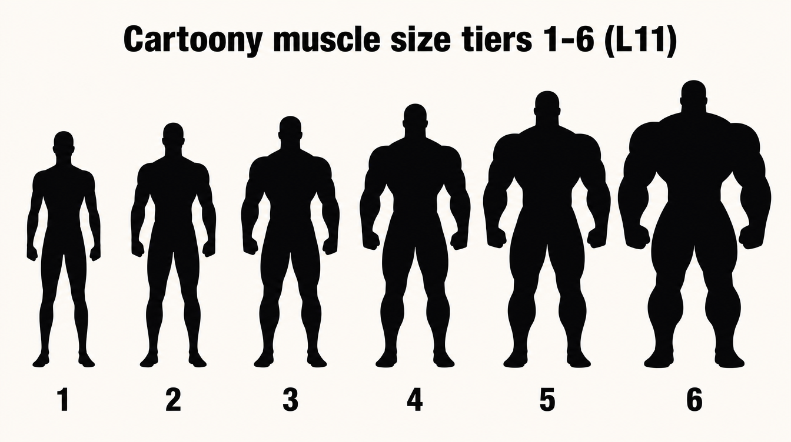

### Changed

- **Pipeline-wide vocabulary purge: "silhouette" → "muscular build" / "3D muscle volume" / "muscular figure".** Triggered by [user review #2 of the comic-test-log](docs/posts/2026-05-16-comic-test-log.md): *"there was a reference chart for sizes that has muscle that are 3d, of a certain shape, not a silhouette."* The single load-bearing noun pointing at the L11 muscle-size lineup was telling nano_banana_flash to *"match the outline shape"* — the exact opposite of what the lineup actually shows (a 3D body chart with rendered musculature). Every tier ≥ 4 panel rendered with the legacy vocabulary regressed toward fitness-model proportions with the right outline width but missing muscle MASS. Diagnosed across Test 1 + Test 2 of the comic-test-log thread; validated on p13/p14/p15 of Test 2 (same character, same lineup attached, same camera — only the prompt vocabulary changed and muscle mass landed visibly closer to the lineup figure).
- **22 files swept.** Every load-bearing pipeline doc + module purged. Files touched:
  - **Rule module renamed**: `rules/l11_silhouette.py` → `rules/l11_muscular_build.py` (git mv). Slot renamed `8_tier_silhouette` → `8_tier_build`. Per-tier descriptors rewritten with **muscle-mass and definition** language (delts, biceps, chest depth, striation, vascularity, abdominal definition). Style anchor reframed: *"the lineup attached is a 3D body chart with visible musculature; the storytelling element is the muscle MASS and DEFINITION, not the outline width."* Vision rubric rewritten to compare 3D muscle volume. Retry strategy escalates muscle-mass language, not silhouette language. Legacy `_silhouette_desc = _build_desc` alias preserved for backwards compat. Registry import + RULE_INSTANCES updated.
  - **Composer**: `scripts/next_panel.py` — 8 occurrences in slot comments + reason strings rewritten. Slot constant `8_tier_silhouette` → `8_tier_build`.
  - **Reference docs (canonical)**: `peak-body-scale.md` — full rewrite with the lineup PNG embedded inline at the top + per-tier muscular-build descriptors + "the wrong way / the right way" examples + history section documenting the purge. `lessons-learned.md` L11 section — lineup PNG embedded + three root causes (third = vocabulary diagnosis) + five-part vocabulary upgrade + "Important framing (purged 2026-05-16)" callout. Surgical edits to L1.5, L18, L22, L27, L28 ("hyper-muscular silhouettes" → "hyper-muscular builds"). `the-rules-explained.md` L11 section — lineup PNG embedded + "the silhouette purge" subsection.
  - **Skills**: `comic-production/SKILL.md` (6 edits), `production-briefing/SKILL.md` (4 edits), `reference-gathering/SKILL.md` (lineup instruction rewritten with *"3D BODY CHART...NOT a silhouette / outline reference"*).
  - **Other references**: `fmg-anatomy-guide.md` (5 edits incl. §6 header "Silhouette Rules" → "Proportion Rules"), `shotlist-driven-flow.md`, `qa-checklist.md`, `prompt-templates.md`, `posing-and-expressions.md`, `multi-character-variation.md`, `cinematic-framing.md`, `camera-distance-analysis/README.md`, `flow-workflow.md` (`replace_all` "no body silhouette" → "no body in frame", "no leg silhouette" → "no legs in frame").
  - **Runners + commands**: `runners/variant_picker.py`, `commands/build-comic.md`.
  - **Top-level**: `README.md`, `docs/VARIANT-PICKING.md`.
  - **Migration tracker**: `rules/README.md` updated with new filename + slot name + purge note.
- **Lineup PNG now embedded inline** in three load-bearing docs so the canonical reference is always visible alongside the rule that cites it: `peak-body-scale.md` (top of doc), `lessons-learned.md` (L11 section), `the-rules-explained.md` (L11 section). All three embeds use `../../assets/muscle-size-lineup.png` (already in the repo, used during chunli FMG runs).

### Preserved (intentional)

- **Legitimate cinematography term retained**: `cinematic-framing.md` keeps `silhouette` as a compositional modifier (backlit subject, features dark) — a real film vocabulary item, distinct from the body-reference miscue.
- **Legitimate art term retained**: `style-lock/styles/ink-line/preset.md` keeps *"Outer silhouette: heavy (2pt equivalent)"* — ink line weight terminology.
- **Vocabulary-to-avoid callouts retained**: `peak-body-scale.md` deliberately mentions the legacy word in its "wrong way" + history sections so readers know what NOT to use.
- **Historical changelog entries retained**: prior CHANGELOG entries that used "silhouette" stay verbatim. History is not rewritten.

### Why

The architecture caught the L11 failure mode reliably across two test runs — but couldn't fix it from inside L11 because the rule itself was built around the wrong noun. The pre-render gate fired the right warnings; the post-render checks flagged the right regressions; the retry strategy escalated correctly. What was broken was the actual word the model was reading. This is an architectural takeaway worth recording: **load-bearing vocabulary at the rule-content level can override any amount of gating and retry-strategy work above it.** When a check reliably fires but the fix doesn't land, look at the words pointing at the reference, not the gating logic.

### Verified

- Registry import path works post-rename (`from .l11_muscular_build import L11` resolves cleanly; `RULE_INSTANCES` walks all 11 rules in order).
- Final audit grep shows 17 silhouette occurrences remain — all categorized as cinematography (1 doc), ink-line art (1 doc), purge documentation (3 docs), or historical changelog. Zero remaining in pipeline-active rule modules, composer, skill instructions, prompt templates, QA checklists, or audit tools.

---

## 2026-05-16 (phases 5/6/7 of checks-and-balances — vision rubrics + retry + discovery)

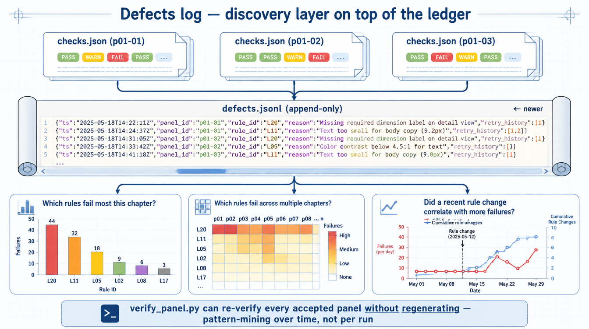

### Added

- **Phase 5 (vision rubrics) landed.** Every rule module that has a meaningful post-render visual check now declares a `vision_rubric` class attribute — a short prompt designed to be sent to a fresh vision-capable subagent alongside the rendered panel image and the canonical refs. 10 rules ship rubrics: L10 (refs vs rendered identity), L11 (silhouette vs lineup figure), L15 (vogue-cover face quality), L17 (canonical character fidelity), L18 (anatomy coherence + limb count), L20 (region-fill 70%+ vs declared body-region beat), L21 (no ref-as-prop renderings), L22 (hair state matches declared), L23 (background renders the named location vs grey void), L24 (no anachronistic accessories), female_anatomy (body reads as female on hyper-muscular ECUs). L23 and L24 also get rubrics even though their primary verification is at compose time — the rubric covers the post-render confirmation. `Rule.vision_rubric` defaults to None in the base class for rules that don't need vision verification (e.g. L1.5, L12, L13, L28 — all deterministic at planning time).
- **Phase 6 (retry CLI) landed.** New `skills/comic-production/scripts/retry_panel.py <project> <panel_id>`. Reads the panel's `checks.json`, finds rules with pre_render or post_render status=fail, dispatches each to its module's `retry_strategy(panel, ctx, failure)` and prints the recommended action. Markdown by default, `--json` for machine consumption, `--rule LXX` to scope to one rule. Rules without a registry module (L1.5, L20_chapter — both still in build_plan) report `kind=rule_not_in_registry` cleanly. Does NOT auto-execute regenerations; that's the runner's job in phase 8+.
- **Phase 7 (defects discovery CLI) landed.** New `skills/comic-production/scripts/discover_defects.py <project>`. Reads `<project>/defects.jsonl` and emits a summary report. `--by rule` (default) groups failures by rule_id and lists the top 3 reason texts per top-3 rule. `--by panel` groups by panel. `--by ts` groups by day for "did a recent rule change correlate with more failures" timeline tracking. `--by rule_verification` splits pre_render vs post_render failures per rule. `--rule LXX` drills into one rule and lists every defect row for it. `--json` for machine output. Smoke-tested on `comic-april-mutagen-v2`: 21 total defect rows, L1.5 (18×) and L20_chapter (3×) lead the chapter; top L1.5 reason is "no view-compatible prior in accepted_history for target view 'ecu-region'" (7×).
- **Phase 7 (standalone verify-only CLI) landed.** New `skills/comic-production/scripts/verify_panel.py <project> <panel_id>`. Re-runs build_plan for the specific panel (using `target_panel_id`), writes the ledger via `write_checks_ledger`, appends defects, and prints the trace summary + the per-rule vision rubrics (with `--vision-rubrics`). Used for retroactive auditing when a rule's verification changes, or as the upstream feed to a vision-audit orchestrator (see phase 8: the orchestrator agent uses these rubrics to dispatch one fresh subagent per applicable vision-bearing rule, sending it the rendered image + canonical refs, and writes the result back into `post_render.status / .reason`).

### Notes

- **Phase 4 (rules_audit.py migration) deferred.** The current `rules_audit.py` already produces every gate finding the pipeline needs (camera variety, distance bias, transformation beats, reference completeness, costume damage non-regression). Phase 4 was the cosmetic refactor that turns it into a registry walker; the work is logged as a follow-up commit and doesn't block phase 5/6/7 or the first end-to-end comic test.
- **Vision audit dispatch is orchestrator-side, not script-side.** The design doc calls for "a fresh subagent per panel per rule with a single-purpose rubric." That model is best executed by an orchestrator agent (Claude Code, autopilot runner, or a future GUI). Phase 5 ships the rubrics and the verify_panel.py surface; the actual subagent dispatch happens during the comic run (see next entry).

---

## 2026-05-16 (phase 3b of checks-and-balances — all rules migrated)

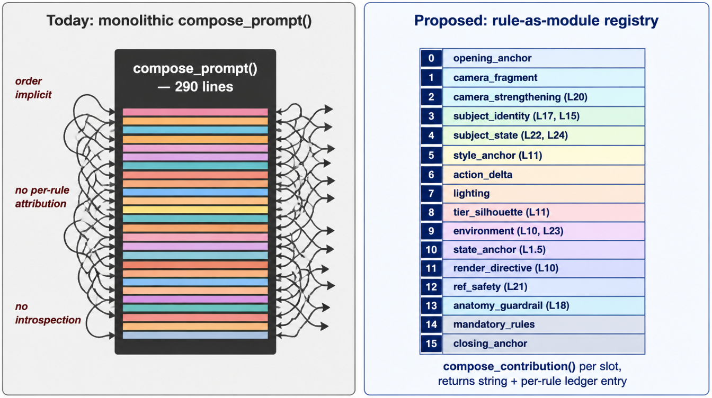

### Added

- **Phase 3b — L11 migrated as the final per-rule module.** The only multi-slot rule in the pipeline (slots `5_style_anchor` + `8_tier_silhouette`). All 11 active rules now route through `rules._registry`. `compose_prompt` no longer inlines any rule contribution.
  - **`rules/l11_silhouette.py`** — multi-slot rule, `applicable_transformations=("fmg",)`. `compose_contribution` dispatches by slot: returns the cartoony-FMG style anchor at slot 5 when `tier >= 2`; returns one of three tier-silhouette blocks at slot 8 depending on `lineup_attached` / `stage_change` / unchanged-carry-forward. The `_SILHOUETTE_BY_TIER` dict (tiers 1-9 with explicit dimensional anchors) moves into the module. `verify_pre_render` reads `ctx["_active_slot"]` to branch per slot — returns PASS at slot 5 when tier≥2 (or SKIPPED at tier<2), and PASS / FAIL / SKIPPED at slot 8 depending on the path. `retry_strategy` returns one of three escalations: (a) reattach lineup when dropped at compose time, (b) recommend model swap at tier≥7 (Grok ceiling territory), (c) strengthen silhouette vocabulary otherwise.
- **`_apply_rule_at_slot` extended to inject `_active_slot` into ctx.** The helper builds `ctx_with_slot = {**ctx, "_active_slot": slot}` and passes that to `rule.compose_contribution` and `rule.verify_pre_render`. Single-slot rules ignore the extra key; multi-slot L11 reads it to dispatch.
- **`_registry.RULE_INSTANCES` now contains all 11 active rules** in slot order: L21, L18, L10, L20, L22, L23, L24, L15, L17, FemaleAnatomy, L11.
- **`rules/README.md` migration tracker updated** — every row shows the phase it landed in. No more TODO rows.
- **L11's two inline sites in `compose_prompt`** (the slot-5 style anchor block and the ~100-line slot-8 tier-silhouette block) replaced by two `_apply_rule_at_slot` calls. The legacy `_l11_style_anchor_applied` flag is gone — the rule module derives "was the style anchor emitted?" from `tier >= 2` directly without inter-slot state.

### Verified

- **Walk-test 41/41 byte-identical.** `composed_prompt` matches between phase 1 (HEAD at commit `7c4a342`) and phase 3b across every panel in `comic-april-mutagen-v2` (15 panels) and `moving-experience-v2` (26 panels), including tier-1 panels (where slot 5 skips and slot 8 emits the lineup-attached block at tier 1) and tier-6 panels (where slot 5 emits the style anchor and slot 8 emits the full lineup-attached block at the friction-zone silhouette).
- **`write_ledger.py` smoke-tested on tier-2 and tier-1 panels.** Tier-2 panel p07-01 ledger shows `L11.applied=true`, `slot=["5_style_anchor","8_tier_silhouette"]`, `pre_render.reason="tier=2, lineup attached at generation — slot 8_tier_silhouette (lineup-attached path)"`. Tier-1 panel p01-01 ledger shows `L11.applied=true`, `pre_render.reason="tier=1, lineup attached at generation — slot 8_tier_silhouette (lineup-attached path)"`. Both formats byte-identical to phase 1's legacy inline-recorded entries.

### Notes

- **`compose_prompt` is now a registry walker.** Every rule contribution flows through `_apply_rule_at_slot`. The remaining inline logic in `compose_prompt` is composer text (render anchor, camera fragment, subjects line, action delta, lighting, env-chaining or first-env line when env_ref is attached, state-anchor line, mandatory rules block, closing CGI anchor) — none of it is rule contribution.
- **Legacy helpers in `next_panel.py` are dead code** (`L21_REF_EXCLUSION`, `FEMALE_ANATOMY_ANCHOR`, `_body_region_camera_directive`, `_canonical_character_directive`, `_female_beauty_anchor_line`, `_hair_state_line`, `_l24_accessory_line`, `_female_anatomy_anchor_needed`, `_env_dense_anchor`, `_pose_anatomy_anchor`, `_female_focal_in_panel`, plus inline tier silhouette dict). They remain in place for backwards compat. A follow-up cleanup commit will prune them once we confirm nothing external imports them — keeping them now de-risks phase 3b's "phase 3 is complete" claim.
- **Phase 4** (migrate `rules_audit.py` checks into rule modules — `L20_chapter`, `L13`, `L12`, `L28`, `check_camera_variety`, `check_transformation_beats`) is the next deliverable. With phase 3 done, every active L-rule has a home; phase 4 fills in the pre-render verifications that don't currently live in the modules.
- **No comic API spend in phase 3b.** Walk-test on existing data confirmed byte-identical prompt output without any new generation.

---

## 2026-05-16 (phase 3a of checks-and-balances)

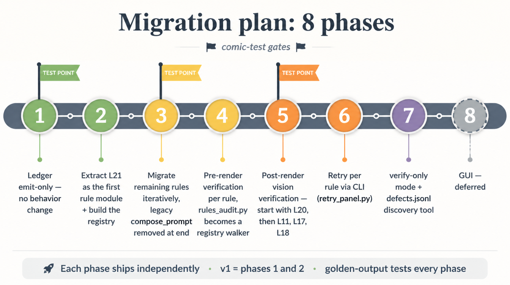

### Added

- **Phase 3a — 9 more rules migrated to per-rule modules.** Joining L21 (phase 2), the registry now contains 10 rule instances:
  - **`rules/l18_anatomy.py`** — L18. Slot `13_anatomy_guardrail`. Always-emit universal soft guardrail.
  - **`rules/l10_render_directive.py`** — L10. Slot `11_render_directive`. The load-bearing RENDER DIRECTIVE sentence. Always emit.
  - **`rules/l20_camera.py`** — L20 (in-prompt directive only). Slot `2_camera_strengthening`. Body-region camera directive fires on `panel.transformation_beat in BODY_REGION_BEATS`. Chapter-aggregate L20 check still lives in build_plan as `L20_chapter`; phase 4 will migrate the rules_audit.py-style checks.
  - **`rules/l22_hair_state.py`** — L22. Slot `4_subject_state`. Reads `panel.hair_state`; does NOT auto-derive from tier + beat per memory `feedback_dont_invent_state_changes`.
  - **`rules/l23_env_anchor.py`** — L23. Slot `9_environment`. Fires when env_ref is None AND env_dropped AND location_slug is set. Returns `Verification(status="fail")` when the location has no description in shotlist.
  - **`rules/l24_accessory.py`** — L24. Slot `4_subject_state`. Reads `cast[].accessories.canonical` + `.negation` list. The enumerated negation is the load-bearing part.
  - **`rules/l15_glamour.py`** — L15. Slot `3_subject_identity`. `applicable_transformations=("fmg",)`. Detection heuristic on cast entries (sex, pronoun) with FMG-default-true.
  - **`rules/l17_canonical.py`** — L17. Slot `3_subject_identity`. Reads `cast[].canonical=true` + `canonical_anchor` text.
  - **`rules/female_anatomy.py`** — Female anatomy anchor (May-14 finding from chun-li-grok-validation p5). Slot `4_subject_state`. `applicable_transformations=("fmg",)`. Fires on camera=ecu-region + tier>=2 + female arc character.
- **`_apply_rule_at_slot(rule_id, slot, panel, ctx, parts, trace, transformation_type)` helper** in `next_panel.py`. The shared dispatch: look up rule, check `applies_to_transformation`, call `compose_contribution(panel, ctx, slot)` and `verify_pre_render(panel, ctx)`, append to `parts` and record to trace via `_record_applied` / `_record_failed` / `_record_skipped` (dispatched on `verif.status`). Returns the contribution or None.
- **Shared `ctx` dict built once at the top of `compose_prompt`** containing env_ref / anchor / env_anchor_from / lineup_attached / env_dropped / stage_change / shotlist / cast_lookup / camera / location_slug / transformation_type. Every rule reads what it needs; extra keys are ignored.
- **9 inline rule sites in `compose_prompt` replaced** by `_apply_rule_at_slot` calls. The L21 site (migrated in phase 2 with its own ctx) was also refactored to use the shared ctx. The legacy helper functions (`_body_region_camera_directive`, `_canonical_character_directive`, `_female_beauty_anchor_line`, `_hair_state_line`, `_l24_accessory_line`, `_female_anatomy_anchor_needed`, `_env_dense_anchor`, `_pose_anatomy_anchor`, `_female_focal_in_panel`, plus `L21_REF_EXCLUSION` / `FEMALE_ANATOMY_ANCHOR` constants) remain in `next_panel.py` for backwards compatibility — external scripts may still import them. Phase 3 cleanup will prune them in a follow-up once nothing external depends on them.

### Verified

- **Walk-test passed across 41 panels.** Iterated every panel in `comic-april-mutagen-v2` (15 panels) and `moving-experience-v2` (26 panels) via `build_plan(root, target_panel_id=pid)`, comparing `composed_prompt` between the phase 1 build (HEAD before phase 3a) and the phase 3a build. All 41 panels byte-identical.
- **Smoke-tested `write_ledger.py`** on `comic-april-mutagen-v2` panel p07-01: trace shows all 10 migrated rules with sensible applied/skipped statuses and reason text matching the legacy format exactly. L20 fires on the chest beat with "transformation_beat=chest — body-region directive injected". L21 fires with "at least one ref attached (env=True, anchor=False, lineup=True)". female_anatomy fires with "camera=ecu-region tier>=2 female cast (tier=2)".

### Notes

- **Composer logic stays inline.** The env-chaining / first-env-appearance language (when env_ref is attached) is composer text, not part of any L-rule, so it stays in compose_prompt unchanged. L23's rule module handles only the dense-verbal-anchor (env_dropped) case and the trace recording for all three branches.
- **L1.5 stays in compose_prompt + build_plan** for now. The state-anchor line emission is composer logic; the L1.5 trace recording lives in both compose_prompt (when anchor is found) and build_plan (no-anchor cases). Phase 3 cleanup or phase 4 may extract this into a Rule module if useful.
- **Phase 3b** (L11 — only multi-slot rule, two slots, FMG-only, biggest) is the next deliverable. After it lands, `compose_prompt` becomes purely a registry walker for the rule-specific contributions; the legacy helpers are eligible for removal.
- **No comic API spend.** Phase 3a is structural; the walk-test on existing data confirmed byte-identical prompt output without any new generation.

---

## 2026-05-16 (even later — phase 2 of checks-and-balances)


### Added

- **Phase 2 of the checks-and-balances refactor landed — `rules/` package + L21 extracted as the first per-rule module.** The infrastructure that phase 3+ will lean on. Three new files under `skills/comic-production/rules/`:
  - **`_base.py`** — `Rule` base class with class attributes `id`, `title`, `slot`, `severity`, `applicable_transformations` and methods `should_apply`, `compose_contribution`, `verify_pre_render`, `verify_post_render`, `retry_strategy`. Also `Verification` dataclass with strict `status` enum (`pass | fail | pending | skipped | blocked | n/a | refused`) and validation in `__post_init__`. Helper `Rule.applies_to_transformation(t)` for genre dispatch; `Rule.slots()` normalizes single-slot vs multi-slot rules to a tuple.
  - **`_registry.py`** — `RULES: dict[str, Rule]` keyed by rule id; `get_rule(id)`, `iter_rules()`, `iter_rules_for_slot(slot)`. Phase 2 ships only `L21()`; phase 3 grows this list one rule at a time.
  - **`l21_ref_safety.py`** — first migrated rule. `slot="12_ref_safety"`, `applicable_transformations=("*",)`. Implements `should_apply` (returns True iff any of env_ref / anchor / lineup_attached is truthy), `compose_contribution` (returns the L21 exclusion clause when applicable), `verify_pre_render` (returns a `Verification` with the same reason text format the legacy inline path used), and `retry_strategy` (returns `auto_resubmit_with_stronger_contribution` keyed to the substitute the model rendered — phase 5 vision verification will populate `failure.evidence.substitute_rendered`).
  - **`README.md`** — explains the per-rule module convention, the registry, the genre-extensibility hook, and the per-rule migration tracker (L21 ✓ phase 2; L18/L20/L15/L17/L22/L23/L24/L11/L10/female_anatomy TODO in phase 3).
- **`next_panel.compose_prompt` now routes L21 through the registry.** Inline L21 site at the old line ~1238 replaced with a registry-driven call: look up `get_rule("L21")`, check `applies_to_transformation(transformation_type)`, build a minimal `ctx` dict (env_ref / anchor / lineup_attached), call `compose_contribution(panel, ctx, "12_ref_safety")` and `verify_pre_render(panel, ctx)`, append to `parts` if non-None, write to the trace via the existing `_record_applied` / `_record_skipped` helpers using the Verification's status + reason. `compose_prompt` gains a `transformation_type: str = "fmg"` parameter (defaults to "fmg" so legacy callers continue to work); `build_plan` passes `transformation_type=transformation_type` explicitly.
- **The `L21_REF_EXCLUSION` constant remains defined in `next_panel.py` for backwards compatibility** (any external script that imports it continues to work); the canonical copy now lives in `rules/l21_ref_safety.py`. Phase 3+ cleanup may remove the legacy constant once we confirm nothing external depends on it.
- **Genre extensibility is now operational.** `Rule.applies_to_transformation(transformation_type)` is the single dispatch point: rules with `applicable_transformations=("*",)` apply to every project, rules with `("fmg",)` skip on non-FMG projects. Phase 3 rules can ship as `("fmg",)`-only modules; future BE/glute/MMG variants land as parallel modules (e.g. `l11_mmg_silhouette.py`) without modifying the FMG modules.

### Verified

- **Golden-output test still passes.** `composed_prompt` is byte-identical against `comic-april-mutagen-v2` and `moving-experience-v2` between the phase 1 build (HEAD before phase 2) and the phase 2 build. The diff target was `_trace.L21` specifically — its compose_contribution + slot + applicable_transformations + pre_render + post_render entries are byte-identical between the inline path and the registry path.
- **`write_ledger.py` smoke-tested on the april project.** `panel-p07-01/checks.json` shows `L21.pre_render.reason = "at least one ref attached (env=True, anchor=False, lineup=True)"` matching the phase 1 format exactly. Slot recorded as `"12_ref_safety"`. Applicable_transformations recorded as `["*"]`.
- **L21 unit-tested standalone** (no panel data needed): `should_apply` returns False for empty ctx and True for a ctx with any ref; `compose_contribution` returns None when not applicable and the L21_REF_EXCLUSION string when applicable; `verify_pre_render` returns `Verification(status="pass", reason=...)` or `Verification(status="skipped", reason=...)` matching the legacy reason text. `applies_to_transformation("fmg") == applies_to_transformation("mmg") == True` (rule is universal).

### Notes

- **Phase 3** (migrate L18 next — always-emit, smallest after L21 — then L20, L15, L17, L22, L23, L24, L11, L10, female_anatomy) is the next deliverable. Each rule lands as one commit with a golden-output test against the historical corpus.
- **No comic API spend in phase 2.** Phase 2 is structural; the golden-output test on existing data confirmed byte-identical prompt output without any new generation.

---

## 2026-05-16 (later — phase 1 of checks-and-balances)

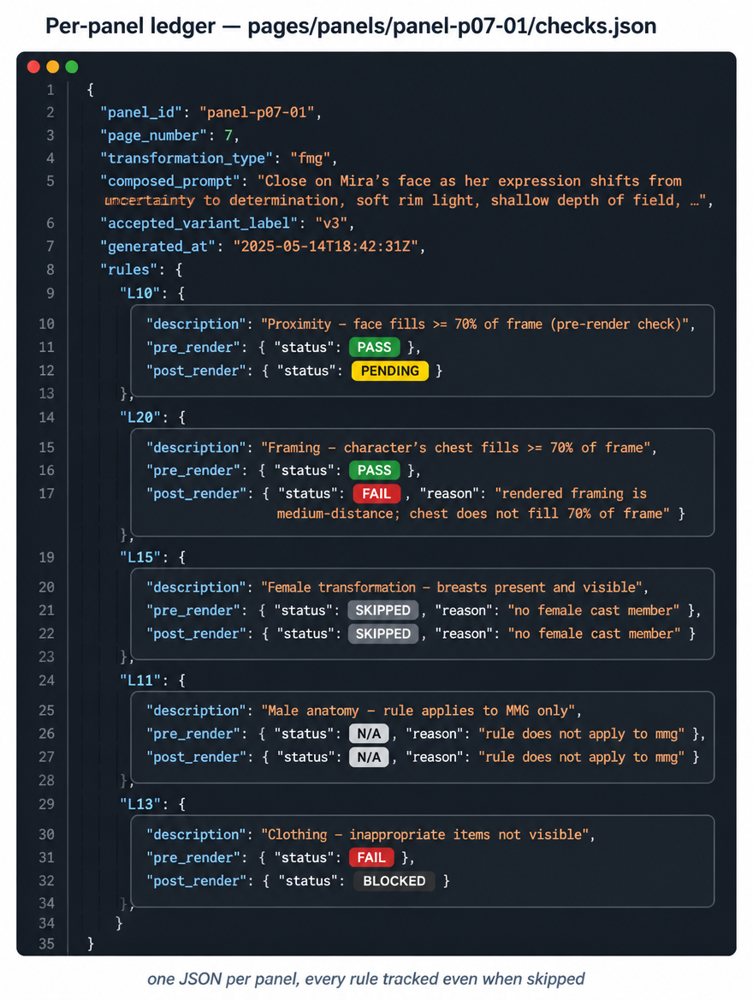

### Added

- **Phase 1 of the checks-and-balances refactor landed — ledger emit-only.** Design at [`docs/checks-and-balances-design.md`](docs/checks-and-balances-design.md). Three changes ship together:
  - **`compose_prompt` is now trace-aware.** New optional `_trace: dict | None = None` parameter (default None → fully backwards compatible). When supplied, every helper call site (`_body_region_camera_directive` for L20, `_canonical_character_directive` for L17, `_female_beauty_anchor_line` for L15, `_hair_state_line` for L22, `_l24_accessory_line` for L24, `_female_anatomy_anchor_needed` / `FEMALE_ANATOMY_ANCHOR`, the cartoony FMG style anchor for L11 slot 5, the tier-silhouette block for L11 slot 8, the env handling for L10/L23, the state anchor for L1.5, the RENDER DIRECTIVE for L10, the L21_REF_EXCLUSION clause, the `_pose_anatomy_anchor` for L18) records its per-rule application into the trace dict with `compose_contribution` + `pre_render` + `post_render` fields. **Prompt output is byte-identical** to the legacy path — golden-output tests pass against `comic-april-mutagen-v2` and `moving-experience-v2`.
  - **`build_plan` writes the build-plan-level findings into the trace** for L1.5 (anchor pick), L12 (dialogue/camera conflict), L13 (multi-speaker crowding), L20_chapter (per-beat overshoot), L28 (lineup-required ref present or MISSING). Adds `target_panel_id` parameter so `write_ledger.py` can plan retroactively for any accepted panel using only the history that existed before it.
  - **New `PHASE_1_RULE_REGISTRY`** (inline in `next_panel.py`) holds 31 entries: 16 actively tracked rules (L10, L11, L15, L17, L18, L20, L21, L22, L23, L24, female_anatomy, L1.5, L12, L13, L20_chapter, L28) plus 8 deferred (L1, L9, L14, L16, L19, L25, L26, L27 — each with a `phase1_reason` explaining what phase will activate them) plus 7 historical / infrastructure (L2-L8 except L4, with reasons). Each rule declares `applicable_transformations` (e.g. `["fmg"]` for L11/L15/female_anatomy, `["*"]` for L10/L18/L20/L21). The registry is consulted by `_init_trace(transformation_type)` which reads `production-config.json -> transformation_type` (defaults to `"fmg"` for legacy projects). Phase 2 moves each entry to its own per-rule module under `skills/comic-production/rules/`.
- **`skills/comic-production/scripts/checks_ledger.py` (new file).** Library exposing `write_checks_ledger(project_root, plan, accepted_variant_label, composed_at)` which serializes the trace to `pages/panels/panel-<id>/checks.json` per the schema in the design doc (`schema_version=1`, `panel_id`, `page_number`, `transformation_type`, `shotlist_snapshot_sha`, `composed_at`, `composed_prompt`, `accepted_variant_label`, `rules` dict), and `append_defects(project_root, plan, ts)` which appends one JSONL row per `pre_render.status="fail"` or `post_render.status="fail"` entry to `<project>/defects.jsonl`. Also exports `write_ledger_and_defects()` as a combined convenience.
- **`skills/comic-production/scripts/write_ledger.py` (new file).** CLI that walks every accepted panel in a project and emits a ledger for each by calling `build_plan(root, target_panel_id=pid)` with the accepted history reconstructed for that panel's compose-time. Supports `--dry-run` (print summary without writing), `--verbose` (one line per panel), and `--panel-id` (target a single panel). Detects the accepted-variant label from `_accepted.txt` or `v*_accepted.png` suffix. Used for retroactive auditing of comics that shipped before the ledger existed, and for bootstrapping `defects.jsonl` from historical data.
- **Smoke-tested against two historical comics.** `comic-april-mutagen-v2` (14 panels): wrote 14 ledgers, appended 15 defect rows, applied counts 6-9 of 31 rules per panel. `moving-experience-v2` (26 panels): wrote 26 ledgers, applied counts 5-9 of 31 rules per panel. Defects log captures real findings — L1.5 view-aware-chaining failures where no compatible prior exists, L20_chapter overshoot on `comic-april-mutagen-v2` p04-01 ("decide" beat shot at `full`, ceiling is 4, score 5). These are pre-existing shotlist quality signals that the legacy `rules_audit.py` already caught at shotlist time; phase 1 makes them visible per-panel in the ledger and queryable across the defects log.

### Notes

- **No behavior change at generation time.** `compose_prompt` returns the same string with or without `_trace` supplied; the runner pipeline is unchanged. Phase 1 is observability-only.
- **Phase 2** (extract L21 as the first standalone rule module + build the registry abstraction) is the next deliverable. Pending sign-off.
- **Proposed comic-test gate at end of phase 1:** none — phase 1 is observability-only and the golden test already confirmed byte-identical prompt output. Test gates start at phase 3 (end of rule-module migration) per the design doc's migration plan.

---

## 2026-05-16

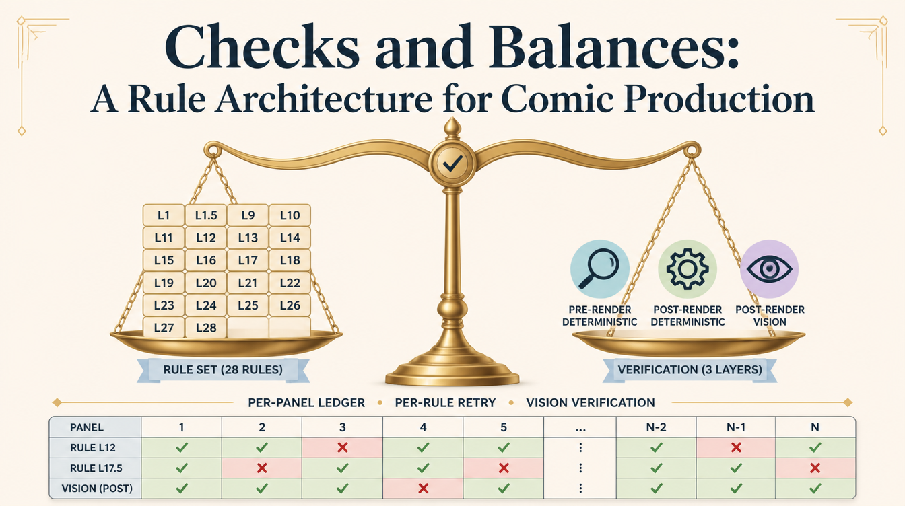

### Added

- **Checks-and-balances rule architecture design doc landed.** Full design at [`docs/checks-and-balances-design.md`](docs/checks-and-balances-design.md). Companion blog article with 7 infographics at [`docs/posts/2026-05-16-checks-and-balances.md`](docs/posts/2026-05-16-checks-and-balances.md). Diagnosis: every L-rule's enforcement lives inside `compose_prompt()` in `next_panel.py` (290+ lines, no per-rule attribution after composition) and `rules_audit.py` (flat findings list, never sees rendered pixels). No per-panel per-rule ledger anywhere. No retry-per-rule. Result: individual rules silently get ignored, the agent driving generation can't reliably know which rules fired, the user can't see per-panel pass/fail markers, and there's no clean retry mechanism. Proposed architecture: (1) rule-as-module refactor — each L-rule becomes a discrete module with `id` / `title` / `slot` / `applicable_transformations` / `should_apply` / `compose_contribution` / `verify_pre_render` / `verify_post_render` / `retry_strategy`; a registry walks 16 named composition slots and concatenates per-slot contributions. (2) Per-panel `checks.json` ledger written alongside `v*.png` variants — tracks every rule (applied, skipped, n/a, refused) including `compose_contribution` text and both verification statuses. Tracks only the accepted variant. (3) Three verification classes: pre-render deterministic (today's `rules_audit.py`), post-render deterministic (state-file inspection — L1 prior-ref attached, L9 job_id captured), post-render vision-based (fresh subagent per rule, single-purpose rubric — L11, L17, L20, L18, L21, L22, L25). (4) Per-rule `retry_strategy()` with six kinds: auto_resubmit_with_stronger_contribution / auto_resubmit_with_corrected_refs / auto_resubmit_with_different_face_card / shotlist_edit_required / ref_generation_required / accept_and_log. (5) Project-level `defects.jsonl` append-only log for pattern mining across runs ("which rules fail most this chapter," "which rules fail across multiple chapters," "did a recent rule change correlate with more failures"). (6) `verify_panel.py` CLI for retroactive re-verification of accepted panels without regeneration. Genre/niche extensibility: every rule declares `applicable_transformations`, defaults to FMG; adding BE / glute / MMG / mixed later = new modules, not surgery on existing ones. Ratified answers to 6 open questions captured in the design doc § 6. Migration plan: 8 phases, golden-output tests every phase, comic-test gates at end of phases 1, 3, 5. v1 = phases 1+2 (ledger emit-only + L21 extracted as the first rule module). GUI deferred — the per-panel ledger schema is the design contract.
- **7 new graphics** under `docs/posts/assets/2026-05-16-checks-and-balances/` (gpt_image_2 low quality, 1k): `00-cover.png` (balance scale title card), `01-monolith-vs-modules.png` (before/after architecture), `02-ledger-schema.png` (checks.json visualization), `03-verification-classes.png` (three columns: pre-render deterministic / post-render deterministic / vision-based), `04-retry-strategies.png` (6-branch decision tree), `05-migration-phases.png` (8-phase timeline with test points), `06-defects-discovery.png` (jsonl → discovery layer).

### Notes

- No code shipped this entry — design + docs only. Implementation begins with phase 1 (`write_checks_ledger` as a side output of the current `compose_prompt`) pending sign-off.

---

## v5 — 2026-05-14 (evening sync)

This release lands the autopilot mode, the production-briefing skill, the runner infrastructure, and a Windows-compat fix. Backward compatible: existing modes (`status`, `auto`, named stage) work exactly as before. FMG-only behavior is preserved when no `production-config.json` exists.

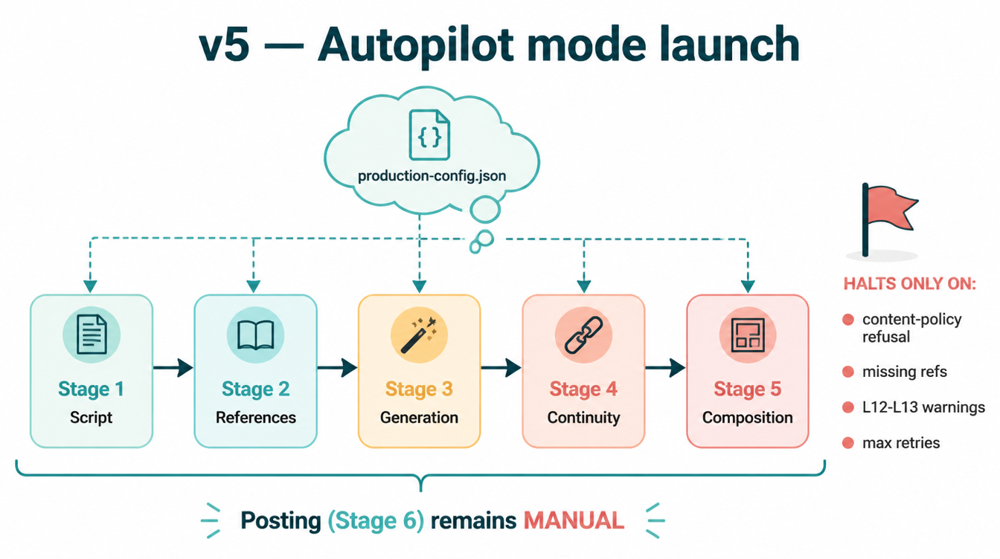

Rollback tag: `v4` (= commit `533ec3d`). To revert: `git reset --hard v4 && git push --force-with-lease origin main` (or use GitHub's "Revert" UI on each commit). Local backup also lives at `Desktop\Claude\comic pipeline.local-original\` on the original author's machine.

### Added

- **Autopilot mode** (`/build-comic autopilot`) — runs stages 1–5 end-to-end without per-stage human gates, driven by `production-config.json` at project root. Halts only on approved hard conditions: content-policy refusal, missing required references, L12/L13 warnings, max-retries exceeded, configurable `on_all_bad` / `on_size_regression` policies. Posting (stage 6) remains manual. Sentinel files (`.autopilot-active`, `.autopilot-stage`, `.autopilot-halt-reason`) coordinate with the optional Stop hook. Commit `5359035`.

- **`production-briefing` skill** — one-shot pre-flight interview that collects every decision the rest of the pipeline would otherwise interrupt for (transformation type, style preset, location strategy, mandatory-rule modifications, lineup files, generation policies, continuity policies) and writes `production-config.json` v3. Auto-invokes when `/build-comic autopilot` finds no config. Also triggers on natural-language phrases like "start a new BE comic" / "configure autopilot". Lives at `skills/production-briefing/`. Commit `5359035`.

- **`autopilot/` directory at repo root** — centralizes the autopilot infrastructure for discoverability:
  - `autopilot/configs/production-config.schema.json` — v3 schema.
  - `autopilot/configs/example-{fmg,be,glute,mmg,mixed}.json` — per-transformation-type starter configs.
  - `autopilot/hooks/stop-autopilot.py` + `pre-tool-autopilot.py` + `INSTALL.md` + `settings-snippet.json` — opt-in Claude Code hooks for fully silent runs.
  - `autopilot/patches/` — per-file patch documentation (informational; patches are already applied in this release).

- **Runner infrastructure under `runners/`** — Python orchestrator + Flow / Higgsfield backends + variant picker that build-comic's generation stage drives:
  - `runner_core.py` — shared orchestrator loop with halt-detection, per-panel retry budget, state.json persistence, resume support.
  - `flow_runner.py` + `flow_selectors.py` — Chrome MCP-driven Flow backend.
  - `higgsfield_runner.py` — direct HTTP backend via `token_relay.js`.
  - `variant_picker.py` — heuristic + Anthropic-API strategies for picking the best variant per panel.
  - `requirements.txt` + `README.md`.
  - Commit `d1fec10`.

- **Test infrastructure under `tests/`** — three runnable test scripts (no `pytest` dependency):
  - `test_runner_loop.py` — end-to-end resume + halt + retry with a mock backend.
  - `test_flow_runner_mock.py` — Flow backend instantiation, CDP-unreachable cleanup, locator fallback, ref-attach error handling.
  - `test_variant_picker.py` — heuristic + claude_api strategies, JSON extraction, API-key-missing fallback.
  - Commit `d1fec10`.

- **Integration docs under `docs/`** — `ARCHITECTURE.md`, `FLOW-SELECTORS.md`, `HIGGSFIELD-INTEGRATION.md`, `VARIANT-PICKING.md`, plus a refreshed `INSTALL-V4.md` at repo root covering the v5 setup. Commit `d1fec10`.

- **Per-transformation-type rule defaults** in `skills/comic-production/SKILL.md` — five-row table mapping `transformation_type` (FMG / BE / Glute / MMG / Mixed) to its default `mandatory_rules.active` set, with rationale per rule. `production-briefing` writes the right defaults into the config; comic-production reads them. Commit `5359035`.

- **`L19 baked-lettering opt-in`** documented in `skills/comic-production/SKILL.md` — when `mandatory_rules.allow_baked_lettering` is true, prompts open with the L19 render-engine anchor, render lettering as physical 3D scene objects, and close with the negation block. Default is false (clean panels to page-composer for vector lettering). Commit `5359035`.

- **Per-project lineup file resolution** in `skills/comic-production/scripts/next_panel.py` — `_read_production_config()` helper + `find_lineup()` now resolves `lineup_files.tier_low / tier_high / active_range` from `production-config.json` so BE / glute / MMG projects can ship their own size-anchor PNGs under `<project>/references/style/`. Falls back to the FMG defaults (`muscle-size-lineup.png` / `muscle-size-lineup-4-9.png`) when the config block is missing. Commit `5359035`.

### Changed

- **`skills/comic-production/references/shotlist-driven-flow.md` per-panel break conditions are now policy-keyed** via `production-config.json`. Default `generation.on_all_bad: retry-with-cgi-anchor-boost`, `generation.on_size_regression: retry-with-aggressive-anchor`, `generation.on_anatomy_failures: pick-best-and-flag`. Without config, falls back to the legacy "ask the user" behavior. Commit `5359035`.

- **`skills/continuity-check/SKILL.md` § 2.6 hand-back is now policy-driven** via `policies.regeneration` — four options (`never` / `batch-end` / `auto-on-hard` / `halt-on-hard`). Default `batch-end`: log report, complete composition, halt at end with report path so the user picks what to regenerate. Without config, falls back to the legacy "ask which to fix" interrupt. Commit `5359035`.

- **`commands/build-comic.md`** rewritten to support three operating modes (`status`, `auto`, `autopilot`) and to document the autopilot halt conditions, sentinel files, and briefing auto-invocation flow. The interactive and `auto` modes are unchanged in behavior. Commit `5359035`.

### Fixed

- **`skills/continuity-check/tests/run_tests.py` Windows compat.** The fixture test runner subprocess-invoked `python3`, which doesn't exist on PATH on Windows (the Microsoft Store shim intercepts and prompts to install Python). Now uses `sys.executable`. After the fix all 9 fixtures pass on Windows. Commit `e4e15e3`.

### Notes

- The patches and the new files in this release have been smoke-tested against two real comic projects (Aria Stellaris FMG + Mike Reeves MMG, 6 panels each, 1:1 photoreal CGI on nano_banana_2) and all 12 panels composed successfully with the lettered pages exported as PDF. The runner test suite (9 + 3 = 12 scripts) passes clean on Windows 11.
- The `~/.claude/hooks/` Stop and PreToolUse hooks are opt-in: install them only if you want autopilot runs to suppress mid-pipeline halts. Without the hooks, autopilot still works; you just see the natural Claude `Stop` events in chat. See `autopilot/hooks/INSTALL.md`.

---

## 2026-05-14

The biggest single day of pipeline work. Three batches in chronological order: morning Grok validation + L21–L24 auto-injection landed; evening L28 reference completeness manifest; late-evening L15–L18 promoted to canonical + L20 strengthened. Plus the v5 autopilot release.

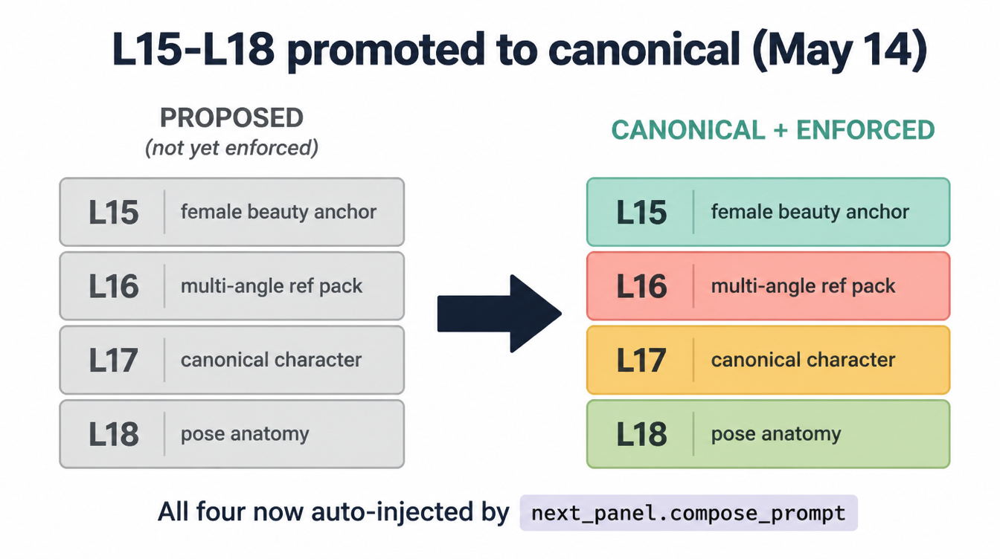

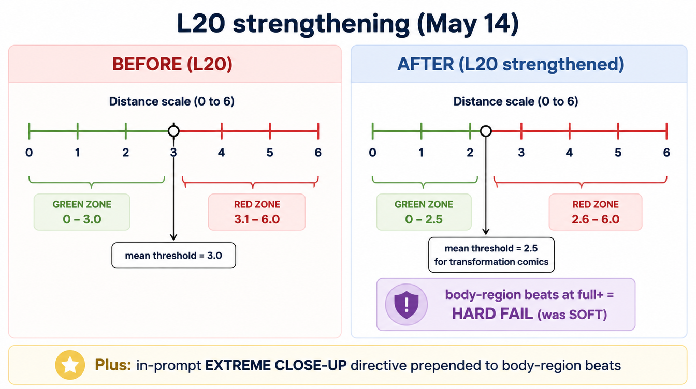

### Added (late evening — L15-L18 promotion + L20 strengthening)
- **L15, L16, L17, L18 promoted from proposed to canonical.** All four lessons (female beauty anchor, multi-angle ref pack, canonical character anchor, pose anatomy coherence) were in the article's "proposed but not yet enforced" section. They're now full lessons in `lessons-learned.md` with diagnosis + enforcement, plus auto-injection in `next_panel.py` `compose_prompt`. Load-bearing index updated.
- **L15 — Female characters must read as beautiful** (canonical). `_female_beauty_anchor_line()` auto-injects the vogue-cover glamour anchor on every panel where any female cast member is present. Detection heuristic: `cast[].sex in {"f","female"}` or `cast[].pronoun in {"she","her","her/hers","she/her"}`; default-assumes female when unset. Suppressible per character via `cast[].glamour_anchor: false`.
- **L16 — Multi-angle character reference packs** (canonical). The L28 manifest schema extends: every arc character (has `body_tiers`) gets a `views[]` block with 5 entries at the baseline tier: `3q-full`, `profile`, `back-full`, `low-angle-front`, `ecu-region`. `script-breakdown` Step 7 emits the views; `reference-gathering` walks them; `rules_audit.check_reference_completeness` HARD-fails for missing view refs.
- **L17 — Known/canonical characters can't drift** (canonical). `_canonical_character_directive()` reads `cast[].canonical: true` + `cast[].canonical_anchor` text and prepends a canonical-anchor line to every prompt with the IP character in frame. `reference-gathering` prefers canon-sourced search queries for face cards when characters are flagged canonical.
- **L18 — Pose anatomy coherence** (canonical). `_pose_anatomy_anchor()` auto-injects the anatomy-coherence line on every panel prompt unconditionally. Cheap soft guardrail.
- **L20 strengthened.** Three changes driven by user observation that L20 was getting ignored even when shotlist gates passed:
  - **Tighter mean threshold for transformation comics**: 2.5 (was 3.0), matching hand-made April benchmark of 2.4.
  - **Body-region beats at full+ are HARD findings** (promoted from SOFT). `chest` / `hips` / `rear` / `arms` / `abs` / `legs` / `suit_fail` beats CANNOT be shot full-body — the failure shape this rule exists to prevent.
  - **Aggressive in-prompt camera directive** via new `_body_region_camera_directive()` in `next_panel.py`. Prepends "EXTREME CLOSE-UP filling 70%+ of frame, macro 100mm, region DOMINATES the panel, head and feet cropped OUT, NOT a full-body shot" to body-region beat panels. The "DOMINATES" + "cropped OUT" language is load-bearing — without it the model defaults to wider framings.
- **the-rules-explained.md updated**: L15-L18 sections now canonical (graphics inlined), L20 section documents the strengthening, "proposed" section replaced with an anti-hallucination bonus callout, index expanded to 30 entries.
- **5 new graphics** at gpt_image_2 low quality: `15-L15-female-beauty.png`, `16-L16-multi-angle-ref-pack.png`, `17-L17-canonical-character.png`, `18-L18-pose-anatomy.png`, plus an updated `00-toc.png` poster covering all 30 lessons.
- **`build-comic.md` hard rules** expanded with entries for L15, L16, L17, L18, and L20-strengthening alongside the existing L28.

### Added (evening — L28 reference completeness landing)
- **L28 — Reference completeness is mandatory, not optional.** New canonical lesson + the architectural enforcement to back it. Diagnosed observation across multiple production runs: comics ship with the minimum-viable ref set (face card + body baseline at tier 1, one `_source.jpg` per location). Per-panel prompts then carry detail that should be in refs (peak-tier body proportions, reverse-angle establishing shots, specific expressions, lighting state variants). Every L10 failure mode compounds because there aren't enough refs to anchor the work.
- **`references_required.json` manifest** — emitted by `script-breakdown` Step 7. Lists every required ref derived from the shotlist: per character, a `face_card` plus one `body_tiers[]` entry per distinct `muscle_size_tier` value in the shotlist; per location, an `establishing` plus a `views[]` entry for `reverse` when shot-reverse-shot is detected in adjacent panels.
- **`reference-gathering` SKILL.md rewrite** — adds a "Manifest-driven mode" section (preferred when `references_required.json` exists at project root). Walks every missing item deterministically. **Hard rule: body-tier refs at tier ≥ 2 MUST attach the muscle-size lineup PNG as a reference image at generation time.** The lineup is a PROPORTION reference ONLY (per L11 surgical scoping) — use it to fix muscle mass and frame width during the tier-N body ref generation; identity (face / hair / costume) comes from the character's wardrobe text + face card. Without lineup-at-ref-generation, the model produces "this character, somewhat muscular" instead of cartoony hyper-FMG, and every panel that chains off that body-tier ref inherits realistic-fitness drift. The freeform mode still exists for mood-boards and non-comic projects.
- **`rules_audit.py check_reference_completeness()`** — reads `references_required.json` at project root, HARD-fails for every declared file that isn't on disk. Smoke-tested against `comic-april-mutagen-v2` (which has no manifest yet): correctly flags the missing-manifest case. Wired into the main runner alongside the other checks.
- **`build-comic.md` Stage 2 gate updated** — the references stage now closes only when `check_reference_completeness()` returns no HARD findings. Old gate ("ref folders exist and contain at least one image") was the loophole the AI used to economize ref generation. New gate: every named ref present.
- **Load-bearing index** in `lessons-learned.md` updated to include L28.
- **`the-rules-explained.md`** article updated: new L28 section with its dedicated graphic, anchor link added to the index, and the TOC poster graphic regenerated to include L28 in the card grid.
- **2 new graphics** in `references/the-rules-explained-graphics/`: `28-L28-reference-completeness.png` (manifest → folder gate diagram), and an updated `00-toc.png` covering all 26 lessons. Both at gpt_image_2 low quality (per the May 14 afternoon quality A/B that established low is acceptable for infographic style).

### Open (logged for v2)
- Manifest schema extension: per-character expression refs, pose refs; per-location lighting-state refs; per-prop state refs. Raises ref count per comic from ~12 (v1) to ~30 (v2). Defer until v1 ships a real run and surfaces what's still missing.
- Auto-derivation of expression/pose/lighting slugs from shotlist `action` prose (currently authoring-time only).
- Per-file `_provenance.md` line noting whether the lineup was attached at generation time (so a later audit can verify body-tier refs were generated correctly).

### Added
- **L21 — Suppress in-scene rendering of reference images.** New lesson. nano_banana_flash occasionally renders an attached face-card or lineup ref as a literal physical scene object — a tiny photo stuck to fabric, a badge, a poster. Caught on chun-li-ascension v2 p05 (arms beat ECU): the face card rendered as a small photo tucked into the torn sleeve seam. Fix: every panel prompt that attaches an `image`-role ref must include the exclusion clause *"DO NOT render any reference image as a physical photo, badge, poster, or scene object."* Enforcement layer (auto-injection in `compose_prompt()`) logged as a follow-up.
- **L22 — Hair state must be explicit in every face-visible panel.** New lesson. Hair accessories (twin buns + red ribbons) drift across panels when relying on state-anchor inheritance alone. Caught on chun-li-ascension v2: p04 rendered a single decorative updo, p06 rendered a single back-of-head bun, p03 ribbons drifted from red to grey — all panels described hair only implicitly via the state anchor. Fix: every panel where the head is in frame must include an explicit hair line derived from tier + transformation_beat (`pre-suit-fail` → twin buns + ribbons; `suit_fail` → shaking loose; `post-suit-fail` → fully loose). `compose_prompt()` needs a `hair_state` derivation step; logged as a follow-up.
- **L23 — When env ref is dropped, add a dense verbal env anchor.** New lesson. Stage-change full-body panels need lineup ref attached (L11), which combined with face card + state anchor hits the 3-ref ceiling and forces the env ref to be dropped. Without explicit verbal env anchoring, the background collapses to a grey/blurry studio void. Caught on chun-li-ascension v2 p06: hyper-FMG Chun Li rendered against a neutral grey void instead of the dojo every other panel shows cleanly. Fix: when `compose_prompt()` drops the env ref, it must inject 5+ named location elements with concrete adjectives into the prompt body. Auto-injection of `locations[].description` logged as a follow-up.
- **L24 — Suppress anachronistic accessories explicitly.** New lesson. Models hallucinate modern accessories — wristwatches, bracelets, rings, earrings, necklaces — on characters even when the canonical character has none. Wrists, neck, ears, and ring fingers are hot spots. Caught on chun-li-ascension v2 p02: Chun Li rendered with a dark wristwatch on her right wrist alongside the canonical white spiked wristband. Fix: when those body parts may be in frame, include both a canonical-inventory line AND an explicit negation list — the negation list is the load-bearing part. Per-character accessory inventory derivation in `compose_prompt()` logged as a follow-up.
- **Load-bearing index** in `lessons-learned.md` updated to include L21–L24.

### Changed
- **Continuity audit must walk a structured rubric, not free-form.** Documented in the root-cause sections of L21–L24. The chun-li-ascension v2 audit ran inline at the end of generation and free-form ("does this panel look right?"), passed all 14 panels, and was wrong: user spotted 6 distinct issues across 4 panels (identity drift at p12, hair drift at p03/p04/p06, env void at p06, ref artifact at p05, wristwatch at p02). All would have been caught by a structured per-panel rubric pass with the canonical refs open. Going forward the audit pass should be delegated to a fresh subagent with the rubric as its prompt and a markdown-table return format, NOT run inline by the agent that produced the generations.

### Added (later in the same day — Grok validation + L21-L24 auto-injection landed)
- **`compose_prompt()` auto-injection for L21–L24 landed in `next_panel.py`.** Was logged as a follow-up at the top of this 2026-05-14 entry; now done. New helpers `L21_REF_EXCLUSION`, `_hair_state_line`, `_env_dense_anchor`, `_l24_accessory_line`, `_female_anatomy_anchor_needed` + `FEMALE_ANATOMY_ANCHOR`. `compose_prompt()` calls them in the appropriate slots: L21 after the render-directive sentence when any ref is attached; L22 in subjects/style section when `panel.hair_state` is explicitly set (NOT auto-derived — see "Don't invent transformation state changes" below); L23 in the env slot when env_ref is None but location_slug is set and env_dropped=True; L24 in subjects section when camera might show wrists/neck/etc and the character has an `accessories` block in cast[]. Female-anatomy anchor injected on body-region ECUs (camera=`ecu-region`) at tier ≥ 2 for female arc characters (heuristic: `cast[].sex == "f"` or `pronoun in {"she", "her"}`, default true). All five injections smoke-tested via synthetic shotlist; L21–L24 + female-anatomy all fire correctly.
- **3-ref ceiling enforcement in `build_plan()`.** When face_card(s) + state_anchor + lineup + env would exceed 3 refs (per `chun-li-ascension v2 p06`-style stage-change full-body panels), `build_plan` now drops the env_ref and passes `env_dropped=True` to `compose_prompt()` so the dense verbal anchor (L23) fires automatically. The env entry in `refs_to_attach` is relabeled `env_*_dropped_for_ceiling` with a reason so the production driver knows the prompt is carrying the verbal fallback.
- **`MODEL_MUSCULARITY_CEILING` table + WARNING in `build_plan`.** Per-model cap on female muscularity that the model actually delivers in practice. Currently `{ "grok_image": 3 }` — Grok refuses tier 4+ female silhouettes regardless of prompt or lineup attachment. When `panel.muscle_size_tier > ceiling`, `build_plan` emits a `WARNING_MODEL_MUSCULARITY_CEILING` entry with a routing recommendation (use `nano_banana_flash` or `nano_banana_2` for that panel). Empirical basis: the chun-li-grok-validation run on 2026-05-14 (see `chun-li-grok-validation/comparison-report.md`).
- **3-way model comparison report.** `chun-li-grok-validation/comparison-report.md`. Same 6-panel shotlist on Grok, Nano Banana 2 Flash, GPT Image 2 (medium quality) using the new face-card-beauty.png. Findings: (a) NB2 wins on pipeline obedience (tier scale, ECU framing, pose deltas all on-spec); (b) GPT2 wins on raw face/aesthetic quality but its safety filter hard-blocks FMG body-region ECUs even on reframed prompts (matches memory `feedback_gpt_image_2_nsfw_strict`); (c) Grok's tier-4+ female-muscularity ceiling confirmed across multiple panels and tries. Recommendation matrix: tier-1 dialogue/intro panels → GPT2 or NB2; body-region ECUs at tier ≥ 2 → NB2 only; stage-change full-body at tier ≥ 4 → NB2 primary, GPT2 alternate for more aggressive scale; skip Grok on anything beyond tier 2-3.
- **New face card `face-card-beauty.png` regenerated.** Higgsfield job `485d3e78-3541-4964-917f-005e90143ee0`. The v1 face card had a white cloth wrap around the twin buns that propagated as drift into every panel of chun-li-ascension v2 and the chun-li-grok-validation run. The regen has clean dark buns + two visible bright red ribbons. Old face card archived alongside as `face-card-beauty-v1-archived-20260514.png`. Provenance updated. Memory `project_chun_li_beauty.md` notes the regen so future sessions know.
- **New feedback memory: "Don't invent transformation state changes."** `~/.claude/projects/-Users-mattmenashe-Documents/memory/feedback_dont_invent_state_changes.md`. "Stage change at tier N" = tier bump only; do NOT auto-add `suit_fail` beat / hair-down state / costume-destruction language unless the user explicitly named them. Caught during the Grok validation when I autonomously escalated the user's "tier 4 stage change" to `suit_fail` + hair shaking loose, then the audit graded Grok's intact-buns rendering as L22 HARD-FAIL — but the buns staying up was actually CORRECT given the actual brief.

### Open (logged for future work)
- `rules_audit.py` / `continuity-check` skill: add a vision-audit subroutine that takes canonical refs + generated panels and returns a pass/fail rubric per panel. Today `continuity-check` enforces script-time structural rules only; the per-panel vision audit is still a manual step run by the agent.
- Add GPT Image 2 to `MODEL_MUSCULARITY_CEILING` (or a separate "MODEL_BODY_REGION_NSFW_BLOCK" table) once we have a confirmed threshold. Currently we know GPT2 hard-blocks tier-5 body-region ECU on FMG; we don't yet know the lower bound.
- Multi-view location refs (L14) extension of `pick_location_anchor()` still pending — not addressed in this round.

---

## 2026-05-13

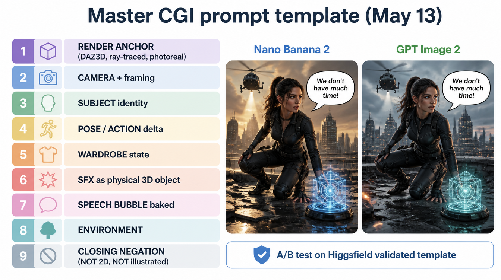

The big day — CHANGELOG itself launches, L20 camera distance lands with the April benchmark data, L12/L13/L14 cluster (dialogue close-framing / multi-speaker split / multi-view env refs), L19 reverses L7's "never bake lettering" rule, master CGI prompt template + 3-way model comparison blog post.

### Added
- **`CHANGELOG.md`** (this file) at repo root. From now on, every session that lands a meaningful change must append an entry here. See the header for the convention.
- **L20 — Camera distance bias for transformation comics.** New lesson with empirical basis: hand-made April mean camera distance **2.4** (between MCU and medium); AI-generated April **4.1** (between cowboy and full body), bimodal with zero panels in the middle distances {MCU, medium, cowboy}. The transformation event never *happens* on the AI version because the camera is too far to show body-region beats — chest growth at full-body framing reads as "before/after" not "the change happening now." Fix: default body-region beats to MCU / ecu-region; reserve `full` for the `reveal` beat; aim for chapter mean ≤ 3.0 and ≥ 30% of panels in middle distances. See `skills/comic-production/references/camera-distance-analysis/README.md` for the source data and full per-page scoring.
- **L20 enforcement layer.** `rules_audit.py` `check_camera_distance_bias`: HARD if chapter mean distance > 3.0; HARD if middle-distance fraction < 30%; SOFT per-beat finding when a non-`reveal` transformation beat is shot at a distance wider than the per-beat ceiling in `script-breakdown/SKILL.md` § Step 4.5. `next_panel.py` emits `WARNING_CAMERA_TOO_FAR_FOR_BEAT` at planning time. `build-comic.md` hard rule cites L20 with the gates as HALT conditions. Smoke-tested: AI-failure shape produces 2 HARD + 7 SOFT; hand-made shape is clean.
- **Top-of-file load-bearing index** in `lessons-learned.md`. Eleven lessons (L1, L1.5, L9, L10, L10 refinement, L11–L14, L19, L20) listed with one-line summaries at the top of the file. L-numbers remain chronological (no renumbering); importance is signaled via the index + build-comic.md hard-rule citations.
- **`skills/comic-production/references/camera-distance-analysis/`** directory with `README.md` (the empirical write-up) plus two infographic JPEGs. Source for L20.
- **L12 — Dialogue panels need close framing.** Hard rule: on-screen dialogue (bubble types `balloon` / `thought` / `whisper` / `shout`) must be paired with a close camera (`ecu-face` / `mcu` / `medium` / `cowboy`). Wide + on-screen dialogue produces panels where the reader can't tell who's talking (reviewer note from Supergirl issue #1: *"It doesn't zoom in when the person's talking to a tight shot"*). Caption and off-panel are exempt. `next_panel.py` now emits `WARNING_DIALOGUE_CAMERA_CONFLICT` when it detects the conflict; build-comic hard rule says HALT same as `MISSING_*`.
- **L13 — Multi-speaker beats split into per-speaker panels.** Hard rule: any single panel with ≥3 dialogue lines from ≥2 distinct on-screen speakers must be split into one panel per beat. The cramped one-panel rendering is broken-by-design (reviewer note: *"if we feed in a comic that has four different dialogue lines on one image, instead of that it shows several different people individually with their dialog line"*). `next_panel.py` emits `WARNING_MULTI_SPEAKER_CROWDING`; fix the shotlist before generating.
- **L14 — Multi-view location references for shot-reverse-shot.** Single env anchors break when the camera reverses direction in a dialogue scene (the L10 env-chaining picks one canonical view; reversing the camera produces a scene the anchor doesn't depict). Hero locations that host facing-character dialogue should carry multiple env refs (`_source.jpg`, `_source-reverse.jpg`). Authoring guidance landed; multi-view extension of `pick_location_anchor()` is logged as a follow-up. Reviewer note: *"when two people are talking, the camera can face both directions of the people."*
- **L10 refinement — Identity-vs-pose distinction.** L10 says "delegate constants to refs" but does NOT say "describe nothing." Cleaner line: refs carry identity / costume design / location architecture / lighting baseline; the prompt carries camera / pose / gesture / facial expression / action / momentary lighting state / momentary costume state change. Validated on a Higgsfield She-Hulk splash where the user marked *"wardrobe: red top remnants..."* as L10 violation (constant in ref) but *"pose: full hero roaring stance..."* as load-bearing prompt content (delta, refs can't carry per-panel beats). The render directive in `compose_prompt()` now states the inverse explicitly: *"References override prompt text on visual identity; prompt overrides references on pose and action."*
- **Step 0 questionnaire for script-breakdown** (the other guy's work, landing now). The `script-breakdown` skill must poll the user on three high-stakes decisions before parsing the script: style preset (2D vs 3D — the April v2 run defaulted to 2D when 3D was wanted because nothing forced a choice), location strategy, and transformation flavor + baseline tiers if applicable. Required output: `style`, `location_strategy`, and (when `transformation_scenes` is present) `transformation_metadata` as top-level fields in `shotlist.json`. See `skills/script-breakdown/SKILL.md` § Workflow Step 0.
- **Transformation-scenes structure + rules_audit gate** (the other guy's work, landing now). Multi-page transformations (FMG, growth arc, mutation, dress-up, charge-up, expansion) must be declared as a `transformation_scenes[]` entry in `shotlist.json` and decomposed into per-body-region beats: setup beats (`consider` / `decide` / `trigger` / `first_sensation`), body-region beats (`chest` / `hips` / `rear` / `arms` / `abs` / `legs` / `back` / `shoulders` / `suit_fail` / `whole_body`), resolution beats (`reveal` / `aftermath`). `rules_audit.py` flags HARD findings when a transformation scene lacks ≥1 setup beat, ≥3 distinct body-region beats, or ≥1 reveal beat. This is the gate whose absence produced the April-claudemade failure (9 alley pose shots, zero body-region beats) — the check now blocks that shape at script-breakdown time, before any generation cost is paid.
- **Camera-variety enforcement in `rules_audit.py`** (the other guy's work, landing now). HARD finding when a single `(distance, angle)` combo appears in >3 panels (the Chun-Li + April-claudemade failure mode of 6–7 panels at the same shot signature). SOFT findings for distance-variety floor (≥5 distance categories per 10-panel sequence), angle-variety floor (≥4 angle categories), missing ECU across a ≥6-panel sequence, missing wide-establish/splash across the same. Intimate scenes legitimately violate the floors — those are SOFT for that reason. Sustained-intensity scenes can suppress the angle warning.
- **`continuity-check/tests/`** directory (the other guy's work, landing now). Unit tests for the rules audit.
- **L19 — Bake lettering into the CGI render (reverses L7 Case B's "never bake" rule).** New active lesson. L7 Case B previously deferred all lettering — speech bubbles, captions, SFX — to `page-composer` vector overlays, producing a "CGI panel + sticker overlay" look rather than a single cohesive rendered comic page. L7 Case B's diagnosis (comic-coded vocab pulls CGI prompts toward illustration training data) was correct; its prescription was over-corrected. L19 bakes lettering directly into the prompt AND counters the illustration pull via aggressive anchoring: open with concrete render-engine vocabulary (*"Hyperrealistic DAZ3D Studio 3D CGI render, ray-traced subsurface scattering, physically-based rendering, 8K texture detail"*), render lettering as physical scene objects (3D-extruded chrome SFX letters with real ray-traced shadows, semi-translucent 3D speech panels floating in space with tails pointing at speakers, in-scene caption plaques), and close with explicit negation (*"NOT a comic, NOT an illustration, NOT anime, NOT 2D drawn art. Photographic CGI render."*). Opening anchors the photoreal target; closing tells the model what to avoid; both are needed. Open question logged inside L19: whether `page-composer` survives as an optional vector-lettering fallback or gets retired entirely.
- **Master CGI prompt template + A/B run on Nano Banana 2 vs GPT Image 2.** Synthesized the prompt-level lessons (L4, L7, L10, L10-refinement, L11, L12, L13, L19) into a single canonical CGI panel prompt skeleton so future agents have a reference shape to compose against. Skeleton order: opening render-engine anchor → camera (close per L12 when dialogue is present) → subject identity + cartoony-FMG silhouette anchor (L11) → pose / action / expression delta (L10 refinement) → wardrobe state delta (L10) → baked SFX as physical scene object (L19) → baked speech bubble with positioning (L4 + L19) → environment delta (L10) → closing negation block (L7 / L19). Full template + rule-to-section mapping below.

  A/B test on Higgsfield (identical prompt, 1k, 3:2, count=1 each):
  - **Nano Banana 2** (`nano_banana_flash`) → job `785d664e-95f7-42ec-9ae5-9d3cfa68b383` → `skills/comic-production/references/master-prompt-template/nano-banana-2.png`
  - **GPT Image 2** (`gpt_image_2`, quality=medium) → job `538997bf-801d-40d1-a04f-62098e91d515` → `skills/comic-production/references/master-prompt-template/gpt-image-2.png`

  **Verdict: GPT Image 2 followed the prompt more faithfully on this run.** It nailed the cartoony hyper-FMG silhouette (clearly tier-4-ish proportions, shoulders wide, biceps massive), rendered the qipao-strain wardrobe delta (visible chest tension), and held the pose closer to spec (hand against her own enlarged body, shocked expression). Nano Banana 2 went photoreal CGI on the body but pulled the silhouette back toward realistic-fitness modelling (the L11 prior fights harder on this model), rendered the qipao basically intact (ignored the strain delta), and defaulted to a classic Chun-Li victory flex instead of the introspective "registering enlarged bicep" pose. **Both models held the CGI register — no 2D illustration drift**, which validates the L19 strategy (bake lettering AND anchor aggressively with opening render-engine vocabulary + closing negation block). Both models partially failed on the L19 "photoreal 3D speech bubble" instruction — both fell back to flat 2D comic-style bubbles despite the explicit physical-object framing. SFX "KRRRK" landed sculpturally on GPT Image 2 and flat-2D on Nano Banana 2.

  **Open finding**: even with explicit "photoreal semi-translucent 3D panel" framing, both models default to flat 2D comic-style bubbles. Either the concept isn't in either model's training, or the prompt language doesn't survive the trained association between speech bubbles and comic illustration. Worth trying alternate vocabulary on the next iteration: "floating glass plaque", "translucent acrylic dialogue panel", "engraved stone tablet". Logged as a follow-up.

  Template (canonical CGI panel prompt skeleton — fill the bracketed slots):

  ```text
  [opening — render-engine anchor, L7 / L19]
  Hyperrealistic DAZ3D Studio 3D CGI render, ray-traced subsurface scattering on skin, physically-based rendering, 8K texture detail, shallow depth of field with photographic bokeh. Shot in a virtual studio with three-point lighting: warm key light at 5500K from camera-left, fill at 4500K, cool rim light at 6500K from camera-right. Photographic CGI.

  [camera — close framing when dialogue is present, L12]
  Camera: [distance] ([abbreviation]), [angle], [lens]. [framing note].

  [subject — identity comes from refs in production; tier silhouette per L11]
  Subject: [identity description]. Cartoony hyper-FMG comic-book proportions, NOT realistic fitness modelling. Tier [N] silhouette: [explicit dimensional anchors — see peak-body-scale.md]. Comic-book exaggerated musculature where the silhouette is the storytelling element.

  [action delta — pose / expression / gesture per L10 refinement]
  Action and expression: [pose and angle to camera]. Expression [feeling] — [eyes] [mouth]. [arm and hand placement]. [body energy].

  [wardrobe state delta — only what changed, L10]
  Wardrobe state: [base costume from ref]. [explicit damage / strain delta].

  [baked SFX — physical scene object, L19]
  In-scene SFX: the word "[SFX]" rendered as a 3D-extruded [material] letter sculpture, positioned [location in frame]. Real ray-traced shadows cast on [surface]. Catches the same [lighting] as the rest of the scene. A real sculptural object sitting in the scene, NOT a 2D overlay, NOT a sticker.

  [baked speech bubble — physical 3D panel per L19, positioning per L4]
  In-scene speech bubble: a photoreal semi-translucent white 3D panel with rounded edges and an extruded tail, floating in [location] of the frame. Slightly glossy surface with subtle subsurface scattering. The tail extends [direction], pointing to [speaker]. Black extruded sans-serif text on the surface reads exactly: [DIALOGUE]. A physical object in 3D space, casting a real shadow on [background surface].

  [environment delta — beyond the env ref, L10]
  Environment: [scene description with lighting motivation and depth].

  [closing — negation block, L7 / L19]
  NOT a comic, NOT an illustration, NOT anime, NOT cartoon, NOT 2D drawn art. Photographic CGI render.
  ```

  Rule-to-section mapping:
  - **L7 / L19** — opening render-engine anchor + closing negation block. Bake lettering, but counter the illustration pull at both ends of the prompt.
  - **L11** — "Cartoony hyper-FMG ... NOT realistic fitness modelling" anchor + tier-N silhouette descriptor with explicit dimensional anchors. Resists the model's realistic-fitness prior at tier ≥ 2.
  - **L10 / L10 refinement** — identity, costume design, location architecture come from refs (not the prompt); pose, action, expression, momentary lighting state, momentary costume change live in the prompt delta.
  - **L4** — speech bubble: position in frame + tail direction + exact text in quotes + per-speaker attribution.
  - **L12** — close framing baked into the camera line whenever dialogue is present (`mcu` / `medium` / `cowboy` / `ecu-face`).
  - **L13** — one speaker per panel (single dialogue line in the template).
  - **L19** — SFX as 3D-extruded sculpture, speech bubble as photoreal 3D panel — both rendered as physical scene objects, not 2D overlays.
- **Second A/B run: L-lesson index table rendering (text-heavy artifact).** Generated an image of the L-Lesson Index reference table itself (17 rows × 4 columns: #, Title, Summary, Status — pulled straight from `lessons-learned.md`) on both models, 1k / 2:3 / count=1 each. Artifacts stored at `skills/comic-production/references/master-prompt-template/l-lesson-index-nano-banana-2.png` and `l-lesson-index-gpt-image-2.png`.
  - Nano Banana 2 (`nano_banana_flash`) → job `bb817a0e-5897-4d35-b0a4-b1ea16c9fc37`
  - GPT Image 2 (`gpt_image_2`, quality=medium) → job `8b3f9d74-0366-4a71-8ef8-b49b8cc8aae6`

  **Verdict (surprising): Nano Banana 2 won this round.** Crisper text rendering at 1k, correct status pill color coding (green for `active`, amber for `superseded by L11` on L5). GPT Image 2 rendered the same table at slightly softer / fuzzier resolution and appears to have rendered all status pills green — missed the amber pill for L5. Both models nailed the overall layout: 18-row table, four-column structure, header row, title row. GPT Image 2 is tagged for text-rendering in its model description and almost certainly wins at `quality=high` + `resolution=2k`, but at the matched 1k / medium settings Nano Banana 2 delivered the better artifact.

  **Implication for the pipeline**: for text-heavy reference graphics (status boards, lesson indexes, shotlist tables, panel cheat-sheets), don't reflexively reach for GPT Image 2 at default settings. At 1k / quality=medium Nano Banana 2 is competitive and faster. Reserve GPT Image 2 for jobs where you'd actually pay for `quality=high` + `resolution=2k`, or where the typography is the primary deliverable (e.g. a hero infographic, not an internal reference).

### Changed
- **Stage 1 (script breakdown) gate**: `build-comic.md` state table now requires `rules_audit.py` to return no HARD findings on the shotlist before stage 2 is unlocked. Surface SOFT findings but don't block. Encodes the lesson that re-planning a shotlist costs nothing while regenerating panels wastes the API budget.
- **`next_panel.py` build_plan output**: now includes `WARNING_DIALOGUE_CAMERA_CONFLICT` and `WARNING_MULTI_SPEAKER_CROWDING` entries in `refs_to_attach` when the relevant detectors fire. Same HALT semantics as `MISSING_*`.
- **`build-comic.md` hard rules**: added new `Script-breakdown-stage rules` section (Step 0 questionnaire, rules audit at end of script-breakdown, transformation decomposition); added L10 identity-vs-pose refinement, L12 dialogue-camera, L13 multi-speaker split, L14 multi-view location refs to `Generation-stage rules`.
- **L4 un-deprecated.** L4 (speech bubble positioning, tail direction, attribution) was marked DEPRECATED because L7 Case B deferred all bubbles to `page-composer`. With L19 reversing that prescription, L4 is back to active — bubble positioning, tail direction, and per-speaker attribution all matter again because bubbles are now in the render.
- **L7 Case B rule flipped from "never bake lettering" to "bake lettering + anchor aggressively."** Worked example rewritten to show baked SFX + speech bubble with full DAZ3D anchoring and `NOT a comic, NOT an illustration` negation rather than stripped-out lettering deferred to `page-composer`. "Where this rule does NOT apply" updated to drop the page-composer-deferral bullet that contradicted the new rule. Historical note retained inline so the reversal reads cleanly to future agents skimming the file.
- **`prompt-templates.md` reconciled with L19.** Three deprecation notices in `skills/comic-production/references/prompt-templates.md` still pointed at L7 Case B's old "never bake lettering" rule (file header `STATUS: PARTIALLY DEPRECATED`, the Mandatory Rules Block `⚠️ PARTIALLY DEPRECATED` notice, and two `(⚠️ deprecated per L7 Case B)` bullets in the "Why each rule exists" list). All three now reflect L19: lettering IS baked into the CGI render, paired with the opening render-engine anchor and closing `NOT a comic, NOT an illustration` negation block. The **Action Lines and SFX** section's prompt block was rewritten from comic-burst phrasing ("RRRRIP! as red/yellow burst text", "action lines radiating outward") to L19's physical-scene-object phrasing (3D-extruded chrome letter sculptures with real ray-traced shadows, motion told through sweat/fiber/dust/blur instead of 2D overlays). The **Dialogue Formatting** section was promoted from "obsolete" to "active — applies whenever you bake a bubble," with a new long-form CGI/L19 bubble template alongside the legacy shorthand and a reference to L4's positioning rules.

---

## 2026-05-12


### Added
- **L11 — Cartoony FMG proportions need explicit anchoring or the model regresses to realistic fitness** (`78815c5`, `7905431`). New lesson + supporting reference doc at `skills/comic-production/references/peak-body-scale.md`. Diagnosed from the April-claudemade and Supergirl runs: generated tier-4+ panels were visibly *smaller* than declared because (1) the lineup ref was attached on too few panels, and (2) prompt vocabulary like "match the muscle proportions of figure N" was too gentle, letting the model regress to its realistic-fitness prior. Two-part fix:
  - **Attachment rule broadened (replaces L5)**: `should_attach_lineup()` in `next_panel.py` now returns True on **stage-change OR full-body camera** (`front-full`, `3q-full`, `side-full`, `back-full`, `low-angle-front`, `low-angle-back`, `splash`). ECU and mcu skip. On Flow refs are free; the silhouette consistency gain outweighs slight composition risk.
  - **Vocabulary upgrade**: for any tier ≥ 2 panel, `compose_prompt()` emits a "cartoony hyper-FMG comic-book proportions, NOT realistic fitness modelling" anchor before the action delta, a tier-specific silhouette descriptor with dimensional anchors (e.g. tier 4: "shoulders 2x normal width with clear deltoid mass, large defined biceps and triceps, full powerful chest, ridged abdominal definition, strong sculpted quads"), a "Render the silhouette TO MATCH the lineup figure — do not approximate to a smaller realistic build" directive, and an explicit "NOT realistic fitness, NOT athletic" negation.
- **`peak-body-scale.md` reference doc** (`78815c5`): tier-by-tier silhouette catalog (1–9), working vocabulary, vocabulary to avoid ("athletic" / "toned" pulls toward realistic fitness), failure modes. Tier 4 explicitly called out as "the friction zone" — the threshold between realistic and cartoony where the model fights the cartoony commit hardest.

### Changed
- **L11 surgical scoping** (`7905431`): the original L11 prompt told the model to "match the EXACT silhouette" of the lineup figure, which the model interpreted holistically — copying hair, face, costume, pose from the lineup figure (a brunette in white tank + gray shorts). Validated on a real Higgsfield generation of `comic-april-mutagen-v2` panel `p15-01` (tier-6 splash). The new prompt declares the lineup a "PROPORTION reference ONLY" with an explicit do-NOT-borrow list: face, hair, skin tone, clothing, costume, pose, facial expression, lighting, setting, background. Resubmit produced cartoony-big proportions WITHOUT the lineup figure's hair/clothing bleeding through. Validation: see chat session record from 2026-05-12 around 23:00 PT.
- **`panel_status()` in `next_panel.py` now recognizes both folder-naming conventions** (`7905431`):
  - `pages/panels/<panel_id>/` (older form)
  - `pages/panels/panel-<panel_id>/` (newer form used by April + Supergirl projects)
- **`panel_status()` now recognizes both accepted-image conventions** (`7905431`):
  - `_accepted.txt` (one line naming the variant, e.g. `v1`) + `v1.png`
  - `v*_accepted.png` filename suffix (used by `rules_audit` + `compose_page`)
  
  Without these fixes `next_panel.py` was silently inoperable on projects using the panel- prefix + v*_accepted.png shape — which is what the rest of the pipeline emits. The lineup-bug debugging session surfaced both.

### Fixed
- **`find_lineup()` path resolution** (`0b963c6`). Supergirl panel 13 (tier-4-tears) rendered without the muscle-size lineup attached because `find_lineup()` only looked at `~/.claude/skills/comic-production/assets/`, which doesn't exist on dev machines. The repo-bundled lineup at `skills/comic-production/assets/muscle-size-lineup.png` was invisible. Worse: the prompt composer still wrote *"match figure N in the attached muscle-size lineup reference"*, invoking a ref that was never attached — model fell back to text interpretation and produced an undersized build. Now `find_lineup()` tries, in order: project-local override (`<root>/references/style/<filename>`), repo-bundled (script-relative), user-installed (`~/.claude/...`), plugin-installed (`~/Library/.../Claude/...` glob).
- **No-phantom-refs guardrail** (`0b963c6`). `compose_prompt()` takes a `lineup_attached: bool` and only references the lineup in the prompt when it's actually attached; otherwise falls back to verbal-only growth instructions. `build_plan()` emits a loud `MISSING_lineup` entry in `refs_to_attach` when `find_lineup()` returns None on a panel that needs one; `build-comic.md` hard rule says HALT on any `MISSING_*` entry — never invoke a ref that isn't on disk.

---

## 2026-05-11

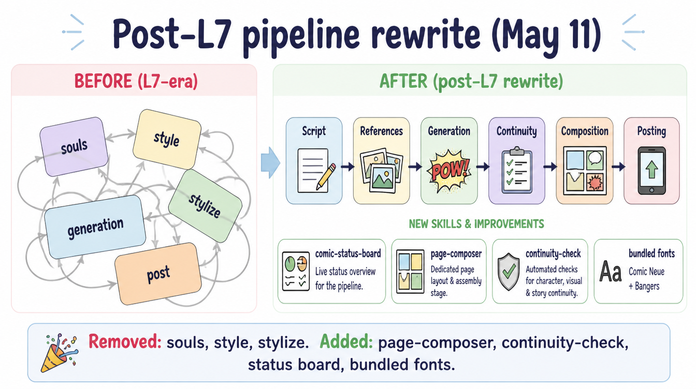

### Added
- **L10 — References are the truth, prompts are deltas** (`1202441`). Major prompt-architecture change. Diagnosed from Supergirl panels 02 vs 05 (same `lex-lab-redsun` location, env ref attached, but rendered as visibly different chambers). Root cause: per-panel prompts re-described constants (character features, location architecture, costume design) that were already encoded in attached references. Model treated text and refs as competing signals and interpolated.
  
  Fix: delta-only prompt skeleton. Prompt body describes ONLY camera, action, expression, lighting state change, costume state change. Constants delegated entirely to attached references. Every prompt ends with the load-bearing render directive: *"render the attached references exactly as shown. Do not reinterpret character appearance, costume design, or location architecture from the prompt text. References override prompt text on all visual identity."*
  
- **Env chaining (corollary of L10)** (`1202441`). First panel in a hero location attaches `_source.jpg` (the DAZ stand-in render). Once accepted, that panel becomes the location's canonical anchor — every subsequent panel in the location attaches the *accepted* establishing shot's PNG as env ref, NOT `_source.jpg`. The DAZ render did its job on the first panel; the accepted shot is more specific and prevents the model from re-interpolating architecture each panel. `next_panel.py`'s `pick_location_anchor()` walks `accepted_history` for prior panels in the same location.
- **`page-composer` script + bundled Pillow renderer** (`ccddfb9`). `skills/page-composer/scripts/compose_page.py` lettering pass. Auto-detects single-image-per-page vs multi-panel mode from shotlist. Renders balloons, thought ellipses, jagged shouts, dashed whispers, yellow caption boxes, stroked SFX. Defaults to short stub tails when `speaker_position` isn't given; optional `--pdf` via `img2pdf` (lossless). SKILL.md rewritten for single-image-per-page primary mode; multi-panel as fallback. Upgrade path logged (HTML/CSS via headless Chrome, face-aware bubble placement, smarter grids, bundled fonts, per-character styling).
- **`continuity-check` two-mode workflow** (`ccddfb9`). `skills/continuity-check/scripts/rules_audit.py` for the deterministic first pass (asset presence, monotonic muscle_size_tier, coarse 3-level costume damage non-regression with carryover phrasing recognition, stage-change lineup ref presence, field hygiene). Vision audit is agent-driven (workflow encoded in SKILL.md) — Claude Reads each panel image and diffs against shotlist intent + prior panel. Rules-first because it's fast and free; vision pass focuses on pixel-level drift the rules can't see.
- **Bundled fonts** (`e4b6bd1`). `skills/page-composer/fonts/`: Comic Neue Bold (dialogue/captions) + Bangers (SFX), both SIL OFL 1.1. Verified via Pillow. Output is now deterministic across machines. Resolution order: env var → bundled → macOS system → Pillow default.
- **Act-boundary continuity gate** (`e4b6bd1`). `/build-comic auto` now runs the rules audit at every act boundary inside Stage 3 (resolved from optional `shotlist.acts` field, or fallback every 8 pages). HARD findings pause for sign-off; clean passes continue. Stage 4 reframed as the full-issue vision audit. Hard rule added: never skip the per-act rules audit — it's free and fast.
- **`next_panel.py` helper** (`6a1d2a5`). Reads shotlist + walks `pages/panels/` for accepted-version history, applies view-aware chaining (L1.5) to pick a state anchor, identifies refs to attach (face card, env ref, muscle lineup if stage-change), maps camera category to Flow aspect ratio, composes a starter prompt. Output intended for Claude during the per-panel Flow UI loop documented in `references/shotlist-driven-flow.md`.
- **`comic-status-board` skill** (`533423a`). Surfaces project status in chat at stage boundaries via `generate_status.py` (markdown) and `generate_composite.py` (Pillow grid renderer with 3 modes: references / generation / composition). STATUS artifacts written at project root (not buried in subfolders) per user feedback, and surfaced inline via Read so the user sees them in chat.

### Changed
- **Post-L7 pipeline rewrite** (`acfb319`). Integrated `comic-production` skill; dropped `souls` stage (Higgsfield Souls training, no longer used — identity is anchored via face card + body ref chaining), dropped `style` stage (replaced by style-lock as a *preset library*, not a pipeline stage), dropped `stylize` stage (current CGI render path produces the right look directly). Added `posting` stage stub (manual today). Added hard rules: no baked-in lettering (L7 Case B), job_id capture (L9), view-aware chaining (L1.5), camera variety check, env reference for hero locations, multi-character POSE VARIATION block, single-line Flow prompts.

---

## 2026-05-09

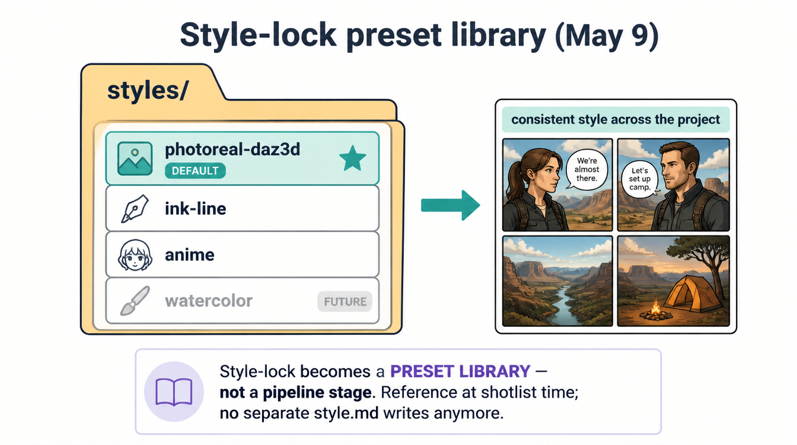

### Added
- **`style-lock` as preset library** (`d2497c0`). `photoreal-DAZ3D` as the default preset; extensible `styles/` folder. Style-lock survives the post-L7 rewrite as a reference library for shotlist authoring, not a pipeline stage that produces `style.md`.

---

## Earlier history

Earlier commits (`311d322`, `80cea83`) predate this changelog. Initial repo bootstrap, first stylization skill draft, AI-bootstrap warning, Higgsfield-first principle. See `git log` for details.

---

## Convention for future entries

When you land a change:

1. Append under today's date heading (`## YYYY-MM-DD`). Create one if it's a new day. Reverse-chronological — newest dates at top.
2. Use **Added** / **Changed** / **Fixed** / **Removed** / **Deprecated** categories. Skip empty ones.
3. Cite the commit hash(es) in parentheses. Use the short hash form (7 chars).
4. Explain the **why** — what failure mode the change fixes or what capability it adds. Future readers (humans and agents) should be able to understand the rationale without `git log -p`.
5. Cross-reference reference docs (`peak-body-scale.md`, `lessons-learned.md` L-numbers) where relevant.
6. Keep entries scannable but complete. Multi-paragraph entries are fine when the change has real depth (like L10 / L11); one-liners are fine for narrow fixes.
7. Append the entry **before** committing, so the commit message and changelog land together.

---

## 2026-05-14

### Added
- **L25 — Body-region reveals are sticky.** New lesson. Once a body region is exposed in any panel (e.g., Susan's abs in p3-04 ecu-region with blouse riding up), every subsequent post-reveal panel whose camera includes that region must include explicit costume directives that PRESERVE the exposure. Drifted in moving-experience-v2 p4-01 first take (long full blouse covered the abs that were canonical from p3-04). Fix: costume_state in post-reveal panels must specify "knotted blouse CROPPED above the abs at the ribcage, full hyper-muscular abdomen visible between the knot and the skirt waistband" rather than vague "tied at chest" phrasing.
- **L26 — Costume identity must be canonical across panels.** New lesson. Vague costume description ("white top tied at chest") lets the model interchange garment FAMILIES across panels — p4-01 first take rendered as strapless bandeau wrap, p4-02 rendered as collared sleeveless button-up blouse, both technically "tied at chest." Fix: name the garment family explicitly — "knotted button-up collared sleeveless blouse with the original collar visible at the neck and the original blouse buttons visible on the cropped fabric." For remnant costumes: name the intact garment + the destruction state.
- **L27 — Skin sheen / texture continuity across panels.** New lesson. Hyper-muscular silhouettes amplify skin specular drift — p4-02 rendered with oiled-bodybuilder competition shine while p4-01 (immediately preceding) was matte natural. Fix: name skin sheen explicitly with consistent vocabulary on every prompt — "natural healthy MATTE skin (subtle subsurface scattering only, NOT oiled, NOT wet, NOT bodybuilder competition shine)." Allowable per-panel variation: lighting + exertion sweat; not allowable: bodybuilder-grease that tracks muscle topography.
- **moving-experience-v2 chapter** at `/Users/mattmenashe/Documents/moving-experience-v2/` — 26-panel v2 retry of Gribble's "A Moving Experience" script. Surfaced L25/L26/L27 during the audit pass; p4-01 regenerated to verify the canonical "knotted button-up collared blouse cropped at ribcage + matte skin" prescription holds.
- **`the-rules-explained.md`** — plain-English explainer article in `skills/comic-production/references/` that walks every active L-lesson (L1 through L27 plus L1.5 and L10-refinement) for a general audience. Grouped by theme: chaining & state / refs vs prompts / bodies & proportions / cameras & framing / dialogue & lettering / environments / anti-hallucination / cumulative state. Includes a "lessons proposed but not yet enforced" callout for L15–L18 (still in the running feedback list) and short notes on superseded/historical lessons (L2–L8). Paired with 8 infographic graphics generated via GPT Image 2 on Higgsfield, saved under `references/the-rules-explained-graphics/`: pipeline flow, refs vs prompts split, silhouette ladder (L11), dialogue framing comparison (L12), camera distance scale with the April benchmark (L20), baked-vs-overlay lettering (L19), anti-hallucination collage (L21-L24), multi-speaker split (L13).

### Open (logged for future work)
- `compose_prompt()` enforcement layer for L25/L26/L27: derive per-character canonical post-transformation costume from cast[] entry + transformation_metadata + auto-inject in post-reveal panels; auto-inject skin sheen vocabulary on every prompt of any character with `muscle_size_tier` >= 2.
# Changelog


All notable changes to the `claude-comic-pipeline` are tracked here.

This file is the **canonical source for what changed and why**. Any session (human or agent) editing this repo must append an entry here when it lands a meaningful change. Trivial cleanups can be skipped; anything that touches behavior, prompt architecture, the build-comic workflow, or a published reference doc must be logged.

Format: each entry is dated (YYYY-MM-DD), grouped in reverse-chronological order. Entries cite the relevant commit hash(es) and explain the *why* — what failure mode prompted the change, what the new behavior is, where readers can dig deeper.

Categories used per dated section: **Added** / **Changed** / **Fixed** / **Removed** / **Deprecated**. Skip categories with no entries.

---

## 2026-05-17 (compose_prompt section-formatting — labeled `[SECTION]` headers instead of one unbroken paragraph)

### Changed

- **`compose_prompt()` output is now human-scannable** ([skills/comic-production/scripts/next_panel.py](./skills/comic-production/scripts/next_panel.py)). Previously every directive — render anchor, camera, subjects, L11/L15/L17/L18/L20/L21/L22/L23/L24/female-anatomy/L29-32/L10, action delta, env line, state anchor, mandatory rules, L19 lettering, closing anchor — was concatenated into one space-joined paragraph. When a generation went wrong it was impossible to scan the prompt and tell which directive misfired. The new output emits each directive as a labeled section:

  ```
  [CHARACTER — L17 canonical anchor]
  L17 canonical anchor: render the canonical published versions...

  [POSE & ANATOMY — L18]
  L18 anatomy coherence: torso, hips, abdomen, and feet all face...
  ```

  Sections are separated by blank lines and joined with `"\n\n".join(...)`. Same semantic content; image models tokenize whitespace fine, so this is a presentation refactor only. Flow runner already flattens newlines to spaces in `_set_prompt()` (Flow's text area treats `\n` as submit), so Flow submissions still receive the single-line concatenation; the Higgsfield API accepts multi-line strings directly.

### Added

- **`section_label` attribute on the `Rule` base class** ([rules/_base.py](./skills/comic-production/rules/_base.py)) — a short bracketable phrase like `"CHARACTER — L17 canonical anchor"` that drives the section header. Multi-slot rules (currently only L11) declare a dict keyed by slot name; single-slot rules use a string. A `section_label_for(slot)` resolver method handles both shapes, with a fallback to `rule.id` when unset.
- **`section_label` set on every rule module**: L10, L11 (per-slot), L15, L17, L18, L20, L21, L22, L23, L24, L29, L30, L31, L32, FemaleAnatomy.
- **`_format_section(label, body)` helper** in `next_panel.py` — wraps a prompt fragment in `[LABEL]\n<body>`. Defensively skips empty/whitespace-only bodies so optional sections (LIGHTING STATE, ACTION DELTA, STATE ANCHOR — L1.5, etc.) don't emit empty headers.
- **A/B test artifacts** at [skills/comic-production/references/prompt-format-ab-test/](./skills/comic-production/references/prompt-format-ab-test/) — `old.prompt.txt`, `new.prompt.txt`, `old.png`, `new.png`, `metadata.json`, and a README. Validated end-to-end on Higgsfield (`nano_banana_flash`, 1k, 4:3, count=1, 3 refs attached: lenny + carl face-cards + mundy-lab-a env source). OLD job `ee112f57-8b57-4a59-9972-64455d7e3a4a`, NEW job `1cabc083-511e-4c5b-867e-4b2e83576496`. Both renders are visually equivalent (same characters, same lab, same cowboy framing, same speech-bubble text); the differences fall within nano_banana_flash's normal sample-to-sample variance. Confirms the format change is presentation-only with no observable effect on model behavior.

### Notes

- The `_trace` ledger still records the unwrapped directive in `compose_contribution` so the ledger schema is unchanged.
- The composer's rule iteration order is unchanged — section headers do not reorder anything.
- Existing `panels.json` payloads in the wild from old runs are untouched — only newly-generated prompts use the new format.

---

## 2026-05-16 (Mira panel-render validation — L30/L31/L32 confirmed end-to-end + 3 canonical-cast promotions)

### Added

- **Mira panel-render validation log** at [`docs/posts/2026-05-16-mira-panel-validation.md`](./docs/posts/2026-05-16-mira-panel-validation.md) — 24 Higgsfield gens (8 per tier) of a synthetic Mira panel through the full L30/L31/L32 ref stack. All 23 successful candidates archived at [`docs/posts/2026-05-16-mira-panel-validation/{tier-7,tier-8,tier-9}/`](./docs/posts/2026-05-16-mira-panel-validation/). First **panel-render** validation of the per-tier rules (previous L30/L31/L32 work only validated the reinforcement *sheets*, not the panel-render path).
- **Canonical-cast Mira tier-7/8/9 promotions**: [`canonical-cast/mira/body-tier{7,8,9}.png`](./skills/comic-production/references/canonical-cast/mira/) ingested + documented in [canonical-cast README](./skills/comic-production/references/canonical-cast/README.md). Same images mirrored to [`growcomics-references/series/characters/mira/`](/Users/mattmenashe/Documents/growcomics-references/series/characters/mira/) with `_provenance.md`. Mira tier-7/8/9 form a coherent growth sequence (same identity + costume + pose across all three) — chain off as a sequential tier ladder.
- **4 picks validate end-to-end**: tier 7 = `6959196c`, tier 8 = `d5fa091e`, tier 9 = `2e735ea5` (user-confirmed across all three matching my recommendations).

### Findings

- **L30/L31/L32 produce tier-N panel output reliably**: 23/23 successful candidates land at their declared tier with the L11 surgical-scoping intact. Zero leakage from reinforcement sheets' clothing/hair/face/background into the rendered panels.
- **NSFW upload filter is non-deterministic**: same shape of content (anatomical detail sheets with breast-volume zoom) was blocked at upload during the L29 run but cleared cleanly for tier-7/8/9 this run. Don't treat NSFW upload blocks as permanent — retry on a later session.
- **4-ref stack works at all peak tiers**: face + lineup + 2 reinforcement = 4 attached refs. Higgsfield nano_banana_flash handled this consistently across 24 gens. The "3-ref ceiling" in L23 is per-model and may be softer than originally documented — worth re-examining.

### Validation milestone

- **Peak-tier reinforcement series (L29/L30/L31/L32) is now end-to-end validated**: not just the sheets, not just the prompt-assembly, but the actual rendered panel output. The architecture is ready for production use on FMG comics escalating to tier 6/7/8/9.

### Credit cost

- ~72 credits for the 24-gen batch + a few credits for the 7 ref uploads (which don't burn generation credits).

---

## 2026-05-16 (L32 — tier-9 reinforcement refs ingested + rule wired, completes the peak-tier series)

### Added

- **L32 rule module** at [`skills/comic-production/rules/l32_tier9_reinforcement.py`](./skills/comic-production/rules/l32_tier9_reinforcement.py) — sibling of L29/L30/L31, fires at `panel.muscle_size_tier == 9`. Caps the peak-tier reinforcement series.
- **Tier-9 anatomical reference sheets** at [`skills/comic-production/references/peak-body-scale/tier-9/`](./skills/comic-production/references/peak-body-scale/tier-9/) — both file slots point to the same image: a user-directed Grok image-edit of my A-02 candidate (`bc2bac33`) with the prompt "Make the breasts bigger, change nothing else." The resulting composite (`4b290bcc`) already contains both full-body views and detail-zoom insets, so using one image for both slots is intentional and matches the L32 doc. 16 candidates generated (8 A + 8 B, all 16 successful — clean run with 0 NSFW and 0 platform-failures), all 16 archived at [`docs/posts/2026-05-16-tier-9-candidates/`](./docs/posts/2026-05-16-tier-9-candidates/). Credit cost: ~50 + a few Grok credits for the bust edit.
- **Helpers + wiring**: `find_tier9_reinforcement_refs()`, `should_attach_tier9_reinforcement()`, ctx flag `tier9_refs_attached`, slot dispatch after L29/L30/L31. `_has_tier9_reinforcement_refs()` audit helper + per-panel HARD gate.
- **Docs**: tier-9 section in [`peak-body-scale.md`](./skills/comic-production/references/peak-body-scale.md) noting the peak-tier series is now complete; L32 lesson in [`lessons-learned.md`](./skills/comic-production/references/lessons-learned.md) including a new "operator-in-the-loop lesson" naming the user-directed-Grok-edit pattern as legitimate output when 16 generated candidates don't have the exact attribute the user wants.

### Validation

- End-to-end smoke test against a synthetic tier-9 Mira panel: both PNGs attached, L32 directive renders, trace shows `L32.pre_render.status="pass"`.

### Milestone

- **Peak-tier reinforcement series is complete**: L29 (tier 6) + L30 (tier 7) + L31 (tier 8) + L32 (tier 9) all ship dedicated reinforcement sheets. Multi-figure lineup interpolation failure mode blocked at every peak tier.

---

## 2026-05-16 (L31 — tier-8 reinforcement refs ingested + rule wired)

### Added

- **L31 rule module** at [`skills/comic-production/rules/l31_tier8_reinforcement.py`](./skills/comic-production/rules/l31_tier8_reinforcement.py) — sibling of L29/L30, fires at `panel.muscle_size_tier == 8`. Same slot (`8b_tier_reinforcement`), same surgical-scoping pattern, same all-or-nothing attachment.
- **Tier-8 anatomical reference sheets** at [`skills/comic-production/references/peak-body-scale/tier-8/`](./skills/comic-production/references/peak-body-scale/tier-8/) — Sheet A pick `7c0d52dd` (most explicit labels: DELTOIDS Massive 3x, MAXIMAL Quad Volume, Bicep Profile, Waist Narrowness, Leg Musculature) and Sheet B pick `6072b6d6` (best dimensional callouts: VANISHINGLY NARROW WAIST, Tier 8 breast detail — larger fuller more projected). Generated 2026-05-16 evening using Mira as source character + tier-6-full-body.png as STYLE anchor; prompt instructs "render TWO TIERS bigger than reference #2 (tier-6 baseline)." 16 gens, 14 successful (1 NSFW filtered, 1 platform-failed). 12 unsuccessful + non-picked candidates archived at [`docs/posts/2026-05-16-tier-8-candidates/`](./docs/posts/2026-05-16-tier-8-candidates/). Credit cost: ~50.
- **Helpers + wiring**: `find_tier8_reinforcement_refs()` and `should_attach_tier8_reinforcement()` (uses the shared `_find_peak_reinforcement_refs(root, 8)` helper that's now factored across L29/L30/L31), ctx flag `tier8_refs_attached`, slot dispatch at `8b_tier_reinforcement` after L29/L30. `_has_tier8_reinforcement_refs()` audit helper + per-panel HARD gate in `rules_audit.py`.
- **Docs**: tier-8 section in [`peak-body-scale.md`](./skills/comic-production/references/peak-body-scale.md); L31 lesson in [`lessons-learned.md`](./skills/comic-production/references/lessons-learned.md).

### Validation

- End-to-end smoke test against a synthetic tier-8 Mira panel: both PNGs attached, L31 directive renders into the composed prompt, trace shows `L31.pre_render.status="pass"`.

### Fixed (post-commit)

- CHANGELOG entry for L31 was missed during the `fe098d0` commit due to a linter-induced file-modification race; added in a follow-up doc commit.

---

## 2026-05-16 (L30 — tier-7 reinforcement refs ingested + rule wired)

### Added

- **L30 rule module** at [`skills/comic-production/rules/l30_tier7_reinforcement.py`](./skills/comic-production/rules/l30_tier7_reinforcement.py) — sibling of L29, fires at `panel.muscle_size_tier == 7`. Same slot (`8b_tier_reinforcement`), same surgical-scoping pattern (PROPORTION REFERENCE ONLY do-NOT-borrow list), same over-spec compensation, same all-or-nothing attachment. Multiple rules can share a slot in registry order; L29 and L30 are mutually exclusive on tier conditions so only one fires per panel.

- **Tier-7 anatomical reference sheets** at [`skills/comic-production/references/peak-body-scale/tier-7/`](./skills/comic-production/references/peak-body-scale/tier-7/) — `tier-7-full-body.png` (Sheet A pick `fb14428d`, front + rear with proportion stat callouts + 4 detail insets) and `tier-7-anatomical-detail.png` (Sheet B pick `3beb5bbd`, 4-panel close-up sheet with dimensional callouts on waist narrowness). Generated 2026-05-16 evening using Mira as source character and the prompt recipe in the tier-7/8/9 plan doc; user manually picked 1 of 8 candidates per sheet (per the locked-in decision favoring manual review on canonical-asset picks). 16 gens submitted, 11 successful, 2 NSFW filtered at gen time, 3 platform-failed. Credit cost: ~50. All 11 candidates archived at [`docs/posts/2026-05-16-tier-7-candidates/`](./docs/posts/2026-05-16-tier-7-candidates/).

- **L30 helpers + ref-attachment block** in `next_panel.py`: `find_tier7_reinforcement_refs()` (parameterized internally via the new `_find_peak_reinforcement_refs(root, tier)` helper that's shared between L29 and L30), `should_attach_tier7_reinforcement()`, ctx flag `tier7_refs_attached`, slot dispatch at `8b_tier_reinforcement` right after L29. The ref-ceiling counter now also includes `tier7_reinforcement` entries.

- **HARD audit gates for tier 7** in `rules_audit.py`: `_has_tier7_reinforcement_refs()` (parameterized internally via the new `_has_peak_reinforcement_refs(project, tier)` helper), per-panel check that HARD-fails when a tier-7 panel exists but the reinforcement PNGs aren't findable. Same shape as the tier-6 gate.

- **Docs**: new tier-7 reinforcement section in [`references/peak-body-scale.md`](./skills/comic-production/references/peak-body-scale.md); new **L30** lesson in [`references/lessons-learned.md`](./skills/comic-production/references/lessons-learned.md) capturing the failure mode (multi-figure lineup-4-9 chart interpolates tier-7 toward middle) and the fix (same shape as L29).

### Validation

- End-to-end smoke test against a synthetic tier-7 Mira panel: both PNGs attached, L30 directive renders into the composed prompt, trace shows `L30.pre_render.status="pass"`. Tier-7 build verification on real renders not yet done (the user-pick batch confirmed the SHEETS render at tier-7 proportions in 11/11 successful gens; panel-render validation comes in the next iteration).

---

## 2026-05-16 (L29 validation — 8 Higgsfield credit-burns confirm tier-6 lands at parity)

### Added

- **Validation log + 8 generation assets** at [`docs/posts/2026-05-16-l29-validation.md`](./docs/posts/2026-05-16-l29-validation.md) and [`docs/posts/2026-05-16-l29-validation-assets/`](./docs/posts/2026-05-16-l29-validation-assets/). 8 nano_banana_flash 1k 3:4 generations of a synthetic tier-6 Chun Li panel with the L29 reference stack attached (face + lineup + tier-6-full-body). All 8 land at tier-6 proportions (deltoid mass dwarfing head, biceps approaching waist width, sculpted abs, broad lats, large forward-projected bust). Zero reference leakage — costume / hair / face / background all stayed on-prompt; no inset photos or annotated-overlay watermarks rendered. Credit cost: 27.

- **Tier-7/8/9 reinforcement-ref generation plan** at [`docs/posts/2026-05-16-tier-7-8-9-reinforcement-plan.md`](./docs/posts/2026-05-16-tier-7-8-9-reinforcement-plan.md). Codifies the user-specified prompt recipe (sheet + biceps zoom + breast zoom + waist zoom + rear view) × 8 generations per prompt × 3 tiers = 120 candidates, picks composited into two PNGs per tier mirroring the tier-6 file shape, wired through sibling L30/L31/L32 modules. 5 open decisions for the user to answer before generation can start.

### Finding

- **Higgsfield NSFW upload filter blocks `tier-6-anatomical-detail.png`** at `media_confirm` (close-up biceps + breast volume + waist + posterior detail). The full-body reinforcement sheet uploaded cleanly. Local pipeline and Flow are unaffected — the file is fine; only Higgsfield's API rejected the upload. Mitigation options (re-export, crop, platform-flag) documented in the validation log under Finding 1. Validation proceeded with single-ref reinforcement (face + lineup + tier-6-full-body); the 4-ref full-L29 stack remains untested on Higgsfield but the 3-ref result is already strongly positive.

### Changed

- **Memory rule added**: `feedback_validate_with_credits` — any rendering-path pipeline change needs real Higgsfield gens (4-8 minimum) before "done"; results land in git, not just chat. User-directed today after asking whether one-off validation was worth the credits ("always worth many credit burns to check, remember that, and store the results in github").

---

## 2026-05-16 (L11 breast-scale anchoring — Alignment Diff #3, user-directed)


### Changed

- **L11 vocabulary expanded with parallel breast-scale anchoring.** Triggered by user observation 2026-05-16 afternoon: *"There is a problem with the generations in that it seldom matches the breast size of the reference attached. I did a prompt where I asked it to match the breast size of the sixth person in the muscle comparison chart and the rendered output still landed with smaller breasts than the lineup figure shows."* Tested on Higgsfield with `nano_banana_flash` at 1k with explicit user prompt asking to match figure 6 — muscle came through correctly at tier 6 (the morning's silhouette purge was holding) but breasts rendered at tier 2-3 size. Diagnosis: the lineup conveys TWO load-bearing proportion attributes (muscle scale AND breast scale), but the post-silhouette-purge vocabulary called out only muscle with caps-lock framing and "do not regress" guards. Breasts were mentioned as a passing list item ("(b) the size, fullness, and shape of the breasts") buried inside a three-part list with no CAPS-LOCK framing, no anti-regression guard, no style-anchor mention, and no costume-accommodates anchor. Same shape as the silhouette purge: load-bearing vocabulary at the rule-content level was missing the words that pointed at the attribute. The model's average-breast-scale prior dominated.

- **Fix design + v1→v2 iteration.** Promoted breast scale to a first-class anchor using the same surgical-scoping pattern that fixed muscle in the morning's purge. v1 vocabulary (parallel **CRITICAL — BREASTS** block, anti-regression guards, style-anchor mention, stage-change verbal-fallback mention, vision-rubric verification) landed close on a Chun Li tier 6 validation render but breasts still under-rendered at ~tier 4-5 (qipao costume read as "modest" and flattened the breast contour despite the explicit anchor). v2 added four pipeline-generic escalations that fully resolved it: (1) **over-spec compensation** — explicit instruction to render slightly larger than the lineup figure shows so the model's downward-bias normalization lands at parity (per `feedback_chest_oversize_compensate` memory); (2) **costume-accommodates anchor** — the costume must accommodate the breast scale (pushed forward, stretched, fitted around the volume), not the breasts shrunk to fit the costume's profile; (3) **anti-flattening negation** — NO modest profile, NO conservative coverage, NO costume drape that hides the breast volume; (4) **dramatic-enhancement framing** — "at tier N the breast scale should read as a DRAMATIC enhancement over figure 1's baseline." All four folded back into `l11_muscular_build.py` before commit so the pipeline emits the working vocabulary by default.

- **6 files swept** (split across two commits — `a57f03c` L29 commit bundled the first wave of doc edits, this commit lands the remaining work):
  - **Rule module**: [`skills/comic-production/rules/l11_muscular_build.py`](./skills/comic-production/rules/l11_muscular_build.py) — `L11_STYLE_ANCHOR` rewritten with tier-scaled breast proportions + costume-accommodates anchor. Lineup-attached block (slot `8_tier_build`) rewritten with parallel **CRITICAL — MUSCLE** / **CRITICAL — BREASTS** structure, over-spec compensation, costume-accommodates, anti-flattening, dramatic-enhancement framing, anti-regression guards. Stage-change verbal-fallback path updated with breast-scale mention + over-spec note. `vision_rubric` rewritten to verify BOTH attributes independently (MUSCLE section + BREASTS section + common-regression-pattern callout). `retry_strategy` strengthening updated with over-spec compensation language. Two `Alignment Diff #3` comments above `_BUILD_BY_TIER` documenting the v1 design + v1→v2 iteration learnings.
  - **Docs (committed in `a57f03c`)**: [`references/lessons-learned.md`](./skills/comic-production/references/lessons-learned.md) L11 section — important framing updated to "TWO proportion attributes" + root-cause list extended from 3 to 4 (breast scale failure added) + "what the lineup conveys / does NOT convey" enumeration. [`references/peak-body-scale.md`](./skills/comic-production/references/peak-body-scale.md) — "What the lineup actually is" rewritten as two-attribute body chart; "How to anchor" example rewritten with parallel CRITICAL blocks; vocabulary lists split by attribute; failure modes expanded from 4 to 6; new "History — the breast-scale anchoring" section. [`references/the-rules-explained.md`](./skills/comic-production/references/the-rules-explained.md) — L11 article body rewritten to describe two proportion attributes; new "Important: the breast-scale anchoring (2026-05-16 afternoon)" subsection. [`reference-gathering/SKILL.md`](./skills/reference-gathering/SKILL.md) — Step 2 body-tier ref instructions updated; lineup-instruction string rewritten with parallel CRITICAL blocks.
  - **Docs (this commit)**: `references/lessons-learned.md` Fix list extended from 5 to 9 items (items 6-9 capture the v2 escalations) + vocabulary-that-works list expanded with v2 phrases. [`commands/build-comic.md`](./commands/build-comic.md) — L11 bullet expanded with two-proportion-attribute note + pointer to the lessons-learned section + warning that muscle-only anchoring leaves breasts to regress.

### Validated

- **v1 render** (`nano_banana_flash`, 1k, 3:4, lineup attached): Chun Li tier 6 with v1 vocabulary baked into the prompt. Muscle scale landed at tier 6 cleanly (the silhouette purge holds). Breast scale landed at ~tier 4-5 — visible improvement over the pre-fix baseline (which was tier 2-3) but still undershoot vs. figure 6 of the lineup. User assessment: *"Close but iterate."*
- **v2 render** (same conditions, v2 vocabulary): Breast scale landed at tier 6+ (over-spec compensation intentional). Qipao stretched and pushed forward as the new costume-accommodates anchor directed. Muscle scale held at tier 6. No L21 regression. User assessment: *"Fold all 4 in, then commit."*
- Module smoke-test: `L11.compose_contribution({'muscle_size_tier': 6}, {'lineup_attached': True}, '8_tier_build')` emits ~3.6k chars containing all four v2 additions verbatim. Registry walks all 12 active rules (L21, L18, L10, L20, L22, L23, L24, L15, L17, female_anatomy, L11, L29) in slot order.

### Why

The morning's silhouette purge was an architectural takeaway: load-bearing vocabulary at the rule-content level can override any amount of gating and retry-strategy work above it. The afternoon's breast-scale anchoring is the same takeaway applied to a parallel attribute — the lineup conveys TWO proportion attributes, the morning purge fixed one of them, the afternoon fix completes the pattern for the other. Both required surgical-scoping vocabulary with CAPS-LOCK framing + anti-regression guards + over-spec compensation. The v1→v2 iteration also surfaced a new insight (the costume-accommodates anchor) that generalizes beyond breast scale: any feature where the model has a "this garment / context = modest / restrained profile" prior needs the prompt to explicitly invert that prior. The vocabulary lands in `l11_muscular_build.py` as a pipeline-generic anchor and propagates to every full-body / stage-change panel at tier ≥ 2 across all FMG projects.

### Related

- The `a57f03c` L29 commit bundled the first wave of L11 doc edits because the work overlapped chronologically; the doc edits are described in this entry rather than in L29's entry. L29 itself is a separate fix (tier-6 reinforcement refs) that uses the same `feedback_chest_oversize_compensate` insight but addresses a different failure mode (multi-figure-lineup interpolation rather than vocabulary-anchoring).

---

## 2026-05-16 (L29 — tier-6 reinforcement refs auto-attach + tier-6 anatomical detail sheets ingested)

### Added

- **L29 rule module** at [`skills/comic-production/rules/l29_tier6_reinforcement.py`](./skills/comic-production/rules/l29_tier6_reinforcement.py) — every panel at `muscle_size_tier == 6` now auto-attaches two dedicated tier-6 reinforcement reference PNGs alongside the muscle-size lineup. The lineup interpolates the peak figure downward against the other five figures on the chart (rendered tier-6 bodies land at tier 4-5 proportions); the reinforcement sheets isolate tier-6 proportions as their own dedicated anchor. Slot `8b_tier_reinforcement`, immediately after L11's `8_tier_build`. FMG-only. Severity HARD. Inherits the L11 surgical-scoping pattern verbatim (PROPORTION REFERENCE ONLY — do NOT borrow clothing / hair / face / pose / lighting / background from the reinforcement refs) and explicitly tells the model to **over-render** the proportions (target SAME or LARGER scale than the refs show, per `feedback_chest_oversize_compensate` — the model normalizes off-distribution features toward average, so prompting for parity tends to land below parity).

- **Tier-6 anatomical reference sheets** at [`skills/comic-production/references/peak-body-scale/tier-6/`](./skills/comic-production/references/peak-body-scale/tier-6/) — `tier-6-full-body.png` (front + rear refs with annotated proportion stats, biceps profile, chest / thoracic detail, waist narrowness, leg musculature) and `tier-6-anatomical-detail.png` (close-up sheet for biceps anatomy, breast volume / shape, waistline metrics, full rear view + posterior musculature). Repo-bundled — NOT character-specific generated assets. `reference-gathering` does NOT generate them; the panel-level renderer attaches them at submit time via the new `find_tier6_reinforcement_refs()` resolver.

- **`find_tier6_reinforcement_refs(root)` and `should_attach_tier6_reinforcement(panel)`** helpers in `next_panel.py`. Resolver search order mirrors `find_lineup`: project-local override at `references/style/` → repo-bundled `peak-body-scale/tier-6/` → user-installed skill → plugin-installed skill. All-or-nothing semantics (both PNGs must resolve, or the resolver returns `[]` — partial refs would mis-anchor).

- **`build_plan` ref-attachment block** in `next_panel.py` attaches both reinforcement PNGs after the L11 lineup-attach block when `panel.muscle_size_tier == 6`. Emits `MISSING_tier6_reinforcement` ref entries when the PNGs aren't findable on disk. The ref-ceiling counter (`total_refs`) now includes the tier-6 PNGs so the existing env-drop logic still resolves correctly.

- **L29 ctx flag (`tier6_refs_attached`)** wired through `compose_prompt` so the L29 rule's verbal directive only emits when the refs actually attached at generation time. Verbal-only fallback at tier 6 is significantly weaker than lineup-only — that's the exact failure mode the rule exists to fix — so the pre_render verification surfaces missing refs as a HARD fail, not a silent fallback.

- **Manifest schema extension** in [`skills/script-breakdown/SKILL.md`](./skills/script-breakdown/SKILL.md) and [`skills/reference-gathering/SKILL.md`](./skills/reference-gathering/SKILL.md): `body_tiers[].tier6_reinforcement_required` flag, present and `true` when the entry is at tier 6. The reference-gathering walker recognizes that these refs are repo-bundled and skips the generation flow — it just attaches them at panel-render time.

- **HARD audit gates** in [`skills/continuity-check/scripts/rules_audit.py`](./skills/continuity-check/scripts/rules_audit.py): (1) `check_reference_completeness` walks the new manifest field and HARD-fails when a tier-6 body-tier entry requires reinforcement refs that aren't findable on disk; (2) `check_pages` HARD-fails per-panel when any panel has `muscle_size_tier == 6` and the reinforcement PNGs aren't findable via the canonical search order. Both block the render plan, not just warn. The `_has_tier6_reinforcement_refs(project)` helper mirrors the same search order the runtime resolver uses.

- **Docs**: new section in [`references/peak-body-scale.md`](./skills/comic-production/references/peak-body-scale.md) explaining the tier-6 reinforcement workflow, the surgical-scoping language, and the audit gate; new **L29** lesson in [`references/lessons-learned.md`](./skills/comic-production/references/lessons-learned.md) capturing the failure mode (multi-figure lineup interpolates tier-6 downward), the fix (lineup + isolated tier-6 anatomical sheets), and the hard rules (strict tier-6 trigger, both refs together, reinforcement-not-replacement, repo-bundled, HARD audit gate); plain-English summary in [`references/the-rules-explained.md`](./skills/comic-production/references/the-rules-explained.md).

### Fixed

- **`compose_prompt` NameError on the L19 lettering block** in `next_panel.py` — pre-existing regression from the earlier 2026-05-16 L19 rewrite (commit `6c3d101`) referenced `next_panel` inside `compose_prompt` where the local parameter is `panel`. The compose path errored on every panel regardless of dialogue content. Fixed inline so the L29 wiring could be validated end-to-end.

### Validation

- End-to-end validation against a synthetic tier-6 panel: prompt assembly attaches both reinforcement PNGs (`tier-6-full-body.png` + `tier-6-anatomical-detail.png`), keeps the muscle-size lineup attached alongside (not replaced), emits the L29 directive ("TIER-6 PROPORTION REINFORCEMENT…") into the composed prompt at slot `8b_tier_reinforcement`, and records `L29.pre_render.status="pass"` in the trace.
- Audit-gate validation: with both PNGs on disk → 0 L29 findings (gate passes); with one PNG moved aside → 1 HARD L29 finding per tier-6 panel (gate blocks). Negative-path also verified.
- No visual validation run — would burn Higgsfield credits without strong signal at this stage. Per user instruction, surface the prompt-assembly proof and let the user decide whether to spend on a render.

---

## 2026-05-16 (L19 rewrite — flat 2D comic-style lettering with scope-bounded overlay)

### Changed

- **L19 lettering vocabulary rewritten** from "physical 3D scene objects" (chrome-extruded SFX, semi-translucent photoreal floating speech panels — the 2026-05-13 prescription) to **flat 2D comic-book overlay graphics** — clean white rounded ovals with bold 3-4 pixel solid black outlines, comic display font ALL CAPS text (Bangers-style), short triangular black-outlined tails to speakers; yellow rounded-rectangle captions with black outlines; flat 2D comic-style ALL CAPS SFX text with solid black outline. **The 2D scope is explicitly bounded** to the bubble / caption / SFX graphics only — the bodies, costumes, skin, hair, and environment stay photoreal CGI. The bounded scope is the key insight that defuses **L7 Case B**'s failure mode: L7 Case B's diagnosis (comic-coded vocab in CGI prompts pulls the whole panel toward 2D illustration) was correct, but the original avoidance fix ("never bake lettering") produced sticker-on-top look, and the 2026-05-13 L19 fix ("bake as 3D scene objects") produced literal-3D bubbles that don't match classic comic-book lettering. The May 16 rewrite names the scope of the 2D style explicitly so the comic style stays restricted to lettering only. **Why this works**: L7 Case B failed because comic-coded vocab was *ambient* (no scope, model applied it everywhere); the May 16 fix names the scope and reaffirms photoreal CGI for the bodies/scene by name. The closing negation is also scope-bounded: *"Photographic CGI render on the bodies, costumes, skin, hair, environment, and lighting; NOT a 2D illustration on the bodies, NOT cartoon-shaded skin. Only the bubble / caption / SFX graphics are flat 2D comic-book overlay."*

- **L19 promoted from opt-in to default-on.** The pre-rewrite L19 was gated behind `mandatory_rules.allow_baked_lettering` (default `false`) because the failure mode on weaker models was silent 2D drift. With the May 16 vocabulary explicitly bounding the 2D scope, that failure mode is defused; L19 is now unconditional whenever a panel has `dialogue[]` / `captions[]` / `sfx[]` content. New opt-out flag: `mandatory_rules.skip_baked_lettering=true` (for projects that prefer vector lettering in post for editability — routes through `page-composer` instead).

### Added

- **`_l19_lettering_block(panel)` in `next_panel.py`** auto-emits the scope-bounded lettering block from `panel.dialogue[]` / `panel.captions[]` / `panel.sfx[]`. Bubble shape is selected per `dialogue[].type` per **L4**: `balloon` = rounded oval; `thought` = cloud with trail of three dots; `whisper` = rounded oval with DASHED outline; `shout` = JAGGED-edged starburst; `off-panel` = tail pointing off-frame. Tail attribution names the speaker explicitly (per L4). Caption boxes emit yellow rounded rectangles with black outlines. SFX emits flat 2D comic-style ALL CAPS lettering per `sfx[].scale` (small/medium/large → small/bold/huge). All bubble/caption/SFX fragments include explicit "NO 3D shading, NO bevel, NO chrome, NO drop shadow on the scene" negations so the 2D-flat register is unambiguous.

- **L4 is now implemented inside the L19 block.** The composer reads `dialogue[].type` per entry and emits the right bubble shape, names the speaker's side of the frame, points the tail at the named speaker, and quotes the exact text. L4 is no longer something to hand-author per panel — populate the shotlist and the bubble shape, position, and tail attribution emit automatically.

### Validation

- **Test render `607cf047-23d2-453e`** (2026-05-16, `nano_banana_flash`, 1k, count=1): two-character dialogue panel (Chun-Li + Bison in a sunlit dojo) with one balloon per speaker + one yellow caption box. **First-shot pass**: both bubbles rendered as clean white rounded ovals with bold black outlines and comic display font ALL CAPS text; caption rendered as yellow rectangle with black outline; bodies, costumes, and dojo environment held photoreal CGI register — no 2D drift on the non-lettering content. The critical L7 Case B test (does the body/scene drift to 2D under heavy lettering vocabulary?) passed without iteration on the very first prompt. URL: <https://d8j0ntlcm91z4.cloudfront.net/user_38dQE0shW4jVTzDWBhTkhQAKP4d/hf_20260517_002437_607cf047-23d2-453e-bc81-a59a139fcb75.png>

### Files changed

- `skills/comic-production/scripts/next_panel.py` — replaced the L7-compliant "no rendered lettering" mandatory block with the L19 scope-bounded lettering block (auto-emitted on panels with dialogue/captions/SFX). Added `_l19_lettering_block()` helper + `_BUBBLE_STYLE_BY_TYPE` table + `_BUBBLE_FONT` constant. Updated rules-registry entries for L19 (now "auto-injected by compose_prompt") and L4 ("applied inside L19 lettering block"). Updated closing negation to be scope-bounded ("Photographic CGI render on the bodies… ONLY the bubble/caption/SFX are flat 2D").
- `skills/comic-production/references/lessons-learned.md` — rewrote L19 in place with the May 16 vocabulary, three-prescription history, validation test, and worked example. Updated L4's status note to reference the auto-emission. Updated L7 Case B's "Fix" block and "After" worked example to show the new flat-2D-overlay phrasing instead of chrome-extruded letters.
- `skills/comic-production/references/prompt-templates.md` — rewrote the L19 header, the Action Lines / SFX section, and the Dialogue Formatting section. New per-dialogue-type bubble-shape table. Marked the legacy short-form shorthand as DO NOT USE for CGI panels (it doesn't bound the 2D scope).
- `skills/comic-production/references/the-rules-explained.md` — rewrote the L19 section with the three-iteration history and the bounded-scope explanation. Updated the L4 section to note that L4 is now implemented inside the L19 block. Updated the L7 section to summarize the three prescriptions.
- `commands/build-comic.md` — flipped the hard rule from "No baked-in lettering in the render" to "Bake 2D comic-style lettering with scope-bounded overlay (L19)" with the auto-emission + opt-out flag.
- `skills/comic-production/SKILL.md` — flipped the L19 opt-in block to the default-on phrasing. Updated the mandatory-rules-block step (Step 7) to reflect the default-on behavior. Replaced the per-dialogue-style description (physical 3D scene objects) with the new flat 2D overlay graphics description + the per-bubble-shape table.

---

## 2026-05-16 (pipeline-wide "silhouette" → "muscular build" PURGE, user-directed)


### Changed

- **Pipeline-wide vocabulary purge: "silhouette" → "muscular build" / "3D muscle volume" / "muscular figure".** Triggered by [user review #2 of the comic-test-log](docs/posts/2026-05-16-comic-test-log.md): *"there was a reference chart for sizes that has muscle that are 3d, of a certain shape, not a silhouette."* The single load-bearing noun pointing at the L11 muscle-size lineup was telling nano_banana_flash to *"match the outline shape"* — the exact opposite of what the lineup actually shows (a 3D body chart with rendered musculature). Every tier ≥ 4 panel rendered with the legacy vocabulary regressed toward fitness-model proportions with the right outline width but missing muscle MASS. Diagnosed across Test 1 + Test 2 of the comic-test-log thread; validated on p13/p14/p15 of Test 2 (same character, same lineup attached, same camera — only the prompt vocabulary changed and muscle mass landed visibly closer to the lineup figure).
- **22 files swept.** Every load-bearing pipeline doc + module purged. Files touched:
  - **Rule module renamed**: `rules/l11_silhouette.py` → `rules/l11_muscular_build.py` (git mv). Slot renamed `8_tier_silhouette` → `8_tier_build`. Per-tier descriptors rewritten with **muscle-mass and definition** language (delts, biceps, chest depth, striation, vascularity, abdominal definition). Style anchor reframed: *"the lineup attached is a 3D body chart with visible musculature; the storytelling element is the muscle MASS and DEFINITION, not the outline width."* Vision rubric rewritten to compare 3D muscle volume. Retry strategy escalates muscle-mass language, not silhouette language. Legacy `_silhouette_desc = _build_desc` alias preserved for backwards compat. Registry import + RULE_INSTANCES updated.
  - **Composer**: `scripts/next_panel.py` — 8 occurrences in slot comments + reason strings rewritten. Slot constant `8_tier_silhouette` → `8_tier_build`.
  - **Reference docs (canonical)**: `peak-body-scale.md` — full rewrite with the lineup PNG embedded inline at the top + per-tier muscular-build descriptors + "the wrong way / the right way" examples + history section documenting the purge. `lessons-learned.md` L11 section — lineup PNG embedded + three root causes (third = vocabulary diagnosis) + five-part vocabulary upgrade + "Important framing (purged 2026-05-16)" callout. Surgical edits to L1.5, L18, L22, L27, L28 ("hyper-muscular silhouettes" → "hyper-muscular builds"). `the-rules-explained.md` L11 section — lineup PNG embedded + "the silhouette purge" subsection.
  - **Skills**: `comic-production/SKILL.md` (6 edits), `production-briefing/SKILL.md` (4 edits), `reference-gathering/SKILL.md` (lineup instruction rewritten with *"3D BODY CHART...NOT a silhouette / outline reference"*).
  - **Other references**: `fmg-anatomy-guide.md` (5 edits incl. §6 header "Silhouette Rules" → "Proportion Rules"), `shotlist-driven-flow.md`, `qa-checklist.md`, `prompt-templates.md`, `posing-and-expressions.md`, `multi-character-variation.md`, `cinematic-framing.md`, `camera-distance-analysis/README.md`, `flow-workflow.md` (`replace_all` "no body silhouette" → "no body in frame", "no leg silhouette" → "no legs in frame").
  - **Runners + commands**: `runners/variant_picker.py`, `commands/build-comic.md`.
  - **Top-level**: `README.md`, `docs/VARIANT-PICKING.md`.
  - **Migration tracker**: `rules/README.md` updated with new filename + slot name + purge note.
- **Lineup PNG now embedded inline** in three load-bearing docs so the canonical reference is always visible alongside the rule that cites it: `peak-body-scale.md` (top of doc), `lessons-learned.md` (L11 section), `the-rules-explained.md` (L11 section). All three embeds use `../../assets/muscle-size-lineup.png` (already in the repo, used during chunli FMG runs).

### Preserved (intentional)

- **Legitimate cinematography term retained**: `cinematic-framing.md` keeps `silhouette` as a compositional modifier (backlit subject, features dark) — a real film vocabulary item, distinct from the body-reference miscue.
- **Legitimate art term retained**: `style-lock/styles/ink-line/preset.md` keeps *"Outer silhouette: heavy (2pt equivalent)"* — ink line weight terminology.
- **Vocabulary-to-avoid callouts retained**: `peak-body-scale.md` deliberately mentions the legacy word in its "wrong way" + history sections so readers know what NOT to use.
- **Historical changelog entries retained**: prior CHANGELOG entries that used "silhouette" stay verbatim. History is not rewritten.

### Why

The architecture caught the L11 failure mode reliably across two test runs — but couldn't fix it from inside L11 because the rule itself was built around the wrong noun. The pre-render gate fired the right warnings; the post-render checks flagged the right regressions; the retry strategy escalated correctly. What was broken was the actual word the model was reading. This is an architectural takeaway worth recording: **load-bearing vocabulary at the rule-content level can override any amount of gating and retry-strategy work above it.** When a check reliably fires but the fix doesn't land, look at the words pointing at the reference, not the gating logic.

### Verified

- Registry import path works post-rename (`from .l11_muscular_build import L11` resolves cleanly; `RULE_INSTANCES` walks all 11 rules in order).
- Final audit grep shows 17 silhouette occurrences remain — all categorized as cinematography (1 doc), ink-line art (1 doc), purge documentation (3 docs), or historical changelog. Zero remaining in pipeline-active rule modules, composer, skill instructions, prompt templates, QA checklists, or audit tools.

---

## 2026-05-16 (phases 5/6/7 of checks-and-balances — vision rubrics + retry + discovery)


### Added

- **Phase 5 (vision rubrics) landed.** Every rule module that has a meaningful post-render visual check now declares a `vision_rubric` class attribute — a short prompt designed to be sent to a fresh vision-capable subagent alongside the rendered panel image and the canonical refs. 10 rules ship rubrics: L10 (refs vs rendered identity), L11 (silhouette vs lineup figure), L15 (vogue-cover face quality), L17 (canonical character fidelity), L18 (anatomy coherence + limb count), L20 (region-fill 70%+ vs declared body-region beat), L21 (no ref-as-prop renderings), L22 (hair state matches declared), L23 (background renders the named location vs grey void), L24 (no anachronistic accessories), female_anatomy (body reads as female on hyper-muscular ECUs). L23 and L24 also get rubrics even though their primary verification is at compose time — the rubric covers the post-render confirmation. `Rule.vision_rubric` defaults to None in the base class for rules that don't need vision verification (e.g. L1.5, L12, L13, L28 — all deterministic at planning time).
- **Phase 6 (retry CLI) landed.** New `skills/comic-production/scripts/retry_panel.py <project> <panel_id>`. Reads the panel's `checks.json`, finds rules with pre_render or post_render status=fail, dispatches each to its module's `retry_strategy(panel, ctx, failure)` and prints the recommended action. Markdown by default, `--json` for machine consumption, `--rule LXX` to scope to one rule. Rules without a registry module (L1.5, L20_chapter — both still in build_plan) report `kind=rule_not_in_registry` cleanly. Does NOT auto-execute regenerations; that's the runner's job in phase 8+.
- **Phase 7 (defects discovery CLI) landed.** New `skills/comic-production/scripts/discover_defects.py <project>`. Reads `<project>/defects.jsonl` and emits a summary report. `--by rule` (default) groups failures by rule_id and lists the top 3 reason texts per top-3 rule. `--by panel` groups by panel. `--by ts` groups by day for "did a recent rule change correlate with more failures" timeline tracking. `--by rule_verification` splits pre_render vs post_render failures per rule. `--rule LXX` drills into one rule and lists every defect row for it. `--json` for machine output. Smoke-tested on `comic-april-mutagen-v2`: 21 total defect rows, L1.5 (18×) and L20_chapter (3×) lead the chapter; top L1.5 reason is "no view-compatible prior in accepted_history for target view 'ecu-region'" (7×).
- **Phase 7 (standalone verify-only CLI) landed.** New `skills/comic-production/scripts/verify_panel.py <project> <panel_id>`. Re-runs build_plan for the specific panel (using `target_panel_id`), writes the ledger via `write_checks_ledger`, appends defects, and prints the trace summary + the per-rule vision rubrics (with `--vision-rubrics`). Used for retroactive auditing when a rule's verification changes, or as the upstream feed to a vision-audit orchestrator (see phase 8: the orchestrator agent uses these rubrics to dispatch one fresh subagent per applicable vision-bearing rule, sending it the rendered image + canonical refs, and writes the result back into `post_render.status / .reason`).

### Notes

- **Phase 4 (rules_audit.py migration) deferred.** The current `rules_audit.py` already produces every gate finding the pipeline needs (camera variety, distance bias, transformation beats, reference completeness, costume damage non-regression). Phase 4 was the cosmetic refactor that turns it into a registry walker; the work is logged as a follow-up commit and doesn't block phase 5/6/7 or the first end-to-end comic test.
- **Vision audit dispatch is orchestrator-side, not script-side.** The design doc calls for "a fresh subagent per panel per rule with a single-purpose rubric." That model is best executed by an orchestrator agent (Claude Code, autopilot runner, or a future GUI). Phase 5 ships the rubrics and the verify_panel.py surface; the actual subagent dispatch happens during the comic run (see next entry).

---

## 2026-05-16 (phase 3b of checks-and-balances — all rules migrated)


### Added

- **Phase 3b — L11 migrated as the final per-rule module.** The only multi-slot rule in the pipeline (slots `5_style_anchor` + `8_tier_silhouette`). All 11 active rules now route through `rules._registry`. `compose_prompt` no longer inlines any rule contribution.
  - **`rules/l11_silhouette.py`** — multi-slot rule, `applicable_transformations=("fmg",)`. `compose_contribution` dispatches by slot: returns the cartoony-FMG style anchor at slot 5 when `tier >= 2`; returns one of three tier-silhouette blocks at slot 8 depending on `lineup_attached` / `stage_change` / unchanged-carry-forward. The `_SILHOUETTE_BY_TIER` dict (tiers 1-9 with explicit dimensional anchors) moves into the module. `verify_pre_render` reads `ctx["_active_slot"]` to branch per slot — returns PASS at slot 5 when tier≥2 (or SKIPPED at tier<2), and PASS / FAIL / SKIPPED at slot 8 depending on the path. `retry_strategy` returns one of three escalations: (a) reattach lineup when dropped at compose time, (b) recommend model swap at tier≥7 (Grok ceiling territory), (c) strengthen silhouette vocabulary otherwise.
- **`_apply_rule_at_slot` extended to inject `_active_slot` into ctx.** The helper builds `ctx_with_slot = {**ctx, "_active_slot": slot}` and passes that to `rule.compose_contribution` and `rule.verify_pre_render`. Single-slot rules ignore the extra key; multi-slot L11 reads it to dispatch.
- **`_registry.RULE_INSTANCES` now contains all 11 active rules** in slot order: L21, L18, L10, L20, L22, L23, L24, L15, L17, FemaleAnatomy, L11.
- **`rules/README.md` migration tracker updated** — every row shows the phase it landed in. No more TODO rows.
- **L11's two inline sites in `compose_prompt`** (the slot-5 style anchor block and the ~100-line slot-8 tier-silhouette block) replaced by two `_apply_rule_at_slot` calls. The legacy `_l11_style_anchor_applied` flag is gone — the rule module derives "was the style anchor emitted?" from `tier >= 2` directly without inter-slot state.

### Verified

- **Walk-test 41/41 byte-identical.** `composed_prompt` matches between phase 1 (HEAD at commit `7c4a342`) and phase 3b across every panel in `comic-april-mutagen-v2` (15 panels) and `moving-experience-v2` (26 panels), including tier-1 panels (where slot 5 skips and slot 8 emits the lineup-attached block at tier 1) and tier-6 panels (where slot 5 emits the style anchor and slot 8 emits the full lineup-attached block at the friction-zone silhouette).
- **`write_ledger.py` smoke-tested on tier-2 and tier-1 panels.** Tier-2 panel p07-01 ledger shows `L11.applied=true`, `slot=["5_style_anchor","8_tier_silhouette"]`, `pre_render.reason="tier=2, lineup attached at generation — slot 8_tier_silhouette (lineup-attached path)"`. Tier-1 panel p01-01 ledger shows `L11.applied=true`, `pre_render.reason="tier=1, lineup attached at generation — slot 8_tier_silhouette (lineup-attached path)"`. Both formats byte-identical to phase 1's legacy inline-recorded entries.

### Notes

- **`compose_prompt` is now a registry walker.** Every rule contribution flows through `_apply_rule_at_slot`. The remaining inline logic in `compose_prompt` is composer text (render anchor, camera fragment, subjects line, action delta, lighting, env-chaining or first-env line when env_ref is attached, state-anchor line, mandatory rules block, closing CGI anchor) — none of it is rule contribution.
- **Legacy helpers in `next_panel.py` are dead code** (`L21_REF_EXCLUSION`, `FEMALE_ANATOMY_ANCHOR`, `_body_region_camera_directive`, `_canonical_character_directive`, `_female_beauty_anchor_line`, `_hair_state_line`, `_l24_accessory_line`, `_female_anatomy_anchor_needed`, `_env_dense_anchor`, `_pose_anatomy_anchor`, `_female_focal_in_panel`, plus inline tier silhouette dict). They remain in place for backwards compat. A follow-up cleanup commit will prune them once we confirm nothing external imports them — keeping them now de-risks phase 3b's "phase 3 is complete" claim.
- **Phase 4** (migrate `rules_audit.py` checks into rule modules — `L20_chapter`, `L13`, `L12`, `L28`, `check_camera_variety`, `check_transformation_beats`) is the next deliverable. With phase 3 done, every active L-rule has a home; phase 4 fills in the pre-render verifications that don't currently live in the modules.
- **No comic API spend in phase 3b.** Walk-test on existing data confirmed byte-identical prompt output without any new generation.

---

## 2026-05-16 (phase 3a of checks-and-balances)


### Added

- **Phase 3a — 9 more rules migrated to per-rule modules.** Joining L21 (phase 2), the registry now contains 10 rule instances:
  - **`rules/l18_anatomy.py`** — L18. Slot `13_anatomy_guardrail`. Always-emit universal soft guardrail.
  - **`rules/l10_render_directive.py`** — L10. Slot `11_render_directive`. The load-bearing RENDER DIRECTIVE sentence. Always emit.
  - **`rules/l20_camera.py`** — L20 (in-prompt directive only). Slot `2_camera_strengthening`. Body-region camera directive fires on `panel.transformation_beat in BODY_REGION_BEATS`. Chapter-aggregate L20 check still lives in build_plan as `L20_chapter`; phase 4 will migrate the rules_audit.py-style checks.
  - **`rules/l22_hair_state.py`** — L22. Slot `4_subject_state`. Reads `panel.hair_state`; does NOT auto-derive from tier + beat per memory `feedback_dont_invent_state_changes`.
  - **`rules/l23_env_anchor.py`** — L23. Slot `9_environment`. Fires when env_ref is None AND env_dropped AND location_slug is set. Returns `Verification(status="fail")` when the location has no description in shotlist.
  - **`rules/l24_accessory.py`** — L24. Slot `4_subject_state`. Reads `cast[].accessories.canonical` + `.negation` list. The enumerated negation is the load-bearing part.
  - **`rules/l15_glamour.py`** — L15. Slot `3_subject_identity`. `applicable_transformations=("fmg",)`. Detection heuristic on cast entries (sex, pronoun) with FMG-default-true.
  - **`rules/l17_canonical.py`** — L17. Slot `3_subject_identity`. Reads `cast[].canonical=true` + `canonical_anchor` text.
  - **`rules/female_anatomy.py`** — Female anatomy anchor (May-14 finding from chun-li-grok-validation p5). Slot `4_subject_state`. `applicable_transformations=("fmg",)`. Fires on camera=ecu-region + tier>=2 + female arc character.
- **`_apply_rule_at_slot(rule_id, slot, panel, ctx, parts, trace, transformation_type)` helper** in `next_panel.py`. The shared dispatch: look up rule, check `applies_to_transformation`, call `compose_contribution(panel, ctx, slot)` and `verify_pre_render(panel, ctx)`, append to `parts` and record to trace via `_record_applied` / `_record_failed` / `_record_skipped` (dispatched on `verif.status`). Returns the contribution or None.
- **Shared `ctx` dict built once at the top of `compose_prompt`** containing env_ref / anchor / env_anchor_from / lineup_attached / env_dropped / stage_change / shotlist / cast_lookup / camera / location_slug / transformation_type. Every rule reads what it needs; extra keys are ignored.
- **9 inline rule sites in `compose_prompt` replaced** by `_apply_rule_at_slot` calls. The L21 site (migrated in phase 2 with its own ctx) was also refactored to use the shared ctx. The legacy helper functions (`_body_region_camera_directive`, `_canonical_character_directive`, `_female_beauty_anchor_line`, `_hair_state_line`, `_l24_accessory_line`, `_female_anatomy_anchor_needed`, `_env_dense_anchor`, `_pose_anatomy_anchor`, `_female_focal_in_panel`, plus `L21_REF_EXCLUSION` / `FEMALE_ANATOMY_ANCHOR` constants) remain in `next_panel.py` for backwards compatibility — external scripts may still import them. Phase 3 cleanup will prune them in a follow-up once nothing external depends on them.

### Verified

- **Walk-test passed across 41 panels.** Iterated every panel in `comic-april-mutagen-v2` (15 panels) and `moving-experience-v2` (26 panels) via `build_plan(root, target_panel_id=pid)`, comparing `composed_prompt` between the phase 1 build (HEAD before phase 3a) and the phase 3a build. All 41 panels byte-identical.
- **Smoke-tested `write_ledger.py`** on `comic-april-mutagen-v2` panel p07-01: trace shows all 10 migrated rules with sensible applied/skipped statuses and reason text matching the legacy format exactly. L20 fires on the chest beat with "transformation_beat=chest — body-region directive injected". L21 fires with "at least one ref attached (env=True, anchor=False, lineup=True)". female_anatomy fires with "camera=ecu-region tier>=2 female cast (tier=2)".

### Notes

- **Composer logic stays inline.** The env-chaining / first-env-appearance language (when env_ref is attached) is composer text, not part of any L-rule, so it stays in compose_prompt unchanged. L23's rule module handles only the dense-verbal-anchor (env_dropped) case and the trace recording for all three branches.
- **L1.5 stays in compose_prompt + build_plan** for now. The state-anchor line emission is composer logic; the L1.5 trace recording lives in both compose_prompt (when anchor is found) and build_plan (no-anchor cases). Phase 3 cleanup or phase 4 may extract this into a Rule module if useful.
- **Phase 3b** (L11 — only multi-slot rule, two slots, FMG-only, biggest) is the next deliverable. After it lands, `compose_prompt` becomes purely a registry walker for the rule-specific contributions; the legacy helpers are eligible for removal.
- **No comic API spend.** Phase 3a is structural; the walk-test on existing data confirmed byte-identical prompt output without any new generation.

---

## 2026-05-16 (even later — phase 2 of checks-and-balances)


### Added

- **Phase 2 of the checks-and-balances refactor landed — `rules/` package + L21 extracted as the first per-rule module.** The infrastructure that phase 3+ will lean on. Three new files under `skills/comic-production/rules/`:
  - **`_base.py`** — `Rule` base class with class attributes `id`, `title`, `slot`, `severity`, `applicable_transformations` and methods `should_apply`, `compose_contribution`, `verify_pre_render`, `verify_post_render`, `retry_strategy`. Also `Verification` dataclass with strict `status` enum (`pass | fail | pending | skipped | blocked | n/a | refused`) and validation in `__post_init__`. Helper `Rule.applies_to_transformation(t)` for genre dispatch; `Rule.slots()` normalizes single-slot vs multi-slot rules to a tuple.
  - **`_registry.py`** — `RULES: dict[str, Rule]` keyed by rule id; `get_rule(id)`, `iter_rules()`, `iter_rules_for_slot(slot)`. Phase 2 ships only `L21()`; phase 3 grows this list one rule at a time.
  - **`l21_ref_safety.py`** — first migrated rule. `slot="12_ref_safety"`, `applicable_transformations=("*",)`. Implements `should_apply` (returns True iff any of env_ref / anchor / lineup_attached is truthy), `compose_contribution` (returns the L21 exclusion clause when applicable), `verify_pre_render` (returns a `Verification` with the same reason text format the legacy inline path used), and `retry_strategy` (returns `auto_resubmit_with_stronger_contribution` keyed to the substitute the model rendered — phase 5 vision verification will populate `failure.evidence.substitute_rendered`).
  - **`README.md`** — explains the per-rule module convention, the registry, the genre-extensibility hook, and the per-rule migration tracker (L21 ✓ phase 2; L18/L20/L15/L17/L22/L23/L24/L11/L10/female_anatomy TODO in phase 3).
- **`next_panel.compose_prompt` now routes L21 through the registry.** Inline L21 site at the old line ~1238 replaced with a registry-driven call: look up `get_rule("L21")`, check `applies_to_transformation(transformation_type)`, build a minimal `ctx` dict (env_ref / anchor / lineup_attached), call `compose_contribution(panel, ctx, "12_ref_safety")` and `verify_pre_render(panel, ctx)`, append to `parts` if non-None, write to the trace via the existing `_record_applied` / `_record_skipped` helpers using the Verification's status + reason. `compose_prompt` gains a `transformation_type: str = "fmg"` parameter (defaults to "fmg" so legacy callers continue to work); `build_plan` passes `transformation_type=transformation_type` explicitly.
- **The `L21_REF_EXCLUSION` constant remains defined in `next_panel.py` for backwards compatibility** (any external script that imports it continues to work); the canonical copy now lives in `rules/l21_ref_safety.py`. Phase 3+ cleanup may remove the legacy constant once we confirm nothing external depends on it.
- **Genre extensibility is now operational.** `Rule.applies_to_transformation(transformation_type)` is the single dispatch point: rules with `applicable_transformations=("*",)` apply to every project, rules with `("fmg",)` skip on non-FMG projects. Phase 3 rules can ship as `("fmg",)`-only modules; future BE/glute/MMG variants land as parallel modules (e.g. `l11_mmg_silhouette.py`) without modifying the FMG modules.

### Verified

- **Golden-output test still passes.** `composed_prompt` is byte-identical against `comic-april-mutagen-v2` and `moving-experience-v2` between the phase 1 build (HEAD before phase 2) and the phase 2 build. The diff target was `_trace.L21` specifically — its compose_contribution + slot + applicable_transformations + pre_render + post_render entries are byte-identical between the inline path and the registry path.
- **`write_ledger.py` smoke-tested on the april project.** `panel-p07-01/checks.json` shows `L21.pre_render.reason = "at least one ref attached (env=True, anchor=False, lineup=True)"` matching the phase 1 format exactly. Slot recorded as `"12_ref_safety"`. Applicable_transformations recorded as `["*"]`.
- **L21 unit-tested standalone** (no panel data needed): `should_apply` returns False for empty ctx and True for a ctx with any ref; `compose_contribution` returns None when not applicable and the L21_REF_EXCLUSION string when applicable; `verify_pre_render` returns `Verification(status="pass", reason=...)` or `Verification(status="skipped", reason=...)` matching the legacy reason text. `applies_to_transformation("fmg") == applies_to_transformation("mmg") == True` (rule is universal).

### Notes

- **Phase 3** (migrate L18 next — always-emit, smallest after L21 — then L20, L15, L17, L22, L23, L24, L11, L10, female_anatomy) is the next deliverable. Each rule lands as one commit with a golden-output test against the historical corpus.
- **No comic API spend in phase 2.** Phase 2 is structural; the golden-output test on existing data confirmed byte-identical prompt output without any new generation.

---

## 2026-05-16 (later — phase 1 of checks-and-balances)


### Added

- **Phase 1 of the checks-and-balances refactor landed — ledger emit-only.** Design at [`docs/checks-and-balances-design.md`](docs/checks-and-balances-design.md). Three changes ship together:
  - **`compose_prompt` is now trace-aware.** New optional `_trace: dict | None = None` parameter (default None → fully backwards compatible). When supplied, every helper call site (`_body_region_camera_directive` for L20, `_canonical_character_directive` for L17, `_female_beauty_anchor_line` for L15, `_hair_state_line` for L22, `_l24_accessory_line` for L24, `_female_anatomy_anchor_needed` / `FEMALE_ANATOMY_ANCHOR`, the cartoony FMG style anchor for L11 slot 5, the tier-silhouette block for L11 slot 8, the env handling for L10/L23, the state anchor for L1.5, the RENDER DIRECTIVE for L10, the L21_REF_EXCLUSION clause, the `_pose_anatomy_anchor` for L18) records its per-rule application into the trace dict with `compose_contribution` + `pre_render` + `post_render` fields. **Prompt output is byte-identical** to the legacy path — golden-output tests pass against `comic-april-mutagen-v2` and `moving-experience-v2`.
  - **`build_plan` writes the build-plan-level findings into the trace** for L1.5 (anchor pick), L12 (dialogue/camera conflict), L13 (multi-speaker crowding), L20_chapter (per-beat overshoot), L28 (lineup-required ref present or MISSING). Adds `target_panel_id` parameter so `write_ledger.py` can plan retroactively for any accepted panel using only the history that existed before it.
  - **New `PHASE_1_RULE_REGISTRY`** (inline in `next_panel.py`) holds 31 entries: 16 actively tracked rules (L10, L11, L15, L17, L18, L20, L21, L22, L23, L24, female_anatomy, L1.5, L12, L13, L20_chapter, L28) plus 8 deferred (L1, L9, L14, L16, L19, L25, L26, L27 — each with a `phase1_reason` explaining what phase will activate them) plus 7 historical / infrastructure (L2-L8 except L4, with reasons). Each rule declares `applicable_transformations` (e.g. `["fmg"]` for L11/L15/female_anatomy, `["*"]` for L10/L18/L20/L21). The registry is consulted by `_init_trace(transformation_type)` which reads `production-config.json -> transformation_type` (defaults to `"fmg"` for legacy projects). Phase 2 moves each entry to its own per-rule module under `skills/comic-production/rules/`.
- **`skills/comic-production/scripts/checks_ledger.py` (new file).** Library exposing `write_checks_ledger(project_root, plan, accepted_variant_label, composed_at)` which serializes the trace to `pages/panels/panel-<id>/checks.json` per the schema in the design doc (`schema_version=1`, `panel_id`, `page_number`, `transformation_type`, `shotlist_snapshot_sha`, `composed_at`, `composed_prompt`, `accepted_variant_label`, `rules` dict), and `append_defects(project_root, plan, ts)` which appends one JSONL row per `pre_render.status="fail"` or `post_render.status="fail"` entry to `<project>/defects.jsonl`. Also exports `write_ledger_and_defects()` as a combined convenience.
- **`skills/comic-production/scripts/write_ledger.py` (new file).** CLI that walks every accepted panel in a project and emits a ledger for each by calling `build_plan(root, target_panel_id=pid)` with the accepted history reconstructed for that panel's compose-time. Supports `--dry-run` (print summary without writing), `--verbose` (one line per panel), and `--panel-id` (target a single panel). Detects the accepted-variant label from `_accepted.txt` or `v*_accepted.png` suffix. Used for retroactive auditing of comics that shipped before the ledger existed, and for bootstrapping `defects.jsonl` from historical data.
- **Smoke-tested against two historical comics.** `comic-april-mutagen-v2` (14 panels): wrote 14 ledgers, appended 15 defect rows, applied counts 6-9 of 31 rules per panel. `moving-experience-v2` (26 panels): wrote 26 ledgers, applied counts 5-9 of 31 rules per panel. Defects log captures real findings — L1.5 view-aware-chaining failures where no compatible prior exists, L20_chapter overshoot on `comic-april-mutagen-v2` p04-01 ("decide" beat shot at `full`, ceiling is 4, score 5). These are pre-existing shotlist quality signals that the legacy `rules_audit.py` already caught at shotlist time; phase 1 makes them visible per-panel in the ledger and queryable across the defects log.

### Notes

- **No behavior change at generation time.** `compose_prompt` returns the same string with or without `_trace` supplied; the runner pipeline is unchanged. Phase 1 is observability-only.
- **Phase 2** (extract L21 as the first standalone rule module + build the registry abstraction) is the next deliverable. Pending sign-off.
- **Proposed comic-test gate at end of phase 1:** none — phase 1 is observability-only and the golden test already confirmed byte-identical prompt output. Test gates start at phase 3 (end of rule-module migration) per the design doc's migration plan.

---

## 2026-05-16


### Added

- **Checks-and-balances rule architecture design doc landed.** Full design at [`docs/checks-and-balances-design.md`](docs/checks-and-balances-design.md). Companion blog article with 7 infographics at [`docs/posts/2026-05-16-checks-and-balances.md`](docs/posts/2026-05-16-checks-and-balances.md). Diagnosis: every L-rule's enforcement lives inside `compose_prompt()` in `next_panel.py` (290+ lines, no per-rule attribution after composition) and `rules_audit.py` (flat findings list, never sees rendered pixels). No per-panel per-rule ledger anywhere. No retry-per-rule. Result: individual rules silently get ignored, the agent driving generation can't reliably know which rules fired, the user can't see per-panel pass/fail markers, and there's no clean retry mechanism. Proposed architecture: (1) rule-as-module refactor — each L-rule becomes a discrete module with `id` / `title` / `slot` / `applicable_transformations` / `should_apply` / `compose_contribution` / `verify_pre_render` / `verify_post_render` / `retry_strategy`; a registry walks 16 named composition slots and concatenates per-slot contributions. (2) Per-panel `checks.json` ledger written alongside `v*.png` variants — tracks every rule (applied, skipped, n/a, refused) including `compose_contribution` text and both verification statuses. Tracks only the accepted variant. (3) Three verification classes: pre-render deterministic (today's `rules_audit.py`), post-render deterministic (state-file inspection — L1 prior-ref attached, L9 job_id captured), post-render vision-based (fresh subagent per rule, single-purpose rubric — L11, L17, L20, L18, L21, L22, L25). (4) Per-rule `retry_strategy()` with six kinds: auto_resubmit_with_stronger_contribution / auto_resubmit_with_corrected_refs / auto_resubmit_with_different_face_card / shotlist_edit_required / ref_generation_required / accept_and_log. (5) Project-level `defects.jsonl` append-only log for pattern mining across runs ("which rules fail most this chapter," "which rules fail across multiple chapters," "did a recent rule change correlate with more failures"). (6) `verify_panel.py` CLI for retroactive re-verification of accepted panels without regeneration. Genre/niche extensibility: every rule declares `applicable_transformations`, defaults to FMG; adding BE / glute / MMG / mixed later = new modules, not surgery on existing ones. Ratified answers to 6 open questions captured in the design doc § 6. Migration plan: 8 phases, golden-output tests every phase, comic-test gates at end of phases 1, 3, 5. v1 = phases 1+2 (ledger emit-only + L21 extracted as the first rule module). GUI deferred — the per-panel ledger schema is the design contract.
- **7 new graphics** under `docs/posts/assets/2026-05-16-checks-and-balances/` (gpt_image_2 low quality, 1k): `00-cover.png` (balance scale title card), `01-monolith-vs-modules.png` (before/after architecture), `02-ledger-schema.png` (checks.json visualization), `03-verification-classes.png` (three columns: pre-render deterministic / post-render deterministic / vision-based), `04-retry-strategies.png` (6-branch decision tree), `05-migration-phases.png` (8-phase timeline with test points), `06-defects-discovery.png` (jsonl → discovery layer).

### Notes

- No code shipped this entry — design + docs only. Implementation begins with phase 1 (`write_checks_ledger` as a side output of the current `compose_prompt`) pending sign-off.

---

## v5 — 2026-05-14 (evening sync)

This release lands the autopilot mode, the production-briefing skill, the runner infrastructure, and a Windows-compat fix. Backward compatible: existing modes (`status`, `auto`, named stage) work exactly as before. FMG-only behavior is preserved when no `production-config.json` exists.


Rollback tag: `v4` (= commit `533ec3d`). To revert: `git reset --hard v4 && git push --force-with-lease origin main` (or use GitHub's "Revert" UI on each commit). Local backup also lives at `Desktop\Claude\comic pipeline.local-original\` on the original author's machine.

### Added

- **Autopilot mode** (`/build-comic autopilot`) — runs stages 1–5 end-to-end without per-stage human gates, driven by `production-config.json` at project root. Halts only on approved hard conditions: content-policy refusal, missing required references, L12/L13 warnings, max-retries exceeded, configurable `on_all_bad` / `on_size_regression` policies. Posting (stage 6) remains manual. Sentinel files (`.autopilot-active`, `.autopilot-stage`, `.autopilot-halt-reason`) coordinate with the optional Stop hook. Commit `5359035`.

- **`production-briefing` skill** — one-shot pre-flight interview that collects every decision the rest of the pipeline would otherwise interrupt for (transformation type, style preset, location strategy, mandatory-rule modifications, lineup files, generation policies, continuity policies) and writes `production-config.json` v3. Auto-invokes when `/build-comic autopilot` finds no config. Also triggers on natural-language phrases like "start a new BE comic" / "configure autopilot". Lives at `skills/production-briefing/`. Commit `5359035`.

- **`autopilot/` directory at repo root** — centralizes the autopilot infrastructure for discoverability:
  - `autopilot/configs/production-config.schema.json` — v3 schema.
  - `autopilot/configs/example-{fmg,be,glute,mmg,mixed}.json` — per-transformation-type starter configs.
  - `autopilot/hooks/stop-autopilot.py` + `pre-tool-autopilot.py` + `INSTALL.md` + `settings-snippet.json` — opt-in Claude Code hooks for fully silent runs.
  - `autopilot/patches/` — per-file patch documentation (informational; patches are already applied in this release).

- **Runner infrastructure under `runners/`** — Python orchestrator + Flow / Higgsfield backends + variant picker that build-comic's generation stage drives:
  - `runner_core.py` — shared orchestrator loop with halt-detection, per-panel retry budget, state.json persistence, resume support.
  - `flow_runner.py` + `flow_selectors.py` — Chrome MCP-driven Flow backend.
  - `higgsfield_runner.py` — direct HTTP backend via `token_relay.js`.
  - `variant_picker.py` — heuristic + Anthropic-API strategies for picking the best variant per panel.
  - `requirements.txt` + `README.md`.
  - Commit `d1fec10`.

- **Test infrastructure under `tests/`** — three runnable test scripts (no `pytest` dependency):
  - `test_runner_loop.py` — end-to-end resume + halt + retry with a mock backend.
  - `test_flow_runner_mock.py` — Flow backend instantiation, CDP-unreachable cleanup, locator fallback, ref-attach error handling.
  - `test_variant_picker.py` — heuristic + claude_api strategies, JSON extraction, API-key-missing fallback.
  - Commit `d1fec10`.

- **Integration docs under `docs/`** — `ARCHITECTURE.md`, `FLOW-SELECTORS.md`, `HIGGSFIELD-INTEGRATION.md`, `VARIANT-PICKING.md`, plus a refreshed `INSTALL-V4.md` at repo root covering the v5 setup. Commit `d1fec10`.

- **Per-transformation-type rule defaults** in `skills/comic-production/SKILL.md` — five-row table mapping `transformation_type` (FMG / BE / Glute / MMG / Mixed) to its default `mandatory_rules.active` set, with rationale per rule. `production-briefing` writes the right defaults into the config; comic-production reads them. Commit `5359035`.

- **`L19 baked-lettering opt-in`** documented in `skills/comic-production/SKILL.md` — when `mandatory_rules.allow_baked_lettering` is true, prompts open with the L19 render-engine anchor, render lettering as physical 3D scene objects, and close with the negation block. Default is false (clean panels to page-composer for vector lettering). Commit `5359035`.

- **Per-project lineup file resolution** in `skills/comic-production/scripts/next_panel.py` — `_read_production_config()` helper + `find_lineup()` now resolves `lineup_files.tier_low / tier_high / active_range` from `production-config.json` so BE / glute / MMG projects can ship their own size-anchor PNGs under `<project>/references/style/`. Falls back to the FMG defaults (`muscle-size-lineup.png` / `muscle-size-lineup-4-9.png`) when the config block is missing. Commit `5359035`.

### Changed

- **`skills/comic-production/references/shotlist-driven-flow.md` per-panel break conditions are now policy-keyed** via `production-config.json`. Default `generation.on_all_bad: retry-with-cgi-anchor-boost`, `generation.on_size_regression: retry-with-aggressive-anchor`, `generation.on_anatomy_failures: pick-best-and-flag`. Without config, falls back to the legacy "ask the user" behavior. Commit `5359035`.

- **`skills/continuity-check/SKILL.md` § 2.6 hand-back is now policy-driven** via `policies.regeneration` — four options (`never` / `batch-end` / `auto-on-hard` / `halt-on-hard`). Default `batch-end`: log report, complete composition, halt at end with report path so the user picks what to regenerate. Without config, falls back to the legacy "ask which to fix" interrupt. Commit `5359035`.

- **`commands/build-comic.md`** rewritten to support three operating modes (`status`, `auto`, `autopilot`) and to document the autopilot halt conditions, sentinel files, and briefing auto-invocation flow. The interactive and `auto` modes are unchanged in behavior. Commit `5359035`.

### Fixed

- **`skills/continuity-check/tests/run_tests.py` Windows compat.** The fixture test runner subprocess-invoked `python3`, which doesn't exist on PATH on Windows (the Microsoft Store shim intercepts and prompts to install Python). Now uses `sys.executable`. After the fix all 9 fixtures pass on Windows. Commit `e4e15e3`.

### Notes

- The patches and the new files in this release have been smoke-tested against two real comic projects (Aria Stellaris FMG + Mike Reeves MMG, 6 panels each, 1:1 photoreal CGI on nano_banana_2) and all 12 panels composed successfully with the lettered pages exported as PDF. The runner test suite (9 + 3 = 12 scripts) passes clean on Windows 11.
- The `~/.claude/hooks/` Stop and PreToolUse hooks are opt-in: install them only if you want autopilot runs to suppress mid-pipeline halts. Without the hooks, autopilot still works; you just see the natural Claude `Stop` events in chat. See `autopilot/hooks/INSTALL.md`.

---

## 2026-05-14

The biggest single day of pipeline work. Three batches in chronological order: morning Grok validation + L21–L24 auto-injection landed; evening L28 reference completeness manifest; late-evening L15–L18 promoted to canonical + L20 strengthened. Plus the v5 autopilot release.


### Added (late evening — L15-L18 promotion + L20 strengthening)
- **L15, L16, L17, L18 promoted from proposed to canonical.** All four lessons (female beauty anchor, multi-angle ref pack, canonical character anchor, pose anatomy coherence) were in the article's "proposed but not yet enforced" section. They're now full lessons in `lessons-learned.md` with diagnosis + enforcement, plus auto-injection in `next_panel.py` `compose_prompt`. Load-bearing index updated.
- **L15 — Female characters must read as beautiful** (canonical). `_female_beauty_anchor_line()` auto-injects the vogue-cover glamour anchor on every panel where any female cast member is present. Detection heuristic: `cast[].sex in {"f","female"}` or `cast[].pronoun in {"she","her","her/hers","she/her"}`; default-assumes female when unset. Suppressible per character via `cast[].glamour_anchor: false`.
- **L16 — Multi-angle character reference packs** (canonical). The L28 manifest schema extends: every arc character (has `body_tiers`) gets a `views[]` block with 5 entries at the baseline tier: `3q-full`, `profile`, `back-full`, `low-angle-front`, `ecu-region`. `script-breakdown` Step 7 emits the views; `reference-gathering` walks them; `rules_audit.check_reference_completeness` HARD-fails for missing view refs.
- **L17 — Known/canonical characters can't drift** (canonical). `_canonical_character_directive()` reads `cast[].canonical: true` + `cast[].canonical_anchor` text and prepends a canonical-anchor line to every prompt with the IP character in frame. `reference-gathering` prefers canon-sourced search queries for face cards when characters are flagged canonical.
- **L18 — Pose anatomy coherence** (canonical). `_pose_anatomy_anchor()` auto-injects the anatomy-coherence line on every panel prompt unconditionally. Cheap soft guardrail.
- **L20 strengthened.** Three changes driven by user observation that L20 was getting ignored even when shotlist gates passed:
  - **Tighter mean threshold for transformation comics**: 2.5 (was 3.0), matching hand-made April benchmark of 2.4.
  - **Body-region beats at full+ are HARD findings** (promoted from SOFT). `chest` / `hips` / `rear` / `arms` / `abs` / `legs` / `suit_fail` beats CANNOT be shot full-body — the failure shape this rule exists to prevent.
  - **Aggressive in-prompt camera directive** via new `_body_region_camera_directive()` in `next_panel.py`. Prepends "EXTREME CLOSE-UP filling 70%+ of frame, macro 100mm, region DOMINATES the panel, head and feet cropped OUT, NOT a full-body shot" to body-region beat panels. The "DOMINATES" + "cropped OUT" language is load-bearing — without it the model defaults to wider framings.
- **the-rules-explained.md updated**: L15-L18 sections now canonical (graphics inlined), L20 section documents the strengthening, "proposed" section replaced with an anti-hallucination bonus callout, index expanded to 30 entries.
- **5 new graphics** at gpt_image_2 low quality: `15-L15-female-beauty.png`, `16-L16-multi-angle-ref-pack.png`, `17-L17-canonical-character.png`, `18-L18-pose-anatomy.png`, plus an updated `00-toc.png` poster covering all 30 lessons.
- **`build-comic.md` hard rules** expanded with entries for L15, L16, L17, L18, and L20-strengthening alongside the existing L28.

### Added (evening — L28 reference completeness landing)
- **L28 — Reference completeness is mandatory, not optional.** New canonical lesson + the architectural enforcement to back it. Diagnosed observation across multiple production runs: comics ship with the minimum-viable ref set (face card + body baseline at tier 1, one `_source.jpg` per location). Per-panel prompts then carry detail that should be in refs (peak-tier body proportions, reverse-angle establishing shots, specific expressions, lighting state variants). Every L10 failure mode compounds because there aren't enough refs to anchor the work.
- **`references_required.json` manifest** — emitted by `script-breakdown` Step 7. Lists every required ref derived from the shotlist: per character, a `face_card` plus one `body_tiers[]` entry per distinct `muscle_size_tier` value in the shotlist; per location, an `establishing` plus a `views[]` entry for `reverse` when shot-reverse-shot is detected in adjacent panels.
- **`reference-gathering` SKILL.md rewrite** — adds a "Manifest-driven mode" section (preferred when `references_required.json` exists at project root). Walks every missing item deterministically. **Hard rule: body-tier refs at tier ≥ 2 MUST attach the muscle-size lineup PNG as a reference image at generation time.** The lineup is a PROPORTION reference ONLY (per L11 surgical scoping) — use it to fix muscle mass and frame width during the tier-N body ref generation; identity (face / hair / costume) comes from the character's wardrobe text + face card. Without lineup-at-ref-generation, the model produces "this character, somewhat muscular" instead of cartoony hyper-FMG, and every panel that chains off that body-tier ref inherits realistic-fitness drift. The freeform mode still exists for mood-boards and non-comic projects.
- **`rules_audit.py check_reference_completeness()`** — reads `references_required.json` at project root, HARD-fails for every declared file that isn't on disk. Smoke-tested against `comic-april-mutagen-v2` (which has no manifest yet): correctly flags the missing-manifest case. Wired into the main runner alongside the other checks.
- **`build-comic.md` Stage 2 gate updated** — the references stage now closes only when `check_reference_completeness()` returns no HARD findings. Old gate ("ref folders exist and contain at least one image") was the loophole the AI used to economize ref generation. New gate: every named ref present.
- **Load-bearing index** in `lessons-learned.md` updated to include L28.
- **`the-rules-explained.md`** article updated: new L28 section with its dedicated graphic, anchor link added to the index, and the TOC poster graphic regenerated to include L28 in the card grid.
- **2 new graphics** in `references/the-rules-explained-graphics/`: `28-L28-reference-completeness.png` (manifest → folder gate diagram), and an updated `00-toc.png` covering all 26 lessons. Both at gpt_image_2 low quality (per the May 14 afternoon quality A/B that established low is acceptable for infographic style).

### Open (logged for v2)
- Manifest schema extension: per-character expression refs, pose refs; per-location lighting-state refs; per-prop state refs. Raises ref count per comic from ~12 (v1) to ~30 (v2). Defer until v1 ships a real run and surfaces what's still missing.
- Auto-derivation of expression/pose/lighting slugs from shotlist `action` prose (currently authoring-time only).
- Per-file `_provenance.md` line noting whether the lineup was attached at generation time (so a later audit can verify body-tier refs were generated correctly).

### Added
- **L21 — Suppress in-scene rendering of reference images.** New lesson. nano_banana_flash occasionally renders an attached face-card or lineup ref as a literal physical scene object — a tiny photo stuck to fabric, a badge, a poster. Caught on chun-li-ascension v2 p05 (arms beat ECU): the face card rendered as a small photo tucked into the torn sleeve seam. Fix: every panel prompt that attaches an `image`-role ref must include the exclusion clause *"DO NOT render any reference image as a physical photo, badge, poster, or scene object."* Enforcement layer (auto-injection in `compose_prompt()`) logged as a follow-up.
- **L22 — Hair state must be explicit in every face-visible panel.** New lesson. Hair accessories (twin buns + red ribbons) drift across panels when relying on state-anchor inheritance alone. Caught on chun-li-ascension v2: p04 rendered a single decorative updo, p06 rendered a single back-of-head bun, p03 ribbons drifted from red to grey — all panels described hair only implicitly via the state anchor. Fix: every panel where the head is in frame must include an explicit hair line derived from tier + transformation_beat (`pre-suit-fail` → twin buns + ribbons; `suit_fail` → shaking loose; `post-suit-fail` → fully loose). `compose_prompt()` needs a `hair_state` derivation step; logged as a follow-up.
- **L23 — When env ref is dropped, add a dense verbal env anchor.** New lesson. Stage-change full-body panels need lineup ref attached (L11), which combined with face card + state anchor hits the 3-ref ceiling and forces the env ref to be dropped. Without explicit verbal env anchoring, the background collapses to a grey/blurry studio void. Caught on chun-li-ascension v2 p06: hyper-FMG Chun Li rendered against a neutral grey void instead of the dojo every other panel shows cleanly. Fix: when `compose_prompt()` drops the env ref, it must inject 5+ named location elements with concrete adjectives into the prompt body. Auto-injection of `locations[].description` logged as a follow-up.
- **L24 — Suppress anachronistic accessories explicitly.** New lesson. Models hallucinate modern accessories — wristwatches, bracelets, rings, earrings, necklaces — on characters even when the canonical character has none. Wrists, neck, ears, and ring fingers are hot spots. Caught on chun-li-ascension v2 p02: Chun Li rendered with a dark wristwatch on her right wrist alongside the canonical white spiked wristband. Fix: when those body parts may be in frame, include both a canonical-inventory line AND an explicit negation list — the negation list is the load-bearing part. Per-character accessory inventory derivation in `compose_prompt()` logged as a follow-up.
- **Load-bearing index** in `lessons-learned.md` updated to include L21–L24.

### Changed
- **Continuity audit must walk a structured rubric, not free-form.** Documented in the root-cause sections of L21–L24. The chun-li-ascension v2 audit ran inline at the end of generation and free-form ("does this panel look right?"), passed all 14 panels, and was wrong: user spotted 6 distinct issues across 4 panels (identity drift at p12, hair drift at p03/p04/p06, env void at p06, ref artifact at p05, wristwatch at p02). All would have been caught by a structured per-panel rubric pass with the canonical refs open. Going forward the audit pass should be delegated to a fresh subagent with the rubric as its prompt and a markdown-table return format, NOT run inline by the agent that produced the generations.

### Added (later in the same day — Grok validation + L21-L24 auto-injection landed)
- **`compose_prompt()` auto-injection for L21–L24 landed in `next_panel.py`.** Was logged as a follow-up at the top of this 2026-05-14 entry; now done. New helpers `L21_REF_EXCLUSION`, `_hair_state_line`, `_env_dense_anchor`, `_l24_accessory_line`, `_female_anatomy_anchor_needed` + `FEMALE_ANATOMY_ANCHOR`. `compose_prompt()` calls them in the appropriate slots: L21 after the render-directive sentence when any ref is attached; L22 in subjects/style section when `panel.hair_state` is explicitly set (NOT auto-derived — see "Don't invent transformation state changes" below); L23 in the env slot when env_ref is None but location_slug is set and env_dropped=True; L24 in subjects section when camera might show wrists/neck/etc and the character has an `accessories` block in cast[]. Female-anatomy anchor injected on body-region ECUs (camera=`ecu-region`) at tier ≥ 2 for female arc characters (heuristic: `cast[].sex == "f"` or `pronoun in {"she", "her"}`, default true). All five injections smoke-tested via synthetic shotlist; L21–L24 + female-anatomy all fire correctly.
- **3-ref ceiling enforcement in `build_plan()`.** When face_card(s) + state_anchor + lineup + env would exceed 3 refs (per `chun-li-ascension v2 p06`-style stage-change full-body panels), `build_plan` now drops the env_ref and passes `env_dropped=True` to `compose_prompt()` so the dense verbal anchor (L23) fires automatically. The env entry in `refs_to_attach` is relabeled `env_*_dropped_for_ceiling` with a reason so the production driver knows the prompt is carrying the verbal fallback.
- **`MODEL_MUSCULARITY_CEILING` table + WARNING in `build_plan`.** Per-model cap on female muscularity that the model actually delivers in practice. Currently `{ "grok_image": 3 }` — Grok refuses tier 4+ female silhouettes regardless of prompt or lineup attachment. When `panel.muscle_size_tier > ceiling`, `build_plan` emits a `WARNING_MODEL_MUSCULARITY_CEILING` entry with a routing recommendation (use `nano_banana_flash` or `nano_banana_2` for that panel). Empirical basis: the chun-li-grok-validation run on 2026-05-14 (see `chun-li-grok-validation/comparison-report.md`).
- **3-way model comparison report.** `chun-li-grok-validation/comparison-report.md`. Same 6-panel shotlist on Grok, Nano Banana 2 Flash, GPT Image 2 (medium quality) using the new face-card-beauty.png. Findings: (a) NB2 wins on pipeline obedience (tier scale, ECU framing, pose deltas all on-spec); (b) GPT2 wins on raw face/aesthetic quality but its safety filter hard-blocks FMG body-region ECUs even on reframed prompts (matches memory `feedback_gpt_image_2_nsfw_strict`); (c) Grok's tier-4+ female-muscularity ceiling confirmed across multiple panels and tries. Recommendation matrix: tier-1 dialogue/intro panels → GPT2 or NB2; body-region ECUs at tier ≥ 2 → NB2 only; stage-change full-body at tier ≥ 4 → NB2 primary, GPT2 alternate for more aggressive scale; skip Grok on anything beyond tier 2-3.
- **New face card `face-card-beauty.png` regenerated.** Higgsfield job `485d3e78-3541-4964-917f-005e90143ee0`. The v1 face card had a white cloth wrap around the twin buns that propagated as drift into every panel of chun-li-ascension v2 and the chun-li-grok-validation run. The regen has clean dark buns + two visible bright red ribbons. Old face card archived alongside as `face-card-beauty-v1-archived-20260514.png`. Provenance updated. Memory `project_chun_li_beauty.md` notes the regen so future sessions know.
- **New feedback memory: "Don't invent transformation state changes."** `~/.claude/projects/-Users-mattmenashe-Documents/memory/feedback_dont_invent_state_changes.md`. "Stage change at tier N" = tier bump only; do NOT auto-add `suit_fail` beat / hair-down state / costume-destruction language unless the user explicitly named them. Caught during the Grok validation when I autonomously escalated the user's "tier 4 stage change" to `suit_fail` + hair shaking loose, then the audit graded Grok's intact-buns rendering as L22 HARD-FAIL — but the buns staying up was actually CORRECT given the actual brief.

### Open (logged for future work)
- `rules_audit.py` / `continuity-check` skill: add a vision-audit subroutine that takes canonical refs + generated panels and returns a pass/fail rubric per panel. Today `continuity-check` enforces script-time structural rules only; the per-panel vision audit is still a manual step run by the agent.
- Add GPT Image 2 to `MODEL_MUSCULARITY_CEILING` (or a separate "MODEL_BODY_REGION_NSFW_BLOCK" table) once we have a confirmed threshold. Currently we know GPT2 hard-blocks tier-5 body-region ECU on FMG; we don't yet know the lower bound.
- Multi-view location refs (L14) extension of `pick_location_anchor()` still pending — not addressed in this round.

---

## 2026-05-13


The big day — CHANGELOG itself launches, L20 camera distance lands with the April benchmark data, L12/L13/L14 cluster (dialogue close-framing / multi-speaker split / multi-view env refs), L19 reverses L7's "never bake lettering" rule, master CGI prompt template + 3-way model comparison blog post.

### Added
- **`CHANGELOG.md`** (this file) at repo root. From now on, every session that lands a meaningful change must append an entry here. See the header for the convention.
- **L20 — Camera distance bias for transformation comics.** New lesson with empirical basis: hand-made April mean camera distance **2.4** (between MCU and medium); AI-generated April **4.1** (between cowboy and full body), bimodal with zero panels in the middle distances {MCU, medium, cowboy}. The transformation event never *happens* on the AI version because the camera is too far to show body-region beats — chest growth at full-body framing reads as "before/after" not "the change happening now." Fix: default body-region beats to MCU / ecu-region; reserve `full` for the `reveal` beat; aim for chapter mean ≤ 3.0 and ≥ 30% of panels in middle distances. See `skills/comic-production/references/camera-distance-analysis/README.md` for the source data and full per-page scoring.
- **L20 enforcement layer.** `rules_audit.py` `check_camera_distance_bias`: HARD if chapter mean distance > 3.0; HARD if middle-distance fraction < 30%; SOFT per-beat finding when a non-`reveal` transformation beat is shot at a distance wider than the per-beat ceiling in `script-breakdown/SKILL.md` § Step 4.5. `next_panel.py` emits `WARNING_CAMERA_TOO_FAR_FOR_BEAT` at planning time. `build-comic.md` hard rule cites L20 with the gates as HALT conditions. Smoke-tested: AI-failure shape produces 2 HARD + 7 SOFT; hand-made shape is clean.
- **Top-of-file load-bearing index** in `lessons-learned.md`. Eleven lessons (L1, L1.5, L9, L10, L10 refinement, L11–L14, L19, L20) listed with one-line summaries at the top of the file. L-numbers remain chronological (no renumbering); importance is signaled via the index + build-comic.md hard-rule citations.
- **`skills/comic-production/references/camera-distance-analysis/`** directory with `README.md` (the empirical write-up) plus two infographic JPEGs. Source for L20.
- **L12 — Dialogue panels need close framing.** Hard rule: on-screen dialogue (bubble types `balloon` / `thought` / `whisper` / `shout`) must be paired with a close camera (`ecu-face` / `mcu` / `medium` / `cowboy`). Wide + on-screen dialogue produces panels where the reader can't tell who's talking (reviewer note from Supergirl issue #1: *"It doesn't zoom in when the person's talking to a tight shot"*). Caption and off-panel are exempt. `next_panel.py` now emits `WARNING_DIALOGUE_CAMERA_CONFLICT` when it detects the conflict; build-comic hard rule says HALT same as `MISSING_*`.
- **L13 — Multi-speaker beats split into per-speaker panels.** Hard rule: any single panel with ≥3 dialogue lines from ≥2 distinct on-screen speakers must be split into one panel per beat. The cramped one-panel rendering is broken-by-design (reviewer note: *"if we feed in a comic that has four different dialogue lines on one image, instead of that it shows several different people individually with their dialog line"*). `next_panel.py` emits `WARNING_MULTI_SPEAKER_CROWDING`; fix the shotlist before generating.
- **L14 — Multi-view location references for shot-reverse-shot.** Single env anchors break when the camera reverses direction in a dialogue scene (the L10 env-chaining picks one canonical view; reversing the camera produces a scene the anchor doesn't depict). Hero locations that host facing-character dialogue should carry multiple env refs (`_source.jpg`, `_source-reverse.jpg`). Authoring guidance landed; multi-view extension of `pick_location_anchor()` is logged as a follow-up. Reviewer note: *"when two people are talking, the camera can face both directions of the people."*
- **L10 refinement — Identity-vs-pose distinction.** L10 says "delegate constants to refs" but does NOT say "describe nothing." Cleaner line: refs carry identity / costume design / location architecture / lighting baseline; the prompt carries camera / pose / gesture / facial expression / action / momentary lighting state / momentary costume state change. Validated on a Higgsfield She-Hulk splash where the user marked *"wardrobe: red top remnants..."* as L10 violation (constant in ref) but *"pose: full hero roaring stance..."* as load-bearing prompt content (delta, refs can't carry per-panel beats). The render directive in `compose_prompt()` now states the inverse explicitly: *"References override prompt text on visual identity; prompt overrides references on pose and action."*
- **Step 0 questionnaire for script-breakdown** (the other guy's work, landing now). The `script-breakdown` skill must poll the user on three high-stakes decisions before parsing the script: style preset (2D vs 3D — the April v2 run defaulted to 2D when 3D was wanted because nothing forced a choice), location strategy, and transformation flavor + baseline tiers if applicable. Required output: `style`, `location_strategy`, and (when `transformation_scenes` is present) `transformation_metadata` as top-level fields in `shotlist.json`. See `skills/script-breakdown/SKILL.md` § Workflow Step 0.
- **Transformation-scenes structure + rules_audit gate** (the other guy's work, landing now). Multi-page transformations (FMG, growth arc, mutation, dress-up, charge-up, expansion) must be declared as a `transformation_scenes[]` entry in `shotlist.json` and decomposed into per-body-region beats: setup beats (`consider` / `decide` / `trigger` / `first_sensation`), body-region beats (`chest` / `hips` / `rear` / `arms` / `abs` / `legs` / `back` / `shoulders` / `suit_fail` / `whole_body`), resolution beats (`reveal` / `aftermath`). `rules_audit.py` flags HARD findings when a transformation scene lacks ≥1 setup beat, ≥3 distinct body-region beats, or ≥1 reveal beat. This is the gate whose absence produced the April-claudemade failure (9 alley pose shots, zero body-region beats) — the check now blocks that shape at script-breakdown time, before any generation cost is paid.
- **Camera-variety enforcement in `rules_audit.py`** (the other guy's work, landing now). HARD finding when a single `(distance, angle)` combo appears in >3 panels (the Chun-Li + April-claudemade failure mode of 6–7 panels at the same shot signature). SOFT findings for distance-variety floor (≥5 distance categories per 10-panel sequence), angle-variety floor (≥4 angle categories), missing ECU across a ≥6-panel sequence, missing wide-establish/splash across the same. Intimate scenes legitimately violate the floors — those are SOFT for that reason. Sustained-intensity scenes can suppress the angle warning.
- **`continuity-check/tests/`** directory (the other guy's work, landing now). Unit tests for the rules audit.
- **L19 — Bake lettering into the CGI render (reverses L7 Case B's "never bake" rule).** New active lesson. L7 Case B previously deferred all lettering — speech bubbles, captions, SFX — to `page-composer` vector overlays, producing a "CGI panel + sticker overlay" look rather than a single cohesive rendered comic page. L7 Case B's diagnosis (comic-coded vocab pulls CGI prompts toward illustration training data) was correct; its prescription was over-corrected. L19 bakes lettering directly into the prompt AND counters the illustration pull via aggressive anchoring: open with concrete render-engine vocabulary (*"Hyperrealistic DAZ3D Studio 3D CGI render, ray-traced subsurface scattering, physically-based rendering, 8K texture detail"*), render lettering as physical scene objects (3D-extruded chrome SFX letters with real ray-traced shadows, semi-translucent 3D speech panels floating in space with tails pointing at speakers, in-scene caption plaques), and close with explicit negation (*"NOT a comic, NOT an illustration, NOT anime, NOT 2D drawn art. Photographic CGI render."*). Opening anchors the photoreal target; closing tells the model what to avoid; both are needed. Open question logged inside L19: whether `page-composer` survives as an optional vector-lettering fallback or gets retired entirely.
- **Master CGI prompt template + A/B run on Nano Banana 2 vs GPT Image 2.** Synthesized the prompt-level lessons (L4, L7, L10, L10-refinement, L11, L12, L13, L19) into a single canonical CGI panel prompt skeleton so future agents have a reference shape to compose against. Skeleton order: opening render-engine anchor → camera (close per L12 when dialogue is present) → subject identity + cartoony-FMG silhouette anchor (L11) → pose / action / expression delta (L10 refinement) → wardrobe state delta (L10) → baked SFX as physical scene object (L19) → baked speech bubble with positioning (L4 + L19) → environment delta (L10) → closing negation block (L7 / L19). Full template + rule-to-section mapping below.

  A/B test on Higgsfield (identical prompt, 1k, 3:2, count=1 each):
  - **Nano Banana 2** (`nano_banana_flash`) → job `785d664e-95f7-42ec-9ae5-9d3cfa68b383` → `skills/comic-production/references/master-prompt-template/nano-banana-2.png`
  - **GPT Image 2** (`gpt_image_2`, quality=medium) → job `538997bf-801d-40d1-a04f-62098e91d515` → `skills/comic-production/references/master-prompt-template/gpt-image-2.png`

  **Verdict: GPT Image 2 followed the prompt more faithfully on this run.** It nailed the cartoony hyper-FMG silhouette (clearly tier-4-ish proportions, shoulders wide, biceps massive), rendered the qipao-strain wardrobe delta (visible chest tension), and held the pose closer to spec (hand against her own enlarged body, shocked expression). Nano Banana 2 went photoreal CGI on the body but pulled the silhouette back toward realistic-fitness modelling (the L11 prior fights harder on this model), rendered the qipao basically intact (ignored the strain delta), and defaulted to a classic Chun-Li victory flex instead of the introspective "registering enlarged bicep" pose. **Both models held the CGI register — no 2D illustration drift**, which validates the L19 strategy (bake lettering AND anchor aggressively with opening render-engine vocabulary + closing negation block). Both models partially failed on the L19 "photoreal 3D speech bubble" instruction — both fell back to flat 2D comic-style bubbles despite the explicit physical-object framing. SFX "KRRRK" landed sculpturally on GPT Image 2 and flat-2D on Nano Banana 2.

  **Open finding**: even with explicit "photoreal semi-translucent 3D panel" framing, both models default to flat 2D comic-style bubbles. Either the concept isn't in either model's training, or the prompt language doesn't survive the trained association between speech bubbles and comic illustration. Worth trying alternate vocabulary on the next iteration: "floating glass plaque", "translucent acrylic dialogue panel", "engraved stone tablet". Logged as a follow-up.

  Template (canonical CGI panel prompt skeleton — fill the bracketed slots):

  ```text
  [opening — render-engine anchor, L7 / L19]
  Hyperrealistic DAZ3D Studio 3D CGI render, ray-traced subsurface scattering on skin, physically-based rendering, 8K texture detail, shallow depth of field with photographic bokeh. Shot in a virtual studio with three-point lighting: warm key light at 5500K from camera-left, fill at 4500K, cool rim light at 6500K from camera-right. Photographic CGI.

  [camera — close framing when dialogue is present, L12]
  Camera: [distance] ([abbreviation]), [angle], [lens]. [framing note].

  [subject — identity comes from refs in production; tier silhouette per L11]
  Subject: [identity description]. Cartoony hyper-FMG comic-book proportions, NOT realistic fitness modelling. Tier [N] silhouette: [explicit dimensional anchors — see peak-body-scale.md]. Comic-book exaggerated musculature where the silhouette is the storytelling element.

  [action delta — pose / expression / gesture per L10 refinement]
  Action and expression: [pose and angle to camera]. Expression [feeling] — [eyes] [mouth]. [arm and hand placement]. [body energy].

  [wardrobe state delta — only what changed, L10]
  Wardrobe state: [base costume from ref]. [explicit damage / strain delta].

  [baked SFX — physical scene object, L19]
  In-scene SFX: the word "[SFX]" rendered as a 3D-extruded [material] letter sculpture, positioned [location in frame]. Real ray-traced shadows cast on [surface]. Catches the same [lighting] as the rest of the scene. A real sculptural object sitting in the scene, NOT a 2D overlay, NOT a sticker.

  [baked speech bubble — physical 3D panel per L19, positioning per L4]
  In-scene speech bubble: a photoreal semi-translucent white 3D panel with rounded edges and an extruded tail, floating in [location] of the frame. Slightly glossy surface with subtle subsurface scattering. The tail extends [direction], pointing to [speaker]. Black extruded sans-serif text on the surface reads exactly: [DIALOGUE]. A physical object in 3D space, casting a real shadow on [background surface].

  [environment delta — beyond the env ref, L10]
  Environment: [scene description with lighting motivation and depth].

  [closing — negation block, L7 / L19]
  NOT a comic, NOT an illustration, NOT anime, NOT cartoon, NOT 2D drawn art. Photographic CGI render.
  ```

  Rule-to-section mapping:
  - **L7 / L19** — opening render-engine anchor + closing negation block. Bake lettering, but counter the illustration pull at both ends of the prompt.
  - **L11** — "Cartoony hyper-FMG ... NOT realistic fitness modelling" anchor + tier-N silhouette descriptor with explicit dimensional anchors. Resists the model's realistic-fitness prior at tier ≥ 2.
  - **L10 / L10 refinement** — identity, costume design, location architecture come from refs (not the prompt); pose, action, expression, momentary lighting state, momentary costume change live in the prompt delta.
  - **L4** — speech bubble: position in frame + tail direction + exact text in quotes + per-speaker attribution.
  - **L12** — close framing baked into the camera line whenever dialogue is present (`mcu` / `medium` / `cowboy` / `ecu-face`).
  - **L13** — one speaker per panel (single dialogue line in the template).
  - **L19** — SFX as 3D-extruded sculpture, speech bubble as photoreal 3D panel — both rendered as physical scene objects, not 2D overlays.
- **Second A/B run: L-lesson index table rendering (text-heavy artifact).** Generated an image of the L-Lesson Index reference table itself (17 rows × 4 columns: #, Title, Summary, Status — pulled straight from `lessons-learned.md`) on both models, 1k / 2:3 / count=1 each. Artifacts stored at `skills/comic-production/references/master-prompt-template/l-lesson-index-nano-banana-2.png` and `l-lesson-index-gpt-image-2.png`.
  - Nano Banana 2 (`nano_banana_flash`) → job `bb817a0e-5897-4d35-b0a4-b1ea16c9fc37`
  - GPT Image 2 (`gpt_image_2`, quality=medium) → job `8b3f9d74-0366-4a71-8ef8-b49b8cc8aae6`

  **Verdict (surprising): Nano Banana 2 won this round.** Crisper text rendering at 1k, correct status pill color coding (green for `active`, amber for `superseded by L11` on L5). GPT Image 2 rendered the same table at slightly softer / fuzzier resolution and appears to have rendered all status pills green — missed the amber pill for L5. Both models nailed the overall layout: 18-row table, four-column structure, header row, title row. GPT Image 2 is tagged for text-rendering in its model description and almost certainly wins at `quality=high` + `resolution=2k`, but at the matched 1k / medium settings Nano Banana 2 delivered the better artifact.

  **Implication for the pipeline**: for text-heavy reference graphics (status boards, lesson indexes, shotlist tables, panel cheat-sheets), don't reflexively reach for GPT Image 2 at default settings. At 1k / quality=medium Nano Banana 2 is competitive and faster. Reserve GPT Image 2 for jobs where you'd actually pay for `quality=high` + `resolution=2k`, or where the typography is the primary deliverable (e.g. a hero infographic, not an internal reference).

### Changed
- **Stage 1 (script breakdown) gate**: `build-comic.md` state table now requires `rules_audit.py` to return no HARD findings on the shotlist before stage 2 is unlocked. Surface SOFT findings but don't block. Encodes the lesson that re-planning a shotlist costs nothing while regenerating panels wastes the API budget.
- **`next_panel.py` build_plan output**: now includes `WARNING_DIALOGUE_CAMERA_CONFLICT` and `WARNING_MULTI_SPEAKER_CROWDING` entries in `refs_to_attach` when the relevant detectors fire. Same HALT semantics as `MISSING_*`.
- **`build-comic.md` hard rules**: added new `Script-breakdown-stage rules` section (Step 0 questionnaire, rules audit at end of script-breakdown, transformation decomposition); added L10 identity-vs-pose refinement, L12 dialogue-camera, L13 multi-speaker split, L14 multi-view location refs to `Generation-stage rules`.
- **L4 un-deprecated.** L4 (speech bubble positioning, tail direction, attribution) was marked DEPRECATED because L7 Case B deferred all bubbles to `page-composer`. With L19 reversing that prescription, L4 is back to active — bubble positioning, tail direction, and per-speaker attribution all matter again because bubbles are now in the render.
- **L7 Case B rule flipped from "never bake lettering" to "bake lettering + anchor aggressively."** Worked example rewritten to show baked SFX + speech bubble with full DAZ3D anchoring and `NOT a comic, NOT an illustration` negation rather than stripped-out lettering deferred to `page-composer`. "Where this rule does NOT apply" updated to drop the page-composer-deferral bullet that contradicted the new rule. Historical note retained inline so the reversal reads cleanly to future agents skimming the file.
- **`prompt-templates.md` reconciled with L19.** Three deprecation notices in `skills/comic-production/references/prompt-templates.md` still pointed at L7 Case B's old "never bake lettering" rule (file header `STATUS: PARTIALLY DEPRECATED`, the Mandatory Rules Block `⚠️ PARTIALLY DEPRECATED` notice, and two `(⚠️ deprecated per L7 Case B)` bullets in the "Why each rule exists" list). All three now reflect L19: lettering IS baked into the CGI render, paired with the opening render-engine anchor and closing `NOT a comic, NOT an illustration` negation block. The **Action Lines and SFX** section's prompt block was rewritten from comic-burst phrasing ("RRRRIP! as red/yellow burst text", "action lines radiating outward") to L19's physical-scene-object phrasing (3D-extruded chrome letter sculptures with real ray-traced shadows, motion told through sweat/fiber/dust/blur instead of 2D overlays). The **Dialogue Formatting** section was promoted from "obsolete" to "active — applies whenever you bake a bubble," with a new long-form CGI/L19 bubble template alongside the legacy shorthand and a reference to L4's positioning rules.

---

## 2026-05-12


### Added
- **L11 — Cartoony FMG proportions need explicit anchoring or the model regresses to realistic fitness** (`78815c5`, `7905431`). New lesson + supporting reference doc at `skills/comic-production/references/peak-body-scale.md`. Diagnosed from the April-claudemade and Supergirl runs: generated tier-4+ panels were visibly *smaller* than declared because (1) the lineup ref was attached on too few panels, and (2) prompt vocabulary like "match the muscle proportions of figure N" was too gentle, letting the model regress to its realistic-fitness prior. Two-part fix:
  - **Attachment rule broadened (replaces L5)**: `should_attach_lineup()` in `next_panel.py` now returns True on **stage-change OR full-body camera** (`front-full`, `3q-full`, `side-full`, `back-full`, `low-angle-front`, `low-angle-back`, `splash`). ECU and mcu skip. On Flow refs are free; the silhouette consistency gain outweighs slight composition risk.
  - **Vocabulary upgrade**: for any tier ≥ 2 panel, `compose_prompt()` emits a "cartoony hyper-FMG comic-book proportions, NOT realistic fitness modelling" anchor before the action delta, a tier-specific silhouette descriptor with dimensional anchors (e.g. tier 4: "shoulders 2x normal width with clear deltoid mass, large defined biceps and triceps, full powerful chest, ridged abdominal definition, strong sculpted quads"), a "Render the silhouette TO MATCH the lineup figure — do not approximate to a smaller realistic build" directive, and an explicit "NOT realistic fitness, NOT athletic" negation.
- **`peak-body-scale.md` reference doc** (`78815c5`): tier-by-tier silhouette catalog (1–9), working vocabulary, vocabulary to avoid ("athletic" / "toned" pulls toward realistic fitness), failure modes. Tier 4 explicitly called out as "the friction zone" — the threshold between realistic and cartoony where the model fights the cartoony commit hardest.

### Changed
- **L11 surgical scoping** (`7905431`): the original L11 prompt told the model to "match the EXACT silhouette" of the lineup figure, which the model interpreted holistically — copying hair, face, costume, pose from the lineup figure (a brunette in white tank + gray shorts). Validated on a real Higgsfield generation of `comic-april-mutagen-v2` panel `p15-01` (tier-6 splash). The new prompt declares the lineup a "PROPORTION reference ONLY" with an explicit do-NOT-borrow list: face, hair, skin tone, clothing, costume, pose, facial expression, lighting, setting, background. Resubmit produced cartoony-big proportions WITHOUT the lineup figure's hair/clothing bleeding through. Validation: see chat session record from 2026-05-12 around 23:00 PT.
- **`panel_status()` in `next_panel.py` now recognizes both folder-naming conventions** (`7905431`):
  - `pages/panels/<panel_id>/` (older form)
  - `pages/panels/panel-<panel_id>/` (newer form used by April + Supergirl projects)
- **`panel_status()` now recognizes both accepted-image conventions** (`7905431`):
  - `_accepted.txt` (one line naming the variant, e.g. `v1`) + `v1.png`
  - `v*_accepted.png` filename suffix (used by `rules_audit` + `compose_page`)
  
  Without these fixes `next_panel.py` was silently inoperable on projects using the panel- prefix + v*_accepted.png shape — which is what the rest of the pipeline emits. The lineup-bug debugging session surfaced both.

### Fixed
- **`find_lineup()` path resolution** (`0b963c6`). Supergirl panel 13 (tier-4-tears) rendered without the muscle-size lineup attached because `find_lineup()` only looked at `~/.claude/skills/comic-production/assets/`, which doesn't exist on dev machines. The repo-bundled lineup at `skills/comic-production/assets/muscle-size-lineup.png` was invisible. Worse: the prompt composer still wrote *"match figure N in the attached muscle-size lineup reference"*, invoking a ref that was never attached — model fell back to text interpretation and produced an undersized build. Now `find_lineup()` tries, in order: project-local override (`<root>/references/style/<filename>`), repo-bundled (script-relative), user-installed (`~/.claude/...`), plugin-installed (`~/Library/.../Claude/...` glob).
- **No-phantom-refs guardrail** (`0b963c6`). `compose_prompt()` takes a `lineup_attached: bool` and only references the lineup in the prompt when it's actually attached; otherwise falls back to verbal-only growth instructions. `build_plan()` emits a loud `MISSING_lineup` entry in `refs_to_attach` when `find_lineup()` returns None on a panel that needs one; `build-comic.md` hard rule says HALT on any `MISSING_*` entry — never invoke a ref that isn't on disk.

---

## 2026-05-11


### Added
- **L10 — References are the truth, prompts are deltas** (`1202441`). Major prompt-architecture change. Diagnosed from Supergirl panels 02 vs 05 (same `lex-lab-redsun` location, env ref attached, but rendered as visibly different chambers). Root cause: per-panel prompts re-described constants (character features, location architecture, costume design) that were already encoded in attached references. Model treated text and refs as competing signals and interpolated.
  
  Fix: delta-only prompt skeleton. Prompt body describes ONLY camera, action, expression, lighting state change, costume state change. Constants delegated entirely to attached references. Every prompt ends with the load-bearing render directive: *"render the attached references exactly as shown. Do not reinterpret character appearance, costume design, or location architecture from the prompt text. References override prompt text on all visual identity."*
  
- **Env chaining (corollary of L10)** (`1202441`). First panel in a hero location attaches `_source.jpg` (the DAZ stand-in render). Once accepted, that panel becomes the location's canonical anchor — every subsequent panel in the location attaches the *accepted* establishing shot's PNG as env ref, NOT `_source.jpg`. The DAZ render did its job on the first panel; the accepted shot is more specific and prevents the model from re-interpolating architecture each panel. `next_panel.py`'s `pick_location_anchor()` walks `accepted_history` for prior panels in the same location.
- **`page-composer` script + bundled Pillow renderer** (`ccddfb9`). `skills/page-composer/scripts/compose_page.py` lettering pass. Auto-detects single-image-per-page vs multi-panel mode from shotlist. Renders balloons, thought ellipses, jagged shouts, dashed whispers, yellow caption boxes, stroked SFX. Defaults to short stub tails when `speaker_position` isn't given; optional `--pdf` via `img2pdf` (lossless). SKILL.md rewritten for single-image-per-page primary mode; multi-panel as fallback. Upgrade path logged (HTML/CSS via headless Chrome, face-aware bubble placement, smarter grids, bundled fonts, per-character styling).
- **`continuity-check` two-mode workflow** (`ccddfb9`). `skills/continuity-check/scripts/rules_audit.py` for the deterministic first pass (asset presence, monotonic muscle_size_tier, coarse 3-level costume damage non-regression with carryover phrasing recognition, stage-change lineup ref presence, field hygiene). Vision audit is agent-driven (workflow encoded in SKILL.md) — Claude Reads each panel image and diffs against shotlist intent + prior panel. Rules-first because it's fast and free; vision pass focuses on pixel-level drift the rules can't see.
- **Bundled fonts** (`e4b6bd1`). `skills/page-composer/fonts/`: Comic Neue Bold (dialogue/captions) + Bangers (SFX), both SIL OFL 1.1. Verified via Pillow. Output is now deterministic across machines. Resolution order: env var → bundled → macOS system → Pillow default.
- **Act-boundary continuity gate** (`e4b6bd1`). `/build-comic auto` now runs the rules audit at every act boundary inside Stage 3 (resolved from optional `shotlist.acts` field, or fallback every 8 pages). HARD findings pause for sign-off; clean passes continue. Stage 4 reframed as the full-issue vision audit. Hard rule added: never skip the per-act rules audit — it's free and fast.
- **`next_panel.py` helper** (`6a1d2a5`). Reads shotlist + walks `pages/panels/` for accepted-version history, applies view-aware chaining (L1.5) to pick a state anchor, identifies refs to attach (face card, env ref, muscle lineup if stage-change), maps camera category to Flow aspect ratio, composes a starter prompt. Output intended for Claude during the per-panel Flow UI loop documented in `references/shotlist-driven-flow.md`.
- **`comic-status-board` skill** (`533423a`). Surfaces project status in chat at stage boundaries via `generate_status.py` (markdown) and `generate_composite.py` (Pillow grid renderer with 3 modes: references / generation / composition). STATUS artifacts written at project root (not buried in subfolders) per user feedback, and surfaced inline via Read so the user sees them in chat.

### Changed
- **Post-L7 pipeline rewrite** (`acfb319`). Integrated `comic-production` skill; dropped `souls` stage (Higgsfield Souls training, no longer used — identity is anchored via face card + body ref chaining), dropped `style` stage (replaced by style-lock as a *preset library*, not a pipeline stage), dropped `stylize` stage (current CGI render path produces the right look directly). Added `posting` stage stub (manual today). Added hard rules: no baked-in lettering (L7 Case B), job_id capture (L9), view-aware chaining (L1.5), camera variety check, env reference for hero locations, multi-character POSE VARIATION block, single-line Flow prompts.

---

## 2026-05-09


### Added
- **`style-lock` as preset library** (`d2497c0`). `photoreal-DAZ3D` as the default preset; extensible `styles/` folder. Style-lock survives the post-L7 rewrite as a reference library for shotlist authoring, not a pipeline stage that produces `style.md`.

---

## Earlier history

Earlier commits (`311d322`, `80cea83`) predate this changelog. Initial repo bootstrap, first stylization skill draft, AI-bootstrap warning, Higgsfield-first principle. See `git log` for details.

---

## Convention for future entries

When you land a change:

1. Append under today's date heading (`## YYYY-MM-DD`). Create one if it's a new day. Reverse-chronological — newest dates at top.
2. Use **Added** / **Changed** / **Fixed** / **Removed** / **Deprecated** categories. Skip empty ones.
3. Cite the commit hash(es) in parentheses. Use the short hash form (7 chars).
4. Explain the **why** — what failure mode the change fixes or what capability it adds. Future readers (humans and agents) should be able to understand the rationale without `git log -p`.
5. Cross-reference reference docs (`peak-body-scale.md`, `lessons-learned.md` L-numbers) where relevant.
6. Keep entries scannable but complete. Multi-paragraph entries are fine when the change has real depth (like L10 / L11); one-liners are fine for narrow fixes.
7. Append the entry **before** committing, so the commit message and changelog land together.

---

## 2026-05-14

### Added
- **L25 — Body-region reveals are sticky.** New lesson. Once a body region is exposed in any panel (e.g., Susan's abs in p3-04 ecu-region with blouse riding up), every subsequent post-reveal panel whose camera includes that region must include explicit costume directives that PRESERVE the exposure. Drifted in moving-experience-v2 p4-01 first take (long full blouse covered the abs that were canonical from p3-04). Fix: costume_state in post-reveal panels must specify "knotted blouse CROPPED above the abs at the ribcage, full hyper-muscular abdomen visible between the knot and the skirt waistband" rather than vague "tied at chest" phrasing.
- **L26 — Costume identity must be canonical across panels.** New lesson. Vague costume description ("white top tied at chest") lets the model interchange garment FAMILIES across panels — p4-01 first take rendered as strapless bandeau wrap, p4-02 rendered as collared sleeveless button-up blouse, both technically "tied at chest." Fix: name the garment family explicitly — "knotted button-up collared sleeveless blouse with the original collar visible at the neck and the original blouse buttons visible on the cropped fabric." For remnant costumes: name the intact garment + the destruction state.
- **L27 — Skin sheen / texture continuity across panels.** New lesson. Hyper-muscular silhouettes amplify skin specular drift — p4-02 rendered with oiled-bodybuilder competition shine while p4-01 (immediately preceding) was matte natural. Fix: name skin sheen explicitly with consistent vocabulary on every prompt — "natural healthy MATTE skin (subtle subsurface scattering only, NOT oiled, NOT wet, NOT bodybuilder competition shine)." Allowable per-panel variation: lighting + exertion sweat; not allowable: bodybuilder-grease that tracks muscle topography.
- **moving-experience-v2 chapter** at `/Users/mattmenashe/Documents/moving-experience-v2/` — 26-panel v2 retry of Gribble's "A Moving Experience" script. Surfaced L25/L26/L27 during the audit pass; p4-01 regenerated to verify the canonical "knotted button-up collared blouse cropped at ribcage + matte skin" prescription holds.
- **`the-rules-explained.md`** — plain-English explainer article in `skills/comic-production/references/` that walks every active L-lesson (L1 through L27 plus L1.5 and L10-refinement) for a general audience. Grouped by theme: chaining & state / refs vs prompts / bodies & proportions / cameras & framing / dialogue & lettering / environments / anti-hallucination / cumulative state. Includes a "lessons proposed but not yet enforced" callout for L15–L18 (still in the running feedback list) and short notes on superseded/historical lessons (L2–L8). Paired with 8 infographic graphics generated via GPT Image 2 on Higgsfield, saved under `references/the-rules-explained-graphics/`: pipeline flow, refs vs prompts split, silhouette ladder (L11), dialogue framing comparison (L12), camera distance scale with the April benchmark (L20), baked-vs-overlay lettering (L19), anti-hallucination collage (L21-L24), multi-speaker split (L13).

### Open (logged for future work)
- `compose_prompt()` enforcement layer for L25/L26/L27: derive per-character canonical post-transformation costume from cast[] entry + transformation_metadata + auto-inject in post-reveal panels; auto-inject skin sheen vocabulary on every prompt of any character with `muscle_size_tier` >= 2.
