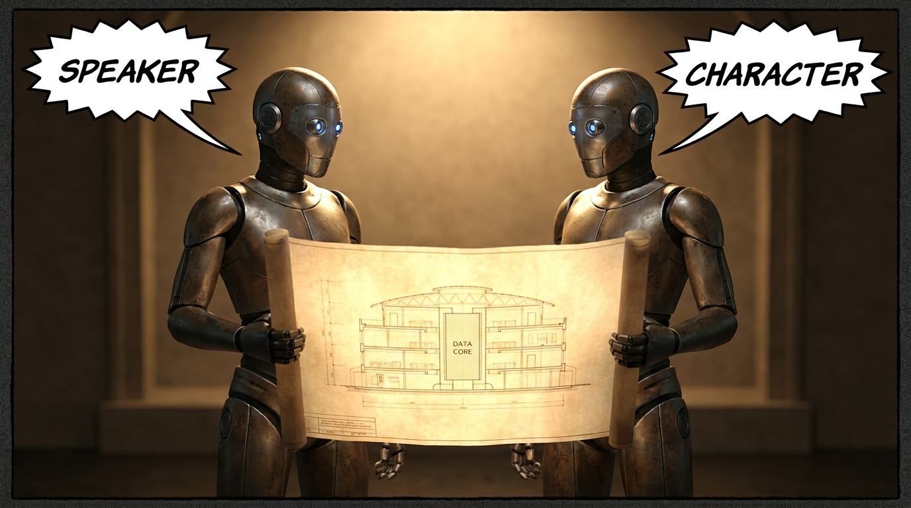
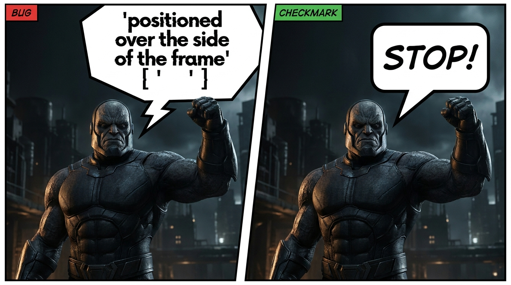
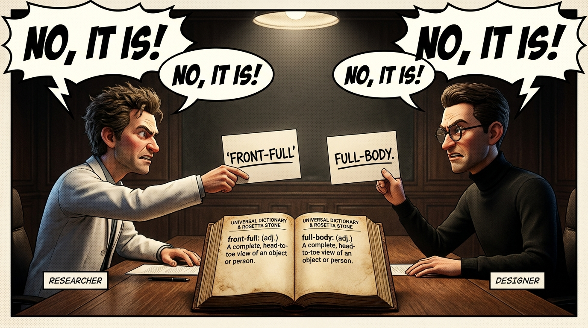
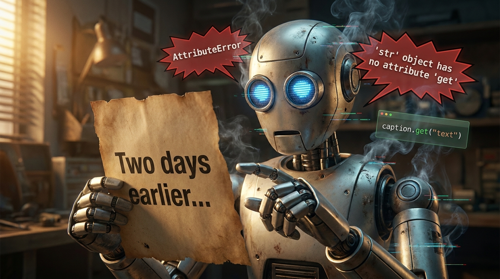
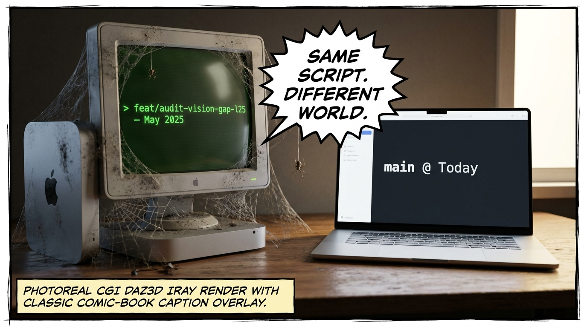
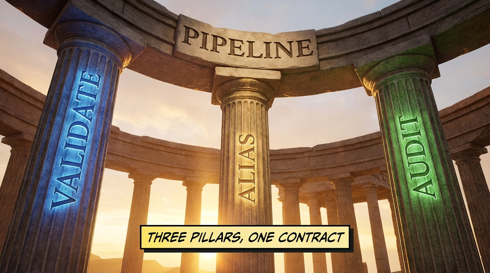
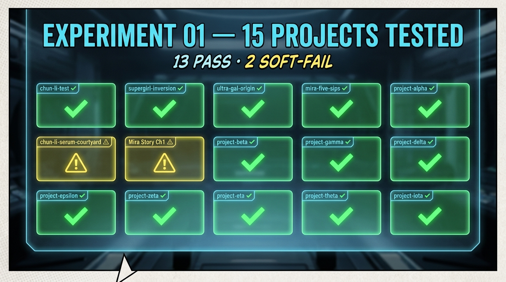

# When Layers Don't Speak the Same Language

*A schema-disagreement postmortem from the claude-comic-pipeline · 2026-05-22*



---

The comic-production pipeline produces 1300-character composed prompts to drive Nano Banana renders. For weeks, the prompts looked right and the panels came out wrong.

It wasn't the rules. It wasn't the model. It was that each layer of the pipeline had developed its own dialect for the same data — and nothing was checking that the dialects agreed.

## The diagnosis

The pipeline has four stages, each implemented over several months:

1. **`script-breakdown`** — prose script → `shotlist.json`
2. **`next_panel.py`** — shotlist → composed prompt + reference attachments
3. **renderer** — prompt → image (via Higgsfield or Flow)
4. **`audit_panels.py`** — image → per-rule pass/fail verdict

Each stage was the contract boundary between two sub-agents working in different file regions. Each developed its own vocabulary for the same data. The contract between layers was never formalized — it was implied by code on both sides that happened to agree, until it didn't.

## The four bugs

### 1. Every speech bubble had no speaker



`next_panel.py` keyed dialogue lookups off `dialogue[].speaker`. The shotlist authoring path wrote them as `dialogue[].character`. Three call sites; three blank attributions per panel. The L4 lettering block fired on every panel, completed without error, and produced bubble text that read:

```
positioned over ''s side of the frame
```

— an empty string between quote marks. The bubble rendered. The tail pointed at the right character. The attribution was just... missing.

Fix: `d.get("speaker") or d.get("character")` in all three sites. Three lines.

### 2. View-aware chaining failed on every panel



The composer's L1.5 logic picks a chain anchor — a prior accepted panel whose camera view is compatible with the current one. The compatibility table is keyed `front-full`, `3q-full`, `splash`, `mcu`. The lookup was driven off the first comma-token of the shotlist's `camera` field, which authoring stored as `full-body`, `three-quarter, hero pose`, `wide splash`.

Two vocabularies for the same concept. The lookup missed on every panel. Every panel fell back to the canonical face card + verbal carry-forward — strictly worse than chaining off a prior image.

Verified: 7 of 7 chaining defects on `chun-li-test` came from this miss. Fix: a `_VIEW_ALIASES` normalizer that maps the prose tokens to the canonical keys, applied at both ends of the lookup. 6 of 7 defects gone after the fix; the seventh is an `ecu-region` panel that legitimately has no eligible prior (by design).

### 3. The lettering block crashed on string-shaped captions



Older shotlists carried caption text as bare strings. Newer ones as dicts: `{"position": "top-left", "text": "..."}`. The L19 lettering block always called `caption.get("text")`. The first string-shaped caption raised `AttributeError: 'str' object has no attribute 'get'`. `compose_prompt()` died. `build_plan()` died. `write_ledger.py` died. The chain failed silently downstream of a successful panel pick.

Fix: coerce strings to dicts at the top of the loop (`_as_obj("foo")` returns `{"text": "foo"}`). Tolerant of both shotlist shapes; no data rewrite required.

### 4. The Mac Mini was running months-old code



Subtler. The Mac Mini's working tree had drifted to `feat/audit-vision-gap-l25` — branched off before phases 1-7, the silhouette purge, L11 breast-scale, the L19 rewrite, and L29 through L32. The `next_panel.py` on disk was the 1199-line pre-refactor monolith. None of the recent rules or scripts existed on the machine.

Anyone debugging from the CHANGELOG (which describes `main`) was reasoning about deployed code that wasn't actually deployed. Same script name. Different world.

Recovered by pushing the unique L25 commits for safekeeping, then fast-forwarding to `origin/main` (30 commits).

## The fix pattern



Every bug had the same shape: **two layers disagreeing about how to represent the same thing, with nothing validating the contract between them.**

Three new pieces of infrastructure address it:

- **`validate_shotlist.py`** — a write-time gate at the script-breakdown stage. Asserts the contract that the pipeline silently assumed: known camera tokens, int-typed `tier`, on-screen dialogue carries a speaker, etc. Catches drift at authoring time so it never reaches the composer.
- **`_VIEW_ALIASES`** — explicit normalization table for legitimate dialect variance. The fix isn't to force authoring to use one vocabulary; the fix is to bridge them.
- **`audit_panels.py`** — vision-audit dispatcher. Runs each rendered image past its applicable rules' vision rubrics and writes the verdict back to `checks.json`. Closes the post-render loop.

## The smoke test



Once the pipeline was stable on `chun-li-test`, the next question was: does it generalize? Fifteen real comic projects on disk, each potentially with its own dialect.

Ran `next_panel.py --as-json` against all of them:

- **15 / 15 exit 0 with well-formed JSON.** The fixes don't crash anywhere. The composition layer is stable at the syntax level.
- **13 / 15 produce semantically correct output.** Two projects (`chun-li-serum-courtyard`, `Mira's Story — Ch1 Rooftop Pool`) silently report `"All panels accepted. Nothing pending."` despite holding 12 and 24 unstarted panels.

### The next bug, one container layer up

![Container shape — flat panels[] vs pages[].panels[]](assets/08-container-shape.png)

The two failures share a single root cause. Thirteen of the projects nest panels: `pages: [{panels: [...]}]`. The two failing ones use a flat root: `panels: [...]`. The composer's panel walker only knows the nested shape. Flat shotlists walk to zero candidates and trigger the cheerful "all done" message.

Same camouflage as the field-level bugs: doesn't crash, JSON is valid, downstream renderer happy. Only a careful comparison between input and output surfaces it.

The next fix is already named: `experiment/02-container-shape-adapter`. Two projects unblocked in one change.

## The pattern, repeated

The reason these bugs were easy to introduce and hard to find is that they all had the same camouflage: **the pipeline did not crash**. The script exited 0. The JSON was valid. The downstream renderer happily rendered. A reviewer reading the prompt couldn't tell anything was wrong. Only a careful comparison between prompt and source shotlist revealed that, say, the speaker name had silently dropped.

The general fix is contract validation between layers. Specifically:

- A validator that fails loudly on schema drift *(added)*
- An alias table for legitimate dialect variance *(added)*
- A loud-failure mode when the panel walker yields zero candidates *(recommended next)*
- A container-shape adapter for the flat-`panels` projects *(recommended next)*

Magnamus's diagnostic frame — *not "is the rule system too strict" but "where are the layers disagreeing about vocabulary or convention"* — turned out to be the right axis. Fourteen of fifteen rules pass clean on real panels. The failures are all plumbing.

Plumbing fixes don't get the same glamor as rule design. But they were the difference here.

---

*Commit: [`a64bed2`](https://github.com/growcomics/claude-comic-pipeline/commit/a64bed2) · Branch: [`experiment/01-generalization-smoke-test`](https://github.com/growcomics/claude-comic-pipeline/tree/experiment/01-generalization-smoke-test) · 15 projects tested, 15 hard-pass, 13 semantic-pass, 2 soft-fails routed to `experiment/02-container-shape-adapter`.*
