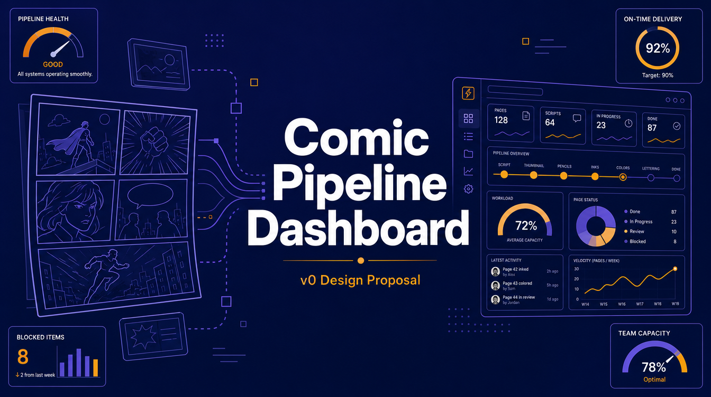
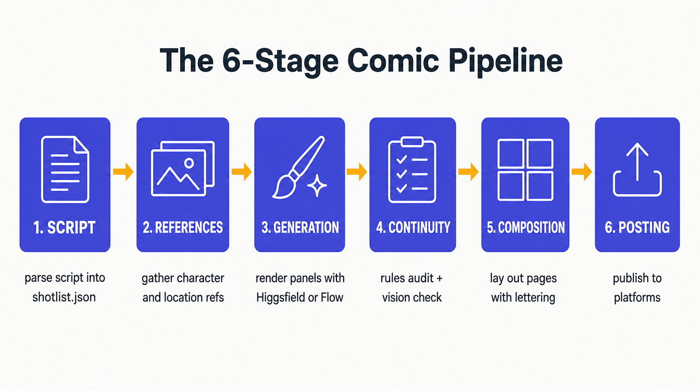
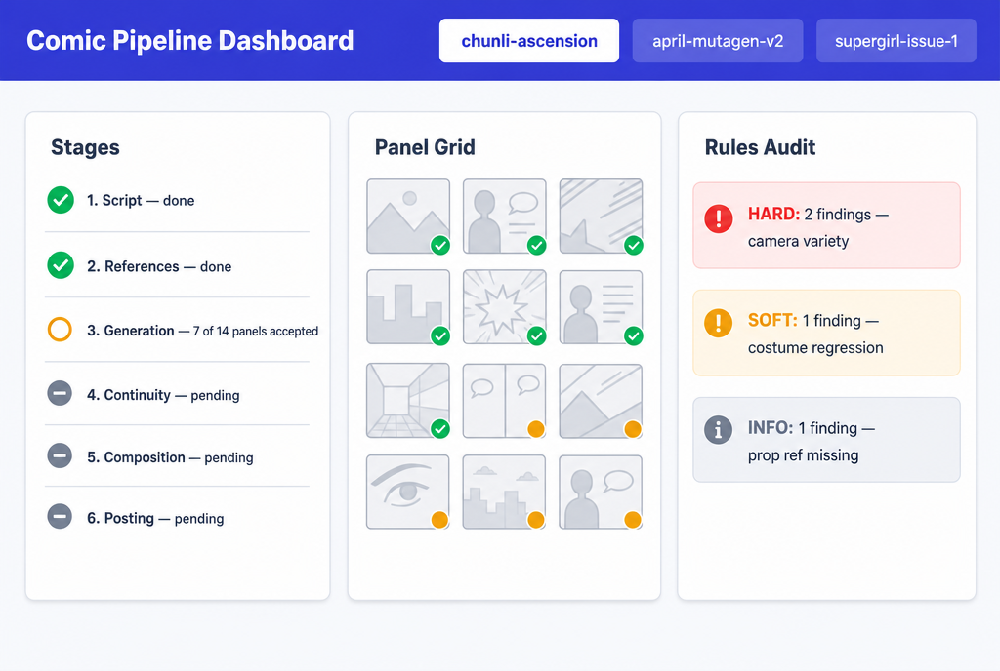
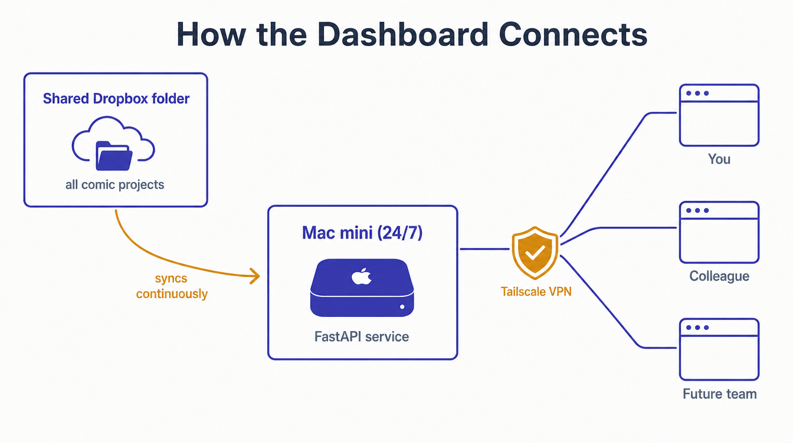

# Comic Pipeline Dashboard — v0 Design Proposal



> **Status:** Design draft. Read this, push back on anything that feels off, and once we're aligned I'll open a fresh implementation session to build it.

---

## Why this exists

Right now, when a generation run is going (Higgsfield, Flow, or `next_panel.py` chugging through panels), the only way to see what's happening is to:

- Open the project folder in Finder
- Read `STATUS.md` in a markdown viewer
- Tail logs in a terminal
- Open the three `STATUS-*.png` composite boards individually

That works for one person on one project. It does **not** work for:

- **You and your colleague** wanting to see the same view from different machines.
- **Long-running generation** where you'd like to glance at progress from another room — or your phone.
- **Multiple projects in flight** — there's no way to compare or switch between comics.
- **Catching rules-audit findings before they compound** — they live in markdown reports you have to remember to open.

The dashboard is a small web app that surfaces the state the pipeline is already producing, in one place, from any browser.

---

## What's already there (this is the important part)

The pipeline emits structured data at every stage. The dashboard doesn't re-derive any of it — it just displays it.



For each stage above, an existing artifact tells the dashboard exactly what state things are in:

| Stage | Source the dashboard reads |
|---|---|
| 1. Script | `shotlist.json` at project root |
| 2. References | typed folders under `references/{characters,locations,props,style}/` |
| 3. Generation | `pages/panels/panel-<id>/` folders with `vN.png` + `_accepted.txt` |
| 4. Continuity | `rules_audit.py --json` output |
| 5. Composition | `pages/page-NN.png` |
| 6. Posting | `posting/posted.json` |

This matters because there is **zero new state** to maintain. The dashboard is a view, not a database. If something looks wrong in the dashboard, fix the underlying script — not the dashboard.

---

## The v0 user interface

Three widgets. Multi-project tabs. Read-only.



### Project tabs (top)
One tab per comic project found on disk. Click to switch active project — the three widgets re-render for the selected comic. The active tab is highlighted.

### Widget 1 — Stages
The 6-stage table you already know from `build-comic.md`. Each row shows status (done / in-progress / pending / partial) and a one-line summary like *"7/14 panels accepted"* or *"2/4 cast missing refs"*. Identical logic to `comic-status-board/generate_status.py`, just rendered as HTML instead of markdown.

### Widget 2 — Panel grid
Every panel from `shotlist.json` as a small thumbnail in story order. Each thumbnail shows the accepted version if there is one, or the latest variant otherwise, with an overlay indicating:

- ✓ green if accepted
- amber dot if in progress (variants exist but no `_accepted.txt`)
- gray placeholder if not yet generated

Click a thumbnail → modal with all `vN.png` versions side-by-side, plus any `vN.notes.md` notes for context on why a version was rejected/accepted.

### Widget 3 — Rules audit
Calls `rules_audit.py --json` against the project. Groups findings by severity:

- 🛑 **HARD** (red) — gates that block the next stage (camera variety, transformation beats, missing metadata)
- ⚠️ **SOFT** (amber) — warnings worth checking (costume drift, missing ECU shot, prop refs)
- ℹ️ **INFO** (gray) — informational

Each row is expandable for the full message + suggestion. Click filters by page/panel.

---

## How it's hosted



Three pieces, all already paid for or free:

### 1. Shared Google Drive folder
All comic projects live in **one shared Google Drive folder** synced to every contributor's machine via the "Google Drive for desktop" app. The Mac mini has it synced too. Edit a file on one device → propagates everywhere within seconds. No new infrastructure to set up.

Two requirements:

- **Mirror mode, not Stream.** Drive preferences → Google Drive → "Mirror files." Every file lives on local disk on each machine. Stream mode would force on-demand cloud downloads mid-generation, which stalls panel renders.
- **Code stays in git, outputs live in Drive.** The repo (`~/Documents/claude-comic-pipeline/`) is a regular local git clone on each machine — never inside the sync folder, because `.git/` churn breaks cloud sync. Project outputs (refs, panels, lettered pages) live in the Drive folder, exposed to the repo via a symlink: `~/Documents/claude-comic-pipeline/projects/` → `~/Library/CloudStorage/GoogleDrive-<account>/My Drive/claude-comic-projects/`. The dashboard reads from that symlinked path; both machines see the same files; commits never accidentally include synced output.

### 2. Mac mini (always-on)
The dashboard service (FastAPI in Python) runs on your Mac mini as a `launchd` background service. Survives reboots. Reads project state from the synced Google Drive folder (via the `projects/` symlink). No data leaves the mini.

### 3. Tailscale VPN
Free for up to 3 users. Zero-config: install the Tailscale app on each device, log in with the same account, and every device gets a private hostname like `comics.your-tailnet.ts.net`. Open that URL in a browser → instant dashboard. No port forwarding, no router config, no domain, no public exposure.

> **Alternative**: if your colleague would rather not install Tailscale, swap it for **Cloudflare Tunnel** — a free public URL that proxies to the mini without any inbound network changes. Slightly less private but works from any browser, on any network, with zero install.

---

## Tech stack

Intentionally boring. The whole point is to read files, not to be impressive.

- **Python + FastAPI** — same language as the pipeline scripts; one `server.py` file
- **Jinja2 templates** — `index.html` plus three partials (one per widget)
- **HTMX** — gives live partial updates with no JavaScript framework. Each widget self-refreshes every 10 seconds by re-requesting its partial endpoint
- **Pillow** — already in the pipeline for thumbnail generation
- **launchctl** — Apple's built-in service runner; one `.plist` to start on boot

Total code estimate: ~400 lines of Python + ~200 lines of HTML + ~50 lines of CSS.

---

## What's in v0 vs deferred

### Ships in v0
- Multi-project tabs
- Stages widget
- Panel grid widget
- Rules audit widget
- Auto-poll every 10s
- Mac mini deployment + Tailscale access

### Deferred to v1 (after v0 lands and we've used it for a week)
- **Action buttons** — "regenerate this panel", "accept variant", "run next_panel.py", "rerun rules audit". Needs simple auth and per-project locking to be safe with multiple users.
- **Next-panel plan card** — `next_panel.py --as-json` rendered as a "do this next" panel. Most useful when actively driving the pipeline.
- **References inventory grid** — what's gathered vs what shotlist expects.
- **L-lesson sidebar** — L1–L24 catalog with "fired on this project" indicators.
- **Push updates via Server-Sent Events** — replaces polling for lower latency. Only matters once you stare at the dashboard during long runs.
- **Auth (basic auth / OAuth / GitHub login)** — needed before opening to non-Tailscale users.
- **Live vision audit preview** — needs an LLM call; separate effort entirely.

### Never
- **Re-deriving state.** The pipeline scripts are the source of truth. If the dashboard ever needs new state, that state goes into a pipeline script first, then the dashboard reads it.

---

## Estimated effort

Roughly **~12 focused hours** end-to-end for v0:

| Block | Hours |
|---|---|
| Repo scaffold (`dashboard/` directory, `server.py`, basic FastAPI app) | 1 |
| Project discovery (walk shared root, surface tabs) | 1 |
| Stages widget (re-use `generate_status.py` logic, render HTML) | 2 |
| Panel grid widget (thumbnail rendering, modal for versions) | 3 |
| Rules audit widget (shell out to `rules_audit.py --json`, render groups) | 2 |
| Styling pass (clean indigo + amber + slate palette, like the mockup above) | 1 |
| Mac mini deployment (launchd plist, Tailscale config, smoke test from colleague's machine) | 2 |
| **Total** | **~12** |

That's one focused day, or two casual half-days.

---

## Where the code will live

A new top-level directory in `claude-comic-pipeline`:

```
dashboard/
  server.py
  templates/
    index.html
    stages.html
    panels.html
    findings.html
  static/
    style.css
  deploy/
    com.growcomics.dashboard.plist   # launchd service
    README.md                         # setup steps for Mac mini + Tailscale
```

It is **not** a skill (skills are invoked by Claude agents; this is a long-running service).

---

## Open questions for you

1. **Confirm v0 scope.** Three widgets, multi-project tabs, read-only, Mac mini + Google Drive + Tailscale. Anything to cut? Anything to add?
2. **Pick the access route.** Tailscale (recommended) or Cloudflare Tunnel — see *How it's hosted* above.

(Resolved: shared file space is **Google Drive**, mirror mode, with the `projects/` symlink pattern described above.)

Once those two are locked, the next session is a clean implementation run with no design discussion — roughly half a day of focused work, after which you and your colleague have a live dashboard at `https://comics.your-tailnet.ts.net`.
