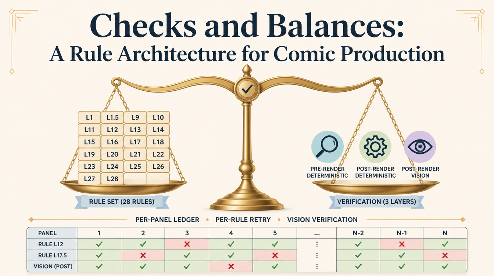
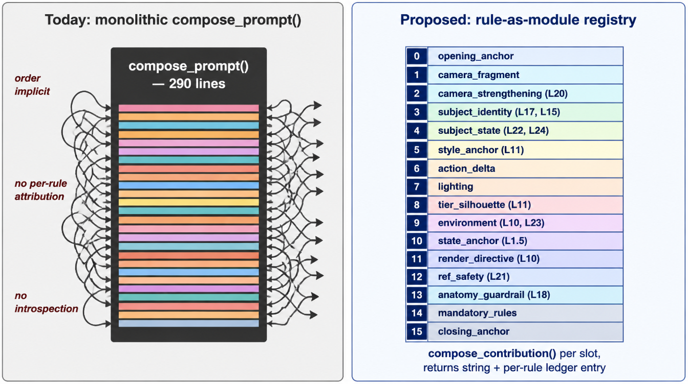
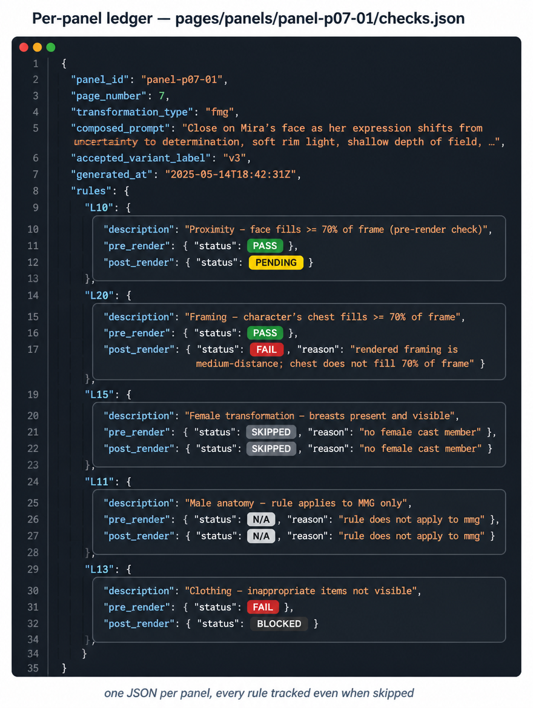
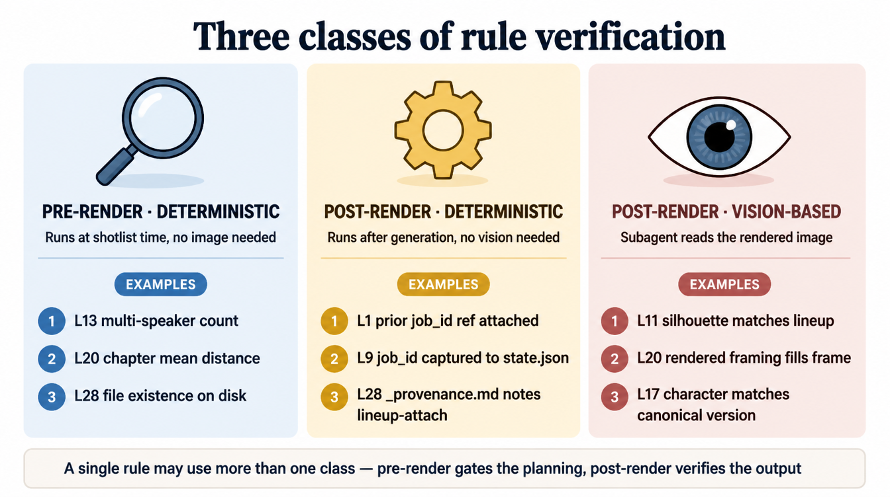
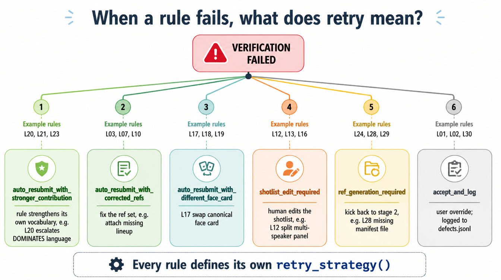
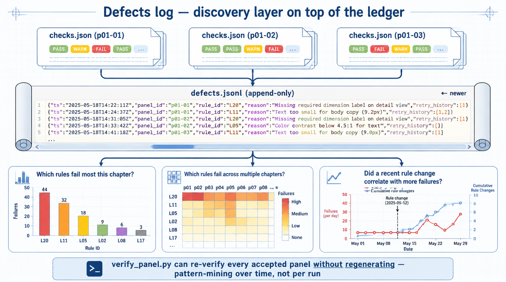
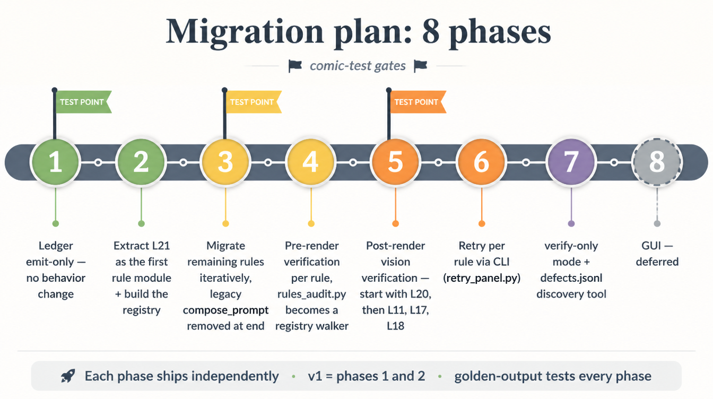

# Checks and Balances: A Rule Architecture for Comic Production

**2026-05-16** · A design pass on the most load-bearing piece of the pipeline — how rules get enforced — and why we're tearing the monolith down and replacing it with a per-rule, per-panel ledger that can be audited, retried, and mined for defects across every chapter we've ever shipped.



## Why this isn't optional anymore

The pipeline has 28 active L-rules. They cover everything from "chain progressive panels" (L1) to "suppress in-scene rendering of reference images" (L21) to "reference completeness is mandatory" (L28). Each rule was discovered the same way: a real comic came back wrong, we found out why, we wrote the rule down, and then we wired enforcement somewhere.

The "somewhere" is the problem.

Most of the enforcement lives inside one function called `compose_prompt()` in [`next_panel.py`](../../skills/comic-production/scripts/next_panel.py). That function is now 290 lines long and growing. Every rule has its own block of code in there — `_body_region_camera_directive` for L20, `_female_beauty_anchor_line` for L15, `_canonical_character_directive` for L17, an inline L21 exclusion clause, the L11 tier-silhouette block, and on and on. The function returns a single concatenated string. There is no way, after the fact, to ask "did L20 fire on this panel?" because the function doesn't track which rules contributed what. The contributions get glued into a string, the string gets sent to the model, and the per-rule attribution is gone.

The other place rules live is `rules_audit.py`, which runs at script-breakdown time and at act boundaries. It produces a flat list of `Finding` objects with a severity and a category. It never sees the rendered image. So if L20 says "the chest beat needs to fill 70% of the frame" and the panel comes back with a medium-distance shot of the whole torso, the audit doesn't catch it — the audit gates the *shotlist*, not the *render*.

So today: per-rule visibility is zero. Per-panel rule status is zero. Retry-per-rule is zero. If a panel comes back wrong, the agent driving generation looks at the whole thing, decides "this is wrong" or "this is fine," and either regenerates the entire panel or moves on. No introspection into which specific rule failed, no targeted fix, no record of the failure to mine across runs.

## What we want

A checks-and-balances architecture. The phrase is the user's; it's exactly the right shape:

- The prompt is built **one rule at a time**, with each rule a discrete unit.
- Each rule has **its own dedicated check** — deterministic where possible, vision-based where necessary.
- The system **acknowledges each rule's state** in a per-panel ledger so it's visible, auditable, retryable.
- A future GUI surfaces **green/red pass/fail markers per panel per rule**, with a retry button on each.

The deferred GUI is the visible part of this; the per-panel ledger is the design contract that makes the GUI possible.

## Today's monolith vs. tomorrow's modules



`compose_prompt()` today is one big box with 20+ rule contributions intermingled inside. The composition order is implicit — render anchor before camera fragment before body-region directive before subjects before canonical character before glamour before hair state before accessories before female-anatomy anchor before cartoony FMG style anchor before action delta before lighting before tier silhouette before environment before state anchor before render directive before ref-exclusion before anatomy guardrail before mandatory rules before closing CGI anchor. That order is load-bearing — if you slot the body-region directive after the action delta, the model commits to a wider framing before reading the "EXTREME CLOSE-UP" override. But that ordering is encoded only in the literal source-code order of `parts.append()` calls. There's no spec for it anywhere.

The refactor moves each rule into its own module at `skills/comic-production/rules/<rule_id>_<slug>.py`. The module exposes a small, uniform interface:

```python
class Rule:
    id: str                                # "L10", "L11", "L20"
    title: str                             # one-line human-readable
    slot: str | list[str]                  # which composition slot(s) it owns
    severity: Literal["hard", "soft"]
    applicable_transformations: set[str]   # {"fmg"} | {"*"} | {"fmg","mmg"}

    def should_apply(panel, ctx) -> bool: ...
    def compose_contribution(panel, ctx, slot) -> str | None: ...
    def verify_pre_render(panel, plan, ctx) -> Verification: ...
    def verify_post_render(panel, image_path, ctx) -> Verification: ...
    def retry_strategy(panel, ctx, failure) -> RetryAction: ...
```

The slot ordering — once implicit in source code — becomes an explicit table. There are 16 named slots from `0_opening_anchor` through `15_closing_anchor`. Each rule declares which slot it contributes to (some rules contribute to more than one). The registry walks slots in order; for each slot, every rule that owns that slot gets asked for its contribution; the contributions concatenate. The final prompt is identical to today's output once all rules are migrated — we'll prove this with byte-identical golden-output tests on every chapter we've ever shipped.

The new ingredient is the `applicable_transformations` field. We've been an FMG-first pipeline since day one, but the existing `production-config.json` already supports BE, glute, MMG, and mixed projects. The new architecture bakes the genre awareness into the rule modules: L11's cartoony-FMG anchor ships with `applicable_transformations = {"fmg"}` so it gets skipped on an MMG project, and the assistant can ship an `l11_mmg_silhouette.py` module later without surgery on the FMG one. **We're building for FMG today; we're not making MMG harder than FMG was.**

## The per-panel ledger



Every accepted panel gets a sibling `checks.json` file next to its `v*.png` variants. Schema sketch:

```json
{
  "schema_version": 1,
  "panel_id": "p07-01",
  "transformation_type": "fmg",
  "composed_prompt": "DAZ Studio Iray render ...",
  "accepted_variant_label": "v3",
  "rules": {
    "L10": { "applied": true, "pre_render": {"status": "pass"},
             "post_render": {"status": "pending"} },
    "L20": { "applied": true, "pre_render": {"status": "pass"},
             "post_render": {"status": "fail",
               "reason": "rendered framing is medium-distance; chest does not fill 70%"} },
    "L15": { "applied": false, "reason": "skipped — no female cast member" },
    "L11": { "applied": false, "reason": "n/a — applicable_transformations={'fmg'} but project='mmg'" },
    "L13": { "applied": true, "pre_render": {"status": "fail", "reason": "..."},
             "post_render": {"status": "blocked"} }
  }
}
```

The ledger tracks **every rule, including the ones that didn't fire** — the GUI needs the whole row, and "rule was skipped because X" is information the user wants to see, not invisible omission. Status values include `pass`, `fail`, `pending`, `skipped`, `blocked`, `n/a`, and `refused` (the last one for platform-level safety filter blocks, since L2's Higgsfield NSFW rejection doesn't fit the per-prompt model the way the other rules do).

One important design call: **the ledger tracks the accepted variant only**, not all four variants the runner generates. Vision audits run only against the picked image. Cheaper, but more importantly: it focuses the ledger on what shipped. The variant picker's job is to pick; the ledger's job is to record what got picked and how it scored.

## Three classes of verification



Not every rule needs the same kind of check. Three classes cover the field:

1. **Pre-render deterministic.** Runs at shotlist time, no image needed. This is where `rules_audit.py` already lives — L13's "count dialogue speakers," L20's "chapter mean camera distance," L28's "this file exists on disk." The bulk of the existing audit migrates here, just re-keyed per rule instead of as a flat findings list.

2. **Post-render deterministic.** Runs after the image is generated, but doesn't need to look at pixels — just files and state. L1 ("was the prior panel's job_id passed as a reference?") checks the generation request log. L9 ("was the job_id captured?") checks `state.json`. L28's lineup-attached-at-generation-time check reads the per-file `_provenance.md`. Cheap to run, valuable because it catches workflow regressions that don't show up in the pixels.

3. **Post-render vision-based.** Needs a subagent to read the rendered image. L11 (does the silhouette match the lineup figure?). L17 (does the character look canonical?). L20 (does the rendered framing actually fill the frame the way the camera label declares?). L18 (is the anatomy coherent?). L21 (was the face card rendered as a physical scene object inside the panel?). L22 (does the hair match the declared state?). L25 (is the previously-revealed body region still exposed?). Six to ten rules need this.

For the vision pass, **a fresh subagent per panel per rule, with a single-purpose rubric**. The May 14 audit memo learned this the hard way: an inline audit at the end of a generation run looked at 14 panels of Chun Li and said "all good," but a user spotted 6 distinct issues across 4 of them. Inline audits drift toward "looks fine." A subagent that gets only the canonical refs, the rendered image, and the rubric for one specific rule is more rigorous. It costs more API spend, but the user has stated cost isn't the constraint here, so we run vision verification on every applicable vision-bearing rule on every accepted panel.

## Retry, per rule



Today's retry is "regenerate the panel." That's a blunt instrument. What we want is a per-rule retry that says: "this specific rule failed for this specific reason, here's what you do to fix it."

Six retry kinds cover the rules:

- **`auto_resubmit_with_stronger_contribution`** — the rule strengthens its own vocabulary and the panel re-runs. L20 escalates "DOMINATES" language one more notch; L11 doubles down on "cartoony hyper-FMG, NOT athletic, NOT realistic, NOT fitness-model"; L24 expands the accessory negation list. Most rules.
- **`auto_resubmit_with_corrected_refs`** — fix the ref set, not the prompt. L1 reattaches the missing prior-panel ref; L11 reattaches a dropped lineup.
- **`auto_resubmit_with_different_face_card`** — L17 swaps the canonical face card for an alternate canon-sourced ref before resubmit.
- **`shotlist_edit_required`** — human in the loop. L12 wants the dialogue panel split. L13 wants the multi-speaker beat broken into multiple panels. L26 wants the garment family named.
- **`ref_generation_required`** — kick back to stage 2. L16 missing view ref, L28 missing manifest file. The pipeline can't retry a panel until the asset exists.
- **`accept_and_log`** — user override. Some rules legitimately have false-positive failures (L18 anatomy on an intentionally surreal pose, L20 wide framing on a beat that doubles as an establishing shot). The override is logged so it shows up in the defects record.

Every rule defines its own `retry_strategy()`. The future GUI's retry button calls that strategy. Even before the GUI ships, a CLI tool (`retry_panel.py <panel_id> --rule L20`) exposes the same surface for smoke-testing.

## The defects log



The per-panel ledger answers "what happened on this panel?" The next question is "what happened across the chapter / the project / every chapter we've ever shipped?" That's what the **defects log** is for.

Every time a verification fails, the system writes a row to `<project_root>/defects.jsonl`. One JSON object per line: timestamp, panel_id, rule_id, severity, reason, image_path, retry history. Append-only — no rewriting, no deduplication. The log is the audit trail.

The value of the log is in the discovery process built on top. Question one: "Which rules fail most in this chapter?" — a bar chart over the chapter's rows. Question two: "Which rules fail across multiple chapters?" — a heatmap with rules on one axis and chapters on the other. Question three (the most interesting): "Did a recent rule change correlate with more failures?" — track failure rate before and after a vocabulary change to a rule.

The third question is why we're investing in this at all. The pipeline has been growing rules organically for months. The April analysis (L20 was discovered by counting cameras across a hand-made April vs. an AI-generated April) is exactly the kind of observation that becomes a rule. Without a defects log we have to find these patterns by re-reading every chapter by eye. With a defects log, the patterns surface from data, and the rules-engineering process becomes data-driven instead of vibe-driven.

A `verify_panel.py` CLI re-runs all checks (pre- and post-render) against an existing accepted panel without regenerating. Useful for two things: (1) when a rule's verification logic changes, re-run on every accepted panel in past chapters to see which retroactively fail; (2) point at every accepted panel in every project, dump everything into `defects.jsonl`, and mine the aggregate. The second use is open-ended — we won't know what's in there until we look — but the structure means we *can* look.

## The migration plan



We ship this incrementally. Eight phases, each ships independently. v1 is phases 1 and 2 — enough to validate the ledger schema and prove the registry pattern. Each phase has a golden-output test gate; we don't move forward until the output is byte-identical to what the previous architecture produced.

1. **Ledger emit-only.** `compose_prompt()` unchanged. Add `write_checks_ledger()` as a side output that infers per-rule application from the existing helper invocations. Zero behavior change to the prompt itself.
2. **Extract one rule.** L21 is the smallest — single clause inject when any ref attached. Build the `Rule` interface, the registry, migrate L21. `compose_prompt` becomes a facade for L21 + the existing helpers for every other rule. Golden-output test guarantees byte-identical prompt.
3. **Migrate remaining rules iteratively.** L18 next (always-emit, also small), then L20, L15, L17, L22, L23, L24, L11, L10. End of phase 3: `compose_prompt` is purely a registry walker; legacy path removed.
4. **Pre-render verification per rule.** Migrate the relevant `rules_audit.py` checks into rule modules. `rules_audit.py` becomes a registry walker over `verify_pre_render` returns. CLI output format preserved for backwards compatibility with the existing stage gates.
5. **Post-render vision verification.** Start with L20 (highest empirical-failure rate per the May-14 strengthening). Add L11, L17, L18 sequentially. The subagent invocation pattern is documented per rule.
6. **Retry per rule.** Implement `retry_strategy` per rule. Initially exposed via CLI (`retry_panel.py`) so it can be smoke-tested before any GUI exists.
7. **Verify-only mode + defects discovery.** Ship `verify_panel.py` and `discover_defects.py`.
8. **GUI.** Deferred. The per-panel ledger is the design contract; any GUI implementation reads the ledger and works.

Comic tests at the end of phases 1, 3, and 5 — these are the moments where the refactor either passes through unchanged or breaks something subtle. Test points first, ship after.

## What's at stake

The refactor risk on the generation step is the thing that keeps me up at night. `compose_prompt` is the load-bearing function — every comic depends on it. A bug means every panel for every project until detected. The mitigation is golden-output tests against the historical corpus (`comic-april-mutagen-v2`, `chun-li-ascension`, `chun-li-grok-validation`, `moving-experience-v2`); we don't ship a phase until its output is byte-identical against every chapter in that corpus.

The abstraction cost is real. A new lesson today = add a helper to `next_panel.py` + add a check to `rules_audit.py`. Two files. Under the new architecture: new module, register it, write tests for compose + pre_render + post_render + retry. Five times the surface area. The payoff is testability, visibility, and the defects-discovery process — but it's a cost the rule-author is going to feel every time a new L-number lands.

The biggest open risk isn't technical: it's that the per-rule retry assumes the system can identify which rule failed. When a tier-5 ECU comes back with male anatomy on a flat chest, that panel has failed L11 + L15 + the female-anatomy anchor + L18 simultaneously. The vision subagent picks whichever rule it was asked about and confirms fail; the ledger shows four reds; the retry fires the strongest rule's strategy. The defects log reflects the over-count, and the discovery process has to treat correlated rule failures across the same panel as evidence of the same underlying defect rather than four distinct ones. We'll deal with this in the discovery layer, not in the ledger itself.

## Next

Sign-off on the [design doc](../checks-and-balances-design.md) and we start with phase 1 — the ledger-emit-only side output. That phase changes nothing about generation, which is exactly why it's the right place to start. The design doc has the schema, the slot table, the per-rule worked examples, and the ratified answers to the six open questions that came back from the design pass. The blog you just read is the human-readable framing; the design doc is the spec.

The pipeline grew an enforcement model rule by rule for months. It worked, but it grew faster than its architecture. The refactor isn't a rewrite — it's catching up.

---

*Companion design doc: [`docs/checks-and-balances-design.md`](../checks-and-balances-design.md). For the canonical rule list, see [`skills/comic-production/references/lessons-learned.md`](../../skills/comic-production/references/lessons-learned.md); for plain-English explanations, see [`skills/comic-production/references/the-rules-explained.md`](../../skills/comic-production/references/the-rules-explained.md). Pipeline history is in [`CHANGELOG.md`](../../CHANGELOG.md).*
