# chun-li-test
_Last updated: 2026-05-22 03:04 UTC_

## Stages
- ✅ **Script breakdown** — shotlist.json — 10 pages, 1 cast, 1 locations
- ✅ **References** — 1/1 characters, 1/1 locations, 0/0 props
- ✅ **Generation** — 10/10 panels accepted
- ✅ **Continuity** — continuity-report.md present
- ⏳ **Composition** — -
- ⏳ **Posting** — -

## References

### Characters
- **chun-li**
  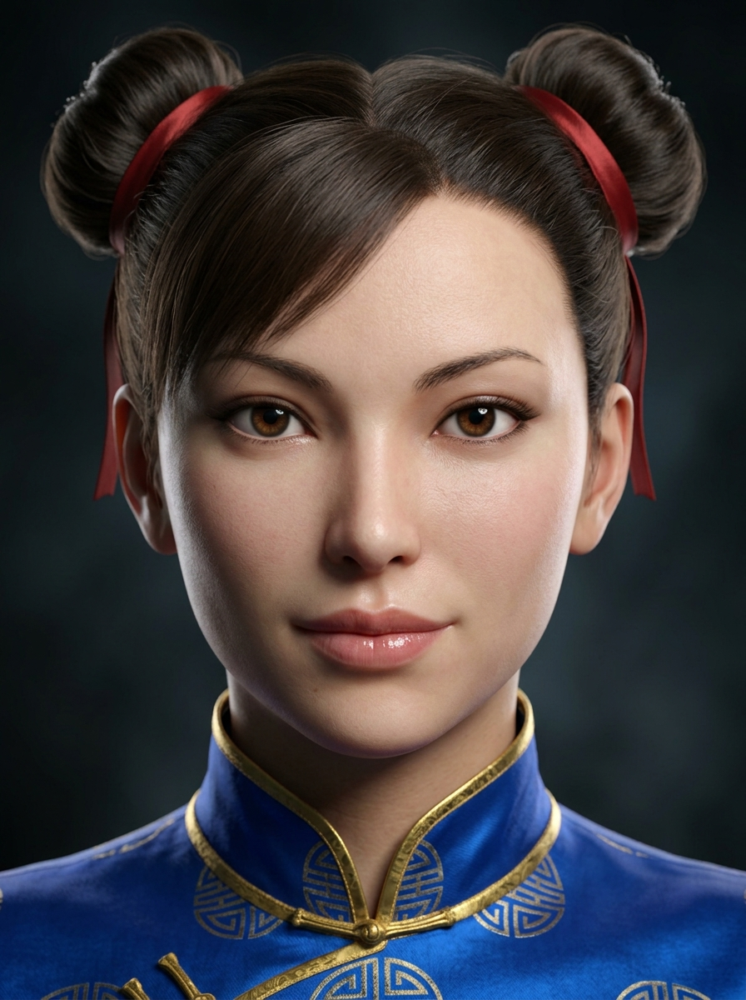 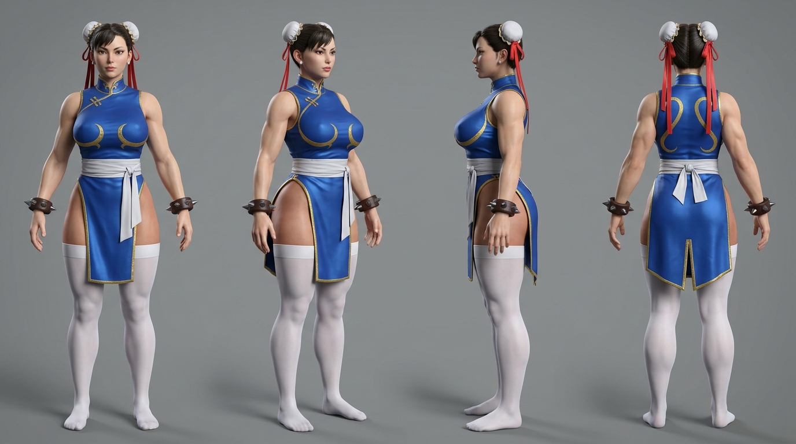 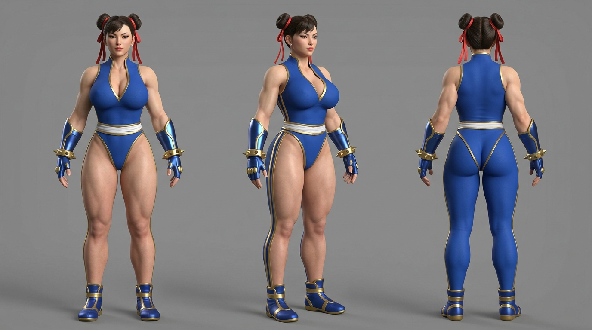

### Locations
- **bisons-lair**
  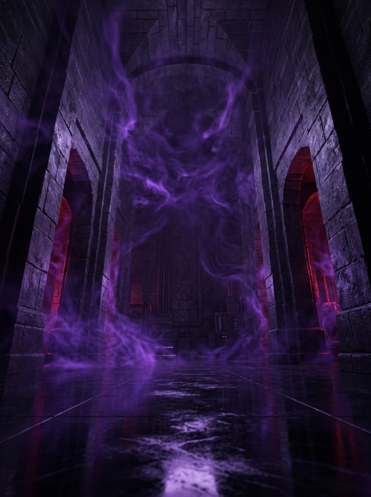

## Generation Progress

### ✅ p01-01 — accepted **v1 (flat layout)** (1 attempt)
- `p01-01`
  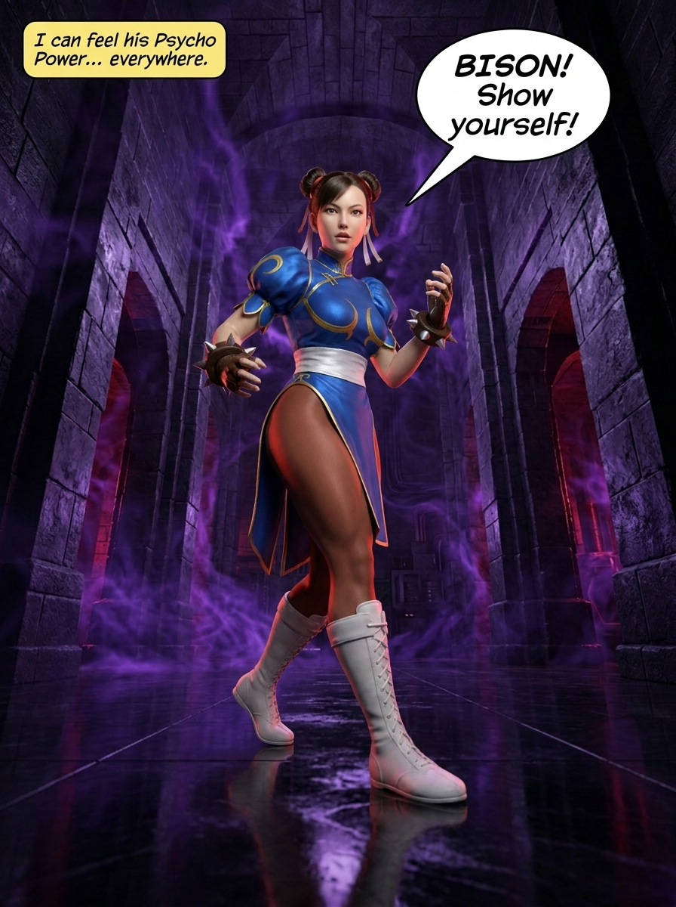

### ✅ p02-01 — accepted **v1 (flat layout)** (1 attempt)
- `p02-01`
  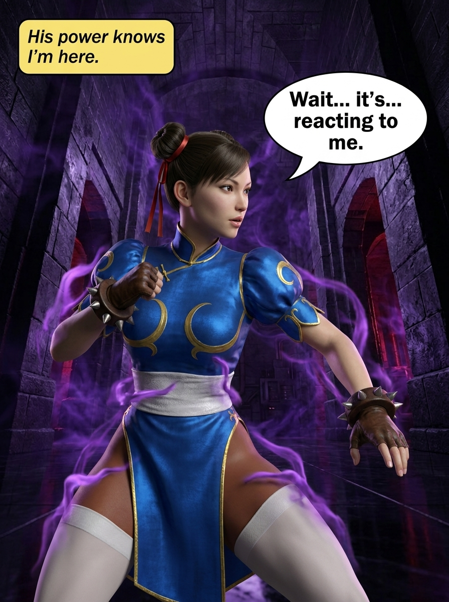

### ✅ p03-01 — accepted **v1 (flat layout)** (1 attempt)
- `p03-01`
  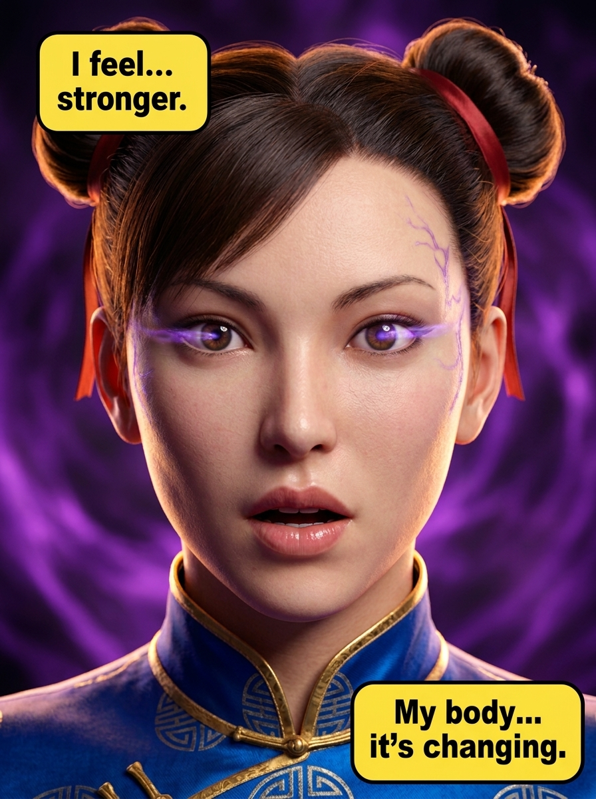

### ✅ p04-01 — accepted **v1 (flat layout)** (1 attempt)
- `p04-01`
  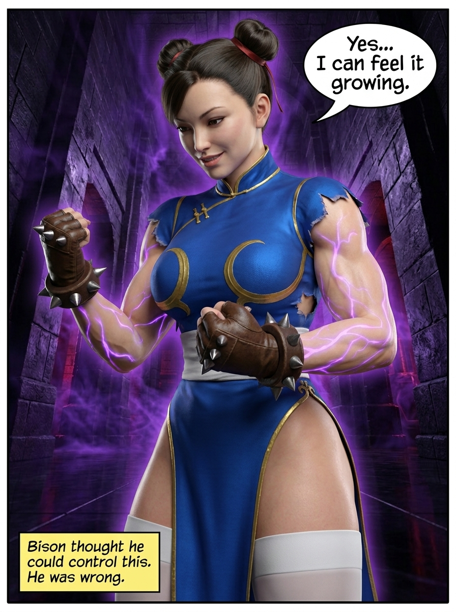

### ✅ p05-01 — accepted **v1 (flat layout)** (1 attempt)
- `p05-01`
  

### ✅ p06-01 — accepted **v1 (flat layout)** (1 attempt)
- `p06-01`
  

### ✅ p07-01 — accepted **v1 (flat layout)** (1 attempt)
- `p07-01`
  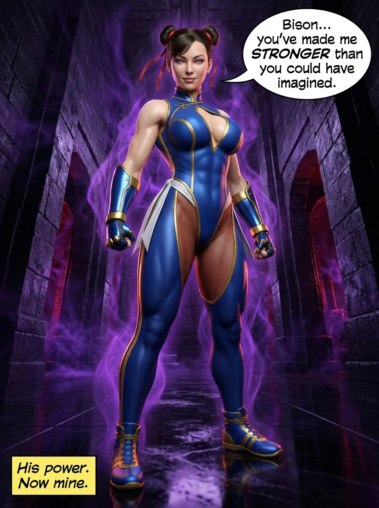

### ✅ p08-01 — accepted **v1 (flat layout)** (1 attempt)
- `p08-01`
  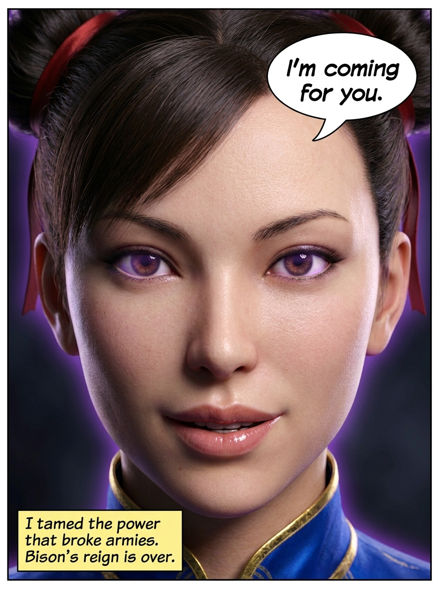

### ✅ p09-01 — accepted **v1 (flat layout)** (1 attempt)
- `p09-01`
  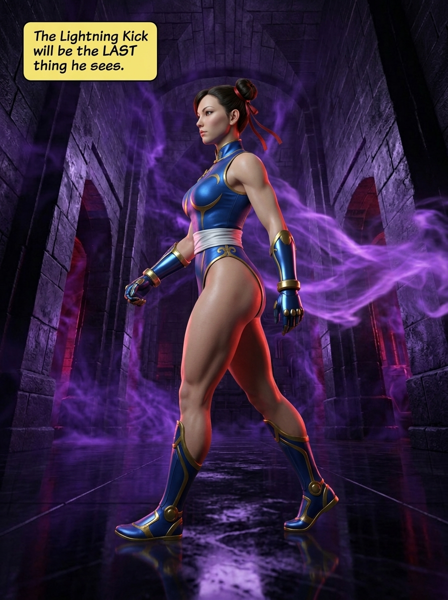

### ✅ p10-01 — accepted **v1 (flat layout)** (1 attempt)
- `p10-01`
  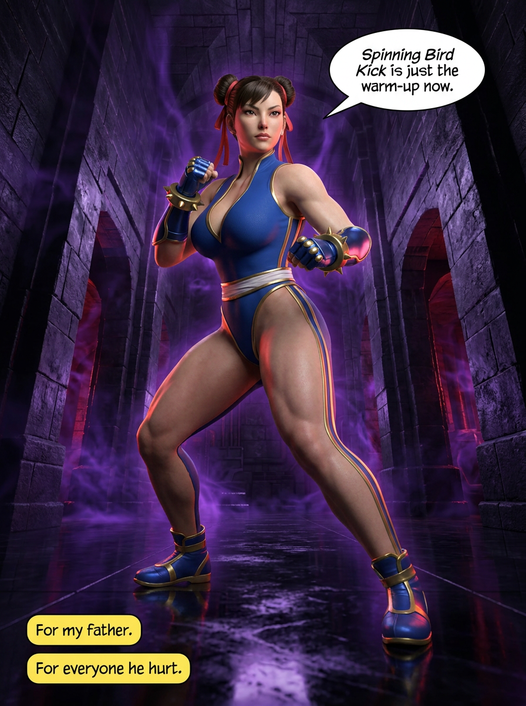

## Composition
_No pages composed yet._

## Posting
_Not started._
