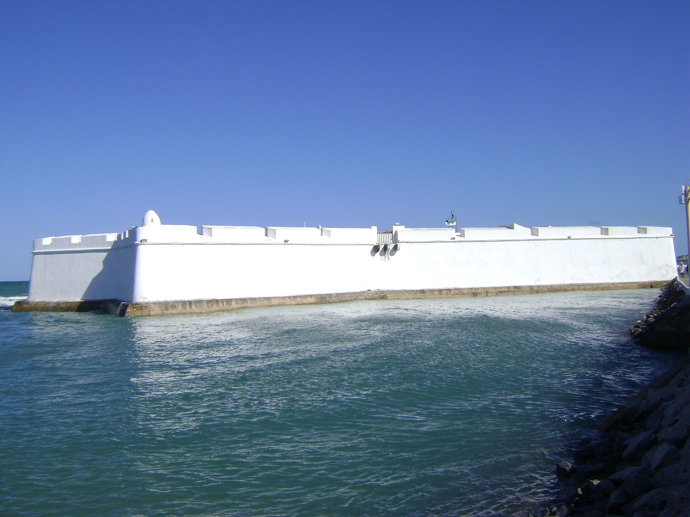
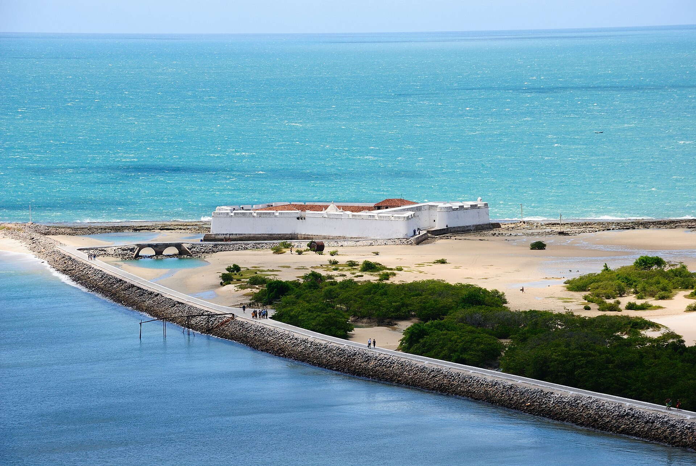
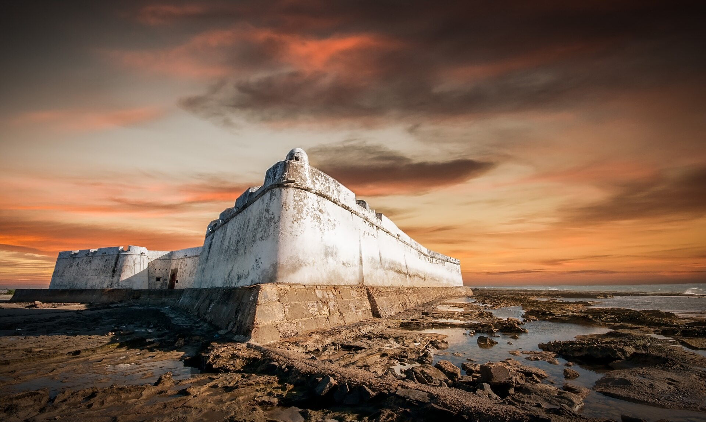
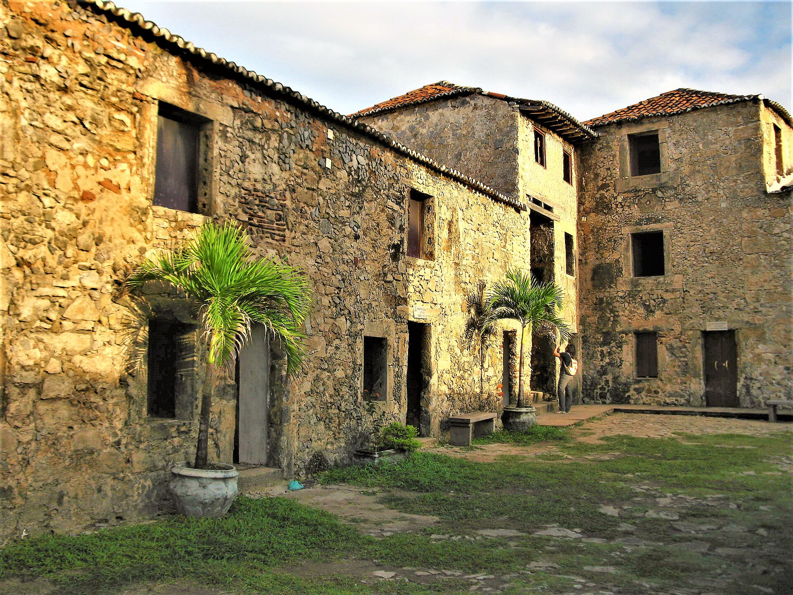
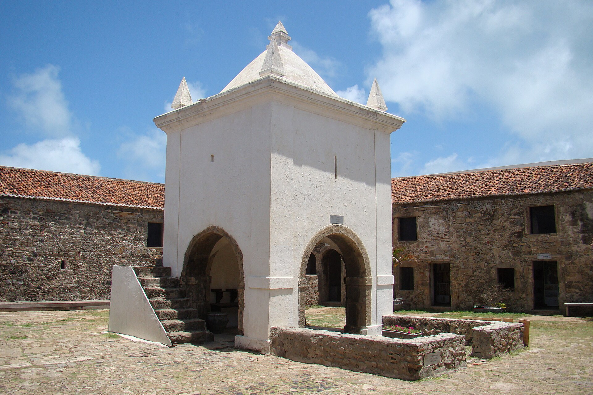
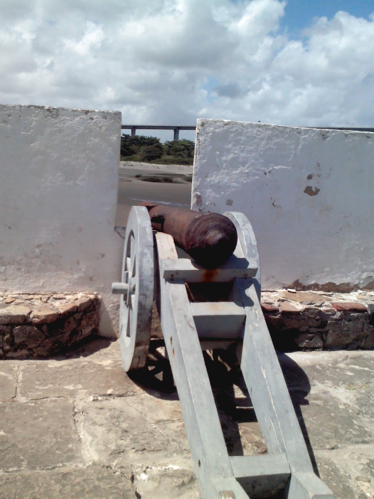
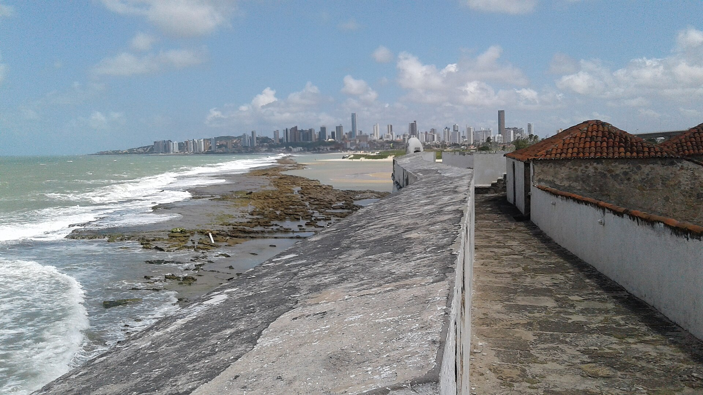

# Forte Dos Reis Magos — reference contact sheet

Gathered 2026-06-12. 7 images (QA-verified by fresh-context subagent).

## Images

 — **wide** — Water-level view of full white star-fort wall and bastions, crisp daylight

 — **wide** — Aerial of fort on the reef spit with causeway and turquoise sea — best siting reference

 — **wide** — Low-tide sunset angle on bastion corner and stone base; strong mood ref

 — **tight** — Interior courtyard stone barracks facades in golden light, doors/windows detail

 — **tight** — Central courtyard chapel/cistern tower with stairs and arches, sharp midday light

 — **tight** — Cannon on carriage at rampart embrasure — key prop detail

 — **tight** — Atop rampart wall looking toward Natal skyline and reef beach — wall texture + context

## Sources used
- Wikimedia Commons (API search, files per `_provenance.md`)

## Provenance
See `_provenance.md` for full details per image.
