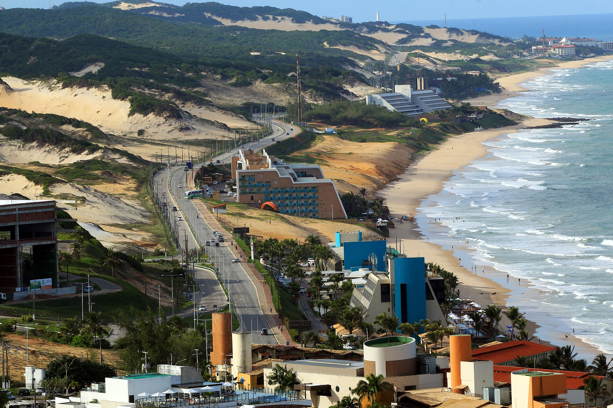
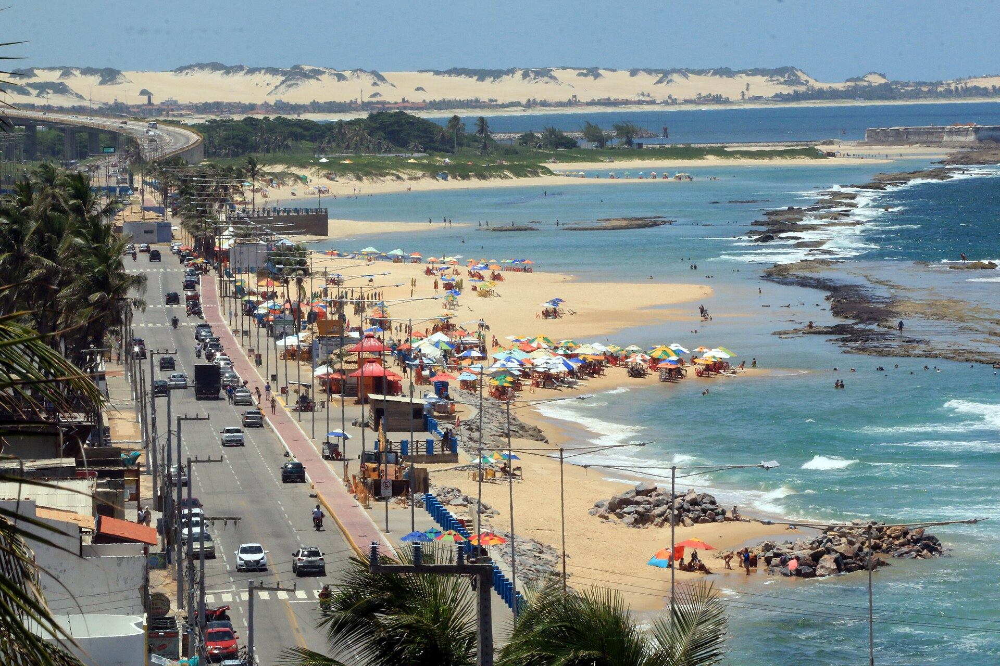
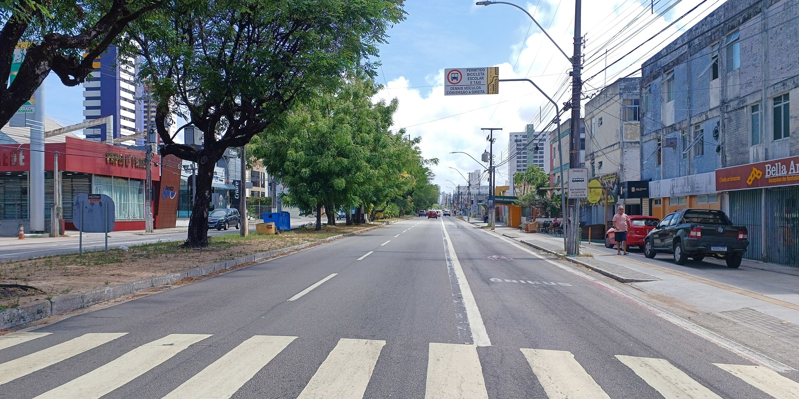
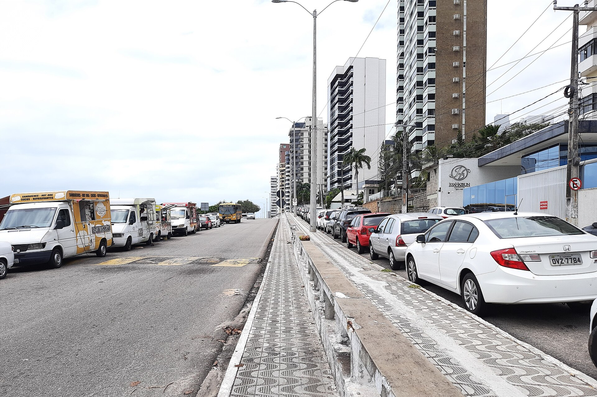
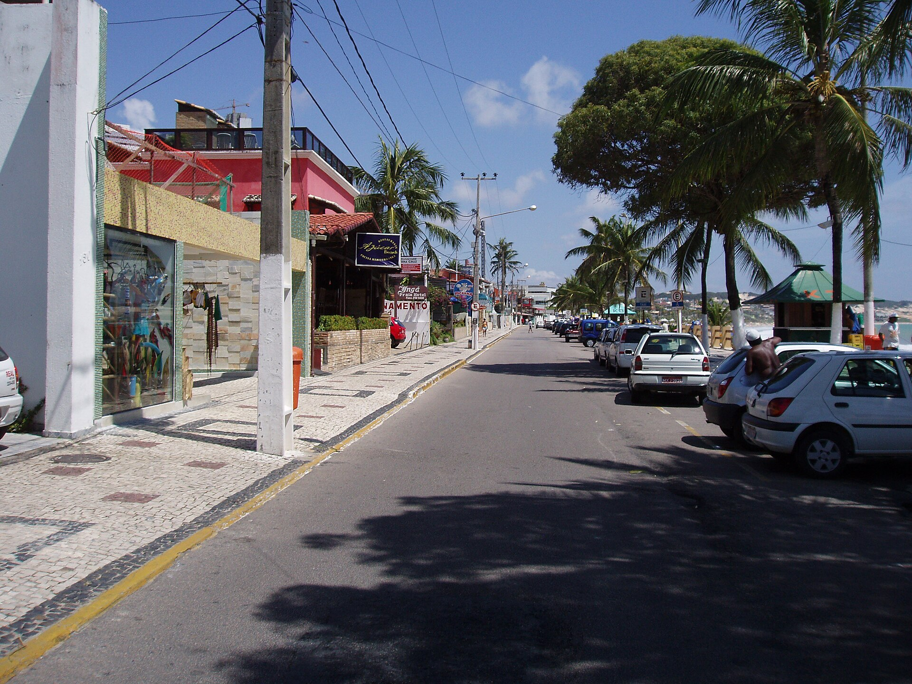
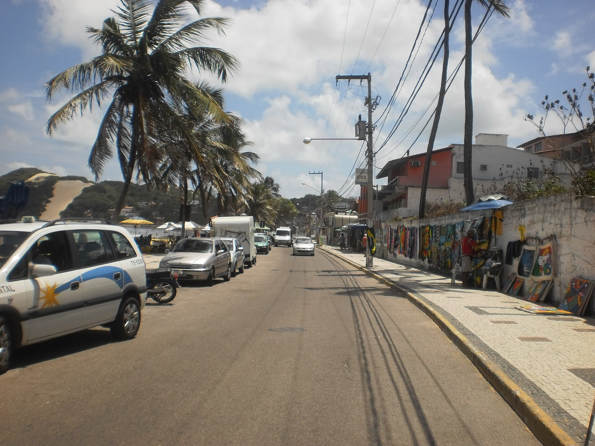
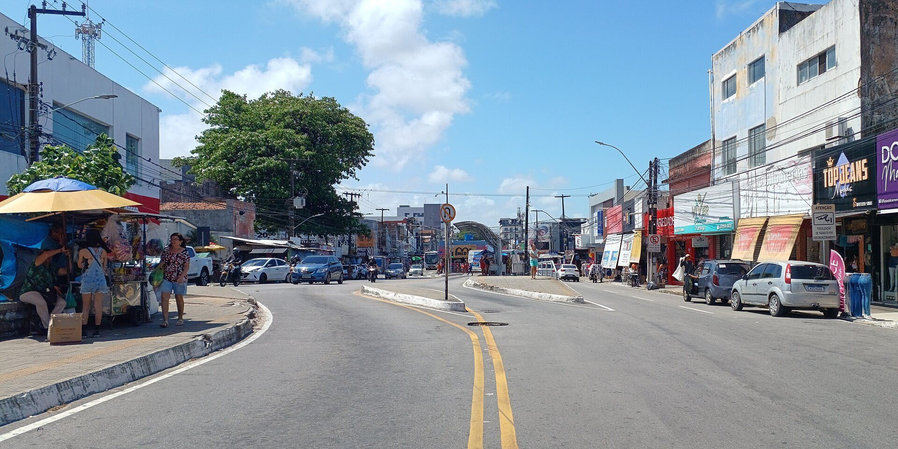

# Natal Street Scenes — reference contact sheet

Gathered 2026-06-12. 7 images (QA-verified by fresh-context subagent).

## Images

 — **wide** — Aerial of Via Costeira coastal highway winding between dunes and beach with hotels

 — **wide** — Elevated beachfront avenue with traffic, red bike lane, crowded beach umbrellas

 — **wide** — Long avenue vista from crosswalk: divided road, commercial low-rises, towers behind trees

 — **wide** — Beachfront avenue with high-rise apartments, mosaic sidewalk median, food trucks

 — **tight** — Av. Erivan França at sidewalk level — storefronts, parked cars, palms

 — **tight** — Street-level Ponta Negra road: parked cars, vendor art wall, power lines, dune at end of street

 — **tight** — Busy commercial street (Alecrim) with vendors, pedestrians, shop signage

## Sources used
- Wikimedia Commons (API search, files per `_provenance.md`)

## Provenance
See `_provenance.md` for full details per image.
