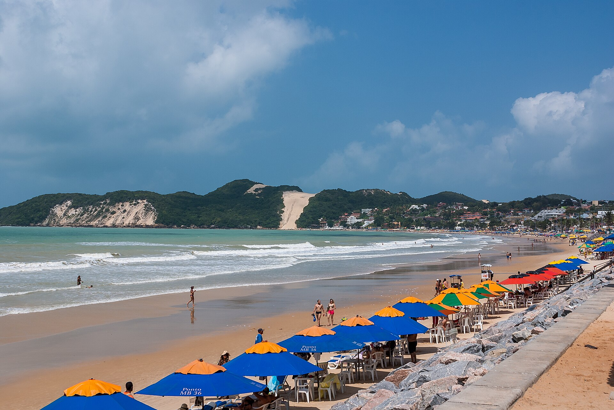
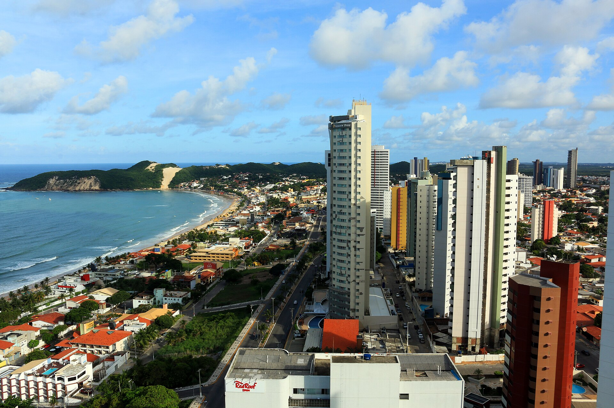
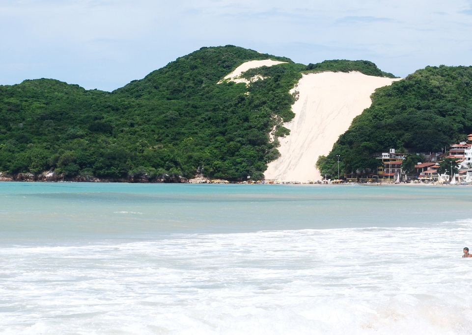
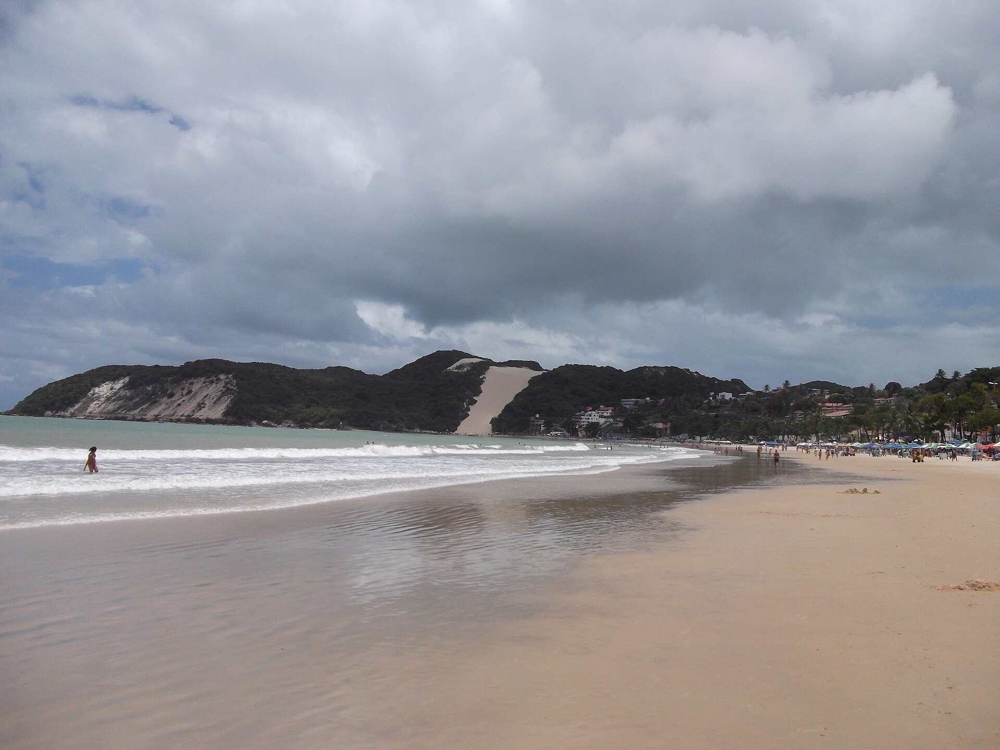
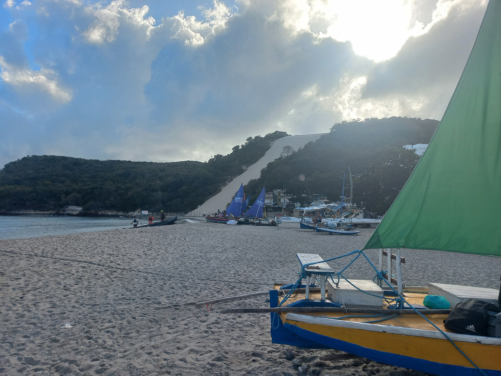
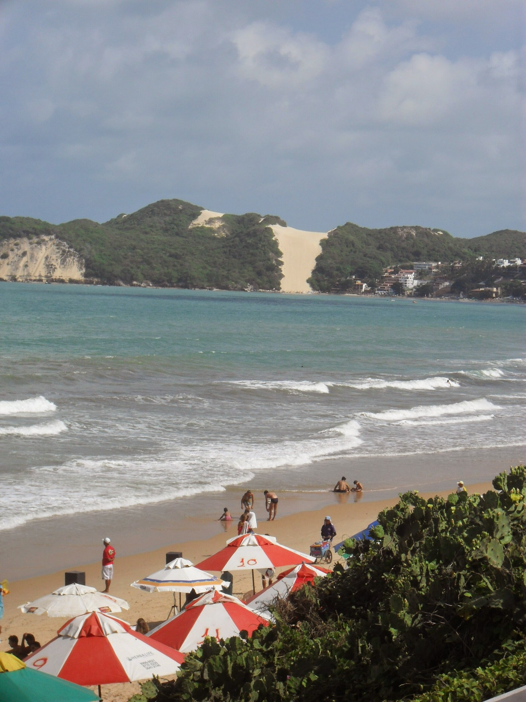

# Ponta Negra Morro Do Careca — reference contact sheet

Gathered 2026-06-12. 6 images (QA-verified by fresh-context subagent).

## Images

 — **wide** — Full beach sweep with kiosk umbrellas, surf line, Morro do Careca dune at south end; sharp, vivid

 — **wide** — Aerial establishing: hotel highrise skyline, curving bay, dune headland in one frame

 — **wide** — Clear view of Morro do Careca's bald sand face across turquoise water, beachfront buildings at base

 — **wide** — Beachfront hotel towers from the water, crowded sand and umbrellas below

 — **tight** — Beach-level: traditional jangada sailboats on the sand with the dune behind

 — **tight** — Kiosk red-and-white umbrellas and bathers at people level, dune across the bay

## Sources used
- Wikimedia Commons (API search, files per `_provenance.md`)

## Provenance
See `_provenance.md` for full details per image.
