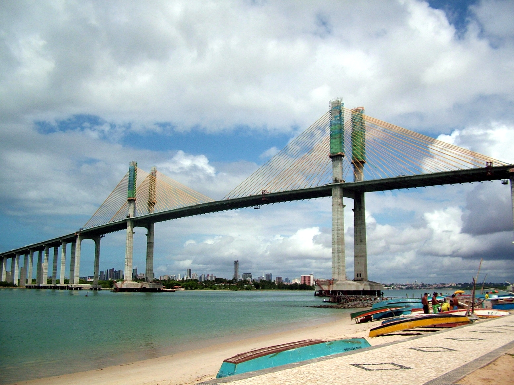
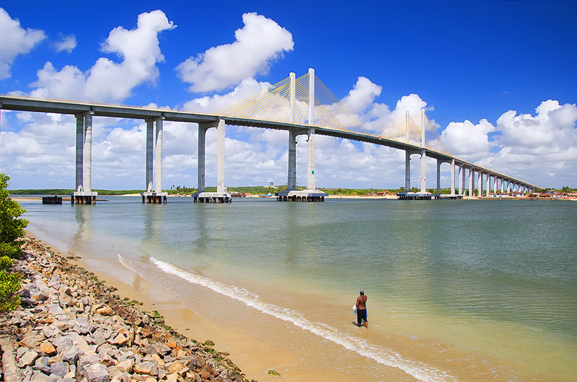
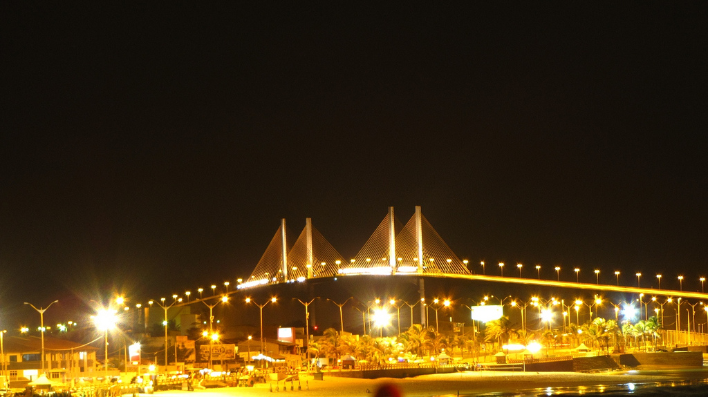
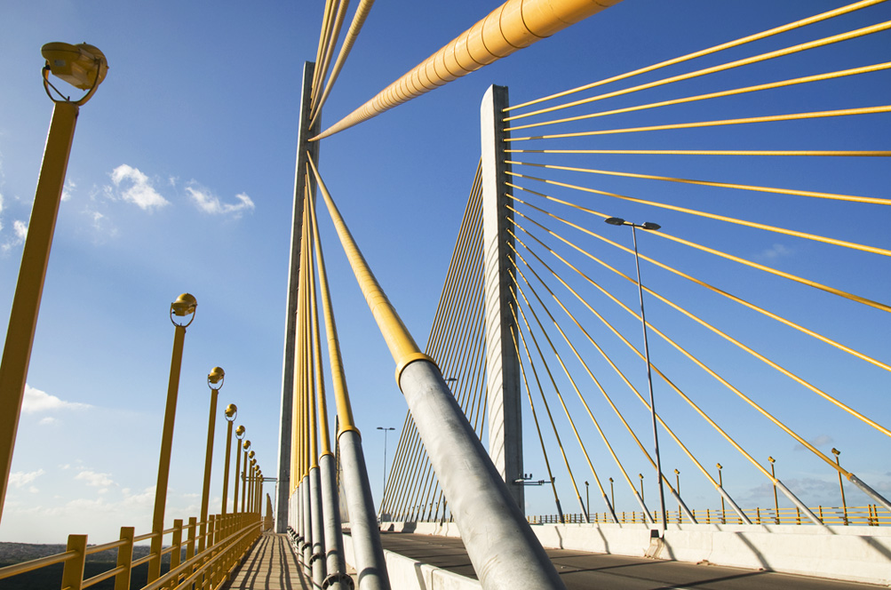
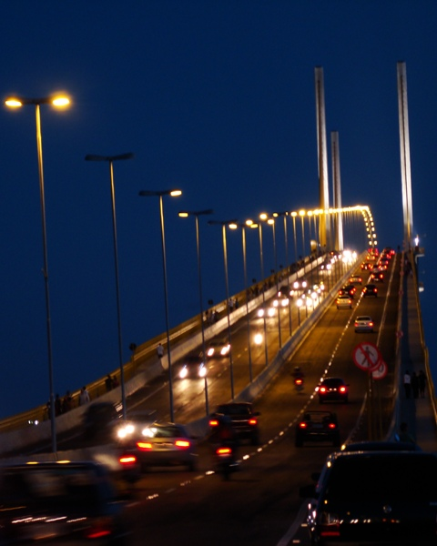

# Ponte Newton Navarro — reference contact sheet

Gathered 2026-06-12. 5 images (QA-verified by fresh-context subagent).

## Images

 — **wide** — Full span from beach with fishing boats, both pylons and fanned cables, city skyline behind

 — **wide** — Full span over the Potengi from the sand bar, vivid blue sky

 — **wide** — Night wide from beach promenade, bridge fully lit — time-of-day variety

 — **tight** — Deck-level pylon, fanned cables and lamp posts — best structural close-up

 — **tight** — Deck-level night traffic climbing toward the pylon; only traffic-on-deck shot

## Sources used
- Wikimedia Commons (API search, files per `_provenance.md`)

## Provenance
See `_provenance.md` for full details per image.
