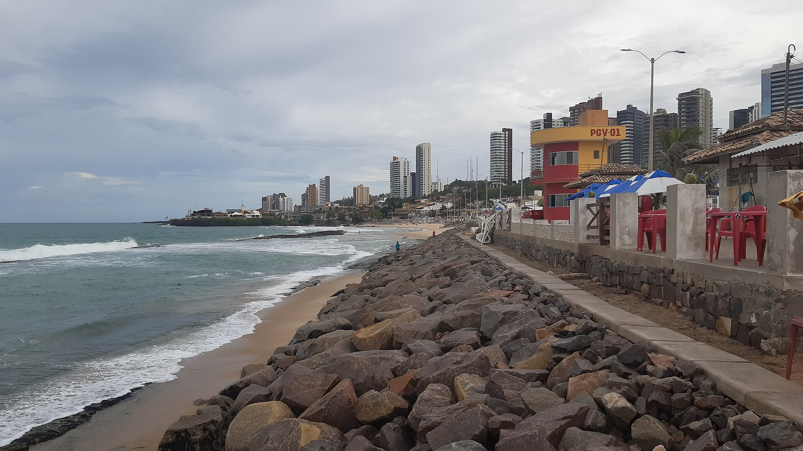
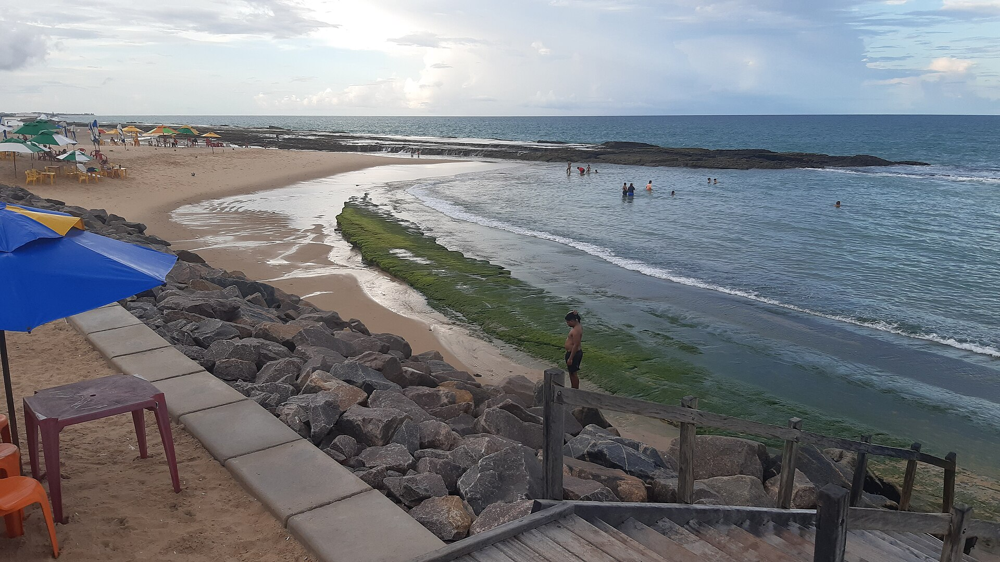
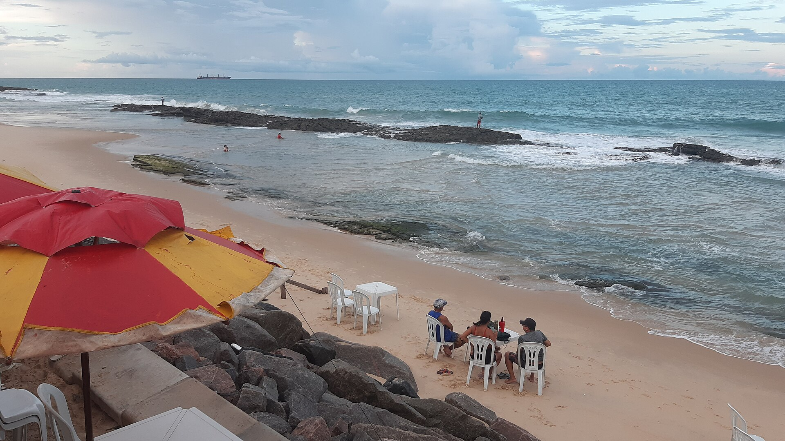
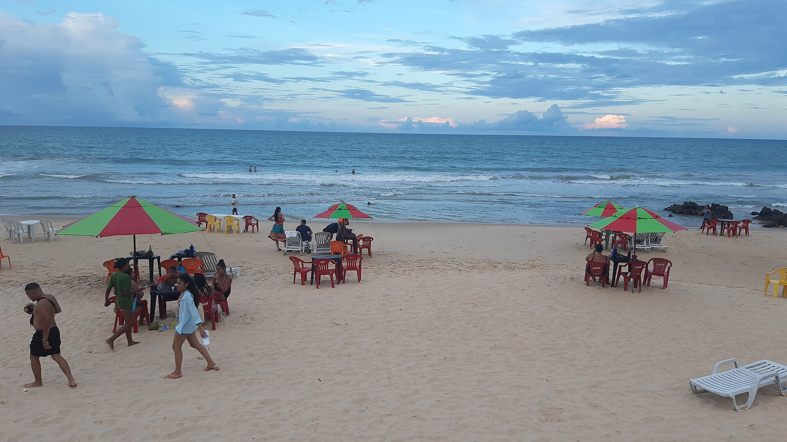
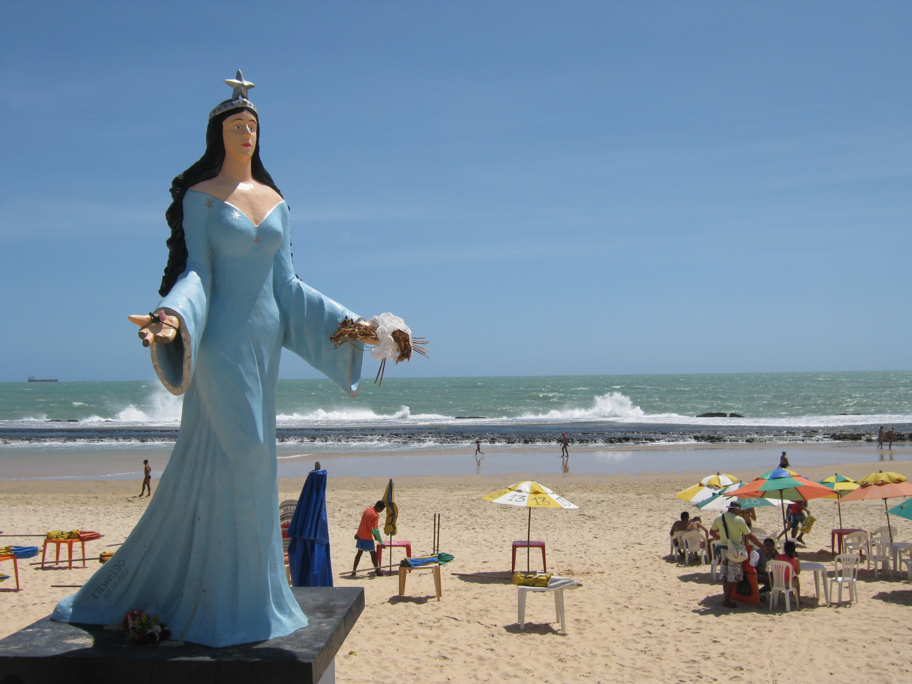

# Praia Do Meio — reference contact sheet

Gathered 2026-06-12. 5 images (QA-verified by fresh-context subagent).

## Images

 — **wide** — Full sweep along seawall with rocks, lifeguard post, skyline toward Praia dos Artistas

 — **wide** — Elevated view of reef pool, rocks, sand and kiosk umbrellas — protected swimming area

 — **tight** — Sand-level kiosk umbrellas and tables against the exposed reef line

 — **tight** — Beach-bar scene with red/green umbrellas, plastic tables and bathers

 — **tight** — Iemanjá statue landmark with reef surf and umbrella vendors behind

## Sources used
- Wikimedia Commons (API search, files per `_provenance.md`)

## Provenance
See `_provenance.md` for full details per image.
