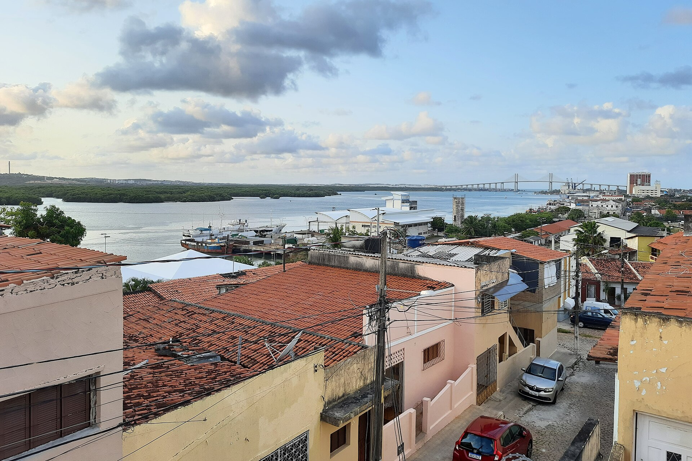
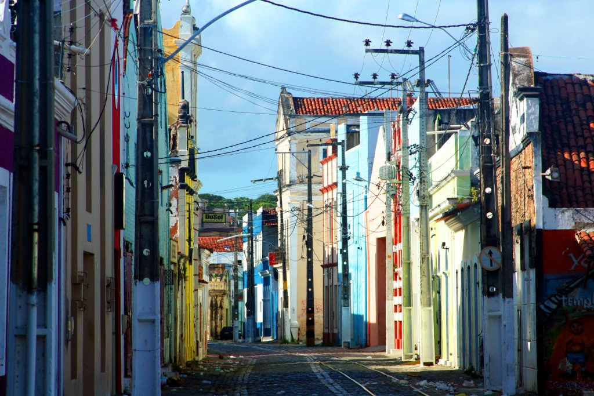
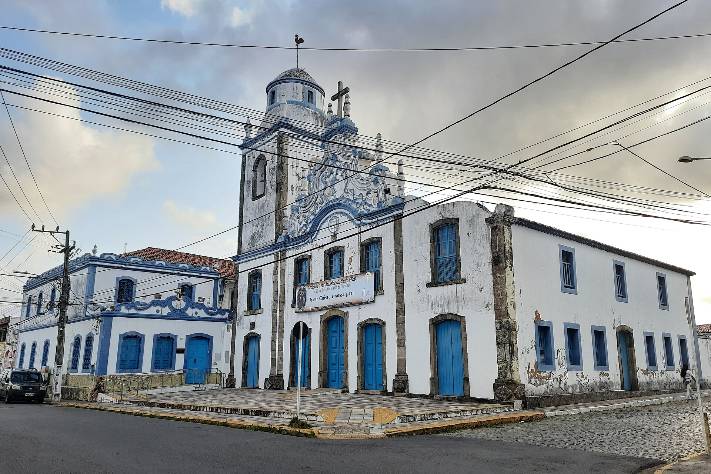
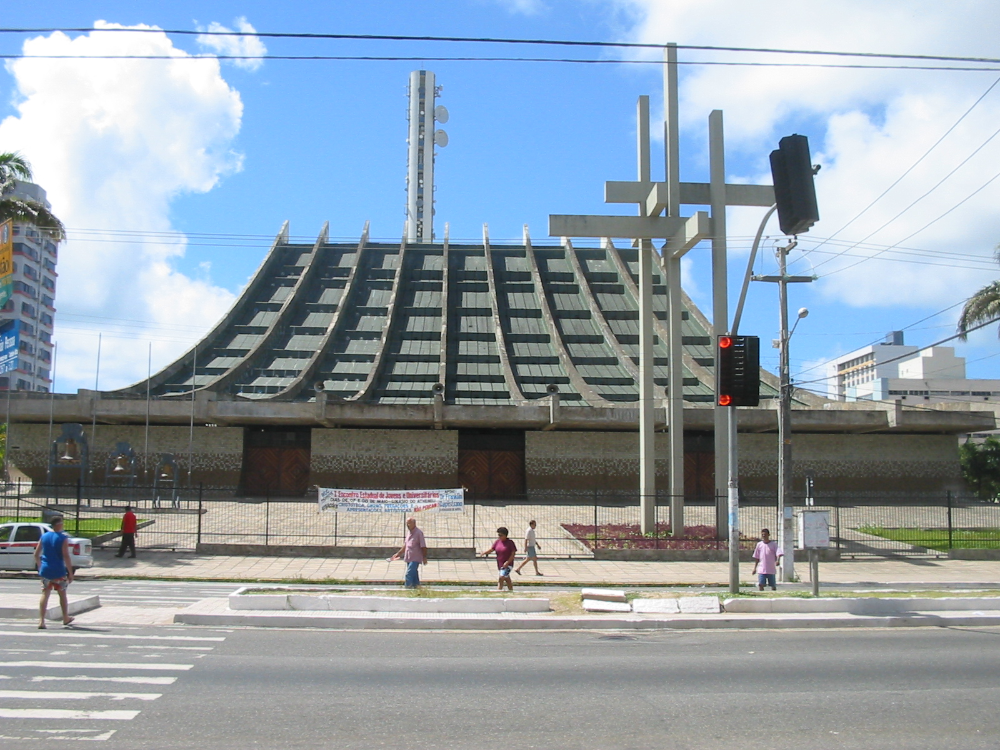
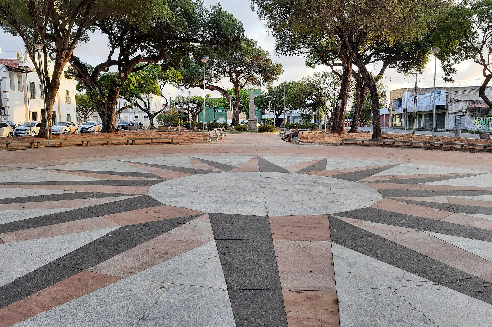
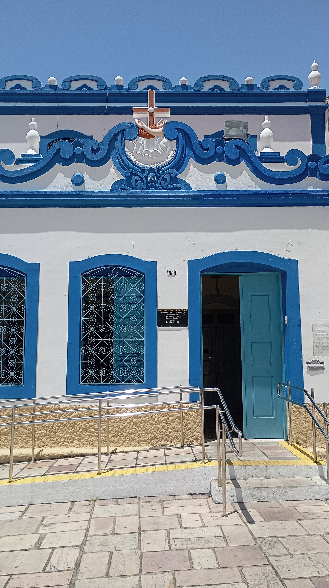
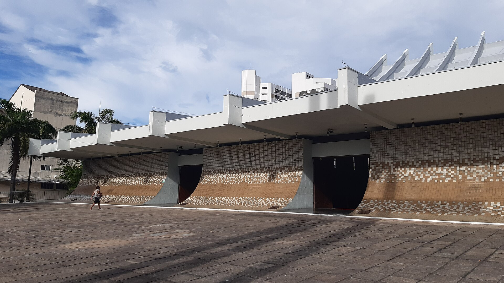

# Ribeira Cidade Alta Historic — reference contact sheet

Gathered 2026-06-12. 7 images (QA-verified by fresh-context subagent).

## Images

 — **wide** — Ribeira rooftops over the Potengi with Newton Navarro bridge — riverside cityscape

 — **wide** — Colorful colonial/eclectic facades down a cobbled Ribeira street

 — **wide** — Igreja de Santo Antônio (Igreja do Galo) full corner view with bell tower and street

 — **wide** — Catedral Metropolitana full conical form with cross pylons from street level

 — **tight** — Compass-rose paving of historic-center praça with obelisk and shaded trees

 — **tight** — Blue-and-white baroque scrollwork facade detail with cross emblem

 — **tight** — Catedral Metropolitana side elevation — mosaic-tile curved walls and concrete fins

## Sources used
- Wikimedia Commons (API search, files per `_provenance.md`)

## Provenance
See `_provenance.md` for full details per image.
