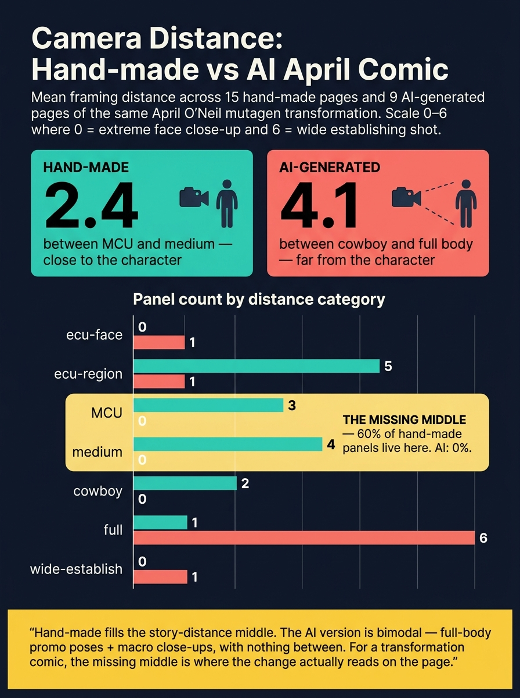
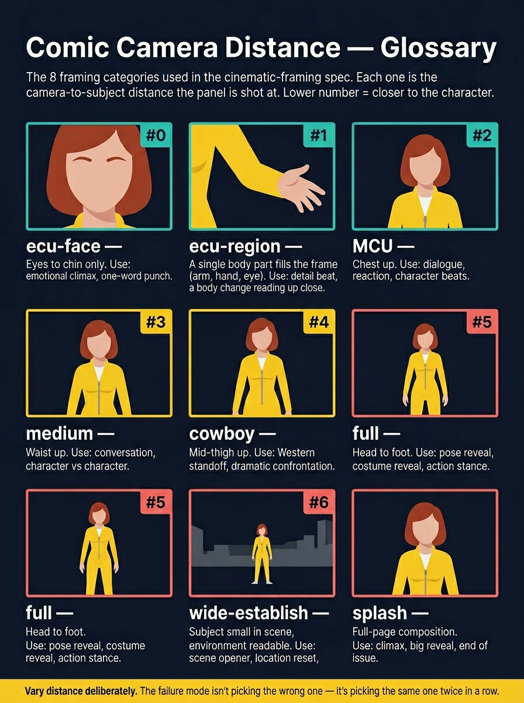

# Camera distance bias: hand-made vs AI-generated April

*Posted 2026-05-13. Field note from a side-by-side measurement of the same transformation script rendered two different ways.*

## TL;DR

We scored every page of two versions of the same April O'Neil mutagen-transformation comic on the [cinematic-framing.md](../cinematic-framing.md) distance scale (0 = ecu-face, 6 = wide-establish):

- **Hand-made (15 pages):** mean distance **2.4** — between MCU and medium.
- **AI-generated (9 pages):** mean distance **4.1** — between cowboy and full body.

That's a ~1.7-step gap on a 0–6 scale. The hand-made comic is meaningfully closer to the character on almost every page. More striking: the AI version is **bimodal** — full-body promo poses + extreme close-ups, with **zero panels in the middle distances** (MCU / medium / cowboy). The hand-made fills that middle with 60% of its panels and that's where most of the story actually happens.

## Why this matters for transformation comics specifically

When the camera is at MCU or closer during a transformation beat, the body region that's transforming **dominates the panel** — the chest fills the frame during chest expansion, the bicep fills the frame during arm growth. The reader's eye has nowhere else to go. When the camera is at full body for the same beat, the changing region is small in frame and the panel reads as *"April is now buff"* instead of *"April's chest is expanding right now."* You see the result; you don't feel the event.

The hand-made comic reserves its single full-body shot for the page-13 reveal — by then the transformation is done and the figure carries the panel as a complete silhouette. Reveal is the right place to pull back. Everywhere else, get close.

## The data, in detail

### Mean distance and distribution

| Metric | Hand-made | AI-generated |
|---|---|---|
| Mean distance (0–6) | **2.4** | **4.1** |
| Panels at MCU or closer (≤ 2) | 11 / 15 (73%) | 2 / 9 (22%) |
| Panels in middle distances (MCU / medium / cowboy) | 9 / 15 (60%) | 0 / 9 (0%) |
| Panels at full or wider (≥ 5) | 1 / 15 (7%) | 7 / 9 (78%) |

### Distance category breakdown

| Category | Hand-made | AI-generated |
|---|---|---|
| ecu-face | 0 | 1 |
| ecu-region | 5 | 1 |
| **MCU** | **3** | **0** |
| **medium** | **4** | **0** |
| **cowboy** | **2** | **0** |
| full | 1 | 6 |
| wide-establish | 0 | 1 |

The three middle distances (chest up, waist up, mid-thigh up) make up 60% of the hand-made panels and 0% of the AI panels. That's the missing middle.

### Per-page scoring (audit source)

| Page | Hand-made | # | AI-generated | # |
|---|---|---|---|---|
| 01  | mcu                  | 2 | full           | 5 |
| 02  | medium               | 3 | full           | 5 |
| 03  | mcu                  | 2 | ecu-face       | 0 |
| 04  | cowboy               | 4 | full           | 5 |
| 05  | medium               | 3 | ecu-region     | 1 |
| 06  | medium               | 3 | full           | 5 |
| 07  | mcu (chest crop)     | 2 | wide-establish | 6 |
| 08  | medium (rear ¾)      | 3 | full           | 5 |
| 09  | ecu-region (rear)    | 1 | full           | 5 |
| 10.4 | cowboy              | 4 | —              | — |
| 10.5 | ecu-region (arm)    | 1 | —              | — |
| 11  | ecu-region (bicep)   | 1 | —              | — |
| 12.4 | ecu-region (abs)    | 1 | —              | — |
| 12.5 | ecu-region (torso)  | 1 | —              | — |
| 13  | full (reveal)        | 5 | —              | — |

## Glossary — the 8 distance categories

For anyone joining the conversation cold, here's what each slug means. Same character framed at each distance:

Reference spec lives at [`cinematic-framing.md`](../cinematic-framing.md).

## What the pipeline now does about it

Two things have landed in the pipeline as a result of this analysis:

**1. The same-combo HARD gate (already in place).** [`rules_audit.py`](../../../continuity-check/scripts/rules_audit.py) fails HARD if any single `(distance, angle)` combo appears in more than 3 panels of a chapter. The AI-generated April had **7 panels at `(full, eye-level)`** — that gate would have rejected the shotlist immediately, before any image was generated. Hand-made April's worst combo is `(ecu-region, three-quarter)` at 2 panels. Well within.

**2. Per-beat distance defaults for transformations.** The [`script-breakdown` SKILL.md § Workflow Step 4.5](../../../script-breakdown/SKILL.md) "Transformation decomposition" table now specifies a default distance for each `transformation_beat` value (chest → MCU or ecu-region, hips → medium or ecu-region, arms → ecu-region, reveal → full, etc.). Script-breakdown emits these defaults; the user can override per panel but the chapter aggregate is the target.

## The lesson — L20

Added as **L20 — Camera distance bias for transformation comics** in [`lessons-learned.md`](../lessons-learned.md). The short version:

> Transformation chapters should sit at mean distance ≤ 3.0 across all panels. Body-region beats default to MCU or closer so the changing region dominates the frame. Reveal is the one place to pull back — and even then, frame close enough that the figure carries the panel. A chapter with zero panels in the middle distances (MCU / medium / cowboy) is bimodal-broken; the panels that should have lived there got displaced to full-body promo poses and the transformation event went missing from the page.

## Open questions

- **Should we add a "mean distance ≤ 3.0" HARD gate?** Currently the same-combo gate catches the worst case but a chapter could still drift to mean 3.8 (mostly full-body) and pass. The mean-distance rule is mentioned in the v2-April camera directive but isn't yet enforced as a script-level gate. Worth wiring as a follow-up — it's a one-line addition to `check_camera_variety`.
- **Should `reveal` be the only beat allowed at `full` distance?** Probably yes. A transformation scene with a `chest` or `arms` beat shot at full body is almost always a mistake. We could add a per-beat distance whitelist to `check_transformation_beats`.
- **Does this generalize beyond transformation comics?** Probably yes for action / fight scenes (impact reads at close framing), probably less for dialogue-heavy or world-building scenes. The mean-distance target is genre-dependent.

## Source comics

- Hand-made: `~/Downloads/april/` (the user's, considered the target shape).
- AI-generated: `~/Downloads/april-claudemade/` (the prior pipeline output, the failure shape the gates were built to catch).
- Principles doc: `~/Downloads/april-lessons.md`.
