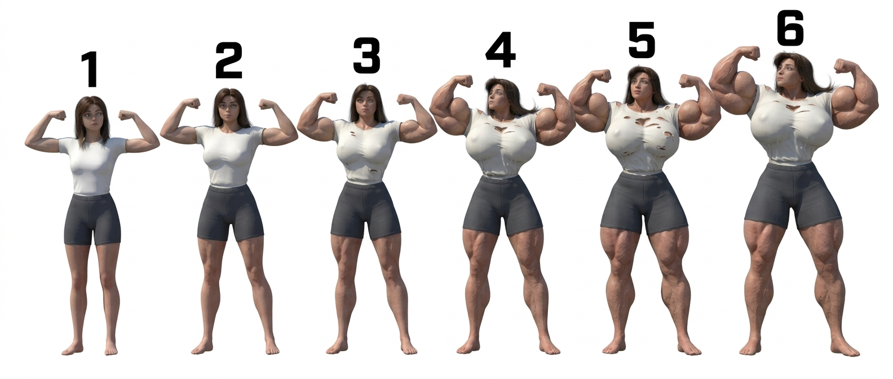

# Lessons Learned — Comic Production

Hard-won lessons from production. Each lesson is a real failure mode observed in output, the root cause, and the fix. Read this when something looks wrong, before you assume the prompt was the problem.

L-numbers are chronological, not priority. A lesson's importance comes from being cited in `build-comic.md` hard rules, not from its position here. **Load-bearing index below — read these first if you're skimming.**

---

## Load-bearing index (the rules that govern most of the pipeline)

| L | Title | What it governs |
|---|---|---|
| L1 | Progressive sequences must be chained, never parallelized | State continuity across multi-panel transformations |
| L1.5 | Chain view-aware, not blindly to N−1 | Which prior panel becomes the state anchor |
| L9 | Capture every panel's job_id before submitting the next | Chain integrity (no silent breaks) |
| L10 | References are the truth, prompts are deltas | **The most important architectural rule** — what the prompt may describe vs what refs carry |
| L10 refinement | Identity-vs-pose distinction | Refs carry identity / costume / location / lighting baseline; prompt carries camera / pose / expression / action / momentary state |
| L11 | Cartoony FMG proportions need explicit anchoring | Muscular build doesn't regress to realistic fitness on tier ≥ 2 |
| L12 | Dialogue panels need close framing | On-screen dialogue + wide camera = unreadable; close framing mandatory |
| L13 | Multi-speaker beats split into per-speaker panels | ≥3 lines from ≥2 speakers must be split before generation |
| L14 | Multi-view location references for shot-reverse-shot | Single env anchor breaks when the camera reverses; pack multiple env refs per location |
| L15 | Female characters must read as beautiful | Mandatory glamour anchor on every prompt with a female cast member |
| L16 | Multi-angle character reference packs | Arc characters need 5 view refs at baseline tier (3q, profile, back, low-angle, ECU-region) on top of face_card + body_tiers |
| L17 | Known/canonical characters can't drift | IP characters need canon-sourced refs + explicit "canonical version of X" anchor per prompt |
| L18 | Pose anatomy coherence | Mandatory render line: torso, hips, abs, feet all face the same direction; no impossible twists |
| L19 | Bake 2D comic-style lettering with scope-bounded overlay | Reverses L7. Speech bubbles / captions / SFX render as flat 2D comic-book graphics composited onto the photoreal CGI scene — 2D scope explicitly bounded to lettering only |
| L20 | Camera distance bias for transformation comics | Default to MCU or closer; reserve full-body for the reveal. Mean ≤ 3.0, ≥30% in middle distances |
| L28 | Reference completeness is mandatory, not optional | `references_required.json` manifest derived at script-breakdown; gated by `rules_audit`. Body-tier refs MUST attach the muscle-size lineup at generation time. |
| L21 | Suppress in-scene rendering of reference images | Face card / lineup refs occasionally render as physical scene objects; exclusion clause required in every prompt that attaches a ref |
| L22 | Hair state must be explicit in every face-visible panel | Twin buns + ribbons (or loose) drift across panels when inherited only from state anchor; name the hair state per panel |
| L23 | When env ref is dropped, add a dense verbal env anchor | Stage-change full-body panels drop env ref to fit the 3-ref ceiling; without 5+ named location elements in the prompt the background goes to a grey void |
| L24 | Suppress anachronistic accessories explicitly | Models hallucinate watches, bracelets, jewelry on the wrists/neck/ears; suppress by name when those body parts may be in frame |

Other lessons (L2, L3, L4, L5, L6, L7, L8) are platform-specific, situational, or historical. L7 in particular is superseded by L19 — read L7 for the diagnosis, L19 for the current rule. L4 was undeprecated when L19 reversed L7.

When in doubt: read `build-comic.md`'s hard rules section, which is the active enforced subset.

---

## L1 — Progressive sequences must be chained, never parallelized

**Symptom**: In a transformation, growth, dressing, or charge-up sequence, state regresses panel-to-panel:
- A qipao that was torn at the shoulder seam in panel T5 looks intact again in T6.
- A body at muscle size 5 in panel T4 shrinks back toward size 4 in T5.
- Hair that came loose from a bun in T3 re-pins itself in T4.
- Energy aura intensity flickers up and down instead of building.

**Root cause**: The model has no memory between calls. If you submit T1…TN in parallel — even with rich text descriptions like *"more torn than the previous panel"* or *"size 5 transitioning to 5.5"* — the model cannot see what "the previous panel" looks like. Every panel re-derives state from the baseline character ref + text alone. Text-described *progress* is interpreted independently each call, and you get non-monotonic output.

**Fix**: Generate progressive sequences **sequentially**. Each panel must take the immediately previous panel's job ID as a reference image (`medias[].value` = prior `job_id`, role `image`). Always pair it with the canonical face/portrait ref so the face doesn't drift across the chain.

```
T1: refs = [base_body, portrait, gauntlet]
T2: refs = [T1_job_id, portrait, gauntlet]
T3: refs = [T2_job_id, portrait]
…
T10: refs = [T9_job_id, portrait, bison_ref]
```

Wait for each job to complete before submitting the next. There is no parallel shortcut for chained sequences — accept the wall-clock time.

**Why pair the prior-panel ref with the portrait ref**: the prior panel carries body + clothing + pose state, but its face is usually mid-shout, mid-impact, or eyes-closed. Chaining face state across many panels accumulates drift (the model averages successive distorted faces and the character stops looking like themselves). The canonical portrait anchors the face every step.

**When this rule applies**:
- Transformation sequences (FMG, transformation arcs, alternate forms)
- Putting on or taking off a garment across multiple panels
- Charging up an attack with VFX intensity progression
- Taking damage across a fight (clothing tears, blood, bruising)
- Weather/lighting changes across a montage (rain begins → storm → flood)
- Any case where panel N+1's state depends on panel N's state, and parallel generation would break continuity

**When this rule does NOT apply**:
- Independent panels in the same scene that don't share evolving state (separate dialogue beats, reverse-angle ECUs of the same exchange) — these can parallelize.
- Establishing shots, environment refs, character refs — independent by definition.

**Worked example — Chun-Li transformation T1→T10 (correct)**:
```python
t1 = generate(prompt=T1_prompt, medias=[base_body, portrait, gauntlet])
wait(t1)
t2 = generate(prompt=T2_prompt, medias=[t1.id, portrait, gauntlet])
wait(t2)
t3 = generate(prompt=T3_prompt, medias=[t2.id, portrait])
# … and so on
```

**The wrong way (causes the symptoms above)**:
```python
# DON'T do this for a transformation arc
results = parallel([
    generate(prompt=T1_prompt, medias=[base_body, portrait]),
    generate(prompt=T2_prompt, medias=[base_body, portrait]),  # no T1 ref
    generate(prompt=T3_prompt, medias=[base_body, portrait]),  # no T2 ref
    # …
])
```

---

## L1.5 — Chain view-aware, not blindly to N−1

**Symptom** (the second-order failure after L1 is fixed): chaining is on, panels are generated sequentially, but specific transitions in the sequence still produce visibly worse output than their neighbors. Common cases:
- A front-view panel following a back-view panel: the front face/body looks subtly off-axis, like the model is fighting between "show the front" and "match the body framing in the reference"
- A face ECU following a panel where the face was off-camera: facial features come out homogenized or drift away from the canonical look
- A wide body shot following an arm ECU: the body proportions feel reconstructed rather than continuous, because the prior reference only showed an arm

**Root cause**: The prior-panel ref carries two distinct things — *state* (body size, clothing damage, hair, aura) and *view* (camera angle, framing, body orientation). State is durable and what you want to preserve. View is situational. If the new panel's view doesn't match the prior, the model still tries to honor the body framing of the reference, which actively interferes with the target composition.

**Fix**: Don't always chain to T_{N−1}. Walk backwards through the prior panels and pick the most recent one whose *view category* is compatible with the new panel. That becomes the state anchor. If no compatible prior exists, fall back to the canonical character ref that matches the target view (e.g., back ref for a back panel) + a verbal state carry-forward in the prompt.

**View categories**: `front-full | 3q-full | back-full | side-full | ecu-face | ecu-region | low-angle-front | low-angle-back | high-angle | square-impact | wide-establish | splash`

**Compatibility table** (state anchor for a target view can come from any of these):

| Target | Compatible priors |
|---|---|
| front-full, 3q-full | front-full, 3q-full, low-angle-front, wide-establish (front), splash (front) |
| back-full | back-full, low-angle-back |
| ecu-face | another ecu-face, or any panel where the face was clearly visible |
| ecu-region (arm/hand/etc.) | another panel where that region was prominent and unobscured |
| wide-establish, splash | another wide/splash with the same body orientation |

**Worked example from production** (Chun-Li T1–T10 transformation, naive chain → view-aware chain):

| # | View | Naive (wrong) | View-aware (correct) |
|---|---|---|---|
| T1 | front-full | base refs | base refs |
| T2 | ecu-region (arm) | T1 ✓ | T1 ✓ |
| T3 | front-full | T2 ✗ (arm only) | **T1** + portrait + verbal state from T2 |
| T4 | front-full | T3 ✓ | T3 ✓ |
| T5 | front-full | T4 ✓ | T4 ✓ |
| T6 | low-angle-front | T5 ✓ | T5 ✓ |
| T7 | back-full | T6 ✗ (front view) | **canonical back ref** + portrait + verbal state from T6 |
| T8 | ecu-face | T7 ✗ (face not visible from behind) | **portrait** + verbal state from T6 |
| T9 | front-full | T8 ✗ (face only, no body) | **T6** (last front-full) + portrait + verbal state from T7–T8 |
| T10 | splash (front) | T9 ✓ | T9 ✓ |

The naive chain produces drift at T3, T7, T8, T9 (four of the ten panels). The view-aware chain preserves continuity at all of them.

**Verbal state carry-forward** when you can't use a visual anchor: spell it out in the prompt. *"By this panel her qipao has cumulative tears at: side slits (from earlier), shoulder seam (from earlier), back seam (from earlier). Hair fully loose. Body at size 6 hyper-muscular. Right wrist still has the gauntlet, now stable."* Verbal is weaker than visual but stronger than silent.

**Implementation in panels.json**: add a `view` field to each panel and a `chain_input` field that the runner (or you, if calling MCP directly) populates by scanning backwards through the chain for the most recent compatible view. The deprecated_parallel_id pattern is also useful for tracking which earlier (worse) generation each chained panel supersedes.

---

## L2 — Higgsfield safety filter rejections during FMG splash panels

**Symptom**: A `generate_image` call returns with `status: "nsfw"` instead of `completed`. No image is produced. The job ID is still returned but the result is empty.

**Root cause (observed pattern)**: The auto-filter is most likely to fire on panels that combine *all* of:
- Maximum-size FMG body (size 5–6)
- Heavily tattered/shredded clothing exposing skin
- Bicep flex pose with chest emphasis
- Tight close framing

Any one or two of these is fine. All four together pushes past the filter threshold.

**Fix**: For climactic max-size reveals, dial back exactly one of the four:
- Replace bicep flex with a relaxed hero stance (palms open, arms at sides)
- Keep the qipao "stretched tight and straining at seams" rather than "tattered remnants"
- Pull the camera back to medium/wide rather than tight
- Move the cleavage emphasis into the same prompt as a "full bodice covering, slight tear" detail

The retry typically passes with the same character size and body intent — only the styling/framing changes. The story moment is preserved.

**Prompt hardening that reliably passes**:
```
"qipao stretched tight over her enlarged frame but MOSTLY INTACT — straining at seams with small tears at side slits and shoulders, but the full bodice still covers her completely"
"confident hero pose — arms held out and slightly down at her sides with palms turned forward (NOT a bicep flex)"
"strong powerful but tasteful pose, suitable for a published superhero comic"
```

**Don't argue with the filter** — retry with adjusted styling. The filter is opaque and there is no appeal mechanism.

---

## L3 — Always use the `.png` URL, never `_min.webp`

**Symptom**: Character likeness drifts panel-to-panel even with rich face references. Subtle features (eye shape, nose) come out slightly different each time.

**Root cause**: Every Higgsfield asset has both a full-resolution `.png` URL and a thumbnail `_min.webp`. The thumbnail is upscaled internally if you pass it as a ref, and the upscaling introduces face drift.

**Fix**: Always pass the `.png` URL as the ref, never the `_min.webp`. When in doubt, look at the URL — if it ends in `_min.webp`, don't use it.

---

## L4 — Speech bubbles need explicit positioning and tail direction

> **Status: Active.** Per L19, classic 2D comic-book lettering is baked into the CGI render (the 2D style is scope-bounded to bubble/caption/SFX graphics only). L4's positioning, tail-direction, and attribution guidance is implemented inside the L19 lettering block — bubble shape per dialogue type, tail attribution per speaker, exact text per quote.

**Symptom**: Speech bubbles appear in random locations, sometimes overlapping faces or important visual content. Tails point at the wrong character. Multiple characters' bubbles get merged or attributed wrong.

**Fix**: In the prompt, specify (and `next_panel.py` `_l19_lettering_block()` auto-emits all of these):
- **Bubble shape per dialogue type**:
  - `balloon` → clean white rounded oval with a bold 3-4 pixel solid black outline
  - `thought` → clean white cloud-shaped outline with a small cloud-bubble trail of three round dots leading to the thinker
  - `whisper` → clean white rounded oval with a thin DASHED black outline (broken/dashed, not solid)
  - `shout` → white JAGGED-EDGED starburst shape with a bold solid black outline (spiky/zig-zag, not smooth)
  - `off-panel` → standard speech-balloon shape but drawn at the edge of the frame, tail pointing OFF the panel
  - `caption` → yellow rounded-corner rectangle with a bold 3-4 pixel black outline (separate field — `captions[]`, not `dialogue[]`)
- **Position** — name the side of the frame the speaker is on so attribution is unambiguous
- **Exact text in quotes** — bold black sans-serif comic display font (Bangers-style), ALL CAPS
- **Per-speaker attribution** — "tail pointing directly to `chunli`'s mouth", "trail leading to `mai`"

For panels with multiple speakers, the lettering block emits one bubble fragment per dialogue entry in order, each with explicit position and tail direction.

---

## L5 — Lineup ref only on stage changes, not every panel

**Symptom**: Character body proportions warp when the muscle-size lineup ref is attached to every panel in a sequence. The model averages across the lineup figures and drifts away from the specific size you want.

**Fix**: Only attach the lineup ref on **stage-change panels** — the moments when the character transitions to a new size tier (e.g., 4→5 transition panel). Between stage changes, use only the character face/body ref + sequential chaining for continuity. Always include the size-matching text in every prompt regardless of whether the lineup is attached. See SKILL.md "Muscle Size Control" for the full rule.

---

## L6 — Display widget result vs. tool-result truncation

**Symptom**: When displaying many image jobs at once (10+) via `job_display`, the tool result returns "exceeds maximum allowed tokens" and the assistant's context loses the result data.

**Root cause**: Each completed job in `job_display` echoes back the full prompt that was used. With 20+ panels at long prompts, the result balloons past the per-tool-call token cap.

**Fix**: For large batches, display in chunks of ~5 jobs per `job_display` call (split into multiple parallel calls). The widget UI still shows them all to the user — only the assistant's context view is affected. Splitting also makes it easier to spot a single failed job in the mix.

---

## L7 — 2D / illustration drift in CGI renders (triptychs AND single panels with rendered lettering)

**Symptom**: A three-panel growth beat (bicep, breast, ass, quad, abs — the templates in `three-panel-scenes.md`) renders as a flat 2D comic-book illustration, despite the prompt explicitly listing "NOT an illustration, NOT anime, NOT cartoon, NOT 2D drawn art." The output looks more like a comic page than a CGI render. Confirmed in production on the Chun-Li abs beat (job `3d0659ff-5371-4f01-8bb4-a87c56edde35`) and consistent across all five body-part beats from the same batch.

**Root cause**: Three things in the prompt were jointly pulling the model into illustration training data, and the negations weren't strong enough to override them:

1. **"Comic SFX" + ascending text overlays.** The phrase "Comic SFX" maps directly to comic-book illustration training data. The moment the model reads it, the entire scene's render style gets pulled toward whatever the model associates with "comic SFX" pages — i.e., 2D illustration. This is the single largest contributor.
2. **"Three-panel sequence" + gutters.** Multi-panel layouts with gutter lines are themselves an illustration convention. CGI renders aren't normally structured as comic pages. Asking for that layout while also asking for CGI puts the two style cues in tension, and the layout cue often wins.
3. **Stacked negations.** Image models obey *described* concepts much more reliably than *forbidden* ones. "NOT illustration, NOT anime, NOT cartoon, NOT 2D drawn" gives the model four illustration concepts to think about. Negations dilute each other — one strong "NOT illustrated" lands; four compete.

**Fix**: Rewrite around positive CGI anchoring rather than negation:

1. **Lead with concrete render-engine vocabulary.** Replace "Hyperrealistic DAZ3D Studio 3D CGI render, physically-based rendering — NOT an illustration, NOT anime, NOT cartoon, NOT 2D drawn art" with: *"DAZ Studio Iray render of a real 3D scene. Ray-traced subsurface scattering on skin, specular highlights catching warm rim light, physically-accurate fabric weave with visible thread detail, 8K texture detail, shallow depth of field with photographic bokeh. Photographic CGI render, NOT illustrated."* The model now has a concrete photoreal target instead of a list of forbidden styles.
2. **Replace "three-panel sequence" with "TRIPTYCH — three side-by-side photographic frames of the same scene at three progressive moments, separated by thin black borders. Each frame is a fully photoreal CGI render in the same style."** Same layout, different vocabulary, no comic-art association.
3. **Use "Frame 1 / Frame 2 / Frame 3"**, not "PANEL 1 / PANEL 2 / PANEL 3". Same idea, less comic-coded.
4. **Drop the comic SFX line entirely** for default templates. The growth progression is self-explanatory. If SFX is genuinely required, render it as an in-scene physical object: *"In each frame, an SFX word appears as a 3D-extruded chrome letter sculpture sitting in the scene as a physical object, casting a real ray-traced shadow on the ground and catching the same warm rim light as the rest of the render."* This forces SFX into the photoreal register instead of overlay graphics.
5. **One negation, not four.** End the prompt with a single closing line: *"Photographic CGI render, NOT illustrated."* Drop the rest.

**Worked example — Chun-Li abs beat, before vs. after**:

Before (drifted to 2D):
```
Hyperrealistic DAZ3D Studio 3D CGI render, physically-based rendering — NOT an
illustration, NOT anime, NOT cartoon, NOT 2D drawn art. Dark dramatic lighting...
[scene description with PANEL 1 / PANEL 2 / PANEL 3 structure]
Comic SFX: "GROW... GROW... GROW" in ascending size text, one per panel.
[10-rule mandatory block]
```

After (held photoreal CGI):
```
DAZ Studio Iray render of a real 3D scene. Ray-traced subsurface scattering on
skin, specular highlights catching warm sunset rim light, physically-accurate
fabric weave with visible thread detail, 8K texture detail, shallow depth of
field with photographic bokeh. Photographic CGI render, NOT illustrated.
[references]
Single image rendered as a TRIPTYCH — three side-by-side photographic frames
of the same scene at three progressive moments, separated by thin black
borders. Each frame is a fully photoreal CGI render in the same style.
[Frame 1 / Frame 2 / Frame 3 description, no SFX line]
[concise CGI rules block ending in "Photographic CGI render, NOT illustrated."]
```

### Case B — Single-panel CGI render with rendered SFX or speech bubbles

**Symptom (the second case L7 covers)**: A regular single-panel CGI generation — not a triptych, just one panel in a longer sequential comic — renders in flat 2D comic illustration style despite the prompt asking for photoreal DAZ3D / CGI. Often happens to a *subset* of panels in a sequence while other panels in the same sequence render correctly as CGI. The drifted panels share a common feature: their prompts asked the model to render **comic SFX text overlays** (e.g., "RRRIP", "KRRK", "BWOOM") and/or **inline speech bubbles** ("a white speech bubble containing the line: '...'") as part of the image itself.

**Root cause**: Same as Case A — comic-coded vocabulary pulls the model toward illustration training data. SFX text overlays and speech bubbles are illustration conventions; asking the model to render them *inside* the CGI image creates style tension, and the lettering cue often wins. The bigger the lettering presence in the prompt, the harder the pull. Panels with heavy SFX + speech bubble + caption drift hardest; panels with no in-prompt lettering hold CGI.

**Fix — the rule (revised per L19, May 16 2026)**: **Bake the lettering into the prompt, but scope-bound the 2D style explicitly to the bubble / caption / SFX graphics only — and explicitly reaffirm photoreal CGI for everything else.** L7 Case B's failure mode was that comic-coded vocabulary in the prompt was *ambient* — it had no scope, so the model applied "comic-style" to the whole image. The fix names the scope: 2D applies to lettering graphics, photoreal CGI to bodies / costumes / skin / hair / environment / lighting.

Render lettering as **flat 2D vector graphics composited onto the photoreal scene**, NOT as 3D scene objects (the original 2026-05-13 L19 prescription) and NOT as a general "comic-style" pull:
```
LETTERING — classic comic-book lettering composited onto the photoreal
CGI scene. The 2D comic styling applies ONLY to the bubble / caption / SFX
graphics. Everything else in the panel (bodies, costumes, skin, hair,
environment, props, lighting) remains photoreal DAZ3D CGI. The bubbles
are flat 2D vector graphics overlaid on the 3D scene; they do NOT turn
the scene 2D.

[per-bubble fragments — white rounded oval with bold black outline,
comic display font ALL CAPS, tail to speaker, no 3D shading no chrome
no drop shadow]

[caption — yellow rectangle with black outline, comic font]

[SFX — flat 2D comic lettering, no 3D extrusion no chrome]

Photographic CGI render on the bodies, costumes, skin, hair, environment;
NOT a 2D illustration on the bodies, NOT cartoon-shaded skin. Only the
bubble / caption / SFX graphics are flat 2D comic-book overlay.
```

Same trick used in Case A's triptych fix.

**Historical note**: L7 Case B has had three prescriptions across the project's life — (a) **never bake lettering, defer to `page-composer`** (the original 2026 era rule, "avoidance"); (b) **bake AND render as 3D scene objects** (L19 introduced 2026-05-13, "control by reframing as photoreal 3D"); (c) **bake as flat 2D overlay AND name the scope** (L19 rewritten 2026-05-16, the current rule, "control by bounding the scope"). The diagnosis has been stable across all three iterations — comic-coded vocab in a CGI prompt pulls the model toward illustration. Only the fix has evolved.

**Confirmed in production**: Chun-Li growth series — panels 3 (first surge), 4 (bicep close-up), and 5 (full body reveal) all drifted to 2D illustration while panels 1, 2, and 6–10 held photoreal CGI. The three drifted panels had prompted comic SFX text ("RRRIP", "KRRK", "BWOOM", "KRRSH") and inline speech bubbles ("a white speech bubble containing the line: '...'") in the prompt. The non-drifted panels did not. Removing the lettering from those prompts and letting `page-composer` handle dialogue/SFX in post would have held the photoreal style.

**Worked example — Chun-Li first-surge panel, before vs. after**:

Before (drifted to 2D illustration):
```
[CGI render description...]
SFX: "RRRIP" and "KRRK" appear as red and yellow comic-book burst lettering near the seams.
Speech bubble in lower right: white bubble with tail pointing to Chun-Li's mouth, containing the line: "Muscles swelling… clothes getting tight… a rush of strength! What is this?!"
[mandatory rules block]
```

After (holds photoreal CGI with baked 2D-flat lettering, per L19 May 16):
```
Hyperrealistic DAZ3D Studio 3D CGI render, ray-traced subsurface scattering on skin, physically-based rendering, 8K texture detail, photographic CGI.
[CGI render description: Chun-Li mid-surge, qipao stretched at the chest with the first seam beginning to split…]

LETTERING — classic comic-book lettering composited onto the photoreal CGI scene. The 2D comic styling applies ONLY to the bubble / caption / SFX graphics. Everything else in the panel (bodies, costumes, skin, hair, environment, props, lighting) remains photoreal DAZ3D CGI. The bubbles are flat 2D vector graphics overlaid on the 3D scene; they do NOT turn the scene 2D.

SFX 1: the word "RRRIP" rendered as bold flat 2D comic-book lettering overlaid on the scene near the tearing chest seam — bold black comic display font ALL CAPS with a solid black outline. Flat 2D vector lettering only — NO 3D extrusion, NO chrome, NO ray-traced shadows on the scene.

SFX 2: the word "KRRK" rendered as the same flat 2D comic-book lettering style near the splitting shoulder seam.

Bubble 1: classic comic-book speech balloon — clean white rounded oval with a bold 3-4 pixel solid black outline, positioned lower-right of frame; short triangular black-outlined tail pointing to Chun-Li's mouth. Bold black sans-serif comic display font ALL CAPS text inside reads exactly: "MUSCLES SWELLING… CLOTHES GETTING TIGHT… A RUSH OF STRENGTH! WHAT IS THIS?!" Flat 2D vector graphic — NO 3D shading, NO bevel, NO chrome, NO drop shadow on the scene.

Photographic CGI render on the bodies, costumes, skin, hair, environment, and lighting; NOT a 2D illustration on the bodies, NOT cartoon-shaded skin. Only the bubble / caption / SFX graphics are flat 2D comic-book overlay.
```

The dialogue stays in `shotlist.json`'s `dialogue[]` array as the source of truth, but the render bakes it in directly as 2D-flat overlay graphics — single cohesive image, lettering visually integrated.

---

**Where this rule applies**:
- Single-image multi-frame growth beats / triptychs (Case A — the templates in `three-panel-scenes.md`).
- Any single-panel CGI render whose prompt includes SFX text overlays, speech bubbles, captions, or other lettering elements (Case B).
- Any CGI prompt that uses comic-coded vocabulary like "comic SFX", "comic-style layout", "PANEL 1 / PANEL 2", or rendered word art.

**Where this rule does NOT apply**:
- Genuinely illustrated comics where the user *wants* the comic-book aesthetic. The whole point of L7 is that the model defaults toward illustration; don't fight it if illustration is the goal.

**If 2D drift persists despite L7's fixes**:
- Check the character reference image — if the ref itself is a 2D illustration, the model will inherit its aesthetic regardless of prompt language. Use a CGI character ref for CGI prompts.
- Drop the triptych structure entirely and render a single CGI frame at the peak moment. Sometimes the multi-frame layout itself is the issue.
- Add explicit virtual-studio lighting vocabulary: *"shot in a virtual studio with three-point lighting, key light at 5500K, fill at 4500K, rim light at 6500K, rendered in DAZ Studio with Iray at 8K resolution."* The more concrete the rendering vocabulary, the harder the model has to work to drop into illustration.

---

## L8 — Cumulative state in multi-beat growth comics

**Symptom**: A comic has multiple sequential growth beats — say breast growth in scene 3, glute growth in scene 5, bicep growth in scene 7 — each rendered as its own three-panel triptych. By scene 7, the character's bicep beat shows her at full baseline for chest and glutes despite both having been grown earlier. The reader sees the prior-grown features visibly *un-grow* as each new beat begins, breaking continuity across the comic.

**Root cause**: The default three-panel templates start frame 1 at "baseline for the growing feature." That's the right behavior for the **first** growth beat in a comic (no prior state to preserve), but it's wrong for every later beat. The templates don't carry accumulated state forward by default — each beat is a fresh canvas.

**Fix**: For any growth beat that is the 2nd or later in a longer comic, add an explicit **CARRY FORWARD STATE** block at the top of the scene description that:
1. Lists every feature grown in prior beats and its current size.
2. States that those features are IDENTICAL across all three frames of the new beat.
3. Is repeated/reinforced in each per-frame description as *"chest UNCHANGED from frame 1 — still size 5"*, etc.

The growing feature is described normally (frame 1 small → frame 3 large). Everything else is locked.

**Worked example — comic with scene order [breast → glutes → biceps → quads]**:

By the time the **bicep beat** arrives:

```
CARRY FORWARD STATE (constant and identical across ALL three frames — do not 
change between frames): Chun-Li's breasts are ALREADY at size 5 from the earlier 
breast growth scene. Her glutes are ALREADY at size 5 from the earlier ass 
growth scene. The qipao is already stretched tight at the chest, frog-buttons 
already strained, side slits already torn from prior glute growth. All carry-
forward features are IDENTICAL in frame 1, frame 2, and frame 3 — only the 
bicep is growing.

[per-frame description of bicep growth from size 1 → size 5, with each frame 
restating the chest and glutes as unchanged]
```

By the time the **quad beat** arrives, the carry-forward block adds biceps to the list, and only the quad varies across frames.

**Why this works without a consistency issue**: Each frame in a triptych is composed independently — the model isn't tracking temporal state across frames the way a video model would. Cumulative state is just additional *spatial* information the model places into each frame independently. Telling it "chest is size 5 in this frame" three times produces three frames with size-5 chests; the chest doesn't drift because there's no frame-to-frame dependency to drift through. The growing feature varies because it's the *only* feature with different per-frame instructions.

**Why the repetition matters**: Without restating the carry-forward features in each per-frame description, the model sometimes drifts them as it processes the active growth (frame 3's "massive bicep" can subtly inflate or deflate the chest if the chest size isn't re-pinned). The redundancy costs prompt tokens but reliably locks the carry-forward features.

**Relationship to existing templates**: This generalizes Template 6 ("Pre-Grown Muscles + Breast Growth") in `three-panel-scenes.md`. Template 6 is the specific case of "pre-grown arms + currently-growing breasts." The general rule is "any pre-grown features + any currently-growing feature." Encoded as a modifier in the templates file rather than 36+ specific templates.

**Where this rule applies**:
- Any three-panel beat that is the 2nd or later growth beat in a longer comic narrative.
- Multi-beat character arcs where features accumulate (FMG transformations, charge-up sequences with retained VFX, weather progressions where each scene adds to the prior).

**Where this rule does NOT apply**:
- The **first** growth beat in a comic — use the standard templates as-is.
- Standalone three-panel beats with no prior story context.
- Independent showcases — alternate-reality character variants, separate characters per beat, "what-if" panels.

**Validation case**: Confirmed in production — Chun-Li bicep growth beat with breasts pre-set to size 5, biceps growing from size 1 → 5 across three frames. Job `c22d8d7f-4446-444e-98b0-776f9fe02b9a`. The chest stays locked at size 5 across all three frames; only the bicep varies. Prior to this pattern, generating a "later beat" with baseline framing produced a chest visibly *smaller* in frame 1 than in the previous scene's final panel, breaking the comic's visual continuity.

---

## L9 — Capture every panel's job_id before submitting the next, or chaining silently breaks

**Symptom**: A multi-panel sequence was generated *sequentially* (not in parallel), but the output still shows L1-style state regression between adjacent panels — clothing damage patterns reset or change shape, body size flickers down, hair re-pins, accumulated tears disappear. The panels look individually fine; the discontinuity is *between* them. Most visible on costume damage: the qipao's tear pattern changes location, shape, or coverage from panel to panel rather than accumulating monotonically.

**Root cause**: Without a recorded `job_id` from panel T_{N−1}, panel T_N can't reference T_{N−1} as a `medias[]` input. The `generate_image` MCP call still completes — but the panel is being composed from the baseline character ref only. The chain is silently broken, even though you submitted in order. There is no error and no warning at submit time. You only see the failure in the output, sometimes pages later when the cumulative drift becomes obvious.

This is **distinct from L1** (which is about parallelizing a chain that *should* be sequential). L9 is what happens when you *intend* to chain sequentially but the workflow loses track of the job IDs. The output symptom looks identical to L1 because the model has no memory either way.

**Common workflow gaps that cause this**:
- Using `generate_image` MCP directly (not the runner) and forgetting to record each returned `job_id` *before* composing the next panel's prompt.
- Recording only the first few job IDs and leaving the rest as `—` "to fill in later" — by the time you go back, the chain has already broken from the first missing ID forward.
- The runner crashes mid-batch and the user retries individual panels ad-hoc via MCP without consulting `state.json` for the prior-panel job_id.
- Confusing `job_id` (per-generation result, what you chain from) with `ref_id` (per-asset uploaded to Higgsfield, what you attach as a static reference). Passing a `ref_id` where the chain expects a prior `job_id` doesn't error but doesn't chain.

**Fix**:
1. **Prefer the runner for any chained sequence.** `state.json` captures every `job_id` automatically and crash-resume picks up where you left off. Don't bypass it for "quick" chained runs.
2. **When using `generate_image` MCP directly for a chain**:
   - Before submitting panel N, confirm the job_id you intend to chain from (per L1.5's view-aware compatibility table) is in hand.
   - Immediately after each `generate_image` returns, write the job_id to `job_ids.md` (or a `chain.json`) **before composing the next prompt**. Not at the end of the session — right now.
   - Treat a partially-filled `job_ids.md` as a broken chain. The only recovery is to re-run from the first missing ID forward.
3. **Validation check before composing panel N's prompt**: read `job_ids.md`. If the panel you need to chain from has no recorded ID, stop. Either find the missing job in the Higgsfield UI and record it, or accept the chain is broken from this point and start a fresh chain.

**Confirmed in production**: Chun-Li growth series. `job_ids.md` recorded only panel 1's job_id; panels 2–10 were left as `—`. Panels 8, 9, and 10 show visible costume-damage drift between adjacent panels (different bodice tear patterns, different leg-slit positions, different intactness levels) — the classic L1 symptom even though the panels were generated sequentially. Root cause: each panel was generated from the baseline character ref alone because no prior `job_id` was available to pass into `medias[]`. The model had no way to see what the previous panel ended on.

**Worked example — correct discipline via MCP**:
```python
# Each panel: generate, then IMMEDIATELY record the job_id before the next call.

t1 = generate_image(prompt=T1_prompt, medias=[portrait, body_ref])
log_to_job_ids_md(panel="T1", job_id=t1.job_id)        # <-- before T2

t2 = generate_image(prompt=T2_prompt, medias=[t1.job_id, portrait])
log_to_job_ids_md(panel="T2", job_id=t2.job_id)        # <-- before T3

t3 = generate_image(prompt=T3_prompt, medias=[t2.job_id, portrait])
log_to_job_ids_md(panel="T3", job_id=t3.job_id)
# ...
```

The discipline: **no `generate_image` call for a chained panel without the prior job_id in hand, and no next `generate_image` call without the current job_id recorded.**

**Recovery if a chain has already broken**: there is no way to retroactively chain panels generated without their predecessor's ID. The model has no memory; if T5 was generated from baseline instead of T4, T5's costume state is whatever the baseline implied plus prompt text, not what T4 ended on. Two recovery paths:
- **Accept the break** and start a fresh chain from T_break (record T_break's job_id, chain T_break+1 to it, etc.) — the resulting comic has a visible discontinuity at the break, but the rest holds.
- **Re-run from the break point** — regenerate T_break with T_{break−1}'s job_id as input (if you can find that ID in the Higgsfield UI), then T_break+1 from the new T_break, etc. Burns time and credits but produces a clean comic.

**Where this rule applies**:
- Any multi-panel chained sequence using `generate_image` MCP directly.
- Any time the runner is bypassed mid-batch (manual retries, ad-hoc improvements to a single panel in a chain, switching from runner to MCP partway through).

**Where this rule does NOT apply**:
- One-off standalone panels with no chain dependency.
- Independent panels in the same scene that don't share evolving state (parallelizable per L1).
- Runner-driven batch production — `state.json` handles ID capture automatically and the runner won't proceed without it.

---

## L10 — References are the truth, prompts are deltas

**Symptom**: The same location renders as visibly different rooms across panels of the same scene. The same character drifts in costume detail, hair length, facial proportions across the issue even though face cards are attached. Bigger picture: anything the prompt re-describes — character appearance, costume design, location architecture — comes out *slightly different each time*, because the model is interpolating between the text it reads and the references it sees attached.

Confirmed in production: Supergirl issue #1 panels 02 vs 05 — same location (`lex-lab-redsun`), DAZ env ref attached in both cases, but the prompt phrasing differed ("industrial chamber with computer banks" vs "chamber bathed in red flood with pipes") and the model produced two visibly different rooms.

**Root cause**: When the prompt and the reference both describe the same thing, the model treats them as two competing signals and interpolates. Text is unambiguous; refs are interpretive. So when the prompt says "Lex is bald, mid-40s, sharp-featured" *and* the face card is attached, the text wins on details where the two disagree — and the disagreement is invisible until you compare panels side by side.

This compounds with paraphrasing: every panel's prompt is composed at runtime, and each panel describes the same constants differently ("industrial chamber" / "underground lab" / "warehouse-aesthetic interior"). Each paraphrase gives the model a fresh interpretation of constant data, and the constant drifts.

**Fix**: Adopt a delta-only prompt skeleton.

The prompt body should describe only what is *new* in this panel:
- Camera (distance, angle, lens)
- Action (pose, gesture, expression)
- Lighting state *change* (the change from baseline, not the baseline itself)
- Costume state *change* (the new tear / new damage, not the costume design)
- Size tier (only if changed)

Everything *constant* lives in the attached references:
- Character identity → face card
- Character body baseline → body baseline
- Costume design → body baseline + cumulative state from prior accepted panel
- Location architecture → env reference (DAZ `_source.jpg` for the first panel; the first **accepted** panel in that location for every panel after — see env chaining below)

Add a literal "render directive" sentence to every prompt:

> *Render the attached references exactly as shown. Do not reinterpret character appearance, costume design, or location architecture from the prompt text — those are fixed by the references. The delta describes only what is new in this panel: camera, action, expression, momentary lighting state, momentary costume change.*

This sentence is load-bearing. It tells the model the priority: refs > text on visual identity.

**Env chaining (a corollary of L10 applied to environments)**:

The DAZ3D `_source.jpg` is a *starting* env reference. The first time a hero location appears in a panel, attach `_source.jpg` and instruct the model to use it for "scene style, lighting setup, scale, depth, render quality." Once that first panel is accepted, **it becomes the location's canonical anchor**. Every subsequent panel in that location attaches the accepted panel's PNG as the env reference, not `_source.jpg`.

Why: the accepted panel is more specific (it shows your exact chamber, not a stand-in throne room), and the model can carry forward your actual architecture rather than re-interpolating between a stand-in scene and prose descriptions.

The runtime composer (`next_panel.py`) implements this by checking accepted_history for any prior panel in the same location and preferring its image to `_source.jpg`.

**Don't redescribe in shotlist `action` either**:

The `action` field is where description bleed sneaks in. Resist writing:

> "Wide establishing of the underground lab. Supergirl chained in the center of the chamber, hands and ankles cuffed. Lex stands at his terminal mid-distance camera-right, suit immaculate."

The bolded parts re-describe constants that are already in refs:
- "underground lab" → in env ref
- "Lex's suit" → in Lex's body baseline
- "Supergirl chained" → if cuffs are a recurring prop, ref them; otherwise mention them as a *delta*

Better `action`:
> "Wide establishing camera. Kara at center, restrained. Lex at his terminal mid-distance camera-right, hands behind his back, watching her with anticipation."

Camera, action, pose, expression. No architecture, no costume design, no character features. The composer adds those via refs.

**Where this rule applies**:
- Every per-panel prompt in shotlist-driven Flow production
- Every Higgsfield panel prompt the runner composes
- Every reference doc that gives prompt skeletons (cinematic-framing, multi-character-variation, etc.)

**Where this rule does NOT apply**:
- The shotlist's top-level `cast[]`, `locations[]`, `props[]` description fields. Those are *documentation* and *generation instructions for the reference itself* (used when generating face cards, env refs from scratch). They're correctly redundant with refs because they explain *what the ref should depict*. They should never be pasted into a per-panel prompt.

**Detection / linting hint**: a composed panel prompt that mentions costume colors, hair colors, building materials, wall types, ceiling height, or character age is probably violating L10. The runtime composer should suppress these terms when refs are attached; the SKILL's QA pass should flag them.

---

## L11 — Cartoony FMG proportions need explicit anchoring or the model regresses to realistic fitness



**Important framing (purged 2026-05-16):** The lineup attached to L11 panels is a **3D body chart with six figures showing TWO progressively-scaled proportion attributes per tier: (1) muscle mass / definition (visible deltoids, biceps, chest depth, abdominal definition, frame width), AND (2) breast scale (size, fullness, forward projection)**. Figure 6 has visibly larger and more forward-projected breasts than figure 1 in addition to larger muscle mass. The lineup is NOT a silhouette (outline) reference, NOT a face / hair / costume reference. The word "silhouette" was used heavily across the pipeline pre-2026-05-16 and was load-bearing in the WRONG direction: it caused nano_banana_flash to read the reference as "match the outline shape," skipping the muscle volume. Use "muscular build" / "3D muscle volume" / "muscle mass and definition" throughout, AND explicit "breast SIZE / FULLNESS / forward PROJECTION" language to anchor the second proportion attribute.

**Symptom**: Generated characters are visibly *smaller* than their declared tier. A tier-4 panel that should show cartoony hyper-FMG proportions (deltoids 2× normal mass, massive biceps, ridged abs, sculpted quads — i.e. the muscular build of figure 4 in `assets/muscle-size-lineup.png`) renders instead as a fitness-magazine athletic build — closer to tier 2 or 3. Drift compounds: a panel that under-renders the tier on the stage-change shot anchors every carryover panel after it at the smaller build.

Confirmed in production:
- April-claudemade: peak panels rendered visibly smaller than the hand-made comparison comic and noticeably smaller than the user's target aesthetic.
- Supergirl panel 13 (tier-4-tears): the lineup ref wasn't attached at all due to the `find_lineup` path bug (fixed earlier; see commit `0b963c6`), so the model rendered tier 4 from verbal cues alone and produced an undersized build.
- 2026-05-16 comic-test-log: even with the lineup attached, tiers 4-6 still regressed because the prompt language used "match the silhouette" — model interpreted as outline-only and skipped muscle volume. Validated by re-rendering p13/p14/p15 of Test 2 with corrected vocabulary; muscle mass landed visibly closer to the lineup figure.

**Root cause**: Four failures — the third uncovered 2026-05-16 (morning), the fourth uncovered 2026-05-16 (afternoon).

1. **Lineup ref not attached** (or attached on too few panels). The L5 heuristic ("lineup only on stage-change") was inherited from the Higgsfield era where every ref attachment cost money. On Flow refs are free; the lineup belongs on every panel where the body is the focal subject, not just transitions.
2. **Size language too gentle.** "Match the muscle proportions of figure N" reads to the model as "render a muscular character" and the model commits to its prior of plausible-fitness anatomy. The lineup shows comic-book proportions but the prompt's mild vocabulary doesn't commit to that aesthetic, so the model interpolates and lands on a realistic-fitness build.
3. **Wrong noun pointing at the reference.** "Match the silhouette of figure N" tells the model to match the OUTLINE — which it does, getting the shoulder width roughly right while skipping the actual 3D muscle volume. The lineup is a body chart with rendered musculature; the prompt must say so explicitly.
4. **Breast scale not anchored as a load-bearing attribute.** The lineup conveys TWO proportion attributes — muscle scale AND breast scale — but the pre-2026-05-16-afternoon vocabulary called out only muscle with caps-lock and "do not regress" framing. Breasts were mentioned as a passing list item ("the size, fullness, and shape of the breasts") with no CRITICAL marker, no anti-regression guard, no style-anchor mention. Result: nano_banana_2 reliably matched muscle scale at tier 4-6 but defaulted to average / conservative breast scale even when the user's explicit prompt asked for tier-6 breast size matching figure 6. The same surgical-scoping pattern that fixed muscle (root cause #3) needed to be applied independently to breasts.

The model has a strong prior toward realistic anatomy AND a strong prior toward average / conservative breast scale. Without aggressive vocabulary that points at *muscle mass and 3D volume* AND *breast size / fullness / forward projection* — each as a first-class anchor with caps-lock framing and "do not regress" guards — the model pulls back toward those priors every time.

**Fix**: Three parts.

**Attachment rule (replaces L5)**: Attach the muscle-size lineup ref on **stage-change panels AND on every full-body camera panel of the arc character**. Full-body cameras: `front-full`, `3q-full`, `side-full`, `back-full`, `low-angle-front`, `low-angle-back`, `splash`. ECU-face / ECU-region / mcu / medium skip the lineup (size isn't the focal element there). `next_panel.py`'s `should_attach_lineup()` enforces this.

**Vocabulary upgrade (2026-05-16 corrected)**: The muscular-build block of the composed prompt must include:

1. A style anchor sentence BEFORE the action delta: *"Style anchor for the body: cartoony hyper-FMG comic-book proportions with HEAVY 3D muscle volume AND tier-scaled breast proportions, NOT realistic fitness modelling, NOT a fitness-model build at wider scale, NOT a smaller-breasted body grafted onto bigger muscles. The lineup is a 3D body chart that scales TWO attributes per tier: visible musculature AND breast size / fullness / forward projection."*
2. An explicit re-framing of what the lineup is: *"The attached muscle-size lineup is a 3D BODY CHART with six figures showing TWO progressively-scaled proportion attributes per tier: muscle mass / definition AND breast scale. It is a PROPORTION reference ONLY (NOT an outline reference, NOT a face / hair / costume reference)."*
3. A tier-specific muscular-build descriptor with explicit muscle-group anchors (e.g. tier 4: *"deltoids 2× normal MASS with clear striation, biceps with visible peaks and triceps mass, full powerful chest pushing fabric, ridged 6-pack abdominal definition, strong sculpted quads, hip flare. THICK 3D muscle volume, not just a wider outline"*).
4. A **CRITICAL — MUSCLE** directive: *"CRITICAL — MUSCLE: match the visible 3D MUSCLE VOLUME and DEFINITION of figure N, not just the outline width — render the body with the same thick muscle mass, the same striation, the same chest depth, the same arm thickness that figure N shows."*
5. A **CRITICAL — BREASTS** directive (added 2026-05-16 afternoon, Alignment Diff #3): *"CRITICAL — BREASTS: match the BREAST SIZE, FULLNESS, and forward PROJECTION of figure N EXACTLY. The lineup scales breasts proportionally to muscle tier — render the breasts at the SAME visible volume, the SAME fullness, and the SAME forward projection that figure N shows. At tier N the breast scale should read as a DRAMATIC enhancement over figure 1's baseline."*
6. An **over-spec compensation** clause folded in after the v1→v2 iteration: *"OVER-SPEC COMPENSATION: nano_banana models normalize breast scale DOWN toward an average prior even when explicit anchoring is in the prompt — render the breasts SLIGHTLY LARGER than figure N shows so that after the model's downward bias the final rendered scale lands AT figure N's level."* (Per `feedback_chest_oversize_compensate.md` memory.) Without this, v1 vocabulary landed at ~tier 4-5 breast scale on a tier 6 body.
7. A **costume-accommodates anchor** folded in after v1→v2: *"The costume must ACCOMMODATE the breast scale (pushed forward, stretched, fitted around the volume) — NOT flatten or compress the breasts; NO modest profile, NO conservative coverage minimizing the breast contour, NO costume drape that hides the breast volume."* Critical for traditional / modest-coded garments (qipao, kimono, robe, business attire) where the model has a "this garment = modest profile" prior that overrides the breast-scale anchor.
8. The anti-regression guards: *"Do NOT default to average / conservative breast size; do NOT regress to a smaller tier's breast proportions; do NOT render the body at tier N muscle mass with breasts shrunk to tier 2 or 3 size. Breast scale is a LOAD-BEARING attribute of the lineup, not an afterthought."*
9. An explicit negation of the model's defaults: *"NOT realistic fitness, NOT athletic, NOT a fitness model at wider scale, NOT bigger muscles with conservative breasts, NOT a modest costume silhouette flattening the chest — cartoony FMG, comic-book proportions with HEAVY 3D muscle mass AND lineup-matched (or slightly over-spec'd) breast scale that the costume accommodates."*

**What the lineup conveys (the load-bearing attributes):**

- Muscle MASS and DEFINITION — anchored since the silhouette purge (root cause #3 fix).
- Frame width / shoulder-to-waist ratio — anchored alongside muscle.
- Breast SIZE — anchored as of Alignment Diff #3 (root cause #4 fix).
- Breast FULLNESS — anchored as of Alignment Diff #3.
- Breast PROJECTION (how far the breasts project forward from the chest) — anchored as of Alignment Diff #3.

**What the lineup does NOT convey (do-NOT-borrow):** face, hair, skin tone, clothing, costume, pose, facial expression, lighting, setting, background, or any visual element other than the muscle and breast proportions. The character's identity, hair, face, costume, pose, and setting are specified in the prompt and the other attached reference images.

**Vocabulary that works (for breast scale, added 2026-05-16 afternoon, expanded after v1→v2 iteration):**

- "CRITICAL — BREASTS: match the BREAST SIZE, FULLNESS, and forward PROJECTION of figure N"
- "Render the breasts at the SAME visible volume, the SAME fullness, and the SAME forward projection that figure N shows"
- "At tier N the breast scale should read as a DRAMATIC enhancement over figure 1's baseline"
- "OVER-SPEC COMPENSATION: render the breasts SLIGHTLY LARGER than figure N shows so the model's downward bias lands at parity"
- "The costume must ACCOMMODATE the breast scale (pushed forward, stretched, fitted around the volume), not flatten or compress the breasts"
- "NO modest profile, NO conservative coverage minimizing the breast contour, NO costume drape that hides the breast volume"
- "Do NOT default to average / conservative breast size"
- "Do NOT render tier N muscle mass with breasts shrunk to tier 2 or 3 size"
- "Breast scale is a LOAD-BEARING attribute of the lineup, not an afterthought"
- "NOT bigger muscles with conservative breasts, NOT a modest costume silhouette flattening the chest"

See `peak-body-scale.md` for the full tier-by-tier muscular-build catalog and worked examples of vocabulary that survives the model's prior.

**Where this rule applies**:
- Every transformation-comic project (any project whose shotlist has a `muscle_size_tier` field on its panels).
- Every full-body panel of any arc character at tier ≥ 2.

**Where this rule does NOT apply**:
- Tier 1 panels (realistic baseline — the cartoony anchor would hurt).
- Non-transformation comics where size isn't a story element.
- ECU-face / ECU-region panels (size isn't the focal element).

**Detection / linting hint**: When reviewing accepted panels against their declared tier, compare side-by-side with the figure of the same tier in the lineup along **both** load-bearing attributes:

1. **Muscle:** Compare 3D muscle volume specifically — deltoid mass, bicep peak and thickness, chest depth, abdominal definition, lat width, quad mass — not just shoulder/frame outline width. If the rendered body has the right outline width but lacks the muscle MASS the lineup figure shows, that's the documented "silhouette regression" failure mode and you need to re-render with the corrected muscular-build vocabulary.
2. **Breasts:** Compare breast size, fullness, and forward projection. If the rendered body has the right muscle mass for tier N but the breasts read closer to figure 2-3's breast scale than to figure N's, that's the documented "breast-scale regression" failure mode uncovered 2026-05-16 (afternoon). Re-render with the **CRITICAL — BREASTS** directive in the prompt.

Both regressions are common at tier 4-6.

---

## L10 refinement — Identity-vs-pose: drawing the line where deltas legitimately describe

Reviewing a Higgsfield-generated She-Hulk splash, the user marked two adjacent prompt fragments with opposite verdicts:

- *"Wardrobe: red top remnants tied across her chest, dark fabric skirt-remnants over her hips (NOT pants)"* → **"this text is completely unnecessary."** Costume design is a constant — it's in the ref. Redescribing it is L10 violation.
- *"Pose: full hero roaring stance, arms partly raised at sides, fists clenched, mouth wide open in a powerful triumphant roar showing teeth, body coiled with energy."* → **"this pose prompt is needed, because the ref image doesn't have this pose, and that's the way to change her pose."**

So the L10 line isn't "describe nothing." It's:

| Goes in the **reference** | Goes in the **prompt delta** |
|---|---|
| Character identity (face, hair baseline) | Camera (distance, angle, lens) |
| Costume design (colors, cut, accessories) | Pose / gesture / stance |
| Body baseline proportions | Facial expression |
| Location architecture | Action (what's happening) |
| Lighting baseline / motivation | Momentary lighting state (eg "now bathed in red") |
| Static props (chair shape, banner) | Momentary costume state CHANGE (eg "new tear at shoulder") |
| Recurring SFX placement intent | Eye-line / gaze direction |

The render directive in `compose_prompt()` already says "Do not reinterpret character appearance, costume design, or location architecture from the prompt text." This addendum adds the *positive* side: **pose, action, expression, momentary lighting state, and momentary costume state change MUST be in the prompt** — refs can't carry per-panel beats, so the prompt is the only place to put them. A shotlist `action` field that describes the pose and expression is doing the right thing; an `action` field that describes the suit and the wall material is leaking constants into the delta.

This refinement does not change `next_panel.py`'s composer logic — the current skeleton already puts pose/action/expression in the DELTA section. What changes is the **authoring guidance**: when reviewing a shotlist or a generation prompt, scan for description bleed using the table above. Anything in the left column should be in refs, not text.

---

## L12 — Dialogue panels need close framing

**Symptom**: Comic pages where one character speaks 30 words of dialogue at wide-establish distance. The speaker's face is unreadable; the reader can't tell who's talking; the page reads like a script with art, not a comic. Confirmed by reviewer note on Supergirl issue #1: *"It doesn't zoom in when the person's talking to a tight shot."*

**Root cause**: The shotlist `camera` field is authored independently of `dialogue[]`. A scene can carry "establish the lab" intent (wide camera) and "Lex monologues at his terminal" intent (long dialogue line) on the *same panel*. The composer doesn't notice the conflict; the model renders the wide shot faithfully; the dialogue gets bubble-attached on top of a small speaker who's not the focal point.

**Fix**: Hard rule — if a panel has on-screen dialogue (`type` in `balloon` / `thought` / `whisper` / `shout`), the camera must be close enough that the speaker is the focal point. Acceptable: `ecu-face`, `mcu`, `medium`, `cowboy`. Marginal: `3q-full` if there's a single short line. Wrong: `wide-establish`, `splash` (unless the dialogue is `caption` or `off-panel` — narration/off-screen voice doesn't compete with camera distance for focal point).

Implementation paths (cheapest first):

1. **`next_panel.py` planning-time warning**: when `compose_prompt` sees on-screen dialogue + wide camera, surface a `WARNING_DIALOGUE_CAMERA_CONFLICT` entry in the plan and ask the user to either tighten the camera or convert the dialogue to a caption.
2. **`rules_audit.py` script-breakdown gate**: HARD finding for shotlist panels with wide camera + on-screen dialogue. Blocks at script-breakdown time before generation cost is spent.
3. **Composer auto-tighten** (riskier): override the camera to `mcu` when conflict detected. Loses authoring intent; only safe if the user opts in.
4. **PreToolUse hook on `generate_image`** (per the other guy's research on Claude Code hooks): hard enforcement at the call site. Strongest but requires the hook infrastructure.

**Where this rule applies**:
- Every panel of every comic. Universal.

**Where this rule does NOT apply**:
- Caption boxes (narration). Wide establishing shot with "TWO HOURS LATER" caption is canonical.
- Off-panel dialogue (`type: off-panel`). The speaker isn't on-screen so the camera distance is independent of the dialogue.

---

## L13 — Multi-speaker beats split into per-speaker panels

**Symptom**: One panel renders three or four characters in a cramped lineup, each with a balloon. The page looks like a sitcom freeze-frame; reading order is ambiguous; no individual character is the focal point. Confirmed by reviewer note: *"If we feed in a comic that has four different dialogue lines on one image, instead of that it shows several different people individually with their dialog line."*

**Root cause**: The shotlist treats "scene with N speakers" as one panel because the *action beat* is one continuous exchange. That conflation produces visually-broken comics. A two-character argument with eight back-and-forth lines is NOT one panel — it's six to eight panels.

**Fix**: At script-breakdown time, detect any panel with **≥3 dialogue entries from ≥2 distinct speakers** (excluding captions and off-panel). Surface as a HARD finding with the suggestion: split into one panel per beat, with each panel framing the speaker who's talking on it. Reading order follows the page's panel order; the visual rhythm of cutting between speakers carries the conversation.

Threshold tunings:
- 1 dialogue entry, 1 speaker → fine, single panel
- 2 dialogue entries, 1 speaker → fine (one speaker says two things), single panel works
- 2 dialogue entries, 2 speakers → marginal, prefer 2 panels but can keep as 1 (back-and-forth at close framing)
- ≥3 entries, ≥2 speakers → split

**Implementation**: `rules_audit.py` gate at script-breakdown time. Also surface in `next_panel.py` planning output. Hooks layer if/when built.

**Where this rule applies**:
- Dialogue-heavy scenes (interrogation, argument, council meeting, exposition).

**Where this rule does NOT apply**:
- Crowd shouts / chorus (one collective beat across many speakers).
- Caption-only beats (narration over a scene where multiple characters are physically present but not speaking).
- Splash pages whose explicit intent is to show the cast together (cover, opening lineup, finale). These are visual showcases, not conversational beats.

---

## L14 — Multi-view location references for shot-reverse-shot scenes

**Symptom**: A two-character dialogue scene reads as if the characters are in two different rooms because every panel uses the same establishing-shot anchor (per L10 env chaining) and the model can't reconstruct a coherent reverse angle from one A-side reference. The user wants to cut between facing Lex (camera looks east) and facing Kara (camera looks west) — but our env anchor is only the eastern view, so reverse-angle panels lose the location identity. Confirmed by reviewer note: *"We'll have to build up more references that show the character's face and also show a 360 view of the scene. This way when two people are talking, the camera can face both directions of the people."*

**Root cause**: L10 env chaining assumes one canonical view per location. That works for sustained-POV scenes (the supergirl chamber establishing shot reused across all act II panels). It breaks for shot-reverse-shot because the canonical view is by definition a *single direction*, and reversing the camera produces a scene the env anchor doesn't depict.

**Fix**: Hero locations that host shot-reverse-shot scenes should carry **multiple env references**, keyed by camera direction:

```
references/locations/lex-lab-redsun/
  _source.jpg              # default establishing (DAZ stand-in)
  _source-reverse.jpg      # 180° opposite angle
  _source-overhead.jpg     # optional, high-angle / bird's-eye
  _provenance.md
```

`pick_location_anchor` in `next_panel.py` extends to:

1. If the panel's camera direction is compatible with the most recently accepted shot in this location → use that accepted shot (current behavior).
2. If the camera direction is the **reverse** of the most recent accepted shot, walk `accepted_history` backwards for any prior reverse-angle shot in this location and use it.
3. If no reverse-angle accepted shot exists yet, fall back to `_source-reverse.jpg` if present.
4. If neither exists, fall back to `_source.jpg` with a `WARNING_REVERSE_VIEW_MISSING` note in the plan.

Detecting "reverse" from camera string: when the panel's camera contains directional cues (e.g. `over-shoulder Lex looking at Kara` vs the prior accepted's `over-shoulder Kara looking at Lex`), or when the angle flips between `front-full` (one character) and `back-full` (same character, reverse perspective).

Authoring guidance: when a shotlist has a multi-page dialogue scene with on-screen speakers, the **first establishing shot** locks the A-side, the **first reverse-angle shot** locks the B-side, and subsequent panels in that scene chain off whichever side matches their direction.

**Where this rule applies**:
- Scenes with ≥2 panels showing facing characters from different sides (interview, interrogation, argument, ritual exchange).

**Where this rule does NOT apply**:
- Single-direction scenes (the supergirl chamber transformation — every panel faces the platform).
- Splash pages and establishing wides that are visually self-sufficient.

---

## L15 — Female characters must read as beautiful/attractive

**Symptom**: Generated panels of female cast members render at "default attractiveness" — pleasant-looking but unremarkable. Faces are average, eyes are flat, features are unsculpted. The character reads as "AI-generated woman" rather than "the kind of face that commands attention." Caught on the Supergirl issue #1 face card v1 (which we re-rolled with vogue-cover language and got dramatically better results — that re-roll prompt is the canonical glamour-anchor vocabulary).

**Root cause**: Image generators have an implicit "default beauty" prior — neither plain nor striking. Without explicit vocabulary pushing toward magazine-cover quality, every female character lands in that flat middle. The model is happy to produce striking faces when prompted; it just doesn't do so by default.

**Fix**: Every prompt for any female cast member includes a glamour-anchor block, both at face-card generation time and on every per-panel generation that has the character in frame. Required vocabulary:
- "Vogue-cover face quality"
- "Sculpted cheekbones, refined jawline"
- "Expressive eyes, long natural lashes, depth and emotion in the gaze"
- "Polished glamour-photography finish, magazine-cover quality"
- "Strikingly beautiful — the kind of face that commands attention"

Same set of phrases used for the Supergirl face-card re-roll (May 2026). Worked first-try.

**Enforced by**:
- **At face-card generation** (in `reference-gathering` manifest-driven mode): the glamour-anchor block is prepended to the prompt body for any character with `sex: "f"` or `pronoun in {"she", "her"}` in `cast[]`.
- **At per-panel generation** (in `next_panel.py` `compose_prompt`): a `_female_beauty_anchor()` helper auto-injects a condensed glamour line (1-2 sentences) for any panel where a female cast member is the focal subject. Detection heuristic: `cast[<char>].sex == "f"` or `cast[<char>].pronoun in {"she", "her", "her/hers"}` (default true if unset).

**Where this rule applies**:
- All female cast members across all comic genres. Not gender-coded — male cast can have analogous "striking features" anchors when desired — but the default for female characters is the glamour anchor.

**Where this rule does NOT apply**:
- Background extras / unnamed crowd. Glamour-anchoring background characters wastes prompt tokens and competes with the focal subject.
- Characters where "plain" or "average-looking" is an intentional story choice. Override via a `glamour_anchor: false` flag on the cast entry.

---

## L16 — Multi-angle character reference packs

**Symptom**: Costume details drift between panels. The collar sits a different way in the back-shot than in the front. The boots are knee-high in one panel and ankle-high in another. The hair has texture in 3/4 view but is flat in profile. Each panel's render plausibly matches "the character" but the *specific details* of her costume aren't pinned because no single reference shows them from that angle.

**Root cause**: The L28 v1 manifest requires `face_card` + `body_tier1` (front view) + tier-N body refs (also front view by default). Every reference shows the character from the front. When a panel needs a 3/4 view or a back shot, the model extrapolates costume details the front-baseline doesn't show — and extrapolation produces drift.

**Fix**: Extend the L28 manifest schema with a `views[]` block per character. The minimum required set for any arc character:

- `face_card` (existing)
- `body_tier1` (front-full, the existing baseline)
- `body_tier_N` for each declared peak tier (with lineup attached at gen time per L28)
- `view_3q_full` (three-quarter angle, baseline tier)
- `view_profile` (pure profile, baseline tier)
- `view_back_full` (back-full, baseline tier)
- `view_low_angle_front` (hero-shot anchor for splashes / reveals)
- `view_ecu_region` (mid-region / chest crop, baseline tier — anchors body-region ECU panels)

That's 8 refs per arc character (face + tier-1 baseline + N tier refs + 5 view refs). For a non-arc cast member: face_card only. So a 2-character comic with 1 arc character: ~10 character refs, plus locations.

**Enforced by**:
- `script-breakdown` Step 7 (manifest emit): for any character with `body_tiers` in the manifest (i.e. arc characters), auto-add the `views[]` block with the 5 required views at the baseline tier.
- `reference-gathering` manifest-driven mode walks the views and generates each missing ref using the appropriate camera anchor.
- `rules_audit.py` `check_reference_completeness()` HARD-fails for any declared view ref not on disk (same gate as body-tier refs).

**v1 limitations**: Views are generated only at the baseline tier (tier 1). Higher-tier views (e.g. body-tier5 in profile) are v2 — wait until v1 shows whether the baseline views are sufficient anchors.

**Where this rule applies**:
- Every arc character in a comic with body-region beats or multi-angle scene work.

**Where this rule does NOT apply**:
- Background extras / unnamed cast.
- One-off appearances (a character on screen for only 1-2 panels).

---

## L17 — Known/canonical characters can't drift in appearance

**Symptom**: Iconic IP characters (Chun Li, Lex Luthor, Supergirl, April O'Neil) render with materially wrong canon details. Chun Li with loose flowing hair instead of ox-horn buns. Lex looking like a generic suit-and-tie villain rather than recognizably Lex. April with the wrong jumpsuit cut. The character is "in the same family" as canon but a fan would not recognize them at a glance.

**Root cause**: The model has a learned representation of these characters but treats the name as a soft hint rather than a hard anchor. Without explicit "canonical version" framing, the model interpolates between its training prior, the wardrobe description, and the attached refs — and lands somewhere that loosely satisfies all three rather than rigorously matching canon.

**Fix**: Two-part.

1. **Source canon refs.** For the face card and body baseline, prefer images sourced from canon material (Street Fighter promo art for Chun Li; DC official art for Supergirl; TMNT 1987-2012 era art for April; etc.) — NOT generic AI-generated portraits. The reference itself must be canonical. This is a `reference-gathering`-stage rule: when the cast entry has `canonical: true`, prefer the search query "<character name> <franchise> official art" over "<character name>".
2. **Every prompt includes an explicit canonical-anchor line.** Vocabulary: *"Render the canonical version of [Character Name] — the Street Fighter Chun Li with her iconic ox-horn hair buns and blue cheongsam, NOT a generic Asian martial artist."* Naming both the canon AND the negation. Without the negation the model may still drift toward generic.

**Enforced by**:
- `script-breakdown`: cast entries can include `canonical: true` (default false for original characters; explicit true for IP).
- `reference-gathering` manifest-driven mode: when generating face cards for canonical characters, prefers canon-sourced reference images as the seed.
- `next_panel.py` `compose_prompt`: a `_canonical_character_directive()` helper auto-injects the canonical-anchor line per character in the panel, derived from the cast entry's `canonical_anchor` text (e.g. for Chun Li: `"the Street Fighter Chun Li — ox-horn hair buns, blue cheongsam with gold trim, white tights, brown thigh-high boots, white spiked wristbands"`).

**Where this rule applies**:
- All IP / fan-fiction characters where reader recognition matters.

**Where this rule does NOT apply**:
- Original characters (no canon to anchor against; the cast entry's wardrobe IS the canon).
- Background extras / unnamed cast.

---

## L18 — Pose anatomy coherence

**Symptom**: A panel renders the character with anatomically impossible body geometry. Torso facing one direction, hips facing another. Abs visible but feet pointing 90° off from the abs' direction. Arms in front of the body but shoulders behind. Reader doesn't always consciously notice but the panel feels "off" — the body doesn't read as one continuous figure.

**Root cause**: Image models can struggle with whole-body consistency when the prompt describes a complex pose. Each body region gets generated correctly in isolation, but the spatial relationships between regions (which way the torso faces vs. which way the legs face) don't always cohere. Worse on hyper-muscular builds (the more anatomy detail, the more places to drift).

**Fix**: A mandatory render line at the end of every panel prompt (right before the closing render directive):

> *"Anatomy coherence: torso, hips, abdomen, and feet all face the same direction. No impossible twists between hips and torso. All limbs attach naturally to the body. Both shoulders visible if the chest is visible; both hips visible if the legs are visible."*

This is a soft guardrail — it doesn't catch every case, but it reduces frequency. It's cheap (~30 tokens) and stacks well with the other mandatory rules block.

**Enforced by**:
- `next_panel.py` `compose_prompt`: `_pose_anatomy_anchor()` helper auto-injects the anatomy-coherence line on every panel prompt. No conditions — always fires.

**Where this rule applies**:
- Every panel. Universal soft guardrail.

**Where this rule does NOT apply**:
- N/A. Universal.

---

## L19 — Bake 2D comic-style lettering, scoped explicitly to the lettering only

> **Status: Active. Replaced "physical 3D scene objects" prescription on 2026-05-16.** L19's original (2026-05-13) fix rendered lettering as literal 3D scene objects — chrome-extruded SFX, photoreal semi-translucent floating speech panels. That held photoreal CGI on the bodies but produced 3D bubbles that don't match classic comic-book lettering. The user's target is **flat 2D comic-book bubble graphics composited directly into the render** — clean white ovals, bold black outlines, comic display font, yellow caption rectangles. This section is the May 16 rewrite; the older "physical 3D scene objects" wording is in CHANGELOG 2026-05-13.

**Symptom (original)**: The pre-L19 L7 Case B workflow deferred all lettering — speech bubbles, captions, SFX — to `page-composer`, which applied vector overlays on top of clean CGI renders. The result reads as "CGI panel + sticker overlay" — lettering looks pasted on, with no visual integration. The desired output is a single cohesive rendered comic page where the lettering is part of the panel.

**Symptom (May 16 update)**: The original L19 fix solved the integration problem but produced lettering in the wrong visual register — 3D bubbles. Classic comic-book lettering is 2D flat overlay graphics on the scene, not literal 3D objects. The challenge is to bake the lettering at the right visual register **without** re-triggering the L7 Case B failure mode (comic-coded vocabulary pulling the entire panel toward 2D illustration training data).

**Root cause**: L7 Case B's diagnosis was right — comic-coded vocabulary in a CGI prompt is a strong signal that pulls the model toward illustration. Two ways to address it:

1. **Avoidance** (the pre-L19 strategy) — strip all comic vocab from the prompt, defer lettering to vector overlay. Works, but produces sticker-on-top look.
2. **Scope-bounded control** (this rewrite) — keep the lettering in the prompt but **name the scope of the 2D style explicitly**: the 2D applies to the bubble / caption / SFX graphics ONLY; everything else in the panel remains photoreal CGI.

L7 Case B failed because "comic-style" in the prompt was ambient — it had no scope, so the model applied it everywhere. The May 16 vocabulary fixes this by naming what stays photoreal alongside what becomes 2D.

**Fix (current — May 16, 2026)**:

1. **Open every CGI panel prompt with concrete render-engine vocabulary**:
   > *"Hyperrealistic DAZ3D Studio 3D CGI render, ray-traced subsurface scattering on skin, physically-based rendering, 8K texture detail, photographic CGI."*

2. **Inject a scope-bounded lettering block whenever the panel has dialogue, captions, or SFX**:
   > *"LETTERING — classic comic-book lettering composited onto the photoreal CGI scene. The 2D comic styling applies ONLY to the bubble / caption / SFX graphics. Everything else in the panel (bodies, costumes, skin, hair, environment, props, lighting) remains photoreal DAZ3D CGI with ray-traced subsurface scattering and physically-based rendering. The bubbles are flat 2D vector graphics overlaid on the 3D scene; they do NOT turn the scene 2D."*

3. **Describe bubbles as flat 2D vector graphics**, NOT 3D scene objects:
   - **Speech bubbles** → classic comic-book speech balloons — clean white rounded oval shapes with bold 3-4 pixel solid black outlines, bold black sans-serif comic display font (Bangers-style) ALL CAPS text inside, short triangular black-outlined tail pointing to the speaker's mouth. **NO 3D shading, NO bevel/extrusion, NO translucency, NO chrome, NO drop shadow onto the scene.**
   - **Caption boxes** → yellow rounded-corner rectangles with bold 3-4 pixel black outlines, bold comic display font ALL CAPS text inside, sitting at the bottom edge of the panel.
   - **SFX** → bold black or yellow comic display font ALL CAPS text overlaid on the scene with a solid black outline. **Flat 2D vector lettering only — NO 3D extrusion, NO chrome letter sculptures, NO ray-traced shadows on the scene.**
   - **Per L4**: bubble shape varies by dialogue type — `balloon` = rounded oval, `thought` = cloud with trail of dots, `whisper` = rounded oval with DASHED outline, `shout` = JAGGED-EDGED starburst, `off-panel` = tail pointing off-frame.

4. **Close every prompt with scope-bounded negation**:
   > *"Photographic CGI render on the bodies, costumes, skin, hair, environment, and lighting; NOT a 2D illustration on the bodies, NOT cartoon-shaded skin. Only the bubble / caption / SFX graphics are flat 2D comic-book overlay."*

The opening anchors the photoreal target. The middle block bounds the 2D scope to lettering only. The closing reaffirms the photoreal scope with the negation. **All three pieces are load-bearing — none alone holds.**

**Test render validating the new vocabulary**: job [`607cf047-23d2-453e`](https://d8j0ntlcm91z4.cloudfront.net/user_38dQE0shW4jVTzDWBhTkhQAKP4d/hf_20260517_002437_607cf047-23d2-453e-bc81-a59a139fcb75.png) (2026-05-16, nano_banana_flash, 1k, count=1). Two-character dialogue panel (Chun-Li + Bison in a sunlit dojo) with one balloon per speaker + one yellow caption box. Result:

- ✅ Both speech bubbles rendered as clean white rounded ovals with bold black outlines and comic display font ALL CAPS text.
- ✅ Yellow caption rectangle with black outline, comic font reading "THE DOJO. SUNSET."
- ✅ Bodies + costumes + dojo environment held photoreal CGI register — no 2D drift, no cartoon shading, no illustration look on the non-lettering content.
- ✅ Tail attribution clear (right bubble's tail points to Bison).

The critical test (does the body/scene drift to 2D under heavy lettering vocabulary?) **passed on first attempt** with this vocabulary.

**Worked example — full panel prompt (the 2026-05-16 test)**:

```
Hyperrealistic DAZ3D Studio 3D CGI render, ray-traced subsurface scattering
on skin, physically-based rendering, 8K texture detail, photographic CGI.
Medium shot, eye-level, ~50mm lens.

[scene description: Chun-Li left, Bison right, three-quarter, dialogue
beat in a sunlit dojo with wooden floorboards and paper sliding doors
stained warm gold by late-afternoon light.]

LETTERING — classic comic-book lettering composited onto the photoreal
CGI scene. The 2D comic styling applies ONLY to the bubble / caption /
SFX graphics. Everything else in the panel (bodies, costumes, skin, hair,
environment, props, lighting) remains photoreal DAZ3D CGI with ray-traced
subsurface scattering and physically-based rendering. The bubbles are
flat 2D vector graphics overlaid on the 3D scene; they do NOT turn the
scene 2D.

Bubble 1: classic comic-book speech balloon — clean white rounded oval
shape with a bold 3-4 pixel solid black outline, positioned upper-left
over Chun-Li's side of the frame; short triangular black-outlined tail
pointing directly to Chun-Li's mouth. Bold black sans-serif comic display
font ALL CAPS text inside reads exactly: "I'M HERE TO FINISH WHAT WE
STARTED." Flat 2D vector graphic — NO 3D shading, NO bevel, NO chrome,
NO drop shadow on the scene.

Bubble 2: same flat 2D comic-bubble style, upper-right, tail pointing
down-left to Bison's mouth. Reads exactly: "I WAS HOPING YOU'D SAY THAT."

Caption box: yellow rounded-corner rectangle with a bold 3-4 pixel black
outline, bottom of the panel. Bold black ALL CAPS comic display font
reads exactly: "THE DOJO. SUNSET."

[mandatory rules + L21 ref-exclusion + L18 anatomy coherence]

Photographic CGI render on the bodies, costumes, skin, hair, environment,
and lighting; NOT a 2D illustration on the bodies, NOT cartoon-shaded
skin. Only the bubble / caption / SFX graphics are flat 2D comic-book
overlay.
```

**Why the scope-bounded vocabulary defuses L7 Case B**:

- **The 2D scope is explicitly bounded** to three named overlay objects (bubble / caption / SFX) — not a general "comic style" applied to the whole image. The previous L7 Case B failure was that comic-coded vocab had no scope and bled across.
- **The photoreal scope is explicitly reaffirmed** in the same block: bodies, costumes, skin, hair, environment, props, lighting. Naming what stays photoreal is load-bearing — the negation block at the end is no longer the only guard.
- **The metaphor is "letterer added them in post on top of a photograph"** — a real-world workflow the model has seen, telling it: the bubbles are an *overlay layer*, not a style applied globally.
- **Closing negation is scope-bounded too**: "NOT a 2D illustration on the **bodies**, NOT cartoon-shaded **skin**." Sharper than the older "NOT illustrated" which was ambiguous about what was being negated.

**Auto-emission**: `next_panel.py` `_l19_lettering_block()` auto-emits the block on every panel with a non-empty `dialogue`, `captions`, or `sfx` array. Bubble shape varies per `type` (balloon / thought / whisper / shout / off-panel) per L4. Tail attribution names the speaker explicitly per L4. No opt-in flag — this is the default behavior. The older `mandatory_rules.allow_baked_lettering` config opt-in (from the 2026-05-13 introduction) is retired; lettering bake is now unconditional.

**Relationship to other lessons**:
- **Reverses L7 Case B's prescription.** The diagnosis (comic vocab pulls toward 2D) still applies; the new fix is "bake AND scope-bound," not "never bake" (pre-2026-05-13) or "bake AND render as 3D objects" (2026-05-13 to 2026-05-16).
- **L4 — Speech bubble positioning** is implemented inside the L19 lettering block. Bubble shape per dialogue type, tail per speaker, per-speaker text.
- **`page-composer` still exists** as the vector-overlay path for projects that prefer post-render vector lettering (legibility, edit-ability, dialogue tweaks without re-rendering). L19 is the default in-render bake; page-composer is opt-in.

**Where this rule applies**:
- All CGI comic production. Default behavior — auto-injected by `compose_prompt()`.

**Where this rule does NOT apply**:
- Genuinely 2D-illustrated comics where illustration IS the goal. The whole point of L7's diagnosis is that the model defaults toward illustration; don't fight it if illustration is the goal.
- Projects that explicitly route lettering through `page-composer` for editability reasons (set `mandatory_rules.skip_baked_lettering=true` in `production-config.json` — opt-out, not opt-in).

---

## L20 — Camera distance bias for transformation comics

**Symptom**: A transformation comic doesn't read as a transformation. The reader sees "April is now buff" or "she has bigger muscles" but doesn't *feel* the chest expanding, the bicep growing, the suit straining. The body-region changes happen on the page but they read as before/after states rather than as the change in motion.

**Root cause**: The camera was too far. When a body-region beat (chest, hips, arms, abs) is shot at full-body distance, the changing region is small in frame and competes with the whole figure for the reader's attention. The eye doesn't lock onto the change. By contrast, MCU and ecu-region framings put the changing region in the center of the panel, dominant, with nowhere else for the eye to go.

**Empirical confirmation** (May 2026 measurement, [`camera-distance-analysis/`](./camera-distance-analysis/)):

- Hand-made April (15 pages): mean camera distance **2.4** (between MCU and medium). 73% of panels at MCU or closer. Only 1 full-body shot in the entire comic — the page-13 reveal.
- AI-generated April (9 pages): mean camera distance **4.1** (between cowboy and full body). 78% of panels at full body or wider. Bimodal distribution: full-body promo poses + extreme close-ups, with **zero panels in the middle distances** (MCU / medium / cowboy).

The transformation event never *happens* on the AI version's page because the camera is too far to show it.

**Fix**:

1. Default body-region transformation beats to MCU or ecu-region. The per-beat table in [`../../script-breakdown/SKILL.md`](../../../script-breakdown/SKILL.md) § Workflow Step 4.5 maps each `transformation_beat` value to its default distance.
2. Reserve `full` for the `reveal` beat. A transformation chapter should have at most 1–2 full-body shots — the climax. Everywhere else, get close.
3. Aim for a chapter-aggregate mean distance ≤ 3.0 (medium or closer). The hand-made target is 2.4.
4. Watch the distribution, not just the mean. A bimodal "extreme close-up + full-body" distribution with nothing in the middle is broken even if the mean is fine on paper. At least 30% of panels should sit in {MCU, medium, cowboy}.

**Enforced today by** (post-strengthening, May 2026):
- `rules_audit.py` `check_camera_distance_bias`:
  - **HARD** if chapter mean distance > **2.5** when `transformation_scenes` is declared (was 3.0; tightened to match the hand-made April benchmark of 2.4).
  - **HARD** if chapter mean distance > 3.0 for non-transformation comics.
  - **HARD** if middle-distance fraction < 30%.
  - **HARD (promoted from SOFT)** when a non-`reveal` body-region transformation beat (`chest` / `hips` / `rear` / `arms` / `abs` / `legs` / `suit_fail`) is shot at `full` or wider. Body-region beats CANNOT be full-body framings — that's the failure shape this rule exists to prevent.
- `rules_audit.py` `check_camera_variety` — HARD on any single `(distance, angle)` combo appearing in >3 panels.
- `next_panel.py` `compose_prompt`:
  - Emits `WARNING_CAMERA_TOO_FAR_FOR_BEAT` at planning time.
  - **NEW**: prepends an aggressive `_body_region_camera_directive()` to the prompt body for any panel with a body-region transformation beat. The directive says: *"EXTREME CLOSE-UP on the [body region] filling 70%+ of the frame. Macro 100mm lens equivalent, shallow depth-of-field, background completely defocused. The [body region] DOMINATES the panel — head and feet cropped OUT of frame. This is a body-region ECU, NOT a full-body shot."* The "DOMINATES" + "cropped OUT" language is load-bearing — without it the model defaults to "show the whole figure with the region visible."
- Per-beat distance defaults in script-breakdown's Step 4.5 table.

**Why the strengthening**: shotlist-time gates pass (the camera string says `mcu`), but rendered output is still materially wider than declared. Two causes: (a) the model interprets camera vocabulary generously when the prompt language is soft, and (b) SOFT per-beat warnings get ignored by the production driver. Tightening the thresholds and promoting body-region overshoot to HARD closes (b); the new aggressive in-prompt directive closes (a).

**Where this rule applies**:
- Transformation comics (FMG, growth, mutation, dress-up, charge-up, expansion). The whole genre lives on body-region changes; distance bias is the whole game.
- Likely also applies to fight / action chapters (impact reads at close framing). Not yet confirmed in production.

**Where this rule does NOT apply**:
- Dialogue-heavy scenes — L12 already covers close framing for dialogue.
- World-building / establishing scenes — wide-establish is the right tool there.
- The `reveal` beat — full-body is the canonical framing for the triumphant reveal.

---

## L21 — Suppress in-scene rendering of reference images

**Symptom**: A panel renders the attached face-card (or lineup) reference as a literal physical scene object — a tiny photo stuck to fabric, a badge on a wall, a poster in the background. The reference image leaks *into* the scene instead of just guiding identity.

**Root cause**: nano_banana_flash (and likely other reference-aware models) sometimes treats a `role: image` ref as scene content rather than guidance. The failure mode is rare per-panel but recurring across long chapters; it shows up in ECU and macro framings most often because the model has more "blank canvas" to fill and reaches for the most salient image it has — which is the attached ref.

**Worked example**: chun-li-ascension v2 p05 (arms beat, ecu-region on right shoulder). Three refs attached: face card + env anchor + state anchor. The face card rendered as a small photo tucked into the torn sleeve seam. The body of the panel is otherwise correct; the artifact is a tiny but unmistakable second face inside the scene.

**Fix**: Every panel prompt that attaches a face card or lineup ref must include an explicit exclusion clause near the closing negation block:

> *"DO NOT render any reference image as a physical photo, badge, poster, or scene object. References are for identity and proportion guidance only and must NOT appear inside the rendered scene."*

Bake into the canonical `compose_prompt()` template, gated on `medias[].role == "image"`. Not per-panel — the failure rate is low enough that per-panel detection is hopeless, but the suppression clause is cheap.

**Enforced today by**: nothing yet — this is a prompt-architecture rule. `compose_prompt()` in `next_panel.py` should append the exclusion clause whenever any `medias[]` entry is attached. Logged as a follow-up.

---

## L22 — Hair state must be explicit in every face-visible panel

**Symptom**: Hair accessories drift across panels even when the state anchor shows the canonical look. Twin buns become a single decorative updo. Red ribbons become dark grey clips, or vanish entirely. A character whose recognizable look is partly defined by their hair (Chun Li's twin buns + ribbons, Princess Leia's side buns, Sailor Moon's odango) loses that distinctive look mid-chapter.

**Root cause**: The model treats hair as low-priority detail when reading a state-anchor reference. Composition, costume damage, and body proportion get carried forward reliably; small head accessories get dropped, swapped, or generically "improved" toward whatever the model's prior says is more attractive. State-anchor inheritance is not load-bearing enough on its own.

**Worked example**: chun-li-ascension v2 — p04 (chest beat, MCU) rendered Chun Li with a single decorative updo and a hair ornament instead of twin buns. p06 (tier 4 whole_body) rendered a single bun at the back of the head. p03 ribbons drifted from canonical red to neutral dark grey. All three panels described hair only implicitly via the state anchor; no panel prompt named twin buns or ribbon colour.

**Fix**: Every prompt for a panel whose camera framing includes the head must include an explicit hair line. The line is determined by the panel's `hair_state`, derived from `muscle_size_tier` + `transformation_beat`:

- **Pre-suit-fail** (tiers 1–4, beats before `suit_fail`): *"Hair: twin buns held with bright red ribbons in the canonical position, both buns clearly visible on top of the head."*
- **Suit-fail panel itself**: *"Hair: twin buns starting to shake loose, red ribbons working free, strands escaping."*
- **Post-suit-fail** (tier ≥ 5, beats after `suit_fail`): *"Hair: fully loose, long dark hair falling around her shoulders, no buns, no ribbons."*

Bake the derivation into `compose_prompt()`. The hair line goes into the subject section alongside the muscular-build anchor, NOT the costume section (a different visual axis).

**Enforced today by**: nothing yet. Logged as a follow-up: `compose_prompt()` needs a `hair_state` field on each panel's planner output, derived from tier + beat.

---

## L23 — When env ref is dropped, add a dense verbal env anchor

**Symptom**: A full-body stage-change panel renders against a neutral grey or blurry studio void background instead of the chapter's hero location. Every other panel in the chapter shows the dojo / alley / lab cleanly; this one panel reads as if the character is floating in product-photography limbo. Location continuity breaks at the most narratively important panel.

**Root cause**: Stage-change panels need the lineup ref attached for proportion guidance (L11). Combined with face card + state anchor, that's already 3 refs — at the model's effective ceiling (4 refs cause hangs, per established lore). The env anchor gets dropped to make room. With no env ref AND only a generic location mention in the prompt ("training hall"), the model produces a void background because it has no concrete material to ground the environment.

**Worked example**: chun-li-ascension v2 p06 (3q-full, tier 4 whole_body, stage-change to tier 4). Refs were face + state-anchor + lineup. Env ref dropped. Prompt said *"environment: polished dark-wood floor and dojo background"* — too vague. Result: hyper-FMG Chun Li against a grey blurry void. Every other panel in the chapter (env ref attached) rendered the dojo cleanly with paper lanterns, painted screens, latticed windows.

**Fix**: When `compose_prompt()` decides to drop the env ref to fit the 3-ref ceiling, it must include a dense verbal env anchor naming **5+ specific location elements with concrete adjectives** in the prompt body. The location entry in `shotlist.json` already carries this description; just inject it verbatim.

Example fallback line for `chun-li-dojo`:

> *"Background: polished dark-wood floor planks beneath her feet, red paper lanterns hanging from the rafters, painted screen panels with traditional motifs along the side walls, tall latticed bamboo-and-paper windows on the left wall, a wooden rack of practice weapons against the back wall. Late-afternoon golden bars of light raking across the floor from the windows."*

**Enforced today by**: nothing yet. Logged as a follow-up: `compose_prompt()` should detect when env ref is being dropped and auto-inject the full `locations[].description` into the prompt body. Today it relies on the panel author to remember.

---

## L24 — Suppress anachronistic accessories explicitly

**Symptom**: A character shows up wearing a modern wristwatch, bracelet, ring, or earring that has no canonical basis. The character is otherwise correct — costume, hair, identity, pose all match — but a small modern accessory has been added unprompted.

**Root cause**: The model has a strong prior toward "young woman in studio render" carrying everyday-modern accessories. Wrists, ears, neck, and ring fingers are hot spots; the model fills them with watches, hoops, thin bracelets, dainty necklaces, etc., even when the reference shows nothing. Identity refs constrain the face but not the periphery.

**Worked example**: chun-li-ascension v2 p02 (MCU, tier 1). Canonical Chun Li wears white spiked wristbands and no other jewelry. Render added a dark wristwatch on her right wrist. The wristband was correct; the watch was hallucinated alongside it.

**Fix**: For every panel where wrists, hands, neck, ears, or fingers may be in frame, include an accessory suppression line. Both ends of the inventory — what IS canonical AND what is NOT:

> *"Accessories: white spiked wristbands ONLY (canonical). NO watches, NO bracelets, NO modern jewelry. No earrings, no necklaces, no rings."*

The negation list is the load-bearing part — naming what to exclude is what suppresses the prior. Listing only the canonical accessories doesn't work; the model treats canonical-list as "things that must be present" without inferring "and nothing else."

**Enforced today by**: nothing yet. Logged as a follow-up: `compose_prompt()` should derive a per-character accessory inventory from the `cast[]` entry and inject both the canonical list and a negation list when relevant body parts may be in frame.

---

## L25 — Body-region reveals are sticky: once exposed, must stay exposed

**Symptom**: A body region is shown clearly in one panel (e.g., Susan's hyper-developed abs in p3-04 ecu-region with blouse riding up) and then becomes covered/hidden in subsequent post-reveal panels where the same region is in frame (e.g., p3-06 cowboy flex with a long knotted blouse that drops past the abs). Reader experiences this as a continuity break — the reveal is undone visually.

**Root cause**: Each panel's costume_state is generated independently. The transformation arc properly decomposes body-region beats (per L20), but post-reveal panels then receive prompts like "white blouse remnants tied across her chest" which the model interprets as a full-coverage knot dropping past the midriff. The exposure that was the climax of the transformation gets undone in the next panel.

**Fix**: After any body-region beat that exposes a region, every subsequent post-reveal panel whose camera includes that region must include an explicit costume directive that PRESERVES the exposure. For abs specifically: not "knotted blouse" but "knotted blouse CROPPED above the abs, full hyper-muscular abdomen visible between the knot and the skirt waistband."

For Susan in this comic: canonical post-transformation costume is "knotted button-up blouse cropped at the ribcage, full ribbed abdominal definition visible between knot and skirt remnants, dark grey skirt remnants riding low on the hips with torn fluttering edges, barefoot." This phrasing replaces any vague "blouse tied at chest" wording in post-p3-04 panels.

**Where this applies**: Any transformation comic where a body region is decomposed as its own beat. The reveal must carry forward; the climax cannot be visually retracted.

---

## L26 — Costume identity must be canonical across panels, not generated fresh

**Symptom**: Same character renders with materially different garment TYPES across adjacent panels — e.g., p4-01 shows Susan in a strapless bandeau-tied white wrap; p4-02 shows her in a sleeveless knotted button-up shirt with collar visible. Both are "tied at chest" but they're entirely different garment families (strapless wrap vs collared blouse). Reader experiences this as costume drift even though identity (face, body, hair) holds.

**Root cause**: When the prompt's costume description is generic ("white top tied at chest"), the model improvises the garment type each generation. Bandeau wrap, knotted t-shirt, and knotted button-up blouse are all valid reads of "tied at chest."

**Fix**: Costume description in every panel must specify the GARMENT FAMILY explicitly. For this comic: "knotted **button-up collared sleeveless blouse** with the front tied in a knot at the sternum, original white blouse fabric with visible buttons, collar visible at the neck." NOT just "tied chest cover" or "white top tied."

If the costume is a destroyed/remnant version of an earlier intact garment, name the intact garment + the destruction state: "remnants of the original white collared button-up blouse, sleeves torn off at the shoulders, front torn open and tied in a knot at the sternum, collar still visible at the neck."

**Where this applies**: Any post-transformation / post-damage chapter where the costume is a "remnant" rather than a clean canonical outfit. The remnant form must itself be canonical and described identically in every prompt.

---

## L27 — Skin sheen / texture continuity across panels

**Symptom**: Same character's skin renders with materially different surface treatment across adjacent panels — e.g., p4-02 shows oiled bodybuilder-competition shine with strong specular highlights on biceps/shoulders; p4-01 (immediately preceding) shows natural matte skin with subtle subsurface scattering. The character is the same; the skin "material" looks different.

**Root cause**: "Ray-traced subsurface scattering, physically-based rendering" in the prompt gives the model latitude on how oily/sweaty/matte the skin appears. The model varies the specular response per generation. On hyper-muscular builds, this drift is especially visible because the highlights track the muscle topography (more muscle = more highlight surface area).

**Fix**: Skin texture/sheen must be named explicitly with a consistent vocabulary across every panel of the character. For this comic: "natural healthy matte skin with subtle subsurface scattering, NOT oiled, NOT wet, NOT bodybuilder competition shine, NOT inflamed." 

Allowable per-panel variation: lighting conditions (warm afternoon sun vs cool indoor north light), exertion sweat (post-flex panels may have light forehead/temple sheen). NOT allowable: bodybuilder-grease-and-oil look that travels with the muscle topography.

**Where this applies**: Any hyper-muscular character render. The bigger the build, the more aggressive the skin specular drift becomes, and the more explicit the sheen-control vocabulary needs to be.

---

## L28 — Reference completeness is mandatory, not optional

**Symptom**: Most generated comics ship with too few reference images. A typical project has face-card + body-baseline (tier 1) per character + one `_source.jpg` per location. That's it. The per-panel prompts then carry detail that should be in refs — peak-tier body proportions, specific facial expressions, reverse-angle establishing shots, lighting state variants, costume damage states. Result: every L10 failure mode (drift across panels, descriptions fighting refs, model interpolation) compounds because there aren't enough refs to anchor the work.

Concrete observations from production:
- Tier-5 panels render visibly smaller than tier 5 should be, because the character's specific identity-at-tier-5 was never pre-rendered. The model interpolates between "her at tier 1" and "generic figure at tier 5 in lineup."
- Shot-reverse-shot dialogue scenes have the camera flip 180° between two characters but only one env anchor exists. The reverse-angle panel invents a different room (L14 documents this; ref completeness enforces it).
- Lighting transitions (dormant chamber → red wash → post-destruction sparks) all drive off one `_source.jpg`; lighting state lives entirely in the prompt, which is L10 violation in disguise.
- Expression beats ("Lex terrified," "Kara determined") have no canonical ref. Each panel invents the emotion fresh; emotion drifts across the issue.

**Root cause**: Image generation defaults to "minimize reference gathering, do the work in the prompt." The `reference-gathering` skill exists but isn't enforced by `build-comic` — Stage 2's gate today only checks that ref folders exist and contain at least one image. AI agents (and tired humans) hit that minimum gate and move on. The refs that ARE generated are typically baseline only; everything beyond baseline gets pushed to per-panel prompts.

**Fix**: Manifest every required ref at script-breakdown time; gate generation until the manifest is satisfied; enforce in `rules_audit.py`.

### v1 mandatory ref categories

Every comic project must have these refs on disk before stage 3 generation can start:

**Per character** (in `cast[]`):
- `face-card.png` — canonical neutral expression
- `body-tier{N}.png` — one per distinct `muscle_size_tier` value appearing in the shotlist. Minimum: tier 1 (baseline). For a transformation comic going 1→6: tier 1, tier 3, tier 5 (or 6) at minimum.

**Per location** (in `locations[]`):
- `_source.jpg` — establishing reference (DAZ stand-in for first panel; can be replaced by an accepted establishing panel after first generation per L10 env chaining).
- `_source-reverse.jpg` — required when ANY panel in the shotlist contains a camera direction suggesting shot-reverse-shot. Per L14.

### Hard rule: body-tier refs MUST be generated WITH the muscle-size lineup attached

This is the critical sub-rule of L28. When generating `body-tier3.png` or `body-tier5.png` for a character, the `references_required.json` walker MUST attach `muscle-size-lineup.png` (or `muscle-size-lineup-4-9.png` for tier ≥ 7) as a reference image during generation. Without the lineup attached:
- The model generates "this character, somewhat muscular" using its plausible-fitness prior, NOT the cartoony hyper-FMG muscular build the tier number is supposed to represent.
- All downstream panels that chain off this tier ref inherit the realistic-fitness drift.
- Every panel's per-panel lineup attachment then has to *correct* the character's own ref, which is the wrong direction of the workflow.

The lineup attachment at ref-generation time is what makes a tier-5 character ref actually look like tier 5. Per L11 + L11 surgical scoping: the lineup is a PROPORTION reference ONLY. Use it to fix muscle mass and frame width during the tier-N body ref generation; do NOT borrow hair, costume, face, or pose from the lineup figure (the character ref provides identity; the lineup provides scale).

### Manifest schema

`references_required.json` lives at project root next to `shotlist.json`. Schema (v1):

```json
{
  "characters": {
    "<char_id>": {
      "face_card": "references/characters/<char_id>/face-card.png",
      "body_tiers": [
        {"tier": 1, "path": "references/characters/<char_id>/body-tier1.png", "lineup_required": false},
        {"tier": 3, "path": "references/characters/<char_id>/body-tier3.png", "lineup_required": true},
        {"tier": 5, "path": "references/characters/<char_id>/body-tier5.png", "lineup_required": true}
      ]
    }
  },
  "locations": {
    "<loc_id>": {
      "establishing": "references/locations/<loc_id>/_source.jpg",
      "views": [
        {"name": "reverse", "path": "references/locations/<loc_id>/_source-reverse.jpg", "required_when": "shot-reverse-shot detected"}
      ]
    }
  }
}
```

`script-breakdown` emits this manifest at the same time as `shotlist.json`. `reference-gathering` walks it. `rules_audit.check_reference_completeness()` HARD-fails for any missing file.

### Enforcement

1. **`script-breakdown`** — at the end of the workflow, derives `references_required.json` from the shotlist (distinct `muscle_size_tier` values per character, shot-reverse-shot detection per location).
2. **`reference-gathering`** — reads `references_required.json` at start; walks every missing item. For each `body_tier` ref where `lineup_required: true`, attaches the muscle-size-lineup PNG during generation. Does not exit until every file in the manifest exists on disk.
3. **`rules_audit.py` `check_reference_completeness()`** — HARD finding for every file listed in `references_required.json` that isn't on disk. Replaces the looser "ref folder exists" check.
4. **`build-comic` Stage 2 gate** — Stage 2 cannot close (i.e., Stage 3 cannot start) until `check_reference_completeness()` is clean. No more "good enough" partial ref sets.

### Future expansion (v2)

Not in v1 but logged for v2:
- Per-character **expression refs** (one per distinct emotional beat in the shotlist — "neutral", "terrified", "determined", etc.)
- Per-character **pose refs** (one per distinct action pose category — "hands-on-hips", "double-bicep-flex", "fighting-stance")
- Per-location **lighting-state refs** (one per distinct named lighting state — "dormant", "red-wash", "post-destruction")
- Per-prop **state refs** for props that visibly transform across the issue (red-sun emitter pristine / sparking / ruined; kryptonite cuffs intact / cracking / shattered)

These extend the manifest schema additively. v2 raises ref count per comic from ~12 to ~30. v1 raises it from ~3 to ~12.

### Where this applies

Every comic project, regardless of platform (Flow or Higgsfield). The cost is real on Higgsfield (one paid generation per ref). On Flow it's free. Either way: refs are cheaper than wrong renders.

### Where this does NOT apply

Quick one-off panels that aren't part of a multi-panel comic. Standalone illustrations with a single hero shot don't need a body-tier manifest.

---

## L29 — Tier-6 needs dedicated proportion reinforcement refs (the lineup interpolates the peak figure downward)

**Symptom**: Tier-6 panels consistently under-render. The shotlist declares `muscle_size_tier: 6`, the `muscle-size-lineup.png` is attached, the L11 directive says "match figure 6," and the rendered body lands at tier 4-5 proportions instead — deltoid mass smaller than figure 6 shows, bust volume conservative, frame width closer to figure 4. Observed across multiple Higgsfield runs at 2026-05-16; not a vocabulary regression (L11's surgical-scoping language is correct) but a *reference-strength* regression.

**Root cause**: The lineup is a multi-figure chart — six figures side-by-side, each at a different tier. When the model is asked to anchor to "figure 6," it sees five other figures next to figure 6 and averages across them. The peak figure ends up rendered as roughly the average of figures 4-6 rather than figure 6 alone. The closer the peak figure sits to the rest of the chart visually (six bodies in similar poses with progressive scaling), the stronger the averaging pull. Single-figure refs don't have this problem — but the lineup's whole *point* is showing the tier *progression*, so it can't be split into per-tier sheets without losing tier context.

**Fix**: Keep the lineup attached — it carries tier context. Additionally attach two dedicated tier-6 reference sheets that isolate the peak proportions as their own anchor. Both PNGs together: an annotated full-body reference (front + rear with proportion stats, biceps profile, chest / thoracic detail, waist narrowness, leg musculature) and a close-up anatomical detail sheet (biceps anatomy, breast volume / shape, waistline metrics, full rear view + posterior musculature). The reinforcement sheets sit ALONGSIDE the lineup at submit time. The lineup says "tier 6 is the right step on the ladder"; the reinforcement sheets say "this is what step 6 actually looks like, in detail."

The reinforcement PNGs live at `skills/comic-production/references/peak-body-scale/tier-6/` — repo-bundled, NOT character-specific. They are not generated by `reference-gathering`; the manifest just flags that the panel-level renderer must attach them.

### The L29 directive (slot `8b_tier_reinforcement`)

L29 inherits the L11 surgical-scoping pattern. The directive emitted alongside the lineup directive says:

> TIER-6 PROPORTION REINFORCEMENT: Two additional reference images attached showing canonical tier-6 muscle proportions. Match the bust volume and forward projection, deltoid mass, pectoral development, lat spread, oblique definition, bicep peak / thickness, and quad size shown in these references — and **over-render**: the model normalizes off-distribution features toward average, so target the SAME or LARGER scale than the reinforcement refs show, never smaller. **PROPORTION REFERENCE ONLY** — do NOT adopt the clothing, hair, hairstyle, hair color, skin tone, face, pose, lighting, background, or setting from these references. Do NOT render the reference images as physical scene objects (no inset photos, no annotated overlays, no figure labels, no proportion stats text floating in the frame). Borrow scale and mass only.

The do-NOT-borrow list is identical in shape to the L11 list. Single-figure refs leak harder than multi-figure charts (one body shown means one body's hair / pose / lighting / shorts is the implicit "what the reference looks like"), so the surgical scoping has to be at least as strict.

### Over-spec is intentional (`feedback_chest_oversize_compensate`)

The directive explicitly tells the model to render LARGER than the reinforcement refs show. Reason: the model normalizes off-distribution features toward the population average, so prompting for parity-with-ref tends to land below parity. Over-spec corrects the normalization bias.

### Hard rules

- **Strict tier-6 trigger.** L29 fires only when `panel.muscle_size_tier == 6`. Tiers 7-9 are beyond peak and the anatomical detail in the reinforcement sheets is calibrated specifically for the figure-6 figure; applying them at tier 7+ would *under-anchor*. Future expansion: sibling rule modules with tier-7/8/9 reinforcement sheets.
- **Both refs together, never one alone.** The full-body sheet and the anatomical-detail sheet anchor different attributes (overall proportions vs. specific muscle group / bust detail). Splitting them defeats the dual-anchor purpose. `find_tier6_reinforcement_refs()` returns an empty list if either is missing — all-or-nothing.
- **Reinforcement, not replacement.** The muscle-size lineup STILL attaches at tier 6. Without it, the model loses tier context (figure 6 relative to figures 1-5). The reinforcement refs supplement, never substitute.
- **Repo-bundled, not character-specific.** The reinforcement PNGs ship with the pipeline. `reference-gathering` does NOT generate them; they exist as canonical assets like the lineup. Project-local overrides at `references/style/` are honored if a project wants custom tier-6 anchors.
- **Audit gate is HARD.** `rules_audit.py` HARD-fails when any panel has `muscle_size_tier == 6` and the reinforcement PNGs aren't findable on disk via the canonical search order. This blocks the render plan; it doesn't just warn. Reason: tier-6 lineup-only fallback has a known regression that the reinforcement refs exist to fix.

### Ref-ceiling implication

The platform 3-ref soft ceiling (see L23) gets stressed at tier 6: face card + lineup + 2 reinforcement refs = 4 even before state-anchor or env. The existing env-drop logic at `>3 refs` still fires (env drops first, recovered via L23 verbal anchor); state-anchor and lineup and reinforcement all survive. The actual model behavior at 4-5 attached refs is platform-specific — Higgsfield + nano_banana handles 4 reliably; Flow's behavior is empirically less consistent. Watch for it.

### Where this applies

FMG comics at tier 6. Non-FMG transformations (BE, glute, MMG) don't have tier-6 reinforcement sheets yet — that's a sibling module when those genres need it.

### Where this does NOT apply

Tier 1-5 panels (no under-rendering signal at those tiers; lineup alone is adequate). Tier 7-9 panels (out of calibration range for these specific reinforcement sheets — they have their own sibling rules: L30 for tier 7, future L31/L32 for tier 8/9). Non-FMG transformations.

---

## L30 — Tier-7 needs dedicated proportion reinforcement refs (sibling of L29 on the tier-4-to-9 chart)

**Symptom**: Same as L29 but one tier up. The `muscle-size-lineup-4-9.png` chart shows six figures (tiers 4-9), and the model averages across them when asked to anchor to figure 7 (tier 7). The rendered tier-7 body lands closer to tier 5-6 interpolation. Beyond-peak proportions never read as beyond-peak.

**Root cause**: Identical to L29 — multi-figure chart, averaging-toward-middle bias.

**Fix**: Identical to L29 — keep the lineup attached (tier context), additionally attach two dedicated tier-7 reference sheets isolating the beyond-peak proportions. The sheets were generated 2026-05-16 evening using Mira as the source character and the prompt recipe in [`docs/posts/2026-05-16-tier-7-8-9-reinforcement-plan.md`](../../../docs/posts/2026-05-16-tier-7-8-9-reinforcement-plan.md). User picked 1 of 8 candidates per sheet.

**Implementation**: Sibling module `rules/l30_tier7_reinforcement.py`. Same slot as L29 (`8b_tier_reinforcement`), same surgical-scoping language, same over-spec compensation, same all-or-nothing attachment, same HARD audit gate. Trigger: `panel.muscle_size_tier == 7`. Only one of L29/L30 fires per panel since the tier conditions are mutually exclusive.

**Hard rules**: same as L29 — strict tier trigger, both refs together, reinforcement-not-replacement, repo-bundled, HARD audit gate.

### Where this applies

FMG comics at tier 7. Sibling rules for tier 8 and tier 9 will follow the same shape when those tiers ship reinforcement sheets.

### Where this does NOT apply

Tier 1-6 panels (lineup alone handles 1-5; L29 handles tier 6). Tier 8-9 panels (out of calibration range for tier-7 sheets — those tiers get their own dedicated sheets). Non-FMG transformations.

---

## L31 — Tier-8 needs dedicated proportion reinforcement refs (sibling of L29/L30)

**Symptom + root cause + fix**: Identical pattern to L29 (tier 6) and L30 (tier 7) — the `muscle-size-lineup-4-9.png` chart averages tier 8 toward middle of the chart, dedicated tier-8 reinforcement sheets isolate the super-peak proportions. Generated 2026-05-16 evening using Mira as source character; user picked Sheet A `7c0d52dd` (most explicit labels — DELTOIDS Massive 3x, MAXIMAL Quad Volume) and Sheet B `6072b6d6` (dimensional callouts: VANISHINGLY NARROW WAIST, Tier 8 breast detail). 16 gens submitted, 14 successful (1 NSFW, 1 platform-failed). Credit cost: ~50.

**Implementation**: Sibling module `rules/l31_tier8_reinforcement.py`. Same slot, same surgical-scoping pattern, same all-or-nothing attachment, same HARD audit gate. Trigger: `panel.muscle_size_tier == 8`. Mutually exclusive with L29/L30.

### Where this applies

FMG comics at tier 8. Tier 9 will follow as L32.

### Where this does NOT apply

Tier 1-7 panels (handled by lineup / L29 / L30). Tier 9 panels (out of calibration range — L32 will ship). Non-FMG transformations.

---

## L32 — Tier-9 needs dedicated proportion reinforcement refs (completes the peak-tier series)

**Symptom + root cause + fix**: Identical pattern to L29/L30/L31 — multi-figure lineup-4-9 chart averages tier-9 toward middle, dedicated tier-9 reinforcement sheets isolate the maximum proportions.

**User-directed pick**: 16 candidates generated 2026-05-16 evening. User reviewed, picked Sheet A candidate `bc2bac33` (my A-02), and ran it through Grok image-edit with prompt "Make the breasts bigger, change nothing else." The resulting Grok-edited composite (`4b290bcc-b8fe-4daa-bf1b-50c4009226b2`) became the canonical tier-9 reference. User explicitly assigned the same edited composite to both `tier-9-full-body.png` and `tier-9-anatomical-detail.png` file slots — intentional, since the composite already contains both full-body and detail-inset views. Credit cost: ~50 + a few credits for the Grok edit.

**Implementation**: Sibling module `rules/l32_tier9_reinforcement.py`. Same slot, same surgical-scoping pattern, same all-or-nothing attachment, same HARD audit gate. Trigger: `panel.muscle_size_tier == 9`.

**The peak-tier reinforcement series is now complete**: L29 (tier 6) + L30 (tier 7) + L31 (tier 8) + L32 (tier 9). Multi-figure lineup interpolation failure blocked at every peak tier.

### Operator-in-the-loop lesson

The tier-9 pick is a precedent worth naming: when 16 generated candidates don't have the exact attribute the user wants (here: bigger bust at tier 9), the right move is user-directed editing of a base pick rather than another round of regeneration. Grok image-edit on top of a nano_banana_flash composite produced the canonical asset in a single iteration. Future tier expansions should accept this pattern as legitimate output.

### Where this applies

FMG comics at tier 9. The peak-tier series stops here — there's no tier 10 in `_BUILD_BY_TIER`.

### Where this does NOT apply

Tier 1-8 panels (handled by lineup / L29 / L30 / L31). Non-FMG transformations.

---

## How to add a lesson