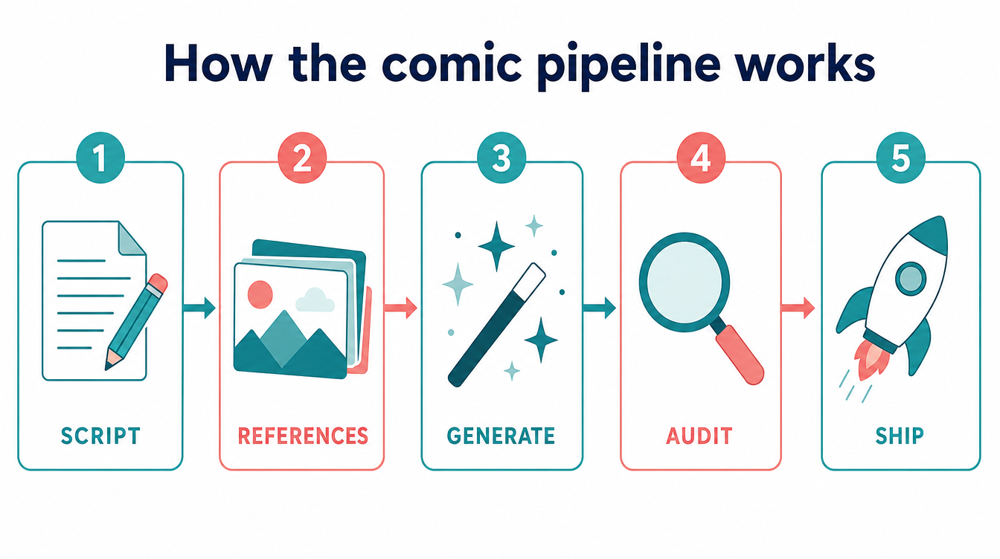
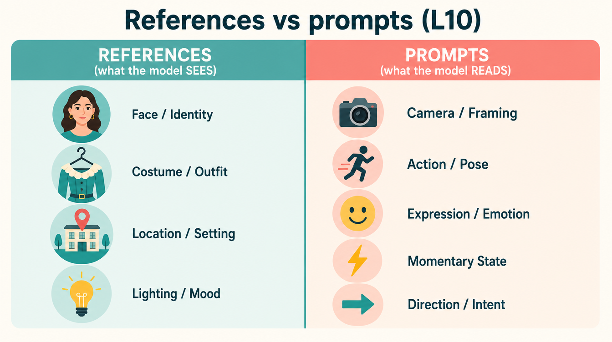
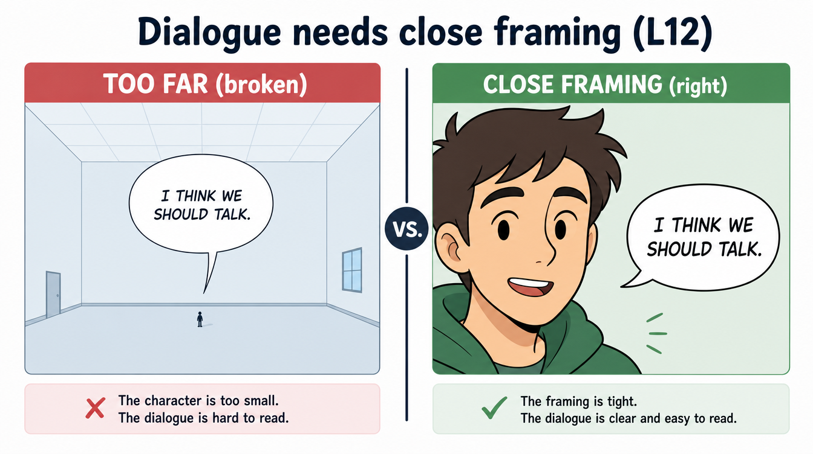
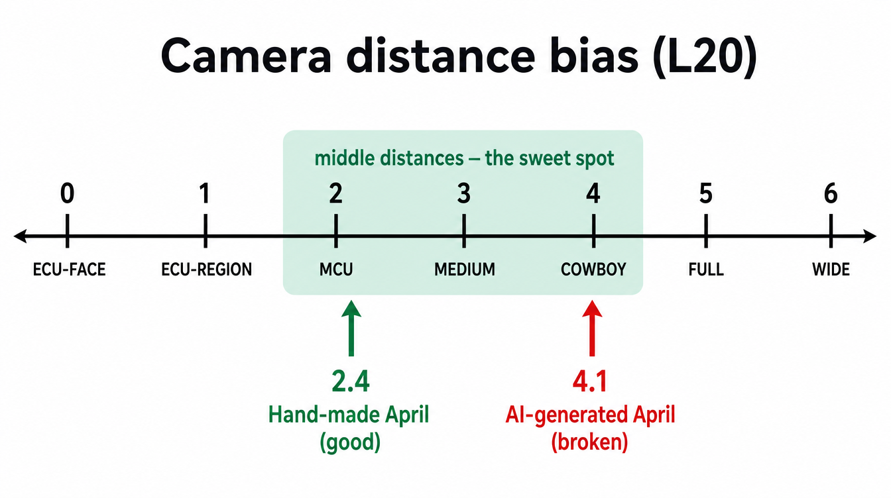
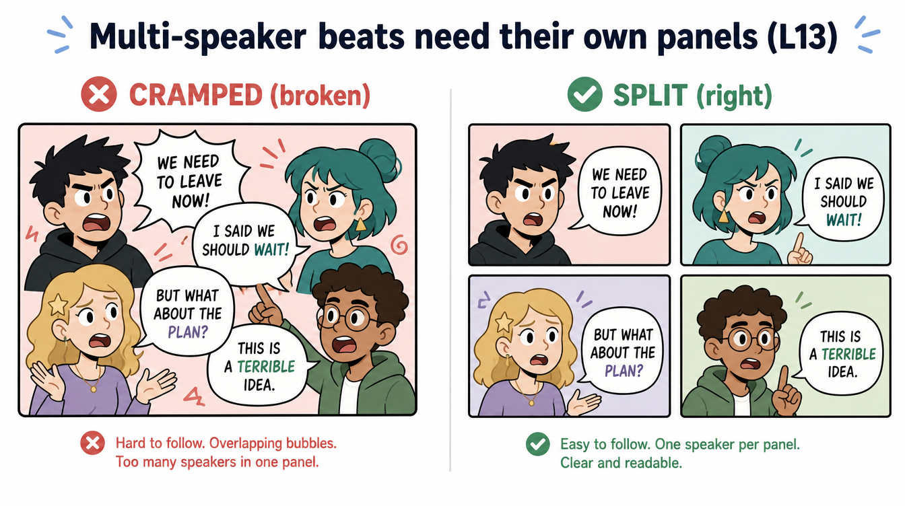
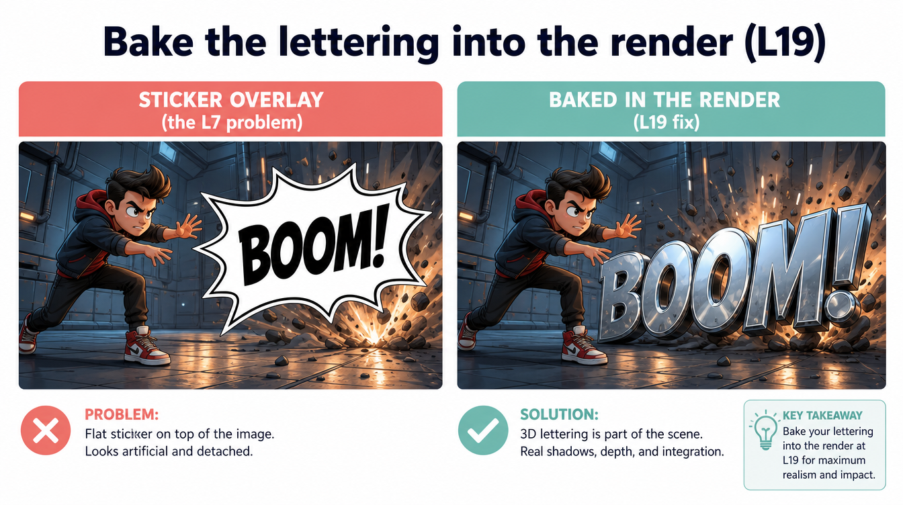
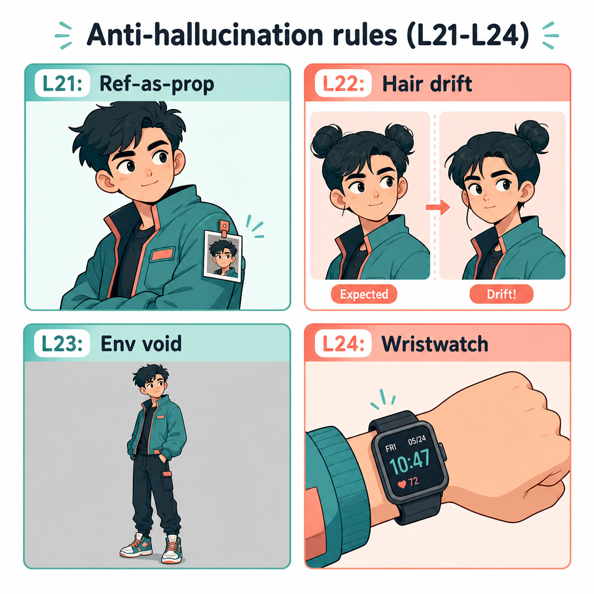

# The Rules, Explained

*Last updated: 2026-05-14*

If you've ever tried generating a comic with AI, you've probably noticed the same things go wrong every time. The character's hair changes between panels. Their costume drifts a little each page. A wide establishing shot has dialogue floating over a tiny figure no one can read. A "transformation" jumps from "before" to "after" with nothing in between.

This pipeline exists because we kept hitting those failures, naming them, and writing down what works. Every rule in this document started as a real broken comic. The rules aren't theoretical — they're scar tissue.

This is the plain-English tour. If you want the technical version, see [`lessons-learned.md`](./lessons-learned.md).

---

## How the pipeline works

A comic moves through five stages.

1. **Script** — break the story into pages and panels. Each panel gets a row in `shotlist.json` with camera, action, dialogue, and (if it's a transformation comic) a body-region beat.
2. **References** — gather visual anchors for every character, location, and prop. These are the "what does this thing look like" answers the AI image model will see attached to every panel that uses them.
3. **Generate** — produce the actual panel images, one at a time, in story order. Each panel chains off the previous one.
4. **Audit** — check that the panels agree with the script and with each other. Some checks are automatic (a Python script reads the shotlist and flags problems); some require looking at the pixels (a separate agent reads each image).
5. **Ship** — letter the final pages and bundle them into a PDF.

Almost every rule below tells you something specific to do — or specifically *not* to do — at one of those stages. Most of the time the failure was: skipping the rule, the comic got generated anyway, and then we had to figure out why it looked wrong.

---

## Chaining and state: don't ask the AI to remember

**L1 — Generate transformation panels in order, not in parallel.** Image generation has no memory between calls. If you submit panels T1 through T10 in parallel, every panel sees the same baseline and the model independently re-derives state from the prompt. You'll get clothing tears that come and go, muscle size that flickers up and down, hair that re-pins itself between frames. The fix is to generate panels sequentially and pass each completed panel as a reference to the next one. The new panel can *see* the prior one and carry forward its state.

**L1.5 — Pick the right prior panel to chain from.** Naïve "always chain to panel N-1" breaks when the views change. If panel 7 is a back shot and panel 8 wants a face close-up, panel 7 isn't a useful reference — the face wasn't even in the frame. Walk backwards through the chain and pick the most recent panel whose camera *category* is compatible with the new one. Front-facing chains to front-facing; back to back; face ECU only chains to other panels where the face was visible.

**L9 — Always capture each panel's job ID before submitting the next.** This is plumbing: if you forget to write down the previous panel's ID, the chain silently breaks. The new panel falls back to "no prior reference" and you get a state regression you might not notice for several panels. The fix is to enforce ID capture in the runner — no panel goes out without its predecessor's ID locked in.

---

## References vs prompts: the most important rule

**L10 — References are the truth, prompts are deltas.** This is the single rule that matters most. Picture the AI getting two kinds of input every time it draws a panel: the *reference images* you attach (face cards, body baselines, location photos), and the *text prompt* you write. When both describe the same thing, the model treats them as competing signals and interpolates. Text usually wins on specifics, which means refs get partially overridden — and you end up with slightly different costume cuts, slightly different chamber architectures, slightly different hair from one panel to the next.

The fix is to commit hard to a division of labor:

- **References carry**: character identity (face, body baseline), costume design (colors, cut, accessories), location architecture, lighting baseline.
- **Prompts carry**: camera (distance, angle, lens), pose, gesture, facial expression, action, momentary lighting state, *changes* in costume state (a new tear, a damp shoulder).

If your prompt re-describes things that are already in the refs ("she wears a blue cheongsam with gold trim"), you're fighting your own references. Stop. The model already knows what the cheongsam looks like — it's in the body baseline. Tell it what's *new this panel*: she throws a high kick, she shouts, the kryptonite cuff falls.

**L10 refinement — Identity vs pose.** The L10 rule does *not* say "describe nothing." It says "describe only what's not in the refs." Pose is in the prompt because no single reference shows every pose. Same for expression, gesture, momentary lighting. A shotlist that says "Chun Li in a hero stance, fists clenched, mouth wide open in a roar" is correct: the pose is new this panel. A shotlist that says "Chun Li wearing her blue cheongsam, white tights, brown boots, twin hair buns" is wrong: all of that is in the body baseline ref. Refs override prompt text on visual identity; prompt overrides refs on pose and action.

---

## Bodies and proportions

**L11 — Cartoony muscle proportions need explicit anchoring.** Transformation comics live on size escalation: she gets bigger across the issue. The AI's default is "plausible fitness model" — a real human at the gym. That's not the genre. The genre is comic-book proportions: shoulders 2-3x normal width, biceps with their own gravitational field. Without aggressive prompt vocabulary AND an attached *size lineup* reference, the model regresses to realistic and you end up with a tier-4 panel that looks like tier 2.

The fix is two-part. First, attach the lineup ref on every panel where the body is the focal subject (full-body shots and stage-change panels). Second, tell the model — in the prompt — exactly which figure on the lineup to match, what specifically about that figure to match (muscle mass, breast size, frame width), and what to *not* borrow from it (face, clothing, pose). Then add the explicit negation: "NOT realistic fitness, NOT athletic — cartoony FMG, comic-book proportions."

Tier 4 is the friction zone. Tier 3 and below the model handles fine. Tier 5 and above is so exaggerated that the lineup carries it naturally. Tier 4 is where the model fights hardest — that's where the vocabulary has to be most aggressive.

---

## Cameras and framing

**L12 — Dialogue panels need close framing.** If a character is speaking on-panel (a speech bubble, a thought, a whisper, a shout — not a narrator caption), the camera has to be close enough that the speaker is the focal point. MCU, medium, cowboy, ECU-face all work. Wide-establish + speech bubble produces panels where the reader can't tell who's talking — the speaker is a tiny figure in a vast room while a giant bubble floats over their head. Caption boxes and off-panel voices are exempt because they're not tied to a visible character. The pipeline detects this conflict automatically and halts before you waste a generation on a broken panel.

**L20 — Default to MCU or closer for transformation comics. Reserve full-body for the reveal.** This one came from a direct measurement. We scored every panel of a hand-made April O'Neil transformation comic and the AI-generated version of the same script on a camera-distance scale (0 = ECU-face, 6 = wide-establish). The hand-made comic averaged 2.4 — most panels were MCU or medium-distance, with one full-body shot reserved for the page-13 reveal. The AI version averaged 4.1 — almost everything was full-body, with zero panels in the middle distances.

The AI version's transformation event never *happened* on the page. Chest growth shot at full-body framing reads as "before/after" — you see the result, you don't feel the change. At MCU framing the chest fills the panel and the reader has nowhere else to look. The body region that's transforming has to dominate the frame.

The rule: chapter mean ≤ 3.0, at least 30% of panels in the middle distances (MCU/medium/cowboy), full-body reserved for the climax. The pipeline enforces all three automatically as hard gates at the shotlist stage — before any generation cost is paid.

**L13 — Split multi-speaker beats into multiple panels.**

If a beat has three or more dialogue lines from two or more on-screen speakers, do not draw it as one panel. The cramped sitcom-freeze-frame doesn't work — reading order goes ambiguous, no individual character is the focal point, and the AI tends to compress everyone into a lineup that looks like a yearbook photo. Split into one panel per speaker. The pipeline detects this at script-breakdown time and refuses to advance until it's fixed.

---

## Dialogue and lettering: from "never bake" to "always bake"

This is the rule that flipped completely.

**L7 (historical) — Don't bake speech bubbles or SFX into the render.** For a while the pipeline added all lettering as vector overlays *after* the panel was generated. The reason: when you put comic-coded vocabulary ("speech bubble", "POW!", "comic panel") into a CGI prompt, the model drifts toward 2D illustration training data, and you get a panel that looks half-rendered, half-cartoon. Page-composer was built specifically to add lettering post-render with vector graphics.

**L19 (current) — Bake the lettering in, but anchor hard.** L7's diagnosis was correct (comic vocab pulls toward 2D) but the prescription was over-corrected. Vector overlays produced a "CGI panel with stickers on top" look — clean but inert, no shadows, no integration. L19 keeps the lettering in the render and counters the 2D pull with aggressive anchoring at both ends of the prompt:

- **Open with concrete render-engine vocabulary**: "Hyperrealistic DAZ3D Studio 3D CGI render, ray-traced subsurface scattering, physically-based rendering, 8K texture detail."
- **Describe lettering as physical scene objects**: a chrome-extruded "BOOM" with real shadows on the floor; a semi-translucent floating speech panel with a tail; an in-scene caption plaque.
- **Close with explicit negation**: "NOT a comic, NOT an illustration, NOT anime, NOT 2D drawn art. Photographic CGI render."

Both ends are load-bearing. Without the opening anchor the lettering drifts to 2D; without the closing negation the lettering renders fine but the body drifts to illustration anyway.

**L4 — Speech bubble positioning and tail direction.** L4 was originally deprecated under L7 ("we don't bake bubbles anyway"). When L19 reversed L7, L4 came back to active. If you bake bubbles into the render, you have to tell the model where each bubble goes (upper-left, upper-right), which direction its tail points (toward the speaker's mouth), what shape it is (round, jagged for shouting, dashed for whispering, cloud-shaped for thoughts), and exactly what text it contains in quotes. Vague "she says something" prompts produce vague bubbles.

---

## Environments and locations

**L14 — Multi-view location references for shot-reverse-shot.** L10's "refs are truth" rule, applied to locations, means the first time a location appears, you attach a reference image of it. Every subsequent panel in that location attaches the *first accepted panel's image* as the location anchor — the model carries forward the actual chamber you established, not a generic interpretation. That works for sustained-POV scenes (a transformation chamber shot from one consistent angle).

It breaks for dialogue scenes that need shot-reverse-shot — facing one character, then facing the other. A single canonical anchor only shows one direction of the room. The reverse shot has nothing to lock to and the model invents a different room. Fix: hero locations that host shot-reverse-shot should carry multiple env references (`_source.jpg`, `_source-reverse.jpg`), and the chaining picks the side that matches the panel's camera direction. Authoring guidance for now; multi-view automation logged as a follow-up.

---

## Anti-hallucination: stuff the model invents

These four landed on the same day, all from one Chun Li comic post-mortem. They share a shape: the model invents *something specific* that wasn't in your prompt or your refs.

**L21 — Suppress in-scene rendering of reference images.** Occasionally the model takes a reference image you attached (a face card, a size lineup) and renders it as a literal physical object *inside* the scene — a tiny photo stuck to fabric, a badge, a poster on the wall. Caught on a Chun Li ECU where the face card came through as a small photo tucked into her torn sleeve seam. Fix: every panel prompt that attaches any reference image includes the explicit clause *"DO NOT render any reference image as a physical photo, badge, poster, or scene object."* The pipeline auto-injects this now.

**L22 — Name the hair state explicitly in every face-visible panel.** When you rely on the prior-panel reference alone to carry hair state, accessories drift. Twin buns become one bun. Red ribbons turn grey. Hair length jumps. The fix is to name the hair state in every prompt where the head is in frame — derived from the transformation beat: pre-suit-fail keeps twin buns + ribbons; during suit-fail the buns shake loose; post-suit-fail the hair is fully loose, ribbons gone. Explicit beats implicit every time.

**L23 — Inject a verbal location anchor when the env ref gets dropped.** Image generators have a budget on how many reference images you can attach per call. On a stage-change full-body panel — where you need the face card, the prior panel as state anchor, AND the size lineup — you blow the budget and the env ref gets dropped. Without an explicit verbal anchor in the prompt, the background collapses to a grey/blurry studio void. Caught on a Chun Li panel that rendered against a grey nothing while every other panel showed her clean dojo. Fix: when the env ref is dropped, inject five or more named location elements with concrete adjectives into the prompt body — "empty training dojo, wooden floorboards worn from sparring, paper sliding doors stained gold by late-afternoon light, calligraphy scrolls on the back wall, two paper lanterns hanging from exposed beams."

**L24 — Suppress anachronistic accessories explicitly.** Image models hallucinate modern accessories on characters — wristwatches, bracelets, rings, earrings, necklaces — even when the canonical character wears none. Wrists, necks, ears, and ring fingers are hotspots. Caught on a panel where Chun Li had a digital wristwatch alongside her canonical spiked wristband. Fix: when those body parts may be in frame, include both a canonical-inventory line ("white spiked wristbands on both wrists") AND an explicit negation list ("no wristwatch, no bracelets, no rings, no earrings, no necklace"). The negation is the load-bearing part.

---

## Cumulative state across panels

These three are about continuity of detail across the issue.

**L25 — Body-region reveals are sticky. Once exposed, must stay exposed.** A body region (the abs, a shoulder) gets clearly revealed in one panel — say, a blouse riding up during transformation. Then a later panel in the same costume state shows the blouse mysteriously covering the abs again. The transformation's climax gets undone. Fix: when a region has been revealed, the costume_state for every subsequent panel must explicitly note "abs still exposed" — don't just say "blouse tied at chest" and trust the model to remember.

**L26 — Costume identity must be canonical across panels, not generated fresh.** "White top tied at chest" can become a bandeau wrap in one panel and a knotted button-up collared blouse in the next — both valid interpretations of the same prompt, but they're entirely different *garments*. Fix: be specific about the garment family (bandeau wrap vs. knotted t-shirt vs. button-up) and carry the specific phrasing through every panel. The body baseline ref helps, but the prompt has to commit.

**L27 — Skin sheen and texture continuity.** "Ray-traced subsurface scattering, physically-based rendering" gives the model latitude on how oily versus matte the skin looks. Across multiple panels the specular response drifts — one panel shows bodybuilder-competition shine, the next shows natural matte skin. On hyper-muscular silhouettes the highlight surface area is bigger, so the drift is more visible. Fix: lock the skin treatment in the prompt — "natural matte skin with subtle subsurface scattering, not oiled or wet."

---

## Lessons proposed but not yet enforced

> **Note**: these are in the user's running feedback list. They're real observations from comic reviews but they haven't been written up as canonical lessons in `lessons-learned.md` yet, and they're not enforced by the pipeline. Listed here for transparency.

- **L15 (proposed) — Female characters must read as beautiful.** Add a mandatory glamour anchor to every prompt for any female cast member — vogue-cover face quality, expressive eyes, sculpted features. The same vocabulary we used for the Supergirl face-card re-roll.
- **L16 (proposed) — Multi-angle character reference packs.** A face card and one body baseline isn't enough. Costume details drift between panels because no ref shows the back, profile, or 3/4 view. Required set per character: face card + front-full + 3q-full + profile + back + low-angle + ECU-region.
- **L17 (proposed) — Known/canonical characters can't drift in appearance.** Chun Li, Lex Luthor, Supergirl, April O'Neil have canonical looks. Hair, costume cut, proportions must match canon. Practical fix: source refs from canon material and include an explicit "this is the canonical version of X" line in every prompt.
- **L18 (proposed) — Pose anatomy coherence.** Mandatory render line: limbs and torso face the same direction; no impossible twists between hips and torso; abs and feet point the same way. Soft guardrail — won't fix every case but reduces frequency.

---

## Historical and specialized

A few rules from the early days that are either superseded, specialized, or quiet plumbing. Listed for completeness.

- **L2** — Higgsfield's safety filter sometimes rejected maximum-size FMG splash panels. Worked around by softening prompt language at peak tier.
- **L3** — Always use the `.png` result URL, never the `_min.webp`. The webp is a thumbnail; chaining off it destroys quality.
- **L5** — Originally said "attach the lineup ref only on stage-change panels." Superseded by L11, which broadens the attachment rule to every full-body panel.
- **L6** — The MCU's `job_display` tool only returns the latest result, not the full history. If you need older results, don't rely on the display widget.
- **L7** — See above. Diagnosed the 2D-drift failure; prescription reversed by L19.
- **L8** — Cumulative state in multi-beat growth comics (costume tearing, muscle size, hair coming loose). The principle is right; L1 + L25 + L26 + L27 are the active rules covering it now.

---

## How this evolves

Every lesson here started as a real failure in production. Someone generated a comic, something looked wrong, we figured out why, wrote the diagnosis down, and built enforcement where we could. The Python-script gates in [`rules_audit.py`](../../continuity-check/scripts/rules_audit.py) catch the deterministic failures at script-breakdown time. The vision-audit workflow in [`continuity-check`](../../continuity-check/SKILL.md) catches the pixel-level drift after generation.

Some lessons are still authoring guidance only — agents and humans both have to remember them. The pipeline's roadmap is mostly about turning those into enforcement: auto-injection in the prompt composer, hooks at the generation call site, structured rubric audits via subagents.

For the canonical version of any rule, see [`lessons-learned.md`](./lessons-learned.md). For what's currently enforced, see [`commands/build-comic.md`](../../../commands/build-comic.md). For what changed when, see [`CHANGELOG.md`](../../../CHANGELOG.md).

The rules will keep being added to. If you spot a failure mode that isn't covered here, it'll probably end up as the next L-number.
