# The "Grow Island" Style — How It's Shot, and How to Shoot It

*A production guide to a reality-TV-flavored photoreal comic style, reverse-engineered from the 63-page Grow Island pilot and rebuilt as a reusable preset.*

All illustrations in this article were generated with **GPT Image 2** (`gpt_image_2`, 1K, 16:9) using the exact prompt grammar described below — proof that the style reproduces from a clean prompt, not just from the source renders.

---

## What this style *is*

Grow Island looks photoreal because the **render** is photoreal — the same DAZ3D-Iray CGI family as the default house style. What makes it a *distinct* style is everything wrapped around the render: how the page is built, how the camera behaves, how color and light are used, how dialogue is lettered, and how transformations are revealed.

In one sentence: **one full-bleed widescreen cinematic still per page, warm tropical-resort palette, eye-level conversational framing, comic lettering baked into the image, and growth shown as before/after pose-reuse pairs.**

It now ships as the `grow-island` preset in `style-lock/styles/grow-island/` (preset template + deep notes), discoverable alongside `photoreal-daz3d` and `ink-line`.

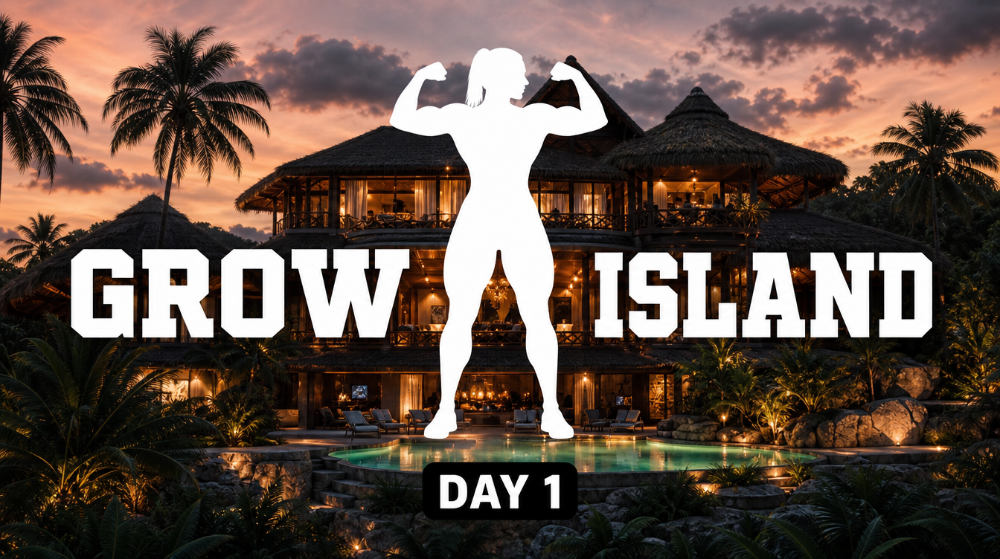
*Fig. 1 — The chapter-title device: a flat white knockout silhouette of a muscular woman in a double-biceps flex splits the **GROW ISLAND** logo, set over a photoreal villa establishing shot, with a small black **DAY 1** time-tab. The figure and type are 2D overlays; the villa is photoreal CGI.*

---

## How to make a comic in this style (the workflow)

If you want to produce a chapter in this style, here's the end-to-end path. It's the standard comic-production pipeline with the `grow-island` preset selected.

### 1. Lock the style
- In your project root, create `style.md` by copying the **Template** block from `style-lock/styles/grow-island/preset.md`.
- Fill the placeholders: project name, the **cast wardrobe-accent table** (one high-chroma garment hue per character — this is identity, not mood), your **location constants**, and your **growth tiers**.
- Key settings this preset hard-codes: **16:9 landscape**, **one full-bleed splash per page** (no panel grids/gutters), **baked-in lettering**, backgrounds softened to bokeh so the figure is sharpest.

### 2. Break down the script
- Run `script-breakdown` to turn the script into a per-page shotlist. Because this style is **one image per page**, each shotlist row = one page = one prompt.
- Tag every page with a **shot distance** (medium / medium-close / wide / extreme body-part crop / full-body reveal) and a **camera angle** (default eye-level; reserve low/high/dutch for intent). See the rhythm rules below.
- Capture **dialogue, captions, and SFX** per page — they get baked into the render, so they belong in the prompt.

### 3. Gather references & lock identity
- Per character, lock a **face/hair reference** and the **current-tier body reference**. The single biggest continuity risk in the source pilot was identity drift across scene cuts — refs are the fix.
- Keep the **muscle-size lineup** handy for any growth tier change (attach on stage changes, name the size number in the prompt).

### 4. Generate, page by page
- Compose each prompt as: **render prefix → shot/angle → environment → character (with locked wardrobe accent) → action + mechanical facial expression → baked lettering spec → style suffix + negative.**
- **Chain progressive sequences** (transformations, dressing, charge-ups): each page references the prior page's job ID **plus** the canonical face ref, and you chain **view-aware** — only pull state from a prior page whose camera view is compatible (don't inherit a back-view's framing into a front shot).
- On Higgsfield: 1 image per submit (it's paid). On Flow: 4 per submit (it's free). Verify every job reaches a terminal state before moving on.

### 5. QA & assemble
- Run `continuity-check`: monotonic size (never shrinks), stable wardrobe accents, face identity across cuts, no branding bleed.
- Because lettering is baked, `page-composer` is **layout + PDF only** — it does not letter. One accepted page render = one final shippable page.

### Content-policy note (learned producing this article)
On stricter classifiers (e.g. GPT Image 2), **swimwear + body-emphasis framing trips the NSFW filter** even for tasteful athletic content. Two of this article's figures were rejected as swimsuit shots and **passed instantly when reframed into athletic activewear** (tank top / crop top + leggings). When a body-focused panel keeps getting blocked, the cheapest fix is more coverage and a wider frame, not repeated identical retries.

---

## The art direction, principle by principle

### Page construction — one cinematic still, never a grid

The defining structural trait: **every page is a single full-bleed image.** No multi-panel grids, no gutters — anywhere across all 63 source pages. A page is a film frame, not a comics grid. This is why the negative prompt explicitly bans `multi-panel grid` and `portrait aspect`: the base model defaults to taller framing and will invent gutters if you let it.

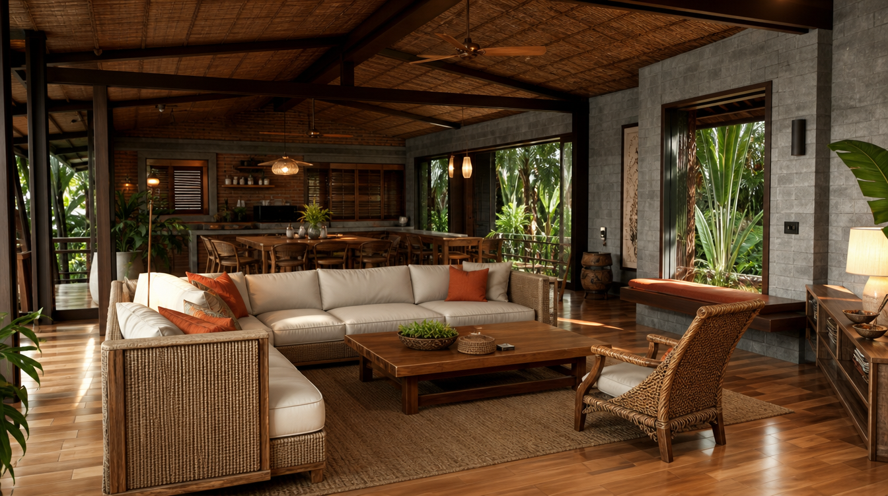
*Fig. 2 — Establishing shot, warm interior mode. The open-plan tropical villa lounge — rattan, cream sofas, orange cushions, thatched beams, honey wood. Warm, soft, low-contrast. This is the home base set; almost everything happens here.*

### Shot-distance rhythm — distance tracks importance

The closer the camera, the more the beat is *about the body*. Dialogue lives at medium; the instant a body changes, the camera crops in tight on just that part.

| Function | Distance | Subject fills |
|---|---|---|
| Dialogue / intro | Medium → medium-close | 55–90% frame H |
| Scene-setting / ensemble | Wide / establishing | bodies 15–40% H |
| Growth beat | Extreme body-part crop (often faceless) | 85–95% H |
| Transformation payoff | Full-body reveal | ~70% H |

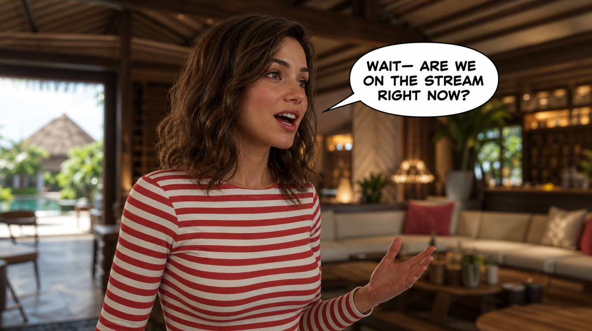
*Fig. 3 — The workhorse: a medium, eye-level dialogue shot. One subject dominant, background softened to bokeh, an expressive face turned **off-camera**, and a baked white all-caps speech bubble with a tail to the speaker's mouth.*

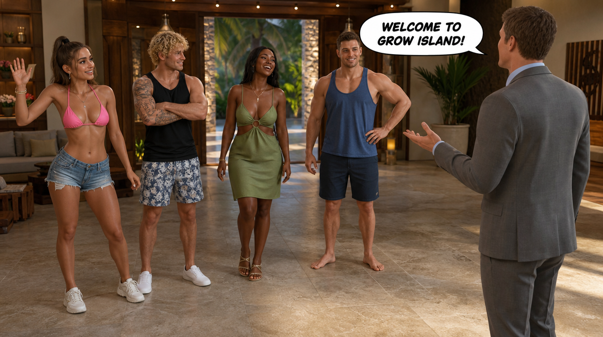
*Fig. 4 — Ensemble wide. Contestants in a loose line-up facing the host (grey suit, right). Note the deliberately **varied** poses and gazes — the anti-"police-lineup" rule — and the host's bubble carrying the scene.*

### Camera angle — eye-level is home base

The camera sits at eye level by default; that calm baseline is exactly what makes a rare angle land. Angle changes are used *for meaning*: low-angle to monumentalize a growing or victorious figure, slight high-angle for intimacy, dramatic high/dutch for stair/transition beats, one bird's-eye for an exterior finale.

*Fig. 5 — Low-angle "hero" framing looking up at a triumphant flex against open sky. The worm's-eye angle makes the figure monumental — reserved for victory/growth peaks, not everyday dialogue. (Rendered in activewear; see the content-policy note.)*

### Color & lighting — two modes, one accent

A warm tropical-resort base (tans, cream, golden wood, bronze skin), switched between two lighting modes per scene, with **one high-chroma wardrobe accent per character** doing the work of legibility against the neutral set.

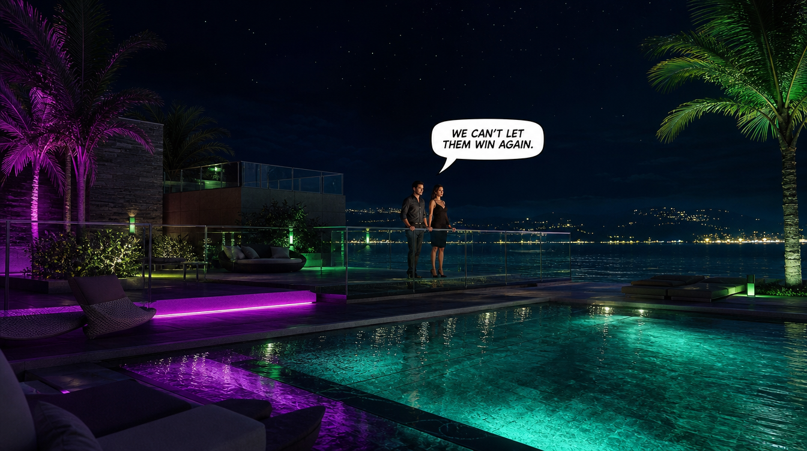
*Fig. 6 — Cool-night mode: navy sky, dark teal water, charcoal architecture, low-key drama, warm key on the faces — here pushed further with magenta/lime neon deck accents. The same world as Fig. 2, inverted in temperature.*

### Faces & gaze — expressive, and never at the camera

Close-ups carry strong, specific emotion (warm smiles, smug half-smiles, alarm, gasping strain). The hard rule: characters look **at each other or off-camera**, never at the viewer — with two deliberate exceptions: the host addressing the show, and the **confessional aside**.

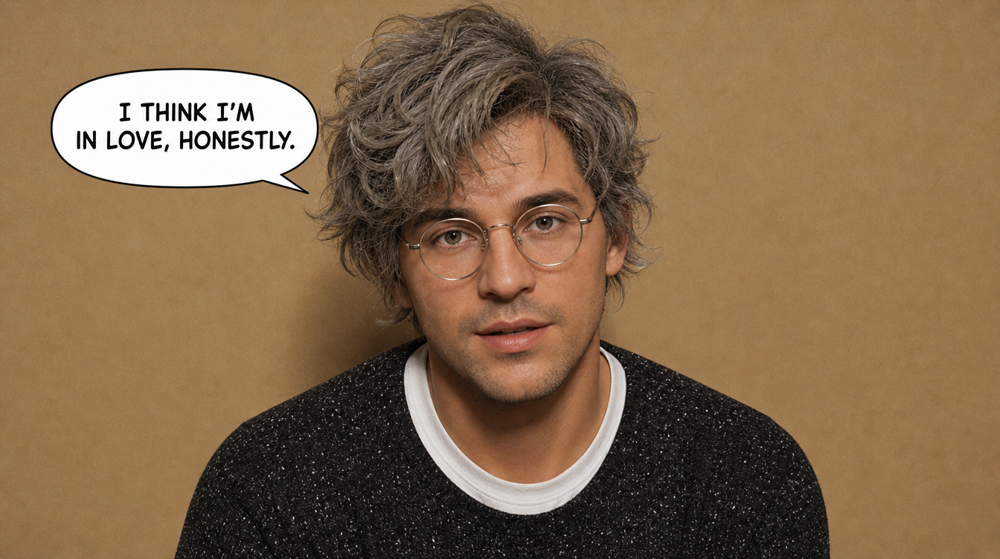
*Fig. 7 — The reality-TV confessional: a single character against a plain flat wall, looking **directly into the lens** (the sanctioned fourth-wall break), with a bubble delivering the aside. Plain backdrop, no scenery bokeh — the cue that says "interview," not "scene."*

### Lettering — baked in, three registers

Lettering is part of the render, not a post step. Three registers:

1. **Speech** — white oval bubbles, thin black outline, short tail, bold all-caps (Figs. 3, 4, 6, 7).
2. **Character-ID plates** — a white rounded rectangle, "NAME – ROLE," for intros.
3. **Title / time tabs** — small black box, white caps ("DAY 1", "NIGHT 1") (Fig. 1).

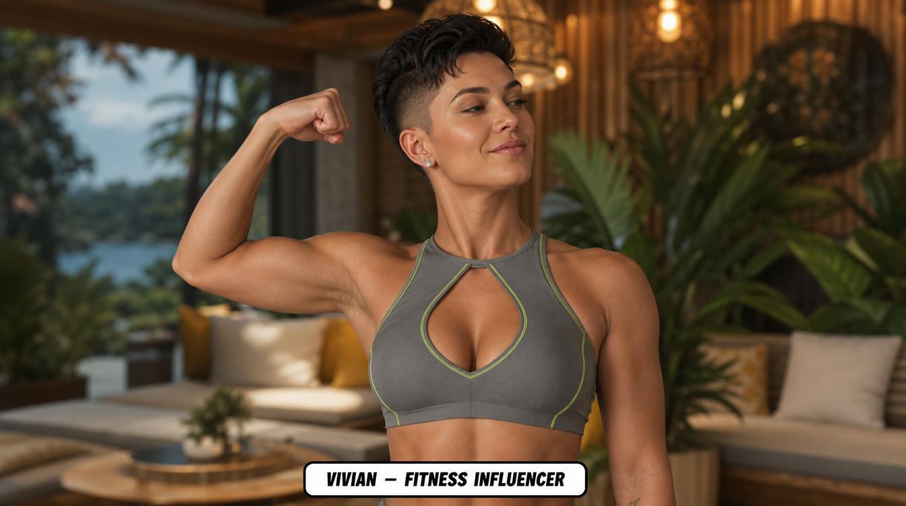
*Fig. 8 — The intro ID-plate convention: a bottom-edge white rounded rectangle reading **"VIVIAN – FITNESS INFLUENCER."** GPT Image 2's text rendering keeps the plate crisp and legible — a big reason this style bakes lettering rather than deferring it.*

**SFX** is its own flourish: bold all-caps block letters in an **orange→yellow vertical gradient** with a black outline + drop shadow, set beside the changing body part.

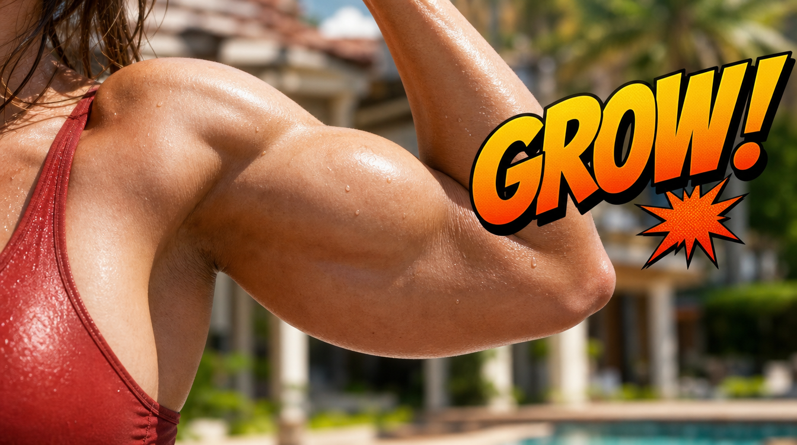
*Fig. 9 — SFX register: a "GROW!" word in the signature orange→yellow gradient with black outline and drop shadow, placed against the muscle it describes. Non-verbal sounds (*GASP*, *PHEW*) instead go inside ordinary bubbles.*

### The growth-reveal grammar — before/after pose-reuse pairs

The signature storytelling device. Transformations are **on-demand, body-part-at-a-time, and monotonic** (a grown body never shrinks back). Each beat is rendered as **two consecutive pages that share an identical composition** — a "before," then an "after" with the localized size increase plus an adjacent SFX word. The "after" page is chained off the "before" page's job ID so the pose, wardrobe, and face carry forward exactly.

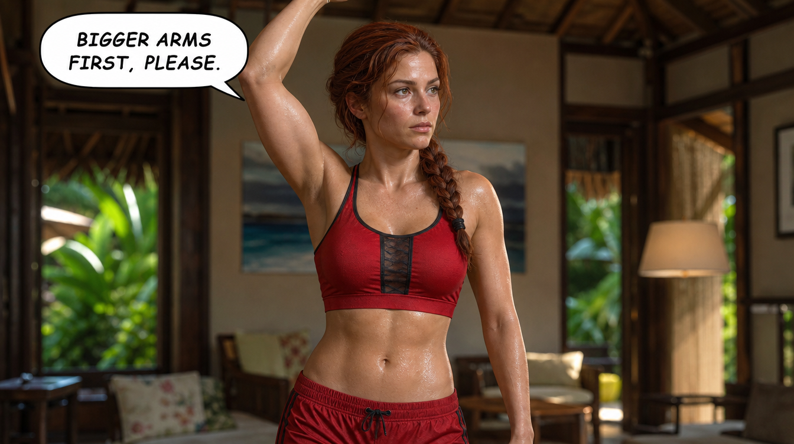
*Fig. 10 — BEFORE frame. Clean, neutral composition; arm raised presenting a still-modest bicep; a bubble naming the request ("BIGGER ARMS FIRST, PLEASE"). This frame becomes the visual anchor for its pair.*

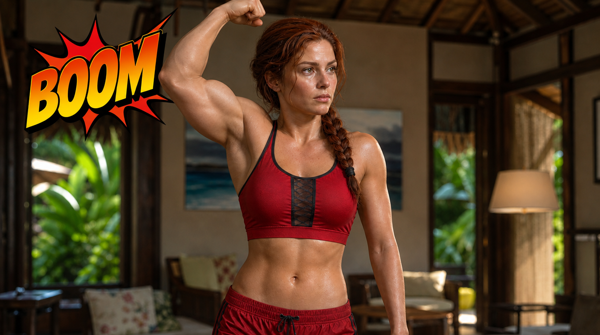
*Fig. 11 — AFTER frame, generated by **chaining off Fig. 10's job** so pose/wardrobe/face stay identical — only the bicep grows, and a "BOOM" SFX marks the change. This pose-reuse pairing is what keeps growth reading as continuous rather than a jarring re-roll.*

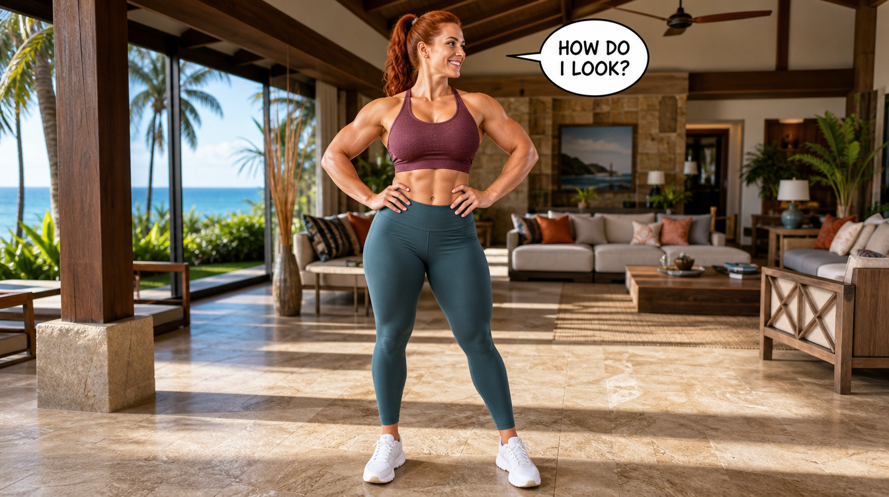
*Fig. 12 — The payoff: a full-body reveal at standing distance with the background brought to full sharpness (reveals are the one place backgrounds resolve, vs. the bokeh of dialogue shots), capped with a "HOW DO I LOOK?" bubble. A transformation arc always lands on a frame like this.*

---

## Reproduction checklist

Pin these and the style holds:

- [ ] **One full-bleed 16:9 image per page.** No grids, no gutters.
- [ ] **Eye-level by default;** angle changes only for meaning.
- [ ] **Distance tracks importance:** medium for talk, tight crops for growth, full-body for reveals.
- [ ] **Warm-resort base + two lighting modes;** one fixed wardrobe-accent hue per character.
- [ ] **Backgrounds softened** on close/medium; sharp only on reveals.
- [ ] **Faces expressive, off-camera** — except host + confessional.
- [ ] **Lettering baked in:** white all-caps bubbles, NAME–ROLE plates, DAY/NIGHT tabs, orange→yellow gradient SFX.
- [ ] **Growth = before/after pose-reuse pairs,** chained view-aware, monotonic, ending on a full-body reveal.
- [ ] **Healthy natural skin tone** on muscle (never red/inflamed); wet glistening skin.

---

## Continuity watch-outs (from the source pilot)

The pilot's drift was never in the render quality — it was identity across cuts. Lock these before a sequel:

- **Lock one face/hair ref per character** — the source drifted male leads (wavy↔straight, brown↔blond hair) across scene changes.
- **Confirm who's who** — multiple auburn/redhead women and several "partner" men in the back half need disambiguating against the script.
- **Pick canonical spellings/styling** — "Sofia" vs "Sophia"; one hairstyle per scene.
- **Show the growth beat** — when a size jumps between pages, render the transition rather than letting the bigger body just appear.

---

*Style preset: `style-lock/styles/grow-island/` · Deep study, story bible & full audit: `notes.md` in that folder · Figures: GPT Image 2, 1K, 16:9.*
